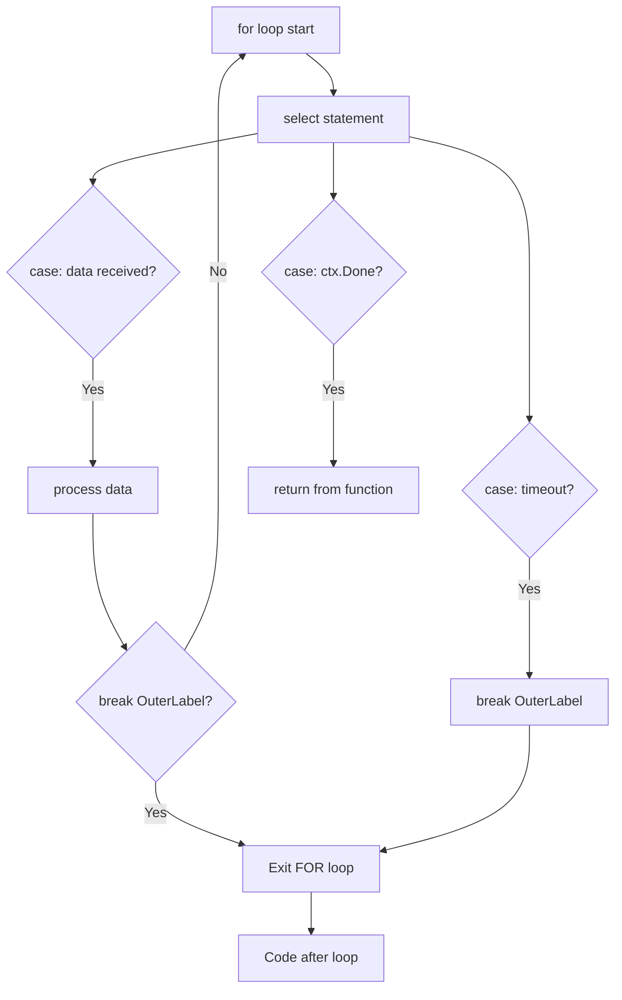

# break Statement — Senior Level

## 1. Compiler Implementation of break

The `break` statement is resolved entirely at compile time. The compiler builds a "break target" stack as it processes nested loops and switch statements. When `break` is encountered, it emits a `JMP` to the address immediately following the innermost applicable construct.

```go
// Source:
for i := 0; i < 10; i++ {
    if i == 5 { break }
}
fmt.Println("done")

// Approximate SSA (simplified):
// b1: loop header: i < 10? if no: goto b3
// b2: body: i == 5? if yes: goto b3; else: increment i, goto b1
// b3: (after loop) call fmt.Println
```

For labeled breaks, the compiler resolves the label to the specific enclosing statement at parse time. Labels that are defined but not used produce a compile error.

---

## 2. break, Goroutines, and Context

In production Go services, the idiomatic equivalent of `break` for long-running goroutines is context cancellation:

```go
package main

import (
    "context"
    "fmt"
    "time"
)

func processor(ctx context.Context, items <-chan int) {
    for {
        select {
        case <-ctx.Done():
            fmt.Println("Processor: context cancelled:", ctx.Err())
            return // "break" for goroutine = return
        case item, ok := <-items:
            if !ok {
                fmt.Println("Processor: channel closed")
                return
            }
            fmt.Println("Processing:", item)
        }
    }
}

func main() {
    ctx, cancel := context.WithTimeout(context.Background(), 200*time.Millisecond)
    defer cancel()

    items := make(chan int, 5)
    for i := 1; i <= 10; i++ { items <- i }

    go processor(ctx, items)
    time.Sleep(300 * time.Millisecond)
}
```

---

## 3. Postmortem 1: break in switch inside for (Silent Data Loss)

**Production incident:** A billing system processed payment records using a switch to categorize transactions.

```go
for _, txn := range transactions {
    switch txn.Type {
    case "refund":
        applyRefund(txn)
        break // intended to stop processing this transaction
              // but actually only exits switch!
    }
    chargeCard(txn) // STILL CALLED for refunds!
    // Customers charged TWICE
}
```

**Impact:** ~3,000 customers double-charged. $150K in emergency refunds. 4 hours of downtime.

**Fix:**
```go
Loop:
for _, txn := range transactions {
    switch txn.Type {
    case "refund":
        applyRefund(txn)
        continue Loop // skip chargeCard for this iteration
    }
    chargeCard(txn)
}
```

Or better: extract to a function with `return`.

---

## 4. Postmortem 2: Goroutine Leak from Blocked Sender After break

**Incident:** A data streaming service consumed partial data from a generator, leaving goroutines blocked.

```go
func stream() <-chan int {
    ch := make(chan int) // unbuffered!
    go func() {
        for i := 0; i < 1000000; i++ {
            ch <- i // blocks when consumer stops
        }
        close(ch)
    }()
    return ch
}

func consume() {
    for v := range stream() {
        if v > 10 {
            break // consumer exits, producer goroutine blocked forever!
        }
        process(v)
    }
}
```

**Fix:**
```go
func stream(ctx context.Context) <-chan int {
    ch := make(chan int)
    go func() {
        defer close(ch)
        for i := 0; i < 1000000; i++ {
            select {
            case <-ctx.Done(): return
            case ch <- i:
            }
        }
    }()
    return ch
}

func consume(ctx context.Context) {
    ctx, cancel := context.WithCancel(ctx)
    defer cancel() // producer exits when consumer returns
    for v := range stream(ctx) {
        if v > 10 { break }
        process(v)
    }
}

func process(v int) { fmt.Println(v) }
```

---

## 5. Postmortem 3: Wrong Assumption About select

**Incident:** A cache service assumed both arms of a select would execute.

```go
func cacheManager(updates <-chan Update, invalidations <-chan string) {
    for {
        select {
        case update := <-updates:
            cache.Set(update.Key, update.Value)
            // Developer assumed execution "falls through" to invalidations case
        case key := <-invalidations:
            cache.Delete(key)
        }
        // Bug: thought both cases run per iteration — they don't!
        // select picks EXACTLY ONE case per iteration
    }
}
```

**Lesson:** `select` in Go picks exactly ONE case per iteration. No fallthrough, no break needed between cases. Each iteration is independent.

---

## 6. Performance: Break vs Condition Check

```go
package main

import "testing"

var data = make([]int, 1000000)

func init() { data[999999] = 99 } // target at the end

func BenchmarkBreakEarly(b *testing.B) {
    for n := 0; n < b.N; n++ {
        for _, v := range data {
            if v == 99 { break }
        }
    }
}

func BenchmarkCheckAll(b *testing.B) {
    for n := 0; n < b.N; n++ {
        found := false
        for _, v := range data {
            if v == 99 { found = true }
        }
        _ = found
    }
}
// Target at end: break slightly slower (branch at every element)
// Target at start: break 10000x faster
```

---

## 7. break and the CPU Branch Predictor

Modern CPUs predict the outcome of conditional branches. For a `break` condition:

- **Rare break (found late in slice):** CPU predicts "not breaking" — correct most of the time, fast
- **Frequent break (found early):** CPU initially mispredicts, then learns — adapts after warm-up
- **Random positions:** Each misprediction costs ~15-20 CPU cycles

```go
// Branch predictor-friendly: sort items so target appears at a predictable position
// Or: use SIMD-optimized search (strings.IndexByte, bytes.Index)
// For generic data: accept the branch misprediction cost
```

---

## 8. break in Iterator Pattern (Go 1.23)

```go
package main

import (
    "fmt"
    "iter"
)

// Custom iterator: yields values, respects break
func IntsUpTo(n int) iter.Seq[int] {
    return func(yield func(int) bool) {
        for i := 0; i < n; i++ {
            if !yield(i) {
                return // consumer called break — yield returned false
            }
        }
    }
}

func TakeWhile[T any](seq iter.Seq[T], pred func(T) bool) iter.Seq[T] {
    return func(yield func(T) bool) {
        for v := range seq {
            if !pred(v) { return } // stop when pred fails
            if !yield(v) { return } // stop when consumer breaks
        }
    }
}

func main() {
    for v := range TakeWhile(IntsUpTo(100), func(n int) bool { return n < 6 }) {
        fmt.Println(v) // 0 1 2 3 4 5
        // break here causes yield to return false, stops iteration
    }
}
```

---

## 9. Mermaid: break in select with Label



---

## 10. break and Deadlines in Production Systems

```go
package main

import (
    "context"
    "fmt"
    "time"
)

type BatchProcessor struct {
    maxItems    int
    maxDuration time.Duration
}

func (bp *BatchProcessor) Process(ctx context.Context, items <-chan string) []string {
    var processed []string
    deadline := time.After(bp.maxDuration)

Batch:
    for len(processed) < bp.maxItems {
        select {
        case <-ctx.Done():
            fmt.Println("Context cancelled")
            break Batch
        case <-deadline:
            fmt.Println("Batch time limit reached")
            break Batch
        case item, ok := <-items:
            if !ok {
                fmt.Println("No more items")
                break Batch
            }
            processed = append(processed, item)
        }
    }
    return processed
}

func main() {
    ctx := context.Background()
    items := make(chan string, 100)
    for i := 0; i < 50; i++ {
        items <- fmt.Sprintf("item%d", i)
    }
    close(items)

    bp := &BatchProcessor{maxItems: 10, maxDuration: 1 * time.Second}
    result := bp.Process(ctx, items)
    fmt.Printf("Processed %d items\n", len(result))
}
```

---

## 11. break in Retry Patterns

```go
package main

import (
    "fmt"
    "time"
)

type RetryConfig struct {
    MaxAttempts int
    Backoff     time.Duration
}

func (rc RetryConfig) Do(fn func() error) error {
    var lastErr error
    for i := 0; i < rc.MaxAttempts; i++ {
        if i > 0 {
            time.Sleep(time.Duration(i) * rc.Backoff)
        }
        if err := fn(); err == nil {
            break // success — stop retrying
        } else {
            lastErr = err
            fmt.Printf("Attempt %d/%d failed: %v\n", i+1, rc.MaxAttempts, err)
        }
    }
    return lastErr
}

func main() {
    attempts := 0
    cfg := RetryConfig{MaxAttempts: 5, Backoff: 10 * time.Millisecond}
    err := cfg.Do(func() error {
        attempts++
        if attempts < 3 { return fmt.Errorf("not ready yet") }
        return nil
    })
    fmt.Printf("Done after %d attempts, err=%v\n", attempts, err)
}
```

---

## 12. Analyzing break in Assembly

```go
func findValue(s []int, target int) bool {
    for _, v := range s {
        if v == target { return true }
    }
    return false
}
```

```bash
go tool compile -S main.go | grep -A 30 "findValue"
```

Key assembly patterns:
```asm
TEXT main.findValue(SB)
    MOVQ "".s+8(SP), AX   ; len(s)
    MOVQ "".s+0(SP), CX   ; data ptr
    MOVQ "".target(SP), DX ; target
    XORL SI, SI            ; i = 0
loop:
    CMPQ SI, AX            ; i < len?
    JGE  notfound
    MOVQ 0(CX)(SI*8), BX   ; v = s[i]
    CMPQ BX, DX            ; v == target?
    JEQ  found             ; break/return true
    INCQ SI
    JMP  loop
found:
    MOVB $1, "".~r0(SP)
    RET
notfound:
    MOVB $0, "".~r0(SP)
    RET
```

---

## 13. break in Worker Pool Pattern

```go
package main

import (
    "context"
    "fmt"
    "sync"
)

func workerPool(ctx context.Context, jobs <-chan int, workers int) <-chan int {
    results := make(chan int, workers)
    var wg sync.WaitGroup

    for i := 0; i < workers; i++ {
        wg.Add(1)
        go func() {
            defer wg.Done()
            for {
                select {
                case <-ctx.Done():
                    return // "break" for goroutine
                case j, ok := <-jobs:
                    if !ok { return }
                    results <- j * 2
                }
            }
        }()
    }

    go func() {
        wg.Wait()
        close(results)
    }()
    return results
}

func main() {
    ctx, cancel := context.WithCancel(context.Background())
    defer cancel()

    jobs := make(chan int, 10)
    for i := 1; i <= 10; i++ { jobs <- i }
    close(jobs)

    for result := range workerPool(ctx, jobs, 3) {
        fmt.Println(result)
    }
}
```

---

## 14. break vs goto: When goto Makes Sense

```go
// goto is legal in Go but almost always avoidable
// The one legitimate use: error handling in low-level code without defer

// PREFER labeled break:
Search:
    for _, a := range as {
        for _, b := range bs {
            if match(a, b) { break Search }
        }
    }

// AVOID goto equivalent:
    for _, a := range as {
        for _, b := range bs {
            if match(a, b) { goto done }
        }
    }
done:
// goto jumps break structured programming — use only when necessary
```

---

## 15. Refactoring: Labeled break → Function

```go
// BEFORE: Labeled break
func processMatrix(m [][]int) (int, int) {
    var row, col int
Found:
    for i, rowData := range m {
        for j, val := range rowData {
            if isPrime(val) && val > 100 {
                row, col = i, j
                break Found
            }
        }
    }
    return row, col
}

// AFTER: Function with return (cleaner, independently testable)
func findFirstLargePrime(m [][]int) (int, int, bool) {
    for i, rowData := range m {
        for j, val := range rowData {
            if isPrime(val) && val > 100 {
                return i, j, true
            }
        }
    }
    return -1, -1, false
}

func processMatrix(m [][]int) (int, int) {
    row, col, _ := findFirstLargePrime(m)
    return row, col
}

func isPrime(n int) bool {
    if n < 2 { return false }
    for i := 2; i*i <= n; i++ {
        if n%i == 0 { return false }
    }
    return true
}
```

---

## 16. break with Fan-Out Pattern

```go
package main

import (
    "context"
    "fmt"
    "sync"
)

// Process items in parallel; break all workers on first error
func processParallel(ctx context.Context, items []int) error {
    ctx, cancel := context.WithCancel(ctx)
    defer cancel()

    errc := make(chan error, len(items))
    var wg sync.WaitGroup

    for _, item := range items {
        item := item
        wg.Add(1)
        go func() {
            defer wg.Done()
            select {
            case <-ctx.Done(): return
            default:
            }
            if item < 0 {
                cancel() // signal all workers to stop
                errc <- fmt.Errorf("negative item: %d", item)
                return
            }
            fmt.Println("Processed:", item)
        }()
    }

    wg.Wait()
    close(errc)
    for err := range errc {
        if err != nil { return err }
    }
    return nil
}

func main() {
    err := processParallel(context.Background(), []int{1, 2, -3, 4, 5})
    fmt.Println("Error:", err)
}
```

---

## 17. Senior Code Review Checklist

- [ ] Is `break` inside a `switch` within a `for` — intended to exit the `for`?
- [ ] Does `break` after channel receive leave a goroutine blocked (goroutine leak)?
- [ ] Is a labeled `break` clearer as a function extraction with `return`?
- [ ] For `for { select { case <-done: break } }`: does `break` exit the `for`? (No!)
- [ ] Is the label placed on the correct statement (the one to be exited)?
- [ ] Is `break` followed by unreachable code (dead code)?
- [ ] For breaking out of goroutine loops: is `context.Context` used instead?
- [ ] Does the break condition create a branch misprediction in a hot path?

---

## 18. break Behavior Summary Table

| Context | `break` exits... |
|---|---|
| `for` loop | The `for` loop |
| `for range` loop | The `for range` loop |
| `switch` (inside `for`) | Only the `switch` |
| `select` (inside `for`) | Only the `select` |
| `for` with label | The labeled statement |
| `switch` with labeled `break` | The labeled statement |
| Iterator function body (1.23) | Stops iteration (yield returns false) |
| Goroutine event loop | Use `return` not `break` |
