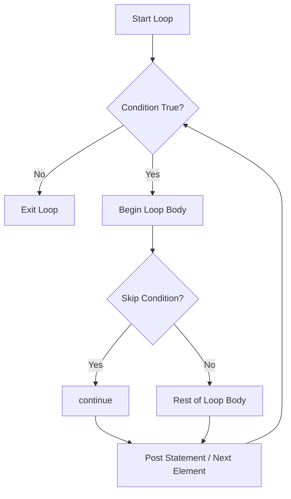

# Go `continue` Statement — Middle Level

## 1. Review: What `continue` Does at the Assembly Level

When the Go compiler sees `continue`, it generates an unconditional jump (`JMP`) to the loop's post statement (for classic `for` loops) or to the next-element logic (for `for range`). There is zero runtime overhead — it compiles to a single branch instruction.

```go
// Source
for i := 0; i < 10; i++ {
    if i == 5 { continue }
    fmt.Println(i)
}

// Equivalent pseudo-assembly
loop_start:
  if i >= 10 { goto loop_end }
  if i == 5  { goto loop_post }  // <-- continue becomes this jump
  call fmt.Println(i)
loop_post:
  i++
  goto loop_start
loop_end:
```

---

## 2. Evolution of `continue` in Go

Go inherited `continue` from C, where it has been present since the 1970s. In Go's early versions (pre-1.0, circa 2009-2012), the language spec carefully defined that:
- `continue` applies to the **innermost** enclosing `for` loop.
- Labeled `continue` allows targeting outer loops.
- `continue` is **not** valid in `switch` or `select` statements unless they are inside a `for` loop.

This design has remained unchanged through Go 1.x. The Go team has explicitly kept `continue` semantics stable as part of the Go 1 compatibility guarantee.

---

## 3. Labeled `continue` — Deep Dive

Labeled `continue` is the most nuanced form. The label must be attached to a `for` statement, not just any block.

```go
package main

import "fmt"

func main() {
    // Label must be directly before the for statement
Rows:
    for row := 0; row < 4; row++ {
        for col := 0; col < 4; col++ {
            if col == 2 {
                continue Rows // jumps to next row, col resets to 0
            }
            fmt.Printf("[%d,%d] ", row, col)
        }
    }
    fmt.Println()
}
// Output: [0,0] [0,1] [1,0] [1,1] [2,0] [2,1] [3,0] [3,1]
```

The label `Rows:` must be in the same function. Go does not allow cross-function labels.

---

## 4. Alternative Approaches to `continue`

There are three main alternatives. Each has trade-offs:

### Approach A: Inverted condition (no `continue`)
```go
for _, item := range items {
    if item.IsValid() {
        process(item)
    }
}
```
Pro: fewer statements. Con: adds nesting level.

### Approach B: `continue` (guard clause)
```go
for _, item := range items {
    if !item.IsValid() {
        continue
    }
    process(item)
}
```
Pro: flat, clear intent. Con: slightly more lines.

### Approach C: Helper function (pre-filter)
```go
valid := filterValid(items)
for _, item := range valid {
    process(item)
}
```
Pro: separation of concerns, testable filter. Con: allocates a new slice.

### When to choose which:
- Simple, one-off filter → `continue` (guard clause)
- Reusable filter logic → helper function
- Simple single condition → inverted `if` (no `continue`)

---

## 5. Anti-Patterns with `continue`

### Anti-Pattern 1: Using `continue` at the end of a loop body
This does nothing — `continue` at the end of a loop body is the same as doing nothing.
```go
// Useless continue — code smell
for _, v := range data {
    process(v)
    continue // pointless, loop would naturally continue here
}
```

### Anti-Pattern 2: Confusing `continue` with `break`
```go
for i := 0; i < 10; i++ {
    if i > 5 {
        continue // BUG: programmer probably wanted break
    }
    fmt.Println(i)
}
// Prints 0,1,2,3,4,5 — but also goes on to iterate 6,7,8,9 doing nothing
```

### Anti-Pattern 3: Infinite loop due to bad placement
```go
i := 0
for i < 10 {
    if i%2 == 0 {
        continue // INFINITE LOOP — i never increments
    }
    fmt.Println(i)
    i++
}
```

### Anti-Pattern 4: Over-using labeled `continue` (complexity signal)
If you need more than one level of labeled `continue`, that is a strong signal to refactor into smaller functions.

---

## 6. `continue` in `for` + `switch` Combination

This is a subtle and important behavior. Inside a `switch` that is inside a `for`, `continue` applies to the **for loop**, not the switch.

```go
package main

import "fmt"

func main() {
    for i := 0; i < 5; i++ {
        switch i {
        case 2:
            fmt.Println("found 2, skipping rest of loop body")
            continue // continues the for loop, not the switch
        case 4:
            fmt.Println("found 4, skipping rest of loop body")
            continue
        }
        fmt.Println("processing:", i)
    }
}
// Output:
// processing: 0
// processing: 1
// found 2, skipping rest of loop body
// processing: 3
// found 4, skipping rest of loop body
```

This is different from `break` in a `switch`, which only exits the `switch` case (not the `for` loop).

---

## 7. Debugging Guide: When `continue` Behaves Unexpectedly

### Problem 1: `continue` seems to not skip anything
Check whether the condition is correct. Use `fmt.Println` to trace.

```go
for i := 0; i < 10; i++ {
    if i == 5 {
        fmt.Println("DEBUG: continuing at", i)
        continue
    }
    fmt.Println("processing", i)
}
```

### Problem 2: `continue` is inside a `switch`, not a `for`
```go
switch x {
case 1:
    continue // compile error: not in a for loop
}
```

### Problem 3: Loop variable not updating before `continue` (while-style loops)
```go
i := 0
for i < 10 {
    if badCondition {
        continue // i never increments → infinite loop
    }
    i++
}
// Fix: always update loop variable before continue
i := 0
for i < 10 {
    i++ // update first
    if badCondition {
        continue
    }
    // ...
}
```

### Problem 4: Wrong label in labeled `continue`
```go
Outer:
    for i := 0; i < 3; i++ {
Inner:
        for j := 0; j < 3; j++ {
            continue Outer // intended to skip j=1, but skips entire outer iteration
            // vs
            continue Inner // skips j=1, stays in outer loop
        }
    }
```

---

## 8. Language Comparison: `continue` in Other Languages

| Language | `continue` syntax | Notes |
|----------|------------------|-------|
| Go | `continue` / `continue Label` | Labeled for outer loops |
| C / C++ | `continue` | No labeled version |
| Java | `continue` / `continue label` | Similar to Go |
| Python | `continue` | No labeled version |
| Rust | `continue` / `continue 'label` | Uses tick-prefix for labels |
| JavaScript | `continue` / `continue label` | Similar to Java/Go |
| Swift | `continue` | No labeled version in most cases |

Go's labeled `continue` is most similar to Java's. Rust uses a tick-prefix (`'label`) which is syntactically distinctive. Python has no labeled `continue` — you must restructure the code or use functions.

---

## 9. Performance: `continue` vs `if-else` Benchmarks

In practice, `continue` and its equivalent `if-else` compile to essentially the same machine code. The Go compiler optimizes both the same way. Here is a benchmark showing they are equivalent:

```go
package main

import "testing"

var data = make([]int, 1000)

func BenchmarkContinue(b *testing.B) {
    sum := 0
    for n := 0; n < b.N; n++ {
        for _, v := range data {
            if v%2 == 0 {
                continue
            }
            sum += v
        }
    }
    _ = sum
}

func BenchmarkIfElse(b *testing.B) {
    sum := 0
    for n := 0; n < b.N; n++ {
        for _, v := range data {
            if v%2 != 0 {
                sum += v
            }
        }
    }
    _ = sum
}
// Results: identical performance — both compile to the same JMP instruction
```

---

## 10. `continue` with Goroutines and Channels

A common pattern is processing items from a channel in a goroutine-based pipeline, using `continue` to filter:

```go
package main

import (
    "fmt"
    "sync"
)

func filter(in <-chan int, out chan<- int, predicate func(int) bool) {
    defer close(out)
    for v := range in {
        if !predicate(v) {
            continue // skip items that don't match predicate
        }
        out <- v
    }
}

func main() {
    in := make(chan int, 10)
    out := make(chan int, 10)

    go func() {
        for i := 0; i < 10; i++ {
            in <- i
        }
        close(in)
    }()

    var wg sync.WaitGroup
    wg.Add(1)
    go func() {
        defer wg.Done()
        filter(in, out, func(n int) bool { return n%2 == 0 })
    }()

    go func() {
        wg.Wait()
        close(out) // safe because filter already closes
    }()

    for v := range out {
        fmt.Println(v)
    }
}
```

---

## 11. `continue` in Iterator Functions (Go 1.22+ range-over-func)

Go 1.22 introduced `range-over-func` (range over iterator functions). `continue` works with these too:

```go
// Go 1.22+
package main

import (
    "fmt"
    "iter"
)

func positives(nums []int) iter.Seq[int] {
    return func(yield func(int) bool) {
        for _, n := range nums {
            if n <= 0 {
                continue // skip negatives
            }
            if !yield(n) {
                return
            }
        }
    }
}

func main() {
    nums := []int{1, -2, 3, -4, 5}
    for n := range positives(nums) {
        fmt.Println(n)
    }
}
```

---

## 12. Practical Pattern: Multi-Stage Validation

Using multiple `continue` statements for multi-stage validation of business objects:

```go
package main

import (
    "fmt"
    "strings"
    "time"
)

type Order struct {
    ID         string
    CustomerID string
    Amount     float64
    ExpiresAt  time.Time
    Status     string
}

func processOrders(orders []Order) {
    now := time.Now()

    for _, o := range orders {
        // Guard: check required fields
        if o.ID == "" || o.CustomerID == "" {
            fmt.Printf("Order missing ID or CustomerID, skipping\n")
            continue
        }

        // Guard: check not expired
        if o.ExpiresAt.Before(now) {
            fmt.Printf("Order %s expired, skipping\n", o.ID)
            continue
        }

        // Guard: check valid amount
        if o.Amount <= 0 {
            fmt.Printf("Order %s has invalid amount %.2f, skipping\n", o.ID, o.Amount)
            continue
        }

        // Guard: check status
        if strings.ToLower(o.Status) != "pending" {
            fmt.Printf("Order %s status is %q, expected 'pending', skipping\n", o.ID, o.Status)
            continue
        }

        // Happy path: process the order
        fmt.Printf("Processing order %s for customer %s: $%.2f\n",
            o.ID, o.CustomerID, o.Amount)
    }
}
```

---

## 13. `continue` and `defer` — Important Interaction

`defer` statements are tied to the **function**, not the loop iteration. `continue` does not trigger `defer`. This is a common source of bugs.

```go
// BUGGY: defer inside loop — defer accumulates, doesn't run per iteration
func processFiles(paths []string) {
    for _, path := range paths {
        f, err := os.Open(path)
        if err != nil {
            continue
        }
        defer f.Close() // BUG: this defers until the function returns, not the iteration
        process(f)
    }
}

// CORRECT: explicit close before continue, or use a closure
func processFiles(paths []string) error {
    for _, path := range paths {
        if err := processOne(path); err != nil {
            fmt.Printf("error processing %s: %v\n", path, err)
            continue
        }
    }
    return nil
}

func processOne(path string) error {
    f, err := os.Open(path)
    if err != nil {
        return err
    }
    defer f.Close() // safe: defer runs when processOne returns
    return process(f)
}
```

---

## 14. `continue` in Complex Loop Patterns

### Pattern: Two-pointer with `continue`
```go
func hasPairWithSum(sorted []int, target int) bool {
    left, right := 0, len(sorted)-1
    for left < right {
        sum := sorted[left] + sorted[right]
        if sum == target {
            return true
        }
        if sum < target {
            left++
            continue
        }
        right--
    }
    return false
}
```

### Pattern: Retry loop with `continue`
```go
func retryOperation(maxRetries int, op func() error) error {
    var lastErr error
    for attempt := 0; attempt < maxRetries; attempt++ {
        lastErr = op()
        if lastErr == nil {
            return nil // success
        }
        fmt.Printf("Attempt %d failed: %v, retrying...\n", attempt+1, lastErr)
        continue // explicit continue (could be omitted, but makes intent clear)
    }
    return fmt.Errorf("all %d attempts failed, last error: %w", maxRetries, lastErr)
}
```

---

## 15. `continue` in Table-Driven Tests

Using `continue` in test loops to skip certain test cases:

```go
package main

import (
    "fmt"
    "testing"
)

func TestDivide(t *testing.T) {
    tests := []struct {
        name     string
        a, b     float64
        want     float64
        skip     bool
        wantPanic bool
    }{
        {"normal", 10, 2, 5, false, false},
        {"negative", -6, 3, -2, false, false},
        {"wip test", 100, 7, 0, true, false}, // skip this test
        {"divide by zero", 5, 0, 0, false, true},
    }

    for _, tt := range tests {
        if tt.skip {
            t.Logf("Skipping test %q (marked as WIP)", tt.name)
            continue // skip WIP tests
        }
        t.Run(tt.name, func(t *testing.T) {
            // ... run test
        })
    }
}
```

---

## 16. Mermaid Diagram: `continue` Flow



---

## 17. Mermaid Diagram: Labeled vs Unlabeled `continue`

```mermaid
flowchart TD
    subgraph Outer Loop
        A[i=0..2] --> subgraph Inner Loop
            B[j=0..2]
        end
    end

    B --> C{j == 1?}
    C -- "continue (unlabeled)" --> D[next j]
    C -- "continue Outer" --> E[next i, reset j]
    C -- No --> F[process i,j]
    D --> B
    E --> A
    F --> B
```

---

## 18. Real-World Example: Log Line Processing

```go
package main

import (
    "bufio"
    "fmt"
    "os"
    "strings"
    "time"
)

type LogEntry struct {
    Timestamp time.Time
    Level     string
    Message   string
}

func processLogFile(filename string) ([]LogEntry, error) {
    f, err := os.Open(filename)
    if err != nil {
        return nil, err
    }
    defer f.Close()

    var entries []LogEntry
    scanner := bufio.NewScanner(f)

    for scanner.Scan() {
        line := scanner.Text()

        // Skip blank lines
        if strings.TrimSpace(line) == "" {
            continue
        }

        // Skip comment lines
        if strings.HasPrefix(line, "#") {
            continue
        }

        // Skip debug lines in production
        if strings.Contains(line, "[DEBUG]") {
            continue
        }

        parts := strings.SplitN(line, " ", 3)
        if len(parts) < 3 {
            fmt.Printf("malformed log line: %q\n", line)
            continue
        }

        t, err := time.Parse(time.RFC3339, parts[0])
        if err != nil {
            fmt.Printf("bad timestamp in line: %q\n", line)
            continue
        }

        entries = append(entries, LogEntry{
            Timestamp: t,
            Level:     parts[1],
            Message:   parts[2],
        })
    }

    return entries, scanner.Err()
}
```

---

## 19. Testing `continue` Behavior

```go
package loops_test

import (
    "testing"
)

// sumOdd uses continue to sum odd numbers
func sumOdd(nums []int) int {
    total := 0
    for _, n := range nums {
        if n%2 == 0 {
            continue
        }
        total += n
    }
    return total
}

func TestSumOdd(t *testing.T) {
    tests := []struct {
        name  string
        input []int
        want  int
    }{
        {"empty", []int{}, 0},
        {"all even", []int{2, 4, 6}, 0},
        {"all odd", []int{1, 3, 5}, 9},
        {"mixed", []int{1, 2, 3, 4, 5}, 9},
        {"negative odds", []int{-1, -3, 2, 4}, -4},
    }

    for _, tt := range tests {
        t.Run(tt.name, func(t *testing.T) {
            got := sumOdd(tt.input)
            if got != tt.want {
                t.Errorf("sumOdd(%v) = %d, want %d", tt.input, got, tt.want)
            }
        })
    }
}
```

---

## 20. `continue` and the `errors.Is` Pattern

```go
package main

import (
    "errors"
    "fmt"
)

var ErrSkip = errors.New("skip this item")

func processItem(item string) error {
    if len(item) == 0 {
        return ErrSkip
    }
    fmt.Println("processing:", item)
    return nil
}

func processAll(items []string) {
    for _, item := range items {
        err := processItem(item)
        if errors.Is(err, ErrSkip) {
            continue // expected skip condition
        }
        if err != nil {
            fmt.Printf("unexpected error for %q: %v\n", item, err)
            continue
        }
    }
}
```

---

## 21. `continue` with `sync.WaitGroup` in Concurrent Loops

```go
package main

import (
    "fmt"
    "sync"
)

func concurrentProcess(items []int) {
    var wg sync.WaitGroup
    results := make(chan int, len(items))

    for _, item := range items {
        if item < 0 {
            continue // skip negatives before spawning goroutine
        }
        wg.Add(1)
        go func(n int) {
            defer wg.Done()
            results <- n * n
        }(item)
    }

    go func() {
        wg.Wait()
        close(results)
    }()

    for r := range results {
        fmt.Println(r)
    }
}
```

---

## 22. `continue` with Context Cancellation

```go
package main

import (
    "context"
    "fmt"
    "time"
)

func processWithContext(ctx context.Context, items []int) error {
    for _, item := range items {
        select {
        case <-ctx.Done():
            return ctx.Err()
        default:
        }

        if item < 0 {
            continue // skip, but check context next iteration
        }

        // Simulate work
        time.Sleep(10 * time.Millisecond)
        fmt.Println("processed:", item)
    }
    return nil
}
```

---

## 23. `continue` with Struct Embedding and Interfaces

```go
package main

import "fmt"

type Processor interface {
    ShouldSkip() bool
    Process()
}

type BaseItem struct {
    Active bool
}

func (b BaseItem) ShouldSkip() bool {
    return !b.Active
}

type Report struct {
    BaseItem
    Title string
}

func (r Report) Process() {
    fmt.Printf("Processing report: %s\n", r.Title)
}

func runAll(items []Processor) {
    for _, item := range items {
        if item.ShouldSkip() {
            continue
        }
        item.Process()
    }
}
```

---

## 24. `continue` in Recursive Patterns (Simulated)

Though Go does not support `continue` across recursive calls, you can simulate multi-level continue using return values:

```go
package main

import "fmt"

type SkipError struct{}

func (e SkipError) Error() string { return "skip" }

func processNode(node int) error {
    if node%3 == 0 {
        return SkipError{} // signal to skip
    }
    fmt.Println("node:", node)
    return nil
}

func processAll(nodes []int) {
    for _, n := range nodes {
        if err := processNode(n); err != nil {
            if _, ok := err.(SkipError); ok {
                continue
            }
            fmt.Println("error:", err)
        }
    }
}
```

---

## 25. Idiomatic vs Non-Idiomatic Usage

### Non-idiomatic (Go style guide discourages):
```go
for i := 0; i < len(s); i++ {
    if s[i] != ' ' {
        if s[i] != '\t' {
            if s[i] != '\n' {
                process(s[i])
            }
        }
    }
}
```

### Idiomatic (go fmt compliant, flat):
```go
for _, ch := range s {
    if ch == ' ' || ch == '\t' || ch == '\n' {
        continue
    }
    process(ch)
}
```

---

## 26. `continue` with Generics (Go 1.18+)

```go
package main

import "fmt"

func FilterSlice[T any](slice []T, keep func(T) bool) []T {
    var result []T
    for _, item := range slice {
        if !keep(item) {
            continue
        }
        result = append(result, item)
    }
    return result
}

func main() {
    ints := FilterSlice([]int{1, 2, 3, 4, 5}, func(n int) bool { return n%2 == 0 })
    fmt.Println(ints) // [2 4]

    strs := FilterSlice([]string{"go", "", "is", "", "great"}, func(s string) bool { return s != "" })
    fmt.Println(strs) // [go is great]
}
```

---

## 27. Code Review Checklist for `continue`

When reviewing code that uses `continue`, check:

- [ ] Is there a risk of infinite loop? (loop variable must increment before `continue`)
- [ ] Is the `continue` inside a `for` loop (not a bare `switch`/`select`)?
- [ ] For labeled `continue`: is the label on a `for` statement?
- [ ] Are `defer` statements inside the loop? (`defer` won't run per-iteration)
- [ ] Does the `continue` make the code clearer, or would an `if-else` be simpler?
- [ ] Are there more than 2 levels of labeled `continue`? If so, consider refactoring.

---

## 28. Compiler Errors Involving `continue`

```
// Error 1: continue outside for loop
continue // error: continue statement outside for

// Error 2: continue with non-for label
MyLabel:
if x > 0 {
    continue MyLabel // error: invalid continue label MyLabel (not a for loop)
}

// Error 3: undefined label
for i := 0; i < 3; i++ {
    continue Missing // error: undefined label Missing
}
```

---

## 29. Advanced: `continue` in Generated Code

The Go standard library's parser (`go/parser`, `go/ast`) represents `continue` as an `*ast.BranchStmt` with `Tok == token.CONTINUE`. This is useful when writing Go code generators or static analysis tools:

```go
import (
    "go/ast"
    "go/token"
)

func isContinueStmt(node ast.Node) bool {
    branch, ok := node.(*ast.BranchStmt)
    return ok && branch.Tok == token.CONTINUE
}

func hasLabel(node *ast.BranchStmt) bool {
    return node.Label != nil
}
```

---

## 30. Summary: Middle-Level Key Points

| Topic | Key Point |
|-------|-----------|
| Compilation | `continue` compiles to a single `JMP` instruction |
| Labeled continue | Must target a `for` statement, same function |
| `switch` + `for` | `continue` in a `switch` inside `for` affects the `for` |
| `defer` interaction | `defer` does NOT trigger on `continue` — only on function return |
| Anti-patterns | Infinite loops, useless end-of-body `continue`, wrong label |
| Performance | Zero overhead vs `if-else` — same machine code |
| Generics | Works perfectly in generic functions (Go 1.18+) |
| Go 1.22 | Works with range-over-func iterators |
| Code review | Check for defer, loop variable update, label correctness |
| Style | Prefer guard clauses with `continue` over deep nesting |
