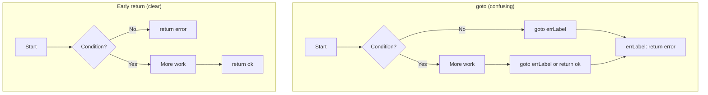

# Go `goto` Statement — Junior Level

> **Important:** `goto` is present in Go but is strongly discouraged in everyday code. This guide teaches you what it is, how it works, and — most importantly — why you should almost never use it and what to use instead.

---

## 1. What is `goto`?

`goto` is a statement that makes the program jump to a labeled location in the same function. It was inherited by Go from C. The word "goto" literally means "go to this label."

```go
package main

import "fmt"

func main() {
    fmt.Println("start")
    goto end    // jump to label "end"
    fmt.Println("this line is never reached")
end:
    fmt.Println("end")
}
// Output:
// start
// end
```

The line "this line is never reached" is skipped entirely because `goto end` jumps past it.

---

## 2. Basic Syntax

```go
// Syntax:
goto LabelName

// Label syntax (label followed by colon):
LabelName:
    // code here
```

Rules:
1. The label must be in the **same function** as the `goto`.
2. The label name is followed by a colon (`:`).
3. `goto` can jump forward (down) or backward (up) in the function.
4. The label must actually be used — an unused label is a compile error.

---

## 3. Why `goto` is Discouraged

`goto` is considered harmful in most modern programming. Here is why:

- **Spaghetti code:** When code can jump to arbitrary labels, the flow becomes hard to follow — like tangled spaghetti.
- **Hard to debug:** You cannot read the code top-to-bottom; you must follow jumps.
- **Hard to test:** Jumping past code means some lines might never execute, and it's not obvious which ones.
- **Better alternatives exist:** Every `goto` can be replaced with `for` loops, `break`, `continue`, `return`, or functions.

```go
// BAD: using goto as a loop
i := 0
loop:
    if i < 5 {
        fmt.Println(i)
        i++
        goto loop
    }

// GOOD: use a for loop instead
for i := 0; i < 5; i++ {
    fmt.Println(i)
}
```

The `for` loop version is cleaner, more readable, and idiomatic Go.

---

## 4. `goto` vs `for` Loop

Here is the same logic side by side:

```go
// With goto (BAD):
func countWithGoto() {
    i := 0
start:
    if i >= 5 {
        goto done
    }
    fmt.Println(i)
    i++
    goto start
done:
    fmt.Println("finished")
}

// With for loop (GOOD):
func countWithFor() {
    for i := 0; i < 5; i++ {
        fmt.Println(i)
    }
    fmt.Println("finished")
}
```

The `for` loop version says exactly what it does in one line. The `goto` version requires 8 lines and mental tracking of 2 labels.

---

## 5. `goto` Forward Jump

`goto` can jump forward (skip code below the `goto`):

```go
func main() {
    x := 10
    if x > 5 {
        goto done // skip the print statement
    }
    fmt.Println("x is not greater than 5")
done:
    fmt.Println("done")
}
// Output: done

// BETTER: use early return instead
func process(x int) {
    if x > 5 {
        fmt.Println("done")
        return // cleaner than goto
    }
    fmt.Println("x is not greater than 5")
    fmt.Println("done")
}
```

---

## 6. `goto` Backward Jump

`goto` can jump backward, creating a loop-like behavior:

```go
func main() {
    i := 0
again:
    if i < 3 {
        fmt.Println(i)
        i++
        goto again // jumps backward
    }
    fmt.Println("done")
}
// Output: 0 1 2 done

// BETTER: use a for loop
func main() {
    for i := 0; i < 3; i++ {
        fmt.Println(i)
    }
    fmt.Println("done")
}
```

---

## 7. Rule: Cannot Jump Over Variable Declarations

This is one of Go's important restrictions on `goto`. You cannot use `goto` to jump over a variable declaration that is later used, because it could leave the variable in an undefined state.

```go
func main() {
    goto end // compile error!
    x := 5  // goto cannot jump over this declaration
    _ = x
end:
    fmt.Println("done")
}
// Error: goto end jumps over declaration of x
```

This restriction prevents bugs where you might use a variable that was never initialized.

---

## 8. Rule: Cannot Jump Into a Block

`goto` cannot jump into a `{}` block (like an `if` body, `for` body, etc.).

```go
func main() {
    goto inside // compile error!
    if true {
inside:         // cannot jump into this block
        fmt.Println("inside")
    }
}
// Error: goto inside jumps into block starting at line N
```

---

## 9. Rule: Label Must Be in the Same Function

A `goto` and its label must be in the same function. You cannot use `goto` to jump to a label in a different function or package.

```go
func foo() {
    goto bar // compile error — 'bar' is not in foo
}

func bar() {
bar:
    fmt.Println("bar")
}
```

---

## 10. The Rare Legitimate Use: Error Cleanup (C Style)

In C, `goto` is commonly used for cleanup on error. In Go, `defer` is a much better alternative. This is shown here only for historical understanding.

```go
// C-style goto cleanup (avoid in Go):
func openBothFiles(path1, path2 string) error {
    f1, err := os.Open(path1)
    if err != nil {
        goto errReturn
    }

    f2, err := os.Open(path2)
    if err != nil {
        f1.Close()
        goto errReturn
    }

    // work with f1, f2
    f1.Close()
    f2.Close()
    return nil

errReturn:
    return err
}

// BETTER: use defer in Go
func openBothFiles(path1, path2 string) error {
    f1, err := os.Open(path1)
    if err != nil {
        return err
    }
    defer f1.Close() // automatically closed on return

    f2, err := os.Open(path2)
    if err != nil {
        return err
    }
    defer f2.Close() // automatically closed on return

    // work with f1, f2
    return nil
}
```

---

## 11. Refactoring `goto` to `return`

The most common `goto` pattern is jumping to an error label. Replace it with `return`:

```go
// BAD:
func validate(s string) bool {
    if len(s) == 0 {
        goto invalid
    }
    if len(s) > 100 {
        goto invalid
    }
    return true
invalid:
    return false
}

// GOOD:
func validate(s string) bool {
    if len(s) == 0 {
        return false
    }
    if len(s) > 100 {
        return false
    }
    return true
}
```

---

## 12. Refactoring `goto` to `for` Loop

```go
// BAD: goto as a loop
func printNumbers() {
    n := 1
loop:
    if n > 5 {
        return
    }
    fmt.Println(n)
    n++
    goto loop
}

// GOOD: use for loop
func printNumbers() {
    for n := 1; n <= 5; n++ {
        fmt.Println(n)
    }
}
```

---

## 13. Refactoring `goto` to `break` with a Label

Sometimes `goto` is used to break out of nested loops. Go has labeled `break` for this:

```go
// BAD: goto to exit nested loops
func findPair(matrix [][]int, target int) (int, int) {
    for i := range matrix {
        for j := range matrix[i] {
            if matrix[i][j] == target {
                goto found
            }
        }
    }
    return -1, -1
found:
    // problem: we've lost i and j!
    return -1, -1 // broken logic
}

// GOOD: use labeled break or return
func findPair(matrix [][]int, target int) (int, int) {
outer:
    for i := range matrix {
        for j := range matrix[i] {
            if matrix[i][j] == target {
                _ = outer // label used
                return i, j // best: return immediately
            }
        }
    }
    return -1, -1
}
```

---

## 14. What `go vet` Says About `goto`

`go vet` does not forbid `goto`, but it will catch certain misuses:
- Jumping over variable declarations
- Jumping into blocks
- Unused labels (actually caught by the compiler, not just `go vet`)

Linters like `staticcheck` and `revive` can be configured to flag `goto` usage entirely.

---

## 15. Historical Context: Why Go Has `goto`

Go includes `goto` for two reasons:
1. **Completeness:** The language spec allows it, and some generated code (like `goyacc`-generated parsers) may use it.
2. **Low-level runtime code:** The Go runtime itself uses `goto` in a few very low-level functions where structured control flow cannot express the intent efficiently.

For application code, you will almost never — and should almost never — use `goto`.

---

## 16. Simple Flow Diagram: `goto`

```
Normal code flow:      With goto:
A                      A
B              →       goto end  ──────────────┐
C                      B (never runs)           │
D                      C (never runs)           │
E              ←       end: ←───────────────────┘
                       E
```

When you use `goto end`, everything between the `goto` and the `end:` label is skipped.

---

## 17. Mermaid Diagram: `goto` vs Clean Code



---

## 18. When Would You Actually Use `goto` in Go?

Almost never. The only reasonable cases are:
1. **Generated code** — Tools like `goyacc` generate Go code with `goto`.
2. **Porting C code** — If you are translating C code to Go directly, `goto` may appear temporarily before refactoring.
3. **State machines** (debated) — Some argue `goto` can represent state transitions, but Go's `switch` and maps of functions are better.

If you find yourself wanting `goto`, ask: "Can I use a `for` loop, `break`, `return`, or `defer` instead?" The answer is almost always yes.

---

## 19. Compile Errors You Will See With `goto`

```
// Error 1: jump over variable declaration
goto skip
x := 10  // Error: goto skip jumps over declaration of x at line N
skip:

// Error 2: jump into block
goto inside
{
inside:    // Error: goto inside jumps into block at line N
    x := 5
}

// Error 3: undefined label
goto nowhere  // Error: label nowhere undefined

// Error 4: unused label
myLabel:      // Error: label myLabel defined and not used
fmt.Println("hi")
```

---

## 20. `goto` in Generated Code: `goyacc` Example

`goyacc` is a Go port of the `yacc` parser generator. Generated parsers use `goto` because the generator produces state machine transitions as gotos. You would never write this by hand:

```go
// Generated by goyacc (DO NOT EDIT)
// This is what generated parser code may look like
func yyParse(yylex yyLexer) int {
    // ... hundreds of lines
    goto yystack
yystack:
    // ... state machine
    goto yydefault
yydefault:
    // ...
}
```

This is an example of `goto` used legitimately — but by a machine, not a human.

---

## 21. Refactoring Exercise: Replace Every `goto`

```go
// Before (with goto):
func checkAge(age int) string {
    if age < 0 {
        goto invalid
    }
    if age > 150 {
        goto invalid
    }
    if age < 18 {
        goto minor
    }
    return "adult"

invalid:
    return "invalid age"
minor:
    return "minor"
}

// After (clean Go):
func checkAge(age int) string {
    if age < 0 || age > 150 {
        return "invalid age"
    }
    if age < 18 {
        return "minor"
    }
    return "adult"
}
```

The clean version is 7 lines instead of 13. No labels, no jumps, clear logic.

---

## 22. `goto` and Readability

Research in software engineering consistently shows that code with `goto` is harder to:
- Read and understand
- Maintain and modify
- Test (code coverage becomes complex)
- Review in code review

The famous paper "Go To Statement Considered Harmful" by Edsger W. Dijkstra (1968) argued against `goto` 56 years ago. Go's designers knew this history and included `goto` but strongly discourage its use.

---

## 23. A Complete Refactoring Example

```go
// BEFORE: C-style code with goto, ported to Go
func parseConfig(data []byte) (Config, error) {
    var cfg Config

    if len(data) == 0 {
        goto parseError
    }

    if data[0] != '{' {
        goto parseError
    }

    if err := json.Unmarshal(data, &cfg); err != nil {
        goto parseError
    }

    if cfg.Host == "" {
        goto parseError
    }

    return cfg, nil

parseError:
    return Config{}, errors.New("invalid config")
}

// AFTER: idiomatic Go
func parseConfig(data []byte) (Config, error) {
    if len(data) == 0 {
        return Config{}, errors.New("invalid config: empty data")
    }
    if data[0] != '{' {
        return Config{}, errors.New("invalid config: not a JSON object")
    }
    var cfg Config
    if err := json.Unmarshal(data, &cfg); err != nil {
        return Config{}, fmt.Errorf("invalid config: %w", err)
    }
    if cfg.Host == "" {
        return Config{}, errors.New("invalid config: missing host")
    }
    return cfg, nil
}
```

The clean version also provides better error messages — you know exactly what was wrong.

---

## 24. Summary: `goto` vs Alternatives

| Use case | `goto` (avoid) | Better alternative |
|----------|---------------|-------------------|
| Looping | `goto loop` | `for` loop |
| Exit on error | `goto errLabel` | `return err` |
| Skip code | `goto skip` | `if-else` or `return` |
| Cleanup | `goto cleanup` | `defer` |
| Exit nested loops | `goto done` | labeled `break` or `return` |
| State machine | `goto stateN` | `switch`, maps, or enum |

---

## 25. Quick Reference

```go
// SYNTAX (know it, but avoid using it):
goto LabelName

LabelName:
    // code

// RESTRICTIONS:
// 1. Same function only
// 2. Cannot jump over variable declarations
// 3. Cannot jump into blocks

// ALTERNATIVES:
for { ... }         // instead of goto loop
return err          // instead of goto errLabel
defer f.Close()     // instead of goto cleanup
break outerLabel    // instead of goto done (for nested loops)
if-else / switch    // instead of goto for branching
```

---

## 26. Practice: Rewrite These `goto` Programs

**Exercise 1:** Rewrite this without `goto`:
```go
func abs(n int) int {
    if n >= 0 {
        goto positive
    }
    n = -n
positive:
    return n
}
```

**Exercise 2:** Rewrite this without `goto`:
```go
func sumTo(max int) int {
    sum := 0
    i := 1
top:
    if i > max { goto done }
    sum += i
    i++
    goto top
done:
    return sum
}
```

**Exercise 3:** Rewrite this without `goto`:
```go
func findFirst(data [][]int, target int) (int, int) {
    for i := range data {
        for j := range data[i] {
            if data[i][j] == target {
                goto found
            }
        }
    }
    return -1, -1
found:
    // Cannot access i and j here — this is also a bug!
    return 0, 0
}
```

---

## 27. What Happens at Runtime

`goto` is one of the simplest instructions in the generated machine code — it becomes a single unconditional `JMP` instruction. The label becomes a memory address, and `goto` tells the CPU to jump to that address.

```asm
; goto end compiles to:
JMP .L_end       ; unconditional jump to label "end"

; end: in Go source becomes:
.L_end:          ; label (just an address marker)
```

Despite being simple at the machine level, `goto` is dangerous at the human level because it makes programs hard to reason about.

---

## 28. The Principle Behind Avoiding `goto`

**Structured programming** is the idea that programs should be built from three structures:
1. **Sequence** — do A, then B, then C
2. **Selection** — `if`/`switch`
3. **Repetition** — `for` loop

These three structures are enough to write any program. `goto` breaks structure by allowing arbitrary jumps. Go enforces structured programming by providing powerful structured alternatives and discouraging `goto`.

---

## 29. Summary of Go `goto` Rules

| Rule | Detail |
|------|--------|
| Scope | Same function only |
| Direction | Forward or backward |
| Cannot jump over | Variable declarations |
| Cannot jump into | Blocks (`{}`) |
| Unused label | Compile error |
| Undefined label | Compile error |
| Use in production | Strongly discouraged |
| Use in generated code | Acceptable (by tools) |

---

## 30. Key Takeaway

> "`goto` can do anything that `for`, `return`, `break`, `continue`, and `defer` can do — but in a much harder to understand way. Always prefer the structured alternatives."

When you see `goto` in Go code:
1. Understand what it does (where does it jump?)
2. Ask: what structured alternative would express this more clearly?
3. Refactor to use `for`, `return`, `break`, `continue`, or `defer`

The only time you will commonly see `goto` in Go is in machine-generated code. Treat it as a code smell in hand-written code.
