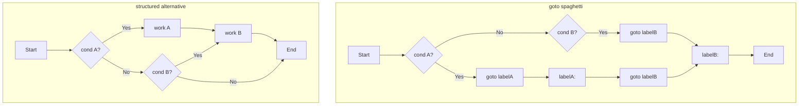
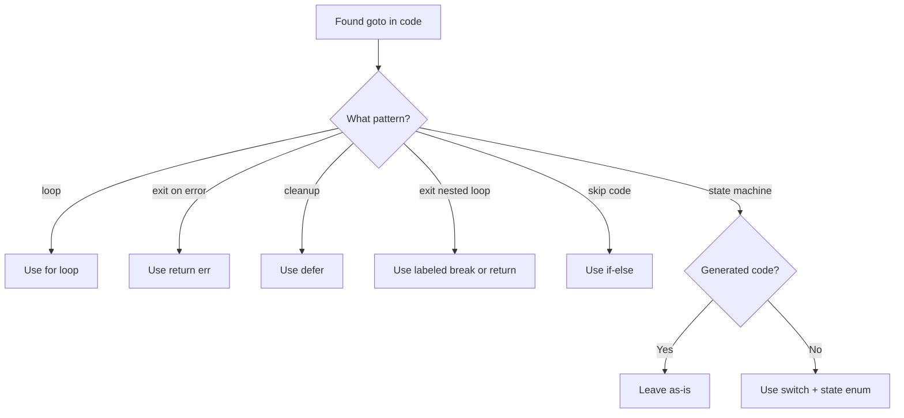

# Go `goto` Statement — Middle Level

> **Reminder:** `goto` is discouraged in Go. This document examines it in depth — its history, restrictions, the few legitimate cases, and systematic refactoring strategies to eliminate it from codebases.

---

## 1. Historical Context: Dijkstra and Structured Programming

In 1968, Edsger W. Dijkstra published "Go To Statement Considered Harmful" in Communications of the ACM. His core argument: when you allow arbitrary `goto` jumps, the execution path of a program becomes impossible to reason about from its structure. The "progress" of a program — where you are and how you got there — cannot be determined by reading the code linearly.

Go's designers (Rob Pike, Ken Thompson, Robert Griesemer) were fully aware of this history. They included `goto` in Go's spec for completeness and generated-code compatibility, but deliberately discouraged it via style guides, effective-go documentation, and linter defaults.

---

## 2. The Go Specification on `goto`

From the Go spec:
> A "goto" statement transfers control to the statement with the corresponding label within the same function.
> Executing the "goto" statement causes a transfer of control to the statement with the label.
> If there is a variable declared between the point of the "goto" and the label, a "goto" statement is not allowed if the scope of the variable includes the label.

The spec intentionally restricts `goto` to prevent the worst classes of bugs:

```go
// Spec restriction: scope-crossing variable declarations
func f() {
    goto L   // ERROR
    v := 3   // v's declaration is between goto and L
L:
    _ = v    // L is within scope of v
}
```

---

## 3. Evolution: Why `goto` Survived in Go

`goto` survived in Go for three documented reasons:

1. **Parser generators:** `goyacc` (and other tools) emit `goto`-based state machine code. Removing `goto` from Go would require rewriting all such tools.

2. **Runtime bootstrapping:** The Go runtime has a few places in assembly-adjacent code where `goto` simplifies otherwise-awkward control flow (e.g., in the GC scan loop stubs).

3. **Language completeness:** A language that claims to be in the C tradition but lacks `goto` would surprise C programmers porting code. The designers preferred to include it with strong discouragement.

---

## 4. `goto` Restrictions: A Complete List

### Restriction 1: Same function
```go
func a() { goto myLabel } // ERROR: undefined label myLabel
func b() {
myLabel:
    // ...
}
```

### Restriction 2: Cannot jump over variable declarations in scope
```go
func f() {
    goto end
    x := 5     // ERROR: goto jumps over this
    y := x + 1 // ERROR: also in scope
end:
    _ = y
}
```

### Restriction 3: Cannot jump into a block
```go
func f() {
    goto inside // ERROR
    {
    inside:
        x := 5
        _ = x
    }
}
```

### Restriction 4: Label must be used
```go
func f() {
unused: // ERROR: label unused defined and not used
    return
}
```

Note: A label only needs to be used by ONE `goto`. Multiple `goto` statements can reference the same label.

---

## 5. Alternative Approaches: Replacing Every `goto` Pattern

### Pattern 1: `goto` as a loop → use `for`
```go
// BAD
i := 0
start:
    i++
    if i < 10 { goto start }

// GOOD
for i := 0; i < 10; i++ { }
```

### Pattern 2: `goto` for early error exit → use `return`
```go
// BAD
func f() error {
    if err := step1(); err != nil { goto fail }
    if err := step2(); err != nil { goto fail }
    return nil
fail:
    return lastErr
}

// GOOD
func f() error {
    if err := step1(); err != nil { return err }
    if err := step2(); err != nil { return err }
    return nil
}
```

### Pattern 3: `goto` for cleanup → use `defer`
```go
// BAD
func f() {
    r := acquireResource()
    if err := use(r); err != nil { goto cleanup }
    // more work
cleanup:
    r.Release()
}

// GOOD
func f() {
    r := acquireResource()
    defer r.Release()
    if err := use(r); err != nil { return }
    // more work
}
```

### Pattern 4: `goto` to exit nested loops → use labeled `break` or `return`
```go
// BAD
for i := range outer {
    for j := range inner {
        if found(i, j) { goto done }
    }
}
done:

// GOOD (labeled break)
outer:
for i := range outer {
    for j := range inner {
        if found(i, j) { break outer }
    }
}

// BETTER (return)
func findFirst(outer, inner [][]int) (int, int) {
    for i := range outer {
        for j := range inner {
            if found(i, j) { return i, j }
        }
    }
    return -1, -1
}
```

---

## 6. Anti-Patterns: Common `goto` Misuses

### Anti-Pattern 1: Spaghetti Control Flow
```go
func process(x int) string {
    if x < 0 { goto neg }
    if x == 0 { goto zero }
    if x > 100 { goto large }
    goto small
neg:
    return "negative"
zero:
    return "zero"
large:
    return "large"
small:
    return "small"
}
// Hard to follow; which label is reached for which input?

// CLEAN:
func process(x int) string {
    switch {
    case x < 0:  return "negative"
    case x == 0: return "zero"
    case x > 100: return "large"
    default:     return "small"
    }
}
```

### Anti-Pattern 2: `goto` Loop Without Visible Iteration Variable
```go
// Who knows where i comes from or goes?
process:
    doSomething()
    if condition() { goto process }
// No loop variable, no termination guarantee visible at a glance
```

### Anti-Pattern 3: Multiple `goto` Targets Making Logic Nonlinear
```go
func f(a, b, c bool) {
    if a { goto A }
    if b { goto B }
    goto C
A:
    if c { goto B }
    return
B:
    doB()
    goto C
C:
    doC()
}
// Execution paths: A→B→C, A→return, B→C, C — impossible to verify correctness by reading
```

---

## 7. Debugging `goto`-Based Code

When you encounter `goto` in someone else's code, follow these steps:

**Step 1: Map the labels**
List all labels and their line numbers:
```
loop:   line 10
done:   line 25
error:  line 30
```

**Step 2: Map the gotos**
For each `goto`, record where it jumps:
```
line 18: goto done  → jumps to line 25
line 22: goto error → jumps to line 30
line 24: goto loop  → jumps to line 10
```

**Step 3: Draw the control flow graph**
Manually draw all paths. If the graph has crossing lines, it's spaghetti code.

**Step 4: Find the structured equivalent**
Most `goto` patterns map to one of: `for`, `if-else`, `switch`, `return`, `defer`, labeled `break`.

---

## 8. Language Comparison: `goto` Support

| Language | Has `goto`? | Restrictions | Notes |
|----------|------------|--------------|-------|
| Go | Yes | Cannot jump over vars; cannot enter blocks | Strongly discouraged |
| C | Yes | None (very permissive) | Commonly used for cleanup |
| C++ | Yes | Similar to C | Rarely used; structured alternatives exist |
| Java | No (reserved keyword) | — | `goto` is a reserved word but unused |
| Python | No | — | Not in the language |
| Rust | No | — | Uses `loop`/`break`/`return` |
| Swift | No | — | Labels on loops only |
| JavaScript | No | — | Labeled `break`/`continue` exist |
| Pascal | Yes | Within procedures | Historical; modern Pascal discourages it |

Go's approach (include but discourage) is similar to C++. Java's choice (reserve the keyword but not implement it) prevents accidents.

---

## 9. `goto` in the Go Standard Library

Searching the Go standard library (`src/`) reveals very few uses of `goto`, almost exclusively in:

1. **`go/parser` internal code** — some token consumption loops
2. **`crypto/` packages** — occasional use in performance-critical inner loops
3. **Generated parser code** — files ending in `_gen.go` or produced by `goyacc`

In application-level packages (`net/http`, `encoding/json`, etc.), `goto` is essentially absent. This confirms the community practice: `goto` is for special-purpose low-level code only.

---

## 10. Legitimate Use Case 1: State Machines in Generated Code

`goyacc`-generated parsers use `goto` for state transitions. The generated code looks like:

```go
// GENERATED CODE — do not edit by hand
func yyParse(yylex yyLexer) int {
    var yystate int
    // ...
    goto yystack

yystack:
    // push state
    yystate = yyS[yyp].yys
    goto yystate

yystate0:
    // state 0 actions
    goto yydefault

yydefault:
    // ...
}
```

This is machine-generated and follows a formal grammar-driven pattern. It is correct, even if unreadable to humans. The key: **humans don't read or maintain this code — tools generate and update it.**

---

## 11. Legitimate Use Case 2: Handwritten State Machines (Debated)

Some argue `goto` is acceptable for handwritten state machines when each state is clearly labeled:

```go
// Finite state machine for a simple parser
func parseMachine(input string) Token {
    i := 0

start:
    if i >= len(input) { goto eof }
    if input[i] == ' ' { i++; goto start }
    if input[i] >= 'a' && input[i] <= 'z' { goto ident }
    if input[i] >= '0' && input[i] <= '9' { goto number }
    goto error

ident:
    // scan identifier
    start := i
    for i < len(input) && isAlpha(input[i]) { i++ }
    return Token{Type: IDENT, Value: input[start:i]}

number:
    // scan number
    start := i
    for i < len(input) && isDigit(input[i]) { i++ }
    return Token{Type: NUMBER, Value: input[start:i]}

eof:
    return Token{Type: EOF}

error:
    return Token{Type: ERROR}
}
```

**Better alternative** even for this case:
```go
func parseMachine(input string) Token {
    i := 0
    for i < len(input) && input[i] == ' ' { i++ } // skip whitespace
    if i >= len(input) { return Token{Type: EOF} }
    if isAlpha(input[i]) { return scanIdent(input, i) }
    if isDigit(input[i]) { return scanNumber(input, i) }
    return Token{Type: ERROR}
}
```

---

## 12. `go vet` and Static Analysis for `goto`

`go vet` does not flag `goto` usage directly, but it catches:
- Jump over variable declarations (compile error, but `go vet` provides better messages)
- Unreachable code after unconditional `goto`

```bash
# Check for goto issues
go vet ./...

# staticcheck: can be configured to flag goto
staticcheck ./...

# golangci-lint: revive linter has goto-related rules
golangci-lint run --enable=revive ./...
```

To add a custom rule banning `goto` in your project, use a `.golangci.yml`:

```yaml
linters-settings:
  revive:
    rules:
      - name: banned-characters
        # Cannot directly ban goto, but custom analyzer can
```

For a hard ban, write a custom `go/analysis` pass (see Professional level).

---

## 13. Mermaid: `goto` Control Flow vs Structured Code



---

## 14. Mermaid: Refactoring Path for `goto` Code



---

## 15. The `defer` Statement: Go's Answer to Cleanup `goto`

The most common legitimate use of `goto` in C is cleanup on multiple error paths:

```c
// C with goto cleanup
int processFile(const char *path) {
    int fd = open(path, O_RDONLY);
    if (fd < 0) goto err0;

    char *buf = malloc(1024);
    if (!buf) goto err1;

    if (read(fd, buf, 1024) < 0) goto err2;

    // success
    free(buf);
    close(fd);
    return 0;

err2: free(buf);
err1: close(fd);
err0: return -1;
}
```

Go's `defer` completely eliminates this pattern:
```go
func processFile(path string) error {
    f, err := os.Open(path)
    if err != nil { return err }
    defer f.Close() // always runs on return

    buf := make([]byte, 1024)
    if _, err := f.Read(buf); err != nil { return err }

    return nil
}
```

`defer` is one of Go's most powerful features specifically because it eliminates the primary legitimate use case for `goto` in C.

---

## 16. Real-World Refactoring: Database Transaction with `goto`

```go
// BEFORE: C-style goto cleanup
func insertRecord(db *sql.DB, rec Record) error {
    tx, err := db.Begin()
    if err != nil { return err }

    stmt, err := tx.Prepare("INSERT INTO records VALUES (?, ?)")
    if err != nil { goto rollback }

    _, err = stmt.Exec(rec.ID, rec.Data)
    if err != nil { goto rollback }

    err = stmt.Close()
    if err != nil { goto rollback }

    return tx.Commit()

rollback:
    tx.Rollback()
    return err
}

// AFTER: idiomatic Go with defer
func insertRecord(db *sql.DB, rec Record) error {
    tx, err := db.Begin()
    if err != nil { return err }

    // Defer rollback: if Commit succeeds, Rollback is a no-op
    defer func() {
        if err != nil {
            tx.Rollback()
        }
    }()

    stmt, err := tx.Prepare("INSERT INTO records VALUES (?, ?)")
    if err != nil { return err }
    defer stmt.Close()

    _, err = stmt.Exec(rec.ID, rec.Data)
    if err != nil { return err }

    err = tx.Commit()
    return err
}
```

---

## 17. `goto` in the Context of Go's Error Handling Philosophy

Go's error handling philosophy (explicit `error` values returned from functions) naturally conflicts with `goto`. In Go:

- Every error is returned explicitly
- `defer` handles cleanup
- `if err != nil { return err }` is the idiomatic pattern

This makes `goto` redundant for error handling. The verbose but explicit Go error handling style is exactly the structured alternative to `goto`-based error handling in C.

---

## 18. Testing Code That Contains `goto`

Code with `goto` is harder to test because:

1. **Coverage:** Tools like `go test -cover` may show unusual coverage patterns for code with jumps.
2. **Dead code:** Code between a `goto` and its target is unreachable but may not be flagged.
3. **State:** `goto` can create paths that skip variable initialization, leading to zero-value state being used.

```go
// Hard to fully test
func classify(n int) string {
    if n < 0 { goto negative }
    if n > 100 { goto large }
    return "normal"
negative:
    return "negative"
large:
    return "large"
}

// Easy to test
func classify(n int) string {
    if n < 0 { return "negative" }
    if n > 100 { return "large" }
    return "normal"
}
```

Both have the same test coverage, but the second is immediately clear which paths exist.

---

## 19. `goto` and the Go Proverbs

Rob Pike's Go Proverbs include: "Clear is better than clever." `goto` is the canonical example of "clever" code that sacrifices clarity. The structured alternatives are always clearer.

Another relevant proverb: "A little copying is better than a little dependency." Similarly: "A little repetition is better than one `goto`." Repeating `return err` three times is clearer than a single `goto errLabel`.

---

## 20. Code Review: Checklist When You See `goto`

When `goto` appears in a code review:

- [ ] Is this generated code? (If yes, it may be acceptable)
- [ ] Is there a `for` loop alternative?
- [ ] Is there a `return` alternative?
- [ ] Is there a `defer` alternative?
- [ ] Is there a labeled `break` alternative?
- [ ] Does the `goto` jump over any variable declarations? (Will cause compile error anyway)
- [ ] Does the `goto` jump into a block? (Will cause compile error anyway)
- [ ] Does the `goto` make the code significantly clearer than alternatives? (Almost never yes)
- [ ] Is there a postmortem/lesson from this code's history explaining why `goto` was used?

If all alternatives exist and the code is not generated, request a refactoring in the review.

---

## 21. Practical Example: Refactor a Full Function

**Before:**
```go
func processOrders(orders []Order) ([]ProcessedOrder, error) {
    if len(orders) == 0 {
        goto done
    }

    var results []ProcessedOrder
    for _, o := range orders {
        if !o.IsValid() {
            goto skip
        }
        r, err := process(o)
        if err != nil {
            goto fail
        }
        results = append(results, r)
    skip:
    }

done:
    return results, nil
fail:
    return nil, err
}
```

**After:**
```go
func processOrders(orders []Order) ([]ProcessedOrder, error) {
    if len(orders) == 0 {
        return nil, nil
    }

    var results []ProcessedOrder
    for _, o := range orders {
        if !o.IsValid() {
            continue // skip invalid orders
        }
        r, err := process(o)
        if err != nil {
            return nil, fmt.Errorf("processing order %v: %w", o.ID, err)
        }
        results = append(results, r)
    }

    return results, nil
}
```

The refactored version is shorter, cleaner, provides better error context, and uses idiomatic `continue` for skipping.

---

## 22. `goto` vs Panic/Recover

Some use `goto` where `panic`/`recover` would be used in other languages. Neither is idiomatic Go for normal control flow:

```go
// goto for "error propagation" — avoid
func deepNested() {
    // ...
    goto topLevelError
}

// panic/recover for "error propagation" — also avoid for normal errors
func deepNested() {
    panic("something went wrong")
}

// CORRECT: return errors explicitly
func deepNested() error {
    return errors.New("something went wrong")
}
```

Go's error handling philosophy: return errors, don't jump to them or panic with them (unless it's a truly unrecoverable situation).

---

## 23. `goto` in Low-Level Cryptographic Code

The Go `crypto/` standard library occasionally uses `goto` in performance-critical inner loops where the structure of the algorithm (often following a published spec) is expressed more naturally with labels. Example (simplified from real usage):

```go
// In crypto/tls/handshake_client.go (simplified):
// goto is used to re-enter the handshake state machine
// after receiving a retry from the server
```

Even here, the Go team is moving toward restructuring these to avoid `goto` in new code.

---

## 24. Key Middle-Level Summary

| Topic | Key Insight |
|-------|-------------|
| History | Dijkstra (1968): `goto` prevents structured reasoning about programs |
| Go spec | Restricts `goto`: same function, no jumping over vars, no entering blocks |
| Alternatives | `for`, `return`, `defer`, labeled `break`, `switch` cover all `goto` use cases |
| Generated code | `goyacc` and similar tools legitimately use `goto` |
| Standard library | Essentially absent from application-level packages |
| Error handling | `defer` + explicit `return err` is the idiomatic replacement |
| Testing | `goto`-based code is harder to achieve full branch coverage on |
| Code review | Always request refactoring unless code is generated or has documented justification |
| Language comparison | Java doesn't even implement `goto`; Rust/Python don't have it at all |
| Go proverbs | "Clear is better than clever" — `goto` is clever, not clear |

---

## 25. Further Reading

- Edsger W. Dijkstra, "Go To Statement Considered Harmful", CACM, 1968
- Go Specification: https://go.dev/ref/spec#Goto_statements
- Effective Go: https://go.dev/doc/effective_go#control-structures
- Go Code Review Comments: https://github.com/golang/go/wiki/CodeReviewComments
- `goyacc` documentation: https://pkg.go.dev/golang.org/x/tools/cmd/goyacc
