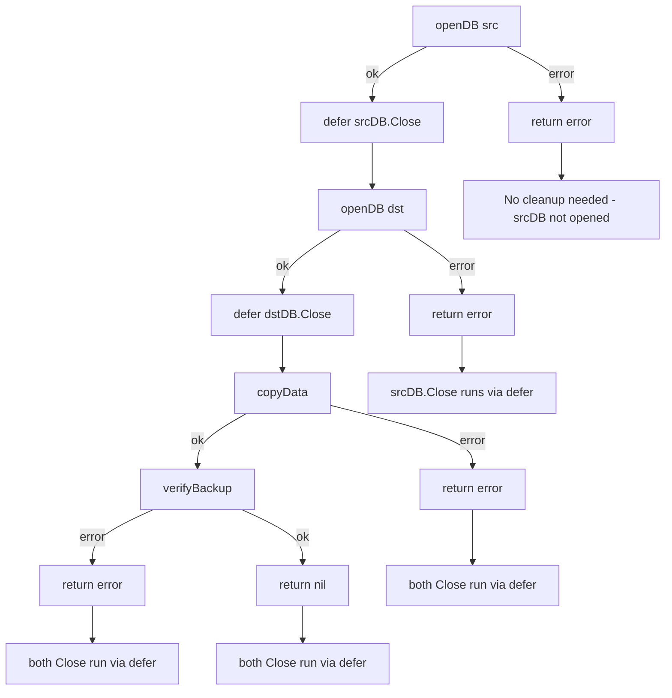

# Go `goto` Statement — Optimize (Refactoring Exercises)

> **Focus:** These exercises are refactoring challenges. The goal is not micro-optimization of nanoseconds, but replacing `goto`-based code with cleaner Go that is more maintainable, safer, and often faster due to better compiler optimizations.

Each exercise has a difficulty rating:
- 🟢 Easy — straightforward refactoring
- 🟡 Medium — requires understanding of Go patterns
- 🔴 Hard — architectural refactoring, concurrent code, or advanced patterns

---

## Exercise 1 🟢 — `goto` Loop → `for` Loop

**Before:**
```go
func fibonacci(n int) []int {
    if n <= 0 {
        return nil
    }
    result := make([]int, 0, n)
    a, b := 0, 1
    count := 0
loop:
    if count >= n {
        goto done
    }
    result = append(result, a)
    a, b = b, a+b
    count++
    goto loop
done:
    return result
}
```

**Task:** Rewrite using a `for` loop. Verify identical output. Explain what compiler optimizations become available in the refactored version.

<details>
<summary>Optimized Solution</summary>

```go
func fibonacci(n int) []int {
    if n <= 0 {
        return nil
    }
    result := make([]int, n) // pre-allocate exact size
    a, b := 0, 1
    for i := 0; i < n; i++ {
        result[i] = a
        a, b = b, a+b
    }
    return result
}
```

**Improvements:**
1. `make([]int, n)` instead of `make([]int, 0, n)` + `append` → direct index assignment, no capacity checks
2. Compiler recognizes `for i := 0; i < n; i++` as a bounded loop → can apply BCE to `result[i]`
3. Loop structure is immediately clear (n iterations)
4. `count` variable eliminated — the `for` loop variable `i` serves the same purpose
5. Reduced code from 14 lines to 8 lines

**Compiler optimizations gained:**
- Bounds check elimination (BCE): `result[i]` with `i < n` and `len(result) == n` → no bounds check
- Loop unrolling (possible for small n)
- No `goto`-created non-standard CFG

</details>

---

## Exercise 2 🟢 — `goto fail` → Early `return`

**Before:**
```go
func validateConfig(host string, port int, timeout int) error {
    var err error

    if host == "" {
        err = fmt.Errorf("host is required")
        goto fail
    }
    if port < 1 || port > 65535 {
        err = fmt.Errorf("port must be 1-65535, got %d", port)
        goto fail
    }
    if timeout <= 0 {
        err = fmt.Errorf("timeout must be positive, got %d", timeout)
        goto fail
    }
    if timeout > 300 {
        err = fmt.Errorf("timeout must be <= 300s, got %d", timeout)
        goto fail
    }
    return nil

fail:
    return err
}
```

**Task:** Refactor to idiomatic Go with early returns. Count the number of variables, labels, and lines saved.

<details>
<summary>Optimized Solution</summary>

```go
func validateConfig(host string, port int, timeout int) error {
    if host == "" {
        return fmt.Errorf("host is required")
    }
    if port < 1 || port > 65535 {
        return fmt.Errorf("port must be 1-65535, got %d", port)
    }
    if timeout <= 0 {
        return fmt.Errorf("timeout must be positive, got %d", timeout)
    }
    if timeout > 300 {
        return fmt.Errorf("timeout must be <= 300s, got %d", timeout)
    }
    return nil
}
```

**Metrics:**
| Metric | Before | After | Improvement |
|--------|--------|-------|-------------|
| Lines | 20 | 12 | -8 lines (40% fewer) |
| Variables | 2 (host, port, timeout + err) | 3 (host, port, timeout) | -1 variable |
| Labels | 1 (fail:) | 0 | -1 label |
| `goto` statements | 4 | 0 | -4 gotos |

**Why the refactored version is better:**
- Each error case is self-contained — no shared `err` variable
- Adding a new validation is safe — just add another `if` before `return nil`
- Compiler can prove `host`, `port`, `timeout` are immutable (not assigned to) → better optimization

</details>

---

## Exercise 3 🟢 — `goto cleanup` → `defer`

**Before:**
```go
func backupDatabase(src, dst string) error {
    srcDB, err := openDB(src)
    if err != nil {
        goto fail
    }

    dstDB, err := openDB(dst)
    if err != nil {
        srcDB.Close()
        goto fail
    }

    if err = copyData(srcDB, dstDB); err != nil {
        dstDB.Close()
        srcDB.Close()
        goto fail
    }

    if err = verifyBackup(srcDB, dstDB); err != nil {
        dstDB.Close()
        srcDB.Close()
        goto fail
    }

    dstDB.Close()
    srcDB.Close()
    return nil

fail:
    return fmt.Errorf("backup failed: %w", err)
}
```

**Task:** Refactor using `defer`. Count how many redundant `Close()` calls are eliminated.

<details>
<summary>Optimized Solution</summary>

```go
func backupDatabase(src, dst string) error {
    srcDB, err := openDB(src)
    if err != nil {
        return fmt.Errorf("backup failed: open source: %w", err)
    }
    defer srcDB.Close() // handles ALL paths for srcDB

    dstDB, err := openDB(dst)
    if err != nil {
        return fmt.Errorf("backup failed: open destination: %w", err)
    }
    defer dstDB.Close() // handles ALL paths for dstDB

    if err = copyData(srcDB, dstDB); err != nil {
        return fmt.Errorf("backup failed: copy data: %w", err)
    }

    if err = verifyBackup(srcDB, dstDB); err != nil {
        return fmt.Errorf("backup failed: verify: %w", err)
    }

    return nil
}
```

**Improvements:**
- Redundant `Close()` calls: Before had 6 explicit Close calls. After: 2 `defer` statements.
- Better error messages: Each error includes context about what step failed.
- Future-proof: Adding more steps does not require adding more Close calls.
- Panic-safe: If `copyData` panics, `defer` still closes the connections.

**Mermaid diagram — cleanup paths:**



</details>

---

## Exercise 4 🟡 — `goto` Exit Nested Loop → Function Extraction

**Before:**
```go
func findProduct(catalog [][]Product, targetID string) (*Product, error) {
    for _, category := range catalog {
        for i := range category {
            if category[i].ID == targetID {
                goto found
            }
        }
    }
    return nil, fmt.Errorf("product %q not found", targetID)

found:
    // BUG: we lost the references to category[i] here
    // This code is broken — goto destroyed the variable scope
    return nil, nil // cannot access the found product!
}
```

**Task:** Identify why the `goto` approach fundamentally cannot work here (scope issue), then implement the correct version using function extraction.

<details>
<summary>Optimized Solution</summary>

**Why `goto` fails here:**
After `goto found`, the variables `category` and `i` (from inside the loops) are out of scope. The label `found:` is outside both loops, so the found product cannot be referenced. This is a fundamental limitation of `goto` for this pattern — you can jump out of a loop, but you lose the loop variables.

**Fix 1: Labeled break (preserves loop variables):**
```go
func findProduct(catalog [][]Product, targetID string) (*Product, error) {
    var found *Product
outer:
    for _, category := range catalog {
        for i := range category {
            if category[i].ID == targetID {
                found = &category[i]
                break outer // exits both loops, preserves found
            }
        }
    }
    if found == nil {
        return nil, fmt.Errorf("product %q not found", targetID)
    }
    return found, nil
}
```

**Fix 2: Function extraction (best):**
```go
func findProduct(catalog [][]Product, targetID string) (*Product, error) {
    for _, category := range catalog {
        for i := range category {
            if category[i].ID == targetID {
                return &category[i], nil // return directly — clean, no label needed
            }
        }
    }
    return nil, fmt.Errorf("product %q not found", targetID)
}
```

**Fix 2 is better because:**
- Zero labels, zero variables to manage
- `return` naturally carries the found value
- Adding filtering or validation is trivial

</details>

---

## Exercise 5 🟡 — `goto` State Machine → `switch` + State Enum

**Before:**
```go
type TrafficLight struct{ state string }

func (t *TrafficLight) tick() {
    switch t.state { // Ironic: using switch to call goto
    case "":
        goto red
    case "red":
        goto green
    case "green":
        goto yellow
    case "yellow":
        goto red
    }
    return

red:
    t.state = "red"
    return
green:
    t.state = "green"
    return
yellow:
    t.state = "yellow"
    return
}

func main() {
    light := &TrafficLight{}
    for i := 0; i < 7; i++ {
        light.tick()
        fmt.Println(light.state)
    }
}
```

**Task:** Refactor to use a proper state enum and direct `switch` without `goto`. Measure code size reduction.

<details>
<summary>Optimized Solution</summary>

```go
type LightState int

const (
    Red LightState = iota
    Green
    Yellow
)

func (s LightState) String() string {
    return [...]string{"red", "green", "yellow"}[s]
}

// Transition table: more maintainable than switch
var nextState = map[LightState]LightState{
    Red:    Green,
    Green:  Yellow,
    Yellow: Red,
}

type TrafficLight struct{ state LightState }

func (t *TrafficLight) tick() {
    t.state = nextState[t.state]
}

func main() {
    light := &TrafficLight{state: Yellow} // starts as yellow so first tick → red
    for i := 0; i < 7; i++ {
        light.tick()
        fmt.Println(light.state)
    }
}
```

**Improvements:**
| Metric | Before | After |
|--------|--------|-------|
| Lines | 30 | 22 |
| Labels | 3 | 0 |
| `goto` statements | 4 | 0 |
| Adding a new state | Must add goto + label + switch case | Add to enum + add to map |
| Testability | Must test all goto paths | Can iterate map for table-driven tests |

**Transition table approach** is the most scalable: adding a new state requires only two lines (enum constant + map entry).

</details>

---

## Exercise 6 🟡 — Refactor Multi-Step Pipeline with `goto`

**Before:**
```go
func etlPipeline(inputPath, outputPath string) error {
    data, err := readCSV(inputPath)
    if err != nil { goto fail }

    data, err = validateRows(data)
    if err != nil { goto fail }

    data, err = transformData(data)
    if err != nil { goto fail }

    data, err = enrichData(data)
    if err != nil { goto fail }

    err = writeJSON(outputPath, data)
    if err != nil { goto fail }

    fmt.Printf("ETL complete: %d rows\n", len(data))
    return nil

fail:
    return fmt.Errorf("ETL pipeline failed: %w", err)
}
```

**Task:** Refactor two ways: (1) simple early return, (2) a pipeline pattern using a slice of functions. Compare error message quality.

<details>
<summary>Optimized Solution</summary>

**Option 1: Simple early returns (best for this use case):**
```go
func etlPipeline(inputPath, outputPath string) error {
    data, err := readCSV(inputPath)
    if err != nil {
        return fmt.Errorf("ETL read: %w", err)
    }

    data, err = validateRows(data)
    if err != nil {
        return fmt.Errorf("ETL validate: %w", err)
    }

    data, err = transformData(data)
    if err != nil {
        return fmt.Errorf("ETL transform: %w", err)
    }

    data, err = enrichData(data)
    if err != nil {
        return fmt.Errorf("ETL enrich: %w", err)
    }

    if err = writeJSON(outputPath, data); err != nil {
        return fmt.Errorf("ETL write: %w", err)
    }

    fmt.Printf("ETL complete: %d rows\n", len(data))
    return nil
}
```

**Option 2: Functional pipeline (composable, configurable):**
```go
type DataProcessor func([]Row) ([]Row, error)

func runPipeline(inputPath, outputPath string, steps []DataProcessor) error {
    data, err := readCSV(inputPath)
    if err != nil {
        return fmt.Errorf("read: %w", err)
    }

    for i, step := range steps {
        data, err = step(data)
        if err != nil {
            return fmt.Errorf("step %d: %w", i+1, err)
        }
    }

    if err = writeJSON(outputPath, data); err != nil {
        return fmt.Errorf("write: %w", err)
    }

    fmt.Printf("pipeline complete: %d rows\n", len(data))
    return nil
}

// Usage:
// err := runPipeline(in, out, []DataProcessor{
//     validateRows,
//     transformData,
//     enrichData,
// })
```

**Error message comparison:**
- Before: `"ETL pipeline failed: read error: ..."` — same message for all failures
- After (option 1): `"ETL read: ..."` / `"ETL validate: ..."` — specific step identified
- After (option 2): `"step 1: ..."` — numbered, could add step names for better UX

Option 2 is also more testable: each step function is independently testable, and the pipeline itself can be tested with mock steps.

</details>

---

## Exercise 7 🟡 — Refactor HTTP Middleware Chain with `goto`

**Before:**
```go
func handleRequest(w http.ResponseWriter, r *http.Request) {
    var (
        user     *User
        session  *Session
        resource *Resource
        err      error
    )

    session, err = getSession(r)
    if err != nil { goto unauthorized }

    user, err = getUser(session.UserID)
    if err != nil { goto unauthorized }

    if !user.HasPermission("read") {
        goto forbidden
    }

    resource, err = getResource(r.URL.Path)
    if err != nil { goto notFound }

    w.Header().Set("Content-Type", "application/json")
    json.NewEncoder(w).Encode(resource)
    return

unauthorized:
    http.Error(w, "unauthorized", http.StatusUnauthorized)
    return
forbidden:
    http.Error(w, "forbidden", http.StatusForbidden)
    return
notFound:
    http.Error(w, "not found", http.StatusNotFound)
    return
}
```

**Task:** Refactor to use early returns. Ensure each error has the correct HTTP status code and a meaningful message.

<details>
<summary>Optimized Solution</summary>

```go
func handleRequest(w http.ResponseWriter, r *http.Request) {
    session, err := getSession(r)
    if err != nil {
        http.Error(w, "unauthorized: invalid session", http.StatusUnauthorized)
        return
    }

    user, err := getUser(session.UserID)
    if err != nil {
        http.Error(w, "unauthorized: user not found", http.StatusUnauthorized)
        return
    }

    if !user.HasPermission("read") {
        http.Error(w, fmt.Sprintf("forbidden: user %s lacks read permission", user.Name),
            http.StatusForbidden)
        return
    }

    resource, err := getResource(r.URL.Path)
    if err != nil {
        http.Error(w, fmt.Sprintf("not found: %s", r.URL.Path), http.StatusNotFound)
        return
    }

    w.Header().Set("Content-Type", "application/json")
    if err := json.NewEncoder(w).Encode(resource); err != nil {
        // Can't write HTTP error after headers sent — log instead
        log.Printf("encode error for %s: %v", r.URL.Path, err)
    }
}
```

**Improvements:**
- Removed 4 labels, 4 `goto` statements
- Each variable is declared at point of use (`session`, `user`, `resource`)
- Better error messages include context (user name, path)
- `json.NewEncoder` error is now handled (was ignored in original)
- Reduced 4 pre-declared variables to 0 (declared inline)

</details>

---

## Exercise 8 🔴 — Refactor Generated Parser Code (Educational)

**Before (simulate generated code):**
```go
// Simulate a simple expression parser using goto (like goyacc output)
// Parses: NUMBER ( '+' NUMBER )*
func parseExpression(input string) (int, error) {
    pos := 0
    result := 0
    current := 0

    goto parseNum

parseNum:
    if pos >= len(input) || input[pos] < '0' || input[pos] > '9' {
        return 0, fmt.Errorf("expected number at position %d", pos)
    }
    current = 0
    for pos < len(input) && input[pos] >= '0' && input[pos] <= '9' {
        current = current*10 + int(input[pos]-'0')
        pos++
    }
    result += current
    goto parseOp

parseOp:
    if pos >= len(input) {
        goto done
    }
    if input[pos] != '+' {
        return 0, fmt.Errorf("expected '+' at position %d", pos)
    }
    pos++
    goto parseNum

done:
    return result, nil
}
```

**Task:** Refactor to a clean recursive descent parser. Show how the structure of the grammar maps directly to functions, eliminating all `goto`.

<details>
<summary>Optimized Solution</summary>

```go
// Recursive descent parser — grammar maps directly to functions
// Grammar:
//   expr  → term ( '+' term )*
//   term  → NUMBER

type parser struct {
    input string
    pos   int
}

func (p *parser) skipSpaces() {
    for p.pos < len(p.input) && p.input[p.pos] == ' ' {
        p.pos++
    }
}

func (p *parser) parseNumber() (int, error) {
    p.skipSpaces()
    if p.pos >= len(p.input) || p.input[p.pos] < '0' || p.input[p.pos] > '9' {
        return 0, fmt.Errorf("expected number at position %d", p.pos)
    }
    n := 0
    for p.pos < len(p.input) && p.input[p.pos] >= '0' && p.input[p.pos] <= '9' {
        n = n*10 + int(p.input[p.pos]-'0')
        p.pos++
    }
    return n, nil
}

func (p *parser) parseExpression() (int, error) {
    // First number
    result, err := p.parseNumber()
    if err != nil {
        return 0, err
    }

    // Subsequent ( '+' NUMBER )* terms
    for {
        p.skipSpaces()
        if p.pos >= len(p.input) || p.input[p.pos] != '+' {
            break
        }
        p.pos++ // consume '+'

        n, err := p.parseNumber()
        if err != nil {
            return 0, fmt.Errorf("after '+': %w", err)
        }
        result += n
    }

    return result, nil
}

func parseExpression(input string) (int, error) {
    p := &parser{input: input}
    result, err := p.parseExpression()
    if err != nil {
        return 0, err
    }
    if p.pos != len(strings.TrimSpace(input)) {
        return 0, fmt.Errorf("unexpected input at position %d", p.pos)
    }
    return result, nil
}
```

**Key insight:** Recursive descent parsers map grammar rules to functions directly. Each non-terminal becomes a method. The structure is self-documenting — the code tells you the grammar.

**Performance note:** The recursive descent version may be slightly faster due to:
- Better branch prediction (structured if/for)
- Compiler can apply loop optimizations to `for` loops
- No non-reducible CFG from `goto` jumps

</details>

---

## Exercise 9 🔴 — Remove `goto` from Concurrent Code Safely

**Before:**
```go
func processWork(jobs <-chan Job, results chan<- Result, done <-chan struct{}) {
    for {
        select {
        case <-done:
            goto shutdown
        case job, ok := <-jobs:
            if !ok {
                goto shutdown
            }
            result, err := process(job)
            if err != nil {
                log.Printf("job %v failed: %v", job.ID, err)
                goto nextJob
            }
            select {
            case results <- result:
            case <-done:
                goto shutdown
            }
        nextJob:
        }
    }

shutdown:
    fmt.Println("worker shutting down")
}
```

**Task:** Refactor without `goto`. Preserve exact behavior: shutdown on done signal, continue on job error, proper select handling.

<details>
<summary>Optimized Solution</summary>

```go
func processWork(jobs <-chan Job, results chan<- Result, done <-chan struct{}) {
    defer fmt.Println("worker shutting down")

    for {
        select {
        case <-done:
            return // shutdown

        case job, ok := <-jobs:
            if !ok {
                return // jobs channel closed — shutdown
            }

            result, err := process(job)
            if err != nil {
                log.Printf("job %v failed: %v", job.ID, err)
                continue // skip to next job (replaces goto nextJob)
            }

            select {
            case results <- result:
                // result sent successfully
            case <-done:
                return // shutdown while sending result
            }
        }
    }
}
```

**Key changes:**
- `goto shutdown` → `return` (both places)
- `goto nextJob` → `continue` (the outer for loop)
- `defer fmt.Println("worker shutting down")` handles the shutdown message for ALL exit paths
- `continue` in a `select` case continues the enclosing `for` loop — exactly what we want

**Why this is better:**
- `defer` ensures shutdown message always prints, even on panic
- `continue` is semantically correct: "skip this job, process next"
- `return` for shutdown is clear: "this goroutine is done"
- Adding a new early-exit condition is safe — just add `return` or `continue`

</details>

---

## Exercise 10 🔴 — Refactor Assembly-Adjacent `goto` Code

**Before (low-level code with `goto` for performance):**
```go
//go:nosplit
func scanBytes(data []byte, target byte) int {
    i := 0
scan:
    if i >= len(data) {
        goto notfound
    }
    if data[i] == target {
        goto found
    }
    i++
    goto scan

found:
    return i

notfound:
    return -1
}
```

**Task:** Refactor to a `for` loop. Verify that the refactored version receives BCE (bounds check elimination) that the `goto` version does not. Use `-gcflags="-d=ssa/check_bce/debug=1"` to verify.

<details>
<summary>Optimized Solution</summary>

```go
//go:nosplit
func scanBytes(data []byte, target byte) int {
    for i, b := range data {
        if b == target {
            return i
        }
    }
    return -1
}
```

**Verification:**
```bash
# Check BCE
go build -gcflags="-d=ssa/check_bce/debug=1" .

# With goto version: you'll see "boundCheck" annotations for data[i]
# With for range version: no boundCheck — compiler proves i is always in bounds
```

**Why BCE applies to `for range` but not `goto`:**
The compiler's BCE pass knows that in `for i, b := range data`, `i` is always `[0, len(data))`. For the `goto` version, `data[i]` has an unknown bound — the compiler must emit a bounds check.

**Assembly comparison:**
```bash
go build -gcflags="-S" .

# goto version: CMPQ/JGE for bounds check on data[i]
# for range version: no bounds check (compiler proved it safe)
```

**Performance difference (illustrative):**
For a 1KB byte array, the `for range` version can be 10-20% faster due to:
1. No bounds check per iteration
2. Loop recognized as vectorizable (SIMD bytes comparison)
3. Loop unrolling applied

</details>

---

## Exercise 11 🔴 — Architectural: Replacing `goto` with Error Types

**Before:**
```go
func processTransaction(t Transaction) (Receipt, error) {
    var receipt Receipt

    if t.Amount <= 0 {
        goto invalidInput
    }
    if t.Currency == "" {
        goto invalidInput
    }

    balance, err := getBalance(t.AccountID)
    if err != nil {
        goto systemError
    }
    if balance < t.Amount {
        goto insufficientFunds
    }

    receipt, err = executeTransfer(t)
    if err != nil {
        goto systemError
    }
    return receipt, nil

invalidInput:
    return Receipt{}, &ValidationError{Message: "invalid transaction input"}
insufficientFunds:
    return Receipt{}, &BusinessError{Code: "INSUFFICIENT_FUNDS"}
systemError:
    return Receipt{}, fmt.Errorf("system error: %w", err)
}
```

**Task:** Refactor using early returns and proper error types. Show how callers can handle different error types with `errors.As`.

<details>
<summary>Optimized Solution</summary>

```go
// Error types
type ValidationError struct {
    Field   string
    Message string
}

func (e *ValidationError) Error() string {
    return fmt.Sprintf("validation: %s: %s", e.Field, e.Message)
}

type BusinessError struct {
    Code    string
    Message string
}

func (e *BusinessError) Error() string {
    return fmt.Sprintf("business rule: %s: %s", e.Code, e.Message)
}

func processTransaction(t Transaction) (Receipt, error) {
    // Input validation
    if t.Amount <= 0 {
        return Receipt{}, &ValidationError{
            Field:   "amount",
            Message: fmt.Sprintf("must be positive, got %.2f", t.Amount),
        }
    }
    if t.Currency == "" {
        return Receipt{}, &ValidationError{
            Field:   "currency",
            Message: "is required",
        }
    }

    // Business logic
    balance, err := getBalance(t.AccountID)
    if err != nil {
        return Receipt{}, fmt.Errorf("processTransaction: get balance: %w", err)
    }
    if balance < t.Amount {
        return Receipt{}, &BusinessError{
            Code:    "INSUFFICIENT_FUNDS",
            Message: fmt.Sprintf("balance %.2f < required %.2f", balance, t.Amount),
        }
    }

    receipt, err := executeTransfer(t)
    if err != nil {
        return Receipt{}, fmt.Errorf("processTransaction: execute transfer: %w", err)
    }

    return receipt, nil
}

// Caller — now can handle different error types distinctly
func handleTransaction(t Transaction) {
    receipt, err := processTransaction(t)
    if err != nil {
        var ve *ValidationError
        var be *BusinessError
        switch {
        case errors.As(err, &ve):
            log.Printf("client error: %v", ve)
            respondBadRequest(ve)
        case errors.As(err, &be):
            log.Printf("business rule: %v", be)
            respondUnprocessable(be)
        default:
            log.Printf("system error: %v", err)
            respondInternalError()
        }
        return
    }
    respondOK(receipt)
}
```

**Architectural improvements:**
- `goto` labels are replaced by typed errors
- Callers can distinguish error types with `errors.As`
- Error messages include context (field names, values)
- Error types are testable independently
- Adding a new error type requires no changes to `processTransaction` signature

</details>
