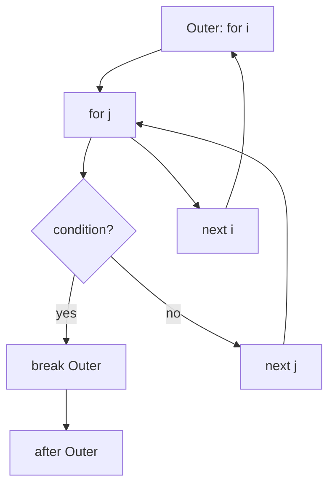

# Go Labeled Break and Continue — Junior Level

## 1. Introduction

### What is it?
A **labeled break** or **labeled continue** is a `break` or `continue` statement that names the loop (or `switch`/`select`) it should affect. Without a label, `break` exits the **innermost** enclosing `for`, `switch`, or `select`, and `continue` advances the **innermost** enclosing `for`. With a label, you can target an outer statement directly.

### How to use it?

```go
package main

import "fmt"

func main() {
Outer:
    for i := 0; i < 3; i++ {
        for j := 0; j < 3; j++ {
            if i*j > 2 {
                break Outer
            }
            fmt.Println(i, j)
        }
    }
}
```

`break Outer` exits the labelled outer loop, not just the inner one.

---

## 2. Prerequisites
- For-loop basics (2.5.1)
- Plain `break` and `continue` (2.5.3, 2.5.4)
- Switch and select statements
- Function scope rules

---

## 3. Glossary

| Term | Definition |
|------|-----------|
| label | An identifier followed by `:` that names a `for`, `switch`, or `select` |
| labeled break | `break L` — exits the labelled statement |
| labeled continue | `continue L` — starts the next iteration of the labelled `for` |
| target | The statement that a label names |
| function-scoped | Labels are visible only inside the function where they are declared |
| unused label | A label declared but never referenced — a compile error in Go |
| nested loop | A loop inside another loop |

---

## 4. Core Concepts

### 4.1 Label Syntax

A label is an identifier followed by `:`, placed **immediately before** a `for`, `switch`, or `select`:

```go
Outer:
for i := 0; i < N; i++ {
    // ...
}
```

By convention, label names start with a capital letter (`Outer`, `Loop`, `Done`), though any identifier is valid.

### 4.2 Labeled `break`

`break L` exits the statement labelled `L`. It can target a `for`, `switch`, or `select`.

```go
Outer:
for i := 0; i < 3; i++ {
    for j := 0; j < 3; j++ {
        if condition {
            break Outer // jumps out of the i loop entirely
        }
    }
}
// execution continues HERE
```

Without `Outer`, `break` would only exit the inner `for j` loop.

### 4.3 Labeled `continue`

`continue L` starts the next iteration of the **for loop** labelled `L`. The label MUST point to a `for` (not `switch` or `select`).

```go
Outer:
for i := 0; i < 3; i++ {
    for j := 0; j < 3; j++ {
        if condition {
            continue Outer // i++ runs, then i loop continues
        }
    }
}
```

### 4.4 Labels Are Function-Scoped

A label is visible only in the function in which it is declared. You cannot `break` or `continue` to a label in another function.

```go
func main() {
Outer:
    for i := 0; i < 3; i++ {
        helper() // helper cannot reach Outer
    }
}

func helper() {
    // break Outer // ERROR: label Outer not defined
}
```

### 4.5 Unused Labels Are a Compile Error

If you declare a label and never use it, the compiler rejects the program:

```go
Outer:
for i := 0; i < 3; i++ {
    fmt.Println(i)
}
// ERROR: label Outer defined and not used
```

This rule prevents stale labels from accumulating in the codebase.

### 4.6 Labels Apply Only to `for`, `switch`, or `select`

A label must directly precede a `for`, `switch`, or `select`. You cannot label a regular block, an `if`, or a function body.

```go
Outer: { // ERROR: invalid label target
    fmt.Println("hi")
}
```

### 4.7 `continue` Requires a `for` Label

Even though you can label any of `for`, `switch`, or `select`, `continue` only works on a label that names a `for`. Targeting a `switch` or `select` label with `continue` is a compile error.

```go
Outer:
switch x {
case 1:
    continue Outer // ERROR: continue label must be a for-loop
}
```

---

## 5. Real-World Analogies

**Multi-floor elevator**: a plain `break` lets you off on the current floor; a labeled `break` lets you exit the entire building. A label is like marking a floor as "ground level — exit here."

**Nested boxes**: imagine boxes inside boxes. A regular `break` opens the next box outward (one level). A labeled `break` opens any specifically named box.

**Email subject filters**: when scanning inboxes, a "skip this thread" matches labeled `continue` (move on to the next outer thread). A "stop scanning" matches labeled `break`.

---

## 6. Mental Models

```
Outer:
for i := 0; i < N; i++ {        ← `Outer` names this loop
    for j := 0; j < M; j++ {    ← inner loop
        ...
        break Outer              ← jump to AFTER the outer loop
        continue Outer           ← next i, restart inner loop
    }
}
// execution lands HERE after `break Outer`
```

A label is just a marker. `break L` and `continue L` are jumps; the compiler checks that `L` names a valid target.

---

## 7. Pros & Cons

### Pros
- Clear way to exit nested loops without a flag variable
- Readable when used sparingly
- Matches well-known idioms in compilers, parsers, and graph traversals
- Removes the need for `goto` in many cases

### Cons
- Can hide complex control flow if abused
- Often a sign that the inner block should be extracted into a function
- Unused labels are compile errors — surprising for new Go developers
- Labels named on `switch`/`select` cannot be `continue`-targets, which is easy to forget

---

## 8. Use Cases

1. Exit a nested loop early (search found a match)
2. Skip the rest of an outer iteration on a condition
3. Exit a `select` from inside a deeply nested branch
4. Walk a 2-D grid with early termination
5. Parser state machines that step through tokens
6. Tic-tac-toe / Sudoku board scans
7. Match-and-break patterns in lexers
8. `select` inside `for` loops where the `select`-internal `break` only exits the `select`

---

## 9. Code Examples

### Example 1 — Plain Search in a Grid

```go
package main

import "fmt"

func main() {
    grid := [][]int{
        {1, 2, 3},
        {4, 5, 6},
        {7, 8, 9},
    }
    target := 5

    foundI, foundJ := -1, -1
Search:
    for i, row := range grid {
        for j, v := range row {
            if v == target {
                foundI, foundJ = i, j
                break Search
            }
        }
    }
    fmt.Println("at", foundI, foundJ) // at 1 1
}
```

### Example 2 — Skipping a Row

```go
package main

import "fmt"

func main() {
    matrix := [][]int{
        {1, 2, 3},
        {4, -1, 6},
        {7, 8, 9},
    }
Outer:
    for i, row := range matrix {
        for _, v := range row {
            if v < 0 {
                continue Outer // skip the rest of this row
            }
        }
        fmt.Println("row", i, "is non-negative")
    }
}
```

### Example 3 — Break From `select` Inside `for`

```go
package main

import (
    "fmt"
    "time"
)

func main() {
    ticker := time.NewTicker(20 * time.Millisecond)
    defer ticker.Stop()
    deadline := time.After(80 * time.Millisecond)

Loop:
    for {
        select {
        case t := <-ticker.C:
            fmt.Println("tick", t.Format("15:04:05.000"))
        case <-deadline:
            fmt.Println("done")
            break Loop // a plain `break` would only leave the select
        }
    }
}
```

### Example 4 — Tic-Tac-Toe Win Check

```go
package main

import "fmt"

func main() {
    board := [3][3]string{
        {"X", "X", "X"},
        {"O", " ", "O"},
        {" ", "O", " "},
    }

    winner := ""
Rows:
    for r := 0; r < 3; r++ {
        if board[r][0] != " " && board[r][0] == board[r][1] && board[r][1] == board[r][2] {
            winner = board[r][0]
            break Rows
        }
    }
    fmt.Println("winner:", winner)
}
```

### Example 5 — Two-Pointer Scan

```go
package main

import "fmt"

func main() {
    a := []int{1, 3, 5, 7, 9}
    b := []int{2, 4, 5, 8}

    found := false
Outer:
    for _, x := range a {
        for _, y := range b {
            if x == y {
                fmt.Println("common:", x)
                found = true
                break Outer
            }
        }
    }
    if !found {
        fmt.Println("no common element")
    }
}
```

### Example 6 — Continue To Outer Iteration

```go
package main

import "fmt"

func main() {
    items := [][]int{
        {1, 2, 3},
        {4, 5, -1, 6},
        {7, 8, 9},
    }

    sums := []int{}
Group:
    for _, group := range items {
        sum := 0
        for _, v := range group {
            if v < 0 {
                fmt.Println("skipping group with negative")
                continue Group
            }
            sum += v
        }
        sums = append(sums, sum)
    }
    fmt.Println(sums) // [6 24]
}
```

---

## 10. Coding Patterns

### Pattern 1 — Break Out of Both Loops on Match

```go
Search:
for _, row := range data {
    for _, v := range row {
        if matches(v) {
            result = v
            break Search
        }
    }
}
```

### Pattern 2 — Skip Outer Iteration on Bad Item

```go
Outer:
for _, group := range groups {
    for _, item := range group {
        if invalid(item) {
            continue Outer
        }
    }
    // group is fully valid; process it
}
```

### Pattern 3 — `for { select { ... } }` Quit

```go
Loop:
for {
    select {
    case <-quit:
        break Loop
    case work := <-jobs:
        handle(work)
    }
}
```

### Pattern 4 — Multi-Level Break in a Parser

```go
Tokens:
for {
    tok := next()
    switch tok.Kind {
    case EOF:
        break Tokens
    case Comma:
        continue
    }
    process(tok)
}
```

---

## 11. Clean Code Guidelines

1. **Use labels sparingly.** They are powerful but can hide intent.
2. **Capitalize label names** (`Outer`, `Loop`) for visibility.
3. **Place the label on its own line** directly above the targeted statement.
4. **Prefer extraction** when a labelled block grows beyond ~20 lines — pull the inner work into a function and use early `return`.
5. **Comment why the label is needed** if the reason is non-obvious.

```go
// Good
Outer:
for _, row := range grid {
    for _, v := range row {
        if v == target {
            break Outer
        }
    }
}

// Worse — using a flag instead of a label
done := false
for _, row := range grid {
    for _, v := range row {
        if v == target {
            done = true
            break
        }
    }
    if done {
        break
    }
}
```

The label version is shorter and clearer.

---

## 12. Product Use / Feature Example

**A timeout-aware worker loop**:

```go
package main

import (
    "context"
    "fmt"
    "time"
)

func runWorker(ctx context.Context, jobs <-chan int) {
Loop:
    for {
        select {
        case <-ctx.Done():
            fmt.Println("shutdown")
            break Loop
        case job, ok := <-jobs:
            if !ok {
                fmt.Println("jobs closed")
                break Loop
            }
            fmt.Println("processed", job)
        }
    }
    fmt.Println("worker exited")
}

func main() {
    ctx, cancel := context.WithTimeout(context.Background(), 30*time.Millisecond)
    defer cancel()
    jobs := make(chan int)
    go runWorker(ctx, jobs)
    time.Sleep(50 * time.Millisecond)
}
```

The label `Loop` lets `break` escape both the `select` and the `for`.

---

## 13. Error Handling

Labelled break is often used to exit a loop that detected a fatal error:

```go
var firstErr error
Loop:
for _, line := range lines {
    for _, field := range strings.Fields(line) {
        if !valid(field) {
            firstErr = fmt.Errorf("invalid field %q", field)
            break Loop
        }
    }
}
if firstErr != nil {
    return firstErr
}
```

The label keeps the error path tight and easy to read.

---

## 14. Security Considerations

1. **Labelled jumps cannot leave a function.** They cannot bypass `defer`-installed cleanup; cleanup still runs at function return.
2. **A `break Loop` does not skip closing of resources** opened earlier in the function — `defer` still fires.
3. **Avoid using labels to skip validation** — always validate before the labelled jump rather than after.

---

## 15. Performance Tips

1. **No runtime cost vs. unlabeled break.** The compiler emits the same control-flow edges.
2. **Use a label rather than a `done` flag** — fewer instructions and clearer intent.
3. **Don't introduce deep nesting just to use a label** — refactor instead.

---

## 16. Metrics & Analytics

When monitoring loops that may break early:

```go
var iterations int
Outer:
for _, x := range data {
    for _, y := range x.items {
        iterations++
        if found(y) {
            break Outer
        }
    }
}
fmt.Println("iterations:", iterations)
```

This style records work done before the early exit.

---

## 17. Best Practices

1. Use labels for nested loop exit and for `for`-`select` quit.
2. Capitalize label names.
3. Avoid unused labels (the compiler will reject them anyway).
4. Prefer `break L` over flag variables.
5. Consider extracting into a helper function when nesting deepens.
6. Remember: `continue L` requires `L` to label a `for`.

---

## 18. Edge Cases & Pitfalls

### Pitfall 1 — Forgetting That `break` In a `for { select {} }` Only Exits the `select`

```go
for {
    select {
    case <-quit:
        break // exits the select, NOT the for!
    }
}
// the for runs forever
```

Fix:
```go
Loop:
for {
    select {
    case <-quit:
        break Loop
    }
}
```

### Pitfall 2 — Unused Label

```go
Outer:
for i := 0; i < 3; i++ { // never references Outer
    fmt.Println(i)
}
// compile error: label Outer defined and not used
```

Fix: remove the label, or add a `break Outer` / `continue Outer`.

### Pitfall 3 — Label On a Block

```go
Outer: {  // ERROR
    // ...
}
```

Labels must precede `for`, `switch`, or `select`.

### Pitfall 4 — `continue` On a Switch Label

```go
Outer:
switch x {
case 1:
    continue Outer // ERROR
}
```

`continue` requires a `for` label.

### Pitfall 5 — Same Label Twice in One Function

```go
func f() {
Outer:
    for i := 0; i < 3; i++ { break Outer }
Outer: // ERROR: label Outer already defined
    for j := 0; j < 3; j++ { break Outer }
}
```

Labels are unique per function.

---

## 19. Common Mistakes

| Mistake | Fix |
|---------|-----|
| Plain `break` inside `for { select { } }` | Use a labeled break |
| Unused label | Use it or remove it |
| `continue` on a switch label | Move the label to the surrounding `for` |
| Label on an `if` or block | Place it before a `for`/`switch`/`select` |
| Trying to break out of a function via label | Use early `return` |

---

## 20. Common Misconceptions

**Misconception 1**: "A label is like a `goto` target."
**Truth**: Labels for `break`/`continue` only allow jumps to the START or END of the labelled statement, not to arbitrary positions. `goto` is a separate construct (see 2.5.5).

**Misconception 2**: "Labels are visible across functions."
**Truth**: Labels are function-scoped.

**Misconception 3**: "I can `continue` from inside a `select`."
**Truth**: A bare `continue` inside `for { select { ... } }` works — it advances the `for`. But `continue` on a label that names a `select` is a compile error.

**Misconception 4**: "Using labels is a code smell."
**Truth**: Labels are idiomatic in Go for exiting `for`-`select` loops and for nested-loop early exits. They become a smell only when nesting is excessive.

---

## 21. Tricky Points

1. `break L` exits the labelled statement, not just the innermost.
2. `continue L` requires `L` to label a `for`.
3. Labels are unique within a function and must be used.
4. `break` inside `for { select { ... } }` only exits the `select` unless labelled.
5. A label only applies to the very next `for`/`switch`/`select`.

---

## 22. Test

```go
package main

import "testing"

func findFirst(grid [][]int, target int) (int, int, bool) {
Outer:
    for i, row := range grid {
        for j, v := range row {
            if v == target {
                return i, j, true
            }
            _ = i
            _ = j
            if v == 0 {
                continue Outer
            }
        }
    }
    return -1, -1, false
}

func TestFindFirst(t *testing.T) {
    g := [][]int{{1, 0, 2}, {3, 4, 5}}
    i, j, ok := findFirst(g, 4)
    if !ok || i != 1 || j != 1 {
        t.Errorf("got %d,%d,%v want 1,1,true", i, j, ok)
    }
}
```

---

## 23. Tricky Questions

**Q1**: What does this print?
```go
Outer:
for i := 0; i < 3; i++ {
    for j := 0; j < 3; j++ {
        if j == 1 {
            continue Outer
        }
        fmt.Println(i, j)
    }
}
```
**A**: `0 0`, `1 0`, `2 0`. Each iteration of the inner loop runs only with `j == 0`, then `continue Outer` skips to the next `i`.

**Q2**: Why does this loop forever?
```go
for {
    select {
    case <-time.After(time.Second):
        break
    }
}
```
**A**: `break` only exits the `select`; the `for` keeps looping. Use a label.

**Q3**: Compile or run-time?
```go
Switch:
switch x {
case 1:
    continue Switch
}
```
**A**: Compile error. `continue` requires a `for` label.

---

## 24. Cheat Sheet

```go
// Break outer loop
Outer:
for ... {
    for ... {
        break Outer
    }
}

// Continue outer loop
Outer:
for ... {
    for ... {
        continue Outer
    }
}

// Break out of for { select { ... } }
Loop:
for {
    select {
    case <-quit:
        break Loop
    }
}

// Label conventions
// - Capitalized identifier
// - Placed directly above the for/switch/select
// - Function-scoped, must be used
```

---

## 25. Self-Assessment Checklist

- [ ] I can declare a label and break out of a nested loop
- [ ] I know `continue L` requires a `for` label
- [ ] I know labels are function-scoped
- [ ] I know unused labels are compile errors
- [ ] I can break out of `for { select { ... } }` correctly
- [ ] I avoid using labels when extraction is clearer
- [ ] I write capitalized label names

---

## 26. Summary

A label names a `for`, `switch`, or `select`. `break L` exits the labelled statement; `continue L` advances the labelled `for`. Labels are function-scoped and must be used. Common uses are nested-loop early exits and breaking out of `for { select { ... } }`. Use labels sparingly and prefer function extraction when nesting deepens.

---

## 27. What You Can Build

- Grid scanners with early termination
- Multi-level state machines
- Worker loops with quit channels
- Parsers that skip to the next token group
- Search routines on 2-D data
- Tic-tac-toe / Sudoku board checks
- Lexers that abort on the first error
- Stream processors with batch cutoff

---

## 28. Further Reading

- [Go Spec — Break statements](https://go.dev/ref/spec#Break_statements)
- [Go Spec — Continue statements](https://go.dev/ref/spec#Continue_statements)
- [Go Spec — Labeled statements](https://go.dev/ref/spec#Labeled_statements)
- [Effective Go — Control structures](https://go.dev/doc/effective_go#control-structures)

---

## 29. Related Topics

- 2.5.1 For Loop
- 2.5.3 Break
- 2.5.4 Continue
- 2.5.5 Goto
- 2.4 Switch and Select

---

## 30. Diagrams & Visual Aids

### Labeled break flow



### Labeled continue flow

```
Outer:
for i := 0; i < N; i++ {           ←──┐
    for j := 0; j < M; j++ {          │
        if cond {                      │
            continue Outer  ──────────┘  (next i)
        }
    }
}
```
