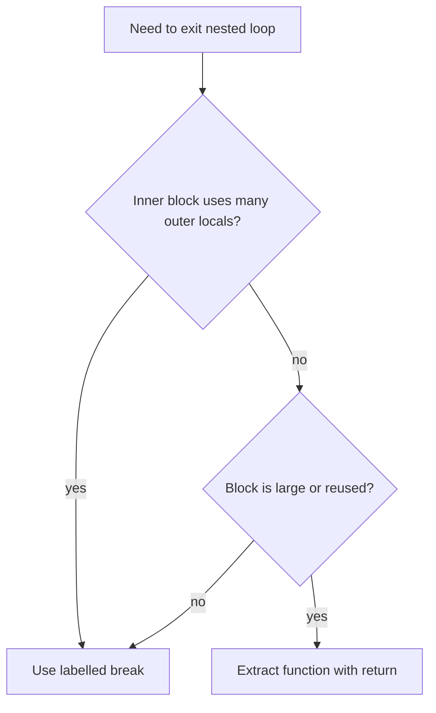

# Go Labeled Break and Continue — Middle Level

## 1. Introduction

At the middle level, labelled `break` and `continue` are not just syntax — they are a deliberate design choice. You decide between a labelled jump, a flag variable, an extracted helper with early `return`, or `goto`. You learn the patterns where labels read naturally, the patterns where they signal a need to refactor, and the subtle compile-error rules around scope and target type.

---

## 2. Prerequisites
- Junior-level material on labels
- Plain `break` and `continue`
- `for ... range` and `select` semantics
- Function design and early-return idioms
- Awareness of `goto`

---

## 3. Glossary

| Term | Definition |
|------|-----------|
| Labeled statement | A `for`, `switch`, or `select` preceded by an identifier and `:` |
| Branch statement | A `break`, `continue`, `goto`, or `return` that transfers control |
| Function-scoped label | A label visible only within its enclosing function |
| Target | The labelled statement reached by a labelled jump |
| Early-return refactor | Extracting a labelled inner block into a function so a plain `return` replaces the label |
| Flag-variable pattern | An anti-pattern that uses a boolean to simulate a labelled jump |
| `goto` | A separate construct that jumps to a label, with stricter rules than `break L`/`continue L` |

---

## 4. Core Concepts

### 4.1 The Three Targetable Statements

A label may name a `for`, `switch`, or `select`:

```go
Outer:
for i := 0; i < 3; i++ {
    Inner:
    switch i {
    case 1:
        break Inner
    }
}
```

`break L` works on all three. `continue L` works only when `L` names a `for`.

### 4.2 Why `continue` Cannot Target `switch` or `select`

A `for` has a clearly defined "next iteration" — the post statement runs, the condition is rechecked. A `switch` has no notion of "next iteration"; it executes one case and exits. A `select` similarly chooses one ready communication and exits. There is nothing to continue to.

This is why the spec restricts `continue L` to `for` labels.

### 4.3 The Labelled-Break-vs-Goto-vs-Flag Tradeoff

Three ways to exit a deeply nested loop:

```go
// 1. Labeled break
Outer:
for _, row := range grid {
    for _, v := range row {
        if v == target {
            break Outer
        }
    }
}

// 2. Goto
for _, row := range grid {
    for _, v := range row {
        if v == target {
            goto Done
        }
    }
}
Done:

// 3. Flag
done := false
for _, row := range grid {
    for _, v := range row {
        if v == target {
            done = true
            break
        }
    }
    if done {
        break
    }
}
```

The labelled break is the idiomatic Go choice. `goto` is reserved for special cases (forward error-handling, generated code). The flag variable adds noise without benefit.

### 4.4 The Extract-Function Refactor

Often the best alternative to a label is extraction:

```go
// Before
Search:
for _, row := range grid {
    for _, v := range row {
        if v == target {
            result = v
            break Search
        }
    }
}

// After
result, ok := find(grid, target)

func find(grid [][]int, target int) (int, bool) {
    for _, row := range grid {
        for _, v := range row {
            if v == target {
                return v, true
            }
        }
    }
    return 0, false
}
```

Extraction gives the inner code a name, improves testability, and replaces `break Search` with a plain `return`.

**When NOT to extract**: when the inner block uses many local variables of the outer scope. Extraction would force a long parameter list. In that case, the label is the cleaner option.

### 4.5 Multiple Labels on Nested Statements

```go
Rows:
for r := 0; r < N; r++ {
Cols:
    for c := 0; c < M; c++ {
        if grid[r][c] < 0 {
            continue Rows
        }
        if grid[r][c] == target {
            break Rows
        }
        if grid[r][c] > maxAllowed {
            break Cols
        }
    }
}
```

A reader can tell at a glance which loop each branch targets.

### 4.6 Labels on `switch` Statements

A label on a `switch` is useful when a `case` body needs to break out of a surrounding `for`:

```go
Outer:
for _, x := range values {
    switch x {
    case 0:
        break Outer // exits the for, not just the switch
    case 1:
        // a plain break here exits only the switch
    }
}
```

The label sits on the `for` (`Outer`), not on the `switch`. A label on the `switch` itself would be unnecessary unless you wanted `break Switch` from a nested block — which is rare.

### 4.7 Labels on `select`

```go
Loop:
for {
    select {
    case <-quit:
        break Loop
    case j := <-jobs:
        process(j)
    }
}
```

This is the canonical `for { select { } }` quit pattern. Without the label, `break` exits the `select` only and the `for` repeats forever.

---

## 5. Real-World Analogies

**Sudoku solver**: when you find a row without solutions, you `continue Rows` to skip the inner cell scan. When you find a contradiction, you `break Solver` to abort.

**A metro line with express and local trains**: a plain `break` is "exit this station." A `break Loop` is "leave the entire metro and go above ground."

**A switchboard operator**: a label is a label on a wire. The "break" instruction tells the operator to disconnect at the named wire, regardless of how many sub-conversations are in progress.

---

## 6. Mental Models

### Model 1 — Label as Anchor

```
Outer:                    ←── anchor
for i := 0; i < N; i++ {
    for j := 0; j < M; j++ {
        ...
        break Outer       ←── jump to anchor's exit
    }
}
                          ←── anchor's exit lands here
```

### Model 2 — `continue L` as Loop Restart

```
Outer:                    ←── anchor
for i := 0; i < N; i++ {  ←── loop restart point
    for j := 0; j < M; j++ {
        ...
        continue Outer    ←── jump to "i++ then condition"
    }
}
```

### Model 3 — Compile-Time Validation

The compiler checks:
1. Every label declared is referenced (otherwise: "label X defined and not used").
2. Every `break L`/`continue L` references a defined label in the same function.
3. `continue L` requires `L` to label a `for`.
4. The label must precede a `for`, `switch`, or `select` (not a block, `if`, etc.).

---

## 7. Pros & Cons

### Pros
- Clear nested-loop exit and skip
- Idiomatic for `for { select { } }` quit
- No runtime cost vs. unlabeled break
- Removes the need for `goto` in most cases
- Better than flag variables

### Cons
- Easy to abuse for control-flow that should be a function
- New Go developers may not realize unused labels are an error
- `continue L` only on `for` labels — easy to forget
- Multiple labels in one function can hurt readability if names are similar

---

## 8. Use Cases

1. Search in 2-D data with early exit
2. Skip to next outer iteration on bad sub-item
3. Quit `for { select { ... } }` cleanly
4. Token stream parsers with multiple stop conditions
5. Graph traversals with abort
6. Sudoku / N-queens / tic-tac-toe scans
7. Multi-level state-machine transitions
8. Filter-then-process pipelines

---

## 9. Code Examples

### Example 1 — Worker Loop With Multiple Quit Reasons

```go
package main

import (
    "context"
    "fmt"
    "time"
)

func worker(ctx context.Context, jobs <-chan int) error {
Loop:
    for {
        select {
        case <-ctx.Done():
            return ctx.Err()
        case j, ok := <-jobs:
            if !ok {
                break Loop
            }
            if err := handle(j); err != nil {
                fmt.Println("handle err:", err)
                break Loop
            }
        }
    }
    return nil
}

func handle(j int) error { return nil }

func main() {
    ctx, cancel := context.WithCancel(context.Background())
    defer cancel()
    jobs := make(chan int)
    go func() { close(jobs) }()
    err := worker(ctx, jobs)
    fmt.Println("worker:", err)
    _ = time.Second
}
```

The label `Loop` lets `break` escape the `for { select { ... } }`.

### Example 2 — Tic-Tac-Toe Win Scan

```go
package main

import "fmt"

func winner(b [3][3]string) string {
    // Check rows
Rows:
    for r := 0; r < 3; r++ {
        c := b[r][0]
        if c == " " {
            continue Rows
        }
        for k := 1; k < 3; k++ {
            if b[r][k] != c {
                continue Rows
            }
        }
        return c
    }
    // Check columns
Cols:
    for c := 0; c < 3; c++ {
        v := b[0][c]
        if v == " " {
            continue Cols
        }
        for k := 1; k < 3; k++ {
            if b[k][c] != v {
                continue Cols
            }
        }
        return v
    }
    return ""
}

func main() {
    b := [3][3]string{
        {"X", "O", "X"},
        {"O", "X", "O"},
        {"O", "O", "X"},
    }
    fmt.Println("winner:", winner(b)) // X (diagonal not checked here, kept brief)
}
```

### Example 3 — Nested Comparison Search

```go
package main

import "fmt"

func main() {
    a := []int{3, 1, 4, 1, 5, 9, 2, 6}
    b := []int{7, 5, 3, 0, 9, 4, 6}

    var match int
    found := false
Outer:
    for _, x := range a {
        for _, y := range b {
            if x == y {
                match = x
                found = true
                break Outer
            }
        }
    }
    fmt.Println(match, found) // 3 true
}
```

### Example 4 — Validate-Then-Process Pipeline

```go
package main

import "fmt"

type Order struct {
    ID    int
    Items []Item
}

type Item struct {
    Qty   int
    Price float64
}

func processOrders(orders []Order) (total float64, rejected int) {
Order:
    for _, o := range orders {
        sum := 0.0
        for _, it := range o.Items {
            if it.Qty <= 0 || it.Price < 0 {
                rejected++
                continue Order
            }
            sum += float64(it.Qty) * it.Price
        }
        total += sum
    }
    return
}

func main() {
    orders := []Order{
        {ID: 1, Items: []Item{{Qty: 2, Price: 5}, {Qty: 1, Price: 10}}},
        {ID: 2, Items: []Item{{Qty: -1, Price: 5}}},
        {ID: 3, Items: []Item{{Qty: 3, Price: 4}}},
    }
    total, rejected := processOrders(orders)
    fmt.Printf("total=%.2f rejected=%d\n", total, rejected) // total=32.00 rejected=1
}
```

### Example 5 — Refactor: Label vs. Helper Function

```go
package main

import "fmt"

// Version A — label
func searchA(grid [][]int, target int) (int, int, bool) {
    var ri, ci int
    found := false
Search:
    for i, row := range grid {
        for j, v := range row {
            if v == target {
                ri, ci = i, j
                found = true
                break Search
            }
        }
    }
    return ri, ci, found
}

// Version B — extracted, no label needed
func searchB(grid [][]int, target int) (int, int, bool) {
    for i, row := range grid {
        for j, v := range row {
            if v == target {
                return i, j, true
            }
        }
    }
    return 0, 0, false
}

func main() {
    g := [][]int{{1, 2, 3}, {4, 5, 6}}
    fmt.Println(searchA(g, 5)) // 1 1 true
    fmt.Println(searchB(g, 5)) // 1 1 true
}
```

Both work. Version B is shorter because Go's `return` from any depth is the natural early exit.

---

## 10. Coding Patterns

### Pattern 1 — Search With Single Result

```go
Found:
for _, row := range grid {
    for _, v := range row {
        if matches(v) {
            result = v
            break Found
        }
    }
}
```

### Pattern 2 — Skip-Group on Bad Item

```go
Group:
for _, g := range groups {
    for _, item := range g.Items {
        if !valid(item) {
            continue Group
        }
    }
    process(g)
}
```

### Pattern 3 — `for { select { ... } }` Shutdown

```go
Loop:
for {
    select {
    case <-stop:
        break Loop
    case w := <-work:
        do(w)
    }
}
```

### Pattern 4 — Multiple Quit Reasons

```go
Loop:
for {
    select {
    case <-ctx.Done():
        return ctx.Err()
    case j, ok := <-jobs:
        if !ok {
            break Loop
        }
        if err := handle(j); err != nil {
            return err
        }
    }
}
```

### Pattern 5 — Nested Search With Status

```go
Outer:
for i := 0; i < N; i++ {
    for j := 0; j < M; j++ {
        switch state {
        case Done:
            break Outer
        case Skip:
            continue Outer
        }
    }
}
```

---

## 11. Clean Code Guidelines

1. **Capitalize labels** to make them visually stand out.
2. **Use one label per loop** — multiple labels with similar names confuse readers.
3. **Place the label on a line by itself** directly above the targeted statement.
4. **Comment the intent** when the label's purpose is non-obvious.
5. **Limit nesting depth** — three levels is usually the maximum before extraction is better.
6. **Prefer extraction with early `return`** when the inner block uses few outer locals.

```go
// Good
Find:
for _, row := range grid {
    for _, v := range row {
        if v == target {
            break Find
        }
    }
}

// Worse — using goto for the same effect
for _, row := range grid {
    for _, v := range row {
        if v == target {
            goto FoundIt
        }
    }
}
FoundIt:

// Best when local-variable use permits — extract
v, ok := find(grid, target)
```

---

## 12. Product Use / Feature Example

**A streaming CSV validator with early stop**:

```go
package main

import (
    "bufio"
    "fmt"
    "io"
    "strings"
)

func validate(r io.Reader) (int, error) {
    sc := bufio.NewScanner(r)
    line := 0
Lines:
    for sc.Scan() {
        line++
        fields := strings.Split(sc.Text(), ",")
        if len(fields) < 3 {
            return line, fmt.Errorf("line %d: too few fields", line)
        }
        for fi, f := range fields {
            if f == "" {
                return line, fmt.Errorf("line %d field %d: empty", line, fi)
            }
            if strings.HasPrefix(f, "#") {
                continue Lines // comment row — skip the rest
            }
        }
    }
    return line, sc.Err()
}

func main() {
    data := "a,b,c\nd,e,f\n#x,#y,#z\ng,h,i\n"
    n, err := validate(strings.NewReader(data))
    fmt.Println(n, err)
}
```

`continue Lines` skips the field validation for comment rows.

---

## 13. Error Handling

Labelled break/continue interacts cleanly with errors:

```go
var firstErr error
Loop:
for _, batch := range batches {
    for _, item := range batch.Items {
        if err := check(item); err != nil {
            firstErr = err
            break Loop
        }
    }
}
if firstErr != nil {
    return firstErr
}
```

Or, when extraction is appropriate:

```go
if err := validate(batches); err != nil {
    return err
}
```

The label form is fine when extraction is awkward.

---

## 14. Security Considerations

1. **Defer still runs** after a labelled break — it does not bypass cleanup.
2. **Labels cannot escape a function** — no risk of jumping past defenses.
3. **Don't use labels to skip authorization** — gate access before any labelled jump.
4. **A label-driven early exit** must still leave invariants consistent (e.g., do not partial-write results then `break Loop`).

---

## 15. Performance Tips

1. The compiler emits the same control-flow edges for labelled and non-labelled branches.
2. There is no measurable difference between `break L` and a plain `break` followed by an outer flag check.
3. Avoid restructuring code only to insert a label — readability dominates.
4. In hot loops, prefer `break L` over a flag variable: one fewer branch per iteration.
5. Extracting a labelled block into a function may add a call — verify with a benchmark in hot paths.

---

## 16. Metrics & Analytics

```go
var iterations int
Outer:
for _, batch := range batches {
    for _, item := range batch.Items {
        iterations++
        if matched(item) {
            break Outer
        }
    }
}
metrics.RecordIters("scan", iterations)
```

The label keeps the early-exit path tight; the counter records work done.

---

## 17. Best Practices

1. Use `break L` for nested-loop early exit.
2. Use `continue L` to skip the rest of the current outer iteration.
3. Use `break L` to exit `for { select { } }` loops.
4. Reach for extraction when nesting exceeds three levels or the inner block grows large.
5. Avoid flag variables to simulate labelled exit.
6. Use `goto` only for forward error-handling jumps that labels cannot express.
7. Keep label names capitalized and short.
8. Place the label on a separate line.

---

## 18. Edge Cases & Pitfalls

### Pitfall 1 — `for { select { ... } }` Without a Label

```go
for {
    select {
    case <-quit:
        break // exits the select only — for loops forever
    }
}
```

Fix: label the for and use `break Loop`.

### Pitfall 2 — Unused Label

```go
Outer:
for _, x := range xs { // never references Outer
    process(x)
}
// compile error
```

### Pitfall 3 — `continue` On a `switch` Label

```go
Inner:
switch x {
case 1:
    continue Inner // ERROR
}
```

`continue` requires a `for` label.

### Pitfall 4 — Same Label Re-declared

```go
func f() {
Outer:
    for i := 0; i < 3; i++ { break Outer }
Outer: // compile error: redeclared
    for j := 0; j < 3; j++ { break Outer }
}
```

### Pitfall 5 — Label On a Wrong Statement

```go
Outer: { // ERROR: blocks can be labelled only as goto targets
    fmt.Println("hi")
}
```

For `break`/`continue`, the label must precede `for`, `switch`, or `select`.

### Pitfall 6 — Confusion With `goto`

`goto L` requires `L` to be on a statement reachable forward (with restrictions on jumping over variable declarations). `break L`/`continue L` are restricted to enclosing `for`/`switch`/`select` and don't have those forward-jump rules.

---

## 19. Common Mistakes

| Mistake | Fix |
|---------|-----|
| Plain `break` inside `for { select { } }` | Use `break Label` with a label on the `for` |
| Unused label | Use it or remove it |
| Trying to `continue` a `switch` label | Move the label to the surrounding `for` |
| Using a flag variable instead of a label | Use the label; cleaner and faster |
| Over-nesting that the label cannot rescue | Refactor into a function |

---

## 20. Common Misconceptions

**Misconception 1**: "`break L` is a kind of `goto`."
**Truth**: It is structured. It can only target an enclosing `for`/`switch`/`select`, jumping to the position immediately after the labelled statement.

**Misconception 2**: "Labels are global to the package."
**Truth**: They are local to the function.

**Misconception 3**: "I should always extract instead of using labels."
**Truth**: Extraction is great when the inner block is self-contained. When it depends on many outer locals, the label is cleaner.

**Misconception 4**: "Labelled break is slower than plain break."
**Truth**: Identical machine code, identical control-flow.

**Misconception 5**: "`continue L` always works on any label."
**Truth**: Only on labels naming a `for`.

---

## 21. Tricky Points

1. The `continue` requires a `for` label — `switch`/`select` labels are valid for `break` only.
2. `for { select { ... } }` requires a label to break the outer `for`.
3. Labels are function-scoped and unique within the function.
4. Unused labels are a compile error.
5. A label declares no variable — it is purely a control-flow marker.
6. `break L` runs all `defer`s registered in scopes between the branch and the labelled statement's exit, just like a plain `break`.

---

## 22. Test

```go
package main

import "testing"

func sumPositiveRows(grid [][]int) []int {
    sums := []int{}
Row:
    for _, row := range grid {
        sum := 0
        for _, v := range row {
            if v < 0 {
                continue Row
            }
            sum += v
        }
        sums = append(sums, sum)
    }
    return sums
}

func TestSumPositiveRows(t *testing.T) {
    g := [][]int{
        {1, 2, 3},
        {4, -1, 6},
        {7, 8, 9},
    }
    got := sumPositiveRows(g)
    want := []int{6, 24}
    if len(got) != len(want) {
        t.Fatalf("len(got)=%d want %d", len(got), len(want))
    }
    for i := range got {
        if got[i] != want[i] {
            t.Errorf("[%d]: got %d want %d", i, got[i], want[i])
        }
    }
}
```

---

## 23. Tricky Questions

**Q1**: What does this print?
```go
Outer:
for i := 0; i < 3; i++ {
    switch i {
    case 1:
        break Outer
    default:
        fmt.Println(i)
    }
}
```
**A**: `0`. When `i == 1`, `break Outer` exits the for entirely.

**Q2**: Compile error or runs?
```go
Outer:
for _, x := range xs {
    if x == 0 {
        continue Outer
    }
    process(x)
}
```
**A**: Compile error — the label `Outer` is unused unless a NESTED `for`/`switch`/`select` uses it. Wait — is `continue Outer` from inside the SAME loop legal? Yes, but redundant; the compiler treats the label as USED. So this actually compiles. It's just a verbose way to write `continue`.

**Q3**: What's wrong here?
```go
func main() {
    for i := 0; i < 3; i++ {
        for j := 0; j < 3; j++ {
            break Outer
        }
    }
}
```
**A**: Compile error: `Outer` is undefined.

---

## 24. Cheat Sheet

```go
// Break outer
Outer:
for ... {
    for ... {
        break Outer
    }
}

// Continue outer
Outer:
for ... {
    for ... {
        continue Outer
    }
}

// for-select quit
Loop:
for {
    select {
    case <-quit: break Loop
    case j := <-jobs: handle(j)
    }
}

// Refactor sketch (label → extracted helper)
func find(grid [][]int, t int) (int, int, bool) {
    for i, row := range grid {
        for j, v := range row {
            if v == t {
                return i, j, true
            }
        }
    }
    return 0, 0, false
}

// Bad: flag variable
done := false
for ... {
    for ... {
        if cond { done = true; break }
    }
    if done { break }
}
// Fix: use a label
```

---

## 25. Self-Assessment Checklist

- [ ] I can use `break L` and `continue L` correctly
- [ ] I understand that `continue L` requires a `for` label
- [ ] I know labels are function-scoped
- [ ] I know unused labels are compile errors
- [ ] I can quit `for { select { } }` with `break Label`
- [ ] I refactor into a helper when extraction is cleaner
- [ ] I avoid flag-variable simulations of labelled jumps
- [ ] I distinguish `break L` from `goto`

---

## 26. Summary

Labels mark `for`, `switch`, or `select` statements so `break`/`continue` can target them. The two most common idioms are nested-loop early exit and `for { select { } }` quit. Use labels sparingly; reach for function extraction when the inner block grows or stops sharing many outer locals. Avoid flag variables — they hide intent and add branches. `continue` requires a `for` label; `break` works on any of the three. Labels are function-scoped, must be used, and have zero runtime cost.

---

## 27. What You Can Build

- 2-D grid scanners with early termination
- Token-stream parsers
- Worker loops with quit channels
- Validators with skip-on-comment support
- Tic-tac-toe / Sudoku solvers
- Match-the-pair searches
- Multi-condition state machines
- Streaming pipelines with cutoff

---

## 28. Further Reading

- [Go Spec — Break statements](https://go.dev/ref/spec#Break_statements)
- [Go Spec — Continue statements](https://go.dev/ref/spec#Continue_statements)
- [Go Spec — Labeled statements](https://go.dev/ref/spec#Labeled_statements)
- [Effective Go — Control structures](https://go.dev/doc/effective_go#control-structures)
- [Dave Cheney — Avoiding flag variables](https://dave.cheney.net/practical-go/presentations/qcon-china.html)

---

## 29. Related Topics

- 2.5.1 For Loop
- 2.5.2 For Range
- 2.5.3 Break
- 2.5.4 Continue
- 2.5.5 Goto
- 2.4 Switch and Select
- 2.6 Functions (early-return refactor)

---

## 30. Diagrams & Visual Aids

### Choice tree



### `for { select { } }` quit

```
       ┌──────────────┐
       │  Loop:       │
       │  for {       │
       │    select {  │
       │      case <-quit:
       │        break Loop ──┐
       │      case j:        │
       │        handle(j)    │
       │    }                │
       │  }                  │
       └─────────────────────┘
                              │
                          continues here
```
