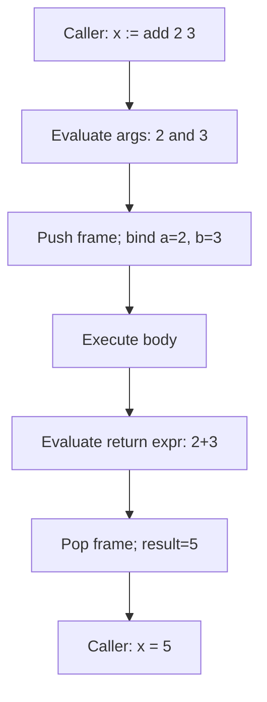

# Go Functions Basics — Junior Level

## 1. Introduction

### What is it?
A **function** is a named, reusable block of code that takes inputs (parameters), does some work, and optionally returns one or more outputs. In Go, every program starts with a function called `main`, and functions are how you organize logic into pieces you can call from anywhere in your program.

### How to use it?
```go
func name(parameters) returnType {
    // body
    return value
}
```

```go
package main

import "fmt"

func add(a int, b int) int {
    return a + b
}

func main() {
    sum := add(3, 4)
    fmt.Println(sum) // 7
}
```

---

## 2. Prerequisites
- Basic Go syntax: variables, types, `fmt.Println`
- Knowledge of Go data types (int, string, bool)
- Understanding of `package main` and the `main()` entry point

---

## 3. Glossary

| Term | Definition |
|------|-----------|
| `func` | The keyword that declares a function |
| function name | The identifier used to call the function (e.g., `add`) |
| parameter | A named input variable in the function declaration |
| argument | The actual value passed at the call site |
| return type | The type of value the function gives back |
| return statement | `return expr` — exits the function with a value |
| call | Invoking the function with `name(args)` |
| signature | The combination of parameter types and result types |
| void function | A function that returns nothing |
| `main` | The entry point of any executable Go program |
| `init` | A special function that runs before `main` |
| first-class value | A function that can be stored in variables, passed around, returned |

---

## 4. Core Concepts

### 4.1 Declaring a Function
The `func` keyword starts the declaration. After the name come parentheses with parameters, then the return type, then the body in braces.

```go
func greet(name string) string {
    return "Hello, " + name
}
```

### 4.2 Calling a Function
Use the function name followed by parentheses with arguments:

```go
msg := greet("Ada")
fmt.Println(msg) // Hello, Ada
```

### 4.3 Functions With No Parameters or No Return
```go
func sayHi() {                     // no params, no return
    fmt.Println("Hi!")
}

func answer() int {                // no params, returns int
    return 42
}

func log(message string) {         // takes input, returns nothing
    fmt.Println("[LOG]", message)
}
```

### 4.4 Multiple Parameters
List each parameter with its type. If consecutive parameters share a type, you can group them.

```go
func area(width float64, height float64) float64 {
    return width * height
}

// Equivalent — grouped because both are float64:
func areaGrouped(width, height float64) float64 {
    return width * height
}
```

### 4.5 The `return` Statement
A function with a return type **must** end with a `return`. The returned value's type must match the declared return type.

```go
func double(x int) int {
    return x * 2 // must match return type `int`
}
```

A function with no return type may omit `return`:
```go
func shout(msg string) {
    fmt.Println(strings.ToUpper(msg))
    // no return needed
}
```

---

## 5. Real-World Analogies

**A vending machine**: You put in money (arguments), press a button (call the function), and a snack comes out (return value). The machine's internal mechanism is hidden — you only see inputs and outputs.

**A recipe**: A recipe says "given flour, sugar, and eggs, produce a cake." The recipe is the function declaration; cooking it once is the call.

**A calculator button**: Pressing `√` on a calculator takes one input (the displayed number) and produces one output (its square root). Functions are reusable buttons.

---

## 6. Mental Models

```
            ┌─────────────────────────────┐
arguments   │                             │   return value
   ────────►│   func name(params) result  │────────►
            │   { ...body... }            │
            └─────────────────────────────┘
```

**Black-box thinking**: When you call `len(s)` you don't care HOW it counts — you just trust that you give it a string and get an int back. Functions let you treat code as black boxes once you've written them.

---

## 7. Pros & Cons

### Pros
- Reusability: write once, call many times
- Readability: a named function is self-documenting
- Testability: small functions are easy to test in isolation
- Decomposition: large problems split into small named pieces
- Composition: functions can call other functions

### Cons
- Excessive small functions can fragment logic and hurt readability
- Each call has a small overhead (negligible in 99% of code)
- Recursion depth is limited by goroutine stack size

---

## 8. Use Cases

1. Computing a value from inputs (math, parsing, formatting)
2. Performing a side effect (printing, writing to a file)
3. Validating input
4. Encapsulating a step of an algorithm
5. Wrapping an external API call
6. Implementing a callback for sorting, filtering, or iterating
7. Defining a package's public interface (`Exported` names)

---

## 9. Code Examples

### Example 1 — Simple Add
```go
package main

import "fmt"

func add(a, b int) int {
    return a + b
}

func main() {
    fmt.Println(add(2, 3)) // 5
}
```

### Example 2 — Greeting Builder
```go
package main

import "fmt"

func greet(name string) string {
    return "Hello, " + name + "!"
}

func main() {
    fmt.Println(greet("Ada"))
    fmt.Println(greet("Linus"))
}
```

### Example 3 — Validating Input
```go
package main

import "fmt"

func isAdult(age int) bool {
    return age >= 18
}

func main() {
    fmt.Println(isAdult(17)) // false
    fmt.Println(isAdult(21)) // true
}
```

### Example 4 — Computing a Value
```go
package main

import "fmt"

func celsiusToFahrenheit(c float64) float64 {
    return c*9/5 + 32
}

func main() {
    fmt.Printf("%.1f°F\n", celsiusToFahrenheit(100)) // 212.0°F
}
```

### Example 5 — Function With No Return
```go
package main

import "fmt"

func banner(title string) {
    fmt.Println("==================")
    fmt.Println(" ", title)
    fmt.Println("==================")
}

func main() {
    banner("Welcome")
}
```

### Example 6 — Calling a Function from Another Function
```go
package main

import "fmt"

func square(x int) int {
    return x * x
}

func sumOfSquares(a, b int) int {
    return square(a) + square(b)
}

func main() {
    fmt.Println(sumOfSquares(3, 4)) // 9 + 16 = 25
}
```

### Example 7 — Function Stored in a Variable
```go
package main

import "fmt"

func double(x int) int { return x * 2 }

func main() {
    var op func(int) int = double
    fmt.Println(op(5)) // 10
}
```

---

## 10. Coding Patterns

### Pattern 1 — Helper Function
```go
func clamp(x, lo, hi int) int {
    if x < lo {
        return lo
    }
    if x > hi {
        return hi
    }
    return x
}
```

### Pattern 2 — Predicate (returns bool)
```go
func isEven(n int) bool {
    return n%2 == 0
}
```

### Pattern 3 — Constructor
```go
type User struct {
    Name string
    Age  int
}

func newUser(name string, age int) User {
    return User{Name: name, Age: age}
}
```

### Pattern 4 — Pure Computation
A "pure" function depends only on its inputs and produces no side effects:
```go
func multiply(a, b int) int { return a * b }
```

### Pattern 5 — Wrapper
```go
func logged(action string) {
    fmt.Println(">>>", action)
    // do the action
    fmt.Println("<<<", action)
}
```

---

## 11. Clean Code Guidelines

1. **One function, one responsibility.** If a function is doing two things, split it.
2. **Use clear, verb-based names**: `calculateTotal`, `validateEmail`, not `do` or `process`.
3. **Keep functions short** — if a function does not fit on one screen, consider splitting.
4. **Prefer few parameters**: 0–3 is ideal; 4+ suggests you should pass a struct instead.
5. **Avoid deep nesting**: use early returns to flatten the body.

```go
// Good — early return:
func divide(a, b float64) (float64, error) {
    if b == 0 {
        return 0, fmt.Errorf("division by zero")
    }
    return a / b, nil
}

// Bad — nested:
func divideBad(a, b float64) (float64, error) {
    if b != 0 {
        return a / b, nil
    } else {
        return 0, fmt.Errorf("division by zero")
    }
}
```

---

## 12. Product Use / Feature Example

**A checkout total calculator**:
```go
package main

import "fmt"

func itemTotal(price float64, quantity int) float64 {
    return price * float64(quantity)
}

func applyDiscount(total, percent float64) float64 {
    return total * (1 - percent/100)
}

func main() {
    subtotal := itemTotal(19.99, 3)
    final := applyDiscount(subtotal, 10) // 10% off
    fmt.Printf("You pay: $%.2f\n", final)
}
```

Each function does one well-named thing and is trivially testable.

---

## 13. Error Handling

Junior idiom: if your function can fail, return `(value, error)`.

```go
package main

import (
    "errors"
    "fmt"
)

func safeDivide(a, b int) (int, error) {
    if b == 0 {
        return 0, errors.New("division by zero")
    }
    return a / b, nil
}

func main() {
    result, err := safeDivide(10, 0)
    if err != nil {
        fmt.Println("error:", err)
        return
    }
    fmt.Println(result)
}
```

(Multiple returns are covered in detail in 2.6.3.)

---

## 14. Security Considerations

1. **Validate inputs at the boundary**: never trust caller-supplied strings/numbers without bounds checks.
2. **Never log sensitive parameters** like passwords or tokens.
3. **Avoid panicking on bad input** in library code; return an error instead.
4. **Use named functions** for security-critical operations so they can be reviewed and tested.

```go
func validatePort(p int) error {
    if p < 1 || p > 65535 {
        return fmt.Errorf("port out of range: %d", p)
    }
    return nil
}
```

---

## 15. Performance Tips

1. **Don't worry about call overhead** for normal code — Go's compiler inlines small functions automatically.
2. **Avoid copying huge structs** as parameters — pass a pointer (`*BigStruct`) when the struct is large (>~64 bytes).
3. **Reuse functions instead of duplicating logic** — duplicate code is harder to optimize later.
4. **Avoid unnecessary allocations inside hot functions** (covered in middle/senior levels).

```go
// Less efficient for large structs:
func processBig(s BigStruct) { /* copies all fields */ }

// Better:
func processBig(s *BigStruct) { /* passes pointer (8 bytes) */ }
```

---

## 16. Metrics & Analytics

```go
import "time"

func timed(name string, fn func()) {
    start := time.Now()
    fn()
    fmt.Printf("[%s] took %v\n", name, time.Since(start))
}

func main() {
    timed("expensive-op", func() {
        // ... work ...
    })
}
```

---

## 17. Best Practices

1. Give functions clear, action-oriented names.
2. Keep parameter lists short.
3. Prefer return values over modifying caller state via pointers when possible.
4. Document exported (capitalized) functions with a `// Name describes ...` comment.
5. Make functions pure when feasible — easier to reason about and test.
6. Always handle returned errors.

---

## 18. Edge Cases & Pitfalls

### Pitfall 1 — Forgetting a `return`
```go
func bad(a, b int) int {
    sum := a + b
    // forgot return
} // compile error: missing return
```

### Pitfall 2 — Wrong Return Type
```go
func ageNextYear(age int) string {
    return age + 1 // compile error: cannot use age + 1 (int) as string
}
```

### Pitfall 3 — Calling a `nil` Function Variable
```go
var f func()
f() // panic: runtime error: invalid memory address or nil pointer dereference
```

### Pitfall 4 — Trying to Define a Nested Named Function
```go
func outer() {
    func inner() {} // compile error: nested func not allowed
}
// Use anonymous function instead:
func outer2() {
    inner := func() {}
    inner()
}
```

### Pitfall 5 — Two Functions With the Same Name
```go
func add(a, b int) int    { return a + b }
func add(a, b string) string { return a + b } // compile error: add redeclared
```

---

## 19. Common Mistakes

| Mistake | Fix |
|---------|-----|
| Forgetting `return` in a non-void function | Add `return value` at end of every code path |
| Mismatched return type | Match function signature exactly |
| Calling without enough arguments | Pass every required argument |
| Trying default values | Use option struct or extra function |
| Calling a `nil` function variable | Initialize before calling |
| Capitalization mistake (`fmt.println` vs `fmt.Println`) | Exported names start with uppercase |

---

## 20. Common Misconceptions

**Misconception 1**: "Functions in Go must return something."
**Truth**: A function may have no return type — those are sometimes called void functions.

**Misconception 2**: "Go has function overloading like Java."
**Truth**: Go does NOT support overloading. Each function name must be unique within a package.

**Misconception 3**: "I can give parameters default values."
**Truth**: Go has no default parameter values. Use overload-by-name or option structs.

**Misconception 4**: "Functions can be defined inside other functions."
**Truth**: Only **anonymous** functions (function literals) can; named functions must be at package level.

**Misconception 5**: "If I pass a slice to a function, it's a reference, so any change is visible to the caller."
**Truth**: The slice header is passed by value, but the underlying array is shared. Modifying *elements* is visible; appending may or may not be visible. (See 2.7.3.)

---

## 21. Tricky Points

1. The function name must be unique in the package (no overloading).
2. Parameters are always passed by value — even slices and maps (their headers are copied).
3. The return type goes after the parameter list, not before like in C/Java.
4. `func main()` takes NO arguments and returns NO values — use `os.Args` for CLI args.
5. A function with a result must have a `return` on every path — including inside `if`/`switch` branches.

---

## 22. Test

```go
package main

import "testing"

func add(a, b int) int { return a + b }

func TestAdd(t *testing.T) {
    tests := []struct {
        a, b, want int
    }{
        {1, 2, 3},
        {-1, 1, 0},
        {0, 0, 0},
        {100, 200, 300},
    }
    for _, tt := range tests {
        if got := add(tt.a, tt.b); got != tt.want {
            t.Errorf("add(%d, %d) = %d; want %d", tt.a, tt.b, got, tt.want)
        }
    }
}
```

---

## 23. Tricky Questions

**Q1**: What is the output?
```go
func double(x int) int { return x * 2 }
func main() {
    n := 5
    double(n)
    fmt.Println(n)
}
```
**A**: `5`. The function does NOT modify `n` — it receives a copy. The result `10` is discarded.

**Q2**: Will this compile?
```go
func mystery() int {
    if true {
        return 1
    }
}
```
**A**: **No**. Even though the `if true` branch is logically always taken, the compiler requires every code path to have a return.

**Q3**: What is printed?
```go
func choose() func() int {
    return func() int { return 42 }
}
func main() {
    fmt.Println(choose()())
}
```
**A**: `42`. `choose()` returns a function, and the second `()` calls it.

---

## 24. Cheat Sheet

```go
// No params, no return
func ping() { }

// One param, one return
func double(x int) int { return x * 2 }

// Multiple params (grouped)
func add(a, b int) int { return a + b }

// Mixed param types
func tag(name string, count int) string { return "" }

// Multiple return values (covered in 2.6.3)
func divmod(a, b int) (int, int) { return a / b, a % b }

// Function value in a variable
var op func(int, int) int = add

// Calling
result := add(1, 2)
```

---

## 25. Self-Assessment Checklist

- [ ] I can declare a function with the `func` keyword
- [ ] I understand parameters and arguments
- [ ] I can write a function that returns a value
- [ ] I can call a function and use its return value
- [ ] I know that `main()` takes no arguments and returns nothing
- [ ] I understand that Go has no default parameter values
- [ ] I know that nested named functions are not allowed
- [ ] I can store a function in a variable
- [ ] I can pass a function as an argument
- [ ] I know that arguments are passed by value

---

## 26. Summary

A Go function is declared with `func name(params) returnType { body }`. Functions are first-class values: you can store them in variables, pass them as arguments, and return them. Every parameter is passed by value (the function gets a copy). Each program needs exactly one `func main()` in package `main`. Go does not support function overloading or default parameter values. Use multiple return values when you need to return data plus an error.

---

## 27. What You Can Build

- Calculator functions (add, subtract, multiply, divide)
- Input validators (email, phone, range checks)
- Formatters and converters
- Small CLI utilities
- Reusable helper libraries
- Test fixtures and helpers

---

## 28. Further Reading

- [Go Tour — Functions](https://go.dev/tour/basics/4)
- [Effective Go — Functions](https://go.dev/doc/effective_go#functions)
- [Go Specification — Function declarations](https://go.dev/ref/spec#Function_declarations)
- [Go Blog — Errors are values](https://go.dev/blog/errors-are-values)

---

## 29. Related Topics

- 2.6.2 Variadic Functions
- 2.6.3 Multiple Return Values
- 2.6.4 Anonymous Functions
- 2.6.5 Closures
- 2.6.7 Call by Value
- 2.7 Pointers (for passing by reference)
- Chapter 3 Methods (functions with a receiver)

---

## 30. Diagrams & Visual Aids

### Anatomy of a function

```
         ┌── keyword
         │
         │   ┌── name
         │   │
         │   │     ┌── parameter list (name + type)
         │   │     │
         │   │     │           ┌── return type
         │   │     │           │
         │   │     │           │       ┌── body
         ▼   ▼     ▼           ▼       ▼
        func add(a, b int)   int    { return a + b }
```

### Function call flow


