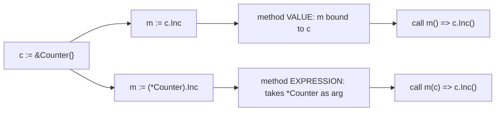

# Go Functions Basics — Middle Level

## 1. Introduction

At the middle level, you understand functions as **typed values** that participate in the type system: you assign them to variables, pass them through interfaces, store them in data structures, and reason about their identity, lifetime, and cost. You are comfortable distinguishing the function *type* from the function *value*, and you know which patterns are idiomatic in production Go.

---

## 2. Prerequisites
- Junior-level Go functions material
- Solid understanding of Go's basic types, slices, maps, and structs
- Familiarity with `interface{}` / `any`, type assertions
- Basic awareness of `defer` and error returns

---

## 3. Glossary

| Term | Definition |
|------|-----------|
| Function value | A runtime value of function type that can be invoked |
| Function type | The compile-time type `func(...)...` |
| Signature | The parameter+result list portion of the type |
| Receiver | The (object, type) bound when you take a method value (`obj.M`) |
| Method value | A bound function value created by `obj.M` |
| Method expression | An unbound function value created by `T.M` whose first param is the receiver |
| Higher-order function | A function that takes or returns another function |
| Pure function | A function with no side effects whose result depends only on inputs |
| Idempotent function | A function that has the same effect when called multiple times |
| Calling convention | How arguments and results move between caller and callee (registers/stack) |
| Inlining | The compiler replacing a call with the function body |
| Escape analysis | The compiler deciding whether a value lives on stack or heap |

---

## 4. Core Concepts

### 4.1 Function Type vs Function Value
The *type* `func(int, int) int` is what the compiler checks. A *value* of that type is the actual function (a pointer to code plus optional captured variables for closures).

```go
type BinOp func(int, int) int          // a named function type

var op BinOp                           // value of that type — currently nil
op = func(a, b int) int { return a + b } // assign a function literal
fmt.Println(op(2, 3))                  // 5

if op == nil {                         // only nil-comparison is allowed
    panic("nil op")
}
```

### 4.2 Function Type Identity Ignores Names
Two function types are identical if their parameter and result types match in order. Parameter names are decorative.

```go
type A func(a, b int) int
type B func(x, y int) int      // identical to A
type C func(int, int) int      // identical to A and B
```

You can assign a value of type `func(int,int) int` directly to a variable of type `A`, `B`, or `C`.

### 4.3 Functions as First-Class Values
Functions can be:
- assigned: `f := add`
- passed: `apply(add, 1, 2)`
- returned: `func make() func(int) int`
- stored: `[]func(){...}`, `map[string]func(...)...`
- compared to nil: `if f == nil`

```go
func runAll(steps []func() error) error {
    for i, step := range steps {
        if err := step(); err != nil {
            return fmt.Errorf("step %d: %w", i, err)
        }
    }
    return nil
}
```

### 4.4 Methods Are Functions
A method is just a function with an extra receiver. You can convert between them in two ways:

**Method value** — bound to a specific receiver:
```go
type Counter struct{ n int }
func (c *Counter) Inc() { c.n++ }

c := &Counter{}
inc := c.Inc            // method value: bound to *this* c
inc(); inc(); inc()
fmt.Println(c.n)        // 3
```

**Method expression** — unbound, receiver is the first parameter:
```go
incExpr := (*Counter).Inc   // func(*Counter)
c2 := &Counter{}
incExpr(c2)
fmt.Println(c2.n)           // 1
```

### 4.5 Higher-Order Functions
Pass behavior as data:

```go
func filter[T any](xs []T, keep func(T) bool) []T {
    out := xs[:0]
    for _, x := range xs {
        if keep(x) {
            out = append(out, x)
        }
    }
    return out
}

evens := filter([]int{1, 2, 3, 4, 5}, func(n int) bool { return n%2 == 0 })
fmt.Println(evens) // [2 4]
```

### 4.6 The `init` Order Within and Across Packages
Within a single package:
1. All package-level variable initializers run (in declaration order, respecting dependencies).
2. Then every `init()` function runs in source order.
3. Multiple files: deterministic by file name (alphabetical), then declaration order within each file.

Across packages: a package's init runs after all its imports' inits complete. The runtime guarantees each package is initialized once.

```go
// file: a.go
package main
import "fmt"
var x = compute()
func compute() int { fmt.Println("var init"); return 1 }
func init() { fmt.Println("init A") }

// file: b.go
package main
func init() { fmt.Println("init B") }

func main() { fmt.Println("main") }
```

Output (alphabetical file order):
```
var init
init A
init B
main
```

---

## 5. Real-World Analogies

**A toolbox**: each function is a labeled tool. Higher-order functions are tools that hold other tools (e.g., a screwdriver handle that accepts different bits).

**An assembly line**: passing data through a chain of functions is like a product moving through workstations. Each station has a single job.

---

## 6. Mental Models

### Model 1 — Function value as (code pointer, environment)

A non-closure function value at runtime is essentially a pointer to compiled code. A closure additionally carries captured variables — see 2.6.5 for the full model.

```
plain func value:    [ code* ]
closure value:       [ code* | captured vars ]
```

### Model 2 — The signature as the contract

Two function values with identical signatures are interchangeable from the caller's perspective. The caller depends on the *signature*, not the body. This is what makes higher-order functions and dependency injection possible.

---

## 7. Pros & Cons of Function Values

### Pros
- Decouples policy from mechanism (callbacks, strategy pattern)
- Enables generic algorithms (sort.Slice, container iteration)
- Easy testing — swap real functions with stubs

### Cons
- Indirect call: prevents inlining, costs an extra branch
- Closures may force heap allocation
- Stack traces are less informative for anonymous values

---

## 8. Use Cases

1. Sorting with a custom comparator (`sort.Slice`)
2. Deferred cleanup (`defer f.Close()`)
3. HTTP handlers (`http.HandlerFunc`)
4. Plugin/strategy registration (`map[string]Handler`)
5. Middleware chaining
6. Retry/backoff helpers (`retry(fn, attempts)`)
7. Iteration with custom logic (`forEach`, `filter`, `map`)
8. Hooks: lifecycle callbacks in libraries

---

## 9. Code Examples

### Example 1 — Sort by Custom Key
```go
package main

import (
    "fmt"
    "sort"
)

type Person struct {
    Name string
    Age  int
}

func main() {
    people := []Person{
        {"Charlie", 25}, {"Alice", 30}, {"Bob", 22},
    }
    sort.Slice(people, func(i, j int) bool {
        return people[i].Age < people[j].Age
    })
    fmt.Println(people)
}
```

### Example 2 — Middleware Chain
```go
package main

import (
    "fmt"
    "net/http"
)

func logging(next http.HandlerFunc) http.HandlerFunc {
    return func(w http.ResponseWriter, r *http.Request) {
        fmt.Println(r.Method, r.URL.Path)
        next(w, r)
    }
}

func auth(next http.HandlerFunc) http.HandlerFunc {
    return func(w http.ResponseWriter, r *http.Request) {
        if r.Header.Get("Authorization") == "" {
            http.Error(w, "unauthorized", http.StatusUnauthorized)
            return
        }
        next(w, r)
    }
}

func handle(w http.ResponseWriter, r *http.Request) {
    fmt.Fprintln(w, "ok")
}

func main() {
    http.HandleFunc("/", logging(auth(handle)))
    // http.ListenAndServe(":8080", nil)
}
```

### Example 3 — Strategy Map
```go
package main

import "fmt"

type Op func(int, int) int

func main() {
    ops := map[string]Op{
        "+": func(a, b int) int { return a + b },
        "-": func(a, b int) int { return a - b },
        "*": func(a, b int) int { return a * b },
        "/": func(a, b int) int { return a / b },
    }

    for _, sym := range []string{"+", "-", "*", "/"} {
        fmt.Printf("12 %s 4 = %d\n", sym, ops[sym](12, 4))
    }
}
```

### Example 4 — Functional Options Pattern
```go
package main

import (
    "fmt"
    "time"
)

type Server struct {
    Addr    string
    Timeout time.Duration
    MaxConn int
}

type Option func(*Server)

func WithAddr(a string) Option       { return func(s *Server) { s.Addr = a } }
func WithTimeout(d time.Duration) Option { return func(s *Server) { s.Timeout = d } }
func WithMaxConn(n int) Option       { return func(s *Server) { s.MaxConn = n } }

func NewServer(opts ...Option) *Server {
    s := &Server{
        Addr:    ":8080",
        Timeout: 30 * time.Second,
        MaxConn: 100,
    }
    for _, opt := range opts {
        opt(s)
    }
    return s
}

func main() {
    s := NewServer(WithAddr(":9000"), WithMaxConn(500))
    fmt.Printf("%+v\n", s)
}
```

### Example 5 — Retry Helper
```go
package main

import (
    "errors"
    "fmt"
    "time"
)

func retry(attempts int, sleep time.Duration, fn func() error) error {
    var err error
    for i := 0; i < attempts; i++ {
        if err = fn(); err == nil {
            return nil
        }
        time.Sleep(sleep)
    }
    return fmt.Errorf("after %d attempts: %w", attempts, err)
}

var counter int

func flakey() error {
    counter++
    if counter < 3 {
        return errors.New("flake")
    }
    return nil
}

func main() {
    err := retry(5, 10*time.Millisecond, flakey)
    fmt.Println("err:", err, "counter:", counter)
}
```

---

## 10. Coding Patterns

### Pattern 1 — Adapter
Convert a method to a function value matching some interface signature:
```go
type Logger struct{}
func (l *Logger) Log(msg string) { fmt.Println(msg) }

l := &Logger{}
var fn func(string) = l.Log // bound method value
fn("hi")
```

### Pattern 2 — Decorator
Wrap a function to add behavior:
```go
func timed(fn func()) func() {
    return func() {
        start := time.Now()
        fn()
        fmt.Println("took:", time.Since(start))
    }
}
```

### Pattern 3 — Pipeline
Chain transformations:
```go
type Step func(string) string
func pipeline(s string, steps ...Step) string {
    for _, step := range steps {
        s = step(s)
    }
    return s
}
```

### Pattern 4 — Functional Options (see Example 4)

### Pattern 5 — Dependency Injection via Function Type
```go
type Now func() time.Time

func newClock(n Now) Now {
    if n == nil {
        return time.Now
    }
    return n
}
```

---

## 11. Clean Code Guidelines

1. **Keep parameter lists short**. If you have more than 3, consider a struct.
2. **Name parameters meaningfully** even when types are obvious.
3. **Don't return more than 3 values**; use a struct for richer results.
4. **Avoid bool flags** that change behavior — split into two functions.
5. **Document side effects** in the function comment.
6. **Prefer pure functions** when possible — easier to test and reason about.

```go
// Bad — boolean trap:
func render(html string, asMarkdown bool) string { /* ... */ }

// Good — two clear functions:
func renderHTML(s string) string     { /* ... */ }
func renderMarkdown(s string) string { /* ... */ }
```

---

## 12. Product Use / Feature Example

**An event bus with handler registration**:
```go
package main

import "fmt"

type Event struct {
    Name string
    Data map[string]any
}

type Handler func(Event)

type Bus struct {
    subs map[string][]Handler
}

func NewBus() *Bus {
    return &Bus{subs: make(map[string][]Handler)}
}

func (b *Bus) On(name string, h Handler) {
    b.subs[name] = append(b.subs[name], h)
}

func (b *Bus) Emit(e Event) {
    for _, h := range b.subs[e.Name] {
        h(e)
    }
}

func main() {
    bus := NewBus()
    bus.On("user.created", func(e Event) {
        fmt.Println("welcome:", e.Data["name"])
    })
    bus.On("user.created", func(e Event) {
        fmt.Println("provisioning resources for:", e.Data["id"])
    })
    bus.Emit(Event{Name: "user.created", Data: map[string]any{"id": 42, "name": "Ada"}})
}
```

---

## 13. Error Handling

When a function takes a callback that can fail, define the callback to return an error and propagate:

```go
func walk(items []string, visit func(string) error) error {
    for _, it := range items {
        if err := visit(it); err != nil {
            return fmt.Errorf("visit %q: %w", it, err)
        }
    }
    return nil
}
```

For library helpers, never swallow errors silently from callback functions.

---

## 14. Security Considerations

1. **Limit recursion depth** when traversing user input (e.g., JSON, XML, file trees) to avoid stack exhaustion.
2. **Be careful with callbacks from untrusted sources**: don't let them mutate sensitive state without validation.
3. **Avoid `panic` in library functions**: panics across API boundaries make recovery brittle.
4. **Sanitize parameters before logging**.
5. **Don't expose internal pointers via return values** when callers should not be able to mutate state.

---

## 15. Performance Tips

1. **Indirect calls bypass inlining** — calling through a function value costs an extra branch and prevents the compiler from inlining the body. In hot loops, prefer direct calls.
2. **Function literals can allocate** — even an empty closure may escape if it captures a variable that escapes. Run `go build -gcflags="-m"` to check.
3. **Pre-build the function once outside a loop** if it's stored in a variable:
   ```go
   // Worse: re-creates the literal every iteration
   for _, x := range xs {
       run(func(y int) int { return y + 1 })
   }

   // Better:
   inc := func(y int) int { return y + 1 }
   for _, x := range xs {
       run(inc)
   }
   ```
   (The compiler often optimizes the worse case, but be aware.)
4. **Stack vs heap is decided by escape analysis**, not by syntax — see senior level.

---

## 16. Metrics & Analytics

Wrap a function for observability:

```go
import "time"

func instrumented(name string, fn func() error) func() error {
    return func() error {
        start := time.Now()
        err := fn()
        // metrics.Record(name, time.Since(start), err)
        fmt.Printf("[%s] dur=%v err=%v\n", name, time.Since(start), err)
        return err
    }
}
```

---

## 17. Best Practices

1. Define a named type for any function signature that appears more than twice.
2. Prefer `func(context.Context, ...)` for any function that may block or that crosses a process boundary.
3. Validate input at the boundary; trust internal callers.
4. Document concurrency safety in the function comment ("safe for concurrent use" or "not goroutine-safe").
5. Avoid stateful package-level functions; prefer methods on a struct.
6. Use `_ = result` when you intentionally discard a value.

---

## 18. Edge Cases & Pitfalls

### Pitfall 1 — Method Value Captures the Receiver
```go
type Counter struct{ n int }
func (c *Counter) Inc() { c.n++ }

c := &Counter{}
inc := c.Inc // captures c (the *pointer*)
c = &Counter{} // reassigning c does NOT change what inc points to
inc()
fmt.Println(c.n) // 0  — because inc still references the OLD *Counter
```

### Pitfall 2 — `defer` Captures Arguments at Defer Time
```go
i := 1
defer fmt.Println(i) // prints 1 — i evaluated NOW
i = 2
// Output at exit: 1
```
But:
```go
i := 1
defer func() { fmt.Println(i) }() // captures i by reference — prints 2
i = 2
// Output at exit: 2
```

### Pitfall 3 — Function Values Don't Compare Equal
```go
f := func() {}
g := func() {}
// _ = f == g // compile error
// Comparing function variables is only allowed against nil.
```

### Pitfall 4 — Storing a Loop-Local Function May Leak Captured Variables
```go
funcs := make([]func() int, 5)
for i := 0; i < 5; i++ {
    funcs[i] = func() int { return i }
}
// Go ≥ 1.22 — each closure captures its own i: returns 0,1,2,3,4
// Go < 1.22 — all closures share i: returns 5,5,5,5,5
```

### Pitfall 5 — Passing a Method as a Function Value Boxes Receiver
A method value allocates if the receiver escapes. Performance-sensitive code should pass the receiver explicitly via a method expression instead:
```go
inc := (*Counter).Inc // does not allocate; receiver passed at call
inc(c)
```

---

## 19. Common Mistakes

| Mistake | Fix |
|---------|-----|
| Trying to overload by signature | Rename: `addInts`, `addFloats` |
| Returning a pointer to a local that may live longer than caller expects | Document the lifetime; consider a copy |
| Forgetting that `defer` evaluates args eagerly | Wrap in a closure if you want late evaluation |
| Calling a `nil` function | Initialize, or check `if f != nil` |
| Capturing loop variable in goroutine (pre-1.22) | Pass as argument or shadow `i := i` |
| Using a method value when a method expression would suffice | Use `T.M` and pass receiver |

---

## 20. Common Misconceptions

**Misconception 1**: "All function calls are equally fast."
**Truth**: Direct calls inline; calls through interfaces or function values do not. The cost difference is typically 1-3 ns but matters in tight loops.

**Misconception 2**: "Returning a pointer to a local variable is unsafe."
**Truth**: Go's escape analysis moves it to the heap automatically. It's safe — and idiomatic when wanting heap allocation without `new`.

**Misconception 3**: "`defer` always slows down a function noticeably."
**Truth**: Modern Go (≥ 1.14) has open-coded defers; the overhead is near zero for at most 8 defers per function with no panics.

**Misconception 4**: "Function values are essentially the same as C function pointers."
**Truth**: A Go function value can be a closure (carrying captured variables). It's a richer object than a raw code pointer.

**Misconception 5**: "Two `init()` functions in the same file run in arbitrary order."
**Truth**: They run in source-declaration order within a file.

---

## 21. Tricky Points

1. The function expression is evaluated *before* the arguments. `f()(arg())` evaluates `f` first, then `arg`.
2. `defer args` are evaluated at defer time, but the **call** runs at function exit.
3. A method value `c.M` allocates a new function value (and may force the receiver to the heap).
4. Inside a function, you can shadow a function with a same-named variable — and lose access to the function:
   ```go
   func main() {
       fmt := "shadowed"  // now fmt is a string, not the package
       _ = fmt
   }
   ```
5. Function-typed map values default to `nil` — check before calling: `if h := handlers[name]; h != nil { h(...) }`.

---

## 22. Test

```go
package main

import (
    "errors"
    "testing"
)

func tryDouble(fn func(int) int, x int) (int, error) {
    if fn == nil {
        return 0, errors.New("nil function")
    }
    return fn(x), nil
}

func TestTryDouble_NilFunc(t *testing.T) {
    if _, err := tryDouble(nil, 5); err == nil {
        t.Errorf("expected error, got nil")
    }
}

func TestTryDouble_OK(t *testing.T) {
    got, err := tryDouble(func(n int) int { return n * 2 }, 7)
    if err != nil {
        t.Fatalf("unexpected: %v", err)
    }
    if got != 14 {
        t.Errorf("got %d, want 14", got)
    }
}
```

---

## 23. Tricky Questions

**Q1**: What does this print?
```go
type S struct{ n int }
func (s S) M() { fmt.Println(s.n) }

s := S{n: 1}
m := s.M
s.n = 99
m()
```
**A**: `1`. Method values bound to a *value* receiver capture a **copy** of the receiver at the time of the binding.

**Q2**: What if the receiver is a pointer?
```go
s := &S{n: 1}
m := s.M
s.n = 99
m()
```
**A**: `99`. Pointer receivers see the latest field values because the captured value IS the pointer.

**Q3**: What is printed?
```go
func init() { fmt.Println("a") }
func init() { fmt.Println("b") }
func main()  { fmt.Println("c") }
```
**A**: `a`, `b`, `c`. Multiple `init` functions run in source order.

---

## 24. Cheat Sheet

```go
// Function type
type Op func(int, int) int

// Function value
add := func(a, b int) int { return a + b }
var op Op = add

// Calling
op(1, 2)

// Higher-order
func apply(f func(int) int, x int) int { return f(x) }

// Method value (receiver bound)
m := obj.Method

// Method expression (receiver as first param)
m := T.Method      // value receiver
m := (*T).Method   // pointer receiver

// Defer
defer cleanup()           // args evaluated NOW; call at exit
defer func(){ cleanup() }() // closure: args evaluated at exit

// Functional options
NewServer(WithAddr(":9000"), WithMaxConn(500))
```

---

## 25. Self-Assessment Checklist

- [ ] I can declare and use a named function type
- [ ] I can pass functions as parameters and return them as results
- [ ] I understand the difference between a method value and a method expression
- [ ] I can write higher-order functions like map / filter / reduce
- [ ] I know that `defer` evaluates its arguments eagerly but runs the call lazily
- [ ] I can apply the functional options pattern
- [ ] I know that function values cannot be compared except to nil
- [ ] I understand init order within and across packages
- [ ] I can identify when an indirect call hurts performance
- [ ] I can wire middleware chains using function composition

---

## 26. Summary

Functions in Go are first-class values with a clean type system: identical signatures imply identical types regardless of parameter names. Higher-order patterns (functional options, middleware, strategy maps) are the idiomatic way to inject behavior. Methods are functions with a receiver and can be converted to plain function values using method values (bound) or method expressions (unbound). `defer` evaluates arguments eagerly but defers the call until function exit. Use named function types whenever a signature appears more than once.

---

## 27. What You Can Build

- Middleware-based HTTP servers
- Plugin systems with handler registration
- Custom test runners with hooks
- Event buses and pub/sub frameworks
- Iterator/visitor abstractions over arbitrary collections
- Configurable services using functional options
- Retry / circuit-breaker wrappers

---

## 28. Further Reading

- [Effective Go — Functions](https://go.dev/doc/effective_go#functions)
- [Dave Cheney — Functional options for friendly APIs](https://dave.cheney.net/2014/10/17/functional-options-for-friendly-apis)
- [Go Blog — Defer, Panic, and Recover](https://go.dev/blog/defer-panic-and-recover)
- [Go Source — `sort.Slice`](https://pkg.go.dev/sort#Slice)

---

## 29. Related Topics

- 2.6.4 Anonymous Functions
- 2.6.5 Closures
- 2.6.6 Named Return Values
- 2.6.7 Call by Value
- 2.7 Pointers
- Chapter 3 Methods & Interfaces
- Chapter 7 Concurrency (goroutines + function values)

---

## 30. Diagrams & Visual Aids

### Method value vs method expression



### Functional options data flow

```
NewServer(opt1, opt2, opt3)
        │
        ▼
   Server{defaults}
        │
   apply opt1 ──► Server{...}
        │
   apply opt2 ──► Server{...}
        │
   apply opt3 ──► Server{...}
        │
        ▼
    final Server
```
