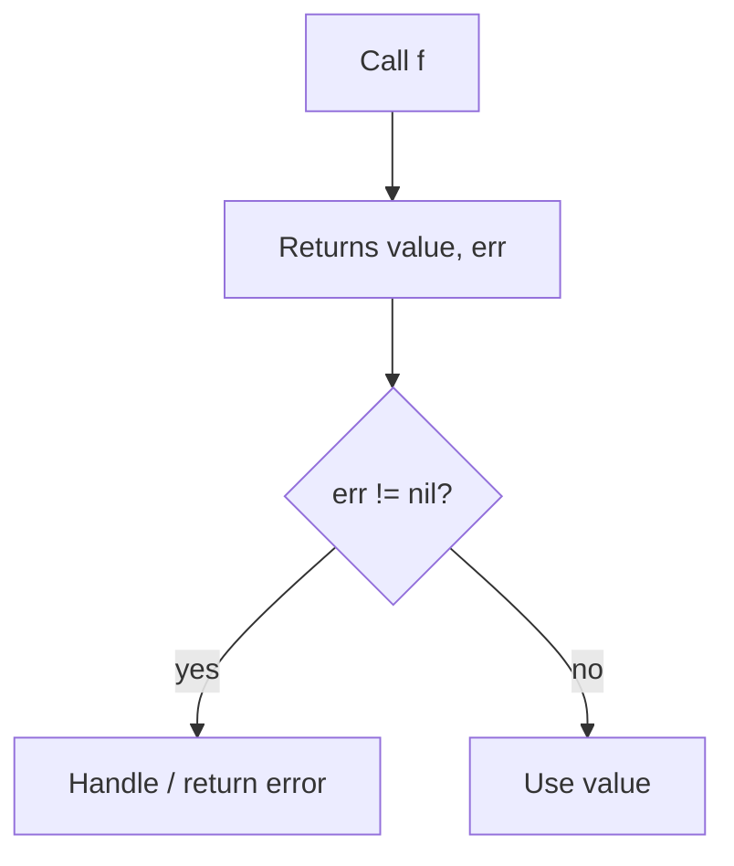

# Go Multiple Return Values — Junior Level

## 1. Introduction

### What is it?
Go functions can return more than one value. The most common use is the `(value, error)` pattern: a function returns a result plus an error indicating whether the operation succeeded.

```go
n, err := strconv.Atoi("42")
if err != nil {
    // handle error
}
// use n
```

### How to use it?
Wrap the result types in parentheses:

```go
func divmod(a, b int) (int, int) {
    return a / b, a % b
}

q, r := divmod(17, 5) // q=3, r=2
```

---

## 2. Prerequisites
- Functions basics (2.6.1)
- Variable declarations and short declaration `:=`
- Basic understanding of `error` (will be covered in chapter 5)

---

## 3. Glossary

| Term | Definition |
|------|-----------|
| multiple results | A function returning 2+ values |
| result list | Parenthesized list of result types |
| `(value, error)` idiom | Convention: result first, error last |
| comma-ok idiom | Pattern returning `(value, bool)` for "did it work?" |
| blank identifier | `_` used to discard a result |
| named results | Results with names that act as locals |
| naked return | `return` with no expressions; uses named results |
| multi-value assignment | `a, b := f()` |

---

## 4. Core Concepts

### 4.1 Declaring Multiple Results
Wrap multiple result types in parentheses:

```go
func splitName(full string) (string, string) {
    // ... split into first, last ...
    return "first", "last"
}
```

A single result doesn't need parentheses:
```go
func square(x int) int { return x * x }
```

### 4.2 Receiving Multiple Results
Use multi-value assignment:

```go
first, last := splitName("Ada Lovelace")
fmt.Println(first, last)
```

### 4.3 The `(value, error)` Convention
The most common pattern in Go: success returns `(value, nil)`; failure returns `(zero, err)`.

```go
n, err := strconv.Atoi("abc")
// n == 0, err is non-nil
if err != nil {
    fmt.Println("error:", err)
    return
}
fmt.Println(n)
```

**Always check err first.** Don't use the value when err != nil.

### 4.4 The Comma-Ok Idiom
Some operations return `(value, bool)` to indicate "did it succeed?". Three common forms:

```go
// Map lookup:
m := map[string]int{"a": 1}
v, ok := m["b"] // v=0 (zero value), ok=false

// Type assertion:
var x any = "hello"
s, ok := x.(string) // s="hello", ok=true

// Channel receive:
ch := make(chan int)
val, ok := <-ch // ok=false if channel is closed
```

### 4.5 Discarding Values With `_`
Use `_` (the blank identifier) to discard a result you don't need:

```go
n, _ := divmod(17, 5)  // discard remainder
_, err := f()          // discard value, keep error
```

You must explicitly handle (or `_`) every result of a multi-result call.

---

## 5. Real-World Analogies

**A car dashboard**: when you start the car, you get back `(engine_status, warning_light)`. You always check the warning before driving — same as checking `err`.

**A vending machine**: it returns `(snack, change)`. You handle both, even if you only wanted the snack.

**A lottery ticket**: `(prize, won_bool)`. The bool tells you whether the prize is meaningful.

---

## 6. Mental Models

```
single-result function:
    f(x) → result

multi-result function:
    f(x) → (result1, result2, ...)

caller must accept all results:
    a, b, c := f(x)
    a, _, c := f(x)
    f(x)               // discard all (statement form)
```

---

## 7. Pros & Cons

### Pros
- Natural error handling without exceptions
- Clear `(value, ok)` semantics for partial operations
- No need for output parameters or pointer-returns
- Atomic multi-assignment (the swap idiom)

### Cons
- Cannot use a multi-result as a single value
- More than 3 results becomes unwieldy (use a struct)
- Forces error-checking boilerplate at every call

---

## 8. Use Cases

1. Returning a value with an error: `parse`, `read`, `connect`
2. Map lookup with existence flag: `v, ok := m[k]`
3. Type assertion with success flag: `s, ok := x.(string)`
4. Channel receive with closed flag: `v, ok := <-ch`
5. Returning multiple computed values: `divmod`, `splitName`
6. Returning a value plus metadata: `(data, count, err)`

---

## 9. Code Examples

### Example 1 — divmod
```go
package main

import "fmt"

func divmod(a, b int) (int, int) {
    return a / b, a % b
}

func main() {
    q, r := divmod(17, 5)
    fmt.Printf("17 / 5 = %d remainder %d\n", q, r)
}
```

### Example 2 — Parse Int
```go
package main

import (
    "fmt"
    "strconv"
)

func main() {
    n, err := strconv.Atoi("42")
    if err != nil {
        fmt.Println("parse error:", err)
        return
    }
    fmt.Println("parsed:", n)
}
```

### Example 3 — Map Lookup
```go
package main

import "fmt"

func main() {
    scores := map[string]int{"Ada": 95, "Bob": 87}
    if score, ok := scores["Ada"]; ok {
        fmt.Println("Ada's score:", score)
    } else {
        fmt.Println("Ada not found")
    }
    if _, ok := scores["Xena"]; !ok {
        fmt.Println("Xena not found")
    }
}
```

### Example 4 — Type Assertion
```go
package main

import "fmt"

func describe(x any) {
    if s, ok := x.(string); ok {
        fmt.Println("string of length", len(s))
        return
    }
    if n, ok := x.(int); ok {
        fmt.Println("int with value", n)
        return
    }
    fmt.Println("unknown type")
}

func main() {
    describe("hello")
    describe(42)
    describe(3.14)
}
```

### Example 5 — Three Results
```go
package main

import "fmt"

func minMax(xs []int) (int, int, error) {
    if len(xs) == 0 {
        return 0, 0, fmt.Errorf("empty input")
    }
    lo, hi := xs[0], xs[0]
    for _, x := range xs[1:] {
        if x < lo { lo = x }
        if x > hi { hi = x }
    }
    return lo, hi, nil
}

func main() {
    lo, hi, err := minMax([]int{3, 7, 1, 9, 4})
    if err != nil {
        fmt.Println(err)
        return
    }
    fmt.Println("min:", lo, "max:", hi)
}
```

### Example 6 — Discarding With `_`
```go
package main

import "fmt"

func divmod(a, b int) (int, int) { return a / b, a % b }

func main() {
    quotient, _ := divmod(17, 5)
    fmt.Println("quotient:", quotient)
}
```

### Example 7 — Forwarding to Another Function
```go
package main

import "fmt"

func divmod(a, b int) (int, int) { return a / b, a % b }
func sum(a, b int) int           { return a + b }

func main() {
    fmt.Println(sum(divmod(17, 5))) // sum(3, 2) = 5
}
```

This works because `divmod` returns exactly the types `sum` needs.

---

## 10. Coding Patterns

### Pattern 1 — `(value, error)`
```go
func loadConfig(path string) (Config, error) {
    data, err := os.ReadFile(path)
    if err != nil {
        return Config{}, err
    }
    var cfg Config
    if err := json.Unmarshal(data, &cfg); err != nil {
        return Config{}, err
    }
    return cfg, nil
}
```

### Pattern 2 — Comma-Ok for Optional
```go
func envOrDefault(key, def string) string {
    if v, ok := os.LookupEnv(key); ok {
        return v
    }
    return def
}
```

### Pattern 3 — Atomic Swap via Multi-Assign
```go
a, b = b, a // tuple assignment, no temp variable needed
```

### Pattern 4 — Multiple Computed Values
```go
func bounds(xs []int) (lo, hi int) {
    if len(xs) == 0 {
        return 0, 0
    }
    lo, hi = xs[0], xs[0]
    for _, x := range xs[1:] {
        if x < lo { lo = x }
        if x > hi { hi = x }
    }
    return
}
```

---

## 11. Clean Code Guidelines

1. **Always check errors immediately**: `if err != nil { return ... }` after every error-returning call.
2. **Use `_` deliberately**, not by accident: explicit blank identifier signals "I know I'm discarding this".
3. **Limit results to 2-3**: more than that → return a struct.
4. **Order: data first, then `error`**: `(data, error)`, not `(error, data)`.
5. **Return zero value with error**: when error is non-nil, the value should be the zero value (callers shouldn't rely on it).

```go
// Good
func parse(s string) (int, error) {
    if s == "" {
        return 0, fmt.Errorf("empty")
    }
    return strconv.Atoi(s)
}

// Avoid (caller might use the partial value)
// func parse(s string) (int, error) {
//     return 42, fmt.Errorf("partial result")
// }
```

---

## 12. Product Use / Feature Example

**A user lookup service**:

```go
package main

import (
    "errors"
    "fmt"
)

type User struct {
    ID   int
    Name string
}

var users = map[int]User{
    1: {ID: 1, Name: "Ada"},
    2: {ID: 2, Name: "Linus"},
}

func getUser(id int) (User, error) {
    u, ok := users[id]
    if !ok {
        return User{}, errors.New("user not found")
    }
    return u, nil
}

func main() {
    u, err := getUser(1)
    if err != nil {
        fmt.Println("error:", err)
        return
    }
    fmt.Println("found:", u.Name)

    _, err = getUser(99)
    if err != nil {
        fmt.Println("error:", err)
    }
}
```

---

## 13. Error Handling

The canonical Go error-handling pattern:

```go
result, err := someOperation()
if err != nil {
    return fmt.Errorf("someOperation failed: %w", err)
}
// use result
```

Wrap errors with `fmt.Errorf("context: %w", err)` to preserve the original error for `errors.Is`/`errors.As`.

```go
func loadAndProcess(path string) error {
    data, err := os.ReadFile(path)
    if err != nil {
        return fmt.Errorf("loadAndProcess: %w", err)
    }
    // ... process data ...
    _ = data
    return nil
}
```

---

## 14. Security Considerations

1. **Never use the value when err != nil**: it may be uninitialized or stale.
2. **Don't log sensitive values** even if no error occurred (passwords, tokens).
3. **Be deliberate with `_`** — discarding an error is dangerous; do it only if you have a reason.
4. **Validate that the value matches expectations** even when err is nil.

```go
// BAD — discards error from critical operation
n, _ := strconv.Atoi(userInput)
buffer := make([]byte, n) // n could be -1 or huge!

// GOOD — handle error
n, err := strconv.Atoi(userInput)
if err != nil || n < 0 || n > 1024 {
    return fmt.Errorf("invalid size")
}
buffer := make([]byte, n)
```

---

## 15. Performance Tips

1. **Multi-result functions are not slower** — Go's register ABI passes multiple results in registers efficiently.
2. **Returning a small struct vs multiple values** — usually identical performance; choose for clarity.
3. **Returning a pointer to avoid copying** — only matters for large structs (>~64 B).
4. **Don't construct expensive values just to discard them** — short-circuit before the call:
   ```go
   if !shouldFetch() {
       return // skip
   }
   v, _ := fetch()
   ```

---

## 16. Metrics & Analytics

```go
import "time"

func timedQuery(query string) (Result, time.Duration, error) {
    start := time.Now()
    r, err := db.Query(query)
    return r, time.Since(start), err
}
```

Returning timing alongside the result is a common pattern for observability.

---

## 17. Best Practices

1. Use `(value, error)` for any operation that can fail.
2. Use comma-ok for "lookup with existence flag".
3. Order results: data → metadata → error.
4. Use `_` only when intentionally discarding.
5. Never ignore errors silently — if you discard, comment why.
6. Limit results to 2-3; use a struct beyond that.
7. Wrap errors with `%w` to preserve the chain.

---

## 18. Edge Cases & Pitfalls

### Pitfall 1 — Forgetting to Receive All Results
```go
n := strconv.Atoi("42") // compile error: multiple-value returned
```
Fix: `n, _ := strconv.Atoi("42")` or `n, err := strconv.Atoi("42")`.

### Pitfall 2 — Using Value When Error Is Non-Nil
```go
n, err := strconv.Atoi(s)
if err != nil {
    fmt.Println("got:", n) // BAD: n is 0 (or undefined)
}
return n // BAD: returning a value that's known invalid
```
Fix: handle error first, return early.

### Pitfall 3 — Wrong Order of Multi-Assignment
```go
err, n := strconv.Atoi("42") // wrong: type mismatch
```
Fix: match declared order. Atoi returns `(int, error)`.

### Pitfall 4 — Trying to Use Multi-Result as Single Value
```go
fmt.Println(divmod(17, 5) + 1) // compile error
```
Fix: receive into variables first.

### Pitfall 5 — Mixing Multi-Result With Other Args
```go
sum(divmod(17, 5), 100) // compile error
```
Fix: `q, r := divmod(17, 5); sum(q + r, 100)` or similar.

---

## 19. Common Mistakes

| Mistake | Fix |
|---------|-----|
| `n := f()` for multi-result | Receive both: `n, err := f()` |
| Ignoring err with `_` | Handle err explicitly |
| Using value before checking err | `if err != nil { return ... }` first |
| Returning non-zero value with error | Return zero value when err != nil |
| Wrong result order | Match declared `(value, error)` |
| Using multi-result in expression | Assign first, then use |

---

## 20. Common Misconceptions

**Misconception 1**: "Multi-result functions are like tuples in other languages."
**Truth**: Go's multi-results are NOT first-class tuples. You cannot store them in a variable, pass them to interface{}, or use them in expressions. They only exist at assignment and direct forwarding.

**Misconception 2**: "Returning multiple values is slower than returning a struct."
**Truth**: With Go's register ABI, multiple results travel in registers — usually identical to or faster than a struct return.

**Misconception 3**: "I can ignore err if the operation 'shouldn't' fail."
**Truth**: That's how production bugs happen. If you truly know it can't fail (e.g., constant input), use `must` helpers or panic explicitly.

**Misconception 4**: "comma-ok is special syntax."
**Truth**: It's just multi-result assignment. The `bool` is a regular result; the language has no "ok flag" concept.

**Misconception 5**: "I can return as many values as I want — it's idiomatic."
**Truth**: 2-3 is fine; more becomes unreadable. Use a named struct beyond that.

---

## 21. Tricky Points

1. `f()` as a call statement (no assignment) discards ALL results — useful for void operations.
2. Multi-result CAN be the sole arg to a function whose params match: `g(f())`.
3. Multi-result CANNOT be mixed with other args: `g(f(), x)` is a compile error.
4. `_` is required when discarding an individual result; you can't just omit it.
5. Tuple swap `a, b = b, a` works because of atomic multi-assignment.

---

## 22. Test

```go
package main

import (
    "errors"
    "testing"
)

func divmod(a, b int) (int, int, error) {
    if b == 0 {
        return 0, 0, errors.New("division by zero")
    }
    return a / b, a % b, nil
}

func TestDivmod(t *testing.T) {
    q, r, err := divmod(17, 5)
    if err != nil {
        t.Fatalf("unexpected: %v", err)
    }
    if q != 3 || r != 2 {
        t.Errorf("got (%d, %d); want (3, 2)", q, r)
    }
}

func TestDivmod_ByZero(t *testing.T) {
    _, _, err := divmod(10, 0)
    if err == nil {
        t.Error("expected error for division by zero")
    }
}
```

---

## 23. Tricky Questions

**Q1**: What is printed?
```go
func f() (int, int) { return 1, 2 }
func main() {
    a, b := f()
    a, b = b, a
    fmt.Println(a, b)
}
```
**A**: `2 1`. The swap works because the right-hand side is fully evaluated before assignment.

**Q2**: Will this compile?
```go
func f() (int, int) { return 1, 2 }
func g(a, b int) int { return a + b }
fmt.Println(g(f(), 0))
```
**A**: **No**. Multi-result cannot be mixed with other args. You'd need `a, b := f(); g(a + b, 0)` or similar.

**Q3**: What's the value of `n` and `err`?
```go
n, err := strconv.Atoi("abc")
fmt.Println(n, err)
```
**A**: `0` and a non-nil error. By convention, parse failures return zero value plus the error.

---

## 24. Cheat Sheet

```go
// Declare:
func f() (int, error) { return 0, nil }

// Receive both:
n, err := f()

// Check error:
if err != nil { /* handle */ }

// Discard one:
n, _ := f()
_, err := f()

// Discard all (statement form):
f()

// Forwarding (counts and types must match):
sum(divmod(17, 5))

// Map / type assertion / channel comma-ok:
v, ok := m[k]
s, ok := x.(string)
val, ok := <-ch

// Atomic swap:
a, b = b, a
```

---

## 25. Self-Assessment Checklist

- [ ] I can declare a function with multiple results
- [ ] I always wrap multi-result in parentheses
- [ ] I receive every result (or use `_`)
- [ ] I check the error first before using the value
- [ ] I know the comma-ok idiom for maps, type assertions, channels
- [ ] I use `(value, error)` order, not `(error, value)`
- [ ] I know multi-result can't be used as a single value
- [ ] I can forward multi-result into another function with matching signature
- [ ] I limit results to 2-3 and use a struct beyond that

---

## 26. Summary

Go functions can return multiple values, declared in parentheses: `func f() (T1, T2)`. The dominant pattern is `(value, error)` — return a result and an error indicator. Always check `err` before using the value. The comma-ok idiom (`v, ok := ...`) is a related pattern for "lookup with existence". Multi-results are NOT first-class tuples: they only exist at assignment, multi-arg forwarding, or as standalone statements. Use `_` to discard any individual result.

---

## 27. What You Can Build

- Parsers that report `(parsed_value, error)`
- Lookup helpers with `(value, found)` semantics
- Min/max calculators returning both bounds
- Network calls returning `(response, error)`
- File operations: `(data, error)`
- Statistical functions: `(mean, stddev, error)`

---

## 28. Further Reading

- [Effective Go — Multiple return values](https://go.dev/doc/effective_go#multiple-returns)
- [Go Blog — Errors are values](https://go.dev/blog/errors-are-values)
- [Go Spec — Return statements](https://go.dev/ref/spec#Return_statements)
- [`errors` package documentation](https://pkg.go.dev/errors)

---

## 29. Related Topics

- 2.6.6 Named Return Values
- 2.6.1 Functions Basics
- Chapter 5 Error Handling
- Comma-ok for maps (2.3.4.1)

---

## 30. Diagrams & Visual Aids

### Multi-result function call

```
         ┌─────────────────────┐
caller   │ a, b := f()         │
         └────────┬────────────┘
                  ↓
         ┌─────────────────────┐
         │ func f() (int, error)│
         │   return n, err      │
         └─────────────────────┘
```

### `(value, error)` flow


