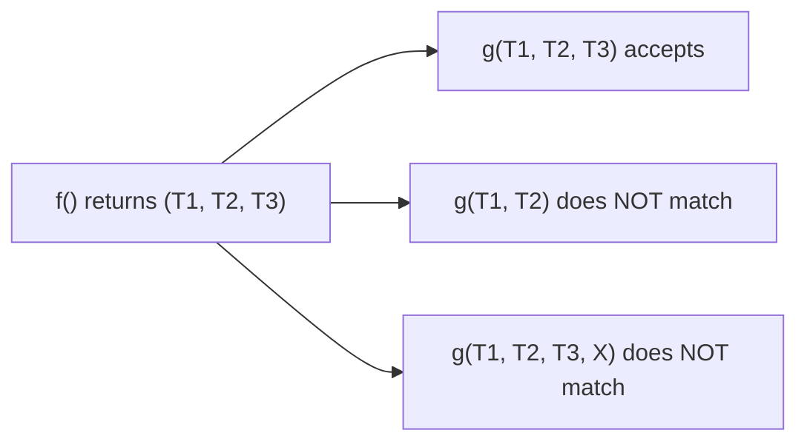

# Go Multiple Return Values — Middle Level

## 1. Introduction

At the middle level you understand multiple return values as a **calling-convention feature** with strict rules: not first-class tuples, but linguistically integrated through multi-assignment, comma-ok forms, and direct forwarding. You design APIs around `(value, error)` deliberately, recognize when 2 results should be 1 (a struct), and use error wrapping correctly.

---

## 2. Prerequisites
- Junior-level multi-return material
- `error` interface and `errors.New`/`fmt.Errorf`
- `errors.Is`, `errors.As`, `errors.Unwrap`
- Basic understanding of interfaces and type assertions

---

## 3. Glossary

| Term | Definition |
|------|-----------|
| Sentinel error | A package-level error variable like `io.EOF` |
| Wrapped error | An error created with `%w` that carries another error inside |
| `errors.Is` | Checks whether an error chain contains a specific sentinel |
| `errors.As` | Type-asserts through an error chain |
| Result tuple | Informal term for the comma-separated results — NOT a Go type |
| Multi-value context | An expression position that consumes multiple values |
| Single-value context | An expression position that consumes one value |
| Naked return | `return` with no expressions; uses named results |

---

## 4. Core Concepts

### 4.1 Multi-Value Contexts

A multi-result function can be used in exactly three positions:

1. **Multi-assignment**: `a, b := f()`
2. **Multi-arg forwarding**: `g(f())` where `g`'s param list matches `f`'s result list
3. **Statement form** (discards all): `f()`

In all other positions, you get a compile error.

```go
func f() (int, int) { return 1, 2 }

a, b := f()       // (1) OK
print(f())        // (2) OK if print's params match
f()               // (3) OK — discards all

// _ = f() + 1   // ERROR
// _ = []int{f()} // ERROR
// var x any = f() // ERROR
```

### 4.2 Forwarding Pattern Constraints

`g(f())` requires:
- `f` returns N values.
- `g` takes EXACTLY N parameters (not more, not less).
- Each result type matches the corresponding parameter type.

```go
func two() (int, string) { return 1, "a" }
func acceptTwo(n int, s string) {}
func acceptThree(n int, s string, b bool) {}

acceptTwo(two())            // OK
// acceptThree(two(), true) // ERROR: cannot mix multi-result with extra args
```

### 4.3 Error Wrapping With `%w`

Go 1.13+ introduced `%w` in `fmt.Errorf` to create wrapped errors:

```go
package main

import (
    "errors"
    "fmt"
)

var ErrNotFound = errors.New("not found")

func getUser(id int) (string, error) {
    if id <= 0 {
        return "", fmt.Errorf("getUser id=%d: %w", id, ErrNotFound)
    }
    return "Ada", nil
}

func main() {
    _, err := getUser(0)
    if errors.Is(err, ErrNotFound) {
        fmt.Println("user not found, error chain:", err)
    }
}
```

`errors.Is(err, ErrNotFound)` walks the chain via `Unwrap()` and finds `ErrNotFound`.

### 4.4 `errors.As` for Typed Errors

```go
type APIError struct {
    Code int
    Msg  string
}

func (e *APIError) Error() string {
    return fmt.Sprintf("API error %d: %s", e.Code, e.Msg)
}

func call() error {
    return fmt.Errorf("calling API: %w", &APIError{Code: 429, Msg: "too many requests"})
}

func main() {
    err := call()
    var apiErr *APIError
    if errors.As(err, &apiErr) {
        fmt.Println("got API error with code", apiErr.Code)
    }
}
```

### 4.5 The `Must` Helper Pattern

When you know an operation can't fail (e.g., constant input), use a `Must` wrapper that panics on error:

```go
func Must[T any](v T, err error) T {
    if err != nil {
        panic(err)
    }
    return v
}

// Usage at package init:
var pkgRegex = Must(regexp.Compile(`^[a-z]+$`))
```

This converts a `(value, error)` function into a single-value one. Use sparingly — only at init or in tests.

### 4.6 Comma-Ok Beyond the Standard Forms

Custom comma-ok APIs are idiomatic:

```go
type Cache struct {
    m map[string]any
}

func (c *Cache) Get(k string) (any, bool) {
    v, ok := c.m[k]
    return v, ok
}

if v, ok := cache.Get("user"); ok {
    fmt.Println(v)
}
```

The `bool` should be the LAST result, mirroring `(value, error)` placement.

---

## 5. Real-World Analogies

**A medical test report**: `(value, abnormal_flag)`. You report the number AND a flag for whether intervention is needed.

**A package delivery API**: `(tracking_id, error)`. Either you got a tracking ID, or the request failed.

**A safe-deposit box**: `(contents, success)`. Comma-ok form mirrors "did the lookup find anything".

---

## 6. Mental Models

### Model 1 — Results as register slots

```
caller stack frame:           callee returns:
  [a slot]  ←──────────────── [first result]
  [b slot]  ←──────────────── [second result]
  ...

with register ABI:
  AX = first result
  BX = second result
  CX = third result (e.g., the bool of comma-ok)
```

The compiler generates a single set of move instructions; multi-result is essentially free.

### Model 2 — `(value, error)` as a "either"

Conceptually equivalent to a sum type `Either[T, error]`, but Go represents it as two separate slots with the convention that `err == nil` means "value is valid".

---

## 7. Pros & Cons

### Pros
- No exceptions; control flow is explicit.
- Clear `(value, error)` and comma-ok conventions.
- Multi-assignment is atomic (swap idiom).
- No tuple-creation overhead.

### Cons
- Boilerplate `if err != nil` after every call.
- Cannot pass multi-result through generic single-value APIs (`any`, slices).
- Forwarding constraints are subtle.

---

## 8. Use Cases

1. Error-returning operations: `Read`, `Open`, `Parse`, `Connect`
2. Lookup with existence: `Get`, `Find`, `Lookup`
3. Decompose: `divmod`, `splitName`, `parseURL`
4. Aggregations with metadata: `(result, count, error)`
5. Streams: `Next() (value, ok)` for iteration
6. Batched operations: `(processedCount, errors)` style

---

## 9. Code Examples

### Example 1 — Error Wrapping Chain
```go
package main

import (
    "errors"
    "fmt"
    "io"
)

func readFirstByte(r io.Reader) (byte, error) {
    b := make([]byte, 1)
    _, err := r.Read(b)
    if err != nil {
        if errors.Is(err, io.EOF) {
            return 0, fmt.Errorf("readFirstByte: empty input: %w", err)
        }
        return 0, fmt.Errorf("readFirstByte: %w", err)
    }
    return b[0], nil
}

func main() {
    _, err := readFirstByte(strings.NewReader(""))
    fmt.Println(err)
    fmt.Println("is EOF?", errors.Is(err, io.EOF))
}
```

### Example 2 — Custom Iterator With Comma-Ok
```go
package main

import "fmt"

type Iter struct {
    items []int
    pos   int
}

func (it *Iter) Next() (int, bool) {
    if it.pos >= len(it.items) {
        return 0, false
    }
    v := it.items[it.pos]
    it.pos++
    return v, true
}

func main() {
    it := &Iter{items: []int{10, 20, 30}}
    for v, ok := it.Next(); ok; v, ok = it.Next() {
        fmt.Println(v)
    }
}
```

### Example 3 — Aggregator Returning Multiple Stats
```go
package main

import (
    "fmt"
    "math"
)

func stats(xs []float64) (mean, stddev float64, err error) {
    if len(xs) == 0 {
        return 0, 0, fmt.Errorf("empty input")
    }
    var sum float64
    for _, x := range xs {
        sum += x
    }
    mean = sum / float64(len(xs))
    var variance float64
    for _, x := range xs {
        d := x - mean
        variance += d * d
    }
    stddev = math.Sqrt(variance / float64(len(xs)))
    return // naked return
}

func main() {
    m, s, err := stats([]float64{1, 2, 3, 4, 5})
    if err != nil {
        fmt.Println(err)
        return
    }
    fmt.Printf("mean=%.2f stddev=%.2f\n", m, s)
}
```

### Example 4 — Forwarding Multi-Result
```go
package main

import "fmt"

func source() (int, int, int) { return 1, 2, 3 }
func sum(a, b, c int) int     { return a + b + c }

func main() {
    fmt.Println(sum(source())) // 6 — direct forward
}
```

### Example 5 — `Must` Helper for Init
```go
package main

import (
    "fmt"
    "regexp"
)

func Must[T any](v T, err error) T {
    if err != nil {
        panic(err)
    }
    return v
}

var emailRe = Must(regexp.Compile(`^[a-z]+@[a-z.]+$`))

func main() {
    fmt.Println(emailRe.MatchString("ada@example.com"))
}
```

---

## 10. Coding Patterns

### Pattern 1 — Defer Until Cleanup, Then Return
```go
func processFile(path string) (count int, err error) {
    f, err := os.Open(path)
    if err != nil {
        return 0, err
    }
    defer func() {
        if cerr := f.Close(); cerr != nil && err == nil {
            err = cerr // capture close error if no other error
        }
    }()
    // ... process f ...
    return count, nil
}
```

### Pattern 2 — Try Order
```go
func tryOrder(s string) (int, error) {
    if v, err := strconv.Atoi(s); err == nil { return v, nil }
    if f, err := strconv.ParseFloat(s, 64); err == nil { return int(f), nil }
    return 0, fmt.Errorf("cannot parse: %q", s)
}
```

### Pattern 3 — Comma-Ok Constructor
```go
type Point struct{ X, Y int }

func ParsePoint(s string) (Point, bool) {
    var p Point
    n, err := fmt.Sscanf(s, "(%d, %d)", &p.X, &p.Y)
    if err != nil || n != 2 {
        return Point{}, false
    }
    return p, true
}
```

### Pattern 4 — Atomic Tuple Swap
```go
a, b = b, a
xs[i], xs[j] = xs[j], xs[i]
```

---

## 11. Clean Code Guidelines

1. **Always check err first**, before any other branching.
2. **Use named results sparingly** — they help when documentation matters or with naked return for short functions; they hurt readability in long bodies.
3. **Wrap errors with `%w`** to preserve the chain.
4. **Don't return more than 3 values** — switch to a struct.
5. **Make the meaningful value first**, error/bool last.
6. **Return the zero value when err != nil**.

```go
// Good
func parse(s string) (Result, error) {
    var r Result
    // ... fill r or return zero on error ...
    return r, nil
}

// Avoid: returning a partial result with an error
// func parse(s string) (Result, error) {
//     return r /* might be partially populated */, err
// }
```

---

## 12. Product Use / Feature Example

**A user authentication service**:

```go
package main

import (
    "errors"
    "fmt"
)

var (
    ErrInvalidCredentials = errors.New("invalid credentials")
    ErrAccountLocked      = errors.New("account locked")
)

type Session struct {
    UserID int
    Token  string
}

func login(user, pass string) (Session, error) {
    if user == "locked" {
        return Session{}, fmt.Errorf("login %q: %w", user, ErrAccountLocked)
    }
    if user != "ada" || pass != "secret" {
        return Session{}, ErrInvalidCredentials
    }
    return Session{UserID: 1, Token: "tok123"}, nil
}

func main() {
    s, err := login("ada", "wrong")
    if errors.Is(err, ErrInvalidCredentials) {
        fmt.Println("retry login")
        return
    }
    if errors.Is(err, ErrAccountLocked) {
        fmt.Println("contact support")
        return
    }
    if err != nil {
        fmt.Println("unexpected:", err)
        return
    }
    fmt.Println("logged in:", s)
}
```

The `(Session, error)` shape lets callers inspect the error chain via `errors.Is`.

---

## 13. Error Handling

### Wrap, Don't Replace
```go
// BAD — loses original
if err != nil {
    return nil, errors.New("operation failed")
}

// GOOD — preserves chain
if err != nil {
    return nil, fmt.Errorf("operation failed: %w", err)
}
```

### Sentinel Errors
```go
var ErrNotFound = errors.New("not found")

func get(k string) (string, error) {
    if !exists(k) {
        return "", ErrNotFound
    }
    // ...
    return "", nil
}

if errors.Is(err, ErrNotFound) {
    // handle missing
}
```

### Typed Errors With `errors.As`
```go
type RetryableError struct { Reason string }
func (e *RetryableError) Error() string { return e.Reason }

if err != nil {
    var re *RetryableError
    if errors.As(err, &re) {
        // retry logic
    }
}
```

---

## 14. Security Considerations

1. **Don't leak partial state in errors** — error messages should not include secret values.
2. **Don't return populated values alongside errors** — clear them first to avoid accidental use.
3. **Be careful with `_`** — discarding errors from security-relevant calls (auth check, signature verify) is a vulnerability.
4. **Wrap errors with context** but redact sensitive parts:
   ```go
   return nil, fmt.Errorf("auth failed for user=%s: %w", username, err)
   // If username could be a token, redact:
   return nil, fmt.Errorf("auth failed: %w", err)
   ```

---

## 15. Performance Tips

1. **Multi-result is register-passed** — usually free with the modern ABI.
2. **Returning a struct vs multiple values** — usually identical; choose for clarity.
3. **`error` interface boxing** — when returning a non-nil error, the underlying error type is boxed. Sentinel `errors.New` results are cheap.
4. **`fmt.Errorf` with `%w` allocates** — minor cost, but avoid in tight loops; reserve wrapping for boundary returns.

---

## 16. Metrics & Analytics

```go
func instrumented(name string, fn func() error) (time.Duration, error) {
    start := time.Now()
    err := fn()
    dur := time.Since(start)
    metrics.Record(name, dur, err)
    return dur, err
}
```

Returning timing alongside error is common in middleware and tracing layers.

---

## 17. Best Practices

1. Always check err first; return early on failure.
2. Wrap errors with `%w` to preserve the chain.
3. Use sentinel errors for stable conditions; typed errors for rich context.
4. Limit results to 2-3.
5. Comma-ok is for "lookup with existence"; `(value, error)` is for "operation that can fail".
6. Don't use `Must` outside init or tests.
7. Document each result in the function comment.

---

## 18. Edge Cases & Pitfalls

### Pitfall 1 — `defer` Modifying Named Return
```go
func f() (n int, err error) {
    defer func() {
        if err != nil {
            n = -1 // override on error
        }
    }()
    n = 42
    err = errors.New("oops")
    return
}
// Returns (-1, err)
```
This works but is subtle. Use named returns deliberately.

### Pitfall 2 — Hidden Allocation From Wrapping
```go
// Each call to f wraps; allocates an *fmt.wrapError.
for i := 0; i < N; i++ {
    err := f()
    if err != nil {
        return fmt.Errorf("iter %d: %w", i, err) // allocation
    }
}
```
For very hot paths, return raw error and wrap at the boundary instead.

### Pitfall 3 — Discarding Critical Errors
```go
// BAD
data, _ := os.ReadFile(path)
// data may be nil, but we use it anyway
process(data)
```

### Pitfall 4 — Returning Stale State
```go
// BAD
func update() (*State, error) {
    s.Count++
    if err := commit(); err != nil {
        return s, err // returns mutated state alongside error
    }
    return s, nil
}
```
Caller might use `s` even when `err != nil`. Document or revert before returning.

### Pitfall 5 — Forgetting `errors.Is` for Wrapped
```go
err := fmt.Errorf("wrap: %w", io.EOF)
fmt.Println(err == io.EOF)         // false (wrong!)
fmt.Println(errors.Is(err, io.EOF)) // true
```

---

## 19. Common Mistakes

| Mistake | Fix |
|---------|-----|
| Comparing wrapped err with `==` | Use `errors.Is` |
| Type-asserting wrapped err | Use `errors.As` |
| Returning value alongside non-nil error | Return zero value |
| Wrapping without `%w` | Use `%w`, not `%v` or `%s` |
| Excessive wrapping in hot loops | Wrap at boundary, not per-iteration |
| Naked return in long function | Use explicit return |

---

## 20. Common Misconceptions

**Misconception 1**: "Multi-results are tuples like Python."
**Truth**: They're not first-class values. You cannot store, pass, or compare them as a unit.

**Misconception 2**: "If a function returns `(value, error)`, the value is always valid when err is nil."
**Truth**: That's the convention but the language doesn't enforce it. Always document and follow this contract.

**Misconception 3**: "`errors.Is` checks pointer equality."
**Truth**: It walks the `Unwrap()` chain and uses `==` at each level (or calls `Is()` if implemented).

**Misconception 4**: "Returning more than 2 values is bad practice."
**Truth**: 2-3 is fine. Beyond that, prefer a struct.

**Misconception 5**: "Naked returns are always discouraged."
**Truth**: They're idiomatic for short helper functions where the result names are documented in the signature.

---

## 21. Tricky Points

1. `multiResult()` as a statement discards all results — useful for `_, _ = f()` shorthand.
2. `g(f())` only works when count and types match exactly.
3. `errors.Is(nil, target)` returns false; `errors.Is(err, nil)` is undefined (don't do it).
4. Returning a typed nil pointer wrapped in `error` interface is NOT nil:
   ```go
   var p *MyError
   return p // returns non-nil error wrapping a nil *MyError
   ```
5. `defer` runs AFTER the result expressions are evaluated — important for named returns.

---

## 22. Test

```go
package main

import (
    "errors"
    "testing"
)

var ErrInvalid = errors.New("invalid")

func parse(s string) (int, error) {
    if s == "" {
        return 0, ErrInvalid
    }
    return 42, nil
}

func TestParseValid(t *testing.T) {
    n, err := parse("anything")
    if err != nil {
        t.Fatalf("unexpected: %v", err)
    }
    if n != 42 {
        t.Errorf("got %d, want 42", n)
    }
}

func TestParseInvalid(t *testing.T) {
    _, err := parse("")
    if !errors.Is(err, ErrInvalid) {
        t.Errorf("got err=%v, want ErrInvalid", err)
    }
}
```

---

## 23. Tricky Questions

**Q1**: What does this print?
```go
var perr *MyError = nil
func do() error { return perr }
err := do()
fmt.Println(err == nil)
```
**A**: `false`. The interface holds a non-nil type word (`*MyError`) and a nil data word — it's not equal to a nil interface.

**Q2**: Will this compile?
```go
func f() (int, error) { return 0, nil }
func main() {
    n := f()
    _ = n
}
```
**A**: **No**. `f()` is a multi-value expression; `n :=` accepts only one value.

**Q3**: What is the output?
```go
func f() (n int) {
    defer func() { n++ }()
    n = 5
    return
}
fmt.Println(f())
```
**A**: `6`. The defer runs after `n = 5` and increments before the function actually returns.

---

## 24. Cheat Sheet

```go
// (value, error)
n, err := f()
if err != nil { return err }

// Wrap
return fmt.Errorf("ctx: %w", err)

// Match
if errors.Is(err, ErrX) { ... }
var pe *MyErr
if errors.As(err, &pe) { ... }

// Comma-ok
v, ok := m[k]
s, ok := x.(string)
val, ok := <-ch

// Discard
_, err := f()
n, _ := f()
f() // discard all

// Forward
g(f())  // only if signatures align

// Must helper
v := Must(f(), err)

// Named result + naked
func split() (a, b int) {
    a, b = 1, 2
    return
}
```

---

## 25. Self-Assessment Checklist

- [ ] I always check err immediately after the call
- [ ] I use `errors.Is`/`errors.As` for wrapped errors
- [ ] I wrap errors with `%w`
- [ ] I return zero value when err is non-nil
- [ ] I limit results to 2-3
- [ ] I know when to use comma-ok vs (value, error)
- [ ] I know multi-result cannot mix with other args at a call
- [ ] I understand the typed-nil interface gotcha
- [ ] I can use named returns + defer to modify result on the way out

---

## 26. Summary

Multi-result functions are not tuples — they are a calling-convention feature. The `(value, error)` and comma-ok idioms cover the vast majority of cases. Always check error first, wrap with `%w`, use `errors.Is`/`errors.As` for inspection. Limit results to 2-3 and use a struct beyond that. Forwarding `g(f())` works only when signatures align exactly.

---

## 27. What You Can Build

- Robust parsers with error context
- Lookup-with-existence APIs
- Iterators using comma-ok pattern
- Database query layers returning `(rows, error)`
- Validation chains using `errors.Is`
- Statistical aggregators returning multiple metrics

---

## 28. Further Reading

- [Go Blog — Working with Errors in Go 1.13](https://go.dev/blog/go1.13-errors)
- [Effective Go — Errors](https://go.dev/doc/effective_go#errors)
- [Dave Cheney — Don't just check errors, handle them gracefully](https://dave.cheney.net/2016/04/27/dont-just-check-errors-handle-them-gracefully)
- [`errors` package](https://pkg.go.dev/errors)

---

## 29. Related Topics

- 2.6.6 Named Return Values
- Chapter 5 Error Handling
- Comma-ok for maps (2.3.4.1)
- 2.6.1 Functions Basics

---

## 30. Diagrams & Visual Aids

### Error chain via `%w`

```
f() returns: fmt.Errorf("wrap: %w", baseErr)

      [wrap: not found]    ← top-level error
              │
         Unwrap()
              ↓
         [not found]       ← sentinel ErrNotFound

errors.Is(err, ErrNotFound) walks down and matches
```

### Forwarding constraint


