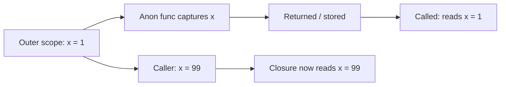

# Go Anonymous Functions — Junior Level

## 1. Introduction

### What is it?
An **anonymous function** (also called a **function literal**) is a function without a name. You write it inline where you need it, instead of declaring it separately. It's commonly used as a callback, in `defer`, or as a goroutine body.

### How to use it?
Write `func(params) result { body }` as an expression:

```go
greet := func(name string) {
    fmt.Println("Hello,", name)
}
greet("Ada")
```

You can also call it immediately:
```go
func() {
    fmt.Println("ran")
}()
```

---

## 2. Prerequisites
- Functions basics (2.6.1)
- Variables, types
- Slices and `range`

---

## 3. Glossary

| Term | Definition |
|------|-----------|
| anonymous function | A function without a name |
| function literal | Synonym for anonymous function (Go's official term) |
| inline function | Casual term for an anonymous function |
| IIFE | Immediately-Invoked Function Expression: `func(){...}()` |
| callback | A function passed as an argument to another function |
| closure | A function literal that captures variables from its surrounding scope (covered in 2.6.5) |
| function value | The runtime value of any function (named or anonymous) |

---

## 4. Core Concepts

### 4.1 Syntax
```go
func(params) returnType {
    // body
}
```

The only difference from a named function declaration is the missing name. You must use this in an **expression position** (assignment, argument, return, etc.).

### 4.2 Assigning to a Variable
```go
double := func(x int) int { return x * 2 }
fmt.Println(double(5)) // 10
```

`double` is a variable of function type that you call like any function.

### 4.3 Passing as an Argument
```go
import "sort"

s := []int{5, 2, 8, 1}
sort.Slice(s, func(i, j int) bool {
    return s[i] < s[j]
})
fmt.Println(s) // [1 2 5 8]
```

`sort.Slice` accepts a `less` function; we provide it inline.

### 4.4 Returning from a Function
```go
func adder(by int) func(int) int {
    return func(x int) int {
        return x + by
    }
}

add3 := adder(3)
fmt.Println(add3(10)) // 13
```

The returned function "remembers" `by`. This is a closure (see 2.6.5).

### 4.5 Immediately-Invoked
```go
result := func(a, b int) int { return a + b }(3, 4)
fmt.Println(result) // 7
```

The trailing `(3, 4)` calls the function right away. Useful when you want a one-shot computation with its own scope.

### 4.6 In `defer`
```go
defer func() {
    if r := recover(); r != nil {
        fmt.Println("recovered:", r)
    }
}()
```

A common pattern: defer an anonymous function for cleanup or recovery.

### 4.7 In `go` (goroutine)
```go
go func() {
    fmt.Println("in goroutine")
}()
```

Spawn a goroutine inline.

---

## 5. Real-World Analogies

**A sticky note**: write a quick instruction once, hand it off, and forget about it. No need to file it as a permanent document (named function).

**A handwritten direction**: when someone asks for help on the street, you give them inline directions — you don't write them up as an article first.

**Anonymous functions = throwaway helpers**: convenient for one-off use cases.

---

## 6. Mental Models

```
named function:                         anonymous function:

func double(x int) int {                f := func(x int) int {
    return x * 2                            return x * 2
}                                       }

double(5)                               f(5)

(in package scope)                      (in expression scope)
```

Anonymous functions are values. Treat them like data: assignable, passable, returnable.

---

## 7. Pros & Cons

### Pros
- Convenient for one-off callbacks (sort, filter, map)
- No clutter of separately named helpers
- Closures: capture surrounding state easily
- Idiomatic in `defer` and `go` statements

### Cons
- Cannot be reused without storing in a variable
- Cannot be called recursively by name (workaround needed)
- Less informative stack traces (`func1`, `func2`)
- Easy to abuse: long anonymous functions hurt readability

---

## 8. Use Cases

1. Sort comparators (`sort.Slice`, `sort.SliceStable`)
2. `defer` cleanups with `recover`
3. Goroutine bodies (`go func() {...}()`)
4. Filter / map / reduce callbacks
5. Functional options (each option is a function literal)
6. Iterator visitors (`func(item) bool`)
7. One-shot scoped computation (IIFE pattern)

---

## 9. Code Examples

### Example 1 — Assigning to Variable
```go
package main

import "fmt"

func main() {
    square := func(x int) int { return x * x }
    fmt.Println(square(5)) // 25
}
```

### Example 2 — Sort Comparator
```go
package main

import (
    "fmt"
    "sort"
)

func main() {
    words := []string{"banana", "apple", "cherry"}
    sort.Slice(words, func(i, j int) bool {
        return words[i] < words[j]
    })
    fmt.Println(words) // [apple banana cherry]
}
```

### Example 3 — IIFE
```go
package main

import "fmt"

func main() {
    sum := func(xs []int) int {
        total := 0
        for _, x := range xs { total += x }
        return total
    }([]int{1, 2, 3, 4, 5})
    fmt.Println(sum) // 15
}
```

### Example 4 — Defer with Recover
```go
package main

import "fmt"

func safeDivide(a, b int) (result int, err error) {
    defer func() {
        if r := recover(); r != nil {
            err = fmt.Errorf("recovered: %v", r)
        }
    }()
    return a / b, nil // panics if b == 0
}

func main() {
    r, err := safeDivide(10, 0)
    fmt.Println(r, err)
}
```

### Example 5 — Goroutine
```go
package main

import (
    "fmt"
    "sync"
)

func main() {
    var wg sync.WaitGroup
    for i := 0; i < 3; i++ {
        wg.Add(1)
        go func(i int) {
            defer wg.Done()
            fmt.Println("goroutine", i)
        }(i)
    }
    wg.Wait()
}
```

### Example 6 — Filter
```go
package main

import "fmt"

func filter(s []int, keep func(int) bool) []int {
    out := s[:0]
    for _, v := range s {
        if keep(v) {
            out = append(out, v)
        }
    }
    return out
}

func main() {
    s := []int{-3, -1, 0, 2, 5}
    pos := filter(s, func(n int) bool { return n > 0 })
    fmt.Println(pos) // [2 5]
}
```

### Example 7 — Returning a Function (Closure)
```go
package main

import "fmt"

func multiplier(factor int) func(int) int {
    return func(x int) int { return x * factor }
}

func main() {
    times3 := multiplier(3)
    times5 := multiplier(5)
    fmt.Println(times3(10), times5(10)) // 30 50
}
```

---

## 10. Coding Patterns

### Pattern 1 — Inline Comparator
```go
sort.Slice(s, func(i, j int) bool { return s[i].Name < s[j].Name })
```

### Pattern 2 — Deferred Cleanup
```go
defer func() {
    if r := recover(); r != nil {
        log.Printf("panic: %v", r)
    }
}()
```

### Pattern 3 — Inline Goroutine
```go
go func(arg int) {
    process(arg)
}(value)
```

### Pattern 4 — Functional Option
```go
type Option func(*Server)

func WithAddr(a string) Option {
    return func(s *Server) { s.Addr = a }
}
```

### Pattern 5 — IIFE for Scope
```go
result := func() string {
    if condition {
        return "a"
    }
    return "b"
}()
```

Effectively a single-expression `if` with an early return inside its own scope.

---

## 11. Clean Code Guidelines

1. **Keep them short.** If your literal is more than ~10 lines, extract it as a named function.
2. **Don't nest deeply.** Function literals inside function literals get hard to read fast.
3. **Use named functions for reuse.** Anonymous = one-shot.
4. **Always pass loop variables explicitly** when a literal is in a goroutine started inside a C-style `for` loop.
5. **Avoid IIFE when it's just hiding a missing helper.** Sometimes a named function is clearer.

```go
// Good — short and inline
sort.Slice(s, func(i, j int) bool { return s[i] < s[j] })

// Bad — long anonymous function obscures purpose
sort.Slice(s, func(i, j int) bool {
    a := compute(s[i])
    b := compute(s[j])
    if a == b {
        return s[i].Name < s[j].Name
    }
    return a < b
})
// Better:
sort.Slice(s, byScoreThenName(s))
```

---

## 12. Product Use / Feature Example

**Configurable HTTP middleware**:

```go
package main

import (
    "fmt"
    "net/http"
)

func logging(next http.HandlerFunc) http.HandlerFunc {
    return func(w http.ResponseWriter, r *http.Request) {
        fmt.Println(r.Method, r.URL.Path)
        next(w, r)
    }
}

func main() {
    base := func(w http.ResponseWriter, r *http.Request) {
        fmt.Fprintln(w, "hello")
    }
    handler := logging(base)
    http.HandleFunc("/", handler)
    // http.ListenAndServe(":8080", nil)
    _ = handler
}
```

`logging` returns an anonymous function that wraps `next`. This is the idiomatic way to write middleware in Go.

---

## 13. Error Handling

Anonymous functions handle errors like any function. In `defer + recover`, catch panics:

```go
func safe(fn func()) {
    defer func() {
        if r := recover(); r != nil {
            fmt.Println("caught:", r)
        }
    }()
    fn()
}

safe(func() {
    panic("oh no")
})
// Output: caught: oh no
```

For callbacks that may return errors, use `func(...) error` and check at the call site:

```go
func eachLine(lines []string, do func(string) error) error {
    for _, l := range lines {
        if err := do(l); err != nil {
            return err
        }
    }
    return nil
}
```

---

## 14. Security Considerations

1. **Anonymous functions in goroutines may capture state racily.** Use sync primitives or pass values as args.
2. **Loop variable capture** can leak unintended values into goroutines (Go 1.22 mostly fixes this).
3. **Avoid writing security-critical logic in deeply nested anonymous functions** — they're harder to audit.
4. **Don't use IIFEs to hide secrets** — Go has no scoping difference between IIFE and a separate function for sensitive data.

```go
// Risky — captures k by reference, may race
key := getKey()
go func() {
    use(key)
}()
key = wipe(key)

// Safer — pass by value
key := getKey()
go func(k []byte) {
    use(k)
}(append([]byte(nil), key...))
```

---

## 15. Performance Tips

1. **Anonymous functions WITHOUT captures are free** — they're plain code pointers.
2. **Anonymous functions WITH captures may allocate** — the closure struct lives on the heap if it escapes.
3. **Avoid creating closures per iteration in hot loops.** Lift them out:
   ```go
   // Worse:
   for _, x := range xs {
       run(func() { process(x) })
   }
   // Better:
   doProcess := func(x int) { process(x) }
   for _, x := range xs {
       runWith(doProcess, x)
   }
   ```
4. **Pass loop variables as args to avoid heap escape**.
5. **Inlining**: small literals can inline; indirect calls via function values cannot.

---

## 16. Metrics & Analytics

```go
import "time"

func timed(label string, fn func()) {
    start := time.Now()
    fn()
    fmt.Printf("[%s] took %v\n", label, time.Since(start))
}

timed("expensive-op", func() {
    // ... work ...
})
```

A common pattern: pass an anonymous function to a timer/metric helper.

---

## 17. Best Practices

1. Use anonymous functions for one-off callbacks.
2. Keep them short (≤ 10 lines).
3. Extract longer logic to named functions.
4. Pass loop variables as arguments to goroutines.
5. Use IIFE deliberately, not to hide complexity.
6. Use the `defer func() {...}()` pattern for cleanup with recover.
7. Don't compare anonymous functions — only check for nil.

---

## 18. Edge Cases & Pitfalls

### Pitfall 1 — Loop Variable Capture (Pre Go 1.22)
```go
for i := 0; i < 3; i++ {
    go func() {
        fmt.Println(i) // may print 3, 3, 3 in pre-1.22 Go
    }()
}
```
Fix (works in all versions):
```go
for i := 0; i < 3; i++ {
    go func(i int) { fmt.Println(i) }(i)
}
```

### Pitfall 2 — IIFE Without `()`
```go
result := func() int { return 42 }
// result is a function VALUE, not 42
fmt.Println(result()) // 42
```
Fix: add `()` to invoke immediately:
```go
result := func() int { return 42 }()
fmt.Println(result) // 42
```

### Pitfall 3 — Recursion By Name
```go
// fact := func(n int) int {
//     if n <= 1 { return 1 }
//     return n * fact(n-1) // ERROR: fact undefined inside literal
// }
```
Fix: declare first, then assign:
```go
var fact func(int) int
fact = func(n int) int {
    if n <= 1 { return 1 }
    return n * fact(n-1)
}
```

### Pitfall 4 — Shadowing With Same Name
```go
fmt := func(s string) { /* ... */ } // shadows the fmt package!
// fmt.Println("hi") // compile error
```

### Pitfall 5 — Forgetting `defer ... ()` in Defer
```go
defer func() {
    fmt.Println("cleanup")
} // BUG: missing () — defers a function VALUE, not a CALL
```
Fix:
```go
defer func() {
    fmt.Println("cleanup")
}()
```

---

## 19. Common Mistakes

| Mistake | Fix |
|---------|-----|
| Forgetting `()` after `defer func() {...}` | Add `()` to invoke |
| Trying to recurse by name | Declare variable first, then assign |
| Goroutine in C-style for loop captures shared `i` | Pass `i` as argument |
| Comparing two literals | Only `f == nil` is allowed |
| Long anonymous function obscuring intent | Extract to named function |

---

## 20. Common Misconceptions

**Misconception 1**: "Anonymous functions are slow."
**Truth**: Without captures, they're free. With captures that don't escape, they're stack-allocated. Heap allocation only for escaping captures.

**Misconception 2**: "Anonymous = lambda = different thing from named functions."
**Truth**: Anonymous and named functions have the same type system; they differ only in syntax and name.

**Misconception 3**: "I can't recurse with anonymous functions."
**Truth**: You can, by declaring the variable first and assigning it.

**Misconception 4**: "IIFE is a Go-specific idiom."
**Truth**: IIFE is borrowed from JavaScript. In Go, it's used much less because Go has good scoping at the function level already.

**Misconception 5**: "Closures and anonymous functions are the same."
**Truth**: Every closure is an anonymous function (or a named function returned from elsewhere), but a function literal that captures nothing is not really a "closure" in the closure-over-state sense.

---

## 21. Tricky Points

1. `defer myFunc` (no parens) is a syntax error — defer expects a CALL.
2. `defer func(){}` (no `()` at end) defers a function value, not a call — also an error.
3. The address of a function literal (`&func(){}`) is illegal.
4. Function literals cannot have type parameters; wrap in a named generic function.
5. Two literals that look identical are NOT equal (`==` is a compile error).

---

## 22. Test

```go
package main

import "testing"

func TestAdder(t *testing.T) {
    adder := func(by int) func(int) int {
        return func(x int) int { return x + by }
    }
    add3 := adder(3)
    if got := add3(10); got != 13 {
        t.Errorf("got %d, want 13", got)
    }
}

func TestIIFE(t *testing.T) {
    sum := func(xs []int) int {
        total := 0
        for _, x := range xs { total += x }
        return total
    }([]int{1, 2, 3})
    if sum != 6 {
        t.Errorf("got %d, want 6", sum)
    }
}
```

---

## 23. Tricky Questions

**Q1**: What is the output?
```go
f := func() func() int {
    n := 0
    return func() int {
        n++
        return n
    }
}()
fmt.Println(f(), f(), f())
```
**A**: `1 2 3`. The outer literal is invoked once (due to trailing `()`). It returns the inner closure that captures `n`. Each `f()` increments and returns `n`.

**Q2**: Will this compile?
```go
f := func() {}
g := func() {}
fmt.Println(f == g)
```
**A**: **No**. Function values are only comparable to nil.

**Q3**: What does this print?
```go
n := 5
f := func() int { return n }
n = 99
fmt.Println(f())
```
**A**: `99`. The closure captures `n` by reference; sees the latest value.

---

## 24. Cheat Sheet

```go
// Assign:
f := func(x int) int { return x * 2 }

// Pass as argument:
sort.Slice(s, func(i, j int) bool { return s[i] < s[j] })

// Return:
func adder(by int) func(int) int {
    return func(x int) int { return x + by }
}

// IIFE:
result := func() int { return 42 }()

// Defer:
defer func() { /* cleanup */ }()

// Goroutine:
go func(arg int) { process(arg) }(value)

// Recursion (workaround):
var f func(int) int
f = func(n int) int {
    if n <= 1 { return 1 }
    return n * f(n-1)
}
```

---

## 25. Self-Assessment Checklist

- [ ] I can write a function literal as an expression
- [ ] I can assign one to a variable and call it
- [ ] I can use IIFE pattern (trailing `()`)
- [ ] I know the `defer func(){}()` pattern with recover
- [ ] I can write goroutine bodies as anonymous functions
- [ ] I know the loop-variable capture pitfall
- [ ] I know the recursion workaround
- [ ] I know I can't compare two literals or take their address

---

## 26. Summary

A function literal (anonymous function) is a function expression — same syntax as a function declaration but without a name. It's a value of function type that can be assigned, passed, returned, or invoked immediately. The most common uses are sort comparators, defer cleanups, goroutine bodies, and functional options. Every literal can capture variables from its enclosing scope (becoming a closure). Watch out for loop-variable capture and the recursion-by-name limitation.

---

## 27. What You Can Build

- Inline sort/filter/map operations
- Goroutine bodies with captured context
- Defer-based cleanup helpers
- Functional options for constructors
- Middleware chains
- Custom iterators using the visitor pattern
- IIFEs for scoped initialization

---

## 28. Further Reading

- [Effective Go — Functions](https://go.dev/doc/effective_go#functions)
- [Go Tour — Function values](https://go.dev/tour/moretypes/24)
- [Go Spec — Function literals](https://go.dev/ref/spec#Function_literals)
- [Go Blog — Defer, Panic, and Recover](https://go.dev/blog/defer-panic-and-recover)

---

## 29. Related Topics

- 2.6.1 Functions Basics
- 2.6.5 Closures
- 2.6.7 Call by Value
- Chapter 7 Concurrency (goroutines)
- `defer`, `panic`, `recover`

---

## 30. Diagrams & Visual Aids

### Forms of a function literal

```
ASSIGN:    f := func(x int) int { return x }
PASS:      g(func(x int) int { return x })
RETURN:    return func(x int) int { return x }
INVOKE:    func(x int) int { return x }(5)    ← IIFE
DEFER:     defer func() { /* ... */ }()
GO:        go func() { /* ... */ }()
```

### Closure capture (preview of 2.6.5)


