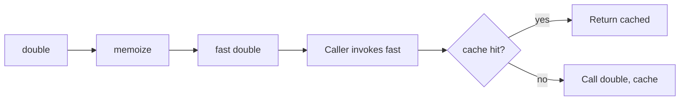

# Go Anonymous Functions — Middle Level

## 1. Introduction

At the middle level you treat anonymous functions as **first-class values with capture semantics**: tools for inline composition, scoped initialization, dependency injection, and lifecycle hooks. You also recognize when to keep them anonymous vs extract to named functions for readability and stack-trace clarity.

---

## 2. Prerequisites
- Junior-level anonymous function material
- Basic understanding of closures (deeper coverage in 2.6.5)
- Goroutines and `sync` package
- Understanding of `defer`/`panic`/`recover`

---

## 3. Glossary

| Term | Definition |
|------|-----------|
| Function literal | Go's official term for anonymous function |
| Closure | Function literal that captures enclosing variables |
| Funcval | Runtime representation: code pointer + optional captures |
| IIFE | Immediately-Invoked Function Expression |
| Decorator | Higher-order function returning a wrapped version of its input |
| Middleware | Decorator pattern applied to HTTP handlers / RPC calls |
| Hook | Optional function value used to extend behavior |

---

## 4. Core Concepts

### 4.1 Function Literal vs Named Function

Same type-system semantics, different ergonomics:

```go
// Named — appears in stack traces, can be tested directly
func double(x int) int { return x * 2 }

// Anonymous — convenient inline, but stack frame shows "func1"
double := func(x int) int { return x * 2 }
```

Stack traces:
- Named: `main.double(...)` — clear.
- Anonymous: `main.main.func1(...)` — generic.

For library-grade code, named is friendlier to debuggers and profilers.

### 4.2 Capture Semantics — By Reference

Variables captured by a function literal are shared with the enclosing scope:

```go
x := 1
f := func() int { return x }
x = 99
fmt.Println(f()) // 99
```

This means:
- Changes outside the closure are visible inside.
- Changes inside the closure are visible outside.
- The closure keeps captured variables alive (heap-allocated if it escapes).

### 4.3 IIFE for Scoped Initialization

```go
config := func() *Config {
    raw, err := os.ReadFile("config.json")
    if err != nil { log.Fatal(err) }
    var c Config
    if err := json.Unmarshal(raw, &c); err != nil { log.Fatal(err) }
    return &c
}()
```

The temporary variables `raw` and `err` are scoped to the IIFE. Useful when initialization is multi-step but you don't want a named helper.

### 4.4 Decorator Pattern

A decorator is a function that takes a function and returns a wrapped version:

```go
func logged(fn func(int) int) func(int) int {
    return func(x int) int {
        fmt.Println("calling with", x)
        result := fn(x)
        fmt.Println("returned", result)
        return result
    }
}

double := func(x int) int { return x * 2 }
loggedDouble := logged(double)
loggedDouble(5)
// Output:
// calling with 5
// returned 10
// 10
```

### 4.5 Loop-Variable Capture in Go 1.22+

The Go 1.22 change applies to ALL three for-loop forms. Each iteration creates a fresh variable for any iteration variable declared in the for statement.

```go
// Go 1.22+
fns := make([]func() int, 0)
for i := 0; i < 3; i++ {
    fns = append(fns, func() int { return i })
}
for _, f := range fns {
    fmt.Println(f()) // 0, 1, 2 in Go 1.22+
}
```

For Go ≤ 1.21, the same code prints `3, 3, 3`. The fix is to shadow `i := i` inside the loop body or pass as argument.

### 4.6 Function Literals as Struct Fields

```go
type Service struct {
    OnStart func() error
    OnStop  func() error
}

s := Service{
    OnStart: func() error {
        fmt.Println("starting")
        return nil
    },
    OnStop: func() error {
        fmt.Println("stopping")
        return nil
    },
}

if err := s.OnStart(); err != nil { /* handle */ }
```

Used for hooks, callbacks, and configuration.

---

## 5. Real-World Analogies

**An on-the-fly contractor**: hire someone for one specific task; you don't put them on payroll. Anonymous = no permanent role.

**Ad-hoc team formation**: closures are like project teams that share state for the duration of one project, then disband.

---

## 6. Mental Models

### Model 1 — Funcval as a tiny object

A function literal at runtime is a small struct:

```
non-closure literal:    [ code* ]
capturing closure:      [ code* | captured1 | captured2 | ... ]
```

The runtime accesses captures via a "context" register (DX on amd64).

### Model 2 — Closure as state machine

A counter closure is a tiny state machine:

```go
func newCounter() func() int {
    n := 0
    return func() int { n++; return n }
}
```

Each closure instance has its own `n`. The closure value bundles state + behavior — like a tiny OOP object.

---

## 7. Pros & Cons

### Pros
- Inline composition — read top-to-bottom
- Closures capture context naturally
- IIFE for scoped initialization
- Avoid one-off named functions cluttering the package

### Cons
- Less informative stack traces
- Harder to test in isolation
- Capture-by-reference can introduce subtle bugs
- Easy to abuse — long literals hurt readability

---

## 8. Use Cases

1. Sort/filter/map callbacks
2. `defer + recover` cleanup
3. Goroutine bodies
4. Functional options
5. Decorators (logging, auth, retry)
6. Hooks and lifecycle callbacks
7. IIFE for scoped init
8. Generators / counters via closures
9. Iterator/visitor pattern

---

## 9. Code Examples

### Example 1 — Decorator
```go
package main

import "fmt"

func memoize(fn func(int) int) func(int) int {
    cache := map[int]int{}
    return func(x int) int {
        if v, ok := cache[x]; ok { return v }
        v := fn(x)
        cache[x] = v
        return v
    }
}

var calls int
func slowDouble(x int) int { calls++; return x * 2 }

func main() {
    fast := memoize(slowDouble)
    fmt.Println(fast(5), fast(5), fast(5)) // 10 10 10
    fmt.Println("actual calls:", calls)    // 1
}
```

### Example 2 — Functional Options
```go
package main

import "fmt"

type Server struct {
    Addr string
    Port int
}

type Option func(*Server)

func WithAddr(a string) Option { return func(s *Server) { s.Addr = a } }
func WithPort(p int) Option    { return func(s *Server) { s.Port = p } }

func NewServer(opts ...Option) *Server {
    s := &Server{Addr: "localhost", Port: 8080}
    for _, o := range opts { o(s) }
    return s
}

func main() {
    s := NewServer(WithPort(9000))
    fmt.Printf("%+v\n", s)
}
```

### Example 3 — Pipeline
```go
package main

import (
    "fmt"
    "strings"
)

func main() {
    pipeline := []func(string) string{
        strings.TrimSpace,
        strings.ToLower,
        func(s string) string { return strings.ReplaceAll(s, " ", "-") },
    }
    s := "  Hello World  "
    for _, step := range pipeline {
        s = step(s)
    }
    fmt.Println(s) // hello-world
}
```

### Example 4 — Custom Iterator
```go
package main

import "fmt"

type Visitor func(int) bool // returns true to continue

func walk(items []int, visit Visitor) {
    for _, x := range items {
        if !visit(x) {
            return
        }
    }
}

func main() {
    walk([]int{1, 2, 3, 4, 5}, func(x int) bool {
        if x > 3 { return false } // stop
        fmt.Println(x)
        return true
    })
}
```

### Example 5 — Once-Per-Goroutine Init
```go
package main

import (
    "fmt"
    "sync"
)

func main() {
    var once sync.Once
    expensive := func() string {
        fmt.Println("computing")
        return "result"
    }
    var result string
    var wg sync.WaitGroup
    for i := 0; i < 3; i++ {
        wg.Add(1)
        go func() {
            defer wg.Done()
            once.Do(func() { result = expensive() })
        }()
    }
    wg.Wait()
    fmt.Println(result) // computed once
}
```

---

## 10. Coding Patterns

### Pattern 1 — Decorator
```go
func wrap(fn func()) func() {
    return func() {
        // before
        fn()
        // after
    }
}
```

### Pattern 2 — Higher-Order Reducer
```go
func reduce[T, R any](xs []T, init R, fn func(R, T) R) R {
    acc := init
    for _, x := range xs {
        acc = fn(acc, x)
    }
    return acc
}
sum := reduce([]int{1,2,3}, 0, func(a, b int) int { return a + b })
```

### Pattern 3 — Visitor
```go
func eachField(data map[string]any, visit func(k string, v any)) {
    for k, v := range data {
        visit(k, v)
    }
}
```

### Pattern 4 — Lifecycle Hook
```go
type Hooks struct {
    OnStart, OnStop func() error
}
func defaultHook() error { return nil }
hooks := Hooks{OnStart: defaultHook, OnStop: defaultHook}
```

### Pattern 5 — IIFE for Multi-Step Init
```go
val := func() int {
    x := 1
    y := 2
    return x + y
}()
```

---

## 11. Clean Code Guidelines

1. **Inline literals up to ~10 lines.** Beyond that, extract to a named function.
2. **Avoid 3+ levels of nested literals.**
3. **Name important callbacks** so stack traces are meaningful.
4. **Pass loop variables explicitly** in goroutines for clarity (even with Go 1.22+ semantics).
5. **Don't use IIFE to fake `do { ... } while`** — use a clear loop instead.

---

## 12. Product Use / Feature Example

**Pluggable retry policy**:

```go
package main

import (
    "errors"
    "fmt"
    "time"
)

type Policy func(attempt int) (sleep time.Duration, retry bool)

func retry(fn func() error, p Policy) error {
    for attempt := 0; ; attempt++ {
        err := fn()
        if err == nil { return nil }
        sleep, ok := p(attempt)
        if !ok {
            return fmt.Errorf("retry exhausted after %d: %w", attempt, err)
        }
        time.Sleep(sleep)
    }
}

func main() {
    var calls int
    err := retry(func() error {
        calls++
        if calls < 3 {
            return errors.New("flake")
        }
        return nil
    }, func(attempt int) (time.Duration, bool) {
        if attempt >= 5 { return 0, false }
        return 5 * time.Millisecond, true
    })
    fmt.Println(err, calls)
}
```

The retry function and policy are both anonymous, defined where they're used.

---

## 13. Error Handling

Anonymous functions in `defer` handle panics:

```go
func work() (err error) {
    defer func() {
        if r := recover(); r != nil {
            err = fmt.Errorf("panic: %v", r)
        }
    }()
    panic("boom")
}
```

Convert panics to errors at API boundaries — common pattern in stdlib (e.g., `regexp.MustCompile` is the panic-version; `regexp.Compile` is the error-version).

---

## 14. Security Considerations

1. **Closures capture sensitive data**. Be careful when passing them to log handlers or untrusted code.
2. **Goroutines spawned with anonymous bodies share captured state** — synchronize or copy.
3. **IIFE doesn't isolate state** like a separate goroutine — it's just a scoped function.

---

## 15. Performance Tips

1. **Capture-free literals are zero-cost** — same as named functions.
2. **Capture-with-escape literals heap-allocate** — measure with `-gcflags="-m"`.
3. **Lift literals out of hot loops** to avoid per-iteration allocation when captures are constant.
4. **Indirect calls through function values prevent inlining** — use named direct calls in tight inner loops where possible.

---

## 16. Metrics & Analytics

```go
import "time"

func instrumented(name string, fn func()) {
    start := time.Now()
    fn()
    fmt.Printf("[%s] %v\n", name, time.Since(start))
}

instrumented("compute", func() {
    // ... work ...
})
```

---

## 17. Best Practices

1. Keep literals short.
2. Name them when reused or stack-trace clarity matters.
3. Use the `defer func() {...}()` pattern for cleanup.
4. Pass loop variables as args to goroutines.
5. Use IIFE only for clear scoped initialization.
6. Don't return literals that capture massive state — extract only what's needed.
7. Profile escape behavior with `go build -gcflags="-m"`.

---

## 18. Edge Cases & Pitfalls

### Pitfall 1 — Forgetting to Invoke Defer
```go
defer func() { /* ... */ }
// BUG: defers a function value, never calls it
defer func() { /* ... */ }()
// CORRECT
```

### Pitfall 2 — Loop Variable in Pre-1.22
```go
for i := 0; i < 3; i++ {
    go func() { fmt.Println(i) }() // 3 3 3 in pre-1.22
}
```

### Pitfall 3 — IIFE Without Result Use
```go
func() { fmt.Println("hi") }()
// Same as just doing fmt.Println("hi") — IIFE adds no value here
```

### Pitfall 4 — Heavy Capture
```go
func makeWorker(big *BigStruct) func() {
    return func() {
        _ = big.someField
    }
}
// big is alive as long as the worker is — even if you only use one field
```

Fix: extract just what you need:
```go
func makeWorker(big *BigStruct) func() {
    field := big.someField // capture only the small piece
    return func() {
        _ = field
    }
}
```

---

## 19. Common Mistakes

| Mistake | Fix |
|---------|-----|
| `defer func(){}` (no parens) | Add `()` |
| Goroutine captures shared loop var | Pass as arg or shadow |
| Trying to recurse anonymously | Use `var f func(...); f = ...` |
| Long anonymous body hurting readability | Extract named function |
| Capturing more than needed | Extract narrow values first |

---

## 20. Common Misconceptions

**Misconception 1**: "Anonymous functions are inherently slower."
**Truth**: Without captures, identical to named. With captures that don't escape, stack-allocated. Heap only when escaping.

**Misconception 2**: "IIFE is a Go idiom."
**Truth**: Go's package-level scoping makes IIFE less necessary than in JavaScript. Use only when scope matters.

**Misconception 3**: "All closures heap-allocate."
**Truth**: Only escaping closures. The compiler stack-allocates when it can prove the closure doesn't outlive the function.

**Misconception 4**: "I should always use named functions for clarity."
**Truth**: For one-line callbacks (sort comparators, filter predicates), inline is more readable than a separate named helper.

---

## 21. Tricky Points

1. `func() {}` is a valid expression (no-op function value).
2. Function literals can be variadic, generic-ish (no type params, but accept `any`), and have named returns.
3. The runtime cost of a non-capturing literal is zero.
4. `defer func(){}()` is the CALL form; `defer func(){}` is a syntax error.
5. Closures captured by goroutines need synchronization for mutated state.

---

## 22. Test

```go
package main

import "testing"

func TestDecorator(t *testing.T) {
    var called int
    timed := func(fn func()) func() {
        return func() {
            called++
            fn()
        }
    }
    counter := timed(func() {})
    counter()
    counter()
    if called != 2 {
        t.Errorf("called=%d, want 2", called)
    }
}
```

---

## 23. Tricky Questions

**Q1**: What does this print in Go 1.22?
```go
fns := []func() int{}
for i := 0; i < 3; i++ {
    fns = append(fns, func() int { return i })
}
for _, f := range fns { fmt.Print(f(), " ") }
```
**A**: `0 1 2 ` in Go 1.22+. Pre-1.22 prints `3 3 3`.

**Q2**: What is the type of `f` here?
```go
f := func() {}
```
**A**: `func()` — a function with no parameters and no results.

**Q3**: Why does this fail to compile?
```go
fact := func(n int) int {
    if n <= 1 { return 1 }
    return n * fact(n-1)
}
```
**A**: Inside the literal, `fact` is undefined (the `:=` introduces it AFTER the right side is type-checked). Use `var fact func(int) int; fact = func(...) {...}`.

---

## 24. Cheat Sheet

```go
// Forms
f := func(x int) int { return x }
g(func(x int) int { return x })
return func(x int) int { return x }
result := func(x int) int { return x }(5)

// In defer
defer func() { /* cleanup */ }()

// In goroutine
go func(arg T) { /* ... */ }(value)

// Recursion
var f func(int) int
f = func(n int) int { ... f(n-1) ... }

// Decorator
func wrap(fn func()) func() {
    return func() { /* ... */; fn(); /* ... */ }
}
```

---

## 25. Self-Assessment Checklist

- [ ] I can write inline anonymous functions in all common positions
- [ ] I know when to extract to a named function
- [ ] I understand capture-by-reference semantics
- [ ] I know the loop-variable capture rules (pre-1.22 vs 1.22+)
- [ ] I can implement the decorator pattern
- [ ] I use IIFE for scoped initialization correctly
- [ ] I avoid heavy captures in returned closures
- [ ] I always invoke defers with `()`
- [ ] I know the recursion-by-name workaround

---

## 26. Summary

Anonymous functions are first-class values with closure semantics. They shine for one-off callbacks, decorators, and inline goroutine bodies. Watch for capture-by-reference subtleties, especially with loop variables. Extract to named functions when readability suffers. Use IIFE deliberately for scoped initialization. The cost is zero without captures, modest with stack-allocated captures, and a heap allocation when captures escape.

---

## 27. What You Can Build

- Decorators for logging, auth, rate-limiting
- Functional-option constructors
- Custom iterators via visitor pattern
- Pluggable retry policies
- Lifecycle hooks
- Memoization wrappers
- Test fakes via inline implementations

---

## 28. Further Reading

- [Effective Go — Functions](https://go.dev/doc/effective_go#functions)
- [Go Blog — Defer, Panic, and Recover](https://go.dev/blog/defer-panic-and-recover)
- [Go 1.22 release notes — loop variable change](https://go.dev/doc/go1.22)
- [Dave Cheney — Functional options for friendly APIs](https://dave.cheney.net/2014/10/17/functional-options-for-friendly-apis)

---

## 29. Related Topics

- 2.6.5 Closures (deeper coverage)
- 2.6.7 Call by Value
- Chapter 7 Concurrency
- 2.5 Loops (Go 1.22 semantics)

---

## 30. Diagrams & Visual Aids

### Anatomy of a closure value

```
funcval {
   code:  &lit_body         ← code pointer
   captures:                ← inline or pointer to capture struct
     x: 5                   ← captured locals
     y: ptr to outer's z
}
```

### Decorator application


