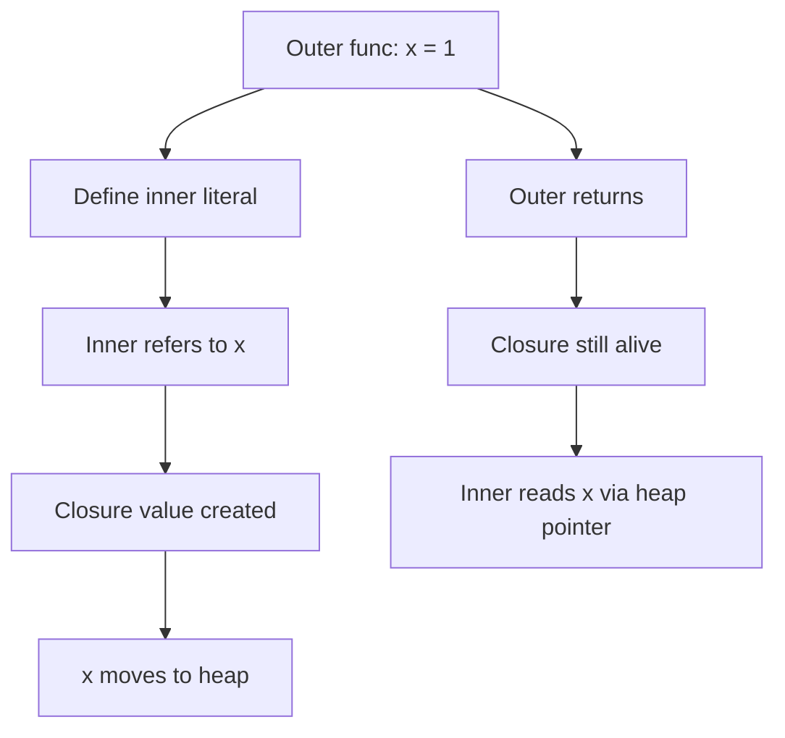

# Go Closures — Junior Level

## 1. Introduction

### What is it?
A **closure** is a function that "remembers" variables from the place where it was created. When you create an anonymous function inside another function, and the inner function uses variables from the outer function, those variables become part of the inner function's "memory" — even after the outer function returns.

### How to use it?
```go
func makeCounter() func() int {
    count := 0
    return func() int {
        count++
        return count
    }
}

c := makeCounter()
fmt.Println(c(), c(), c()) // 1 2 3
```

The returned function still has access to `count`, even though `makeCounter` has returned.

---

## 2. Prerequisites
- Functions basics (2.6.1)
- Anonymous functions (2.6.4)
- Slices and `range`
- Variable scope

---

## 3. Glossary

| Term | Definition |
|------|-----------|
| closure | A function that captures variables from its enclosing scope |
| capture | The act of "remembering" a variable from outside |
| free variable | A variable referenced inside a function but defined outside |
| enclosing function | The function in which the closure is defined |
| capture by reference | Sharing the actual variable, not a copy |
| factory | A function that returns a closure |
| state | The captured variables that persist across closure calls |

---

## 4. Core Concepts

### 4.1 What Gets Captured
A closure captures any variable it references that's defined OUTSIDE its body.

```go
func main() {
    x := 5
    f := func() int { return x }  // captures x
    fmt.Println(f())              // 5
}
```

`x` is the captured (free) variable.

### 4.2 Capture Is By Reference
The closure and the outer scope share the SAME variable. Changes are visible both ways.

```go
x := 1
f := func() { x++ }
f()
fmt.Println(x) // 2
x = 100
f()
fmt.Println(x) // 101
```

### 4.3 Captured Variables Survive
After the outer function returns, captured variables stay alive as long as the closure references them.

```go
func makeGreeter(name string) func() {
    return func() {
        fmt.Println("Hello,", name)
    }
}

greet := makeGreeter("Ada")
// makeGreeter has returned, but `name` is still alive inside the closure.
greet() // Hello, Ada
```

### 4.4 Each Closure Instance Has Its Own State
```go
c1 := makeCounter()
c2 := makeCounter()
fmt.Println(c1(), c1(), c2(), c2()) // 1 2 1 2
```

`c1` and `c2` each have their own `count`.

### 4.5 The Loop Variable Pitfall

In Go ≤ 1.21, all closures inside a `for` loop captured the SAME loop variable:

```go
fns := []func() int{}
for i := 0; i < 3; i++ {
    fns = append(fns, func() int { return i })
}
for _, f := range fns {
    fmt.Println(f())
}
// Pre Go 1.22: 3 3 3 (all see final i)
// Go 1.22+: 0 1 2 (each iteration has its own i)
```

In Go ≥ 1.22 (with `go 1.22` in `go.mod`), each iteration creates a fresh variable. Pre-1.22 code needed the shadow `i := i` workaround.

---

## 5. Real-World Analogies

**A backpack**: when you go on a trip, you carry a backpack with stuff you packed at home. Even when you're far away, you still have access to those items. The closure is the trip; the backpack is the captured variables.

**A bank account passbook**: the passbook (closure) records the balance (captured variable). You can check or update the balance anytime, and changes persist.

**A photo with people in it**: the photo "captures" the people in that moment — except in a closure, the captures are LIVE references, not photos. Changes to the people show up in the closure too.

---

## 6. Mental Models

```
makeCounter()                 returned closure       caller
  ┌──────────────┐            ┌──────────────┐     ┌──────────┐
  │ count: 0     │ ←──────────│ refers to    │     │ c := ... │
  │ ─ moved to ─│            │ count (heap) │ ←── │ c()      │
  │   heap when ─│            └──────────────┘     │ c()      │
  │   factory    │                                  └──────────┘
  │   returned   │            On each c(), count++ via closure
  └──────────────┘
```

The captured variable lives on the heap (when the closure escapes); the closure value points to it.

---

## 7. Pros & Cons

### Pros
- Encapsulate state without defining a struct
- Natural factories (counters, generators, builders)
- Natural callbacks that need context
- Powerful for functional patterns (decorators, memoization)

### Cons
- Can capture more than intended (heavy memory)
- Subtle loop-variable bugs (pre Go 1.22)
- Concurrent access requires synchronization
- Stack traces show generic `funcN` names

---

## 8. Use Cases

1. Counters and generators
2. Memoization wrappers
3. Event handlers with context
4. Decorators (logging, retry, timing)
5. Functional options
6. Custom iterators
7. Lazy initialization
8. Stateful callbacks

---

## 9. Code Examples

### Example 1 — Counter
```go
package main

import "fmt"

func newCounter() func() int {
    n := 0
    return func() int {
        n++
        return n
    }
}

func main() {
    c := newCounter()
    fmt.Println(c(), c(), c()) // 1 2 3
}
```

### Example 2 — Adder Factory
```go
package main

import "fmt"

func adder(by int) func(int) int {
    return func(x int) int {
        return x + by
    }
}

func main() {
    add3 := adder(3)
    add5 := adder(5)
    fmt.Println(add3(10), add5(10)) // 13 15
}
```

### Example 3 — Memoization
```go
package main

import "fmt"

func memoize(fn func(int) int) func(int) int {
    cache := map[int]int{}
    return func(x int) int {
        if v, ok := cache[x]; ok {
            return v
        }
        v := fn(x)
        cache[x] = v
        return v
    }
}

var calls int
func slow(x int) int { calls++; return x * x }

func main() {
    fast := memoize(slow)
    fmt.Println(fast(5), fast(5), fast(5)) // 25 25 25
    fmt.Println(calls)                      // 1
}
```

### Example 4 — Range Slider
```go
package main

import "fmt"

func nextOdd() func() int {
    n := -1
    return func() int {
        n += 2
        return n
    }
}

func main() {
    odd := nextOdd()
    for i := 0; i < 5; i++ {
        fmt.Println(odd())
    }
    // 1 3 5 7 9
}
```

### Example 5 — Capture Loop Variable (Pre 1.22 Workaround)
```go
package main

import "fmt"

func main() {
    fns := []func() int{}
    for i := 0; i < 3; i++ {
        i := i // shadow for pre-1.22 (no harm in 1.22+)
        fns = append(fns, func() int { return i })
    }
    for _, f := range fns {
        fmt.Println(f()) // 0 1 2 in all Go versions
    }
}
```

### Example 6 — Mutual Recursion
```go
package main

import "fmt"

func main() {
    var even, odd func(int) bool
    even = func(n int) bool {
        if n == 0 { return true }
        return odd(n - 1)
    }
    odd = func(n int) bool {
        if n == 0 { return false }
        return even(n - 1)
    }
    fmt.Println(even(4), odd(7)) // true true
}
```

---

## 10. Coding Patterns

### Pattern 1 — Stateful Generator
```go
func numbers(start int) func() int {
    n := start
    return func() int { n++; return n }
}
```

### Pattern 2 — Once-Wrapper
```go
func once(fn func()) func() {
    done := false
    return func() {
        if done { return }
        done = true
        fn()
    }
}
```

### Pattern 3 — Cache
```go
func cached[T any](fn func(string) T) func(string) T {
    cache := map[string]T{}
    return func(k string) T {
        if v, ok := cache[k]; ok { return v }
        v := fn(k)
        cache[k] = v
        return v
    }
}
```

### Pattern 4 — Decorator
```go
func logged(fn func()) func() {
    return func() {
        fmt.Println("before")
        fn()
        fmt.Println("after")
    }
}
```

---

## 11. Clean Code Guidelines

1. **Capture only what you need.** Don't pin large objects when you only need one field.
2. **Document captures** when the closure escapes.
3. **Use named struct + methods** when the state needs more than 2-3 fields.
4. **Synchronize concurrent captures**.
5. **Avoid deep nesting of closures** — readability suffers.

```go
// Good — small captures
func makeF(threshold int) func(x int) bool {
    return func(x int) bool { return x > threshold }
}

// Worse — captures large struct unnecessarily
func makeF(big *BigConfig) func(x int) bool {
    return func(x int) bool { return x > big.Threshold }
}
// Better:
func makeF(big *BigConfig) func(x int) bool {
    threshold := big.Threshold
    return func(x int) bool { return x > threshold }
}
```

---

## 12. Product Use / Feature Example

**A throttle helper**:

```go
package main

import (
    "fmt"
    "time"
)

func throttle(d time.Duration) func() bool {
    var last time.Time
    return func() bool {
        now := time.Now()
        if now.Sub(last) < d {
            return false
        }
        last = now
        return true
    }
}

func main() {
    canPing := throttle(100 * time.Millisecond)
    for i := 0; i < 5; i++ {
        if canPing() {
            fmt.Println("ping")
        } else {
            fmt.Println("throttled")
        }
        time.Sleep(50 * time.Millisecond)
    }
}
```

The closure captures `last`. Each instance of `throttle` has its own state.

---

## 13. Error Handling

Closures handle errors normally — but be careful with shared captured error state:

```go
type Result struct{ Value int; Err error }

func collect() (func(), func() Result) {
    var result Result
    set := func() {
        result = Result{Value: 42, Err: nil}
    }
    get := func() Result { return result }
    return set, get
}
```

Both closures share `result`.

---

## 14. Security Considerations

1. **Closures may pin sensitive data** — wipe captured secrets after use.
2. **Closures captured by long-lived goroutines** keep their captures alive forever.
3. **Don't pass closures with captured credentials** to untrusted code.

```go
// Risky:
secret := loadKey()
go func() {
    use(secret) // secret kept alive
}()
secret = nil // doesn't help; closure has its own reference

// Safer:
secret := loadKey()
go func(k []byte) {
    defer wipe(k)
    use(k)
}(append([]byte(nil), secret...))
wipe(secret)
```

---

## 15. Performance Tips

1. **Captures that don't escape are stack-allocated** — free.
2. **Captures that escape go to the heap** — one allocation per closure.
3. **Verify with `go build -gcflags="-m"`**.
4. **In hot loops, avoid creating closures per iteration** — lift them out or pass state as args.

---

## 16. Metrics & Analytics

```go
func counter() (incr func(), value func() int) {
    n := 0
    incr = func() { n++ }
    value = func() int { return n }
    return
}

inc, val := counter()
for i := 0; i < 5; i++ { inc() }
fmt.Println(val()) // 5
```

A pair of closures sharing state — useful for metrics.

---

## 17. Best Practices

1. Capture only what you need.
2. Use closures for simple stateful behavior.
3. Use structs + methods when state grows.
4. Synchronize concurrent captures.
5. Document closure lifetimes.
6. Watch for the loop-variable pitfall (still applies to pre-1.22 modules).
7. Use the shadow `x := x` for explicit per-iteration capture.

---

## 18. Edge Cases & Pitfalls

### Pitfall 1 — Loop Variable Capture (Pre 1.22)
```go
for i := 0; i < 3; i++ {
    go func() { fmt.Println(i) }() // 3 3 3 in pre-1.22
}
```
Fix: pass as arg, shadow, or use Go 1.22+.

### Pitfall 2 — Heavy Capture
```go
func makeRead(big *BigStruct) func() byte {
    return func() byte { return big.firstByte() } // pins big
}
```
Fix: extract minimal data:
```go
first := big.firstByte()
return func() byte { return first }
```

### Pitfall 3 — Concurrent Mutation
```go
counter := newCounter()
go counter() // race
go counter()
```
Fix: synchronize internally:
```go
func newCounter() func() int {
    var mu sync.Mutex
    n := 0
    return func() int {
        mu.Lock(); defer mu.Unlock()
        n++; return n
    }
}
```

### Pitfall 4 — Shadowing By Accident
```go
x := 1
f := func() {
    x := 99 // shadows; doesn't modify outer x
    _ = x
}
f()
fmt.Println(x) // 1
```

### Pitfall 5 — Recursion Without `var`
```go
fact := func(n int) int {
    return n * fact(n-1) // ERROR: fact undefined
}
```
Fix: use `var fact func(int) int; fact = ...`.

---

## 19. Common Mistakes

| Mistake | Fix |
|---------|-----|
| Loop var captured shared (pre-1.22) | Pass as arg, shadow, or upgrade |
| Concurrent capture access | Add mutex/atomic |
| Heavy capture pinning memory | Extract minimal data |
| Accidental shadowing | Use distinct names |
| Recursion without `var` declaration | Use `var f ...; f = ...` |

---

## 20. Common Misconceptions

**Misconception 1**: "Closures copy the captured variable."
**Truth**: Closures capture by REFERENCE. The variable is shared.

**Misconception 2**: "Captured variables die when the outer function returns."
**Truth**: Their lifetime extends to match the closure's.

**Misconception 3**: "All closures heap-allocate."
**Truth**: Only escaping closures. Non-escaping ones stay on the stack.

**Misconception 4**: "Closures are slow."
**Truth**: Without escape, identical to direct calls. With escape, one heap alloc + indirect call cost.

**Misconception 5**: "Each closure call creates a new variable."
**Truth**: Each closure INSTANCE has its own captures. Each CALL of an existing closure uses the same captures.

---

## 21. Tricky Points

1. Closures capture by reference — even small values.
2. To capture a snapshot, shadow with `x := x`.
3. The Go 1.22 loop-variable change applies to all 3 for-forms when iteration var is `:=`.
4. Recursive closures need `var f ...; f = ...`.
5. Concurrent capture mutation is a race; synchronize.

---

## 22. Test

```go
package main

import "testing"

func newCounter() func() int {
    n := 0
    return func() int { n++; return n }
}

func TestCounter(t *testing.T) {
    c := newCounter()
    if got := c(); got != 1 { t.Errorf("got %d, want 1", got) }
    if got := c(); got != 2 { t.Errorf("got %d, want 2", got) }
}

func TestSeparateCounters(t *testing.T) {
    c1 := newCounter()
    c2 := newCounter()
    c1()
    c1()
    if got := c2(); got != 1 {
        t.Errorf("c2 got %d, want 1 (independent state)", got)
    }
}
```

---

## 23. Tricky Questions

**Q1**: What's the output?
```go
x := 1
f := func() int { return x }
g := func() int { return x }
x = 99
fmt.Println(f(), g())
```
**A**: `99 99`. Both closures capture the same `x`.

**Q2**: What's the output?
```go
x := 1
f := func() int {
    x := x
    return x
}
x = 99
fmt.Println(f())
```
**A**: `1`. The inner `x := x` shadows the outer; the snapshot was taken when the closure was created (when `x == 1`).

**Q3**: What's the difference between these two?
```go
// A
x := 1
defer fmt.Println(x)
x = 99

// B
x := 1
defer func() { fmt.Println(x) }()
x = 99
```
**A**:
- A: prints `1` (args evaluated at defer time).
- B: prints `99` (closure captures x by ref, reads at function exit).

---

## 24. Cheat Sheet

```go
// Counter
n := 0
f := func() int { n++; return n }

// Factory
func make(by int) func(int) int {
    return func(x int) int { return x + by }
}

// Snapshot capture
x := 5
f := func() int {
    x := x // freeze value
    return x
}

// Pre-1.22 loop fix
for _, item := range items {
    item := item
    go process(item)
}

// Recursive closure
var fact func(int) int
fact = func(n int) int {
    if n <= 1 { return 1 }
    return n * fact(n-1)
}

// Concurrent counter
var mu sync.Mutex
n := 0
incr := func() {
    mu.Lock(); defer mu.Unlock()
    n++
}
```

---

## 25. Self-Assessment Checklist

- [ ] I can write a closure factory
- [ ] I understand capture by reference
- [ ] I know captured variables outlive the outer function
- [ ] I know each closure instance has its own captures
- [ ] I can write the snapshot-capture idiom (`x := x`)
- [ ] I know the loop-variable change in Go 1.22
- [ ] I can write a recursive closure
- [ ] I synchronize concurrent capture access
- [ ] I avoid heavy captures

---

## 26. Summary

A closure is a function that captures variables from its enclosing scope. Captures are by reference: changes outside affect inside, and vice versa. Captured variables survive as long as the closure does. Each closure instance has its own captures. Watch the loop-variable pitfall (mostly fixed in Go 1.22). Use closures for simple stateful behavior; reach for structs + methods when state grows. Synchronize concurrent access. The cost is one heap allocation when the closure escapes.

---

## 27. What You Can Build

- Counters and ID generators
- Memoization wrappers
- Throttles and rate limiters
- Decorators (logging, retry)
- Functional options
- Custom iterators
- Lazy-init helpers
- Stateful callbacks

---

## 28. Further Reading

- [Effective Go — Closures](https://go.dev/doc/effective_go#functions)
- [Go Tour — Closures](https://go.dev/tour/moretypes/25)
- [Go Spec — Function literals](https://go.dev/ref/spec#Function_literals)
- [Go 1.22 release notes — Loop variable change](https://go.dev/doc/go1.22)

---

## 29. Related Topics

- 2.6.4 Anonymous Functions
- 2.6.7 Call by Value
- 2.5 Loops (Go 1.22 semantics)
- Chapter 7 Concurrency

---

## 30. Diagrams & Visual Aids

### Closure capture flow



### Two closures sharing state

```
        ┌────────────┐
        │  count: N  │  ← single heap variable
        └──────┬─────┘
               │ both refer to it
       ┌───────┴────────┐
       │                │
   ┌───┴───┐        ┌───┴────┐
   │ incr  │        │  get   │
   └───────┘        └────────┘
```
