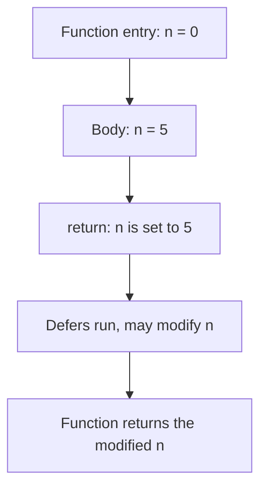

# Go Named Return Values — Junior Level

## 1. Introduction

### What is it?
A **named return value** is a return parameter that has a NAME, declared in the function signature. The name acts as a local variable initialized to its zero value. The function can assign to it, and a bare `return` (no expressions) returns the current values.

### How to use it?
```go
func split(sum int) (x, y int) {
    x = sum / 2
    y = sum - x
    return // returns x and y
}
```

The names `x` and `y` document what each result means.

---

## 2. Prerequisites
- Functions basics (2.6.1)
- Multiple return values (2.6.3)
- Variable scope and zero values

---

## 3. Glossary

| Term | Definition |
|------|-----------|
| named return | A result parameter with a name in the signature |
| naked return | `return` with no expressions; uses named results |
| bare return | Synonym for naked return |
| zero value | The default value of a type (0, "", nil, false, etc.) |
| result parameter | A variable in the function's result list |
| explicit return | `return expr1, expr2` with expressions |

---

## 4. Core Concepts

### 4.1 Syntax
```go
func name(params) (resultName1 Type1, resultName2 Type2) {
    // body
}
```

The names are inside parentheses. Even a single named result needs parens:
```go
func a() (n int) { return 0 }
```

### 4.2 Named Results Are Local Variables
At function entry, named results are declared and initialized to their zero values:

```go
func f() (n int, s string, ok bool) {
    fmt.Println(n, s, ok) // 0 "" false
    return
}
```

You can assign to them anywhere in the function:
```go
func f() (n int) {
    n = 42
    return // returns 42
}
```

### 4.3 Naked Return
`return` with no expressions returns the current values of the named results:

```go
func split(sum int) (x, y int) {
    x = sum * 4 / 9
    y = sum - x
    return // equivalent to: return x, y
}
```

### 4.4 You Can Still Use Explicit Return
Even with named results, you can return values explicitly:

```go
func f() (n int) {
    return 42 // sets n = 42 implicitly, then returns
}
```

### 4.5 Mix Naked and Explicit Returns
Different paths can use different forms:

```go
func validate(x int) (n int, err error) {
    if x < 0 {
        err = fmt.Errorf("negative")
        return // naked: returns (0, err)
    }
    if x == 0 {
        return 0, fmt.Errorf("zero") // explicit
    }
    n = x
    return // naked: returns (x, nil)
}
```

---

## 5. Real-World Analogies

**A form with pre-printed labels**: the form has labeled boxes (named results) starting empty (zero values). You fill in some boxes; submitting the form returns whatever's there.

**A pre-stocked toolbox with labels**: each tool slot is labeled. You can swap tools or leave them. When you hand over the toolbox (`return`), you hand over whatever's in it.

---

## 6. Mental Models

```
function entry:
    n int = 0           ← named result, zero-initialized
    err error = nil

body:
    n = computeN()
    err = checkErr()

return (naked):
    return (n, err)     ← uses current values
```

The named results behave exactly like local variables.

---

## 7. Pros & Cons

### Pros
- Documents the meaning of each result in the signature
- Allows naked return for shorter code
- Enables defer to modify return values (cleanup-error capture, panic-to-error)
- Result variables can be addressed (taken `&`)

### Cons
- Naked return in long functions is unclear (reader scrolls up to see what's returned)
- Easy to forget assignment (returns zero value silently)
- Adds visual noise in simple functions

---

## 8. Use Cases

1. Short functions where result names aid clarity
2. Functions that need defer to modify the return value
3. Cleanup-error capture (close file, propagate error)
4. Panic-to-error conversion via recover
5. Documentation purposes — naming the return for readers

---

## 9. Code Examples

### Example 1 — Basic Named Return
```go
package main

import "fmt"

func split(sum int) (x, y int) {
    x = sum * 4 / 9
    y = sum - x
    return
}

func main() {
    fmt.Println(split(100)) // 44 56
}
```

### Example 2 — Documentation Value
```go
package main

import "fmt"

func minMax(xs []int) (min, max int) {
    min = xs[0]
    max = xs[0]
    for _, x := range xs[1:] {
        if x < min { min = x }
        if x > max { max = x }
    }
    return
}

func main() {
    fmt.Println(minMax([]int{3, 1, 4, 1, 5, 9, 2, 6})) // 1 9
}
```

The signature `(min, max int)` documents the order without needing comments.

### Example 3 — Naked Return on All Paths
```go
package main

import (
    "fmt"
    "errors"
)

func divmod(a, b int) (q, r int, err error) {
    if b == 0 {
        err = errors.New("division by zero")
        return
    }
    q = a / b
    r = a % b
    return
}

func main() {
    fmt.Println(divmod(17, 5)) // 3 2 <nil>
    fmt.Println(divmod(10, 0)) // 0 0 division by zero
}
```

### Example 4 — Defer Modifying Named Result
```go
package main

import (
    "errors"
    "fmt"
)

func work() (result int, err error) {
    defer func() {
        if err != nil {
            result = -1
        }
    }()
    return 42, errors.New("oops")
}

func main() {
    fmt.Println(work()) // -1 oops
}
```

### Example 5 — Cleanup Error Capture
```go
package main

import (
    "fmt"
    "os"
)

func wordCount(path string) (count int, err error) {
    f, err := os.Open(path)
    if err != nil { return 0, err }
    defer func() {
        if cerr := f.Close(); cerr != nil && err == nil {
            err = cerr
        }
    }()
    // ... count words in f ...
    count = 42
    return
}

func main() {
    fmt.Println(wordCount("/etc/hosts"))
}
```

### Example 6 — Recover Sets Named Error
```go
package main

import "fmt"

func safeDivide(a, b int) (result int, err error) {
    defer func() {
        if r := recover(); r != nil {
            err = fmt.Errorf("recovered: %v", r)
        }
    }()
    return a / b, nil // panics if b == 0
}

func main() {
    fmt.Println(safeDivide(10, 2))
    fmt.Println(safeDivide(10, 0))
}
```

---

## 10. Coding Patterns

### Pattern 1 — Naked Return for Short Functions
```go
func half(n int) (result int) {
    result = n / 2
    return
}
```

### Pattern 2 — Defer Cleanup Error
```go
func op() (err error) {
    res, err := acquire()
    if err != nil { return err }
    defer func() {
        if rerr := res.Close(); rerr != nil && err == nil {
            err = rerr
        }
    }()
    // ...
    return nil
}
```

### Pattern 3 — Panic to Error
```go
func safe() (err error) {
    defer func() {
        if r := recover(); r != nil {
            err = fmt.Errorf("panic: %v", r)
        }
    }()
    risky()
    return nil
}
```

### Pattern 4 — Documentation
```go
// connect returns a connection and the protocol used.
func connect(addr string) (conn net.Conn, proto string, err error) {
    // ...
    return
}
```

---

## 11. Clean Code Guidelines

1. **Use named returns for short functions** (≤ 10 lines).
2. **In long functions, prefer explicit returns** — readers shouldn't scroll up.
3. **Use named returns when defer needs to modify the result**.
4. **Don't use named returns just to save typing** — clarity matters more.
5. **Document each named result** in the doc comment.

```go
// Good — short and clear:
func half(n int) (result int) {
    result = n / 2
    return
}

// Bad — naked return after 30 lines is hard to track:
func longFunc() (a, b, c int) {
    // ... 30 lines ...
    return // what does this return?
}
```

---

## 12. Product Use / Feature Example

**A query helper with cleanup**:

```go
package main

import (
    "database/sql"
    "fmt"
)

func userCount(db *sql.DB) (count int, err error) {
    rows, err := db.Query("SELECT COUNT(*) FROM users")
    if err != nil { return 0, err }
    defer func() {
        if cerr := rows.Close(); cerr != nil && err == nil {
            err = cerr
        }
    }()
    if rows.Next() {
        if scanErr := rows.Scan(&count); scanErr != nil {
            return 0, scanErr
        }
    }
    return
}

func main() {
    var db *sql.DB
    n, err := userCount(db)
    fmt.Println(n, err)
}
```

The named `err` is captured in defer to propagate close errors.

---

## 13. Error Handling

The defer-and-set pattern captures cleanup errors:

```go
func op() (n int, err error) {
    res, err := acquire()
    if err != nil { return 0, err }
    defer func() {
        if cerr := res.Close(); cerr != nil && err == nil {
            err = cerr
        }
    }()
    // ... compute n ...
    return
}
```

Without the named `err`, you'd have to manually track and merge errors.

---

## 14. Security Considerations

1. **Be explicit about returning errors** — naked return that "forgets" to set `err = nil` is an easy bug.
2. **In recover patterns, always check `r != nil`** before assigning to `err`.
3. **Don't expose sensitive intermediate state** in named results that recover can read.

```go
// Risky — recover sees password
func auth(password string) (token string, err error) {
    defer func() {
        if r := recover(); r != nil {
            err = fmt.Errorf("auth failed: %v (input was: %s)", r, password) // BAD: leaks password
        }
    }()
    // ...
    return
}

// Safer
defer func() {
    if r := recover(); r != nil {
        err = fmt.Errorf("auth failed: %v", r)
    }
}()
```

---

## 15. Performance Tips

1. **Named vs unnamed has no performance difference** — both compile to the same code.
2. **Defer + named return is fast** — open-coded defer (Go 1.14+) makes it near-zero-cost.
3. **Avoid naked return in hot loops only for clarity** — performance is identical.

---

## 16. Metrics & Analytics

```go
import "time"

func instrumented(name string) (duration time.Duration, err error) {
    start := time.Now()
    defer func() {
        duration = time.Since(start)
        // metrics.Record(name, duration, err)
    }()
    err = doWork()
    return
}
```

The defer captures both `duration` and `err` for the metric.

---

## 17. Best Practices

1. Use named returns for short, focused functions.
2. Use named results when defer needs to modify them.
3. Always set the named result (or accept zero value as the answer).
4. Don't mix lots of explicit `return value` with naked `return` — pick one style per function.
5. Document the meaning of each named result.

---

## 18. Edge Cases & Pitfalls

### Pitfall 1 — Naked Return Without Named Results
```go
func bad() int {
    return // compile error: not enough arguments to return
}
```

### Pitfall 2 — Forgetting to Set Named Result
```go
func half(n int) (result int) {
    n / 2 // BUG: not assigned anywhere
    return // returns 0
}
// Fix: result = n / 2
```

### Pitfall 3 — Defer Modifies but Caller Doesn't See It (Pointer Receiver Confusion)

This works fine with named returns because the defer happens BEFORE return:
```go
func ok() (n int) {
    defer func() { n++ }()
    n = 5
    return // returns 6
}
```

### Pitfall 4 — Shadowing Named Result
```go
func f() (n int) {
    {
        n := 99 // shadows n in inner block
        _ = n
    }
    return // returns 0; outer n was never assigned
}
```

### Pitfall 5 — Mixing Named and Unnamed
```go
// func f() (n int, string) {} // compile error
```

---

## 19. Common Mistakes

| Mistake | Fix |
|---------|-----|
| Naked return without named results | Use explicit return or name the results |
| Forgetting to assign named result | Add `result = ...` or use explicit return |
| Naked return in long function | Use explicit return for clarity |
| Mixing named and unnamed in same list | All named or all unnamed |
| Defer reading named result before assignment | Defer runs after explicit return (or after final assignment) |

---

## 20. Common Misconceptions

**Misconception 1**: "Named returns are slower."
**Truth**: Identical performance to unnamed returns.

**Misconception 2**: "Naked return is required when results are named."
**Truth**: You can use either naked or explicit. Naked is just an option.

**Misconception 3**: "Named results behave like a return-by-reference."
**Truth**: They're regular local variables; the function returns their values, not references.

**Misconception 4**: "You can't combine `return value` with named results."
**Truth**: Explicit return assigns to the named results then returns. Both work.

**Misconception 5**: "Defer always runs before assignments to named results."
**Truth**: Defer runs AFTER all explicit return assignments and AFTER the body completes — but BEFORE the function actually returns to the caller.

---

## 21. Tricky Points

1. Named results are zero-initialized at function entry.
2. Defer can read AND modify named results after `return`.
3. Naked return uses current values; assignments before `return` are visible.
4. You can take the address of a named result (`p := &n`).
5. Mixing named and unnamed in the same result list is a compile error.

---

## 22. Test

```go
package main

import (
    "errors"
    "testing"
)

func split(sum int) (x, y int) {
    x = sum * 4 / 9
    y = sum - x
    return
}

func TestSplit(t *testing.T) {
    x, y := split(100)
    if x != 44 || y != 56 {
        t.Errorf("got (%d, %d); want (44, 56)", x, y)
    }
}

func divideErr() (n int, err error) {
    defer func() {
        if err != nil {
            n = -1
        }
    }()
    return 42, errors.New("e")
}

func TestDeferMod(t *testing.T) {
    n, err := divideErr()
    if n != -1 {
        t.Errorf("got n=%d; want -1", n)
    }
    if err == nil {
        t.Errorf("expected err")
    }
}
```

---

## 23. Tricky Questions

**Q1**: What does this print?
```go
func f() (n int) {
    defer func() { n++ }()
    n = 5
    return
}
fmt.Println(f())
```
**A**: `6`. Defer runs after `n = 5`, increments to 6, then returns.

**Q2**: What does this print?
```go
func f() (n int) {
    defer func() { n++ }()
    return 5
}
fmt.Println(f())
```
**A**: `6`. `return 5` sets `n = 5`, defer increments to 6.

**Q3**: What does this print?
```go
func f() int {
    n := 5
    defer func() { n++ }()
    return n
}
fmt.Println(f())
```
**A**: `5`. The result is unnamed; `return n` evaluates `n` (5), then defer increments the LOCAL n to 6, but the return value is already captured as 5.

This shows the difference between named and unnamed returns + defer.

---

## 24. Cheat Sheet

```go
// Named return, naked return
func split(sum int) (x, y int) {
    x = sum / 2
    y = sum - x
    return
}

// Named with defer modification
func work() (n int, err error) {
    defer func() { if err != nil { n = -1 } }()
    return 42, someErr
}

// Recover + named error
func safe() (err error) {
    defer func() {
        if r := recover(); r != nil { err = fmt.Errorf("%v", r) }
    }()
    risky()
    return nil
}

// Cleanup error capture
func op() (err error) {
    res, err := acquire()
    if err != nil { return err }
    defer func() {
        if cerr := res.Close(); cerr != nil && err == nil { err = cerr }
    }()
    return
}
```

---

## 25. Self-Assessment Checklist

- [ ] I can declare a function with named return values
- [ ] I know naked return uses current values
- [ ] I can mix naked and explicit returns in one function
- [ ] I understand defer can modify named results
- [ ] I can use the cleanup-error capture pattern
- [ ] I can convert panics to errors via defer + named result
- [ ] I avoid naked return in long functions
- [ ] I document the meaning of each named result

---

## 26. Summary

Named return values are result parameters with names that act as zero-initialized local variables. A naked return (`return` with no expressions) returns their current values. They're useful for documentation, for short functions, and especially for defer-based patterns: cleanup-error capture and panic-to-error conversion. Avoid naked return in long functions where the reader can't easily see what's returned.

---

## 27. What You Can Build

- File processors with cleanup-error propagation
- Database queries with proper error handling
- Panic-safe library functions
- Resource managers (lock, transaction, connection)
- Monitoring helpers that record duration alongside the operation
- Short utility functions where result names aid readability

---

## 28. Further Reading

- [Effective Go — Named result parameters](https://go.dev/doc/effective_go#named-results)
- [Go Spec — Function declarations](https://go.dev/ref/spec#Function_declarations)
- [Go Blog — Defer, Panic, and Recover](https://go.dev/blog/defer-panic-and-recover)

---

## 29. Related Topics

- 2.6.3 Multiple Return Values
- 2.6.1 Functions Basics
- Chapter 5 Error Handling
- `defer`, `panic`, `recover`

---

## 30. Diagrams & Visual Aids

### Defer modifies named result



### Naked vs explicit return

```
Naked:                    Explicit:
func f() (n int) {        func f() (n int) {
    n = 42                    return 42
    return                }
}
```

Both return `42`. Explicit is clearer in long functions.
