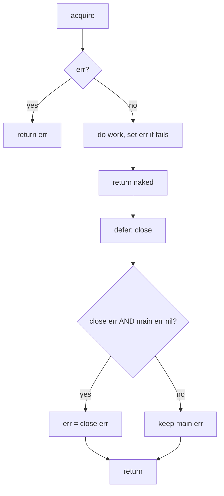

# Go Named Return Values — Middle Level

## 1. Introduction

At the middle level you treat named returns as a deliberate API design choice with two main purposes: (1) documentation in the signature, and (2) enabling defer-based patterns that modify the return value. You know when naked return helps readability and when it harms it.

---

## 2. Prerequisites
- Junior-level named return material
- Multiple return values (2.6.3)
- `defer`, `panic`, `recover`
- Error wrapping basics

---

## 3. Glossary

| Term | Definition |
|------|-----------|
| Naked return | `return` with no expressions; uses named results |
| Cleanup-error capture | defer + named error to propagate close errors |
| Panic-to-error conversion | defer + recover + named error |
| Result name | The identifier of a named return parameter |
| Documentation-only naming | Naming results purely for clarity, not for naked return |

---

## 4. Core Concepts

### 4.1 Three Reasons to Use Named Returns

1. **Documentation in signature**: `(n int, err error)` is clearer than `(int, error)`.
2. **Naked return**: shorter for simple functions.
3. **Defer modification**: enable cleanup-error capture and panic-to-error.

If none of these apply, prefer unnamed returns.

### 4.2 Defer Modification Order

The order of operations on `return expr1, expr2`:
1. Evaluate `expr1`, `expr2`.
2. Assign to named results.
3. Run all deferred functions in LIFO order (they can modify named results).
4. Return the (possibly-modified) named results.

```go
func f() (n int) {
    defer func() {
        n++ // runs after return; sees and modifies n
    }()
    return 5 // n = 5; defer makes n = 6; returns 6
}
```

### 4.3 Cleanup Error Propagation

The classic pattern:
```go
func op() (err error) {
    res, err := acquire()
    if err != nil { return err }
    defer func() {
        if cerr := res.Close(); cerr != nil && err == nil {
            err = cerr // propagate close error if no other
        }
    }()
    // ... do work ...
    return nil
}
```

Without named `err`, you'd have to manually capture and re-merge after each operation.

### 4.4 Panic-to-Error Conversion

```go
func safe() (err error) {
    defer func() {
        if r := recover(); r != nil {
            err = fmt.Errorf("panic: %v", r)
        }
    }()
    risky()
    return nil
}
```

If `risky()` panics, the deferred function catches it and assigns to `err`. The function returns gracefully with an error instead of crashing.

### 4.5 Naked Return: When It Helps, When It Hurts

Helps:
- Short functions (< 10 lines).
- Single explicit return statement.
- Result names clearly document the meaning.

Hurts:
- Long functions where the reader can't see what's returned without scrolling.
- Complex control flow with multiple paths.
- Mixed naked + explicit in same function.

```go
// Helps:
func split(sum int) (x, y int) {
    x = sum / 2
    y = sum - x
    return
}

// Hurts:
func longFunction() (a, b, c int, err error) {
    // ... 50 lines of complex logic ...
    return // what does this return?
}
```

### 4.6 Named Returns and Generics

```go
func Zero[T any]() (v T) {
    return // returns zero value of T
}

n := Zero[int]()    // 0
s := Zero[string]() // ""
p := Zero[*int]()   // nil
```

Generic named returns work the same as concrete ones.

---

## 5. Real-World Analogies

**A signed contract template**: each blank field has a label (the named result). You fill some, leave others (zero values). Submitting (return) hands over the contract with whatever's filled in.

**A clipboard with checkboxes**: defer can modify the checkboxes after you've filled them but before handing in the clipboard.

---

## 6. Mental Models

### Model 1 — Named Results as Locals + Sugar

```
function entry:
    var n int = 0      ← named result
    var err error = nil

body:
    n = compute()
    err = check()

return (naked):       ← sugar for return n, err
    pre-return: defers can modify n, err
    post-return: caller receives final n, err
```

### Model 2 — Defer's Modification Window

```
return expr1, expr2
   ↓
   1. evaluate expr1, expr2
   2. assign to named results
   ─── modification window ───
   3. defers run, may modify named results
   ─── end of modification window ───
   4. function returns
```

---

## 7. Pros & Cons

### Pros
- Documentation in signature
- Enables powerful defer patterns
- Shorter code in some cases (naked return)
- Generic-friendly

### Cons
- Naked return in long functions hurts readability
- Easy to forget assignment (silent zero-value return)
- Adds visual noise in trivial functions
- Can mask intent compared to explicit return

---

## 8. Use Cases

1. Documentation: `(n int, err error)` clearly says what's returned.
2. Cleanup-error capture (file close, lock release).
3. Panic-to-error conversion at API boundaries.
4. Tracing/timing helpers (defer record duration).
5. Auto-rollback in transactions (defer rollback if not committed).

---

## 9. Code Examples

### Example 1 — Cleanup Error Capture
```go
package main

import (
    "fmt"
    "os"
)

func writeAndClose(path, data string) (err error) {
    f, err := os.Create(path)
    if err != nil { return err }
    defer func() {
        if cerr := f.Close(); cerr != nil && err == nil {
            err = cerr
        }
    }()
    _, err = f.WriteString(data)
    return
}

func main() {
    err := writeAndClose("/tmp/test.txt", "hello")
    fmt.Println(err)
}
```

### Example 2 — Transaction Rollback
```go
package main

import (
    "database/sql"
    "fmt"
)

func transfer(db *sql.DB, from, to string, amount int) (err error) {
    tx, err := db.Begin()
    if err != nil { return err }
    defer func() {
        if err != nil {
            tx.Rollback()
            return
        }
        if cerr := tx.Commit(); cerr != nil {
            err = cerr
        }
    }()
    if _, err = tx.Exec("UPDATE accounts SET bal = bal - ? WHERE id = ?", amount, from); err != nil { return }
    if _, err = tx.Exec("UPDATE accounts SET bal = bal + ? WHERE id = ?", amount, to); err != nil { return }
    return
}

func main() {
    var db *sql.DB
    err := transfer(db, "a", "b", 100)
    fmt.Println(err)
}
```

### Example 3 — Panic-to-Error
```go
package main

import "fmt"

func parse(s string) (result int, err error) {
    defer func() {
        if r := recover(); r != nil {
            err = fmt.Errorf("parse panic: %v", r)
        }
    }()
    if s == "" {
        panic("empty input")
    }
    return len(s), nil
}

func main() {
    fmt.Println(parse("hello")) // 5 <nil>
    fmt.Println(parse(""))      // 0 parse panic: empty input
}
```

### Example 4 — Tracing
```go
package main

import (
    "fmt"
    "time"
)

func tracedOp(name string) (result string, err error) {
    start := time.Now()
    defer func() {
        fmt.Printf("[%s] dur=%v err=%v\n", name, time.Since(start), err)
    }()
    time.Sleep(50 * time.Millisecond)
    result = "done"
    return
}

func main() {
    tracedOp("query")
}
```

### Example 5 — Documentation Value
```go
package main

import "fmt"

// connect returns the open conn, the protocol used, and any error.
func connect(addr string) (conn string, proto string, err error) {
    conn = addr + ":connected"
    proto = "TCP"
    return
}

func main() {
    fmt.Println(connect("example.com"))
}
```

The signature is self-documenting.

---

## 10. Coding Patterns

### Pattern 1 — Cleanup Error
```go
func op() (err error) {
    res, err := acquire()
    if err != nil { return err }
    defer func() {
        if cerr := res.Close(); cerr != nil && err == nil {
            err = cerr
        }
    }()
    // ...
    return nil
}
```

### Pattern 2 — Auto-Rollback
```go
func tx() (err error) {
    t, err := begin()
    if err != nil { return }
    defer func() {
        if err != nil { t.Rollback() } else { err = t.Commit() }
    }()
    // ...
    return
}
```

### Pattern 3 — Recover-and-Convert
```go
func safe() (err error) {
    defer func() {
        if r := recover(); r != nil {
            err = fmt.Errorf("recovered: %v", r)
        }
    }()
    risky()
    return nil
}
```

### Pattern 4 — Trace
```go
func traced(name string) (n int, err error) {
    start := time.Now()
    defer func() {
        log.Printf("[%s] dur=%v err=%v", name, time.Since(start), err)
    }()
    // ...
    return
}
```

---

## 11. Clean Code Guidelines

1. **Use named returns when defer needs to modify them.**
2. **Use named returns when result names document meaning.**
3. **Avoid naked return in long functions.**
4. **Don't mix naked + explicit returns** unless it makes branches clearer.
5. **Don't name results just for short typing** if it adds no documentation value.

---

## 12. Product Use / Feature Example

**A retry helper that captures error and time spent**:

```go
package main

import (
    "errors"
    "fmt"
    "time"
)

func retry(attempts int, fn func() error) (success bool, attempts_used int, err error) {
    for attempts_used = 1; attempts_used <= attempts; attempts_used++ {
        if err = fn(); err == nil {
            success = true
            return
        }
        time.Sleep(time.Duration(attempts_used) * 10 * time.Millisecond)
    }
    return
}

func main() {
    var calls int
    s, n, err := retry(5, func() error {
        calls++
        if calls < 3 { return errors.New("flake") }
        return nil
    })
    fmt.Printf("success=%v attempts=%d err=%v\n", s, n, err)
}
```

The signature documents all three results.

---

## 13. Error Handling

The named-error pattern is foundational for cleanup:

```go
func mustClose(r io.Closer) (err error) {
    defer func() {
        if cerr := r.Close(); cerr != nil && err == nil {
            err = cerr
        }
    }()
    // ... use r ...
    return nil
}
```

Without the named `err`, you'd need:
```go
func mustClose(r io.Closer) error {
    var err error
    // ... use r ...
    if cerr := r.Close(); cerr != nil && err == nil {
        err = cerr
    }
    return err
}
```

The named-return version is shorter, but more importantly, it works correctly even on error paths that return early — the defer still runs.

---

## 14. Security Considerations

1. **Don't leak sensitive data in panic messages**:
   ```go
   defer func() {
       if r := recover(); r != nil {
           err = fmt.Errorf("auth panic: %v", r) // r might contain sensitive data
       }
   }()
   ```
2. **Be careful with named errors that might be set partially**:
   ```go
   func op() (n int, err error) {
       n = compute() // might be valid even before err is set
       err = check(n) // sets err if invalid
       return
       // Caller sees (validN, err) — might use n inappropriately
   }
   ```

---

## 15. Performance Tips

1. **Identical to unnamed returns in performance.**
2. **Open-coded defer** (Go 1.14+) makes defer + named return near-zero-cost.
3. **Don't worry about naming for performance**; choose for clarity.

---

## 16. Metrics & Analytics

```go
func instrumentedOp(name string) (result string, dur time.Duration, err error) {
    start := time.Now()
    defer func() {
        dur = time.Since(start)
    }()
    result, err = doWork()
    return
}
```

The defer captures `dur` AFTER `doWork` completes.

---

## 17. Best Practices

1. Use named returns for documentation.
2. Use named returns when defer modifies them.
3. Prefer explicit return for long or branchy functions.
4. Never `return` naked unless you're SURE all named results are set.
5. Document each result in the function comment.
6. Avoid mixing styles within one function.

---

## 18. Edge Cases & Pitfalls

### Pitfall 1 — Defer Reads Stale Value
```go
func f() (n int) {
    n = 5
    defer fmt.Println(n) // prints 5 — args evaluated AT defer time
    n = 99
    return
}
// Output: 5
```

vs:

```go
func f() (n int) {
    n = 5
    defer func() { fmt.Println(n) }() // captures n by ref; reads at exit
    n = 99
    return
}
// Output: 99
```

### Pitfall 2 — Shadowing
```go
func f() (n int) {
    n := 99 // SHADOWS the named result, doesn't modify it
    _ = n
    return // returns 0
}
```
Use `n = 99` (assignment) instead of `n := 99`.

### Pitfall 3 — Forgetting to Set
```go
func f() (n int) {
    return // returns 0 — no assignment to n
}
```

### Pitfall 4 — Mixing Named and Unnamed
```go
// func f() (n int, string) {} // compile error
```

### Pitfall 5 — Defer Setting err = nil Accidentally
```go
defer func() {
    if r := recover(); r != nil { /* ... */ }
    // forgot: err = nil if recovery succeeded?
}()
```

If your panic handler "succeeds" but doesn't clear err, you might return both an old error and a successful result.

---

## 19. Common Mistakes

| Mistake | Fix |
|---------|-----|
| Shadowing named result with `:=` | Use `=` |
| Forgetting to assign before naked return | Add explicit assignment |
| `defer fmt.Println(n)` evaluates eagerly | Use `defer func() { fmt.Println(n) }()` |
| Naked return in 50-line function | Switch to explicit |
| Mixing named and unnamed in same list | All named or all unnamed |

---

## 20. Common Misconceptions

**Misconception 1**: "Named returns affect performance."
**Truth**: Identical to unnamed.

**Misconception 2**: "Naked return is required for named results."
**Truth**: You can use either naked or explicit return.

**Misconception 3**: "Defer can't modify return values."
**Truth**: With named results, defer absolutely can modify them.

**Misconception 4**: "Named results are like Java's Optional."
**Truth**: They're regular variables, not boxed optionals.

**Misconception 5**: "I should always name my results."
**Truth**: For long functions or trivial cases, unnamed is clearer.

---

## 21. Tricky Points

1. `:=` shadows named results; use `=` to assign.
2. `defer fmt.Println(n)` evaluates `n` eagerly; use closure for late evaluation.
3. Defer modifies named results AFTER the explicit return runs.
4. Generic named results work normally; init to zero value of T.
5. Don't take the address of a named result and store it long-term — it's a stack/register slot that may move.

---

## 22. Test

```go
package main

import (
    "errors"
    "testing"
)

func cleanup() (err error) {
    defer func() {
        // simulate close error overriding nil err
        if cerr := errors.New("close failed"); cerr != nil && err == nil {
            err = cerr
        }
    }()
    return nil
}

func TestCleanupErrorCaptured(t *testing.T) {
    if err := cleanup(); err == nil {
        t.Errorf("expected close error to be captured")
    }
}

func notCleanup() (err error) {
    defer func() {
        if cerr := errors.New("close"); cerr != nil && err == nil {
            err = cerr
        }
    }()
    return errors.New("primary")
}

func TestPrimaryErrorWins(t *testing.T) {
    err := notCleanup()
    if err.Error() != "primary" {
        t.Errorf("got %v, want primary", err)
    }
}
```

---

## 23. Tricky Questions

**Q1**: What does this print?
```go
func f() (n int) {
    defer func() { n *= 2 }()
    return 5
}
fmt.Println(f())
```
**A**: `10`. `return 5` sets `n = 5`; defer doubles to 10.

**Q2**: What does this print?
```go
func f() int {
    n := 5
    defer func() { n *= 2 }()
    return n
}
fmt.Println(f())
```
**A**: `5`. The result is unnamed; `return n` evaluates n (5). Defer doubles the LOCAL n to 10, but the return value was already captured as 5.

**Q3**: What does this print?
```go
func f() (n int) {
    defer fmt.Println(n)
    n = 5
    return
}
f()
```
**A**: `0`. `defer fmt.Println(n)` evaluates `n` AT defer time, when n is still 0.

---

## 24. Cheat Sheet

```go
// Named return
func split(sum int) (x, y int) {
    x = sum/2
    y = sum-x
    return
}

// Cleanup error capture
func op() (err error) {
    res, err := acquire()
    if err != nil { return err }
    defer func() {
        if cerr := res.Close(); cerr != nil && err == nil { err = cerr }
    }()
    return
}

// Panic-to-error
func safe() (err error) {
    defer func() {
        if r := recover(); r != nil { err = fmt.Errorf("%v", r) }
    }()
    risky()
    return nil
}

// Auto-rollback
func tx(db *sql.DB) (err error) {
    t, err := db.Begin()
    if err != nil { return }
    defer func() {
        if err != nil { t.Rollback() } else { err = t.Commit() }
    }()
    return
}
```

---

## 25. Self-Assessment Checklist

- [ ] I can use named returns and naked return correctly
- [ ] I can implement cleanup-error capture
- [ ] I can convert panics to errors
- [ ] I know defer modifies named results AFTER return
- [ ] I avoid naked return in long functions
- [ ] I never shadow named results with `:=`
- [ ] I document each named result
- [ ] I understand `defer fmt.Println(n)` vs `defer func(){...}()`

---

## 26. Summary

Named returns are most useful for documentation, naked returns in short functions, and defer-based patterns that modify the return value (cleanup-error capture, panic-to-error). Defer runs after the explicit return assigns to named results but before the function returns to the caller — this gives defer a "modification window". Use named returns intentionally; avoid them where they add noise without value.

---

## 27. What You Can Build

- File processors with cleanup error propagation
- Database transactions with auto-rollback
- Panic-safe library functions
- Tracing/timing decorators
- Resource managers
- Connection pools with cleanup

---

## 28. Further Reading

- [Effective Go — Named result parameters](https://go.dev/doc/effective_go#named-results)
- [Go Spec — Return statements](https://go.dev/ref/spec#Return_statements)
- [Go Blog — Defer, Panic, and Recover](https://go.dev/blog/defer-panic-and-recover)
- [Open-coded defers proposal](https://github.com/golang/proposal/blob/master/design/34481-opencoded-defers.md)

---

## 29. Related Topics

- 2.6.3 Multiple Return Values
- 2.6.1 Functions Basics
- Chapter 5 Error Handling (`panic`/`recover`)
- 2.7.4 Memory Management

---

## 30. Diagrams & Visual Aids

### Defer modification window

```
return 5
   │
   ↓
n = 5 (named result set)
   │
   ↓
defer 1 runs (may modify n)
   │
   ↓
defer 2 runs (may modify n)
   │
   ↓
function returns final n to caller
```

### Cleanup error capture flow


