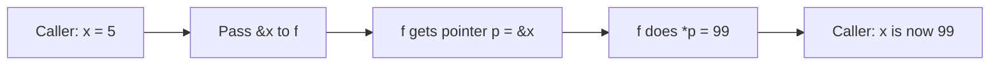

# Go Pointers Basics — Junior Level

## 1. Introduction

### What is it?
A **pointer** is a value that stores the **memory address** of another value. Instead of holding the data itself, a pointer says "the data is over there." Using a pointer, you can read or modify the original data — even from a different function.

### How to use it?
```go
x := 42        // x is an int
p := &x        // p is a pointer to x; type *int
fmt.Println(*p) // 42 — dereference to read
*p = 99        // dereference to write
fmt.Println(x) // 99 — x has been modified
```

Three symbols to know:
- `*T` — type "pointer to T"
- `&x` — take address of x
- `*p` — dereference pointer p

---

## 2. Prerequisites
- Variables and types
- Functions basics (2.6.1)
- Call by value (2.6.7)

---

## 3. Glossary

| Term | Definition |
|------|-----------|
| pointer | A value holding the address of another value |
| address | The memory location of a value |
| dereference | Access the value at a pointer's address (`*p`) |
| address-of | Get the address of a value (`&x`) |
| nil pointer | A pointer with no target; zero value of any pointer type |
| pointer type | `*T` for some type T |
| allocate | Reserve memory for a value (often with `new` or `&T{}`) |
| pointer arithmetic | Adding offsets to pointers — NOT allowed in Go |

---

## 4. Core Concepts

### 4.1 Declaring a Pointer
```go
var p *int        // p is a *int, currently nil
var q *string     // q is a *string, nil
```

The zero value of any pointer type is `nil`.

### 4.2 Taking an Address
```go
x := 5
p := &x
fmt.Println(p)    // 0xc000010078 (some address)
fmt.Println(*p)   // 5 — value at that address
```

### 4.3 Dereferencing
```go
*p = 99           // write to the value at p
fmt.Println(x)    // 99 — x was modified
```

### 4.4 Nil Pointer
```go
var p *int
if p == nil {
    fmt.Println("nil")
}
// *p // panic: nil pointer dereference
```

Always check for nil before dereferencing.

### 4.5 `new` Built-in
```go
p := new(int)     // *int pointing to a zero-initialized int
fmt.Println(*p)   // 0
*p = 42
```

`new(T)` is roughly equivalent to `&T{}` for zero-initialization.

### 4.6 No Pointer Arithmetic
```go
arr := [3]int{1, 2, 3}
p := &arr[0]
// p++          // compile error
// p + 1        // compile error
```

Unlike C, Go forbids pointer arithmetic. Use slices for indexed access.

### 4.7 Auto-Dereference for Field/Method Access
```go
type Point struct{ X, Y int }

p := &Point{X: 1, Y: 2}
fmt.Println(p.X)  // Go auto-dereferences: same as (*p).X
```

You don't need `(*p).X` (though it's also valid). Go inserts the dereference automatically.

---

## 5. Real-World Analogies

**A house address vs the house**: a pointer is like an address (e.g., "123 Main St"). The address is small and easy to copy. The house at that address is the actual data — large and immobile. Multiple addresses can refer to the same house.

**A library book number vs the book**: the catalog number (pointer) tells you where to find the book. You can copy the number, share it, lose it. The book itself is unique.

**A phone number vs the person**: a phone number lets you reach a person from anywhere. Many people can have your number — they all reach the same you.

---

## 6. Mental Models

```
Memory:
    address 0x100: 5     ← x lives here
    address 0x200: 0x100 ← p (a *int) holds the address of x

In Go syntax:
    x  : 5
    &x : 0x100   (address of x)
    *p : 5       (value at p's address)
    p  : 0x100   (the address itself)
```

Pointers are just typed memory addresses.

---

## 7. Pros & Cons

### Pros
- Allow functions to mutate caller's variables
- Avoid copying large structs (pass pointer instead of value)
- Enable shared state (multiple pointers to same data)
- Enable linked data structures (linked lists, trees)

### Cons
- Easy to forget nil checks → panics
- Aliasing (multiple pointers to same data) can cause subtle bugs
- Pointer indirection has small runtime cost (extra memory load)
- Sharing pointers across goroutines requires synchronization

---

## 8. Use Cases

1. Mutating a caller's variable (`func incr(p *int)`).
2. Passing large structs efficiently.
3. Returning a "newly created" object (`func newUser() *User`).
4. Optional values (nil indicates absence).
5. Linked data structures.
6. Method receivers when mutation is needed.

---

## 9. Code Examples

### Example 1 — Basic
```go
package main

import "fmt"

func main() {
    x := 42
    p := &x
    fmt.Println("x:", x, "p:", p, "*p:", *p)
    *p = 99
    fmt.Println("x:", x)
}
```

### Example 2 — Mutate via Pointer
```go
package main

import "fmt"

func double(p *int) {
    *p *= 2
}

func main() {
    n := 5
    double(&n)
    fmt.Println(n) // 10
}
```

### Example 3 — Nil Check
```go
package main

import "fmt"

func safeRead(p *int) int {
    if p == nil {
        return 0
    }
    return *p
}

func main() {
    fmt.Println(safeRead(nil)) // 0
    n := 42
    fmt.Println(safeRead(&n))  // 42
}
```

### Example 4 — `new` Allocation
```go
package main

import "fmt"

func main() {
    p := new(int)
    fmt.Println(*p) // 0
    *p = 100
    fmt.Println(*p) // 100
}
```

### Example 5 — Pointer to Struct
```go
package main

import "fmt"

type User struct {
    Name string
    Age  int
}

func birthday(u *User) {
    u.Age++
}

func main() {
    u := &User{Name: "Ada", Age: 30}
    birthday(u)
    fmt.Println(u.Age) // 31
}
```

### Example 6 — Returning a Pointer (Constructor Pattern)
```go
package main

import "fmt"

type Counter struct{ N int }

func newCounter() *Counter {
    return &Counter{N: 0}
}

func main() {
    c := newCounter()
    c.N++
    c.N++
    fmt.Println(c.N) // 2
}
```

### Example 7 — Two Pointers to Same Variable
```go
package main

import "fmt"

func main() {
    x := 5
    p1 := &x
    p2 := &x
    *p1 = 99
    fmt.Println(*p2) // 99 — same x
    fmt.Println(p1 == p2) // true
}
```

---

## 10. Coding Patterns

### Pattern 1 — Mutator Function
```go
func setName(u *User, name string) {
    u.Name = name
}
```

### Pattern 2 — Constructor Returning Pointer
```go
func New(args ...) *T {
    return &T{...}
}
```

### Pattern 3 — Optional Value (Nil)
```go
type Settings struct {
    Cache *CacheConfig // nil means "use default"
}
```

### Pattern 4 — Helper Returning *Bool
```go
func ptrTo[T any](v T) *T {
    return &v
}

cfg := Settings{
    Enabled: ptrTo(true), // for Optional[bool] semantics
}
```

---

## 11. Clean Code Guidelines

1. **Always check for nil** before dereferencing pointers from external sources.
2. **Use pointers for mutation** — don't pretend to mutate via value parameters.
3. **Document optional pointer fields** — what does nil mean?
4. **Use constructors** that return pointers consistently.
5. **Avoid pointer-to-pointer (`**T`)** unless necessary.

```go
// Good
func (u *User) Rename(name string) { u.Name = name }

// Bad — claims to mutate but can't
func (u User) Rename(name string) { u.Name = name } // operates on copy
```

---

## 12. Product Use / Feature Example

**A user manager with optional fields**:

```go
package main

import "fmt"

type Email struct{ Address string }

type User struct {
    Name  string
    Email *Email // optional: nil means "no email"
}

func describe(u *User) {
    fmt.Printf("Name: %s\n", u.Name)
    if u.Email != nil {
        fmt.Printf("Email: %s\n", u.Email.Address)
    } else {
        fmt.Println("Email: (none)")
    }
}

func main() {
    u1 := &User{Name: "Ada", Email: &Email{Address: "ada@example.com"}}
    u2 := &User{Name: "Bob"}
    describe(u1)
    describe(u2)
}
```

`*Email` allows nil to represent "absent". For required fields, use the value type directly.

---

## 13. Error Handling

When a function takes pointers, validate them:

```go
func process(u *User) error {
    if u == nil {
        return fmt.Errorf("nil user")
    }
    // use u
    return nil
}
```

For pointer return values, callers should check:
```go
u := lookup(id)
if u == nil {
    return fmt.Errorf("not found")
}
// use u
```

---

## 14. Security Considerations

1. **Nil checks at API boundaries** — caller-provided pointers may be nil.
2. **Be careful with shared pointers across goroutines** — synchronize access.
3. **Don't return pointers to internal mutable state** unless callers should be able to modify it.
4. **Defensive copy** when storing caller-provided pointers' targets.

```go
// Avoid: caller can mutate internal state
func (s *Service) Config() *Config { return s.config }

// Better: return a copy
func (s *Service) Config() Config { return *s.config }
```

---

## 15. Performance Tips

1. **Pointers are 8 bytes** on 64-bit systems — passing them is essentially free.
2. **Pointer indirection** has a small cost (~1-2 cycles) per dereference.
3. **Pointers force heap allocation** when they escape — stack is faster.
4. **For small types, value pass is faster** than pointer pass.
5. **For large types, pointer pass avoids the copy**.

---

## 16. Metrics & Analytics

```go
type Metric struct {
    Name string
    Value float64
}

func record(m *Metric) {
    if m == nil { return }
    fmt.Printf("[%s] %f\n", m.Name, m.Value)
}
```

---

## 17. Best Practices

1. Use pointers for mutation; values for reading.
2. For large types, prefer pointer parameters.
3. Always nil-check at boundaries.
4. Use `&T{...}` to allocate and initialize together.
5. Use `new(T)` for zero-initialized.
6. Avoid `**T` unless necessary.
7. Document what nil means for optional pointer fields.

---

## 18. Edge Cases & Pitfalls

### Pitfall 1 — Nil Dereference Panic
```go
var p *int
fmt.Println(*p) // panic: runtime error: invalid memory address
```

### Pitfall 2 — Pointer to Loop Variable (Pre 1.22)
```go
var ptrs []*int
for _, x := range []int{1, 2, 3} {
    ptrs = append(ptrs, &x) // pre-1.22: all same pointer!
}
```
Fix: shadow `x := x` or upgrade to Go 1.22+.

### Pitfall 3 — Address of Map Value
```go
m := map[string]int{"a": 1}
// p := &m["a"] // compile error
```
Map values are not addressable.

### Pitfall 4 — Pointer Arithmetic
```go
p := &arr[0]
// p++ // compile error
```
Use slices and indices instead.

### Pitfall 5 — Returning Pointer to Local
```go
func f() *int {
    n := 5
    return &n // OK in Go (escape analysis), but document lifetime
}
```

---

## 19. Common Mistakes

| Mistake | Fix |
|---------|-----|
| Forgetting `&` to take address | Add `&` |
| Forgetting `*` to dereference | Add `*` |
| Dereferencing nil | Check for nil first |
| Pointer arithmetic | Use slices |
| Modifying parameter expecting caller change | Use pointer |

---

## 20. Common Misconceptions

**Misconception 1**: "Pointers are always faster than values."
**Truth**: For small types, value pass is faster (registers, no indirection). For large types, pointers win.

**Misconception 2**: "I should use pointers everywhere to be safe."
**Truth**: Pointers add indirection complexity and nil-check requirements. Use them only when needed.

**Misconception 3**: "Pointers to local variables are dangerous (like C)."
**Truth**: Go's escape analysis automatically heap-allocates. Safe.

**Misconception 4**: "`new(T)` is different from `&T{}`."
**Truth**: They're equivalent for zero-initialization. `&T{}` is more flexible (allows specifying field values).

**Misconception 5**: "Comparing pointers compares the values they point to."
**Truth**: It compares addresses. Use `*p1 == *p2` to compare pointed-to values.

---

## 21. Tricky Points

1. `*` has two meanings: type (`*T`) vs operator (`*p`).
2. `&` only works on addressable values.
3. Auto-dereference works for `.field` and method calls but not `*p`.
4. Pointer methods can be called on values: `t.Method()` becomes `(&t).Method()` automatically (if t is addressable).
5. Pointers work with generics: `func f[T any](p *T)`.

---

## 22. Test

```go
package main

import "testing"

func incr(p *int) {
    *p++
}

func TestIncr(t *testing.T) {
    n := 0
    incr(&n)
    if n != 1 {
        t.Errorf("got %d, want 1", n)
    }
}

func TestNilHandling(t *testing.T) {
    defer func() {
        if r := recover(); r == nil {
            t.Error("expected panic on nil dereference")
        }
    }()
    var p *int
    _ = *p // should panic
}
```

---

## 23. Tricky Questions

**Q1**: What does this print?
```go
x := 5
p := &x
*p = 99
fmt.Println(x)
```
**A**: `99`. Modification through pointer affects the original.

**Q2**: Will this compile?
```go
m := map[string]int{"a": 1}
p := &m["a"]
```
**A**: **No**. Map values are not addressable.

**Q3**: What does this print?
```go
p1 := new(int)
p2 := new(int)
*p1 = 5
*p2 = 5
fmt.Println(p1 == p2)
fmt.Println(*p1 == *p2)
```
**A**: `false true`. Different addresses, same values.

---

## 24. Cheat Sheet

```go
// Type
var p *int

// Take address
p = &x

// Dereference
v := *p
*p = 42

// Nil check
if p == nil { ... }

// Allocate
p := new(int)        // zero-init
p := &MyStruct{...}  // initialized

// Auto-deref
p := &User{}
p.Name = "Ada"  // same as (*p).Name

// Compare
p1 == p2  // address comparison
```

---

## 25. Self-Assessment Checklist

- [ ] I can declare a pointer variable
- [ ] I can take an address with `&`
- [ ] I can dereference with `*`
- [ ] I check for nil before dereferencing
- [ ] I use `new(T)` and `&T{}`
- [ ] I know Go has no pointer arithmetic
- [ ] I understand auto-dereference for field/method access
- [ ] I use pointers for mutation in functions

---

## 26. Summary

A pointer is a value holding the address of another value. Use `*T` for the type, `&x` to take an address, `*p` to dereference. The zero value is nil; dereferencing nil panics. Go has no pointer arithmetic. Use pointers to mutate caller variables, share data, or avoid copying large structs. The compiler handles allocation automatically — pointers to locals that escape are heap-allocated; otherwise they may stay on the stack.

---

## 27. What You Can Build

- Mutator functions
- Constructors returning pointers
- Optional fields (nil = absent)
- Linked data structures (lists, trees)
- Object pools and caches
- Method receivers with pointer types

---

## 28. Further Reading

- [Go Spec — Pointer types](https://go.dev/ref/spec#Pointer_types)
- [Effective Go — Pointers vs values](https://go.dev/doc/effective_go#pointers_vs_values)
- [Go Tour — Pointers](https://go.dev/tour/moretypes/1)
- [Go Blog — Allocation efficiency in high-performance Go services](https://segment.com/blog/allocation-efficiency-in-high-performance-go-services/)

---

## 29. Related Topics

- 2.6.7 Call by Value
- 2.7.2 Pointers with Structs
- 2.7.3 With Maps & Slices
- 2.7.4 Memory Management
- Chapter 3 Methods (pointer receivers)

---

## 30. Diagrams & Visual Aids

### Pointer mechanics

```
Variable x:                Pointer p:
┌─────────┐                ┌──────────┐
│ value 5 │ ← addr 0x100   │ 0x100    │
└─────────┘                └──────────┘
                              ↑
                            this is what p stores
                            
*p = read/write the value at p's address (= 5)
&x = the address of x (= 0x100)
```

### Function mutation through pointer


