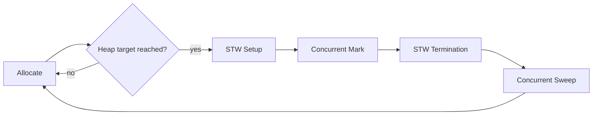

# Go Garbage Collection — Junior Level

## 1. Introduction

### What is it?
The **Garbage Collector (GC)** is the part of Go's runtime that automatically frees memory you're no longer using. You allocate (`new`, `make`, `&T{}`); the GC reclaims unreferenced values later. No `free` calls needed.

```go
p := &Point{X: 1, Y: 2}
// ... use p ...
p = nil
// The Point becomes unreferenced. GC will reclaim it on a future cycle.
```

### How does it work?
- Periodically scans the heap.
- Identifies objects still reachable (via pointers from goroutine stacks and globals).
- Frees the rest.

You don't trigger it; the runtime decides based on allocation rate.

---

## 2. Prerequisites
- Pointers (2.7.1)
- Memory management basics (2.7.4)

---

## 3. Glossary

| Term | Definition |
|------|-----------|
| GC | Garbage Collector |
| Reachable | Has a path of pointers from a root (stack, global) |
| Unreachable | No reference can find it; eligible for collection |
| Mark | Phase that identifies reachable objects |
| Sweep | Phase that frees unreachable objects |
| STW | "Stop the world" — brief pause where all goroutines halt |
| Concurrent | Most GC work runs alongside user code |
| GOGC | Env var controlling GC frequency |
| Pause time | How long the GC pauses program execution |

---

## 4. Core Concepts

### 4.1 Automatic Memory Reclamation
You allocate; the GC frees:
```go
func work() {
    big := make([]byte, 1<<20) // 1 MB
    use(big)
    // big goes out of scope; eventually GC reclaims
}
```

No explicit `free` needed.

### 4.2 The GC Runs Periodically
The runtime triggers GC based on allocation rate. Default: when heap doubles since last GC (`GOGC=100`).

### 4.3 Concurrent
Most of the work happens WITHOUT pausing your program. Brief STW pauses (<1 ms typically) bookend the cycle.

### 4.4 You Don't Need to Manage Memory Manually
Unlike C/C++, you don't track ownership or call `free`. The GC handles it.

### 4.5 Tuning Knobs
- `GOGC`: how aggressive (default 100).
- `GOMEMLIMIT` (Go 1.19+): soft memory cap.
- `runtime.GC()`: force a cycle (rarely needed).

---

## 5. Real-World Analogies

**A self-emptying recycling bin**: throw items in (allocate); the bin auto-empties when it's full enough (GC triggers).

**A library with auto-shelving**: when you stop touching a book, the library returns it to its shelf (collection).

---

## 6. Mental Models

```
Roots (start points):
  - Goroutine stacks
  - Global variables

Mark phase:
  Roots → reachable objects → their pointers → more reachable objects
  (everything reached = "alive"; everything else = garbage)

Sweep phase:
  Free all unreached objects.
```

---

## 7. Pros & Cons

### Pros
- No use-after-free
- No double-free
- No manual memory tracking
- Concurrent → minimal pauses

### Cons
- CPU overhead (~5-10% in typical workloads)
- Brief pauses (microseconds to milliseconds)
- Less control than manual memory management

---

## 8. Use Cases

You don't "use" the GC — it just runs. But you can:
- Tune GOGC for your workload.
- Set GOMEMLIMIT in containers.
- Profile to identify GC-heavy code.

---

## 9. Code Examples

### Example 1 — Allocation Triggers GC
```go
for i := 0; i < 100; i++ {
    _ = make([]byte, 1<<20) // 1 MB each
}
// At some point, GC will run to reclaim unreferenced bytes
```

### Example 2 — Force GC (Rarely Needed)
```go
import "runtime"

runtime.GC() // force a cycle now
```

### Example 3 — Inspect GC Stats
```go
import "runtime"

var ms runtime.MemStats
runtime.ReadMemStats(&ms)
fmt.Printf("GC count: %d\n", ms.NumGC)
fmt.Printf("Heap: %d KB\n", ms.HeapAlloc/1024)
```

### Example 4 — Set GOGC
```bash
GOGC=200 ./prog  # less aggressive (more memory, less CPU)
GOGC=50 ./prog   # more aggressive (less memory, more CPU)
```

### Example 5 — Set Memory Limit (Go 1.19+)
```go
import "runtime/debug"

debug.SetMemoryLimit(int64(1 * 1024 * 1024 * 1024)) // 1 GiB
```

### Example 6 — GC Trace
```bash
GODEBUG=gctrace=1 ./prog
# Output per cycle:
# gc 1 @0.052s 0%: 0.018+1.4+0.018 ms clock, ...
```

### Example 7 — Memory Profile
```bash
go test -memprofile=mem.out
go tool pprof mem.out
```

Identify allocation hot spots.

---

## 10. Coding Patterns

### Pattern 1 — Trust GC for Normal Code
```go
result := process(input)
return result // don't worry; GC handles cleanup
```

### Pattern 2 — Pool for Hot Allocations
```go
var pool = sync.Pool{New: func() any { return new(Buffer) }}
```

### Pattern 3 — Pre-Allocate for Bulk
```go
make([]T, 0, expectedSize)
```

### Pattern 4 — Set Memory Limit in Container
```go
debug.SetMemoryLimit(0.9 * containerLimit)
```

---

## 11. Clean Code Guidelines

1. Don't manually trigger GC.
2. Don't fight the GC — write idiomatic code first.
3. Profile before optimizing.
4. Tune GOGC based on workload (CPU vs memory trade-off).
5. Set GOMEMLIMIT in containers.

---

## 12. Product Use / Feature Example

**A long-running service with proper monitoring**:

```go
import (
    "runtime"
    "runtime/debug"
    "time"
)

func main() {
    // Set memory limit (95% of container)
    debug.SetMemoryLimit(int64(0.95 * float64(containerMemoryLimit())))
    
    // Periodic stats reporting
    go func() {
        for {
            var ms runtime.MemStats
            runtime.ReadMemStats(&ms)
            metrics.Gauge("heap_mb", ms.HeapAlloc/(1024*1024))
            metrics.Gauge("gc_pause_us", ms.PauseNs[(ms.NumGC+255)%256]/1000)
            metrics.Counter("gc_count", ms.NumGC)
            time.Sleep(30 * time.Second)
        }
    }()
    
    // Service runs
    serve()
}
```

Track heap growth and pause times to detect issues.

---

## 13. Error Handling

Memory exhaustion:
- "out of memory": runtime panic; fatal. Set GOMEMLIMIT to detect earlier.
- "stack overflow": goroutine exceeded 1 GiB. Avoid deep recursion.

These aren't catchable with normal error handling.

---

## 14. Security Considerations

1. **Sensitive data in memory** stays until GC reclaims it. Wipe explicitly:
   ```go
   for i := range secret { secret[i] = 0 }
   ```
2. **`sync.Pool` with crypto material** must be zeroed before Put.
3. **Memory dumps** may contain secrets — handle production cores carefully.

---

## 15. Performance Tips

1. Trust GC for normal code.
2. Profile with `pprof -alloc_space`.
3. Use `sync.Pool` when measured.
4. Pre-allocate sizes.
5. Reduce pointer density.
6. Tune GOGC for CPU/memory trade-off.

---

## 16. Metrics & Analytics

Track in production:
- `HeapAlloc`: current heap size.
- `NumGC`: total GC cycles.
- `PauseNs`: recent pause durations.
- `Sys`: total memory the runtime acquired from OS.

---

## 17. Best Practices

1. Don't manually GC.
2. Set GOMEMLIMIT in containers.
3. Profile before optimizing.
4. Use sync.Pool for hot paths.
5. Cancel long-running goroutines.
6. Watch sub-slice memory pinning.

---

## 18. Edge Cases & Pitfalls

### Pitfall 1 — `runtime.GC()` Doesn't Reduce RSS
GC frees heap memory but the OS may keep pages allocated to the process. Use `debug.FreeOSMemory()` for explicit return.

### Pitfall 2 — Goroutine Leaks
Long-running goroutines pin memory forever.

### Pitfall 3 — Map Doesn't Shrink
Bucket array stays at peak size after deletes. Recreate to reclaim.

### Pitfall 4 — Sub-Slice Pinning
`small := big[:10]` keeps the entire `big` array alive.

### Pitfall 5 — `sync.Pool` Drained at GC
Don't rely on pool for state retention.

---

## 19. Common Mistakes

| Mistake | Fix |
|---------|-----|
| Manual `runtime.GC()` calls | Trust runtime |
| Sub-slice pins big array | Copy out |
| Goroutine leak | Cancel via context |
| Ignoring GOMEMLIMIT in container | Set it |

---

## 20. Common Misconceptions

**1**: "GC pauses are seconds long."
**Truth**: Modern Go GC pauses are typically <1 ms.

**2**: "Calling `runtime.GC()` is good practice."
**Truth**: Almost never needed; the runtime decides better.

**3**: "GC is slow."
**Truth**: ~5-10% CPU overhead in typical workloads. Often negligible.

**4**: "Disabling GC improves performance."
**Truth**: Eventually OOM. Bad idea except for short benchmarks.

---

## 21. Tricky Points

1. GC is concurrent: most work runs alongside user code.
2. STW phases are brief (<1 ms typical).
3. GC frequency depends on allocation rate.
4. Pointer density matters more than total heap size.
5. `GOMEMLIMIT` (Go 1.19+) helps in containers.

---

## 22. Test

```go
import "runtime"
import "testing"

func TestGCRuns(t *testing.T) {
    var ms1, ms2 runtime.MemStats
    runtime.ReadMemStats(&ms1)
    
    // Allocate enough to trigger GC
    for i := 0; i < 1000; i++ {
        _ = make([]byte, 1<<20)
    }
    
    runtime.ReadMemStats(&ms2)
    if ms2.NumGC == ms1.NumGC {
        t.Log("no GC ran (unusual)")
    }
}
```

---

## 23. Tricky Questions

**Q1**: How often does Go's GC run?
**A**: Based on allocation rate. Default `GOGC=100` triggers when heap doubles.

**Q2**: What's the typical GC pause?
**A**: <1 ms for STW phases in modern Go.

**Q3**: Should I call `runtime.GC()`?
**A**: Almost never. Trust the runtime.

---

## 24. Cheat Sheet

```go
// Stats
var ms runtime.MemStats
runtime.ReadMemStats(&ms)

// Tune
debug.SetGCPercent(200)
debug.SetMemoryLimit(1<<30)

// Trace
GODEBUG=gctrace=1 ./prog

// Force (rarely)
runtime.GC()

// Return pages to OS
debug.FreeOSMemory()
```

---

## 25. Self-Assessment Checklist

- [ ] I understand the GC is automatic
- [ ] I know GOGC controls aggressiveness
- [ ] I use GOMEMLIMIT in containers
- [ ] I profile with pprof
- [ ] I monitor MemStats
- [ ] I trust the GC for normal code

---

## 26. Summary

Go has a concurrent garbage collector. It runs automatically based on allocation rate, with brief (<1 ms) pauses. Tune via `GOGC` and `GOMEMLIMIT`. Profile with pprof. Trust the runtime; don't fight the GC.

---

## 27. What You Can Build

- Long-running services without manual memory management
- High-throughput systems with predictable performance
- Containerized apps with bounded memory

---

## 28. Further Reading

- [Go GC Guide](https://go.dev/doc/gc-guide)
- [pprof](https://go.dev/blog/pprof)
- [Memory Limit (Go 1.19+)](https://pkg.go.dev/runtime/debug#SetMemoryLimit)

---

## 29. Related Topics

- 2.7.4 Memory Management
- 2.7.1, 2.7.2, 2.7.3 Pointers

---

## 30. Diagrams & Visual Aids

### GC overview


