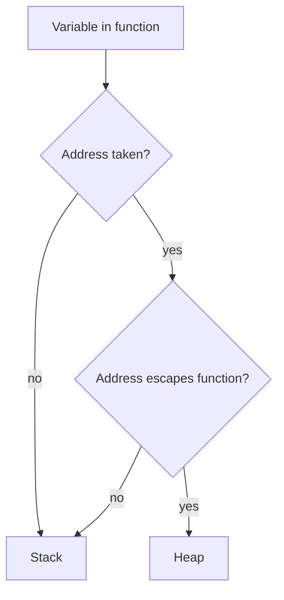

# Go Memory Management — Junior Level

## 1. Introduction

### What is it?
Go manages memory automatically: you don't `malloc` or `free`. The runtime allocates memory when you create a value (`new`, `make`, `&T{}`) and reclaims it via the **garbage collector** when nothing references it anymore.

```go
p := &Point{X: 1, Y: 2}  // Go allocates a Point
// ... use p ...
// When p goes out of scope and nothing references the Point,
// the GC reclaims its memory.
```

### How to use it?
- **`new(T)`**: zero-initialized value, returns `*T`.
- **`make(...)`**: for slices, maps, channels.
- **`&T{...}`**: literal + address, common idiom.

You usually don't think about WHERE memory lives; the runtime decides.

---

## 2. Prerequisites
- Pointers basics (2.7.1)
- Functions, slices, maps

---

## 3. Glossary

| Term | Definition |
|------|-----------|
| Stack | Per-goroutine memory, freed at function return |
| Heap | Shared memory, freed by GC |
| Garbage Collector (GC) | Runtime that reclaims unreferenced memory |
| Escape analysis | Compile-time decision: stack or heap |
| Allocation | Reserving memory for a value |
| Reference | A pointer or other indirect access keeping a value alive |
| Unreachable | A value with no references; eligible for GC |

---

## 4. Core Concepts

### 4.1 Stack vs Heap
- **Stack**: each goroutine has its own. Variables here die at function return. Fast.
- **Heap**: GC-managed. Variables live until no references remain. Slower allocation, requires GC.

The compiler decides per variable. You don't control directly, but you influence (e.g., returning `&local` forces heap).

### 4.2 Allocation Built-ins
```go
// new(T) — zero-initialized, returns *T
p := new(int)
*p = 42

// make — for slices, maps, channels
s := make([]int, 5)         // len=5
m := make(map[string]int)
ch := make(chan int, 10)

// &T{} — composite literal address
u := &User{Name: "Ada"}
```

### 4.3 Escape Analysis
The compiler decides where each variable lives:
```go
func stays() {
    n := 5
    _ = &n  // pointer doesn't escape; n on stack
}

func escapes() *int {
    n := 5
    return &n  // n escapes; allocated on heap
}
```

Verify with `go build -gcflags="-m"`.

### 4.4 Garbage Collection
The GC periodically scans the heap, finds reachable objects (from roots: stacks, globals), and frees the rest.

You don't trigger GC manually (usually); it runs automatically based on allocation rate.

### 4.5 Memory Lifetime
A value is alive as long as something references it (directly or transitively). When all references are dropped, it becomes garbage.

```go
func makeUser() *User {
    return &User{Name: "Ada"}  // User on heap; alive while caller holds ptr
}

u := makeUser()
// u is alive
u = nil
// User is now garbage; GC will reclaim
```

---

## 5. Real-World Analogies

**A self-cleaning room**: in C, you must put away every toy yourself (`free`). In Go, the room cleans itself when you stop using a toy.

**A library with auto-returns**: you check out books (allocate); when you stop touching a book, the library auto-returns it (GC).

---

## 6. Mental Models

```
Stack (per goroutine):
  [function frame 1: locals]
  [function frame 2: locals]
  ...
  ↓ grows downward; freed at return

Heap (shared, GC'd):
  [object 1]
  [object 2]
  ...
  ↑ grows; objects reclaimed when unreachable

Roots (entry points for GC scanning):
  - Goroutine stacks
  - Global variables
```

---

## 7. Pros & Cons

### Pros
- No manual memory management
- No use-after-free bugs
- No double-free
- Concurrent GC minimizes pauses

### Cons
- GC overhead (CPU, occasional pauses)
- Heap allocation slower than stack
- Less control than manual allocation
- Need to understand escape analysis for performance

---

## 8. Use Cases

1. Almost all Go programs (you don't usually opt out of GC).
2. `new`, `make`, `&T{}` for normal allocation.
3. `sync.Pool` for high-throughput allocation reuse.
4. Profile with pprof when GC pressure is high.

---

## 9. Code Examples

### Example 1 — Stack-Allocated Local
```go
func foo() {
    x := 5
    _ = x
    // x is on the stack; freed at return
}
```

### Example 2 — Heap-Allocated via Escape
```go
func makePtr() *int {
    n := 5
    return &n  // n escapes to heap
}
```

### Example 3 — `new`
```go
p := new(int)
fmt.Println(*p) // 0
*p = 42
```

### Example 4 — `make` for Slice
```go
s := make([]int, 5, 10)  // len=5, cap=10; backing array allocated
```

### Example 5 — `&T{...}` Constructor
```go
u := &User{Name: "Ada", Age: 30}  // User on heap (escapes)
```

### Example 6 — Verify Escape
```go
// $ go build -gcflags="-m" main.go
// ./main.go:5:6: can inline foo
// ./main.go:6:9: &n escapes to heap
// ./main.go:6:9: moved to heap: n
```

### Example 7 — Reduce Allocations
```go
// Bad: allocates per call
for i := 0; i < 1000; i++ {
    p := &Point{X: i, Y: i}
    process(p)
}

// Better: reuse if possible
var p Point
for i := 0; i < 1000; i++ {
    p = Point{X: i, Y: i}
    process(&p)
}
```

---

## 10. Coding Patterns

### Pattern 1 — Constructor
```go
func New() *T { return &T{} }
```

### Pattern 2 — Pre-Allocate Slice
```go
s := make([]T, 0, expectedSize)
```

### Pattern 3 — Pool Reuse
```go
var pool = sync.Pool{New: func() any { return new(Buffer) }}

b := pool.Get().(*Buffer)
defer pool.Put(b)
```

### Pattern 4 — Avoid Pointer Chains
Reduce pointer density to lower GC scan time.

---

## 11. Clean Code Guidelines

1. **Don't worry about allocation in non-hot code.** Profile first.
2. **For hot paths, verify escape behavior** with `-gcflags="-m"`.
3. **Use `sync.Pool` only when measured allocation cost is high**.
4. **Pre-allocate slice/map sizes** when known.
5. **Reduce pointer fields in hot data structures**.

---

## 12. Product Use / Feature Example

**A request handler with allocation awareness**:

```go
func handle(req *Request) *Response {
    // Per-request allocation: response
    resp := &Response{
        Status: 200,
        Body:   process(req.Body),
    }
    return resp
}
```

If this is called 10k req/sec, that's 10k Response allocations/sec — typically fine. If profile shows GC pressure, use `sync.Pool`.

---

## 13. Error Handling

GC errors are rare. The runtime may crash with:
- "out of memory" if heap exhausted (rare).
- "stack overflow" if a goroutine's stack exceeds limit.

Both are abnormal; design for recovery via supervisors, not error returns.

---

## 14. Security Considerations

1. **Sensitive data** stays in memory until GC reclaims it. Wipe after use:
   ```go
   for i := range secret { secret[i] = 0 }
   ```
2. **Cryptographic memory** should not be reused via `sync.Pool` without zeroing.

---

## 15. Performance Tips

1. **Stack > heap**: avoid escape when possible.
2. **Pre-allocate** slice/map capacity.
3. **Use `sync.Pool`** for high-throughput allocations.
4. **Reduce pointer density**.
5. **Profile**: `go test -bench -benchmem`, `pprof -alloc_space`.

---

## 16. Metrics & Analytics

```go
import "runtime"

var ms runtime.MemStats
runtime.ReadMemStats(&ms)
fmt.Printf("Heap: %d MB; GC count: %d\n", ms.HeapAlloc/(1024*1024), ms.NumGC)
```

Useful for monitoring memory in production.

---

## 17. Best Practices

1. Trust the GC for normal code.
2. Profile before optimizing.
3. Use `sync.Pool` for hot allocations.
4. Pre-allocate sizes.
5. Verify escape with `-gcflags="-m"`.

---

## 18. Edge Cases & Pitfalls

### Pitfall 1 — Sub-Slice Pinning
```go
big := make([]byte, 1<<20)
small := big[:10]
// small holds 1 MB alive
```
Fix: copy out.

### Pitfall 2 — Large Stack via Recursion
Goroutine stack max is 1 GiB. Deep recursion may overflow.

### Pitfall 3 — Forgetting GC Doesn't Run on Demand
GC runs based on allocation rate; don't rely on `runtime.GC()` for prompt cleanup in normal code.

### Pitfall 4 — Pool Doesn't Guarantee Retention
`sync.Pool` may discard at any GC. Don't rely on pool to hold state.

### Pitfall 5 — Pointer Density Causes Long GC Pauses
1M `*T` is 1M GC roots. For high-throughput, prefer values.

---

## 19. Common Mistakes

| Mistake | Fix |
|---------|-----|
| Manually triggering GC | Trust the runtime |
| Sub-slice pins big array | Copy out |
| `sync.Pool` for state retention | Pool is opportunistic |
| Excessive pointer fields | Use values when possible |

---

## 20. Common Misconceptions

**1**: "Go has no memory management."
**Truth**: Go has automatic memory management — the GC.

**2**: "GC pauses are always bad."
**Truth**: Modern Go GC pauses are typically <1ms; rarely a problem.

**3**: "I should call `runtime.GC()` to free memory."
**Truth**: Almost never needed; the runtime decides.

**4**: "Stack allocation is always faster."
**Truth**: For small values, yes. Heap is fine for normal code.

---

## 21. Tricky Points

1. Escape analysis is compile-time; can't change at runtime.
2. `make` and `new` allocate; `&T{}` may or may not (depends on escape).
3. `sync.Pool` is opportunistic — can be drained any time.
4. Goroutine stacks grow but don't shrink (until goroutine exits).
5. GC scans pointer fields as roots; reduce them for performance.

---

## 22. Test

```go
import "runtime"
import "testing"

func TestAllocation(t *testing.T) {
    var ms1, ms2 runtime.MemStats
    runtime.ReadMemStats(&ms1)
    
    for i := 0; i < 1000; i++ {
        _ = new(int)
    }
    
    runtime.ReadMemStats(&ms2)
    if ms2.NumGC == ms1.NumGC {
        t.Log("no GC ran")
    }
}
```

---

## 23. Tricky Questions

**Q1**: Does this allocate?
```go
func f() int {
    n := 5
    return n
}
```
**A**: No — `n` stays on stack; only the value is returned (in a register).

**Q2**: Does this allocate?
```go
func f() *int {
    n := 5
    return &n
}
```
**A**: Yes — `n` escapes to the heap.

---

## 24. Cheat Sheet

```go
// Allocate
new(T)              // *T, zero-init
make([]T, n)        // slice
make(map[K]V, n)    // map
make(chan T, n)     // channel
&T{...}             // composite literal

// Verify escape
go build -gcflags="-m"

// Pool reuse
var pool = sync.Pool{New: func() any { return new(T) }}
t := pool.Get().(*T); defer pool.Put(t)

// Stats
runtime.ReadMemStats(&ms)
```

---

## 25. Self-Assessment Checklist

- [ ] I understand stack vs heap
- [ ] I use new, make, &T{} correctly
- [ ] I know escape analysis basics
- [ ] I trust the GC
- [ ] I profile with pprof
- [ ] I use sync.Pool when measured

---

## 26. Summary

Go manages memory automatically. Stack: fast, function-scoped. Heap: GC-managed. Escape analysis decides. Use `new`, `make`, `&T{...}`. Trust the GC for normal code; profile and use `sync.Pool` for hot paths.

---

## 27. What You Can Build

- Servers handling millions of requests
- Long-running services
- High-throughput pipelines
- Memory-bound applications

---

## 28. Further Reading

- [Go GC Guide](https://go.dev/doc/gc-guide)
- [Memory Model](https://go.dev/ref/mem)
- [pprof](https://go.dev/blog/pprof)

---

## 29. Related Topics

- 2.7.1, 2.7.2, 2.7.3
- 2.7.4.1 Garbage Collection (next)
- Profiling chapter

---

## 30. Diagrams & Visual Aids

### Stack vs Heap

```
Goroutine 1 stack:        Goroutine 2 stack:
  [main frame]              [worker frame]
  [foo frame]               ...
  [bar frame]
  ↓ freed at return

Heap (shared):
  [allocated objects]       ← GC scans, frees unreachable
```

### Escape decision


