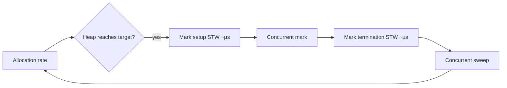

# Go Memory Management — Middle Level

## 1. Introduction

At the middle level you understand the allocation pipeline, escape analysis, the GC's basic operation, and patterns to reduce memory pressure (sync.Pool, value-vs-pointer trade-offs, pre-allocation).

---

## 2. Prerequisites
- Junior-level memory management
- Pointers (2.7.1-2.7.3)
- Slices, maps internals

---

## 3. Glossary

| Term | Definition |
|------|-----------|
| Allocation rate | Bytes/sec allocated on heap |
| GC frequency | How often GC runs (proportional to allocation rate) |
| Heap target | Goal heap size; GC tries to keep heap close to it |
| GOGC | Env var controlling GC aggressiveness (default 100) |
| Stack growth | Goroutine stack expanding when needed |
| Pacer | GC's algorithm for deciding when to run |

---

## 4. Core Concepts

### 4.1 Allocation Pipeline

For `&T{...}`:
1. Compiler determines size from T's layout.
2. Calls `runtime.newobject(typeT)`.
3. The runtime allocator finds free space (size class for small, page allocator for large).
4. Returns a pointer.

### 4.2 Size Classes
- Tiny (<16 B): tiny allocator (per-P, fast).
- Small (≤32 KB): size-classed allocator with ~70 size classes.
- Large (>32 KB): direct page allocation.

### 4.3 GC Trigger
The GC starts a new cycle when allocated heap reaches `heapSize × (1 + GOGC/100)`.

Default GOGC=100: GC runs when heap doubles.

### 4.4 GC Phases
1. **Mark setup** (STW): brief pause to start.
2. **Concurrent mark**: scans roots and follows pointers.
3. **Mark termination** (STW): finalize marking.
4. **Concurrent sweep**: reclaim unreachable memory.

Modern Go: STW phases typically <1 ms.

### 4.5 Write Barriers
During concurrent marking, pointer mutations need write barriers to maintain GC correctness:
```go
heapObj.field = newPtr // compiler emits write barrier call
```

Cost: ~2 cycles when GC inactive.

### 4.6 Stack Growth
Each goroutine starts ~2 KiB. The runtime grows by copying to a larger stack when prologue checks fail. All pointers in the new stack are adjusted.

---

## 5. Real-World Analogies

**A library with a janitor on patrol**: GC is the janitor; while you read books (allocate), the janitor periodically returns books no one's reading. You don't need to put books back yourself.

---

## 6. Mental Models

### Model 1 — Allocation as Negotiation

```
You: "I need 64 bytes."
Allocator: "Here's a slot from size class 64."
GC: (later) "Anyone using this slot? No → reclaim."
```

### Model 2 — GC Cost = Allocation × Pointer Density × Frequency

To reduce GC overhead:
- Reduce allocation rate (`sync.Pool`, pre-allocate).
- Reduce pointer density (values vs pointers).
- Increase heap target (raise GOGC).

---

## 7. Pros & Cons

### Pros
- Automatic, safe.
- Low pause times (<1ms typically).
- No manual lifetime management.

### Cons
- CPU overhead (~5-10% in typical workloads).
- Brief pauses.
- Can be a bottleneck in extreme cases.

---

## 8. Use Cases

1. Normal Go applications — trust the GC.
2. High-throughput services — profile + optimize.
3. Latency-sensitive code — careful pointer/allocation design.
4. Long-running daemons — monitor heap growth.

---

## 9. Code Examples

### Example 1 — `sync.Pool` for Allocation Reduction
```go
import "sync"

var bufPool = sync.Pool{
    New: func() any { return make([]byte, 4096) },
}

func work() {
    buf := bufPool.Get().([]byte)
    defer bufPool.Put(buf)
    // use buf
}
```

### Example 2 — Pre-Allocate
```go
items := make([]Item, 0, 1000)
for i := 0; i < 1000; i++ {
    items = append(items, Item{...})
}
```

### Example 3 — Reduce Pointer Density
```go
// Bad: each *Item is GC root
items := []*Item{...}

// Good: contiguous values
items := []Item{...}
```

### Example 4 — Tune GOGC
```bash
GOGC=200 ./myprog  # GC less aggressive (more memory, less CPU)
GOGC=50  ./myprog  # GC more aggressive (less memory, more CPU)
GOGC=off ./myprog  # disable (DANGEROUS, only for benchmarks)
```

### Example 5 — Monitor Memory
```go
import "runtime"

var ms runtime.MemStats
runtime.ReadMemStats(&ms)
fmt.Printf("HeapAlloc=%d, NumGC=%d\n", ms.HeapAlloc, ms.NumGC)
```

### Example 6 — `runtime/debug.SetGCPercent`
```go
import "runtime/debug"

debug.SetGCPercent(200) // equivalent to GOGC=200
```

### Example 7 — Memory Soft Limit
```go
debug.SetMemoryLimit(1 << 30) // 1 GiB soft limit
```

GC runs more aggressively as the limit approaches.

---

## 10. Coding Patterns

### Pattern 1 — Pool
```go
var pool = sync.Pool{New: func() any { return new(T) }}
```

### Pattern 2 — Pre-Allocate
```go
make([]T, 0, n)
make(map[K]V, n)
```

### Pattern 3 — Defensive Copy
```go
out := append([]T(nil), in...)
```

### Pattern 4 — Sub-Slice Copy to Release Backing
```go
out := make([]byte, n)
copy(out, big[:n])
big = nil // freeable
```

### Pattern 5 — Atomic Swap for Snapshots
```go
atomic.Pointer[Config].Store(newCfg)
```

---

## 11. Clean Code Guidelines

1. Trust the GC for normal code.
2. Profile before optimizing.
3. Use `sync.Pool` when measured.
4. Pre-allocate sizes when known.
5. Watch sub-slice memory pinning.
6. Reduce pointer density in hot data structures.

---

## 12. Product Use / Feature Example

**A connection-pool with allocation awareness**:

```go
type Pool struct {
    mu    sync.Mutex
    conns []*Conn
}

var pool = &Pool{conns: make([]*Conn, 0, 100)}

func get() *Conn {
    pool.mu.Lock()
    defer pool.mu.Unlock()
    if len(pool.conns) > 0 {
        c := pool.conns[len(pool.conns)-1]
        pool.conns = pool.conns[:len(pool.conns)-1]
        return c
    }
    return newConn()
}

func put(c *Conn) {
    pool.mu.Lock()
    defer pool.mu.Unlock()
    pool.conns = append(pool.conns, c)
}
```

---

## 13. Error Handling

Memory exhaustion:
- "out of memory": runtime panic; fatal.
- "stack overflow": goroutine exceeded 1 GiB stack; fatal.

These are operational issues, not error-return cases.

---

## 14. Security Considerations

1. **Wipe sensitive data** after use (don't rely on GC).
2. **Avoid `sync.Pool` for crypto material** without zeroing.
3. **Memory dumps** may contain secrets — handle production cores carefully.

---

## 15. Performance Tips

1. Pre-allocate sizes.
2. Use `sync.Pool` for hot paths.
3. Reduce pointer density.
4. Verify escape with `-gcflags="-m"`.
5. Profile with `pprof`.
6. Tune GOGC based on workload.

---

## 16. Metrics & Analytics

```go
import "runtime"

func memStats() {
    var ms runtime.MemStats
    runtime.ReadMemStats(&ms)
    metrics.Gauge("heap_alloc", ms.HeapAlloc)
    metrics.Counter("gc_cycles", ms.NumGC)
    metrics.Gauge("gc_pause_ns", ms.PauseNs[(ms.NumGC+255)%256])
}
```

Run periodically; track in your monitoring system.

---

## 17. Best Practices

1. Trust GC defaults for normal code.
2. Profile production for bottlenecks.
3. Use sync.Pool measured.
4. Pre-allocate.
5. Reduce pointer density.
6. Monitor heap growth and GC frequency.

---

## 18. Edge Cases & Pitfalls

### Pitfall 1 — Sub-Slice Pinning
Discussed.

### Pitfall 2 — `sync.Pool` Drained at GC
Pool entries may be reclaimed at any GC. Don't rely for stateful retention.

### Pitfall 3 — Goroutine Leaks Pin Memory
Long-running goroutines hold their captured state forever.

### Pitfall 4 — Map Doesn't Shrink
Once a map's bucket count grows, it doesn't shrink. To reclaim, create a new map.

### Pitfall 5 — Slice Cap >> Len Wastes Memory
A slice with cap=1M but len=10 holds 1M elements' worth of memory.

---

## 19. Common Mistakes

| Mistake | Fix |
|---------|-----|
| Manually triggering GC | Trust runtime |
| Sub-slice pins big array | Copy out |
| Goroutine leak | Cancel via context |
| Map doesn't shrink | Recreate periodically |

---

## 20. Common Misconceptions

**1**: "Calling `runtime.GC()` cleans up immediately."
**Truth**: It triggers a cycle but doesn't guarantee specific objects collected.

**2**: "`sync.Pool` is a cache."
**Truth**: It's an opportunistic free-list; entries may disappear.

**3**: "GC pauses are seconds long."
**Truth**: Modern Go: typically <1 ms.

**4**: "Heap is always slower than stack."
**Truth**: Heap allocation is ~25 ns vs stack's near-zero. For most code, irrelevant.

---

## 21. Tricky Points

1. Escape analysis is conservative; may heap-allocate when stack would do.
2. `sync.Pool` reduces but doesn't eliminate allocations.
3. GC pacer adapts to allocation rate.
4. Goroutine stacks are per-goroutine; their growth is separate from heap GC.
5. `runtime/debug.SetMemoryLimit` (Go 1.19+) helps avoid OOM.

---

## 22. Test

```go
import "runtime"
import "testing"

func TestNoAllocations(t *testing.T) {
    var m1, m2 runtime.MemStats
    runtime.GC()
    runtime.ReadMemStats(&m1)
    
    for i := 0; i < 1000; i++ {
        var x int = 5
        _ = x // stack only
    }
    
    runtime.ReadMemStats(&m2)
    if m2.HeapAlloc > m1.HeapAlloc + 1024 {
        t.Errorf("expected near-zero allocations")
    }
}
```

---

## 23. Tricky Questions

**Q1**: How does `sync.Pool` reduce GC pressure?
**A**: Reduces allocation rate; pooled objects skip the heap allocator/GC cycle for reuse.

**Q2**: When does the GC actually free memory?
**A**: After the sweep phase identifies unreachable objects, the memory becomes free for new allocations. The OS may or may not see RSS reduction (depends on returnability).

---

## 24. Cheat Sheet

```go
// Stats
var ms runtime.MemStats
runtime.ReadMemStats(&ms)

// Tune
debug.SetGCPercent(200)
debug.SetMemoryLimit(1<<30)

// Pool
pool := sync.Pool{New: func() any { return new(T) }}

// Pre-allocate
make([]T, 0, n)
make(map[K]V, n)

// Profile
go test -bench -benchmem -memprofile=mem.out
pprof -alloc_space mem.out
```

---

## 25. Self-Assessment Checklist

- [ ] I understand the allocation pipeline
- [ ] I know GC phases and triggers
- [ ] I use sync.Pool when measured
- [ ] I pre-allocate sizes
- [ ] I monitor MemStats
- [ ] I profile with pprof

---

## 26. Summary

Go's memory management combines escape analysis, a fast allocator, and a concurrent GC. Most code doesn't need optimization. For hot paths: profile, pre-allocate, sync.Pool, reduce pointer density.

---

## 27. What You Can Build

- High-throughput services
- Memory-efficient data structures
- Connection pools
- Caches
- Pipelines

---

## 28. Further Reading

- [Go GC Guide](https://go.dev/doc/gc-guide)
- [pprof](https://go.dev/blog/pprof)
- [Memory Model](https://go.dev/ref/mem)

---

## 29. Related Topics

- 2.7.1-2.7.3 Pointers
- 2.7.4.1 Garbage Collection (next)

---

## 30. Diagrams & Visual Aids

### GC cycle


