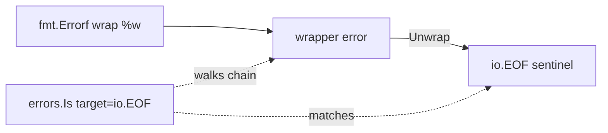

# Go Sentinel Errors — Junior Level

## 1. Introduction

### What is it?
A **sentinel error** is a single, exported, package-level error value that callers compare against to detect a specific outcome. The convention is to declare it once with `errors.New` (or `fmt.Errorf` without `%w`), give it a name beginning with `Err`, and let callers check for that exact value.

```go
package store

import "errors"

var ErrNotFound = errors.New("store: not found")
```

A consumer then writes:

```go
val, err := store.Lookup(key)
if errors.Is(err, store.ErrNotFound) {
    // handle the "missing" case
}
```

The sentinel acts as a stable identifier — every call site that needs to detect "not found" looks at the same value, the same way.

### How to use it?
```go
package main

import (
    "database/sql"
    "errors"
    "fmt"
)

func loadUser(db *sql.DB, id int) (string, error) {
    var name string
    err := db.QueryRow("SELECT name FROM users WHERE id = ?", id).Scan(&name)
    if errors.Is(err, sql.ErrNoRows) {
        return "", fmt.Errorf("user %d: %w", id, sql.ErrNoRows)
    }
    if err != nil {
        return "", fmt.Errorf("user %d: query: %w", id, err)
    }
    return name, nil
}
```

`sql.ErrNoRows` is a sentinel exported by `database/sql`. Every Go service that uses `sql` checks for this exact value to detect "no rows" — and they all see the same package-level variable.

---

## 2. Prerequisites
- The `error` interface (2.8.1)
- Package-level variables and exported names
- `errors.New` and `fmt.Errorf`
- `errors.Is` (Go 1.13+)
- Reading basic stdlib package documentation

---

## 3. Glossary

| Term | Definition |
|------|-----------|
| sentinel error | An exported package-level error value used as an identifier for a specific condition |
| identity comparison | Comparing two error values with `==` (or `errors.Is` against the chain) |
| wrapping | Producing a new error that contains another via `fmt.Errorf("...: %w", err)` |
| unwrap chain | The list of errors reachable from a given error via repeated `errors.Unwrap` |
| `errors.Is` | Reports whether any error in the chain matches a target sentinel |
| `errors.As` | Reports whether any error in the chain is of a given type |
| structured error | An error type with fields (e.g. `*os.PathError`), as opposed to a bare sentinel |
| `Err<Reason>` | The Go convention for naming sentinel variables |

---

## 4. Core Concepts

### 4.1 Declaring a Sentinel

A sentinel is just a package-level `var`:

```go
package store

import "errors"

var (
    ErrNotFound      = errors.New("store: not found")
    ErrAlreadyExists = errors.New("store: already exists")
    ErrReadOnly      = errors.New("store: read-only")
)
```

Rules of thumb:
- Use `errors.New`, not `fmt.Errorf` (the latter exists for formatting; sentinels need none).
- Name it `Err<Reason>` — `ErrNotFound`, `ErrTimeout`, `ErrClosed`.
- Prefix the message with the package name (so the error reads sensibly when logged).
- Make it `var`, not `const` (Go has no constant errors of interface type).

### 4.2 Returning a Sentinel

A function that wants the caller to be able to detect a specific failure returns the sentinel directly, or wraps it with `%w`:

```go
func Lookup(key string) (Value, error) {
    v, ok := store[key]
    if !ok {
        return Value{}, ErrNotFound
    }
    return v, nil
}
```

If you want to attach context, wrap:

```go
func Lookup(key string) (Value, error) {
    v, ok := store[key]
    if !ok {
        return Value{}, fmt.Errorf("lookup %q: %w", key, ErrNotFound)
    }
    return v, nil
}
```

The wrapped form lets callers see the key in the error message while still detecting the sentinel via `errors.Is`.

### 4.3 Checking With `==`

Before Go 1.13, the canonical check was a direct equality comparison:

```go
v, err := store.Lookup(key)
if err == store.ErrNotFound {
    // handle
}
```

This works because `errors.New` allocates a unique `*errorString` value; the address is stable for the life of the program. Two `ErrNotFound` references in any package compare equal because they point to the same allocation.

The downside: `==` only matches the bare sentinel. If somebody wrapped it (`fmt.Errorf("...: %w", ErrNotFound)`), `==` returns false.

### 4.4 Checking With `errors.Is`

`errors.Is(err, target)` reports whether `target` is anywhere in the unwrap chain of `err`. It is the modern, wrapping-aware form:

```go
v, err := store.Lookup(key)
if errors.Is(err, store.ErrNotFound) {
    // handle, even if Lookup wrapped the sentinel
}
```

Internally, `errors.Is` walks the chain by calling `Unwrap` repeatedly and compares each link with `==`. So a wrapped sentinel is still detected.

**Rule**: in new code, always use `errors.Is` for sentinels. Reserve `==` for cases where you control both producer and consumer and you know wrapping will not happen.

### 4.5 Well-Known Stdlib Sentinels

You will meet these constantly:

| Sentinel | Package | What it signals |
|---|---|---|
| `io.EOF` | `io` | End of input stream |
| `io.ErrUnexpectedEOF` | `io` | Stream ended mid-record |
| `io.ErrShortBuffer` | `io` | Buffer too small |
| `io.ErrShortWrite` | `io` | Wrote fewer bytes than requested |
| `io.ErrClosedPipe` | `io` | Read/write on a closed pipe |
| `sql.ErrNoRows` | `database/sql` | Query returned zero rows |
| `sql.ErrConnDone` | `database/sql` | Connection already returned to pool |
| `sql.ErrTxDone` | `database/sql` | Transaction already committed/rolled back |
| `context.Canceled` | `context` | Context's `cancel` was called |
| `context.DeadlineExceeded` | `context` | Context's deadline passed |
| `os.ErrNotExist` | `os` | File or directory missing |
| `os.ErrExist` | `os` | File already exists |
| `os.ErrPermission` | `os` | Permission denied |
| `bufio.ErrBufferFull` | `bufio` | Buffered reader's buffer is full |
| `http.ErrServerClosed` | `net/http` | `Server.Close` or `Shutdown` called |

Your day-to-day code will check most of these via `errors.Is`. They are stable across releases.

---

## 5. Real-World Analogies

**A locker tag.** When the front desk runs out of lockers, every clerk hands you the same red "FULL" tag. Every guest checks for that exact tag to know it's not a personal failure — it's the well-known "no locker" signal. Different clerks, same tag.

**Error code on a microwave.** When the door is open, every microwave from that brand displays the same code (e.g. `E1`). Service manuals, shop technicians, and repair videos all reference `E1`. The sentinel is the agreed-upon identifier.

**A traffic-light color.** Red is a sentinel that all drivers recognize. The red light at one intersection has the same meaning as red at every other intersection. Drivers don't look up "what does this red mean here" — they recognize the identity.

---

## 6. Mental Models

```
package io                 user code
  ┌──────────────┐         ┌──────────────────────────┐
  │ var EOF =    │  ←────  │ if errors.Is(err, io.EOF)│
  │  errors.New(  │         └──────────────────────────┘
  │   "EOF")     │  shared identity across all callers
  └──────────────┘
  Single allocation at package init.
  Address is stable. All comparisons resolve to the same pointer.
```

A sentinel is just a value held in a package's data segment, exposed by name. Callers don't construct it — they reference the package's variable. Equality reduces to pointer equality.

---

## 7. Pros & Cons

### Pros
- Trivial to declare: one line.
- Zero runtime cost on the hot path (one pointer comparison).
- Strong stable identity — the variable does not change.
- No new types to introduce; the existing `error` interface suffices.
- `errors.Is` integrates with wrapping cleanly.

### Cons
- Tight coupling between caller and the producing package.
- Carries no contextual data (no key, no path, no offset).
- Hard to evolve: you cannot add fields without changing the API.
- Public API surface grows; sentinels become part of the package's compatibility promise.
- Prone to subtle bugs (wrapping, re-exporting, mutation).

---

## 8. Use Cases

1. End-of-stream signal (`io.EOF`).
2. "Not found" lookups (`sql.ErrNoRows`, `redis.Nil`).
3. Cancellation/timeout (`context.Canceled`, `context.DeadlineExceeded`).
4. Resource state (`http.ErrServerClosed`, `sql.ErrTxDone`).
5. Permission/existence (`os.ErrNotExist`, `os.ErrPermission`).
6. Protocol violations the caller is expected to recover from (`bufio.ErrBufferFull`).
7. Optional behaviors: skip a record, retry an iteration.

---

## 9. Code Examples

### Example 1 — The classic `io.EOF` loop

```go
package main

import (
    "bufio"
    "errors"
    "fmt"
    "io"
    "strings"
)

func main() {
    r := bufio.NewReader(strings.NewReader("alpha\nbeta\ngamma\n"))
    for {
        line, err := r.ReadString('\n')
        if line != "" {
            fmt.Print(line)
        }
        if errors.Is(err, io.EOF) {
            return
        }
        if err != nil {
            fmt.Println("read error:", err)
            return
        }
    }
}
```

`io.EOF` is the canonical end-of-stream sentinel. Every `Reader` in the standard library returns it.

### Example 2 — `sql.ErrNoRows`

```go
package main

import (
    "database/sql"
    "errors"
    "fmt"
)

func findEmail(db *sql.DB, id int) (string, error) {
    var email string
    err := db.QueryRow("SELECT email FROM users WHERE id = ?", id).Scan(&email)
    switch {
    case errors.Is(err, sql.ErrNoRows):
        return "", fmt.Errorf("user %d: %w", id, sql.ErrNoRows)
    case err != nil:
        return "", fmt.Errorf("user %d: %w", id, err)
    }
    return email, nil
}
```

Single-row queries that produce zero rows return `sql.ErrNoRows`. Treating it as "not found" rather than a database error is part of the contract.

### Example 3 — `context.Canceled` short-circuit

```go
package main

import (
    "context"
    "errors"
    "fmt"
    "time"
)

func work(ctx context.Context) error {
    select {
    case <-time.After(time.Second):
        return nil
    case <-ctx.Done():
        return ctx.Err()
    }
}

func main() {
    ctx, cancel := context.WithCancel(context.Background())
    cancel()
    err := work(ctx)
    if errors.Is(err, context.Canceled) {
        fmt.Println("cancelled cleanly")
    }
}
```

`ctx.Err()` returns either `context.Canceled` or `context.DeadlineExceeded`. Both are sentinels.

### Example 4 — Declaring your own

```go
package store

import "errors"

var (
    ErrNotFound      = errors.New("store: not found")
    ErrAlreadyExists = errors.New("store: already exists")
    ErrReadOnly      = errors.New("store: read-only")
)
```

These three sentinels become the public vocabulary of the `store` package's failure modes.

### Example 5 — Returning and detecting

```go
package main

import (
    "errors"
    "fmt"
)

var ErrNotFound = errors.New("not found")

func get(key string) (int, error) {
    data := map[string]int{"a": 1}
    v, ok := data[key]
    if !ok {
        return 0, fmt.Errorf("get %q: %w", key, ErrNotFound)
    }
    return v, nil
}

func main() {
    _, err := get("missing")
    if errors.Is(err, ErrNotFound) {
        fmt.Println("clean miss")
    } else if err != nil {
        fmt.Println("real failure:", err)
    }
}
```

Wrapping `ErrNotFound` with `%w` lets callers still detect the sentinel and gives them the key in the message.

### Example 6 — `os.ErrNotExist`

```go
package main

import (
    "errors"
    "fmt"
    "os"
)

func main() {
    _, err := os.Open("/no/such/file")
    if errors.Is(err, os.ErrNotExist) {
        fmt.Println("file not present, that's fine")
        return
    }
    if err != nil {
        fmt.Println("unexpected:", err)
    }
}
```

`os.Open` returns a `*os.PathError`, but `errors.Is` walks into it and compares the inner error to `os.ErrNotExist`.

---

## 10. Coding Patterns

### Pattern 1 — Group sentinels in a single block

```go
var (
    ErrNotFound  = errors.New("pkg: not found")
    ErrConflict  = errors.New("pkg: conflict")
    ErrTimeout   = errors.New("pkg: timeout")
)
```

### Pattern 2 — Always wrap with context

```go
return fmt.Errorf("read %q: %w", path, ErrNotFound)
```

### Pattern 3 — Always check with `errors.Is`

```go
if errors.Is(err, store.ErrNotFound) { ... }
```

### Pattern 4 — Switch on multiple sentinels

```go
switch {
case errors.Is(err, sql.ErrNoRows):
    return Empty, nil
case errors.Is(err, context.Canceled):
    return Empty, err
case err != nil:
    return Empty, fmt.Errorf("query: %w", err)
}
```

### Pattern 5 — Document what you return

```go
// Lookup returns ErrNotFound when key is absent.
// All other errors are transport failures and should be retried.
func Lookup(key string) (Value, error) { ... }
```

The doc comment is part of the API contract.

---

## 11. Clean Code Guidelines

1. **Name them `Err<Reason>`.** Standardised across the ecosystem.
2. **One sentence per sentinel** in the doc comment, listing when it is returned.
3. **Use `errors.New`, not `fmt.Errorf`,** so nothing accidentally becomes a `%w` chain root.
4. **Prefix the message with the package name** for readability when logged.
5. **Group sentinels in one `var (...)` block** at the top of a file (often `errors.go`).
6. **Resist re-exporting** sentinels from other packages — re-export creates a new identity.
7. **Use `errors.Is`** in checks; reserve `==` for very tight, internal hot paths.
8. **Never mutate** a declared sentinel after init.

```go
// Good
var ErrNotFound = errors.New("store: not found")

// Bad — fmt.Errorf could be misused with %w later
var ErrNotFound = fmt.Errorf("store: not found")

// Bad — generic name
var NotFound = errors.New("not found")
```

---

## 12. Product Use / Feature Example

A user-facing API translates internal sentinels to HTTP status codes:

```go
package api

import (
    "context"
    "database/sql"
    "errors"
    "net/http"

    "example.com/store"
)

func statusFor(err error) int {
    switch {
    case err == nil:
        return http.StatusOK
    case errors.Is(err, store.ErrNotFound), errors.Is(err, sql.ErrNoRows):
        return http.StatusNotFound
    case errors.Is(err, store.ErrAlreadyExists):
        return http.StatusConflict
    case errors.Is(err, context.Canceled):
        return 499 // client closed request
    case errors.Is(err, context.DeadlineExceeded):
        return http.StatusGatewayTimeout
    default:
        return http.StatusInternalServerError
    }
}
```

The sentinel set is small, stable, and easy to map. New failure modes are added by introducing a new sentinel and a new `case`.

---

## 13. Error Handling

Sentinels do not replace error handling — they refine it. The general flow:

1. Call returns `error`.
2. If `err == nil`, succeed.
3. Otherwise, walk a small set of `errors.Is` checks for sentinels you care about.
4. Anything else is wrapped and propagated up.

```go
v, err := repo.Find(ctx, id)
switch {
case err == nil:
    return v, nil
case errors.Is(err, repo.ErrNotFound):
    return Default, nil
case errors.Is(err, context.Canceled), errors.Is(err, context.DeadlineExceeded):
    return Default, err
default:
    return Default, fmt.Errorf("find %d: %w", id, err)
}
```

Two failure modes here are *expected* (not found, cancellation); the rest are *unexpected* and bubble up.

---

## 14. Security Considerations

1. **Sentinel messages may leak intent.** If your error message says `"sentinel: account not found"`, an attacker can tell apart "account does not exist" vs "account exists but wrong password". Use a uniform user-facing message and keep the sentinel internal.
2. **Do not put PII into sentinel messages.** The sentinel's text is a constant; logs can include it freely.
3. **Sentinels enable timing-equal responses.** A login handler can return `ErrInvalidCredentials` for both "no such user" and "wrong password" without leaking which.
4. **Caller-controlled wrapping is fine.** As long as the sentinel itself contains only a generic phrase, wrapping with user input does not change the sentinel's identity.

---

## 15. Performance Tips

1. `errors.Is` walks the chain; chains are usually 2-5 deep. The cost is a few pointer comparisons.
2. `==` against a sentinel is a single pointer comparison.
3. `errors.Is(err, target)` returns false when `err == nil`. You don't have to nil-check first.
4. Avoid building deep chains in hot loops. Prefer wrapping once at boundaries (handler, RPC entry).
5. Sentinels themselves cost one allocation at package init — irrelevant.

---

## 16. Metrics & Analytics

Sentinels are a natural axis for error metrics:

```go
labels := map[error]string{
    store.ErrNotFound:    "not_found",
    sql.ErrNoRows:        "no_rows",
    context.Canceled:     "canceled",
    context.DeadlineExceeded: "deadline",
}

func label(err error) string {
    for s, name := range labels {
        if errors.Is(err, s) {
            return name
        }
    }
    return "other"
}
```

Drives Prometheus counters like `errors_total{kind="not_found"}` without exposing internal error text as a high-cardinality label.

---

## 17. Best Practices

1. Declare sentinels in a single `errors.go` per package.
2. Prefix messages with the package name.
3. Use `errors.New`.
4. Name them `Err<Reason>`.
5. Document the conditions that produce each.
6. Wrap with `%w` when you want to attach context.
7. Check with `errors.Is` (rarely `==`).
8. Do not re-export another package's sentinel.
9. Do not mutate sentinels after init.
10. Treat sentinels as part of the package's public API contract.

---

## 18. Edge Cases & Pitfalls

### Pitfall 1 — `==` against a wrapped sentinel
```go
err := fmt.Errorf("oops: %w", io.EOF)
if err == io.EOF { /* never true */ }
```
Fix: `errors.Is(err, io.EOF)`.

### Pitfall 2 — Declaring with `fmt.Errorf` and a `%w`
```go
var ErrFoo = fmt.Errorf("foo: %w", io.EOF) // BUG: ErrFoo wraps io.EOF
```
Now `errors.Is(ErrFoo, io.EOF)` is true, which surprises callers.

### Pitfall 3 — Mutating a sentinel
```go
ErrNotFound = errors.New("changed") // every existing caller's check breaks
```
Treat sentinels as effectively immutable.

### Pitfall 4 — Re-exporting
```go
package shim
var ErrNotFound = store.ErrNotFound // SAME pointer; OK as alias

var ErrNotFound = errors.New("not found") // DIFFERENT pointer; trap
```
The second form looks like a re-export but creates a new sentinel.

### Pitfall 5 — Comparing across module versions
If two builds vendor different versions of a package, the sentinels are different allocations. `errors.Is` can still match within one build, but cross-build comparisons via reflection fail.

---

## 19. Common Mistakes

| Mistake | Fix |
|---|---|
| `err == ErrFoo` against a wrapped error | Use `errors.Is` |
| `var ErrFoo = fmt.Errorf("foo")` | Use `errors.New` |
| Mutating a sentinel later | Never assign to it again after init |
| Re-declaring instead of aliasing | Use `var ErrFoo = pkg.ErrFoo` only when you mean an alias |
| Returning a generic `errors.New("not found")` instead of an exported sentinel | Export a real `ErrNotFound` |

---

## 20. Common Misconceptions

**Misconception 1**: "Sentinels are constants."
**Truth**: Go has no constant errors of interface type. They are `var`. By convention, you don't reassign them.

**Misconception 2**: "`errors.Is` is slow."
**Truth**: It walks a chain that's usually 2-5 deep. Negligible cost on any non-trivial path.

**Misconception 3**: "`==` is always wrong."
**Truth**: `==` is fine when you control the producer and you know it does not wrap. But `errors.Is` is the safer default.

**Misconception 4**: "Wrapping with `%w` changes the sentinel."
**Truth**: Wrapping creates a new error whose chain contains the sentinel. The sentinel itself is unchanged.

**Misconception 5**: "Two `errors.New("foo")` calls produce equal errors."
**Truth**: Each `errors.New` allocates a new `*errorString`. They are not equal via `==`. Sentinels are equal because they share the SAME variable.

---

## 21. Tricky Points

1. `==` only sees the bare sentinel; wrapping defeats it.
2. `errors.Is` walks the chain — works through any depth of `%w`.
3. `var ErrFoo = fmt.Errorf("...: %w", X)` produces a sentinel that wraps `X`. Often unintended.
4. Re-exporting via copy-paste creates a fresh identity; via `var X = pkg.X` it creates an alias.
5. A typed-nil error (e.g. `var p *MyErr; var e error = p`) is non-nil; sentinel checks behave fine, but the surrounding `if err != nil` is a separate trap (covered in custom-error-types).

---

## 22. Test

```go
package store

import (
    "errors"
    "testing"
)

func TestLookupReturnsNotFound(t *testing.T) {
    _, err := Lookup("missing")
    if !errors.Is(err, ErrNotFound) {
        t.Fatalf("got %v, want ErrNotFound", err)
    }
}

func TestLookupReturnsWrappedNotFound(t *testing.T) {
    _, err := Lookup("missing")
    // Producer wraps; caller still detects the sentinel.
    if !errors.Is(err, ErrNotFound) {
        t.Fatalf("wrapped sentinel not detected: %v", err)
    }
    // The bare-equality form would fail here:
    if err == ErrNotFound {
        t.Logf("note: producer didn't wrap")
    }
}
```

---

## 23. Tricky Questions

**Q1**: What's the output?
```go
err := fmt.Errorf("read failed: %w", io.EOF)
fmt.Println(err == io.EOF, errors.Is(err, io.EOF))
```
**A**: `false true`. `==` sees the wrapper, not the wrapped sentinel. `errors.Is` walks the chain.

**Q2**: What does this print?
```go
a := errors.New("oops")
b := errors.New("oops")
fmt.Println(a == b)
```
**A**: `false`. Each `errors.New` allocates a new value. Sentinels are equal only when they reference the same allocation.

**Q3**: What's wrong here?
```go
var ErrFoo = fmt.Errorf("foo: %w", io.EOF)
```
**A**: `ErrFoo` silently wraps `io.EOF`. Callers checking `errors.Is(ErrFoo, io.EOF)` get `true` — usually unintended. Use `errors.New("foo")`.

---

## 24. Cheat Sheet

```go
// Declare
var ErrNotFound = errors.New("pkg: not found")

// Return bare
return ErrNotFound

// Return wrapped with context
return fmt.Errorf("lookup %q: %w", key, ErrNotFound)

// Detect (modern, wrapping-aware)
if errors.Is(err, ErrNotFound) { ... }

// Detect (legacy, only matches bare value)
if err == ErrNotFound { ... }

// Multi-sentinel switch
switch {
case errors.Is(err, sql.ErrNoRows):    ...
case errors.Is(err, context.Canceled): ...
case err != nil:                       ...
}
```

---

## 25. Self-Assessment Checklist

- [ ] I can declare a sentinel with `errors.New`
- [ ] I name them `Err<Reason>`
- [ ] I prefix messages with the package name
- [ ] I check with `errors.Is`, not `==`, in new code
- [ ] I know what `io.EOF`, `sql.ErrNoRows`, `context.Canceled`, `os.ErrNotExist` mean
- [ ] I know wrapping with `%w` defeats `==` but not `errors.Is`
- [ ] I do not re-declare another package's sentinel
- [ ] I do not mutate sentinels after init

---

## 26. Summary

A sentinel error is a single, exported, package-level error value used as a stable identifier for a specific failure mode. You declare it with `errors.New`, name it `Err<Reason>`, document when it's returned, and detect it with `errors.Is` (which works through `%w` wrapping). The standard library is full of them: `io.EOF`, `sql.ErrNoRows`, `context.Canceled`, `os.ErrNotExist`, and so on. Sentinels are cheap, simple, and good for a small fixed set of well-known conditions; they don't carry context and they couple callers tightly to producers.

---

## 27. What You Can Build

- Reader loops that stop on `io.EOF`.
- Repository APIs with `ErrNotFound`, `ErrAlreadyExists`.
- Cancellation-aware workers checking `context.Canceled`.
- Error-to-HTTP status mappers.
- Error-classification metrics labels.
- Idempotent retries that distinguish transient from permanent errors.

---

## 28. Further Reading

- [`errors` package](https://pkg.go.dev/errors)
- [`io` package variables](https://pkg.go.dev/io#pkg-variables)
- [`database/sql` package variables](https://pkg.go.dev/database/sql#pkg-variables)
- [`context` package variables](https://pkg.go.dev/context#pkg-variables)
- [`os` errors](https://pkg.go.dev/os#pkg-variables)
- [Go blog — Working with Errors in Go 1.13](https://go.dev/blog/go1.13-errors)

---

## 29. Related Topics

- 2.8.1 The `error` interface
- 2.8.3 Custom error types
- 2.8.4 Error wrapping (`%w`)
- 2.8.5 `errors.Is` and `errors.As`
- 2.8.6 Idiomatic error handling

---

## 30. Diagrams & Visual Aids

### Sentinel comparison through wrapping



### Identity-based equality

```
package io                 every importer
  ┌──────────────┐         ┌────────────────────┐
  │ var EOF      │  ←────  │ errors.Is(e, io.EOF)│
  │  *errorString│         └────────────────────┘
  │  @0xABCDEF   │  one allocation, shared address
  └──────────────┘
```

### Wrapping vs bare check

```
Bare check          Wrapped check
   err              err = fmt.Errorf("x: %w", io.EOF)
    │                       │
    ├── ==  io.EOF? ✓        ├── ==  io.EOF? ✗
    └── Is  io.EOF? ✓        └── Is  io.EOF? ✓ (walks chain)
```
