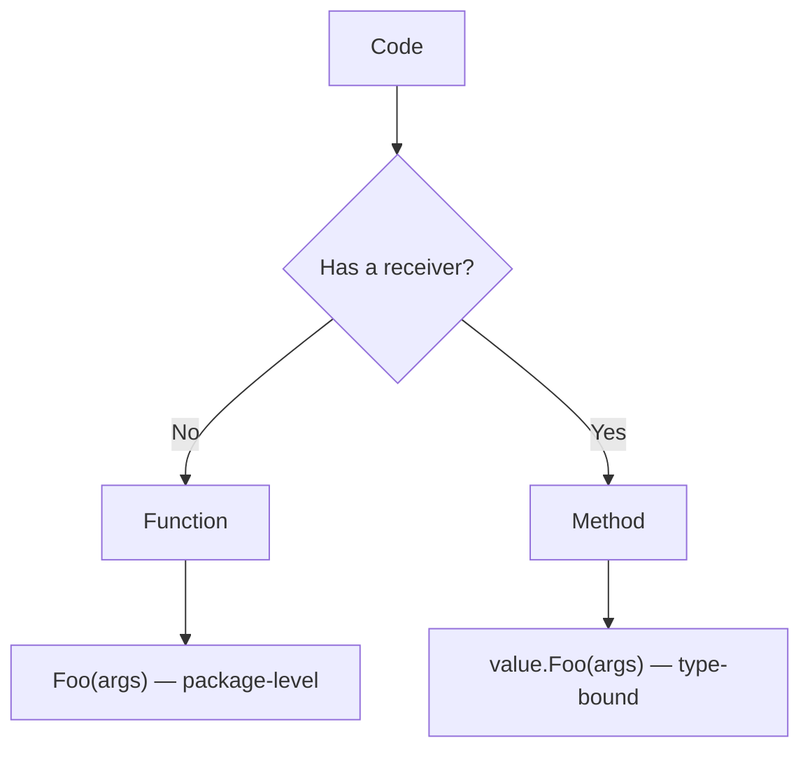
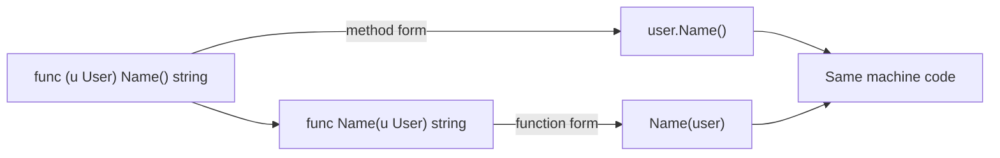
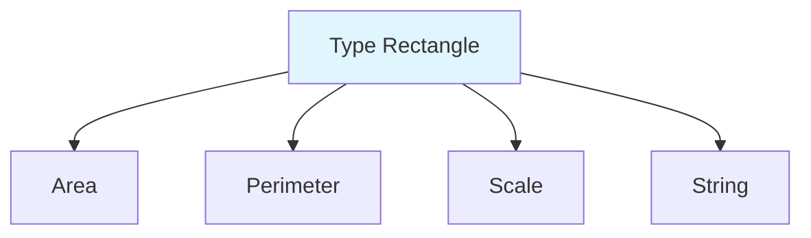

# Methods vs Functions — Junior Level

## Table of Contents
1. [Introduction](#introduction)
2. [Prerequisites](#prerequisites)
3. [Glossary](#glossary)
4. [Core Concepts](#core-concepts)
5. [Real-World Analogies](#real-world-analogies)
6. [Mental Models](#mental-models)
7. [Pros & Cons](#pros--cons)
8. [Use Cases](#use-cases)
9. [Code Examples](#code-examples)
10. [Coding Patterns](#coding-patterns)
11. [Clean Code](#clean-code)
12. [Product Use / Feature](#product-use--feature)
13. [Error Handling](#error-handling)
14. [Security Considerations](#security-considerations)
15. [Performance Tips](#performance-tips)
16. [Best Practices](#best-practices)
17. [Edge Cases & Pitfalls](#edge-cases--pitfalls)
18. [Common Mistakes](#common-mistakes)
19. [Common Misconceptions](#common-misconceptions)
20. [Tricky Points](#tricky-points)
21. [Test](#test)
22. [Tricky Questions](#tricky-questions)
23. [Cheat Sheet](#cheat-sheet)
24. [Self-Assessment Checklist](#self-assessment-checklist)
25. [Summary](#summary)
26. [What You Can Build](#what-you-can-build)
27. [Further Reading](#further-reading)
28. [Related Topics](#related-topics)
29. [Diagrams & Visual Aids](#diagrams--visual-aids)

---

## Introduction
> Focus: "What is it?" and "How to use it?"

When writing Go code you will encounter two kinds of reusable blocks: **function** and **method**. They are very similar, but there is one small yet highly significant difference between them — a **method** is a function "attached" to a specific type, while a plain **function** is not attached to any type and lives independently.

```go
// Function — not attached to any type
func Add(a, b int) int {
    return a + b
}

// Method — attached to the User type
func (u User) FullName() string {
    return u.FirstName + " " + u.LastName
}
```

In the `FullName` definition above, you can see `(u User)` between `func` and the name — this is the **receiver**. The receiver tells you which type the method is being attached to. You then call `FullName` like this: `user.FullName()` — as if `user` is invoking a capability that lives inside it.

A function is called as `Add(2, 3)` — directly from the package. A method, on the other hand, is bound to a value: `user.FullName()` — through the value. Understanding this distinction is the first step toward applying OOP-like styles in Go.

After reading this file you will:
- Understand the difference between a function and a method
- Know the syntax for writing methods
- Be able to choose when to use a function and when to use a method
- Begin writing idiomatic Go code

---

## Prerequisites
- Basics of Go syntax (variables, functions)
- A general understanding of `struct` (basic knowledge is sufficient)
- Ability to run `go run main.go` in a terminal
- Familiarity with the `package main` and `func main()` structure

---

## Glossary

| Term | Definition |
|--------|--------|
| **Function** | An independent function not attached to any type |
| **Method** | A function attached to a specific type via a receiver |
| **Receiver** | A parameter that indicates which value the method is being called on |
| **Receiver type** | The type of the receiver (can be `T` or `*T`) |
| **Value receiver** | A receiver passed by value (`func (u User) ...`) — a copy is made |
| **Pointer receiver** | A receiver passed by pointer (`func (u *User) ...`) — the original value can be modified |
| **Method set** | The complete set of methods belonging to a type |
| **Defined type** | A new type declared via `type` — methods are attached to this type |
| **Named type** | A synonym for defined type |
| **Function call** | Invoking a function as `Foo(args)` |
| **Method call** | Invoking a method as `value.Foo(args)` |

---

## Core Concepts

### 1. Function

A function is an independent block of code. It can be imported and called from any package (when exported).

```go
package main

import "fmt"

func square(n int) int {
    return n * n
}

func main() {
    result := square(5)
    fmt.Println(result) // 25
}
```

Calling a function: `square(5)` — directly at package level.

### 2. Method

A method is a function that takes a **receiver** parameter. The receiver is written before the method name:

```go
package main

import "fmt"

type Rectangle struct {
    Width  float64
    Height float64
}

// Method — attached to the Rectangle type
func (r Rectangle) Area() float64 {
    return r.Width * r.Height
}

func main() {
    rect := Rectangle{Width: 10, Height: 5}
    fmt.Println(rect.Area()) // 50
}
```

Calling a method: `rect.Area()` — through the value, using "dot" syntax.

### 3. Key differences table

| Feature | Function | Method |
|----------|---------|--------|
| Receiver | None | Present (`func (r T)` or `func (r *T)`) |
| Invocation | `Foo(x)` | `x.Foo()` |
| Attached to a type | No | Yes |
| Belongs to a method set | No | Yes |
| Used to satisfy interfaces | No | Yes |

### 4. Which types can a method be attached to?

Only to types **you have declared yourself** (defined types). You cannot directly add methods to built-in types (`int`, `string`, `float64`):

```go
// WRONG — you cannot add a method to built-in int
// func (x int) Double() int { return x * 2 } // compile error

// Correct — you must create a new type
type MyInt int

func (m MyInt) Double() MyInt {
    return m * 2
}

func main() {
    var x MyInt = 5
    fmt.Println(x.Double()) // 10
}
```

### 5. The method must live in the same package

A method and its receiver type must reside **in the same package**. You cannot add methods to a type from another package.

---

## Real-World Analogies

**Analogy 1 — Capabilities (Universal vs Personal)**

`func Add(a, b int) int` — a universal calculator. Open to everyone, requiring no context beyond its numeric inputs.

`func (u User) FullName() string` — a **personal** property of a User. It only makes sense in the context of that User.

**Analogy 2 — Restaurant**

A function is like a general service inside a restaurant: "anyone may pour themselves water" (`PourWater(glass)`).
A method is like a guest's personal order: `customer.GetMyOrder()` — only for that specific guest.

**Analogy 3 — Key and Door**

A function is a separate key: it works outside of any context.
A method is a button installed on a door: it only works on that particular door.

---

## Mental Models

### Model 1: Method = Function + Implicit First Argument

A method is essentially just a function — the receiver is its hidden (implicit) first argument:

```go
// Method
func (r Rectangle) Area() float64 { return r.Width * r.Height }

// Exactly equivalent function form
func Area(r Rectangle) float64 { return r.Width * r.Height }

rect := Rectangle{10, 5}
rect.Area()    // method call
Area(rect)     // function call — same work
```

A method is syntactic sugar. It makes writing and reading code more convenient.

### Model 2: A type knowing its capabilities

```
Rectangle ──> Methods: Area(), Perimeter(), Scale()
User      ──> Methods: FullName(), IsActive()
Counter   ──> Methods: Increment(), Reset()
```

Every type carries a "list of things it can do on its own" — that is its **method set**.

---

## Pros & Cons

### Function

| Pros | Cons |
|------|------|
| Simple, not tied to a type | Detached from a type — harder to group |
| Easy to test | Many functions end up context-less |
| Ideal for stateless work | Not suitable for polymorphism |

### Method

| Pros | Cons |
|------|------|
| Type and its behavior live together | Limited by the receiver type |
| Implements interfaces | Cannot be added to a type from another package |
| Enables encapsulation | Slightly more complex syntax |
| `obj.Do()` is easy to read | Receiver choice can be made incorrectly |

---

## Use Cases

### When to use a Function:
1. **Pure helper** — `strings.Contains(s, "x")`
2. **Stateless utility** — `math.Sqrt(2)`
3. **Work that does not relate to any type** — `fmt.Println(...)`
4. **Constructor** — `NewUser(name string) User`

### When to use a Method:
1. **Work on the internal state of a type** — `counter.Increment()`
2. **Encapsulation** — `account.Withdraw(50)`
3. **Implementing an interface** — `func (f File) Read(p []byte) (int, error)`
4. **Domain entity behavior** — `order.MarkPaid()`

---

## Code Examples

### Example 1: Function — computing the area of a square

```go
package main

import "fmt"

func areaOfSquare(side float64) float64 {
    return side * side
}

func main() {
    fmt.Println(areaOfSquare(5)) // 25
}
```

### Example 2: Method — on the Circle type

```go
package main

import (
    "fmt"
    "math"
)

type Circle struct {
    Radius float64
}

func (c Circle) Area() float64 {
    return math.Pi * c.Radius * c.Radius
}

func (c Circle) Circumference() float64 {
    return 2 * math.Pi * c.Radius
}

func main() {
    c := Circle{Radius: 3}
    fmt.Printf("Area: %.2f\n", c.Area())          // 28.27
    fmt.Printf("Perimeter: %.2f\n", c.Circumference()) // 18.85
}
```

### Example 3: Function and method — one task, two styles

```go
package main

import "fmt"

type Point struct{ X, Y int }

// Function — accepts Points
func DistanceFunc(a, b Point) float64 {
    dx := float64(a.X - b.X)
    dy := float64(a.Y - b.Y)
    return dx*dx + dy*dy
}

// Method — attached to Point
func (a Point) DistanceTo(b Point) float64 {
    dx := float64(a.X - b.X)
    dy := float64(a.Y - b.Y)
    return dx*dx + dy*dy
}

func main() {
    p1 := Point{0, 0}
    p2 := Point{3, 4}

    fmt.Println(DistanceFunc(p1, p2)) // function call → 25
    fmt.Println(p1.DistanceTo(p2))    // method call   → 25
}
```

### Example 4: Method with mutable state

```go
package main

import "fmt"

type Counter struct {
    Count int
}

func (c *Counter) Increment() {
    c.Count++
}

func (c Counter) Show() {
    fmt.Println("Count:", c.Count)
}

func main() {
    c := Counter{}
    c.Increment()
    c.Increment()
    c.Increment()
    c.Show() // Count: 3
}
```

### Example 5: A method on a non-struct type

```go
package main

import "fmt"

type Email string

// Method — attached to the Email type
func (e Email) Domain() string {
    for i := 0; i < len(e); i++ {
        if e[i] == '@' {
            return string(e[i+1:])
        }
    }
    return ""
}

func main() {
    var addr Email = "alice@example.com"
    fmt.Println(addr.Domain()) // example.com
}
```

---

## Coding Patterns

### Pattern 1: Constructor function + methods

```go
type User struct {
    name string
    age  int
}

// Constructor — function (not a method, because the type does not yet exist on a value)
func NewUser(name string, age int) User {
    return User{name: name, age: age}
}

// The type's behavior — methods
func (u User) Name() string { return u.name }
func (u User) Age() int     { return u.age }
```

### Pattern 2: Helper function + entity method

```go
// Helper — pure function
func clamp(n, min, max int) int {
    if n < min { return min }
    if n > max { return max }
    return n
}

// Entity behavior — method
func (s *Slider) SetValue(v int) {
    s.value = clamp(v, s.min, s.max)
}
```

### Pattern 3: Fluent API in method form

```go
type Query struct{ filters []string }

func (q *Query) Where(f string) *Query {
    q.filters = append(q.filters, f)
    return q
}

// q.Where("age > 18").Where("active = true")
```

---

## Clean Code

### Rule 1: Keep method names short and contextual

```go
// Bad — repeats the receiver
func (u User) GetUserName() string { return u.name }

// Good
func (u User) Name() string { return u.name }
```

### Rule 2: Pure logic — function, state — method

```go
// Bad — turning pure work into a method
func (u User) AddNumbers(a, b int) int { return a + b }

// Good — User is not needed here
func AddNumbers(a, b int) int { return a + b }
```

### Rule 3: Keep the receiver name short and consistent

```go
// Bad — different names for the same type
func (rectangle Rectangle) Area() float64 { ... }
func (r Rectangle) Perimeter() float64 { ... }

// Good — one receiver name per type
func (r Rectangle) Area() float64 { ... }
func (r Rectangle) Perimeter() float64 { ... }
```

---

## Product Use / Feature

A real example with e-commerce orders:

```go
package main

import (
    "fmt"
    "time"
)

type Order struct {
    ID     string
    Total  float64
    Paid   bool
    PaidAt time.Time
}

// Method — Order operates on its own state
func (o *Order) MarkPaid(at time.Time) {
    o.Paid = true
    o.PaidAt = at
}

func (o Order) Summary() string {
    if o.Paid {
        return fmt.Sprintf("Order %s: PAID ($%.2f)", o.ID, o.Total)
    }
    return fmt.Sprintf("Order %s: UNPAID ($%.2f)", o.ID, o.Total)
}

// Function — not tied to the Order type
func TotalOf(orders []Order) float64 {
    var sum float64
    for _, o := range orders {
        sum += o.Total
    }
    return sum
}

func main() {
    o := Order{ID: "A1", Total: 99.99}
    fmt.Println(o.Summary())          // Order A1: UNPAID ($99.99)
    o.MarkPaid(time.Now())
    fmt.Println(o.Summary())          // Order A1: PAID ($99.99)

    list := []Order{o, {ID: "B2", Total: 50}}
    fmt.Printf("Total: $%.2f\n", TotalOf(list)) // Total: $149.99
}
```

---

## Error Handling

Both methods and functions can return an `error`:

```go
package main

import (
    "errors"
    "fmt"
)

type Account struct {
    Balance float64
}

// Method — returns an error
func (a *Account) Withdraw(amount float64) error {
    if amount <= 0 {
        return errors.New("amount must be positive")
    }
    if amount > a.Balance {
        return errors.New("insufficient balance")
    }
    a.Balance -= amount
    return nil
}

// Function — helper
func validateAmount(amount float64) error {
    if amount <= 0 {
        return errors.New("amount must be positive")
    }
    return nil
}

func main() {
    a := &Account{Balance: 100}
    if err := a.Withdraw(50); err != nil {
        fmt.Println("error:", err)
        return
    }
    fmt.Println("balance:", a.Balance) // 50
}
```

---

## Security Considerations

**1. Be careful not to expose sensitive fields inside a method:**

```go
// Bad — could also leak the password and other private fields
func (u User) Print() string {
    return fmt.Sprintf("%+v", u) // also prints the password!
}

// Good — only public fields
func (u User) Print() string {
    return fmt.Sprintf("User{Name: %s}", u.Name)
}
```

**2. A pointer receiver may produce hidden side effects** — this is discussed in the sections below.

**3. Encapsulation:** fields starting with a lowercase letter (`name`) are visible only within the same package. Expose them through methods:

```go
type User struct {
    name string  // private
}
func (u User) Name() string { return u.name } // controlled access
```

---

## Performance Tips

- **Functions and methods run at the same speed** — the compiler effectively turns a method into a function.
- **Use a value receiver for small types** (int, bool, small structs).
- **Use a pointer receiver for large structs** — to avoid copying on each call.
- **Method calls can be inlined** — the compiler optimizes them.

---

## Best Practices

1. **Keep type behavior inside methods** — this makes the code easier to read.
2. **Use plain functions for pure utilities** — like `strings.ToUpper(s)`.
3. **Use a function for constructors** — the `NewX(...)` pattern.
4. **Method names should be short and contextual** — `user.Name()`, not `user.GetUserName()`.
5. **Receiver names should be 1–2 letters** — `u`, `r`, `c`, `s`.
6. **Keep the receiver name consistent for a given type** — always `u User` everywhere.
7. **Do not mix pointer and value receivers on the same type** — avoid having both `func (u User)` and `func (u *User)` simultaneously (unless you have a clearly explained reason).

---

## Edge Cases & Pitfalls

### Pitfall 1: You cannot add methods to built-in types

```go
// WRONG
// func (s string) Reverse() string { ... }  // compile error

// Correct way
type MyString string
func (s MyString) Reverse() MyString { ... }
```

### Pitfall 2: You cannot add methods to a type from another package

```go
// time.Time lives in another package — you cannot directly add a method to it
// func (t time.Time) IsWeekend() bool { ... } // compile error

// Correct way
type MyTime time.Time
func (t MyTime) IsWeekend() bool { ... }
```

### Pitfall 3: Nil pointer receiver

```go
type Logger struct{ prefix string }
func (l *Logger) Log(msg string) {
    fmt.Println(l.prefix, msg) // panics if l is nil
}

var l *Logger // nil
l.Log("hi")   // panic: nil pointer dereference
```

---

## Common Mistakes

| Mistake | Cause | Fix |
|------|-------|--------|
| Calling a method at package level | A method is bound to a value | Create a receiver value first |
| Adding a method to `int` | It's a built-in type | Use `type MyInt int` |
| Replacing a method with the equivalent function form just to avoid OOP-style | Procedural reflex over OOP-style | Keep it as a method when it fits the structure |
| Receiver name varies in different places | Lack of consistency | One type = one receiver name |

---

## Common Misconceptions

**Misconception 1: "A method is Go's class-method form of OOP"**
Partially true. A method is bound to a value, but Go has no `class`. A method is simply a function with a receiver.

**Misconception 2: "Methods are always faster than functions"**
False. The compiler often turns both into the same machine code.

**Misconception 3: "A function cannot be turned into a method"**
False. By creating a new type, you can convert a function into a method.

**Misconception 4: "Methods and functions are the same thing, only with a syntax difference"**
Partially true. The syntax differs, but methods are required for **method sets** and **interfaces**.

---

## Tricky Points

### 1. The method set depends on the type

```go
type Counter struct{ n int }

func (c *Counter) Inc() { c.n++ }

var c Counter
c.Inc() // works — Go automatically takes &c

var p *Counter = &Counter{}
p.Inc() // works
```

### 2. A method can be used as a function (method value)

```go
c := Counter{}
inc := c.Inc  // method value
inc()
inc()
fmt.Println(c.n) // 2
```

### 3. A pointer receiver method can also be invoked on a value

```go
func (c *Counter) Inc() { c.n++ }

c := Counter{}  // value
c.Inc()         // Go automatically takes &c
```

---

## Test

### 1. Which of the following is a **method**?
- a) `func Add(a, b int) int`
- b) `func (u User) Name() string`
- c) `func main()`
- d) `func() { ... }()`

**Answer: b**

### 2. Where is the method receiver written?
- a) After the method name
- b) Between `func` and the method name
- c) In the `return`
- d) Inside the body

**Answer: b**

### 3. What does the following code print?
```go
type X int
func (x X) Double() X { return x * 2 }
var v X = 5
fmt.Println(v.Double())
```
- a) 5
- b) 10
- c) compile error
- d) 0

**Answer: b**

### 4. What happens if you try to add a method directly to `int`?
- a) Works
- b) Compile error
- c) Runtime panic
- d) Nothing

**Answer: b**

### 5. What is the difference between a function and a method?
- a) Methods are faster
- b) Methods take a receiver
- c) Functions cannot live inside a struct
- d) Methods cannot be modified

**Answer: b**

---

## Tricky Questions

**Q1: Does a method require a struct?**
No. A method can be attached to any **defined type** (not an alias): a struct, an int-based type, a function type, and so on.

**Q2: Can you add two methods with the same name to one type?**
No. Method names must be unique within a single type.

**Q3: Should method names be exported?**
If you want to export them, start with an uppercase letter: `User.Name()`. Lowercase names are private to the package.

**Q4: Can a method be called on a `nil` value?**
With a pointer receiver — yes, if the method handles `nil` safely. Otherwise — panic.

**Q5: Can I attach the same function to multiple types as a method?**
Yes. You write a separate method for each type, but they can share the same name.

---

## Cheat Sheet

```
FUNCTION
────────────────────────
func Name(args) (returns) { ... }
call: Name(args)

METHOD
────────────────────────
func (r Type) Name(args) (returns) { ... }
call: value.Name(args)

RECEIVER FORMS
────────────────────────
func (r T)   Name() ...   value receiver  → copy
func (r *T)  Name() ...   pointer receiver → original is modified

RULES
────────────────────────
* methods can only be added to defined types
* method and type must be in the same package
* the same method name cannot appear twice on one type
* receiver names are short: r, u, c, s
* method = function + implicit first arg
```

---

## Self-Assessment Checklist

- [ ] I can explain the difference between a function and a method
- [ ] I can write the receiver between `func` and the method name
- [ ] I know why methods cannot be added to built-in types
- [ ] I can create a defined type and attach a method to it
- [ ] I can call a method in the form `value.Method()`
- [ ] I can combine a method with a constructor function
- [ ] I can decide when a method versus a function is needed
- [ ] I know the rules for receiver naming

---

## Summary

Functions and methods are very similar, but they differ in one important way: **a method takes a receiver**, while a function does not.

The receiver binds the method to a specific type and gives you the natural "talking to an object" syntax `value.Method()`. A function is a self-contained block of code that stands on its own.

In Go, methods are the primary tool for capturing OOP-style behavior. But they show their true power when combined with **interfaces** — that will be covered in upcoming sections.

---

## What You Can Build

Knowledge of methods and functions enables you to build:
- Domain models (`User`, `Order`, `Product`) and their behavior
- Stateful components (counter, buffer, parser)
- Constructor + entity-method combinations
- Fluent APIs (`q.Where(...).OrderBy(...)`)
- Types that satisfy interfaces

---

## Further Reading

- [Go Tour — Methods](https://go.dev/tour/methods/1)
- [Effective Go — Methods](https://go.dev/doc/effective_go#methods)
- [Go Spec — Method declarations](https://go.dev/ref/spec#Method_declarations)
- [Go Spec — Method sets](https://go.dev/ref/spec#Method_sets)

---

## Related Topics

- Pointer Receivers — when to use `*T`
- Value Receivers — when to use `T`
- Interfaces — methods implement interfaces
- Embedding — struct and method composition
- Constructor pattern — `NewX(...)` functions

---

## Diagrams & Visual Aids

### Diagram 1: Function vs Method dispatch



### Diagram 2: Method = Function + implicit first arg



### Diagram 3: Method set structure


