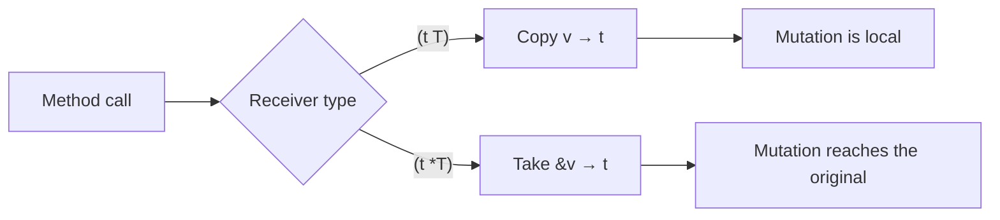
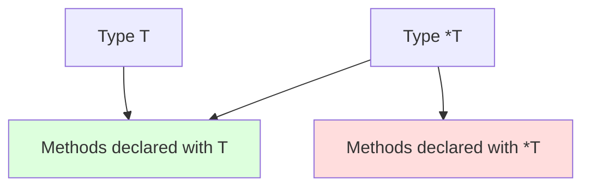

# Pointer Receivers — Junior Level

## Table of Contents
1. [Introduction](#introduction)
2. [Prerequisites](#prerequisites)
3. [Glossary](#glossary)
4. [Core Concepts](#core-concepts)
5. [Real-World Analogies](#real-world-analogies)
6. [Mental Models](#mental-models)
7. [Pros & Cons](#pros--cons)
8. [Use Cases](#use-cases)
9. [Code Examples](#code-examples)
10. [Coding Patterns](#coding-patterns)
11. [Clean Code](#clean-code)
12. [Product Use](#product-use)
13. [Error Handling](#error-handling)
14. [Security Considerations](#security-considerations)
15. [Performance Tips](#performance-tips)
16. [Best Practices](#best-practices)
17. [Edge Cases & Pitfalls](#edge-cases--pitfalls)
18. [Common Mistakes](#common-mistakes)
19. [Common Misconceptions](#common-misconceptions)
20. [Tricky Points](#tricky-points)
21. [Test](#test)
22. [Tricky Questions](#tricky-questions)
23. [Cheat Sheet](#cheat-sheet)
24. [Self-Assessment Checklist](#self-assessment-checklist)
25. [Summary](#summary)
26. [Diagrams](#diagrams)

---

## Introduction
> Focus: "What is a pointer receiver and when do I use it?"

In Go, a method must have a receiver. The receiver can be one of two kinds — **value** (`func (t T)`) or **pointer** (`func (t *T)`). This file is dedicated to the pointer receiver.

A pointer receiver — the receiver type is written with a star: `*T`. Inside the method body, `t` is a pointer to T. This lets you **modify the original value** inside the method.

```go
type Counter struct{ n int }

// Pointer receiver — c — *Counter
func (c *Counter) Inc() {
    c.n++
}

func main() {
    counter := Counter{}
    counter.Inc()
    counter.Inc()
    fmt.Println(counter.n) // 2
}
```

In the example above, if `Inc` had a value receiver, `c` would be a copy of `counter` and `c.n++` would modify only the copy. Thanks to the pointer receiver, `c` points to `counter` and the change reaches the original `counter`.

After finishing this file you will:
- Know the syntax for writing a pointer receiver
- Understand when a pointer receiver is needed
- Know what Go does automatically when calling a method through a value
- Avoid the most typical mistakes

---

## Prerequisites
- Basics of Functions and Methods
- Understanding of `struct`
- Beginner knowledge of pointers (`&` and `*`)
- The meaning of `nil`

---

## Glossary

| Term | Definition |
|--------|--------|
| **Pointer** | A memory address that points to another value |
| **Pointer receiver** | A method whose receiver type is in the form `*T` |
| **Value receiver** | A method whose receiver type is in the form `T` |
| **Dereference** | Accessing the original value through a pointer (`*p`) |
| **Address-of** | Taking a pointer from a value (`&v`) |
| **Mutability** | The ability to modify a value |
| **Addressable** | A value whose address can be taken |
| **Auto-addressing** | Go's automatic use of `&v` |
| **Auto-dereferencing** | Go's automatic use of `*p` |
| **Method set** | All methods belonging to a type |

---

## Core Concepts

### 1. Pointer receiver syntax

```go
func (receiverName *TypeName) MethodName(args) ReturnType {
    // body — receiverName is of type *TypeName
}
```

Example:

```go
type Account struct{ balance float64 }

func (a *Account) Deposit(amount float64) {
    a.balance += amount   // a — *Account, a.balance — Go auto-dereferences
}
```

### 2. The 3 purposes of a pointer receiver

**Purpose 1: Modifying the original value**

```go
type Counter struct{ n int }
func (c *Counter) Inc() { c.n++ }

c := Counter{}
c.Inc()
fmt.Println(c.n) // 1
```

**Purpose 2: Avoiding copies of large structs**

```go
type BigStruct struct {
    data [10000]int
}

// Value receiver — 80KB copy on every call
func (b BigStruct) Sum() int { ... }

// Pointer receiver — 8 bytes (pointer size) on every call
func (b *BigStruct) Sum() int { ... }
```

**Purpose 3: Working with a mutex inside the type**

```go
type SafeCounter struct {
    mu sync.Mutex
    n  int
}

// MUST be pointer — so the mutex is not copied
func (c *SafeCounter) Inc() {
    c.mu.Lock(); defer c.mu.Unlock()
    c.n++
}
```

### 3. Auto-addressing — Go works for you

If you call a pointer receiver method through a **value**, Go automatically takes `&v`:

```go
type C struct{ n int }
func (c *C) Inc() { c.n++ }

c := C{}     // value
c.Inc()      // Go automatically: (&c).Inc()
```

This only works if `c` is **addressable**. Map elements are NOT addressable:

```go
m := map[string]C{"k": {}}
m["k"].Inc()  // ERROR: cannot take address of m["k"]
```

### 4. Pointer receiver method on a nil value

`*T` may be `nil`. If a method is called and a nil pointer dereference occurs in the body — runtime panic.

```go
type Logger struct{ prefix string }
func (l *Logger) Log(msg string) {
    fmt.Println(l.prefix, msg)  // if l == nil, l.prefix → panic
}

var l *Logger
l.Log("hi")   // panic: nil pointer dereference
```

Defensive style:

```go
func (l *Logger) Log(msg string) {
    if l == nil { return }
    fmt.Println(l.prefix, msg)
}
```

### 5. The pointer receiver's effect on the method set

| Type | Pointer receiver in method set? |
|-----|-------------------------------|
| `T` | No |
| `*T` | Yes |

```go
type C struct{}
func (c *C) Hello() {}

type Greeter interface{ Hello() }

var c C
// var _ Greeter = c   // ERROR — Hello() is not in C's method set
var _ Greeter = &c   // OK — it is in *C's method set
```

---

## Real-World Analogies

**Analogy 1 — Address and apartment**

Value receiver — you are given a **photograph** of the apartment. Changing the furniture in the photo does not affect the real apartment.

Pointer receiver — you are given the **keys and the address** of the apartment. You can enter, change the furniture, and the change reaches the apartment.

**Analogy 2 — Document copy and original**

Value — a paper copy: writing on it doesn't affect the original document.

Pointer — a reference to the original document: if you write, it is written to the document.

**Analogy 3 — Eating in a restaurant**

Value — the food is **brought to you in a plastic cup** (copied).
Pointer — you **go to the cafe and eat at the table** — everyone works in the same place.

---

## Mental Models

### Model 1: What is `t` inside the method, really?

```go
// func (t T) Foo()    →  inside body t is of type T (a copy)
// func (t *T) Foo()   →  inside body t is of type *T (a pointer)
```

`t.field` — Go auto-dereferences to `(*t).field`.

### Model 2: Mutability map

```
type X struct { n int }

(x X)  Inc() → takes a copy of x → change is local
(x *X) Inc() → takes a pointer to x → change reaches the ORIGINAL X
```

### Model 3: Signs for using a pointer receiver

```
Sign 1: need to modify a field of the type        → pointer
Sign 2: type is large (>16 bytes or many fields)  → pointer
Sign 3: type contains a mutex/atomic              → pointer (mandatory)
Sign 4: type must be immutable                    → value
Sign 5: type is small and you want consistency    → pick one based on choice
```

---

## Pros & Cons

| Pros | Cons |
|------|------|
| Original value can be modified | Risk of nil pointer panic |
| Avoids copying large types | Method set only on *T |
| Works correctly with mutex/atomic | Caller must hold the pointer |
| Saves memory | Slightly harder to read |

---

## Use Cases

### Use case 1: Stateful counter

```go
type Counter struct{ n int }
func (c *Counter) Inc() { c.n++ }
```

### Use case 2: Builder pattern

```go
type Query struct{ parts []string }
func (q *Query) Where(c string) *Query {
    q.parts = append(q.parts, c)
    return q
}
```

### Use case 3: Resource holder (DB, file, ...)

```go
type DB struct{ conn *sql.DB }
func (d *DB) Close() error { return d.conn.Close() }
```

### Use case 4: Sync primitive

```go
type Cache struct {
    mu sync.RWMutex
    m  map[string]string
}
func (c *Cache) Get(k string) string { ... }
func (c *Cache) Set(k, v string)     { ... }
```

---

## Code Examples

### Example 1: Basic mutation

```go
package main

import "fmt"

type Box struct{ items []string }

func (b *Box) Add(item string) {
    b.items = append(b.items, item)
}

func main() {
    b := Box{}
    b.Add("apple")
    b.Add("banana")
    fmt.Println(b.items) // [apple banana]
}
```

### Example 2: Auto-addressing demonstrate

```go
package main

import "fmt"

type Score struct{ value int }
func (s *Score) Increase(by int) { s.value += by }

func main() {
    s := Score{value: 10}
    s.Increase(5)            // Go: (&s).Increase(5)
    fmt.Println(s.value)     // 15

    p := &Score{value: 100}
    p.Increase(1)
    fmt.Println(p.value)     // 101
}
```

### Example 3: Pointer receiver with multiple methods

```go
package main

import "fmt"

type Stack struct{ items []int }

func (s *Stack) Push(x int) { s.items = append(s.items, x) }
func (s *Stack) Pop() (int, bool) {
    if len(s.items) == 0 { return 0, false }
    last := s.items[len(s.items)-1]
    s.items = s.items[:len(s.items)-1]
    return last, true
}
func (s *Stack) Len() int { return len(s.items) }

func main() {
    s := &Stack{}
    s.Push(1); s.Push(2); s.Push(3)
    for s.Len() > 0 {
        x, _ := s.Pop()
        fmt.Println(x)  // 3, 2, 1
    }
}
```

### Example 4: Nil-safe pointer receiver

```go
package main

import "fmt"

type Logger struct{ prefix string }

func (l *Logger) Log(msg string) {
    if l == nil {
        fmt.Println("(nil logger)", msg)
        return
    }
    fmt.Println(l.prefix, msg)
}

func main() {
    var l *Logger
    l.Log("hello")  // (nil logger) hello

    real := &Logger{prefix: "[INFO]"}
    real.Log("hi")  // [INFO] hi
}
```

### Example 5: The problem inside a map

```go
package main

import "fmt"

type Counter struct{ n int }
func (c *Counter) Inc() { c.n++ }

func main() {
    m := map[string]Counter{"a": {}}
    // m["a"].Inc()  // COMPILE ERROR

    // Correct way
    v := m["a"]
    v.Inc()
    m["a"] = v
    fmt.Println(m["a"].n)  // 1

    // Or use *Counter
    m2 := map[string]*Counter{"a": {}}
    m2["a"].Inc()
    fmt.Println(m2["a"].n)  // 1
}
```

---

## Coding Patterns

### Pattern 1: Constructor returns pointer

```go
func NewCounter() *Counter { return &Counter{} }

c := NewCounter()
c.Inc()
```

### Pattern 2: Self-mutation method

```go
type Set struct{ m map[string]bool }

func NewSet() *Set { return &Set{m: map[string]bool{}} }
func (s *Set) Add(k string)  { s.m[k] = true }
func (s *Set) Has(k string) bool { return s.m[k] }
```

### Pattern 3: Fluent builder

```go
type Req struct{ url, method string; body []byte }

func NewReq() *Req { return &Req{method: "GET"} }
func (r *Req) URL(u string) *Req     { r.url = u; return r }
func (r *Req) Method(m string) *Req  { r.method = m; return r }
func (r *Req) Body(b []byte) *Req    { r.body = b; return r }

req := NewReq().URL("/api").Method("POST").Body(data)
```

---

## Clean Code

### Rule 1: Receiver name is short and consistent

```go
// Bad
func (counter *Counter) Inc() {}
func (c *Counter) Dec() {}

// Good — consistent
func (c *Counter) Inc() {}
func (c *Counter) Dec() {}
```

### Rule 2: Use a pointer receiver only when there is a reason

```go
// Bad — pointer without reason
func (p *Point) DistanceTo(q Point) float64 {
    return math.Hypot(float64(p.X-q.X), float64(p.Y-q.Y))
}

// Good — small type, no mutation → value
func (p Point) DistanceTo(q Point) float64 {
    return math.Hypot(float64(p.X-q.X), float64(p.Y-q.Y))
}
```

### Rule 3: One type — one style

```go
// Bad — mixed
type Buffer struct{}
func (b Buffer) Len() int { ... }       // value
func (b *Buffer) Write(p []byte) {}     // pointer

// Good — all pointer (Buffer is stateful)
func (b *Buffer) Len() int { ... }
func (b *Buffer) Write(p []byte) {}
```

---

## Product Use

A real e-commerce example:

```go
package main

import (
    "errors"
    "fmt"
)

type Cart struct {
    items map[string]int
}

func NewCart() *Cart { return &Cart{items: map[string]int{}} }

func (c *Cart) Add(productID string, qty int) error {
    if qty <= 0 { return errors.New("qty must be positive") }
    c.items[productID] += qty
    return nil
}

func (c *Cart) Remove(productID string) {
    delete(c.items, productID)
}

func (c *Cart) Total() int {
    total := 0
    for _, qty := range c.items { total += qty }
    return total
}

func main() {
    cart := NewCart()
    cart.Add("p1", 2)
    cart.Add("p2", 1)
    cart.Add("p1", 3)
    fmt.Println("items:", cart.items)
    fmt.Println("total:", cart.Total()) // 6
}
```

---

## Error Handling

```go
type Account struct{ balance float64 }

func (a *Account) Withdraw(amount float64) error {
    if a == nil { return errors.New("nil account") }
    if amount <= 0 { return errors.New("invalid amount") }
    if amount > a.balance { return errors.New("insufficient funds") }
    a.balance -= amount
    return nil
}
```

---

## Security Considerations

### 1. Panic on nil receiver

```go
func (l *Logger) Log(msg string) {
    if l == nil { return }  // defensive
    // ...
}
```

### 2. Concurrent mutation

If a pointer receiver is called from multiple goroutines and there is no synchronization — race condition.

```go
// WRONG
type Counter struct{ n int }
func (c *Counter) Inc() { c.n++ }

// Correct
type SafeCounter struct {
    mu sync.Mutex
    n  int
}
func (c *SafeCounter) Inc() { c.mu.Lock(); defer c.mu.Unlock(); c.n++ }
```

---

## Performance Tips

- Small struct (≤16 bytes) — value receiver is usually faster
- Large struct — pointer receiver
- Don't create method values in a hot loop (escape)
- `go vet` finds the use of mutex with a value receiver

---

## Best Practices

1. **Need to mutate state** — always pointer
2. **If there's a mutex/atomic** — always pointer
3. **Type is large** — pointer
4. **Type is small and immutable** — value
5. **Consistent style for one type** — don't mix
6. **Constructor should return `*T`** — `func NewX() *X`
7. **Write nil-safe code** — `if l == nil { return }`

---

## Edge Cases & Pitfalls

### Pitfall 1: Pointer receiver on a map element

```go
m := map[string]C{"k": {}}
m["k"].PtrMethod()  // COMPILE ERROR
```

### Pitfall 2: Slice element OK

```go
s := []C{{}}
s[0].PtrMethod()  // OK — slice element is addressable
```

### Pitfall 3: Loop variable trap (Go 1.21 and earlier)

```go
items := []C{{1}, {2}}
for _, item := range items {
    go item.PtrMethod()  // each goroutine may end up bound to the same item
}
```

Go 1.22+ — new semantics, this issue went away.

---

## Common Mistakes

| Mistake | Cause | Fix |
|------|-------|--------|
| Mutation with value receiver | Copy is modified | Use a pointer receiver |
| Map[k].PtrMethod() | Not addressable | Use a temporary var |
| Mutex with value receiver | Lock is copied | Pointer is mandatory |
| Nil receiver panic | Dereference | Check `if r == nil` |
| Mixed receiver style | Method set is confusing | Maintain consistency |

---

## Common Misconceptions

**1. "A pointer receiver is always faster"**
False. For a small type a value receiver may be faster.

**2. "A pointer receiver method panics on nil"**
Partially true — only if the method dereferences. Otherwise OK.

**3. "Pointer receiver is Go's OOP"**
False. It's just a choice of receiver type.

---

## Tricky Points

### The method's `t` — because it's a pointer

```go
func (c *Counter) Inc() {
    c.n++   // Go: (*c).n++
}
```

### `go vet` "passes lock by value"

```go
type X struct{ mu sync.Mutex }
func (x X) M() { ... }   // go vet warning
```

---

## Test

### 1. `func (c *Counter) Inc()` — what is the receiver type?
- a) Counter
- b) *Counter
- c) Counter*
- d) &Counter

**Answer: b**

### 2. When does a pointer receiver method work on nil?
- a) Never
- b) When the method does not dereference the receiver
- c) Only in a constructor
- d) Always panics

**Answer: b**

### 3. What does `m["k"].PtrMethod()` (m — `map[string]T`) produce?
- a) Works
- b) Compile error
- c) Runtime panic
- d) Depends

**Answer: b**

### 4. Is the type copied with a pointer receiver?
- a) Yes
- b) Only the 8-byte pointer
- c) No
- d) Only the first field

**Answer: b**

### 5. Which receiver is needed for a struct that contains a mutex?
- a) Value
- b) Pointer
- c) No difference
- d) Depends

**Answer: b**

---

## Tricky Questions

**Q1: Can we call a method with a pointer receiver on a `T` value?**
Yes, if the value is addressable — Go automatically takes `&v`.

**Q2: Does the method set of `*T` contain the methods of `T`?**
Yes — the method set of `*T` includes all methods of `T` plus all of `*T`'s methods.

**Q3: What does a constructor usually return?**
`*T` — a pointer. This enables mutation and avoids copying a large type.

**Q4: Does `s[0].PtrMethod()` work (s is a slice)?**
Yes — slice elements are addressable. Only map elements are problematic.

**Q5: How do you make sure a pointer receiver has nil protection?**
Add `if r == nil { return ... }` inside the method, or make the constructor mandatory.

---

## Cheat Sheet

```
SYNTAX
─────────────────────
func (r *T) Method() { ... }

WHEN IS IT NEEDED?
─────────────────────
✓ Mutating the type
✓ Type is large
✓ Has mutex/atomic
✓ Together with a constructor
✗ Type is small and immutable

AUTO-CONVERSIONS
─────────────────────
v.Method()  →  (&v).Method()  (if v is addressable)
p.Method()  →  works (p — *T)

MAP PROBLEM
─────────────────────
m[k].PtrMethod()  → COMPILE ERROR
Fix: temporary var or map[K]*V

NIL PROTECTION
─────────────────────
func (l *Logger) Log(msg string) {
    if l == nil { return }
    // ...
}
```

---

## Self-Assessment Checklist

- [ ] I can write the syntax of a pointer receiver
- [ ] I know when a pointer receiver is needed
- [ ] I understand what auto-addressing is
- [ ] I know the issue with map elements
- [ ] I know how to make a nil receiver safe
- [ ] I know the difference between pointer and value receiver method sets
- [ ] I know the importance of pointer receivers with a mutex

---

## Summary

Pointer receiver — the main tool in Go for mutation, performance and correctness. It is written in the form `func (t *T) M()` and inside the method `t` is of type *T.

Main rules:
- Need to mutate state → pointer
- Type is large → pointer
- Has mutex/atomic → pointer (mandatory)
- Type is small and immutable → value

Go automatically takes `&v` (calling a pointer method on a value), but this does not work on map elements.

---

## Diagrams

### Diagram 1: Pointer vs value receiver



### Diagram 2: Method set


