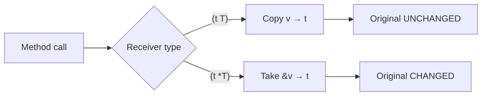
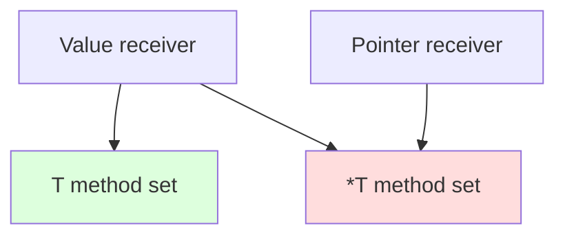

# Value Receivers — Junior Level

## Table of Contents
1. [Introduction](#introduction)
2. [Prerequisites](#prerequisites)
3. [Glossary](#glossary)
4. [Core Concepts](#core-concepts)
5. [Real-World Analogies](#real-world-analogies)
6. [Mental Models](#mental-models)
7. [Pros & Cons](#pros--cons)
8. [Use Cases](#use-cases)
9. [Code Examples](#code-examples)
10. [Coding Patterns](#coding-patterns)
11. [Clean Code](#clean-code)
12. [Product Use](#product-use)
13. [Best Practices](#best-practices)
14. [Edge Cases & Pitfalls](#edge-cases--pitfalls)
15. [Common Mistakes](#common-mistakes)
16. [Common Misconceptions](#common-misconceptions)
17. [Tricky Points](#tricky-points)
18. [Test](#test)
19. [Tricky Questions](#tricky-questions)
20. [Cheat Sheet](#cheat-sheet)
21. [Self-Assessment Checklist](#self-assessment-checklist)
22. [Summary](#summary)
23. [Diagrams](#diagrams)

---

## Introduction

**Value receiver** — the receiver type appears as `T` (no asterisk). When the method is called, a **copy** of the receiver is taken, and the method works with that copy. The original value is not modified.

```go
type Point struct{ X, Y int }

// Value receiver — p is a copy of Point
func (p Point) DistanceSq() int {
    return p.X*p.X + p.Y*p.Y
}

func main() {
    p := Point{3, 4}
    fmt.Println(p.DistanceSq()) // 25
}
```

Value receivers are ideal for Go's **immutable value** style. They are preferred for pure mathematical operations, small structs, and immutable values (Money, Color, Coordinate).

After this file you will:
- Know the syntax for writing a value receiver
- Know when value receivers are preferable
- Understand what `t` actually is inside a method
- Know the rules for choosing between pointer and value receivers

---

## Prerequisites
- Basics of functions and methods
- Understanding of `struct`
- Beginner-level knowledge of pointers

---

## Glossary

| Term | Definition |
|--------|--------|
| **Value receiver** | `func (r T)` — receiver type is a value (not a pointer) |
| **Pointer receiver** | `func (r *T)` — receiver type is a pointer |
| **Copy** | The copy taken when passing the receiver to a method |
| **Immutable** | A value that does not change |
| **Value semantics** | Working through values (not pointers) |
| **Method set** | The methods that a type owns |

---

## Core Concepts

### 1. Syntax

```go
func (receiverName TypeName) MethodName(args) ReturnType {
    // body — receiverName is of type TypeName (a COPY)
}
```

### 2. The receiver passed to the method is a copy

```go
type C struct{ n int }

func (c C) Inc() {
    c.n++   // only modifies the copy
}

c := C{}
c.Inc()
fmt.Println(c.n) // 0 — original unchanged
```

This is the main difference from a pointer receiver.

### 3. When is a value receiver preferable?

**1. Immutable value object:**

```go
type Money struct{ amount, scale int64 }

func (m Money) Add(other Money) Money {
    return Money{
        amount: m.amount + other.amount,
        scale:  m.scale,
    }
}

func (m Money) Format() string { ... }
```

`Add` returns a new `Money` — it doesn't affect the original `m`.

**2. Read-only operations:**

```go
type User struct{ name string; age int }

func (u User) IsAdult() bool { return u.age >= 18 }
func (u User) Greet() string { return "Hi " + u.name }
```

**3. Small types — copying is cheap:**

```go
type Point struct{ X, Y int }   // 16 bytes — passed in registers

func (p Point) DistanceSq() int { ... }
```

**4. Built-in type alias:**

```go
type Distance int

func (d Distance) ToMeters() int { return int(d) * 1000 }
```

### 4. Key differences from pointer receivers

| Feature | Value (`T`) | Pointer (`*T`) |
|-----------|-------------|----------------|
| Receiver | Copy | Pointer |
| Mutation | No (local) | Yes (on original) |
| Method set | On T | On *T |
| With Mutex | WRONG | CORRECT |
| Concretely | Immutable style | Stateful style |

### 5. Method set rule

A value receiver method belongs to **both the `T` and `*T`** method sets.

```go
type C struct{}
func (c C) Hello() {}

type Greeter interface { Hello() }

var c C
var p *C = &c

var _ Greeter = c    // OK
var _ Greeter = p    // OK
```

A pointer receiver method, on the other hand, is in **only the `*T`** method set.

---

## Real-World Analogies

**Analogy 1 — Certificate copy**

Value — you are given a **copy of the official document**. Writing on it does not affect the original document.

Pointer — a **reference to the original document**. If you write on it, you write on the document itself.

**Analogy 2 — Money (banknote)**

Money — an **immutable value**. You can't "modify" a single banknote. You only create a **new value** (spending, adding — a new sum).

Bank account — **mutable**. Your account number changes. Modeled with a pointer receiver.

**Analogy 3 — Function argument**

Value receiver — argument passed by value (Go's standard).
Pointer receiver — argument passed by pointer.

---

## Mental Models

### Model 1: "Receiver — hidden argument"

```go
// Method
func (p Point) DistSq() int { return p.X*p.X + p.Y*p.Y }

// Exactly equivalent
func DistSq(p Point) int { return p.X*p.X + p.Y*p.Y }

p := Point{3, 4}
p.DistSq()      // method
DistSq(p)       // function — same result
```

The method receiver is a hidden first argument (passed by value).

### Model 2: Immutable mental model

```
Value receiver semantics:
─────────────────────────────
input  → method → output
orig   → copy   → orig unchanged

This is the look: "f(x)" — pure function style
```

### Model 3: Decision map

```
Need mutation?
├── Yes → POINTER
└── No
        Type large?
        ├── Yes → POINTER (memory)
        └── No
                Mutex/sync?
                ├── Yes → POINTER (mandatory)
                └── No → VALUE (immutable, simple)
```

---

## Pros & Cons

| Pros | Cons |
|------|------|
| Immutable — fewer errors | Cannot mutate |
| Thread-safe (each goroutine has its copy) | Expensive for large types |
| Simpler mental model | Method set only on T |
| Equality check with `==` | Doesn't work with sync primitives |
| Pure-function style | |

---

## Use Cases

### Use case 1: Value object

```go
type Coordinate struct{ Lat, Lon float64 }

func (c Coordinate) DistanceTo(other Coordinate) float64 { ... }
func (c Coordinate) String() string { ... }
```

### Use case 2: Read-only computation

```go
type Stats struct{ Min, Max, Avg float64 }

func (s Stats) Range() float64 { return s.Max - s.Min }
```

### Use case 3: Built-in type alias

```go
type Celsius float64

func (c Celsius) ToFahrenheit() Fahrenheit { return Fahrenheit(c*9/5 + 32) }
```

### Use case 4: Stringer

```go
type Status int
const ( Pending Status = iota; Active; Closed )

func (s Status) String() string {
    return [...]string{"pending", "active", "closed"}[s]
}
```

### Use case 5: `error` interface (rare — usually pointer)

```go
type MyError struct{ msg string }
func (e MyError) Error() string { return e.msg }
```

---

## Code Examples

### Example 1: Basic

```go
package main

import "fmt"

type Rectangle struct{ Width, Height float64 }

func (r Rectangle) Area() float64      { return r.Width * r.Height }
func (r Rectangle) Perimeter() float64 { return 2 * (r.Width + r.Height) }

func main() {
    r := Rectangle{Width: 3, Height: 4}
    fmt.Println(r.Area())      // 12
    fmt.Println(r.Perimeter()) // 14
}
```

### Example 2: Immutable Money

```go
package main

import "fmt"

type Money struct{ Cents int }

func (m Money) Add(other Money) Money {
    return Money{Cents: m.Cents + other.Cents}
}

func (m Money) Sub(other Money) Money {
    return Money{Cents: m.Cents - other.Cents}
}

func main() {
    a := Money{Cents: 100}
    b := Money{Cents: 50}
    c := a.Add(b)             // c is a new Money
    fmt.Println(a.Cents)      // 100 — unchanged
    fmt.Println(b.Cents)      // 50 — unchanged
    fmt.Println(c.Cents)      // 150 — new
}
```

### Example 3: With type alias

```go
package main

import "fmt"

type Celsius float64
type Fahrenheit float64

func (c Celsius) ToFahrenheit() Fahrenheit {
    return Fahrenheit(c*9/5 + 32)
}

func (f Fahrenheit) ToCelsius() Celsius {
    return Celsius((f - 32) * 5 / 9)
}

func main() {
    c := Celsius(100)
    fmt.Println(c.ToFahrenheit()) // 212
}
```

### Example 4: Stringer

```go
type Day int
const ( Mon Day = iota; Tue; Wed; Thu; Fri; Sat; Sun )

func (d Day) String() string {
    return [...]string{"Mon", "Tue", "Wed", "Thu", "Fri", "Sat", "Sun"}[d]
}

func main() {
    fmt.Println(Wed) // Wed
}
```

### Example 5: Comparison

```go
type Color struct{ R, G, B uint8 }

func (c Color) Equals(other Color) bool {
    return c.R == other.R && c.G == other.G && c.B == other.B
}

func main() {
    red := Color{255, 0, 0}
    other := Color{255, 0, 0}
    fmt.Println(red.Equals(other)) // true
    fmt.Println(red == other)      // true (Go compares structs)
}
```

---

## Coding Patterns

### Pattern 1: Builder-style immutable

```go
type Query struct{ where, order string }

func NewQuery() Query { return Query{} }
func (q Query) Where(c string) Query { q.where = c; return q }
func (q Query) OrderBy(c string) Query { q.order = c; return q }

q := NewQuery().Where("active = true").OrderBy("name")
```

Each method returns a new `Query` — immutable.

### Pattern 2: Wither methods

```go
type Config struct{ port int; debug bool }

func (c Config) WithPort(p int) Config { c.port = p; return c }
func (c Config) WithDebug() Config     { c.debug = true; return c }
```

The `With*` prefix signals the immutable-update style.

### Pattern 3: Constructor returning value

```go
func NewPoint(x, y int) Point { return Point{X: x, Y: y} }
```

For small types — return a value, not a pointer.

---

## Clean Code

### Rule 1: Don't mutate

```go
// Bad
func (m Money) AddBad(other Money) {
    m.Cents += other.Cents  // useless — modifies the local copy
}

// Good — return a new value
func (m Money) Add(other Money) Money {
    return Money{Cents: m.Cents + other.Cents}
}
```

### Rule 2: Keep receiver names short

```go
// Bad
func (rectangle Rectangle) Area() float64 { ... }

// Good
func (r Rectangle) Area() float64 { ... }
```

### Rule 3: One type — one style

```go
// Good — all value receivers (Money is immutable)
func (m Money) Add(other Money) Money { ... }
func (m Money) Sub(other Money) Money { ... }
func (m Money) String() string         { ... }
```

---

## Product Use

```go
package main

import "fmt"

type Currency string
const ( USD Currency = "USD"; EUR Currency = "EUR" )

type Price struct {
    Amount   int64    // cents
    Currency Currency
}

func (p Price) Add(other Price) (Price, error) {
    if p.Currency != other.Currency {
        return Price{}, fmt.Errorf("currency mismatch: %s vs %s", p.Currency, other.Currency)
    }
    return Price{Amount: p.Amount + other.Amount, Currency: p.Currency}, nil
}

func (p Price) Format() string {
    return fmt.Sprintf("%.2f %s", float64(p.Amount)/100, p.Currency)
}

func main() {
    a := Price{Amount: 1500, Currency: USD}
    b := Price{Amount: 2500, Currency: USD}
    sum, _ := a.Add(b)
    fmt.Println(sum.Format()) // 40.00 USD
}
```

---

## Best Practices

1. **Immutable value object** — value receiver
2. **Read-only operation** — value receiver
3. **Small type** (≤16-32 bytes) — value receiver
4. **`Stringer`/`Error` implementation** — usually a value receiver
5. **Don't mutate** — return a new value
6. **Keep receiver names short and consistent**
7. **Consistent style for a single type**

---

## Edge Cases & Pitfalls

### Pitfall 1: Attempting to mutate

```go
type C struct{ n int }
func (c C) Inc() { c.n++ }   // USELESS — modifies the copy
```

### Pitfall 2: Mutex with value receiver

```go
type X struct{ mu sync.Mutex }
func (x X) M() { x.mu.Lock() }   // RACE — the mutex is copied
```

### Pitfall 3: Large type copied on every call

```go
type Big struct{ data [10000]int }
func (b Big) Sum() int { ... }   // 80KB copy on every call
```

### Pitfall 4: Slice receiver nuance

```go
type S []int
func (s S) Add(x int) { s = append(s, x) }  // USELESS — outer slice not changed
```

Slice value receiver — the slice header is copied, but the underlying array is the same. The result of `append` is lost.

---

## Common Mistakes

| Mistake | Cause | Solution |
|------|-------|--------|
| Mutating in a value receiver | Modifies the copy | Pointer receiver or return a value |
| Mutex with value receiver | The lock is copied | Pointer is needed |
| Large type passed by value | Memory pressure | Use a pointer |
| Not returning slice append result | Local slice header | `*` or return |

---

## Common Misconceptions

**1. "A value receiver is always slower"**
False. For small types it can be faster.

**2. "A value receiver is always immutable"**
Partially. The receiver is a value, but if the receiver has pointer/slice/map fields — those can still be mutated.

```go
type Box struct{ items []int }
func (b Box) Add(x int) { b.items = append(b.items, x) }  // append result not returned
func (b Box) AddInPlace(x int) {
    if cap(b.items) > len(b.items) {
        b.items = b.items[:len(b.items)+1]
        b.items[len(b.items)-1] = x  // underlying array is modified
    }
}
```

**3. "A value receiver method does not work on nil"**
False. A value receiver — it's a value (struct), it can't be nil (it's not a pointer).

---

## Tricky Points

### Mutating slice contents

```go
type S struct{ items []int }
func (s S) ZeroFirst() { s.items[0] = 0 }   // AFFECTS original slice (underlying array)

s := S{items: []int{1, 2, 3}}
s.ZeroFirst()
fmt.Println(s.items)  // [0 2 3] — slice header is a copy, but the array is the same
```

This nuance — you cannot say "value receiver means no mutation". Slice/map/pointer fields can still be mutated.

### Mutating map contents

```go
type Cache struct{ m map[string]string }
func (c Cache) Set(k, v string) { c.m[k] = v }  // AFFECTS the original map

c := Cache{m: map[string]string{}}
c.Set("a", "1")
fmt.Println(c.m["a"])  // "1"
```

A map value receiver also mutates — because even though the map header is copied, the underlying map data is shared.

---

## Test

### 1. What does the following code output?
```go
type C struct{ n int }
func (c C) Inc() { c.n++ }

c := C{n: 5}
c.Inc()
fmt.Println(c.n)
```
- a) 5
- b) 6
- c) 0
- d) Compile error

**Answer: a — 5**

### 2. Which method sets does a value receiver method belong to?
- a) Only T
- b) Only *T
- c) Both T and *T
- d) None

**Answer: c**

### 3. `time.Time.Add(d Duration) time.Time` — value or pointer receiver?
- a) Value
- b) Pointer
- c) Mixed
- d) Depends

**Answer: a — value (immutable Time)**

### 4. For a small type (8 bytes), which receiver is faster?
- a) Value
- b) Pointer
- c) Same
- d) Depends

**Answer: a — value (register copy)**

### 5. Writing a value receiver on a type that contains a Mutex?
- a) OK
- b) Compile error
- c) Race condition risk
- d) Only for getter methods

**Answer: c — race condition (mutex is copied)**

---

## Tricky Questions

**Q1: Can you mutate a slice field in a value receiver?**
The slice header is a copy, but the underlying array is the same. Modifying indexed elements affects the original. `append`, however, only affects the local copy.

**Q2: If I do `c = C{...}` inside a method, does the original change?**
No — `c` is a local copy. The change is preserved only if the caller saves the `C` returned by the method.

**Q3: Can the `Stringer` interface be satisfied with a value receiver?**
Yes. `fmt.Stringer` only requires `String() string` — a value receiver satisfies it.

**Q4: Can you return `error` from a value receiver?**
Of course. The method's return type is up to you.

**Q5: `Equal()` method — which receiver?**
Usually value — `func (a A) Equal(b A) bool`. Nothing is modified.

---

## Cheat Sheet

```
SYNTAX
─────────────────
func (r T) Method() { ... }
                 ↑
           NOT a pointer — VALUE

WHEN TO USE?
─────────────────
✓ Immutable value object
✓ Read-only operation
✓ Small type (<32 bytes)
✓ Built-in type alias
✓ Stringer/Equal style
✗ Mutation
✗ Sync primitive
✗ Large type

METHOD SET
─────────────────
Value receiver method:
  In T method set    ✓
  In *T method set   ✓ (both)

COPY SEMANTICS
─────────────────
Inside the method body, `t` is a copy of the receiver
Mutation — local
Slice/map/pointer fields — underlying data shared
```

---

## Self-Assessment Checklist

- [ ] I can write the value receiver syntax
- [ ] I can justify the choice between pointer and value receivers
- [ ] I know that the receiver inside a method is a copy
- [ ] I know the slice/map field nuances
- [ ] I know the method set rules
- [ ] I can use the immutable value object pattern
- [ ] I know the danger of a mutex value receiver

---

## Summary

A value receiver is the main tool for Go's **immutable** style. It is written as `func (t T) M()`, and a **copy** of `t` is passed to the method.

Main rules:
- Immutable value object → value
- Read-only operation → value
- Small type → value (faster)
- Mutex/atomic → NOT value (race condition)
- Need to mutate → pointer

In terms of method sets, a value receiver is preferable — it belongs to both `T` and `*T`. A pointer receiver only belongs to `*T`.

---

## Diagrams

### Value vs Pointer receiver



### Method set inclusion


