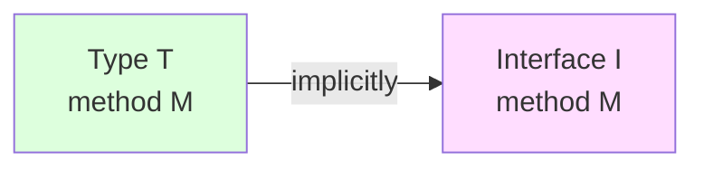
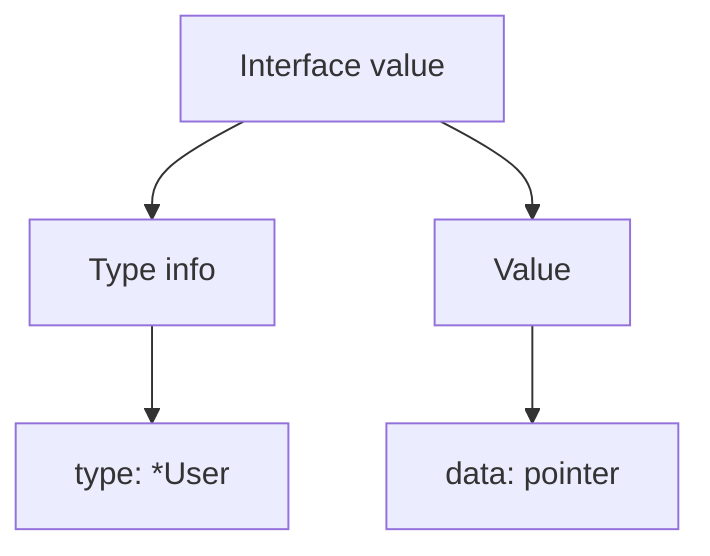
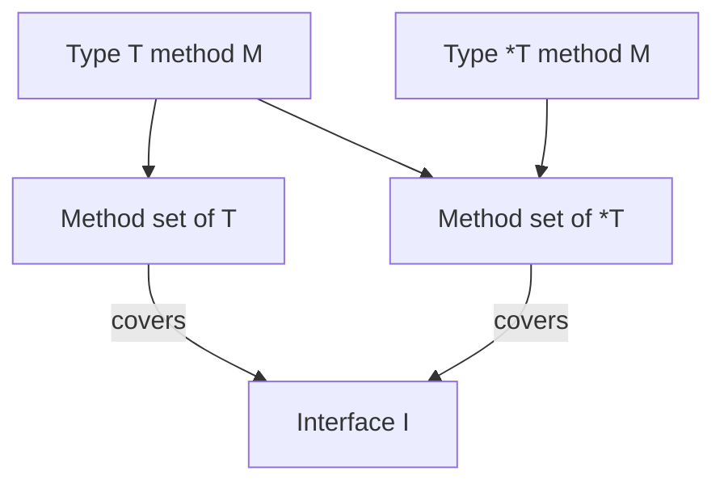

# Interfaces Basics — Junior Level

## Table of Contents
1. [Introduction](#introduction)
2. [Prerequisites](#prerequisites)
3. [Glossary](#glossary)
4. [Core Concepts](#core-concepts)
5. [Real-World Analogies](#real-world-analogies)
6. [Mental Models](#mental-models)
7. [Pros & Cons](#pros--cons)
8. [Use Cases](#use-cases)
9. [Code Examples](#code-examples)
10. [Coding Patterns](#coding-patterns)
11. [Clean Code](#clean-code)
12. [Product Use](#product-use)
13. [Error Handling](#error-handling)
14. [Best Practices](#best-practices)
15. [Edge Cases & Pitfalls](#edge-cases--pitfalls)
16. [Common Mistakes](#common-mistakes)
17. [Common Misconceptions](#common-misconceptions)
18. [Tricky Points](#tricky-points)
19. [Test](#test)
20. [Tricky Questions](#tricky-questions)
21. [Cheat Sheet](#cheat-sheet)
22. [Self-Assessment Checklist](#self-assessment-checklist)
23. [Summary](#summary)
24. [Diagrams](#diagrams)

---

## Introduction

An interface is the mechanism that enables polymorphism in Go. An interface is a **named set of methods**. If a type defines those methods, it automatically (implicitly) satisfies the interface — there is NO `implements` keyword.

```go
// Interface definition
type Stringer interface {
    String() string
}

// Create a type
type User struct{ Name string }

// Add a method that satisfies the interface
func (u User) String() string {
    return "User: " + u.Name
}

// User automatically satisfies Stringer
var s Stringer = User{Name: "Alice"}
fmt.Println(s.String())  // User: Alice
```

The interface is one of Go's most powerful features. It lets you invert **dependencies**, write **mocks**, and produce **extensible** code.

After this file you will:
- Know how to define and satisfy an interface
- Understand implicit satisfaction
- Know the most common interfaces (Stringer, error, Reader)
- Be able to use polymorphism the Go way

---

## Prerequisites
- Method basics
- Pointer vs value receiver
- Method set rules

---

## Glossary

| Term | Definition |
|--------|--------|
| **Interface type** | The name of a set of methods |
| **Implicit satisfaction** | A type satisfies an interface automatically once it defines the methods |
| **Method set** | The set of methods a type has |
| **Concrete type** | A real type (struct or primitive) |
| **Interface value** | A value of an interface type — internally `(type, value)` |
| **nil interface** | `(nil, nil)` — the interface value is empty |
| **Polymorphism** | The same method name produces different behavior across types |

---

## Core Concepts

### 1. Interface definition

```go
type InterfaceName interface {
    Method1(args) ReturnType
    Method2(args) ReturnType
    // ...
}
```

Example:

```go
type Animal interface {
    Sound() string
    Name() string
}
```

### 2. Implicit satisfaction

If a type implements the methods declared by an interface, it satisfies it **automatically**:

```go
type Dog struct{ name string }

func (d Dog) Sound() string { return "Woof" }
func (d Dog) Name() string  { return d.name }

// Dog automatically satisfies the Animal interface
var a Animal = Dog{name: "Rex"}
fmt.Println(a.Sound()) // Woof
```

You do NOT need to write `Dog implements Animal` — the compiler checks the method set.

### 3. Polymorphism

The same method name — different behavior across types:

```go
type Cat struct{ name string }
func (c Cat) Sound() string { return "Meow" }
func (c Cat) Name() string  { return c.name }

func describe(a Animal) {
    fmt.Printf("%s says %s\n", a.Name(), a.Sound())
}

describe(Dog{name: "Rex"})    // Rex says Woof
describe(Cat{name: "Whiskers"}) // Whiskers says Meow
```

`describe` is a single piece of code, but it works with multiple types.

### 4. Empty interface — `interface{}` (Go 1.18+ — `any`)

An interface with no methods accepts any type:

```go
var x interface{} = 42
var y interface{} = "hello"
var z interface{} = []int{1, 2, 3}

// Go 1.18+
var w any = 3.14
```

(More detail in the "Empty Interfaces" section.)

### 5. The most common standard interfaces

| Interface | Methods | Purpose |
|-----------|-----------|--------|
| `error` | `Error() string` | Return an error |
| `fmt.Stringer` | `String() string` | Print formatting |
| `io.Reader` | `Read([]byte) (int, error)` | Read from a stream |
| `io.Writer` | `Write([]byte) (int, error)` | Write to a stream |
| `io.Closer` | `Close() error` | Close a resource |

---

## Real-World Analogies

**Analogy 1 — Job description**

An interface is a job description: "who can do this job?". The description lists required skills (`Sound()`, `Name()`). Anyone who has those skills gets hired.

**Analogy 2 — USB port**

A USB port is an interface. Any device that satisfies the USB protocol (keyboard, mouse, flash drive) can work with the computer.

**Analogy 3 — Restaurant menu**

A menu is an interface ("Pizza", "Salad"). Any type that can prepare pizza or salad can run the kitchen.

---

## Mental Models

### Model 1: "Interface — silent satisfaction"

```
Type A defines the methods → Interface I is automatically satisfied
                          ↓
                  no "implements" keyword
```

### Model 2: Inside an interface

```
Interface value = (type, value)

Example:
var a Animal = Dog{name: "Rex"}
        ↓
a = (type: Dog, value: Dog{name: "Rex"})
```

### Model 3: Caller and callee independence

```
Caller requires      → Interface (small, focused)
Callee implements    → Concrete type
```

The caller knows only the interface — in the future it can use a different concrete type.

---

## Pros & Cons

| Pros | Cons |
|------|------|
| Polymorphism | Runtime overhead (small) |
| Easy to mock | The concrete type may be hidden |
| Decoupling (separates dependencies) | Interface design can be hard |
| Extensible | Implicit — find-references is harder |
| Test-driven design | Adding a new method is breaking |

---

## Use Cases

### Use case 1: Polymorphism

```go
type Shape interface { Area() float64 }

func TotalArea(shapes []Shape) float64 {
    total := 0.0
    for _, s := range shapes { total += s.Area() }
    return total
}

shapes := []Shape{Circle{R: 5}, Square{Side: 3}}
fmt.Println(TotalArea(shapes))
```

### Use case 2: Dependency injection

```go
type Logger interface { Log(msg string) }

type Service struct{ logger Logger }

func (s *Service) DoWork() {
    s.logger.Log("working...")
}

// In production
s := &Service{logger: &FileLogger{}}

// In tests
s := &Service{logger: &MockLogger{}}
```

### Use case 3: Standard interfaces

```go
type User struct{ Name string }
func (u User) String() string { return "User: " + u.Name }

fmt.Println(User{Name: "Alice"})  // User: Alice (Stringer)
```

### Use case 4: Error handling

```go
type NetworkError struct{ msg string }
func (e *NetworkError) Error() string { return e.msg }

func fetch() error {
    return &NetworkError{msg: "connection failed"}
}
```

---

## Code Examples

### Example 1: Simple interface

```go
package main

import "fmt"

type Greeter interface {
    Hello() string
}

type English struct{}
func (e English) Hello() string { return "Hello!" }

type Uzbek struct{}
func (u Uzbek) Hello() string { return "Salom!" }

func greet(g Greeter) {
    fmt.Println(g.Hello())
}

func main() {
    greet(English{}) // Hello!
    greet(Uzbek{})   // Salom!
}
```

### Example 2: Shape polymorphism

```go
package main

import (
    "fmt"
    "math"
)

type Shape interface {
    Area() float64
    Perimeter() float64
}

type Circle struct{ R float64 }
func (c Circle) Area() float64      { return math.Pi * c.R * c.R }
func (c Circle) Perimeter() float64 { return 2 * math.Pi * c.R }

type Rectangle struct{ W, H float64 }
func (r Rectangle) Area() float64      { return r.W * r.H }
func (r Rectangle) Perimeter() float64 { return 2 * (r.W + r.H) }

func describe(s Shape) {
    fmt.Printf("Area: %.2f, Perimeter: %.2f\n", s.Area(), s.Perimeter())
}

func main() {
    describe(Circle{R: 5})        // Area: 78.54, Perimeter: 31.42
    describe(Rectangle{W: 3, H: 4}) // Area: 12.00, Perimeter: 14.00
}
```

### Example 3: Logger interface

```go
package main

import "fmt"

type Logger interface {
    Log(level, msg string)
}

type ConsoleLogger struct{}
func (c ConsoleLogger) Log(level, msg string) {
    fmt.Printf("[%s] %s\n", level, msg)
}

type Service struct{ logger Logger }

func (s *Service) DoWork() {
    s.logger.Log("INFO", "working")
}

func main() {
    s := &Service{logger: ConsoleLogger{}}
    s.DoWork()  // [INFO] working
}
```

### Example 4: Stringer

```go
package main

import "fmt"

type Color struct{ R, G, B uint8 }

func (c Color) String() string {
    return fmt.Sprintf("rgb(%d,%d,%d)", c.R, c.G, c.B)
}

func main() {
    c := Color{255, 0, 0}
    fmt.Println(c)  // rgb(255,0,0) — fmt automatically calls String()
}
```

### Example 5: Custom error

```go
package main

import "fmt"

type ValidationError struct{ Field, Msg string }

func (e *ValidationError) Error() string {
    return fmt.Sprintf("validation: %s: %s", e.Field, e.Msg)
}

func validate(name string) error {
    if name == "" {
        return &ValidationError{Field: "name", Msg: "required"}
    }
    return nil
}

func main() {
    if err := validate(""); err != nil {
        fmt.Println(err)  // validation: name: required
    }
}
```

---

## Coding Patterns

### Pattern 1: Focused interface (small interface)

```go
// Good — small, single responsibility
type Reader interface {
    Read([]byte) (int, error)
}

// Bad — large, many responsibilities
type ReadWriteCloseFlush interface {
    Read(...) ...
    Write(...) ...
    Close() ...
    Flush() ...
}
```

In Go, "the bigger the interface, the weaker the abstraction".

### Pattern 2: Interface on the caller side

```go
// The caller (consumer) declares the interface
package handler

type UserRepo interface {
    Find(id string) (*User, error)
}

func NewHandler(repo UserRepo) *Handler { ... }

// Producer (concrete) type
package storage

type PgUserRepo struct{ db *sql.DB }
func (r *PgUserRepo) Find(id string) (*User, error) { ... }
```

### Pattern 3: Accept interfaces, return structs

```go
// Good
func NewService(logger Logger) *Service { ... }   // accept interface

// OK
func NewService(logger Logger) Service { ... }    // also OK, but pointer is preferred

// Bad
func NewLogger() Logger { ... }   // returning an interface hides the concrete type
```

---

## Clean Code

### Rule 1: Keep interfaces small

```go
// Good
type Reader interface { Read([]byte) (int, error) }
type Writer interface { Write([]byte) (int, error) }

// Bad (although the standard library does this — for composition)
type ReadWriter interface { Reader; Writer }
```

### Rule 2: Method names should be short and precise

```go
// Good
type Closer interface { Close() error }

// Bad
type Closer interface { CloseTheResource() error }
```

### Rule 3: Place interfaces close to the caller

Put the interface where it is used — close to the consumer package, not on the producer side.

---

## Product Use

```go
package main

import (
    "fmt"
    "strings"
)

// Domain
type EmailService interface {
    Send(to, subject, body string) error
}

// Adapter — SMTP
type SMTPService struct{ host string }
func (s *SMTPService) Send(to, subject, body string) error {
    fmt.Printf("[SMTP] %s | %s | %s\n", to, subject, body)
    return nil
}

// Adapter — fake (test)
type FakeService struct{ Sent []string }
func (s *FakeService) Send(to, subject, body string) error {
    s.Sent = append(s.Sent, fmt.Sprintf("%s|%s", to, subject))
    return nil
}

// Use case
type Notifier struct{ email EmailService }

func (n *Notifier) NotifyUser(to string) error {
    return n.email.Send(to, "Welcome", "Hi!")
}

func main() {
    n := &Notifier{email: &SMTPService{host: "smtp.example.com"}}
    n.NotifyUser("alice@example.com")

    fake := &FakeService{}
    n2 := &Notifier{email: fake}
    n2.NotifyUser("bob@example.com")
    fmt.Println(strings.Join(fake.Sent, ", ")) // bob@example.com|Welcome
}
```

---

## Error Handling

`error` is Go's most important interface:

```go
type error interface {
    Error() string
}
```

Custom error type:

```go
type NotFoundError struct{ ID string }
func (e *NotFoundError) Error() string { return "not found: " + e.ID }

// Construct
err := &NotFoundError{ID: "u1"}

// Check
if err != nil {
    fmt.Println(err)
}

// Type assertion
if nf, ok := err.(*NotFoundError); ok {
    fmt.Println("ID:", nf.ID)
}
```

---

## Best Practices

1. **Keep interfaces small** — 1–3 methods is preferred
2. **Declare on the caller side** — in the consumer package
3. **Return concrete types, accept interfaces**
4. **Lean on implicit satisfaction** — to reduce coupling
5. **Satisfy standard interfaces** (Stringer, error, Reader)
6. **Create interfaces for mocking** — for testing
7. **Avoid premature abstraction** — create an interface when it is needed

---

## Edge Cases & Pitfalls

### Pitfall 1: Pointer receiver method and value type

```go
type S struct{}
func (s *S) M() {}

type I interface { M() }

var _ I = S{}     // ERROR — M is not in S's method set
var _ I = &S{}    // OK
```

### Pitfall 2: Nil interface vs nil concrete

```go
var p *S = nil
var i I = p    // i is NOT nil! i = (type: *S, value: nil)
fmt.Println(i == nil)  // false
```

This is a very famous trap.

### Pitfall 3: Empty interface — any type

```go
var x interface{} = nil
fmt.Println(x == nil)  // true

var p *int = nil
var y interface{} = p
fmt.Println(y == nil)  // false
```

---

## Common Mistakes

| Mistake | Solution |
|------|--------|
| Big interface | A small interface with 1–3 methods |
| Returning an interface (instead of concrete) | Return a concrete struct |
| nil pointer interface comparison | Check on the concrete type |
| Looking for an `implements` keyword | It is implicit — there is no such keyword |

---

## Common Misconceptions

**1. "Go interfaces are the same as Java/C# interfaces"**
Partially. A Go interface is implicit, not declared. If a type defines the methods, it satisfies the interface.

**2. "Interfaces are faster"**
False. Interface dispatch goes through the itab and adds a small overhead.

**3. "Interfaces are needed everywhere"**
False. Only when you need polymorphism or mocking.

---

## Tricky Points

### The nil interface problem

```go
type MyErr struct{}
func (e *MyErr) Error() string { return "err" }

func doit() error {
    var e *MyErr   // nil
    return e       // returns interface (type: *MyErr, value: nil)
}

err := doit()
fmt.Println(err == nil)  // false! — interface value is not nil
```

Solution:
```go
func doit() error {
    var e *MyErr
    if e == nil { return nil }
    return e
}
```

---

## Test

### 1. What is required to satisfy an interface?
- a) The `implements` keyword
- b) The method set must cover the interface methods
- c) Inheritance
- d) Type assertion

**Answer: b**

### 2. `var s Stringer = User{}` — if User has the `String() string` method, does this work?
- a) Yes, with a value receiver
- b) Only with a pointer receiver
- c) Never
- d) Only with go vet

**Answer: a**

### 3. The empty interface (`interface{}`) accepts:
- a) Only struct
- b) Only pointer
- c) No type
- d) Any type

**Answer: d**

### 4. `var p *S = nil; var i I = p; i == nil` — result?
- a) true
- b) false
- c) panic
- d) compile error

**Answer: b**

### 5. If the receiver is a pointer, does `T` satisfy the interface?
- a) Yes
- b) No, only *T
- c) Only if the method is elided
- d) It depends

**Answer: b**

---

## Tricky Questions

**Q1: Can a single type satisfy multiple interfaces?**
Yes. As long as its method set covers the methods of every interface.

**Q2: Can an interface be empty in terms of its own methods?**
Yes — `interface{}` (or `any`). It accepts any type.

**Q3: Can an interface itself own methods?**
No. It only **declares** methods (signatures). Implementation belongs to the type.

**Q4: What is the difference between a `nil` interface and a `nil` concrete?**
An interface value is `(type, value)` internally. The interface is nil only when both are nil. If the type is set but the value is nil — the interface is not nil.

**Q5: When is an interface not needed?**
When only a single concrete type is used — an interface is not needed. Create one when polymorphism or mocking is required.

---

## Cheat Sheet

```
INTERFACE DEFINITION
─────────────────
type I interface {
    Method1(args) ReturnType
    Method2(args) ReturnType
}

SATISFACTION (implicit)
─────────────────
type T struct{}
func (t T) Method1(...) ... { ... }
func (t T) Method2(...) ... { ... }
// T automatically satisfies I

INTERFACE VALUE
─────────────────
var i I = T{}   // i = (type: T, value: T{})
i = nil         // i = (nil, nil) — true nil

NIL TRAP
─────────────────
var p *S = nil
var i I = p     // i = (*S, nil) — NOT nil!

STANDARD INTERFACES
─────────────────
error          → Error() string
fmt.Stringer   → String() string
io.Reader      → Read([]byte) (int, error)
io.Writer      → Write([]byte) (int, error)
io.Closer      → Close() error

CHOICE
─────────────────
Need polymorphism → interface
Need mock testing → interface
Only one type     → concrete (no interface needed)
```

---

## Self-Assessment Checklist

- [ ] I can write an interface definition
- [ ] I understand implicit satisfaction
- [ ] I know the standard interfaces (error, Stringer, Reader, Writer)
- [ ] I know the difference between nil interface and nil concrete
- [ ] I know when an interface is needed and when it is not
- [ ] I understand the rule that interfaces should be small
- [ ] I can use polymorphism with interfaces

---

## Summary

The interface is Go's tool for polymorphism and decoupling. Key points:

- **Implicit satisfaction** — no `implements` needed
- **Method set rules** — pointer/value receiver matters
- **Small interface** — 1–3 methods preferred
- **Declared on the caller side** — in the consumer package
- **Accept interface, return concrete** — the Go style
- **Standard interfaces** — error, Stringer, Reader, Writer

Interfaces let you write testable, extensible, and independent components.

---

## Diagrams

### Implicit satisfaction



### Interface value internals



### Method set + interface


