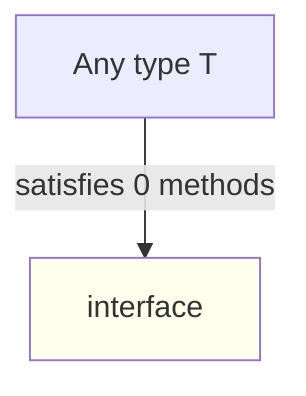
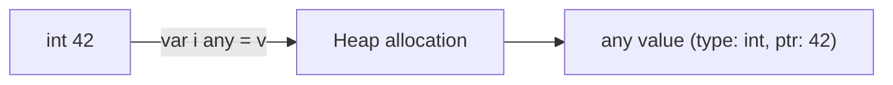

# Empty Interfaces — Junior Level

## Table of Contents
1. [Introduction](#introduction)
2. [Prerequisites](#prerequisites)
3. [Glossary](#glossary)
4. [Core Concepts](#core-concepts)
5. [Real-World Analogies](#real-world-analogies)
6. [Mental Models](#mental-models)
7. [Pros & Cons](#pros--cons)
8. [Use Cases](#use-cases)
9. [Code Examples](#code-examples)
10. [Coding Patterns](#coding-patterns)
11. [Clean Code](#clean-code)
12. [Best Practices](#best-practices)
13. [Edge Cases & Pitfalls](#edge-cases--pitfalls)
14. [Common Mistakes](#common-mistakes)
15. [Common Misconceptions](#common-misconceptions)
16. [Test](#test)
17. [Tricky Questions](#tricky-questions)
18. [Cheat Sheet](#cheat-sheet)
19. [Summary](#summary)
20. [Diagrams](#diagrams)

---

## Introduction

**Empty interface** — an interface with no methods. Syntax:

```go
interface{}
```

Since Go 1.18, there is a new name for it: `any`.

```go
type any = interface{}   // Go 1.18+ predeclared alias
```

The empty interface accepts any type — because every type satisfies "0 methods".

```go
var x any = 42
var y any = "hello"
var z any = []int{1, 2, 3}
var w any = struct{ Name string }{Name: "Alice"}
```

The empty interface is Go's element of **dynamic typing**. However, Go's strength is static typing, so the empty interface should be used **only when needed**:
- Heterogeneous collection (values of different types)
- Pre-generics packages (before 1.18)
- Working with reflect
- Generic JSON unmarshal

After this file you will:
- Know the difference between empty interface (`interface{}` and `any`)
- Understand when to use it and when not to
- Know how to determine the type via type assertion
- Know what to choose when a generic alternative is available

---

## Prerequisites
- Interfaces basics
- Type assertion (basic understanding)
- Method set rules

---

## Glossary

| Term | Definition |
|--------|--------|
| **Empty interface** | `interface{}` — an interface with no methods |
| **`any`** | Go 1.18+ predeclared alias for `interface{}` |
| **Boxing** | Moving a value type to the heap when assigning it to an interface |
| **Type assertion** | Accessing the concrete type from an interface: `i.(T)` |
| **Type switch** | Checking multiple types |
| **Heterogeneous collection** | Storing values of different types |

---

## Core Concepts

### 1. Empty interface — any type

```go
var x interface{} = 42        // int
var y interface{} = "hello"   // string
var z interface{} = true      // bool
```

The reason — every type satisfies "0 methods".

### 2. `any` — Go 1.18+

```go
var x any = 42  // same result — interface{}
```

`any` is the newest and idiomatic form. The Go community recommends using `any` instead of `interface{}`.

### 3. Getting the type with type assertion

```go
var i any = "hello"

s, ok := i.(string)
if ok {
    fmt.Println("string:", s)
}
```

The two-value form is safe — no panic when `ok` is false.

### 4. Type switch for multiple types

```go
func describe(i any) {
    switch v := i.(type) {
    case int:    fmt.Println("int:", v)
    case string: fmt.Println("string:", v)
    case bool:   fmt.Println("bool:", v)
    default:     fmt.Println("unknown")
    }
}

describe(42)       // int: 42
describe("hello")  // string: hello
```

### 5. Slice/map/function argument

```go
items := []any{1, "hello", true, 3.14}
for _, item := range items {
    fmt.Println(item)
}
// Output: 1 hello true 3.14
```

### 6. Generic JSON unmarshal

```go
var data any
json.Unmarshal([]byte(`{"name":"Alice","age":30}`), &data)
// data — map[string]any{"name":"Alice", "age":30}
```

---

## Real-World Analogies

**Analogy 1 — Universal bag**

The empty interface is like a universal bag. You can put anything inside: a book, a key, a phone. But you can't tell what's inside just by looking at the bag — you have to open it (type assertion).

**Analogy 2 — Document folder**

`any` is a universal document folder. You don't know what's inside — you have to open the folder and find out the document type.

**Analogy 3 — JSON / dynamic language**

The empty interface is like JavaScript or Python's dynamic typing in Go. But you have to do runtime type checking.

---

## Mental Models

### Model 1: "0 methods = satisfied"

```
interface I { /* 0 methods */ }
                                  ↓
every type automatically satisfies 0 methods
                                  ↓
every type satisfies I
```

### Model 2: Boxing and unboxing

```
Box (bag):   any
Unbox (open): type assertion / type switch
```

### Model 3: Static vs dynamic

```
Static  → concrete type: type-safe, fast
Dynamic → any:           flexible, slow, error-prone
```

Go is dedicated to static typing — the empty interface is used only when needed.

---

## Pros & Cons

| Pros | Cons |
|------|------|
| Accepts any type | Type-safety is lost |
| Heterogeneous collection possible | Type assertion adds extra code |
| Works with reflect | Boxing — heap allocation |
| JSON / dynamic data | Performance — generics are faster |

---

## Use Cases

### Use case 1: Heterogeneous collection

```go
items := []any{1, "hello", true, 3.14}
```

### Use case 2: Generic container (before 1.18)

```go
type List struct{ items []any }
func (l *List) Add(x any)     { l.items = append(l.items, x) }
func (l *List) Get(i int) any { return l.items[i] }
```

In Go 1.18+ generics are preferred:

```go
type List[T any] struct{ items []T }
```

### Use case 3: Generic JSON unmarshal

```go
var data any
json.Unmarshal([]byte(jsonStr), &data)
```

### Use case 4: Working with reflect

```go
import "reflect"

func inspect(x any) {
    t := reflect.TypeOf(x)
    fmt.Println("type:", t)
}
```

### Use case 5: `fmt.Println` arguments

```go
fmt.Println("a", 1, true, 3.14)   // various types
// fmt.Println signature: func(...any)
```

---

## Code Examples

### Example 1: Basics

```go
package main

import "fmt"

func main() {
    var x any = 42
    fmt.Println(x)        // 42
    fmt.Printf("%T\n", x) // int
}
```

### Example 2: Type assertion

```go
package main

import "fmt"

func main() {
    var i any = "hello"

    s, ok := i.(string)
    if ok {
        fmt.Println("got string:", s)
    } else {
        fmt.Println("not a string")
    }

    n, ok := i.(int)
    if ok {
        fmt.Println("got int:", n)
    } else {
        fmt.Println("not an int")  // this runs
    }
}
```

### Example 3: Type switch

```go
package main

import "fmt"

func describe(i any) string {
    switch v := i.(type) {
    case int:
        return fmt.Sprintf("int: %d", v)
    case string:
        return fmt.Sprintf("string: %s", v)
    case bool:
        return fmt.Sprintf("bool: %t", v)
    case []int:
        return fmt.Sprintf("[]int with %d elements", len(v))
    default:
        return "unknown"
    }
}

func main() {
    fmt.Println(describe(42))           // int: 42
    fmt.Println(describe("hello"))      // string: hello
    fmt.Println(describe(true))         // bool: true
    fmt.Println(describe([]int{1, 2}))  // []int with 2 elements
}
```

### Example 4: Heterogeneous slice

```go
package main

import "fmt"

func main() {
    items := []any{1, "two", 3.0, true}
    for _, item := range items {
        fmt.Printf("%v (type %T)\n", item, item)
    }
}
```

### Example 5: Generic JSON

```go
package main

import (
    "encoding/json"
    "fmt"
)

func main() {
    jsonStr := `{"name":"Alice","age":30,"tags":["a","b"]}`

    var data any
    json.Unmarshal([]byte(jsonStr), &data)

    fmt.Println(data)
    // map[age:30 name:Alice tags:[a b]]

    if m, ok := data.(map[string]any); ok {
        fmt.Println("name:", m["name"])
    }
}
```

---

## Coding Patterns

### Pattern 1: Variadic any

```go
func PrintAll(args ...any) {
    for _, a := range args { fmt.Println(a) }
}

PrintAll(1, "two", 3.0)
```

### Pattern 2: Map[string]any

```go
config := map[string]any{
    "name":    "MyApp",
    "version": 1,
    "debug":   true,
}
```

### Pattern 3: Generic return

```go
// Before 1.18
func GetValue(key string) any { ... }

// 1.18+
func GetValue[T any](key string) T { ... }
```

---

## Clean Code

### Rule 1: Only when needed

```go
// Bad — concrete type is clear
func Process(data any) { ... }

// Good
func Process(data User) { ... }
```

### Rule 2: Check `any` before unboxing

```go
v, ok := i.(string)
if !ok { return errors.New("expected string") }
```

### Rule 3: Use generics (1.18+)

```go
// Bad
func Sum(xs []any) int {
    total := 0
    for _, x := range xs { total += x.(int) }
    return total
}

// Good
func Sum[T int | float64](xs []T) T {
    var total T
    for _, x := range xs { total += x }
    return total
}
```

---

## Best Practices

1. **Prefer concrete types** — type-safety
2. **Use generics** for Go 1.18+
3. **`any`** instead of `interface{}` (modern style)
4. **Type assertion two-value** — with `ok`
5. **Type switch** — for multiple types
6. **Use `reflect` carefully** — it reduces performance
7. **Documentation** — document the accepted types

---

## Edge Cases & Pitfalls

### Pitfall 1: Nil any

```go
var i any = nil
fmt.Println(i == nil)  // true

var p *int = nil
var j any = p
fmt.Println(j == nil)  // false! — type is present
```

### Pitfall 2: Boxing

```go
var x int = 42
var i any = x   // 42 is moved to the heap
```

Check with `go build -gcflags='-m'`.

### Pitfall 3: Type assertion panic

```go
var i any = 42
s := i.(string)   // PANIC
```

Use the two-value form.

### Pitfall 4: Comparison panic

```go
var i any = []int{1}
var j any = []int{1}
i == j   // PANIC — slice not comparable
```

---

## Common Mistakes

| Mistake | Solution |
|------|--------|
| any instead of type-safety | Concrete type or generics |
| Type assertion single-value | Two-value form |
| Boxing in hot path | Generics |
| Slice/map comparison | Custom equality |

---

## Common Misconceptions

**1. "`any` should be used everywhere"**
False. Concrete types are always preferred. `any` is only for heterogeneous or dynamic data.

**2. "`any` is the same as Java's Object"**
Partially. In Go you need to box/unbox (type assertion). In Java, methods come through inheritance.

**3. "`any` differs from `interface{}`"**
False. `any = interface{}` — alias, the same.

---

## Test

### 1. Difference between `interface{}` and `any`?
**Answer:** None. `any` is a Go 1.18+ alias.

### 2. Result of `var i any = nil; i == nil`?
**Answer:** `true`.

### 3. Result of `var p *int = nil; var i any = p; i == nil`?
**Answer:** `false` — type info is present.

### 4. The safe form of type assertion?
**Answer:** `v, ok := i.(T)`.

### 5. Why does the empty interface accept any type?
**Answer:** Every type satisfies "0 methods".

---

## Tricky Questions

**Q1: Difference between `[]any` and `[]int`?**
Heterogeneous vs homogeneous. `[]any` accepts various types, `[]int` only int.

**Q2: When does `==` on `any` panic?**
When the concrete type is non-comparable (slice, map, struct with such fields).

**Q3: Choice between `any` and generics?**
Same algorithm + different types → generics. Heterogeneous collection → any.

**Q4: How does `fmt.Println` use `any`?**
`...any` variadic — accepts various types. Internally uses reflect.

**Q5: Performance impact of `any`?**
Boxing — heap allocation. Type assertion — runtime check. Generics are faster.

---

## Cheat Sheet

```
EMPTY INTERFACE
─────────────────
interface{}      // classic
any              // Go 1.18+ alias

PROPERTIES
─────────────────
✓ Accepts any type
✓ Heterogeneous collection
✗ No type-safety
✗ Boxing — heap alloc
✗ Type assertion adds code

ALTERNATIVE
─────────────────
Pre-generics: any
1.18+: generics

TYPE CHECKING
─────────────────
v, ok := i.(T)         // assertion
switch v := i.(type) { } // switch

CARE
─────────────────
Only when needed
Generics preferred in hot path
OK for dynamic JSON
```

---

## Summary

Empty interface (`interface{}`, `any`):
- Accepts any type
- Heterogeneous collection, dynamic data, JSON
- Type-safety is lost — type assertion required
- Generics preferred in Go 1.18+
- Boxing has a performance impact

Use only when needed. Concrete types or generics are Go's idiomatic styles.

---

## Diagrams

### Empty interface acceptance



### Boxing flow


