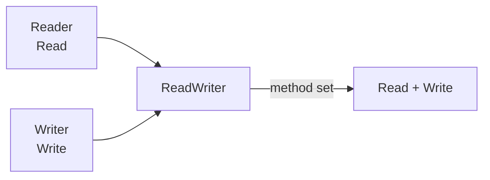
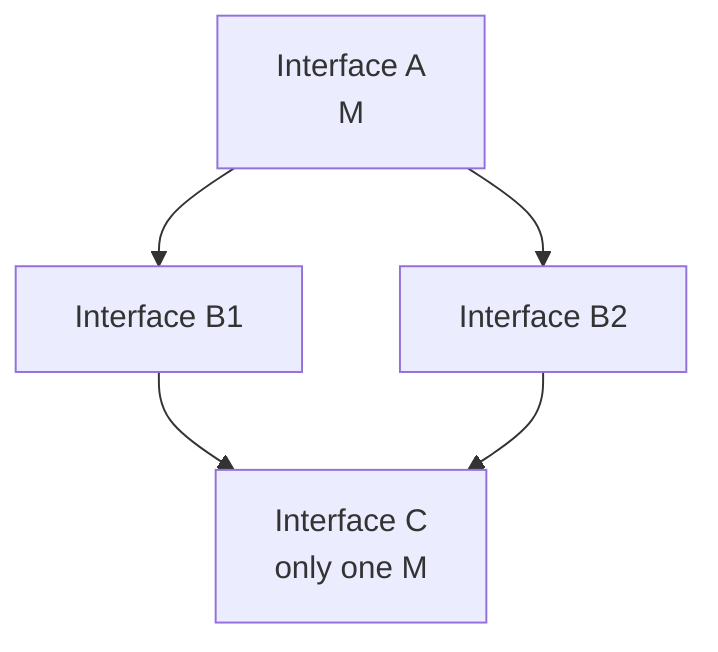

# Embedding Interfaces — Junior Level

## Table of Contents
1. [Introduction](#introduction)
2. [Prerequisites](#prerequisites)
3. [Glossary](#glossary)
4. [Core Concepts](#core-concepts)
5. [Real-World Analogies](#real-world-analogies)
6. [Mental Models](#mental-models)
7. [Pros & Cons](#pros--cons)
8. [Use Cases](#use-cases)
9. [Code Examples](#code-examples)
10. [Coding Patterns](#coding-patterns)
11. [Clean Code](#clean-code)
12. [Best Practices](#best-practices)
13. [Edge Cases & Pitfalls](#edge-cases--pitfalls)
14. [Common Mistakes](#common-mistakes)
15. [Common Misconceptions](#common-misconceptions)
16. [Test](#test)
17. [Tricky Questions](#tricky-questions)
18. [Cheat Sheet](#cheat-sheet)
19. [Summary](#summary)
20. [Diagrams](#diagrams)

---

## Introduction

**Interface embedding** — placing one interface inside another. Methods are automatically combined:

```go
type Reader interface {
    Read(p []byte) (n int, err error)
}

type Writer interface {
    Write(p []byte) (n int, err error)
}

// Embed
type ReadWriter interface {
    Reader
    Writer
}

// ReadWriter method set: Read, Write
```

The `ReadWriter` interface combines the methods of `Reader` and `Writer`. It is an interface built through **composition**.

The standard library uses this extensively:

```go
type ReadCloser interface {
    Reader
    Closer
}

type ReadWriteCloser interface {
    Reader
    Writer
    Closer
}
```

After this file you will:
- Know the interface embedding syntax
- Understand how methods get combined
- Know the embeds in the standard `io` package
- Be able to perform simple composition

---

## Prerequisites
- Interface basics
- Method set rules
- Struct embedding (`type X struct { Y }`)

---

## Glossary

| Term | Definition |
|--------|--------|
| **Interface embedding** | Referencing another interface inside an interface |
| **Method composition** | Combining methods of embedded interfaces |
| **`io.Reader`** | Interface with the `Read([]byte) (int, error)` method |
| **`io.Writer`** | Interface with the `Write([]byte) (int, error)` method |
| **`io.Closer`** | Interface with the `Close() error` method |
| **Embedded** | An element placed inside another |
| **Outer interface** | The interface that embeds another interface |

---

## Core Concepts

### 1. Simple embed

```go
type A interface { MethodA() }

type B interface {
    A
    MethodB()
}

// B method set: MethodA, MethodB
```

### 2. Multiple embeds

```go
type A interface { Foo() }
type B interface { Bar() }
type C interface { Baz() }

type ABC interface {
    A
    B
    C
}

// ABC method set: Foo, Bar, Baz
```

### 3. Standard `io` package

```go
type Reader interface {
    Read(p []byte) (n int, err error)
}

type Writer interface {
    Write(p []byte) (n int, err error)
}

type Closer interface {
    Close() error
}

type ReadWriter interface {
    Reader
    Writer
}

type ReadCloser interface {
    Reader
    Closer
}

type WriteCloser interface {
    Writer
    Closer
}

type ReadWriteCloser interface {
    Reader
    Writer
    Closer
}
```

This is the most typical embedding example in Go.

### 4. Concrete type satisfying an interface

```go
type File struct{}

func (f *File) Read(p []byte) (n int, err error)   { /* ... */ return 0, nil }
func (f *File) Write(p []byte) (n int, err error)  { /* ... */ return 0, nil }
func (f *File) Close() error                        { return nil }

// File satisfies ReadWriteCloser
var _ io.ReadWriteCloser = (*File)(nil)
```

`File` implements 3 methods — it satisfies all of the embedded interfaces.

### 5. No difference between embed and listing separately

```go
type A interface {
    Method1()
    Method2()
}

type B interface {
    A
    Method3()
}

// This is equivalent
type C interface {
    Method1()
    Method2()
    Method3()
}
```

Embed is a shorthand and a composition style.

---

## Real-World Analogies

**Analogy 1 — Block construction**

Embed is like Lego blocks. You combine the `Reader` block and the `Writer` block to build `ReadWriter`. There is no need to rewrite either block.

**Analogy 2 — Diploma and certificate**

`Reader` is the "reading diploma". `Writer` is the "writing diploma". `ReadWriter` is a person who holds both diplomas.

**Analogy 3 — Repair capability**

A car mechanic embeds the `Engine` and `Brakes` interfaces and produces the `FullCar` interface.

---

## Mental Models

### Model 1: Methods combine

```
A: { foo, bar }
B: { baz, qux }

A;B → { foo, bar, baz, qux }
```

### Model 2: Hierarchy

```
Reader  →  Closer
   ↓        ↓
ReadCloser
```

### Model 3: Substitution

```
Func requires ReadCloser
    ↓
Caller passes File (3 methods)
    ↓
File "fits" different interfaces
```

---

## Pros & Cons

| Pros | Cons |
|------|------|
| Composition — strong abstraction | Method conflicts may occur |
| Standard library style | Interfaces become coupled |
| Shorter | Refactoring is harder |
| Reuse | Changing the outer interface |

---

## Use Cases

### Use case 1: `io.ReadWriter`

```go
func Copy(dst io.Writer, src io.Reader) (int64, error) { ... }

// Usage
var rw io.ReadWriter = &bytes.Buffer{}
io.Copy(rw, rw)   // rw is both a Reader and a Writer
```

### Use case 2: Custom service

```go
type Logger interface { Log(string) }
type Metric interface { Record(name string, val float64) }

type Telemetry interface {
    Logger
    Metric
}
```

### Use case 3: Domain layered

```go
type Reader interface { Read(id string) (*User, error) }
type Writer interface { Write(u *User) error }
type Deleter interface { Delete(id string) error }

type FullStore interface {
    Reader
    Writer
    Deleter
}
```

---

## Code Examples

### Example 1: Simple

```go
package main

type Speaker interface { Speak() string }
type Mover interface { Move() string }

type Animal interface {
    Speaker
    Mover
}

type Dog struct{}
func (Dog) Speak() string { return "woof" }
func (Dog) Move() string  { return "run" }

func main() {
    var a Animal = Dog{}
    println(a.Speak()) // woof
    println(a.Move())  // run
}
```

### Example 2: io.ReadWriter

```go
package main

import (
    "bytes"
    "fmt"
)

func main() {
    var b bytes.Buffer
    b.WriteString("hello")

    // bytes.Buffer satisfies io.ReadWriter
    p := make([]byte, 5)
    b.Read(p)
    fmt.Println(string(p)) // hello
}
```

### Example 3: Custom logging + metric

```go
package main

import "fmt"

type Logger interface { Log(string) }
type Metric interface { Record(name string, val float64) }

type Telemetry interface {
    Logger
    Metric
}

type ConsoleTelemetry struct{}
func (ConsoleTelemetry) Log(msg string) { fmt.Println("LOG:", msg) }
func (ConsoleTelemetry) Record(name string, val float64) {
    fmt.Printf("METRIC: %s=%v\n", name, val)
}

func main() {
    var t Telemetry = ConsoleTelemetry{}
    t.Log("user login")            // LOG: user login
    t.Record("login.duration", 0.5) // METRIC: login.duration=0.5
}
```

### Example 4: ReadCloser

```go
package main

import (
    "io"
    "os"
)

func main() {
    f, _ := os.Open("test.txt")
    var rc io.ReadCloser = f   // *os.File satisfies ReadCloser
    defer rc.Close()
    // rc.Read(...)
    _ = rc
}
```

### Example 5: Multiple embed

```go
type A interface { Foo() }
type B interface { Bar() }
type C interface { Baz() }

type ABC interface {
    A
    B
    C
    Quux()  // additional method
}
```

---

## Coding Patterns

### Pattern 1: Standard library style

```go
type Reader interface { Read(...) ... }
type Writer interface { Write(...) ... }
type ReadWriter interface { Reader; Writer }
```

### Pattern 2: Domain composition

```go
type UserReader interface { Find(id string) (*User, error) }
type UserWriter interface { Save(u *User) error }
type UserStore interface { UserReader; UserWriter }
```

### Pattern 3: Decorator interface

```go
type Logger interface { Log(string) }
type Sized interface { Size() int }

type LogSized interface { Logger; Sized }
```

---

## Clean Code

### Rule 1: Meaningful embed

```go
// Good — Reader + Writer = ReadWriter
type ReadWriter interface { Reader; Writer }

// Bad — unrelated
type Bizarre interface { Greeter; Counter }
```

### Rule 2: No conflict

```go
type A interface { M() string }
type B interface { M() int }   // signature differs

type AB interface { A; B }  // COMPILE ERROR (Go 1.14+)
```

### Rule 3: Granular small interfaces

```go
// Small interfaces
type Reader interface { ... }
type Writer interface { ... }

// Build through composition
type ReadWriter interface { Reader; Writer }
```

---

## Best Practices

1. **Take inspiration from the standard `io` style** and write granular interfaces
2. **Small atomic interfaces** + composition
3. **Embed must carry contextual meaning**
4. **Prevent conflicts** — use the same signature
5. **Documentation** — document the reason for the embed

---

## Edge Cases & Pitfalls

### Pitfall 1: Method conflict
```go
type A interface { Foo() string }
type B interface { Foo() int }
type AB interface { A; B }  // compile error
```

### Pitfall 2: Diamond
```go
type A interface { Foo() }
type B1 interface { A }
type B2 interface { A }
type C interface { B1; B2 }   // OK — Foo appears once
```

Go 1.14+ — same signature is OK, no conflict.

### Pitfall 3: Embedding itself

```go
type A interface { A }   // compile error — circular
```

---

## Common Mistakes

| Mistake | Solution |
|------|--------|
| Method conflict | Match the signature |
| Unrelated embed | Keep them as separate interfaces |
| Large embed (10+) | Granular interface |
| Method missing in implementation | Compile-time check |

---

## Common Misconceptions

**1. "Embed is the same as inheritance"**
No. Embed only combines the method sets. There is no state.

**2. "Method order matters"**
No. The order of embeds does not affect the method set.

**3. "Embed also works for concrete types"**
Interface embedding is interface-into-interface. Struct embedding is a separate matter.

---

## Test

### 1. `type AB interface { A; B }` — which methods does it have?
**Answer:** All methods of A and B (provided the signatures match).

### 2. What happens on a method conflict?
**Answer:** Same signature — OK (1.14+). If they differ — compile error.

### 3. How is `io.ReadWriter` declared?
**Answer:** `type ReadWriter interface { Reader; Writer }`.

### 4. Can a method be added to an embedded type?
**Answer:** Embed is only a declaration. Implementation lives on the concrete type.

### 5. Difference between struct embedding and interface embedding?
**Answer:** Struct — state + methods, interface — only method declarations.

---

## Tricky Questions

**Q1: Does `type A interface { A }` work?**
No — it is circular. Compile error.

**Q2: Embed order does not matter — why?**
A method set is a collection. There is no order.

**Q3: Does `interface { interface{} }` work?**
Yes, but it is empty — `any` remains.

**Q4: Can a method be "overridden" through embed?**
No. If the outer interface declares a new method that also exists in the embed, it is a conflict.

**Q5: Can a pointer (`*A`) be written in the embed?**
No. Only an interface type.

---

## Cheat Sheet

```
EMBED SYNTAX
─────────────────
type ABC interface {
    A           // embed
    B           // embed
    Method3()   // additional
}

METHOD COMPOSITION
─────────────────
ABC = A.methods + B.methods + Method3

CONFLICT
─────────────────
1.14+ same signature OK
Different signature — compile error
Circular embed — compile error

STD LIBRARY
─────────────────
io.ReadWriter, io.ReadCloser, io.WriteCloser
io.ReadWriteCloser

BEST PRACTICES
─────────────────
Granular small interface
Build large via composition
No conflicts
Logical relatedness
```

---

## Self-Assessment Checklist

- [ ] I can write the interface embedding syntax
- [ ] I understand method composition
- [ ] I can produce examples like `io.ReadWriter`
- [ ] I can detect conflict situations
- [ ] I know the benefits of writing granular interfaces

---

## Summary

Interface embedding is Go's tool for **abstraction through composition**.

Key points:
- Methods combine via embed
- `io.ReadWriter` — standard style
- Small atomic interface + composition
- Conflict — same signature or none

Embedding is the most typical design style of the `io` package.

---

## Diagrams

### Interface composition



### Diamond — conflict free (1.14+)


