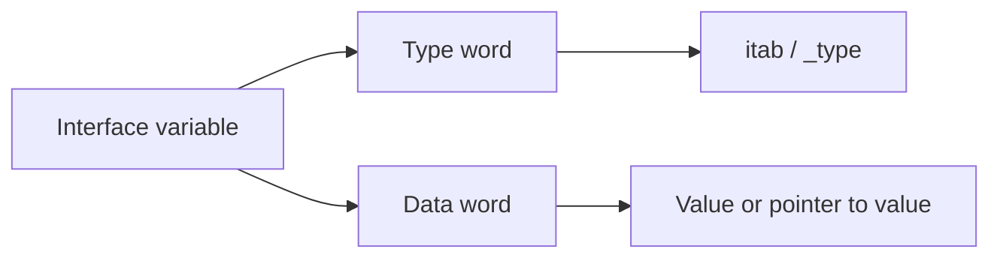
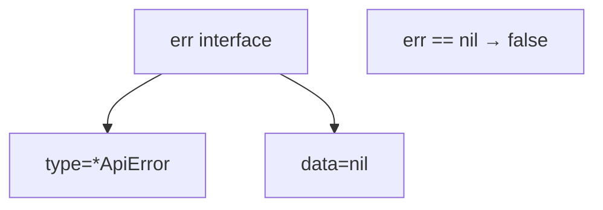
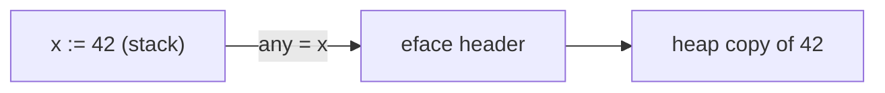

# Interface Internals — Junior Level

## Table of Contents
1. [Introduction](#introduction)
2. [Prerequisites](#prerequisites)
3. [Glossary](#glossary)
4. [Core Concepts](#core-concepts)
5. [Real-World Analogies](#real-world-analogies)
6. [Mental Models](#mental-models)
7. [Pros & Cons](#pros--cons)
8. [Use Cases](#use-cases)
9. [Code Examples](#code-examples)
10. [Common Patterns](#common-patterns)
11. [The Typed-Nil Gotcha](#the-typed-nil-gotcha)
12. [Boxing in One Picture](#boxing-in-one-picture)
13. [Comparing Interfaces](#comparing-interfaces)
14. [Performance Tips](#performance-tips)
15. [Best Practices](#best-practices)
16. [Edge Cases & Pitfalls](#edge-cases--pitfalls)
17. [Common Misconceptions](#common-misconceptions)
18. [Test](#test)
19. [Cheat Sheet](#cheat-sheet)
20. [Self-Assessment Checklist](#self-assessment-checklist)
21. [Summary](#summary)
22. [Further Reading](#further-reading)
23. [Diagrams & Visual Aids](#diagrams--visual-aids)

---

## Introduction
> Focus: "What is inside an interface variable?"

When you write `var r io.Reader = file`, what is actually stored in `r`? Surprisingly, **two pointers** — not the file. This file zooms into that two-word interface header so you can stop treating interface values as "magic" and start reasoning about their layout.

```go
// Plain English: an interface value is a pair (type, data).
//   - "type" identifies the concrete type that was put in.
//   - "data" is the value itself, or a pointer to it.
var r io.Reader      // both words are nil → r == nil
r = os.Stdin         // type word: *os.File's itab; data word: pointer to Stdin
```

After reading you will:
- Visualize `iface` (typed) vs `eface` (`any`) headers.
- Spot the typed-nil gotcha before it bites you.
- Understand why putting `int` into `any` may allocate.

---

## Prerequisites
- Functions, structs, methods (`02-pointer-receivers`).
- The basic syntax of an interface declaration (`04-interfaces-basics`).
- Awareness of pointers in Go.

---

## Glossary

| Term | Definition |
|------|------------|
| **iface** | Runtime header for a typed interface (`io.Reader`, `error`, ...). Two words: `*itab`, `unsafe.Pointer`. |
| **eface** | Runtime header for the empty interface (`any` / `interface{}`). Two words: `*_type`, `unsafe.Pointer`. |
| **itab** | "Interface table" — links a concrete type to a specific interface and stores its method pointers. |
| **_type** | Runtime type descriptor. Every Go type has exactly one. |
| **dynamic type** | The concrete type currently held by an interface value. |
| **dynamic value** | The data the interface currently holds (often a pointer). |
| **boxing** | Wrapping a concrete value in an interface header (may allocate). |
| **typed nil** | An interface whose **type word** is non-nil but **data word** is nil. The interface itself is NOT `== nil`. |
| **nil interface** | Both words are nil. `iface == nil` is true. |
| **method dispatch table** | Inside `itab`: array of function pointers for the interface's methods. |

---

## Core Concepts

### 1. Two-word interface header

Every interface value is **16 bytes on a 64-bit system** (two pointers):

```
                ┌────────────────┬────────────────┐
   typed iface  │   *itab        │   data ptr     │
                └────────────────┴────────────────┘

                ┌────────────────┬────────────────┐
   any (eface)  │   *_type       │   data ptr     │
                └────────────────┴────────────────┘
```

The first word answers "what type is in here?". The second word answers "where is the value?".

### 2. iface vs eface

```go
var r io.Reader     // iface — has methods, uses *itab
var a any           // eface — no methods, uses *_type directly
```

`io.Reader` lists methods; the runtime needs to dispatch them, so it carries a full method table (`itab`). `any` has no methods to dispatch, so it stores only the type descriptor.

### 3. nil interface vs typed nil

```go
var p *os.File              // p is a typed nil pointer
var r io.Reader = p         // r is a "typed nil interface"

fmt.Println(p == nil)       // true
fmt.Println(r == nil)       // false  ← surprising!
```

`r` is not nil because its **type word** is set (it remembers `*os.File`). Only when **both words are nil** does `r == nil` hold. We re-examine this in [The Typed-Nil Gotcha](#the-typed-nil-gotcha).

### 4. Boxing — putting a value into an interface

```go
var a any = 42
```

The `int` `42` does not "fit" in the data word as a value-with-type-tag — Go stores a *pointer* to a copy on the heap. That extra heap allocation is called **boxing**.

For pointer-shaped values (`*T`, slices' first word, channels) the data word may directly hold the pointer with no extra allocation.

---

## Real-World Analogies

**Analogy 1 — Library card.** An interface value is like a borrowing slip with two stickers:
- Sticker 1: "This is a *Book of fiction*" (the type & methods you can call on it).
- Sticker 2: "Located at shelf F-12" (the actual data).

**Analogy 2 — Envelope.** `any = 42` is like sealing the integer in an envelope before sliding it into a slot. The slot only accepts envelopes (two pointers). Opening the envelope costs effort — that is type assertion.

**Analogy 3 — Phone book.** The `itab` is a small private phone book per (interface, type) pair: "When someone calls `Read`, dial this address."

---

## Mental Models

### Model 1: An interface is a pair `(type, data)`

```
iface{ tab=*itab, data=*T }     // typed
eface{ typ=*_type, data=*T }    // any
```

Putting a value in:
```go
var r io.Reader = f     // tab = itab(*os.File, io.Reader); data = pointer to f
```

Pulling a value out (type assertion):
```go
file, ok := r.(*os.File) // compare r.tab._type with *os.File's _type
```

### Model 2: itab is a per-pair cache

For each `(interface, concrete type)` pair the runtime builds a small table once and reuses it. There is no per-call lookup; subsequent assertions and method calls hit the cached `itab` directly.

### Model 3: Boxing = "I don't fit, take my home address"

When the dynamic value is not pointer-shaped, the runtime allocates room on the heap and stores a pointer in the data word. This is why `any = 42` may show up in an allocation profile.

---

## Pros & Cons

| Pros | Cons |
|------|------|
| Uniform two-word layout makes interfaces cheap to pass around | Boxing of small values can allocate |
| `itab` caching removes per-call cost | Typed nil is a perennial source of bugs |
| `any` enables generic-ish APIs without generics | Comparing interfaces holding uncomparable types panics |
| Reflection can introspect any interface value | Extra indirection is hostile to inlining |

---

## Use Cases
1. **Polymorphic I/O** — `io.Reader`, `io.Writer` accept any concrete reader/writer.
2. **Heterogeneous containers** — `[]any` for JSON-like trees.
3. **Plugin tables** — `map[string]Handler` where `Handler` is an interface.
4. **Reflection-driven libraries** — encoders, validators inspect the dynamic type behind an interface.

---

## Code Examples

### Example 1 — Inspect the two words with `unsafe`

```go
package main

import (
    "fmt"
    "os"
    "unsafe"
)

// Recreate the runtime layout for inspection only.
type ifaceHeader struct {
    Tab  unsafe.Pointer // *itab
    Data unsafe.Pointer
}

func main() {
    var r interface{ Name() string } = os.Stdin // *os.File satisfies it
    h := *(*ifaceHeader)(unsafe.Pointer(&r))
    fmt.Printf("itab=%p  data=%p\n", h.Tab, h.Data)
}
```

We are not modifying anything — just reading the header bytes to confirm there are exactly two pointer-sized words.

### Example 2 — eface header for `any`

```go
type efaceHeader struct {
    Type unsafe.Pointer // *_type
    Data unsafe.Pointer
}

var a any = 42
h := *(*efaceHeader)(unsafe.Pointer(&a))
fmt.Printf("type=%p data=%p\n", h.Type, h.Data) // both non-nil
```

For `42`, `Data` points to a heap-allocated copy of `42` (boxing).

### Example 3 — Pointer values avoid boxing

```go
x := 42
var a any = &x
// data word == &x  (no extra heap copy of 42)
```

When the value already lives at an address, the data word can store that address directly.

### Example 4 — Type assertion in action

```go
var r io.Reader = strings.NewReader("hi")

if sr, ok := r.(*strings.Reader); ok {
    fmt.Println("inner type matched:", sr.Len())
}
```

The runtime compares `r`'s type descriptor with `*strings.Reader`'s descriptor. Equal → assertion succeeds; cheap pointer compare.

### Example 5 — A nil interface vs a typed nil

```go
var n1 error
fmt.Println(n1 == nil) // true — both words nil

type myErr struct{}
func (*myErr) Error() string { return "boom" }
var p *myErr
var n2 error = p
fmt.Println(n2 == nil) // false — type word holds *myErr
```

---

## Common Patterns

### Pattern: Don't return a typed nil

```go
// BAD
func Find() error {
    var e *NotFound
    return e // typed-nil leak
}

// GOOD
func Find() error {
    return nil
}
```

### Pattern: Reflection without unsafe

```go
import "reflect"

var a any = []int{1, 2, 3}
fmt.Println(reflect.TypeOf(a))  // []int
fmt.Println(reflect.ValueOf(a)) // [1 2 3]
```

`reflect.TypeOf` reads the first word; `reflect.ValueOf` builds a `Value` that holds both words plus flag bits.

---

## The Typed-Nil Gotcha

```go
type ApiError struct{ code int }
func (e *ApiError) Error() string { return "api" }

func work(failing bool) error {
    var e *ApiError
    if failing {
        e = &ApiError{code: 500}
    }
    return e // BAD: when not failing, returns typed-nil error
}

err := work(false)
if err != nil {
    fmt.Println("got error:", err) // PRINTS — e is "nil" but err isn't!
}
```

**Memory picture:**
```
err.tab  = itab(*ApiError, error)   ← non-nil
err.data = nil                      ← nil pointer
err == nil  →  false
```

Fix: return the literal `nil` when there is no error.

---

## Boxing in One Picture

```
var a any = 42

         eface header              heap
        ┌──────────┐             ┌────┐
   a →  │  *_type  │ ─────────▶  │ 42 │
        │  data    │ ──────────▶ └────┘
        └──────────┘
```

For `var a any = &someStruct`, the `data` word points directly to `someStruct` — no extra copy.

---

## Comparing Interfaces

```go
var a any = 1
var b any = 1
fmt.Println(a == b)  // true — same dynamic type and equal values
```

```go
var a any = []int{1}
var b any = []int{1}
fmt.Println(a == b)  // PANIC: comparing uncomparable type []int
```

Comparison rule: equal **iff** both interfaces have the same dynamic type AND the dynamic values are `==`. If the dynamic type is uncomparable (slice, map, function), comparison **panics**.

---

## Performance Tips
- A method call through an interface costs one extra indirection vs a direct call. Usually negligible.
- Putting a small value into `any` may allocate — keep hot loops free of `any` boxing.
- `interface{}(x)` does not always allocate — only when `x` is non-pointer-shaped and escapes.
- The `itab` is built **once** per `(interface, type)` pair; subsequent assertions are fast.

---

## Best Practices
1. **Return `nil`, not a typed-nil**, from functions whose return type is an interface.
2. **Don't compare interfaces holding slices/maps/funcs** — guard with `reflect.DeepEqual` if needed.
3. **Use concrete types in hot paths**; promote to interfaces at API boundaries.
4. **Keep `any` out of tight loops** unless you really need heterogeneous values.
5. **Profile boxing**: `go build -gcflags='-m'` flags interface conversions that escape.

---

## Edge Cases & Pitfalls

### Pitfall 1: Empty struct

```go
var a any = struct{}{}
```

Empty structs are zero-sized; the runtime stores a sentinel pointer (`runtime.zerobase`) — no heap allocation per assignment, but the layout is still two words.

### Pitfall 2: `interface{}` of `interface{}`

```go
var a any = io.Reader(nil) // a's dynamic type is io.Reader? No.
```

You cannot have an interface whose dynamic type is another interface — the runtime always unwraps to the concrete type. `a` holds whatever was inside the inner reader (or both words nil).

### Pitfall 3: Map key with interface

```go
m := map[any]int{}
m[[]int{1}] = 1 // PANIC at runtime — uncomparable map key
```

Interface map keys delegate equality to the dynamic type's comparability.

---

## Common Misconceptions

**"An interface value is just a pointer."** — No, it is **two** pointers: one for the type, one for the data.

**"`any` is free."** — Not always; storing non-pointer values may allocate.

**"Setting a method receiver to nil pointer panics immediately."** — Only when the method body dereferences the receiver. The interface call itself is fine.

**"Type assertion is a string match."** — It is a pointer compare on the runtime `*_type` descriptors.

---

## Test

### 1. How many machine words is an interface header on amd64?
- a) 1 — b) 2 — c) 3 — d) variable

**Answer: b** — always two pointers.

### 2. Which fields does `iface` hold?
- a) `*itab`, `data` — b) `*_type`, `data` — c) `tab`, `methods` — d) `name`, `value`

**Answer: a**.

### 3. What does `var r io.Reader = (*os.File)(nil); r == nil` evaluate to?
- a) true — b) false — c) panic — d) compile error

**Answer: b** — typed nil; type word is non-nil.

### 4. Boxing is most likely when the dynamic value is:
- a) `*T` — b) a small `int` — c) a slice header alone — d) a `chan`

**Answer: b** — non-pointer-shaped values typically heap-allocate.

### 5. Comparing two interfaces holding `[]int` does what?
- a) returns false — b) returns true — c) panics — d) compares pointers

**Answer: c** — uncomparable dynamic type.

---

## Cheat Sheet

```
INTERFACE HEADER (16 bytes on 64-bit)
─────────────────────────────────────
iface  : *itab   | data ptr
eface  : *_type  | data ptr   (used for any)

NIL RULES
─────────────────────────────────────
nil interface :  type=nil  data=nil  → == nil
typed nil     :  type≠nil  data=nil  → != nil  (gotcha)

BOXING
─────────────────────────────────────
pointer value  → no extra alloc
non-pointer    → may heap-alloc copy

ASSERTION
─────────────────────────────────────
v, ok := i.(T)   → compares *_type pointers; ok=false on mismatch
```

---

## Self-Assessment Checklist
- [ ] I can draw the iface and eface layouts.
- [ ] I can explain why a typed nil isn't `== nil`.
- [ ] I know when assigning to `any` allocates.
- [ ] I can predict whether interface comparison panics.
- [ ] I can name the two pointer-sized words and what they reference.

---

## Summary

An interface value in Go is a fixed-size **two-word header** — the same on every architecture. The first word is type information (with a method table for typed interfaces, or just a type descriptor for `any`); the second is the data, often a pointer. Most "weird" behaviors of Go interfaces — typed nil, allocation when boxing, comparison panics — fall out of this layout naturally once you can picture it.

Next stop: in [middle.md](middle.md) we open up the `itab` itself and walk through type-assertion mechanics in detail.

---

## Further Reading
- Go runtime source: `runtime/iface.go`, `runtime/runtime2.go` (search for `type iface`, `type eface`, `type itab`).
- `reflect` package documentation — describes how `Type` and `Value` are derived from interfaces.

---

## Diagrams & Visual Aids

### Diagram 1 — Two-word header



### Diagram 2 — Typed nil



### Diagram 3 — Boxing


