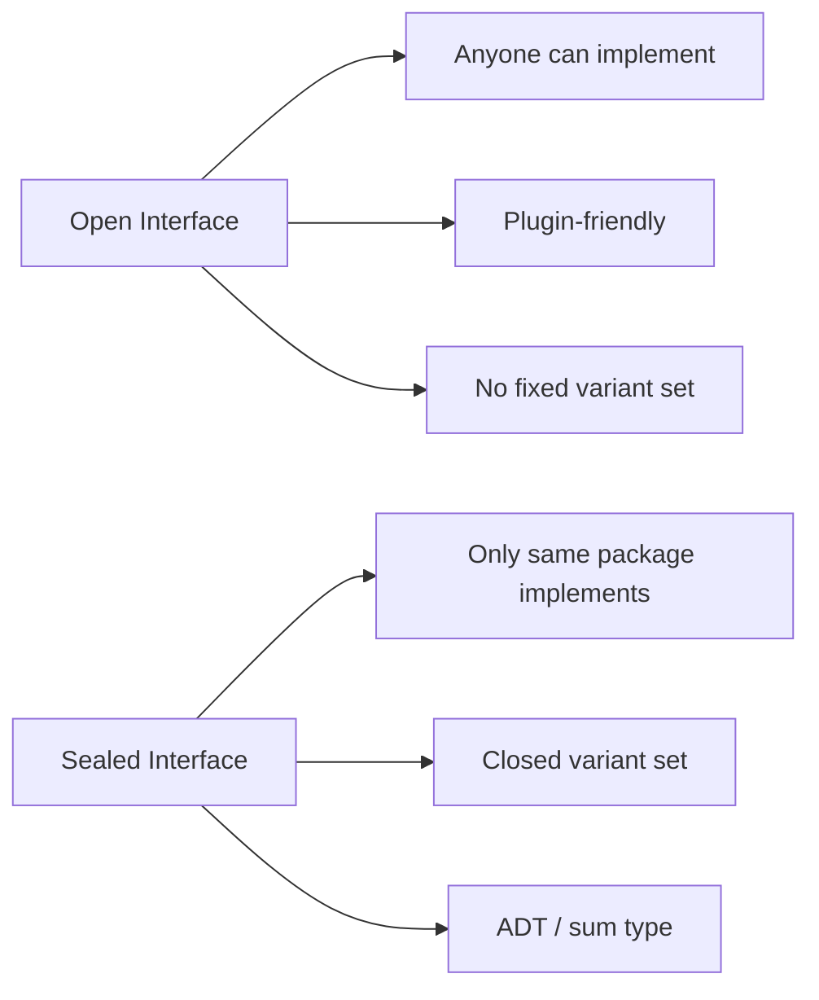

# Sealed Interfaces — Junior Level

## Table of Contents
1. [Introduction](#introduction)
2. [Prerequisites](#prerequisites)
3. [Glossary](#glossary)
4. [Core Concept — The Unexported Method Trick](#core-concept-the-unexported-method-trick)
5. [Real-World Analogy](#real-world-analogy)
6. [A Tiny Expression ADT](#a-tiny-expression-adt)
7. [What Sealing Buys You](#what-sealing-buys-you)
8. [What Sealing Does NOT Buy You](#what-sealing-does-not-buy-you)
9. [The Naming Convention](#the-naming-convention)
10. [How a Type Switch Uses a Sealed Interface](#how-a-type-switch-uses-a-sealed-interface)
11. [Standard Library Examples](#standard-library-examples)
12. [Pros & Cons](#pros-cons)
13. [Common Mistakes](#common-mistakes)
14. [Edge Cases](#edge-cases)
15. [Test](#test)
16. [Cheat Sheet](#cheat-sheet)
17. [Self-Assessment Checklist](#self-assessment-checklist)
18. [Summary](#summary)
19. [Further Reading](#further-reading)

---

## Introduction
> Focus: "What is a sealed interface and how do I write one?"

A regular Go interface is **open**: anyone, anywhere, can implement it just by writing the right methods. A **sealed interface** flips that rule: only types inside the **same package** can implement it. The mechanism is a single technique — adding one **unexported method** to the interface. Because unexported names are not visible outside the package, no external type can satisfy the method, so no external type can satisfy the interface.

```go
package expr

// Sealed interface — note the unexported method.
type Expr interface {
    expr() // <- the seal: only this package can implement Expr
}
```

That tiny `expr()` method is the whole pattern. It carries no behavior, returns nothing, and exists only to fence the interface. From outside `expr`, nobody can write a struct that has an `expr()` method on the `expr.Expr` interface, because `expr` is lowercase.

After reading this file you will:
- Understand how an unexported method seals an interface
- Be able to write a small sealed-interface ADT (sum type)
- Know the common naming conventions
- Recognise the canonical std-lib examples (`ast.Node`, `reflect.Type`)
- Understand the embedding loophole and why it does not break the seal

---

## Prerequisites

- Basic Go interfaces (`type I interface { Foo() }`)
- Method declarations on structs
- Exported vs unexported identifiers (capitalisation rule)
- Type switch on interface values
- A first look at struct types

If any of those are unclear, read the earlier sections in this folder before continuing.

---

## Glossary

| Term | Definition |
|------|------------|
| **Sealed interface** | An interface containing at least one unexported method, restricting implementers to the declaring package |
| **Sum type / ADT** | A type that is exactly one of a fixed set of variants — a sealed interface is Go's way to model this |
| **Sealing method** | The unexported method whose only purpose is to fence the interface |
| **Variant** | One of the concrete types that satisfy a sealed interface (e.g. `Number`, `BinOp`) |
| **Exhaustive switch** | A type switch that handles every variant — Go has no built-in check, linters do |
| **Open interface** | A normal interface that anyone can implement |
| **Type switch** | `switch v := x.(type) { ... }` dispatch over the concrete type |
| **Identifier visibility** | An identifier starting with a lowercase letter is package-private |

---

## Core Concept — The Unexported Method Trick

To implement an interface in Go, a type must have **all of its methods**. Methods belong to the package that declared them — and the compiler resolves a method by its **fully-qualified name** (`package.Method`). An unexported method on an interface declared in package `p` has the qualified name `p.method`. A type written in another package cannot declare a method with that fully-qualified name, even by using the same lowercase spelling — its method would be `q.method`, a different identifier.

```go
package shape

type Shape interface {
    Area() float64
    shape() // unexported sealing method
}

type Circle struct{ R float64 }

func (c Circle) Area() float64 { return 3.14 * c.R * c.R }
func (c Circle) shape()        {}  // satisfies shape.shape — only "shape" can do this
```

Now from another package:

```go
package main

import "myapp/shape"

type Square struct{ Side float64 }

func (s Square) Area() float64 { return s.Side * s.Side }
func (s Square) shape()        {} // looks like it works...

var _ shape.Shape = Square{}     // compile error: missing shape.shape method
```

The compiler error is the seal in action: `Square.shape` is a method named `main.shape`, not `shape.shape`. Only code inside `package shape` can declare a method whose qualified name is `shape.shape`.

---

## Real-World Analogy

Think of a sealed interface like a **club with a hand-stamp at the door**. Anyone can claim "I'm a member" by waving a piece of paper, but only people stamped by the bouncer (the package) actually count. The stamp is invisible ink — you cannot photocopy it from the outside.

Or, lower-tech: a sealed envelope. The envelope has a wax seal that only the issuer's stamp can produce. You can mimic the shape of the envelope, but you cannot produce a genuine seal from outside the issuing office.

---

## A Tiny Expression ADT

The canonical sealed-interface example is an **expression language**. We model a tree where every node is exactly one of three things: a literal number, a variable, or a binary operation.

```go
package expr

// Sealed sum type. Every Expr is exactly one of: Number, Var, BinOp.
type Expr interface {
    expr() // sealing method
}

type Number struct{ Value float64 }
type Var    struct{ Name  string }
type BinOp  struct {
    Op       string // "+", "-", "*", "/"
    Lhs, Rhs Expr
}

func (Number) expr() {}
func (Var)    expr() {}
func (BinOp)  expr() {}
```

A consumer writes a type switch:

```go
func Eval(e Expr, env map[string]float64) float64 {
    switch n := e.(type) {
    case Number:
        return n.Value
    case Var:
        return env[n.Name]
    case BinOp:
        l, r := Eval(n.Lhs, env), Eval(n.Rhs, env)
        switch n.Op {
        case "+": return l + r
        case "-": return l - r
        case "*": return l * r
        case "/": return l / r
        }
    }
    panic("unreachable: unknown Expr variant")
}
```

The `panic("unreachable")` clause is the price Go pays for not having compile-time exhaustive switch checking — but you can guarantee with the seal that **only** `Number`, `Var`, and `BinOp` will ever reach the switch (assuming you never add a fourth without updating the switch — see the linter section in `optimize.md`).

---

## What Sealing Buys You

1. **Closed set of variants** — the package author controls every possible concrete type.
2. **Safer type switches** — when you handle every variant in `package expr`, you know nobody else can sneak a fourth one in.
3. **Refactor-friendly** — adding a new variant is an internal change; you can find every type switch in your own code via the linter and update them.
4. **Stable API** — public consumers cannot accidentally couple themselves to "implementing" `Expr`; they consume it as a value.
5. **Clear documentation** — the unexported method screams "this is an ADT".

---

## What Sealing Does NOT Buy You

1. **Compile-time exhaustiveness** — Go's compiler won't tell you if your type switch missed a case. You need `go-vet`, `staticcheck`, `exhaustive`, or `go-sumtype` linters.
2. **Total impossibility of foreign implementations** — see the embedding caveat below.
3. **No nil values** — a sealed interface is still an interface; it can hold `nil`.
4. **Pattern matching** — Go has type switch but no destructuring on inner fields.

### The embedding caveat (important)

External code **can** embed a sealed type and inherit its sealing method by **promotion**:

```go
package other

import "myapp/expr"

type FakeNum struct {
    expr.Number // embedding promotes Number's expr() method
    Extra string
}

var _ expr.Expr = FakeNum{} // compiles — FakeNum has the promoted expr() method
```

This is why we say sealed interfaces are "soft sealed": you cannot implement from scratch, but you **can** wrap a real variant. In practice this is rarely a problem — the wrapped variant still answers correctly in a type switch on the embedded `Number`. We dig deeper in `middle.md`.

---

## The Naming Convention

Go has no formal rule, but the community uses a few patterns consistently:

```go
// 1. Method named after the package or interface (most common in std-lib)
type Node interface {
    Pos() token.Pos
    End() token.Pos
    node()             // used by go/ast
}

// 2. Method named "sealed" (very explicit)
type Event interface {
    Timestamp() time.Time
    sealed()
}

// 3. Method named "isXxx" matching the interface name
type Type interface {
    String() string
    isType()           // pattern from go/types
}
```

Use whichever you like, but **be consistent within a package**. Most std-lib examples use form 1 or form 3. The key is that the method name is **lowercase** and the body is **empty**.

---

## How a Type Switch Uses a Sealed Interface

A sealed interface is most often consumed via a `type switch`. Because the variants are fixed, a switch can be written as if it were exhaustive:

```go
package expr

func String(e Expr) string {
    switch n := e.(type) {
    case Number:
        return fmt.Sprintf("%g", n.Value)
    case Var:
        return n.Name
    case BinOp:
        return "(" + String(n.Lhs) + " " + n.Op + " " + String(n.Rhs) + ")"
    default:
        panic(fmt.Sprintf("expr: unhandled variant %T", e))
    }
}
```

The `default: panic` arm is a standard idiom: if a maintainer adds a new variant and forgets to update this switch, the program fails loudly the first time the new variant flows through.

---

## Standard Library Examples

| Interface | Package | Sealing method | Variants (partial) |
|-----------|---------|----------------|--------------------|
| `Node` | `go/ast` | `node()` | `*File`, `*Ident`, `*BinaryExpr`, `*FuncDecl`, ... |
| `Type` | `reflect` | `common()` (private) | concrete `rtype` only |
| `Type` | `go/types` | `String() string` + private contract | `*Basic`, `*Pointer`, `*Slice`, `*Struct`, ... |
| `Object` | `go/types` | `*object` field via embedded base | `*Const`, `*Var`, `*Func`, `*TypeName`, ... |
| `Value` (compile/ssa) | `cmd/compile/internal/ssa` | various unexported methods | `*Func`, `*Block`, `*Value` |

These are real production sealed interfaces — go read `go/ast`'s source to see hundreds of variants implementing `node()`. We walk through `ast.Node` in detail in `middle.md`.

---

## Pros & Cons

| Pros | Cons |
|------|------|
| Closed, controlled variant set | No compile-time exhaustiveness check |
| Safer refactors (you own all types) | Embedding can still smuggle in wrappers |
| Self-documenting ADT | Goes against Go's "accept interfaces" preference if used wrongly |
| Plays well with `type switch` | Adds an empty method to every concrete type |
| API stability — consumers can't extend | Reduces external testability (no fakes from outside) |

---

## Common Mistakes

### Mistake 1: Forgetting the unexported method on a new variant

```go
// Bug — DivOp does not implement Expr
type DivOp struct{ Lhs, Rhs Expr }
// missing: func (DivOp) expr() {}
```

The compiler will tell you when you try to assign `DivOp` to `Expr`. But it will not warn you about a type switch missing the `DivOp` case.

### Mistake 2: Exporting the seal method

```go
// Wrong — capitalised, no longer seals
type Expr interface {
    Expr() // anyone can implement Expr.Expr from outside
}
```

If the method is exported, it is just a normal interface method, and the seal is gone.

### Mistake 3: Treating embedding as a leak

External wrapping via embedding rarely causes real bugs — type switches on the **embedded** variant still work. Don't over-engineer to block embedding; in 99% of cases the soft seal is enough.

### Mistake 4: Sealing types you actually want users to extend

If users should be able to write their own implementation (e.g. a `Reader` or a `Storage` plugin), do **not** seal. Sealing is for ADTs, not for plug-in interfaces.

---

## Edge Cases

### A sealed interface with method behaviour

The seal can live alongside real methods:

```go
type Shape interface {
    Area() float64 // real behaviour
    shape()        // seal
}
```

Consumers call `Area()`; the seal is invisible to callers but blocks foreign implementations.

### A nil sealed interface value

```go
var e Expr // nil
switch e.(type) {
case Number: // no
case nil:    // matches
}
```

Sealing does not change the fact that the interface variable can be nil.

### Sealing a generic interface

```go
type Container[T any] interface {
    Items() []T
    container()
}
```

Generics work normally — the unexported method still seals across packages.

---

## Test

### 1. What does an unexported method on an interface accomplish?
- a) Prevents the interface from being used as a function parameter
- b) Restricts implementers to the same package
- c) Disables type switches
- d) Makes the interface generic

**Answer: b**

### 2. Which of these is a sealed interface?
- a) `type R interface { Read([]byte) (int, error) }`
- b) `type N interface { Pos() int; node() }`
- c) `type W interface { Write([]byte) (int, error); Close() error }`
- d) `type S interface{}`

**Answer: b** — `node()` is unexported, so only the declaring package can implement it.

### 3. Why might a sealed interface still be implemented by external code?
- a) Reflection
- b) Embedding — an external struct can embed a real variant and inherit its seal
- c) Compiler bug
- d) `unsafe` package

**Answer: b**

### 4. What standard library type uses sealing?
- a) `io.Reader`
- b) `go/ast.Node`
- c) `error`
- d) `fmt.Stringer`

**Answer: b**

### 5. The compile error you get when external code tries to satisfy a sealed interface mentions:
- a) "interface contains unexported method"
- b) "package import cycle"
- c) "method has pointer receiver"
- d) Nothing — silent failure

**Answer: a** — Go reports something like "missing method node (unexported method)".

---

## Cheat Sheet

```
SEALED INTERFACE PATTERN
────────────────────────────────────────
type Expr interface {
    expr()      // unexported sealing method
}

type Number struct{ V float64 }
func (Number) expr() {}

CONSUME WITH TYPE SWITCH
────────────────────────────────────────
switch v := e.(type) {
case Number: ...
case Var:    ...
case BinOp:  ...
default:
    panic(fmt.Sprintf("unhandled %T", e))
}

NAMING (pick one, stay consistent)
────────────────────────────────────────
node()        // std-lib (go/ast)
sealed()      // explicit
isXxx()       // matches interface name (go/types)
xxx()         // matches package name

REMEMBER
────────────────────────────────────────
* Lowercase => seal works
* Uppercase => seal lost
* Embedding can wrap variants (soft seal)
* No native exhaustive check; use linters
```

---

## Self-Assessment Checklist

- [ ] I can write a sealed interface with three variants
- [ ] I can explain why an unexported method seals the interface
- [ ] I can write a type switch over the variants
- [ ] I know the embedding loophole exists
- [ ] I can name two std-lib sealed interfaces
- [ ] I know when **not** to seal (plug-in style interfaces)
- [ ] I can write a `default: panic` arm and explain its purpose
- [ ] I know that linters provide exhaustiveness, not the compiler

---

## Summary

A sealed interface is one of Go's quietest patterns. A single unexported method changes an open interface into a **closed sum type**, giving you ADT semantics with zero runtime overhead. The technique is used extensively in the standard library (`go/ast.Node`, `go/types.Type`, `reflect.Type`) precisely because Go has no native sum-type or `sealed` keyword.

The pattern is simple:
1. Add a lowercase no-op method to the interface.
2. Let your variants implement it.
3. Consume via type switch with a `default: panic` for safety.
4. Pair with a linter for exhaustiveness.

The middle level walks through real std-lib code; the senior level discusses ADT vs visitor and the perf cost of type switches.

---

## What You Can Build

- A small expression evaluator (sum type: `Number | Var | BinOp | If`)
- A sealed `Result[T]` type emulating `Ok | Err`
- A pattern-style HTTP routing table where every route is one of `Static | Wildcard | Regex`
- A type-safe state machine where states are sealed variants
- A discriminated-union style command/event log

---

## Further Reading

- [go/ast source](https://pkg.go.dev/go/ast) — see `Node`, `Decl`, `Expr`, `Stmt`, `Spec` — all sealed
- [reflect.Type implementation](https://pkg.go.dev/reflect#Type) — concrete `*rtype` is unexported
- [go/types overview](https://pkg.go.dev/go/types) — `Type`, `Object` are sealed
- ["Sum Types in Go" — Andy Balholm blog](https://go.dev/blog/) — community pattern article
- [`exhaustive` linter](https://pkg.go.dev/github.com/nishanths/exhaustive) — exhaustive type-switch checks

---

## Related Topics

- Type switch (section 08)
- Type assertions (section 07)
- Interface basics (section 04)
- Method sets deep dive (section 09)
- Cross-package methods (section 18) — directly relevant to the seal mechanism

---

## Diagrams

### Diagram 1: Open vs Sealed



### Diagram 2: Sealing mechanism

```mermaid
graph TD
    I[Interface Expr in pkg expr]
    I --> M[unexported method expr()]
    M --> R1[Number in pkg expr → can implement]
    M --> R2[Foo in pkg main → cannot implement]
    R2 -.embedding.-> R1
    R1 -.promoted method.-> R2
```
