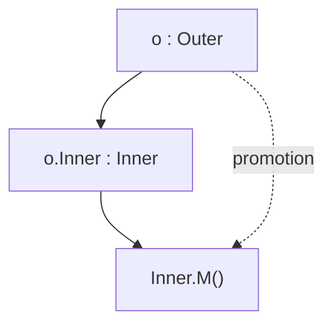

# Struct Method Promotion — Junior Level

## Table of Contents
1. [Introduction](#introduction)
2. [Distinction from Interface Embedding](#distinction-from-interface-embedding)
3. [Prerequisites](#prerequisites)
4. [Glossary](#glossary)
5. [Core Concepts](#core-concepts)
6. [Real-World Analogies](#real-world-analogies)
7. [Mental Models](#mental-models)
8. [Code Examples](#code-examples)
9. [Anonymous Field Naming](#anonymous-field-naming)
10. [Pros & Cons](#pros--cons)
11. [Use Cases](#use-cases)
12. [Coding Patterns](#coding-patterns)
13. [Best Practices](#best-practices)
14. [Common Mistakes](#common-mistakes)
15. [Common Misconceptions](#common-misconceptions)
16. [Test](#test)
17. [Cheat Sheet](#cheat-sheet)
18. [Self-Assessment Checklist](#self-assessment-checklist)
19. [Summary](#summary)
20. [Further Reading](#further-reading)

---

## Introduction
> Focus: "What is method promotion?" and "How do I use it?"

When you write a Go struct that contains another type as an **anonymous field** (a field declared with only a type, no name), the outer struct automatically gains all the methods of the inner type. This is called **method promotion**.

```go
type Logger struct {
    Prefix string
}

func (l Logger) Log(msg string) {
    println(l.Prefix + ": " + msg)
}

type Service struct {
    Logger // anonymous field — embeds Logger
    Name   string
}

func main() {
    s := Service{Logger: Logger{Prefix: "svc"}, Name: "auth"}
    s.Log("starting") // svc: starting — Log was promoted to Service
}
```

`Service` did not declare a `Log` method, yet `s.Log("starting")` is valid. The compiler resolves it as `s.Logger.Log("starting")`. This is Go's primary mechanism for code reuse via composition.

After reading this file you will:
- Understand what struct embedding is
- Recognise anonymous-field syntax
- Know how method promotion works for simple cases
- Be able to compose small, focused types into larger ones
- Distinguish struct embedding from interface embedding

---

## Distinction from Interface Embedding

This topic is **only** about struct embedding. There is a separate, similar-looking feature called interface embedding (covered in topic `06-embedding-interfaces`). Keep them apart in your mind:

| Feature | Struct embedding (this file) | Interface embedding (topic 06) |
|---|---|---|
| What is embedded | A concrete struct (or pointer to one) | An interface |
| Syntax inside outer | `type Outer struct { Inner }` | `type Outer interface { Inner }` |
| What gets promoted | Methods **with implementations** | Method **signatures** only (no impl) |
| Outer type | A struct with composed behavior | An interface that requires more methods |
| Runtime effect | Forwards calls to the embedded value | Defines what implementers must provide |

Struct embedding pulls real method bodies into the outer struct. Interface embedding only pulls method requirements into the outer interface. From now on, every example in this file is about **struct** embedding.

---

## Prerequisites
- Go basics: `struct`, `func`, `package main`
- Methods (topic 01): you know what a receiver is
- Pointer vs value receivers (topic 02): you know the difference
- Comfort reading `s.Field.Method()` selector chains

---

## Glossary

| Term | Definition |
|---|---|
| **Embedding** | Including one type inside another struct as an anonymous field |
| **Anonymous field** | A field declared by type name only, with no field name |
| **Embedded type** | The inner type referenced by the anonymous field |
| **Outer struct** | The struct that contains the embedded type |
| **Method promotion** | The compiler treating embedded methods as if declared on the outer |
| **Selector** | A `x.y` expression resolving to a field or method |
| **Promoted method** | A method of the embedded type, callable on the outer |
| **Field-name shadowing** | When the outer struct declares a name that hides a promoted name |
| **Composition** | Building behavior by combining types (vs inheriting from a base class) |

---

## Core Concepts

### 1. Anonymous-field syntax

```go
type Inner struct {
    X int
}

type Outer struct {
    Inner   // anonymous field — type name is also the field name
    Y int
}
```

The field's effective name is the **unqualified type name** — here, `Inner`. You access it with `o.Inner`. You can also access the promoted field directly: `o.X`.

### 2. Promoted method

```go
func (i Inner) Show() {
    fmt.Println("Inner.X =", i.X)
}

func main() {
    o := Outer{Inner: Inner{X: 7}, Y: 10}
    o.Show()        // Inner.X = 7  — promoted!
    o.Inner.Show()  // Inner.X = 7  — explicit
}
```

`Outer` did not declare `Show`, but the compiler synthesises a promoted version that simply forwards to `o.Inner.Show()`.

### 3. Outer.M() resolves to Outer.Inner.M()

If `Outer` does **not** define `M` itself, then `o.M()` is shorthand for `o.Inner.M()`. The receiver of the promoted call is the embedded value, never the outer.

### 4. Multiple embeds

```go
type A struct{}
func (A) Hello() { fmt.Println("from A") }

type B struct{}
func (B) Goodbye() { fmt.Println("from B") }

type C struct {
    A
    B
}

func main() {
    c := C{}
    c.Hello()    // from A
    c.Goodbye()  // from B
}
```

`C` gains both `Hello` (from A) and `Goodbye` (from B) — composition without inheritance.

### 5. Embedding is not inheritance

The Go FAQ "Why is there no type inheritance?" makes this explicit. Embedding is **composition** — the outer struct **has-an** inner, not **is-an** inner. There is no virtual dispatch: a method on the embedded type calling another method always sees its own receiver, never the outer's overrides.

---

## Real-World Analogies

**Analogy 1 — Toolbox**

Embedding is like attaching a toolbox to your workbench. The workbench (outer) doesn't know how to drill, but it now contains a drill (inner). When someone asks the workbench to drill, it just hands the request to the drill inside.

**Analogy 2 — Plug-in modules**

A laptop has slots for modules: Wi-Fi, Bluetooth, Audio. The laptop "embeds" each module. You call `laptop.SendBluetooth(...)`, but really the request is forwarded to the Bluetooth module.

**Analogy 3 — Mailing address**

A `Customer` struct embeds a `Postal` address. The customer "has-an" address. `customer.Format()` (a method declared on `Postal`) resolves through the embedded `Postal` value — the customer doesn't reimplement formatting.

---

## Mental Models

### Model 1: Forwarding wrapper, generated by the compiler

When you embed `Inner` in `Outer` and `Inner` has a method `M`, the compiler effectively generates:

```go
// You write:
type Outer struct { Inner }

// The compiler behaves as if you also wrote:
func (o Outer) M() { o.Inner.M() }
```

The promoted method is just an automatic forward. There is no magic.

### Model 2: A field that doubles as a name

```
type Outer struct {
    Inner    // field name = "Inner" (the unqualified type name)
    other int
}

o.Inner       — access the embedded value
o.other       — access the named field
o.M()         — calls Inner.M() (promotion)
o.Inner.M()   — same, fully qualified
```

### Model 3: Tree of accesses



The dotted edge is the shortcut Go gives you.

---

## Code Examples

### Example 1: A logger embedded in a service

```go
package main

import "fmt"

type Logger struct {
    Prefix string
}

func (l Logger) Info(msg string) {
    fmt.Printf("[%s INFO] %s\n", l.Prefix, msg)
}

func (l Logger) Warn(msg string) {
    fmt.Printf("[%s WARN] %s\n", l.Prefix, msg)
}

type Service struct {
    Logger // embedded
    Name   string
}

func main() {
    s := Service{
        Logger: Logger{Prefix: "auth"},
        Name:   "AuthService",
    }
    s.Info("started")          // [auth INFO] started
    s.Warn("token expiring")   // [auth WARN] token expiring
    fmt.Println(s.Name)        // AuthService
}
```

`Service` got `Info` and `Warn` for free — no extra code.

### Example 2: A counter behind a service

```go
type Counter struct {
    n int
}

func (c *Counter) Inc()       { c.n++ }
func (c *Counter) Value() int { return c.n }

type Hits struct {
    *Counter
    URL string
}

func main() {
    h := Hits{Counter: &Counter{}, URL: "/home"}
    h.Inc()
    h.Inc()
    fmt.Println(h.Value(), h.URL) // 2 /home
}
```

Notice we embedded `*Counter` (a pointer). That gives `Hits` access to both value- and pointer-receiver methods of `Counter`.

### Example 3: Multiple embeds — gathered behavior

```go
type Reader struct{}
func (Reader) Read() string { return "data" }

type Writer struct{}
func (Writer) Write(s string) { fmt.Println("writing:", s) }

type Pipe struct {
    Reader
    Writer
}

func main() {
    p := Pipe{}
    fmt.Println(p.Read()) // data
    p.Write("hello")      // writing: hello
}
```

### Example 4: Promoted fields too

```go
type Address struct {
    City string
    ZIP  string
}

type Person struct {
    Address // embedded
    Name    string
}

func main() {
    p := Person{
        Address: Address{City: "Tashkent", ZIP: "100000"},
        Name:    "Bahodir",
    }
    fmt.Println(p.City) // Tashkent — field also promoted
    fmt.Println(p.Name) // Bahodir
}
```

### Example 5: Calling explicitly

```go
type Base struct{}
func (Base) Hello() { fmt.Println("hi from Base") }

type Outer struct{ Base }

func main() {
    o := Outer{}
    o.Hello()      // shortcut
    o.Base.Hello() // explicit — same effect
}
```

You can always write the long form if it makes intent clearer.

---

## Anonymous Field Naming

The field's **name** is the unqualified base name of the type:

| Embedded declaration | Field name |
|---|---|
| `Inner` | `Inner` |
| `*Inner` | `Inner` |
| `pkg.Foo` | `Foo` |
| `*pkg.Foo` | `Foo` |

You can therefore write `o.Foo`, never `o.pkg.Foo`.

```go
import "bytes"

type Doc struct {
    bytes.Buffer // anonymous; field name is "Buffer"
}

func main() {
    var d Doc
    d.WriteString("hi") // promoted from bytes.Buffer
    fmt.Println(d.Buffer.Len()) // 2 — explicit access via "Buffer"
}
```

---

## Pros & Cons

### Pros

| Benefit | Why it matters |
|---|---|
| Code reuse without inheritance | Add behavior by composing |
| Less boilerplate | No manual forwarding methods |
| Clear ownership | Outer "has-an" inner — explicit |
| Idiomatic Go | Standard library uses it (sync.Mutex, bytes.Buffer) |
| Easy interface satisfaction | Promoted methods count toward method sets |

### Cons

| Drawback | Why it matters |
|---|---|
| Can hide complexity | Readers may not realise where a method came from |
| Ambiguities possible | Two embeds with same method name — compile error |
| Not inheritance | No virtual dispatch — surprises Java/C# devs |
| Tight coupling | Outer's API silently grows when inner changes |

---

## Use Cases

1. **Mixin-style add-ons**: embed `sync.Mutex` to gain `Lock`/`Unlock`.
2. **Decorators**: embed an existing type, override one method, forward the rest.
3. **DTO + behavior**: embed a domain entity inside a transport struct.
4. **Standard library wrappers**: `type MyBuffer struct { bytes.Buffer }`.
5. **Reusable cross-cutting concerns**: logging, metrics, tracing as embedded helpers.

---

## Coding Patterns

### Pattern 1: Embed sync.Mutex

```go
type SafeMap struct {
    sync.Mutex
    data map[string]int
}

func (m *SafeMap) Set(k string, v int) {
    m.Lock()         // promoted from sync.Mutex
    defer m.Unlock()
    m.data[k] = v
}
```

### Pattern 2: Embed an interface implementation

```go
type Cache struct{ store map[string]string }
func (c *Cache) Get(k string) string { return c.store[k] }
func (c *Cache) Set(k, v string)     { c.store[k] = v }

type LoggingCache struct{ *Cache }

func (lc *LoggingCache) Set(k, v string) {
    fmt.Println("set", k)
    lc.Cache.Set(k, v) // forward to embedded
}
```

`Get` is still promoted; only `Set` is overridden.

### Pattern 3: Compose multiple helpers

```go
type Tracer struct{ /* ... */ }
func (Tracer) Trace(span string) { /* ... */ }

type Metrics struct{ /* ... */ }
func (Metrics) Count(name string) { /* ... */ }

type Service struct {
    Tracer
    Metrics
    Name string
}

// s.Trace("op"); s.Count("hits") — both available
```

---

## Best Practices

1. **Embed only types whose API you want as part of yours.** If you embed `bytes.Buffer`, every Buffer method becomes part of your public surface.
2. **Prefer one-level embedding.** Deep nesting (`A` embeds `B` embeds `C` embeds `D`) is hard to read.
3. **Document promoted methods.** Add a comment showing where they come from.
4. **Consider explicit forwarding** when only a few methods are needed — it's clearer.
5. **Don't embed for "is-a" thinking.** Embedding is composition; if you mean "is-a", reconsider the design.

---

## Common Mistakes

| Mistake | Cause | Fix |
|---|---|---|
| Expecting virtual dispatch | OOP background | Inner methods can't see outer overrides |
| Embedding to "extend" | Inheritance reflex | Use small interfaces or explicit forwarding |
| Forgetting to initialise the embedded value | Zero-value gotcha | `Outer{Inner: Inner{...}}` |
| Promoting unwanted methods | Embedding too much | Wrap with explicit fields |
| Confusing struct vs interface embedding | Look-alike syntax | Always check what's inside `{}` |

---

## Common Misconceptions

**Misconception 1: "Embedding is Go's `extends`."**
False. There is no inheritance. The outer is a separate type that *contains* the inner.

**Misconception 2: "An overridden inner method calls the outer's override."**
False. There is no virtual dispatch. If `Inner.A()` calls `i.B()` and `Outer` overrides `B`, `Inner.A()` still calls `Inner.B`.

**Misconception 3: "Embedding promotes private methods only inside the same package."**
True — but worth restating: lower-case methods are promoted only within the package that declared the embedded type.

**Misconception 4: "If two embeds have the same method, the first one wins."**
False. It is an **ambiguity error** (compile-time) when called without qualification.

---

## Test

### 1. Which call works?
```go
type A struct{}
func (A) Hi() {}
type B struct{ A }
b := B{}
```
- a) `b.Hi()`
- b) `b.A.Hi()`
- c) Both
- d) Neither

**Answer: c**

### 2. What is the field name when embedding `*pkg.Foo`?
- a) `pkg.Foo`
- b) `Foo`
- c) Empty
- d) `*Foo`

**Answer: b**

### 3. Embedding gives you...
- a) Inheritance
- b) Composition with method promotion
- c) Generic dispatch
- d) Trait specialisation

**Answer: b**

### 4. If `Inner` has `func (Inner) M()` and `Outer` embeds `Inner`, does `Outer` have `M`?
- a) Yes, in both `Outer` and `*Outer` method sets
- b) Only in `*Outer`
- c) Only in `Outer`
- d) Neither

**Answer: a**

### 5. The Go FAQ says embedding is...
- a) Inheritance
- b) Composition, not inheritance
- c) A class system
- d) A trait system

**Answer: b**

---

## Cheat Sheet

```
ANONYMOUS FIELD
─────────────────────────
type Outer struct {
    Inner       // field name == "Inner"
    *Other      // field name == "Other"
}

CALLING PROMOTED METHOD
─────────────────────────
o.M()           // shortcut
o.Inner.M()     // explicit, same result

EMBEDDING IS COMPOSITION
─────────────────────────
- has-an, NOT is-a
- no virtual dispatch
- Go FAQ: "no inheritance"

FIELD NAMES ARE PROMOTED TOO
─────────────────────────
o.X is shorthand for o.Inner.X (when unambiguous)

DON'T CONFUSE WITH
─────────────────────────
type X interface { Y }   // interface embedding
type X struct    { Y }   // struct embedding (this file)
```

---

## Self-Assessment Checklist

- [ ] I can write a struct that embeds another struct
- [ ] I can call a promoted method without qualification
- [ ] I can call the same method with full qualification
- [ ] I know the embedded field's name is the unqualified type name
- [ ] I can explain why embedding is not inheritance
- [ ] I can distinguish struct embedding from interface embedding
- [ ] I know that promoted methods include unexported ones in the same package
- [ ] I can initialise an outer struct with the embedded value

---

## Summary

Struct method promotion is Go's built-in mechanism for **composition without inheritance**. By declaring an anonymous field of an inner struct type, the outer struct automatically gains every method of the inner. Calls of the form `o.M()` resolve to `o.Inner.M()` whenever `Outer` does not declare `M` itself.

The field's name is the unqualified type name, so explicit access (`o.Inner.M()`) is always available. This pattern powers wrappers, decorators, and mixins throughout the Go standard library — `sync.Mutex` and `bytes.Buffer` are commonly embedded.

Crucially, the Go FAQ is explicit: **embedding is not inheritance**. There is no virtual dispatch, no `super`, no class hierarchy. The middle file digs into ambiguities, shadowing, and the difference between embedding `T` and `*T`.

---

## Further Reading

- [Effective Go — Embedding](https://go.dev/doc/effective_go#embedding)
- [Go FAQ — Why is there no type inheritance?](https://go.dev/doc/faq#inheritance)
- [Go Spec — Struct types](https://go.dev/ref/spec#Struct_types)
- [Go Spec — Selectors](https://go.dev/ref/spec#Selectors)
- [Go Spec — Method sets](https://go.dev/ref/spec#Method_sets)

---

## Related Topics

- Methods (topic 01) — receivers, method sets
- Pointer Receivers (topic 02) — value vs pointer
- Interface Embedding (topic 06) — different feature, same syntax shape
- Composition (general design principle)
- Decorator pattern in Go
