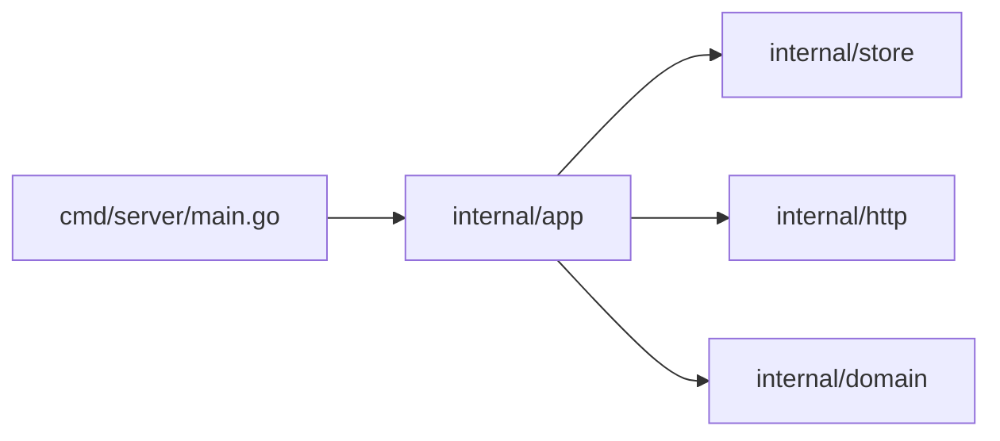
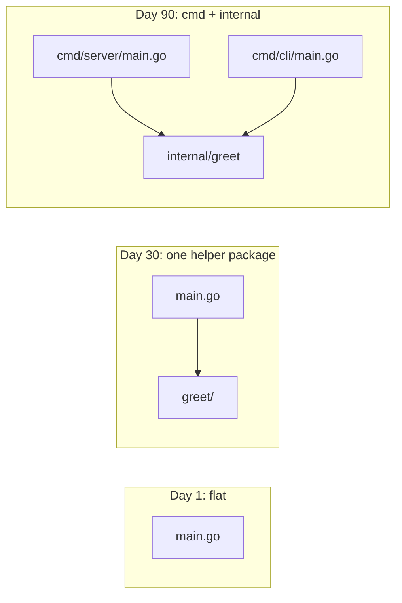
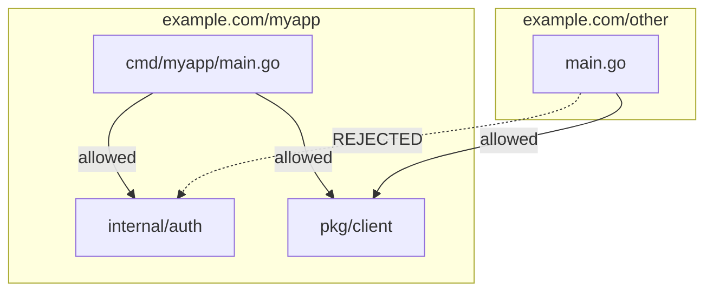

# Project Layout — Junior Level

## Table of Contents
1. [Introduction](#introduction)
2. [Prerequisites](#prerequisites)
3. [Glossary](#glossary)
4. [Core Concepts](#core-concepts)
5. [Real-World Analogies](#real-world-analogies)
6. [Mental Models](#mental-models)
7. [Pros & Cons](#pros--cons)
8. [Use Cases](#use-cases)
9. [Code Examples](#code-examples)
10. [Coding Patterns](#coding-patterns)
11. [Clean Code](#clean-code)
12. [Edge Cases & Pitfalls](#edge-cases--pitfalls)
13. [Common Mistakes](#common-mistakes)
14. [Common Misconceptions](#common-misconceptions)
15. [Tricky Points](#tricky-points)
16. [Test](#test)
17. [Cheat Sheet](#cheat-sheet)
18. [Self-Assessment Checklist](#self-assessment-checklist)
19. [Summary](#summary)
20. [What You Can Build](#what-you-can-build)
21. [Further Reading](#further-reading)
22. [Related Topics](#related-topics)
23. [Diagrams & Visual Aids](#diagrams--visual-aids)

---

## Introduction

> Focus: "What folders go where?" and "How do I grow a project without painting myself into a corner?"

You started Go with one file:

```
hello/
├── go.mod
└── main.go
```

That works. But the moment you have a `main.go`, a few helper files, a database setup, and tests, you start asking: *where does this go?* Should I make a folder? What do I name it? Why do I keep seeing `cmd/`, `internal/`, `pkg/` in other people's repos?

Project layout is the answer to that question. It is not the language — Go's compiler does not require any particular folder names — but it is a set of conventions the community has settled on, plus two folders (`internal/` and `vendor/`) that the toolchain *does* treat specially.

After reading this file you will:
- Know when to keep a flat layout and when to split into folders
- Recognize the four-or-five canonical top-level folders by name (`cmd/`, `internal/`, `pkg/`, `api/`, `configs/`, `scripts/`)
- Move from a single `main.go` to `cmd/myapp/main.go + internal/` without breaking imports
- Understand why `internal/` is special and what `pkg/` actually does (and does not do)
- Read a typical Go repository and predict where to find the code you want to read

You do **not** need to know about workspaces, monorepos, build tags, vendoring strategies, or refactor automation yet. Those are middle and senior topics.

---

## Prerequisites

- **Required:** A Go module — i.e., you have run `go mod init example.com/myapp` and you have a `go.mod`.
- **Required:** Comfort writing `package` declarations and `import` statements.
- **Required:** You have written at least one program with two `.go` files in the same package.
- **Helpful:** Some experience with another language's conventions (Java's `src/main/java`, Rust's `src/`, Python's package layout). You will see what Go does *differently*.
- **Helpful:** A text editor with `gopls` integration. It auto-imports as you type, which lets you focus on layout rather than fixing import paths by hand.

If `go build ./...` runs cleanly in your project today, you are ready.

---

## Glossary

| Term | Definition |
|------|-----------|
| **Module** | The unit of versioning. Defined by a `go.mod` file. The directory containing `go.mod` is the **module root**. |
| **Module path** | The string after `module` in `go.mod`, e.g. `example.com/myapp`. Every package import inside the module begins with this path. |
| **Package** | A directory of `.go` files that share a `package <name>` clause. One directory = one package. |
| **Import path** | The string in an `import "..."` statement. It maps to a directory under the module root (or a third-party module under the cache). |
| **`main` package** | A special package whose `func main()` is the entry point of an executable binary. |
| **`cmd/`** | A conventional folder that holds one `main` package per binary your repo produces. |
| **`internal/`** | A folder name with **special toolchain behavior**: packages under `internal/` can only be imported by code rooted at the parent of `internal/`. |
| **`pkg/`** | A conventional folder for code intentionally exposed for outside consumers to import. The toolchain treats it like any other folder — the convention is purely social. |
| **`api/`** | A conventional folder for API contracts: OpenAPI/Swagger specs, Protobuf `.proto` files, JSON schemas. |
| **`configs/`** | A conventional folder for example configuration files (YAML, TOML, JSON) that ship with the project. |
| **`scripts/`** | A conventional folder for shell scripts, build helpers, and one-off automation. |
| **`vendor/`** | An optional folder that holds a copy of all dependency source. Toolchain-aware. |
| **Flat layout** | A layout with no subdirectories — every `.go` file lives at the module root. |
| **Multi-binary repo** | A module that produces more than one executable; typically uses `cmd/<binary>/main.go` for each. |

---

## Core Concepts

### One directory equals one package

This is the foundational rule. Every `.go` file in a directory must declare the **same** `package` name, and that directory is the package the rest of the codebase imports.

```
internal/auth/
├── login.go    // package auth
├── logout.go   // package auth
└── token.go    // package auth
```

Three files, one package: `auth`. To use any function from any of these files, another package writes:

```go
import "example.com/myapp/internal/auth"

auth.Login(...)
auth.IssueToken(...)
```

You cannot have two packages in the same directory. You cannot split one package across two directories. Filename is a comment to humans; what the compiler cares about is the directory and the `package` clause.

### The module path is the import path's prefix

Open your `go.mod`:

```
module example.com/myapp

go 1.22
```

Every directory inside this module is importable as `example.com/myapp/<relative-path>`. So `internal/auth/login.go` is reached at `example.com/myapp/internal/auth`. The directory tree and the import path are isomorphic — there is no `src/`, no `pom.xml`, no separate "namespace" file. The disk *is* the import graph.

### `internal/` is a fence the toolchain enforces

Any directory named `internal/` partitions the tree:

- Packages under `<root>/internal/...` can be imported **only** by packages rooted at `<root>/...`.
- Packages outside `<root>` (other modules, other tools) cannot import them — `go build` rejects the import with a hard error.

This is the *only* layout convention the Go toolchain enforces. Everything else (`cmd/`, `pkg/`, `api/`) is naming on top of normal directories.

### `cmd/<binary>/` holds one `main` per binary

A `package main` declaration with `func main()` produces an executable. If your repo ships **one** binary, you can put `main.go` at the root. If you ship **two or more**, you need a separate `main` package per binary, and the conventional location is `cmd/<binary-name>/main.go`:

```
cmd/
├── server/
│   └── main.go      // package main → "server" binary
└── cli/
    └── main.go      // package main → "cli" binary
```

`go build ./cmd/server` builds one. `go build ./cmd/cli` builds the other. `go build ./...` builds both.

### `pkg/` is convention, not enforcement

A folder named `pkg/` *signals* "this is the public API of this repo for other modules." The toolchain does not care — it imports `pkg/foo` exactly like `internal/foo` or `foo`. The convention exists because it visually separates "stuff outside teams may import" from "stuff that is for our binaries." Many large Go projects use it; many do not. The Go standard library does not.

---

## Real-World Analogies

**1. A workshop floor plan.** The lobby (`cmd/`) is where customers arrive — every door leads to one finished product. The back room (`internal/`) is the workshop, off-limits to customers. The display case (`pkg/`) is what you put on the front shelf for visitors to take. The filing cabinet (`configs/`) holds the instruction manuals. The toolbox (`scripts/`) is your wrenches and screwdrivers.

**2. A book.** The chapters (packages) live in folders. The cover and table of contents (`README.md`, `go.mod`) sit at the front. Footnotes and references (`docs/`, `api/`) belong in the back. You don't dump everything into the foreword.

**3. A house with a fenced backyard.** `internal/` is the fenced backyard: people inside the house can use it freely; neighbors cannot. The front yard (`pkg/`) is open to the street — anyone can walk through, but they have to behave.

**4. A restaurant kitchen.** `cmd/` is the dining room (where the meal is served). `internal/` is the kitchen (where the meal is made; customers don't enter). `api/` is the menu (the contract you publish). `configs/` is the recipe binder.

---

## Mental Models

### Model 1 — The disk *is* the import graph

There is no `index.ts`, no `__init__.py`, no `mod.rs`. A directory under your module root is automatically importable at `<module-path>/<relative-dir>`. To understand a Go project, you just `tree` it. There is no hidden registry.

### Model 2 — `internal/` draws a wall; `pkg/` paints a sign

`internal/` is enforced by `go build`. Try to import an `internal/` package from outside its parent and your build fails with a clear error. `pkg/` is a label your team agreed on — it has no compiler effect. Treat them differently: `internal/` is an actual constraint; `pkg/` is documentation.

### Model 3 — Start flat, split when it hurts

Beginners over-organize. A 200-line program does not need `cmd/`, `internal/`, `pkg/`, and `api/`. It needs `main.go`. Add folders when:
- You have two binaries (introduce `cmd/`).
- You have package-level code you want hidden from outside importers (introduce `internal/`).
- You have a clear public API for other modules (introduce `pkg/` — only after you've published or split out a module).

### Model 4 — One binary per `main` package

If you find yourself reaching for build flags or `if`-statements in `main()` to switch between two programs, stop. Make two directories under `cmd/`. Each gets its own `main.go`. The toolchain is happier; readers are happier; CI is happier.

### Model 5 — The module path appears nowhere except `go.mod` (and import statements)

You do not write the module path in your `.go` files except inside `import "..."` strings. If you rename the module (change the line in `go.mod`), you must update every import in your tree. Tools like `gopls` do this automatically; without them, `find` and `sed` work.

---

## Pros & Cons

### Pros of conventional layouts (`cmd/`, `internal/`, etc.)

- **Recognizable.** Every Go developer who has read more than three repos knows where to look.
- **Compiler-enforced boundary** (`internal/`). One real wall is worth a thousand "please do not import this" comments.
- **Easy multi-binary support.** `cmd/<bin>/main.go` scales to ten binaries with no surprises.
- **Friendly to refactors.** Moving a package up or down the tree only requires updating its imports — `gopls rename` handles it.
- **No build configuration.** No `setup.py`, no `Cargo.toml` workspace, no `pom.xml`. The directory tree is the build manifest.

### Cons

- **Easy to over-engineer.** A small CLI does not need six folders. Under-applying conventions is also a problem.
- **`pkg/` debate.** Half the community uses `pkg/`; the other half thinks it adds noise. Reasonable people disagree.
- **`golang-standards/project-layout` is unofficial.** It is a popular template, but it is not endorsed by the Go team. Treating it as gospel can cause friction.
- **Multi-binary repos confuse newcomers.** Where is `main.go`? Buried under `cmd/<thing>/`. The first commit feels heavier.
- **Refactoring is a tree edit.** Renaming a package means changing every import that references it.

### When to use conventional layouts:

- You have at least one of: multiple binaries, code you want to hide from outside importers, a clear public API.

### When NOT to use them:

- You have a 50-line tool that does one thing. A flat `main.go + helpers.go` is correct.

---

## Use Cases

- **Tiny CLI / script.** Flat layout: `main.go`, maybe `helpers.go`, all `package main`.
- **Single-binary application** (web server, daemon, CLI with subcommands). Two-folder layout: `main.go` at the root + `internal/<feature>` packages.
- **Library** intended for others to import. Top-level packages (no `cmd/`, no `internal/`), with clearly named subpackages.
- **Multi-binary monorepo** (server + CLI + worker). `cmd/server`, `cmd/cli`, `cmd/worker` + shared code in `internal/`.
- **Service with strong API contract.** Add `api/` for OpenAPI or Protobuf, generate stubs into `internal/`.

---

## Code Examples

### Example 1 — A flat layout (good for tiny programs)

```
hello/
├── go.mod
├── go.sum
├── main.go
└── greet.go
```

`main.go`:

```go
package main

import "fmt"

func main() {
    fmt.Println(Greet("world"))
}
```

`greet.go`:

```go
package main

func Greet(name string) string {
    return "hello, " + name
}
```

`go.mod`:

```
module example.com/hello

go 1.22
```

Run with `go run .`. Build with `go build`. This is the right layout when the whole program fits in your head. Do not break it up just because you can.

### Example 2 — Splitting helpers into a sub-package

```
hello/
├── go.mod
├── main.go
└── greet/
    └── greet.go
```

`greet/greet.go`:

```go
package greet

func Hello(name string) string {
    return "hello, " + name
}
```

`main.go`:

```go
package main

import (
    "fmt"

    "example.com/hello/greet"
)

func main() {
    fmt.Println(greet.Hello("world"))
}
```

Notice three things:
1. The new package is named `greet` (matches the directory).
2. The import path is `example.com/hello/greet` (module path + relative directory).
3. Inside `main.go`, you call `greet.Hello(...)` — the package name, not the path.

### Example 3 — Adding `internal/` to hide a package

Same project, but we want to make sure no other module ever imports `greet`:

```
hello/
├── go.mod
├── main.go
└── internal/
    └── greet/
        └── greet.go
```

The package code is unchanged. The import path becomes:

```go
import "example.com/hello/internal/greet"
```

Now if a stranger forks your repo and tries to `import "example.com/hello/internal/greet"` from their own module, the build fails:

```
package example.com/hello/internal/greet is not allowed
```

That is the toolchain enforcing the `internal/` rule. Inside your own module, the import works exactly like a normal package.

### Example 4 — Two binaries with `cmd/`

You decide your project ships both a server and a CLI. Restructure:

```
hello/
├── go.mod
├── cmd/
│   ├── server/
│   │   └── main.go
│   └── cli/
│       └── main.go
└── internal/
    └── greet/
        └── greet.go
```

`cmd/server/main.go`:

```go
package main

import (
    "fmt"
    "net/http"

    "example.com/hello/internal/greet"
)

func main() {
    http.HandleFunc("/", func(w http.ResponseWriter, r *http.Request) {
        fmt.Fprintln(w, greet.Hello("world"))
    })
    http.ListenAndServe(":8080", nil)
}
```

`cmd/cli/main.go`:

```go
package main

import (
    "fmt"

    "example.com/hello/internal/greet"
)

func main() {
    fmt.Println(greet.Hello("world"))
}
```

Build either:

```bash
go build ./cmd/server
go build ./cmd/cli
go build ./...   # builds both
```

The shared logic lives in `internal/greet`. Both binaries reach it through the same import path. There is no duplication, no copy-paste.

### Example 5 — Adding a `pkg/` for a public helper

You publish your project as a library that other modules may use. You expose a `client` package:

```
hello/
├── go.mod
├── cmd/
│   └── server/
│       └── main.go
├── internal/
│   └── greet/
│       └── greet.go
└── pkg/
    └── client/
        └── client.go
```

`pkg/client/client.go`:

```go
package client

import "net/http"

type Client struct {
    BaseURL string
    HTTP    *http.Client
}

func New(baseURL string) *Client {
    return &Client{BaseURL: baseURL, HTTP: http.DefaultClient}
}
```

External users import:

```go
import "example.com/hello/pkg/client"

c := client.New("http://localhost:8080")
```

`pkg/` is *just a directory*. Removing the `pkg/` segment (so the import becomes `example.com/hello/client`) is equally valid. The convention exists for the human reader: "things outside this folder are public; things inside `internal/` are private."

### Example 6 — A typical service layout

A real, production-shaped service:

```
mysvc/
├── go.mod
├── go.sum
├── README.md
├── Makefile
├── cmd/
│   └── mysvc/
│       └── main.go
├── internal/
│   ├── http/
│   │   ├── handlers.go
│   │   ├── middleware.go
│   │   └── routes.go
│   ├── store/
│   │   ├── postgres.go
│   │   └── store.go
│   └── domain/
│       ├── user.go
│       └── order.go
├── api/
│   └── openapi.yaml
├── configs/
│   └── example.yaml
└── scripts/
    └── migrate.sh
```

Reading this tree, an experienced Go developer instantly knows:
- `cmd/mysvc/main.go` is the entrypoint.
- `internal/` holds everything specific to this service. No outside module imports it.
- `api/openapi.yaml` is the API contract.
- `configs/` ships a sample config.
- `scripts/` holds operational helpers.

There is no mystery. The folder names *are* the documentation.

### Example 7 — A library (no binaries at all)

If you publish a Go library — say, a UUID generator — you do not have a `cmd/` directory at all:

```
uuid/
├── go.mod
├── uuid.go
├── uuid_test.go
└── doc.go
```

The package at the root is named `uuid`. Users import `example.com/uuid`. Everything is public; there is no `internal/`. Library layouts are simpler than service layouts because there are no binaries.

---

## Coding Patterns

### Pattern 1 — Flat first, split on pain

**Intent:** Avoid premature folder creation. Re-organize when a real problem appears.
**When to use:** Every new project.

```
day1/
├── go.mod
└── main.go         # 200 lines is fine

day30/
├── go.mod
├── main.go
└── helpers.go      # spillover into one new file

day90/
├── go.mod
├── main.go
└── greet/
    └── greet.go    # promoted to a package because main.go got dense
```

**Remember:** Each split should be triggered by a concrete pain point — `main.go` is too long, two `main` packages need shared code, an external module wants to import a piece — not by speculation.

### Pattern 2 — `cmd/<bin>/main.go` is thin

The `main.go` inside `cmd/` should be glue, not logic. Parse flags, build dependencies, call into `internal/`.

```go
package main

import (
    "log"
    "os"

    "example.com/myapp/internal/app"
)

func main() {
    if err := app.Run(os.Args[1:]); err != nil {
        log.Fatal(err)
    }
}
```

**Diagram:**



**Remember:** A 50-line `main.go` is a healthy `main.go`. A 500-line `main.go` is a missed extraction.

### Pattern 3 — Group by domain, not by technical layer

**Bad** (group by technical role):

```
internal/
├── handlers/        # all HTTP handlers
├── repositories/    # all database code
└── services/        # all "business logic"
```

**Better** (group by feature/domain):

```
internal/
├── user/            # everything about users (handler + service + repo)
├── order/           # everything about orders
└── billing/         # everything about billing
```

**Remember:** When you grow past two or three features, domain-grouping localizes change. Adding a feature usually means changing one folder, not three.

### Pattern 4 — Test files live next to the code they test

```
internal/greet/
├── greet.go
└── greet_test.go
```

Same package, same directory. The test file uses `package greet` (white-box) or `package greet_test` (black-box). No separate `tests/` folder, ever.

---

## Clean Code

### Folder naming

- Use **short, lowercase** names. `auth`, `user`, `store` — not `authentication-service-v2`.
- Avoid pluralization unless it reads naturally: `internal/handlers/` is fine, but `internal/handler/` (singular, treated as a concept) is also fine. Pick one and stick to it.
- Avoid `util` and `common`. They become dumping grounds. Prefer specific names: `slogutil`, `timeutil`.

### Avoid `util` packages

A package named `util` accumulates anything that does not fit elsewhere. Six months later it has 40 files and contradictory APIs. If you find yourself creating `util`, stop and ask: what would I name this package if I had to describe what it *does*? That is the right name.

### Don't import a sibling cmd from another cmd

```go
// In cmd/cli/main.go — DO NOT DO THIS
import "example.com/myapp/cmd/server"   // wrong
```

Each `cmd/<bin>/` is a self-contained binary. They share code through `internal/`, not by importing each other.

### Keep `main.go` short

A `main.go` that does flag parsing, configuration loading, dependency wiring, and error handling is fine — those are `main`'s jobs. A `main.go` that contains business logic is not. Move the logic to `internal/`.

---

## Edge Cases & Pitfalls

### Pitfall 1 — `internal/` only blocks *outside* importers

If your module has `example.com/myapp/internal/auth`, then any package under `example.com/myapp/...` can import it. That includes packages in `cmd/`, in `pkg/`, anywhere inside the same module. The wall is module-wide.

```
example.com/myapp/internal/auth   ← can be imported by example.com/myapp/anything
                                    cannot be imported by example.com/other-app
```

### Pitfall 2 — `internal/` can appear at any depth

The `internal/` rule is *relative to its parent*:

```
example.com/myapp/internal/auth         ← only example.com/myapp/* may import
example.com/myapp/feature/internal/x    ← only example.com/myapp/feature/* may import
```

Nested `internal/` directories let you draw smaller fences inside larger ones.

### Pitfall 3 — Renaming the module breaks every import

If you change `module example.com/myapp` to `module github.com/me/myapp` in `go.mod`, every internal import statement (`"example.com/myapp/internal/..."`) must be rewritten. `gopls` does this automatically; manual edits are error-prone.

### Pitfall 4 — Two `main` packages in the same directory

```
cmd/server/main.go     // package main
cmd/server/admin.go    // package main, also has func main()
```

Two `func main()` declarations in the same package — compile error. Each binary needs its own folder.

### Pitfall 5 — `pkg/` does not enforce anything

A junior engineer sometimes assumes `pkg/` makes things "extra public" or that `internal/` requires `pkg/` to be opposite. No. `pkg/` is *just a directory*. Without `internal/`, every directory in your module is already importable by anyone.

### Pitfall 6 — Empty directories disappear in Git

A pristine `internal/` with no `.go` files inside is not committed. If you create the folder hoping to fill it later, drop a `.gitkeep` or wait until you have actual code.

---

## Common Mistakes

1. **Premature `cmd/` for a single binary.** A one-binary project at `main.go` is fine. Promote to `cmd/myapp/main.go` when you have a *second* binary.
2. **Putting everything under `pkg/`.** `pkg/everything` is no different from `everything`. The convention only helps when paired with `internal/`.
3. **Naming a package after its file.** `greet/greeter.go` with `package greeter`. Now the package name and directory name disagree; every import needs an alias. Match the package name to the *directory*.
4. **`util`, `common`, `helpers`.** Dumping grounds. Always extractable into specific packages.
5. **Splitting by technical layer when the project is small.** `handlers/`, `services/`, `repositories/` for a five-endpoint API turns one feature change into six file edits.
6. **Putting `_test.go` files in a separate folder.** They belong next to the code they test, in the same package.
7. **Making `main.go` 800 lines long.** Extract to `internal/`.
8. **Importing a sibling `cmd/` package.** Never. Share through `internal/`.

---

## Common Misconceptions

| Misconception | Reality |
|---------------|---------|
| "`pkg/` is enforced by Go." | No. Only `internal/` and `vendor/` have toolchain meaning. |
| "Every Go project must have `cmd/`." | No. Single-binary projects can keep `main.go` at the root. |
| "I should follow `golang-standards/project-layout` exactly." | It is a community template, not an official standard. The Go team has explicitly distanced itself from it. Use it as a reference, not a rulebook. |
| "Subdirectories with no `.go` files create a sub-package." | No. A directory becomes a package only when it has `.go` files. |
| "`internal/` makes code 'private' like a Java private member." | Closer to "package-private but module-wide." Code under `internal/` is fully visible to other code *in the same module*. |
| "I need a `src/` folder." | Go has no `src/` convention. Code lives at the module root and below. |

---

## Tricky Points

### Trick 1 — `internal/` blocks *imports*, not file access

```
example.com/myapp/internal/auth
```

A consumer of `example.com/other` cannot `import "example.com/myapp/internal/auth"`. But they can absolutely `git clone` your repo and read the source. `internal/` is about the *import graph*, not the *file system*. It enforces a build-time constraint, not a privacy constraint.

### Trick 2 — A module *is* its `go.mod`

The "root" of a module is wherever `go.mod` lives. `internal/` is relative to that root. Move `go.mod` to a subdirectory and the entire boundary moves with it. This matters in monorepos where multiple `go.mod` files coexist (more in middle.md).

### Trick 3 — Package name need not match folder name (but should)

You *can* have `internal/auth/login.go` declaring `package authentication`. Imports use the directory: `import "example.com/myapp/internal/auth"`. Calls use the package name: `authentication.Login(...)`. Disagreement between the two means every importer has to remember the difference. Always make them match unless you have a fantastic reason.

### Trick 4 — `cmd/` is just a folder name, but `main.go` is special

The toolchain doesn't recognize `cmd/`. It recognizes `package main`. By convention, every `main` package lives at `cmd/<binary>/main.go`. You could put `package main` in any folder; `cmd/` is just where readers expect to find them.

### Trick 5 — `vendor/` is a real toolchain folder

If you have a `vendor/` directory at your module root with the right structure, `go build` uses it instead of the module cache. This is a build-mode flip, not a convention. More in professional.md.

---

## Test

```go
// Self-test: predict the import path for each file in this tree.
//
// example.com/myapp/
// ├── go.mod              (module example.com/myapp)
// ├── main.go
// ├── internal/
// │   ├── auth/
// │   │   └── login.go    // package auth
// │   └── store/
// │       └── pg.go       // package store
// └── pkg/
//     └── client/
//         └── client.go   // package client

// What does main.go write to import all three?
//
// Answer:
// import (
//     "example.com/myapp/internal/auth"
//     "example.com/myapp/internal/store"
//     "example.com/myapp/pkg/client"
// )
//
// The toolchain rejects this only if main.go is *outside* example.com/myapp.
```

Try this exercise: take a Go repo you do not know and just run `tree -L 3` (or `ls cmd/ internal/`). Predict what each binary does and where the shared code lives. Then look at the actual `main.go` files. The predictions should be close.

---

## Cheat Sheet

```
# A typical service tree
myapp/
├── go.mod                 # module path
├── cmd/                   # one folder per binary
│   └── myapp/
│       └── main.go
├── internal/              # private code — toolchain-enforced
│   ├── http/
│   ├── store/
│   └── domain/
├── pkg/                   # optional: public packages for outside use
├── api/                   # optional: API specs (OpenAPI, .proto)
├── configs/               # optional: example configs
└── scripts/               # optional: helper scripts

# Build commands
go build ./...             # builds every package and binary
go build ./cmd/myapp       # builds the myapp binary
go run ./cmd/myapp         # builds and runs in one step
go install ./cmd/myapp     # installs to $GOBIN

# Toolchain rules to remember
- internal/         enforced; only the parent's subtree may import
- vendor/           when present, used instead of the module cache
- pkg/, cmd/, etc.  pure convention; no special treatment
```

---

## Self-Assessment Checklist

You understand junior-level project layout if you can:

- [ ] Explain why one directory equals one package.
- [ ] Predict the import path for any file in a Go module given its `go.mod`.
- [ ] Describe what `internal/` does and why moving a package into `internal/` does not change behavior for code in the same module.
- [ ] Decide between flat and `cmd/`-based layout for a new project.
- [ ] Restructure a single `main.go` into `cmd/<bin>/main.go + internal/<pkg>/...` without breaking the build.
- [ ] Read another developer's repo and find the entrypoint and the shared logic in under a minute.
- [ ] Explain why putting tests in a separate `tests/` folder is wrong in Go.
- [ ] Explain the difference between `pkg/` (convention) and `internal/` (enforcement).

---

## Summary

- Go's project layout is mostly **convention**, with two compiler-enforced exceptions: `internal/` and `vendor/`.
- One directory equals one package. The disk *is* the import graph.
- A module's path (in `go.mod`) plus the relative directory equals the import path.
- For tiny programs, a flat layout is correct. Add folders when you have a concrete reason: multiple binaries (`cmd/`), code to hide (`internal/`), or a public API (`pkg/`).
- `cmd/<binary>/main.go` is the standard place for executables in multi-binary repos.
- `internal/` enforces a wall: nothing outside the parent module can import it.
- `pkg/` is documentation by directory name. Useful for clarity; not magical.
- Never invent `tests/`. Tests live next to the code they test.
- Resist `util`, `common`, `helpers` — they accumulate into pain.

---

## What You Can Build

With a junior-level grasp of layout, you can build:

- A single-binary CLI tool (flat layout).
- A small web service with one binary and a few `internal/` packages.
- A two-binary monorepo (server + CLI sharing `internal/`).
- A simple Go library that other modules can import.
- A service that ships an OpenAPI spec from `api/` and example configs from `configs/`.

You are not yet ready to design a five-binary monorepo with strict boundaries between teams (middle/senior topics) or to operate a polyrepo with vendoring (professional).

---

## Further Reading

- [Go Modules Reference](https://go.dev/ref/mod) — the only official document about `internal/` and `vendor/`.
- [Effective Go](https://go.dev/doc/effective_go) — package naming guidance.
- [`golang-standards/project-layout`](https://github.com/golang-standards/project-layout) — popular community template (read with skepticism; it is not endorsed by the Go team).
- [pkg.go.dev](https://pkg.go.dev) — browse real Go libraries and observe their layouts.
- [`cmd/go` documentation](https://pkg.go.dev/cmd/go) — the toolchain itself, including the rules around `internal/`.

---

## Related Topics

- **Modules.** A project layout makes sense only inside a module. See `06-code-organization/01-modules`.
- **Packages.** Layout is the spatial side of packaging. See `06-code-organization/02-packages`.
- **Build constraints.** Some layouts use build tags to include or exclude files; see professional.md.
- **Testing.** Test files always live next to the code they test; see `04-testing`.

---

## Diagrams & Visual Aids

### A growing project, three snapshots



### `internal/` enforcement



### A typical service tree

```
myapp/
├── go.mod
├── go.sum
├── cmd/myapp/main.go      ← entrypoint
├── internal/
│   ├── http/              ← HTTP handlers and routing
│   ├── store/             ← persistence
│   └── domain/            ← business types and rules
├── api/openapi.yaml       ← API contract
├── configs/example.yaml   ← sample config
└── scripts/migrate.sh     ← operational helpers
```

This is the layout you will see in 80% of mid-sized Go services. Once it is in your eye, every Go repo on GitHub becomes faster to read.
