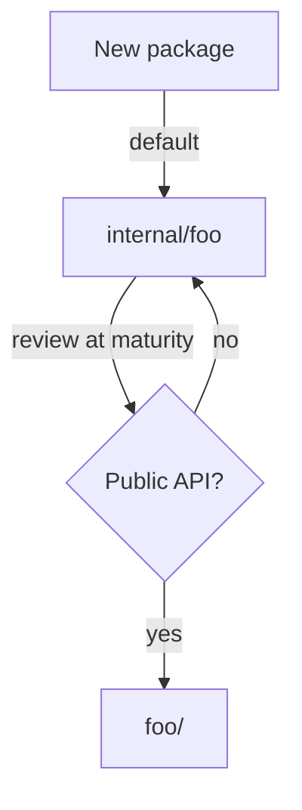

# Internal Packages — Junior Level

## Table of Contents
1. [Introduction](#introduction)
2. [Prerequisites](#prerequisites)
3. [Glossary](#glossary)
4. [Core Concepts](#core-concepts)
5. [Real-World Analogies](#real-world-analogies)
6. [Mental Models](#mental-models)
7. [Pros & Cons](#pros--cons)
8. [Use Cases](#use-cases)
9. [Code Examples](#code-examples)
10. [Coding Patterns](#coding-patterns)
11. [Clean Code](#clean-code)
12. [Product Use / Feature](#product-use--feature)
13. [Error Handling](#error-handling)
14. [Best Practices](#best-practices)
15. [Edge Cases & Pitfalls](#edge-cases--pitfalls)
16. [Common Mistakes](#common-mistakes)
17. [Common Misconceptions](#common-misconceptions)
18. [Tricky Points](#tricky-points)
19. [Test](#test)
20. [Tricky Questions](#tricky-questions)
21. [Cheat Sheet](#cheat-sheet)
22. [Self-Assessment Checklist](#self-assessment-checklist)
23. [Summary](#summary)
24. [What You Can Build](#what-you-can-build)
25. [Further Reading](#further-reading)
26. [Related Topics](#related-topics)
27. [Diagrams & Visual Aids](#diagrams--visual-aids)

---

## Introduction
> Focus: "What is an `internal/` package?" and "How do I use it?"

Most languages have a keyword for hiding things — `private` in Java, `pub(crate)` in Rust, `_` prefixes in Python convention. Go has neither a `private` keyword nor underscores at the package level. Instead, Go has **one rule about a directory name**:

> A package whose import path contains a path element named `internal` may only be imported by code rooted at the parent of that `internal` directory.

That sentence is the entire feature. There is no annotation, no flag, no build tag. You put a package under a folder called `internal/`, and the compiler refuses to let unauthorised code import it.

Concretely, if your project looks like this:

```
myapp/
├── go.mod
├── main.go
└── internal/
    └── secret/
        └── secret.go
```

then `myapp/main.go` may write `import "myapp/internal/secret"`, but a *different* module — say `someoneelse/tool` — that tries the same import gets a hard compiler error. Go enforces it. You did not ask. You did not need to configure anything.

After reading this file you will:
- Know what `internal/` is and why Go added it
- Tell at a glance whether one package may import another
- Lay out a small project so its public API is intentional, not accidental
- Use the most common `internal/` patterns: `app/internal/service`, `cmd/.../internal/...`, and `pkg-vs-internal`
- Compare `internal/` to `private` in Java/C# and to underscore convention in Python
- Recognise the four or five error messages you will see when a forbidden import sneaks in

You do **not** need to know about multi-level `internal/` trees, refactoring strategies, monorepos, or how the toolchain implements the rule. Those are middle, senior, and professional topics.

---

## Prerequisites

- **Required:** A Go module (`go mod init` has been run; you have a `go.mod`).
- **Required:** Comfort with the *normal* package import system — you can write `import "fmt"` and you understand that import paths and folder paths line up.
- **Required:** You have written at least one program with two or more packages of your own.
- **Helpful:** A working text editor with Go support (VS Code with `gopls`, GoLand, Neovim with `gopls`). It will surface forbidden-import errors immediately.
- **Helpful:** A scratch folder where you can break things on purpose.

If `go build ./...` succeeds in a project of yours that has more than one package, you are ready.

---

## Glossary

| Term | Definition |
|------|-----------|
| **`internal/`** | A magic directory name. Anything under it may only be imported by code rooted at its parent directory. |
| **Public package** | A package not under any `internal/` directory. Anyone who can find your module can import it. |
| **Internal package** | Any package whose import path contains an `internal` element. Restricted to the subtree above the `internal` element. |
| **Import path** | The string you write inside `import "..."`. Matches the directory path under your module root. |
| **Module path** | The string declared by `module ...` at the top of `go.mod`. The prefix of every import path inside the module. |
| **Module root** | The directory that contains `go.mod`. The base of all package import paths in the module. |
| **Compiler-enforced** | The rule is checked by `cmd/go` (the `go` toolchain) at build time. Not a convention; a hard error. |
| **Public API** | The set of packages other modules are *allowed* to import — i.e., everything **not** under `internal/`. |
| **Visibility** | Who is allowed to import a package. In Go, controlled by the position of `internal/` in the path. |
| **Sibling package** | Two packages with the same parent directory. They can always import each other (visibility-wise). |
| **Identifier-level export** | Capitalising the first letter of a name (`Foo` vs `foo`). This is *intra-package* visibility, separate from the `internal/` mechanism. |

The two visibility systems — capitalised identifiers and the `internal/` directory — are independent. Capitalisation says *which symbols inside a package* are exported; `internal/` says *which packages outside its parent* may import it at all.

---

## Core Concepts

### The one rule

Read it twice; this is the whole feature:

> A package whose import path contains a path element named `internal` may only be imported by code rooted at the parent of that `internal` directory.

"Rooted at the parent of that `internal` directory" means: the import is allowed if and only if the importing file lives somewhere under that parent. Anything else is rejected.

### A worked example

```
myapp/
├── go.mod                  ← module myapp
├── main.go
├── handler/
│   └── handler.go
└── internal/
    └── auth/
        └── auth.go
```

The parent of `internal/` is `myapp/` (the module root). Anything under `myapp/` may import `myapp/internal/auth`:

- `myapp/main.go` — yes
- `myapp/handler/handler.go` — yes
- `myapp/internal/auth/auth_test.go` — yes

Anything outside `myapp/` may not. If a different module tries to import `myapp/internal/auth`, the build fails:

```
package someoneelse/cmd
        imports myapp/internal/auth: use of internal package myapp/internal/auth not allowed
```

### Multi-level `internal/`

`internal/` can sit deeper in the tree, restricting access more tightly:

```
myapp/
├── go.mod
├── handler/
│   ├── handler.go
│   └── internal/
│       └── parse/
│           └── parse.go
└── service/
    └── service.go
```

Now the parent of `internal/` is `myapp/handler/`. The rule says anything under `myapp/handler/` may import `myapp/handler/internal/parse`:

- `myapp/handler/handler.go` — yes
- `myapp/handler/middleware/cors.go` — yes (same subtree)
- `myapp/service/service.go` — **no**, even though both are inside the same module

This is how you make a package *private to one feature* instead of merely *private to the module*.

### What "the parent" really means

People are sometimes surprised by where the boundary lands. The rule says *the parent of the `internal` directory*. So:

- `myapp/internal/x` → parent is `myapp/`. The whole module sees `x`.
- `myapp/foo/internal/x` → parent is `myapp/foo/`. Only `foo` and its subtree see `x`.
- `myapp/foo/bar/internal/x` → parent is `myapp/foo/bar/`. Only `foo/bar` and its subtree see `x`.

One way to check: walk up from the `internal/` directory by one level. Anything *under* that level is allowed; anything else is not.

### `internal/` is a folder, not a keyword

There is no `internal` keyword in Go source. The mechanism is purely structural. You do not *declare* a package internal — you *place it* in a directory called `internal`. Renaming the directory removes the protection. Moving the directory changes the boundary.

This is unusual and worth letting sink in: visibility is a function of *where the file lives*, not of any annotation in the file itself.

### `internal/` does not affect identifier exports

Inside `myapp/internal/auth/auth.go`:

```go
package auth

func login(user string) {} // unexported identifier
func Login(user string) {} // exported identifier
```

The lowercase `login` is invisible to *anyone* — including other files in the same package's siblings — because of normal Go capitalisation rules. The uppercase `Login` is visible to anyone who is *allowed* to import `myapp/internal/auth`. The two rules compose: a symbol is reachable only if the importer is allowed to import the package *and* the symbol is exported by capitalisation.

---

## Real-World Analogies

**1. An office building with a staff door.** `internal/` is the door marked *Staff Only*. The door itself is just a sign — anyone *could* push it open. Go's compiler is the security guard who checks the badge of every person who tries.

**2. The "private" section of a cookbook.** A family cookbook might have a section labelled "secret recipes — do not share." The cookbook still contains them; they are still pages; but a label warns you not to take them outside the household. `internal/` is that label, except a robot enforces it.

**3. The fence around your back garden.** Your garden (`internal/`) is part of your property; you can do whatever you want there. The fence makes sure neighbours do not start using your barbecue. Move the fence and the boundary moves with it.

**4. The "drafts" folder in shared cloud storage.** Documents in the public folder are visible to the whole company. Documents in `drafts/` are visible only to the team that owns the folder — the folder name is a permission, not a comment.

---

## Mental Models

### Model 1 — Walk up one level from `internal/`

Whenever you see an `internal/` directory, mentally walk *one* directory up. That spot is the boundary. Everything in that spot's subtree is allowed in; everything outside is locked out. This is the only rule you need to remember.

### Model 2 — `internal/` is a one-way mirror

Code *inside* the `internal/` subtree can see and be seen by both internal and public packages of the same project. Code *outside* the parent of `internal/` can see only the public packages — `internal/` is opaque to it. Looking *out* is fine; looking *in* is blocked.

### Model 3 — Public is what's left after `internal/` is hidden

Your "public API" is the set of packages *not* inside any `internal/` directory. If you want to know what you have promised the outside world, run a search for every package whose path does not contain `/internal/`. That set is your contract.

### Model 4 — `internal/` answers "may I?", capitalisation answers "what symbols?"

Two gates, in order:

1. *May I import this package at all?* Decided by the position of `internal/` in the path.
2. *Which symbols can I use from it?* Decided by which names are capitalised.

You hit gate 1 first. If gate 1 says no, you never reach gate 2.

### Model 5 — `internal/` is a directory commitment, not a code change

To make a package internal, you do not edit the package's source. You move its folder under an `internal/` directory. To make it public again, you move it back. Source code is untouched in either direction.

---

## Pros & Cons

### Pros

- **Compiler-enforced.** Reviewers cannot forget; CI cannot drift. The compiler refuses bad imports.
- **Zero source-level cost.** No annotations, no decorators, no metadata. A directory rename changes visibility.
- **Composable.** Multi-level `internal/` lets you scope visibility to a subtree, not just to the module.
- **Familiar to outsiders.** Anyone who has read the Go documentation sees `internal/` and immediately knows what it means.
- **Refactoring lever.** Hiding a package under `internal/` means you can change it freely without breaking external callers.

### Cons

- **Coarse-grained.** It is package-level. You cannot mark *one function* internal while exporting the rest.
- **All-or-nothing scope.** A package is either visible to its whole subtree or to nobody outside. There is no "visible to these two siblings only."
- **Easy to over-protect.** Putting everything in `internal/` defeats the purpose of having a public API.
- **Easy to under-protect.** A new contributor places a "helper" package in the public root, and now you have inadvertently promised it as part of your API.
- **Not a security boundary.** It is a build-time check, not runtime isolation. Reflection, forks, and `vendor/` can bypass it.

### When to use:
- You ship a library and want to keep helpers private while exposing a small public API.
- A multi-package application has shared utilities that *no other module* should depend on.
- You want to refactor freely without worrying about external callers.

### When NOT to use:
- A throwaway script. There is no audience to hide from.
- A truly tiny project where every file is in `package main`.
- A package you actively want others to use as a stable extension point — that one belongs in the public surface.

---

## Use Cases

- **Library with a tight public API.** You publish `acme/parser` as a module; everything that is not `Parse`, `Encode`, and a few types lives under `acme/parser/internal/...`.
- **Application with shared infrastructure.** Your service has `internal/db`, `internal/auth`, `internal/queue`. None of those should ever be importable by another module — they encode your operational choices.
- **Mono-repo of CLIs sharing helpers.** Several `cmd/foo`, `cmd/bar` binaries share `internal/cli` for common flag parsing. Other modules cannot grab those helpers; they are yours.
- **Feature module with its own helpers.** A `handler/` package has a `handler/internal/parse` for header parsing — visible to `handler/` and its subtree, hidden from the rest of the project.
- **Standard-library convention.** Even Go itself uses this: `runtime/internal/atomic`, `crypto/internal/...`. They restrict third parties from depending on volatile internals.

---

## Code Examples

### Example 1 — Make a helper package internal

Start with a project that exposes too much:

```
hello/
├── go.mod                  ← module example.com/hello
├── main.go
└── helpers/
    └── helpers.go          ← package helpers
```

`helpers.go`:

```go
package helpers

import "strings"

// Title-cases a single word for greeting display.
func Capitalise(s string) string {
    if s == "" {
        return s
    }
    return strings.ToUpper(s[:1]) + s[1:]
}
```

Right now any other module can `import "example.com/hello/helpers"`. To prevent that, move it under `internal/`:

```
hello/
├── go.mod
├── main.go
└── internal/
    └── helpers/
        └── helpers.go
```

Update the import in `main.go`:

```go
package main

import (
    "fmt"

    "example.com/hello/internal/helpers"
)

func main() {
    fmt.Println(helpers.Capitalise("alice"))
}
```

Build it:

```bash
go build ./...
```

It works. Now the helper is hidden — no other module can pull it in.

### Example 2 — Watch the rule reject an outside importer

In a *different* module, try to import the previous helper:

`other/go.mod`:

```
module example.com/other

go 1.22
```

`other/main.go`:

```go
package main

import "example.com/hello/internal/helpers"

func main() {
    _ = helpers.Capitalise
}
```

Build:

```
$ go build ./...
main.go:3:8: use of internal package example.com/hello/internal/helpers not allowed
```

That is the message you will memorise. The compiler refuses, full stop.

### Example 3 — Sibling packages may both reach into `internal/`

```
hello/
├── go.mod
├── cmd/
│   └── greet/
│       └── main.go
├── server/
│   └── server.go
└── internal/
    └── auth/
        └── auth.go
```

Both `cmd/greet/main.go` and `server/server.go` may import `example.com/hello/internal/auth`. They are both rooted at `example.com/hello/`, which is the parent of `internal/`.

`server/server.go`:

```go
package server

import "example.com/hello/internal/auth"

func New() *Server {
    return &Server{auth: auth.New()}
}

type Server struct {
    auth *auth.Auth
}
```

`cmd/greet/main.go`:

```go
package main

import (
    "fmt"

    "example.com/hello/internal/auth"
)

func main() {
    fmt.Println(auth.Banner())
}
```

Both compile. Both are inside the parent of `internal/`.

### Example 4 — Multi-level `internal/` inside a feature

Now scope a helper package to *one feature*:

```
hello/
├── go.mod
├── handler/
│   ├── handler.go
│   └── internal/
│       └── parse/
│           └── parse.go
└── service/
    └── service.go
```

`handler/handler.go` may import `example.com/hello/handler/internal/parse`. `service/service.go` **may not** — even though they live in the same module.

```go
// handler/handler.go — OK
package handler

import "example.com/hello/handler/internal/parse"

func Handle() { parse.Header("X-Foo: 1") }
```

```go
// service/service.go — fails
package service

import "example.com/hello/handler/internal/parse"

func Use() { parse.Header("X-Foo: 1") }
```

Build:

```
service/service.go:3:8: use of internal package example.com/hello/handler/internal/parse not allowed
```

The boundary is now the `handler/` directory, not the module root.

### Example 5 — `internal/` inside a published library

A library `acme/parser` v1.0:

```
parser/
├── go.mod                  ← module github.com/acme/parser
├── parser.go               ← public API: Parse, Encode
├── doc.go
└── internal/
    ├── lexer/
    │   └── lexer.go
    └── ast/
        └── ast.go
```

`parser.go`:

```go
package parser

import (
    "github.com/acme/parser/internal/ast"
    "github.com/acme/parser/internal/lexer"
)

func Parse(input string) (*Tree, error) {
    tokens := lexer.Tokenise(input)
    node := ast.Build(tokens)
    return wrap(node), nil
}

type Tree struct{ root *ast.Node }
```

External users see only `Parse`, `Tree`, and the helpers exported from `parser.go`. They cannot import `lexer` or `ast` even if they really want to. The maintainers of `acme/parser` are free to rewrite, rename, or delete the internal packages without breaking a single consumer.

### Example 6 — Show the full error message

A CI log fragment from a failed build:

```
$ go build ./...
# example.com/other
./main.go:5:2: use of internal package example.com/hello/internal/helpers not allowed
```

The `# example.com/other` line is the importing package; the next line is the offence. No traceback, no location of `internal/` — just a plain rejection.

### Example 7 — `cmd/`-rooted internals (a common convention)

A repo with multiple binaries sharing internals only useful to the binaries:

```
project/
├── go.mod
├── cmd/
│   ├── api/
│   │   └── main.go
│   ├── worker/
│   │   └── main.go
│   └── internal/
│       └── flagutil/
│           └── flagutil.go
└── pkg/
    └── shared/
        └── shared.go
```

`cmd/internal/flagutil` is reachable only from anything under `cmd/`. The `pkg/shared` package — and any external consumer — cannot import it. This keeps CLI scaffolding distinct from re-usable library code.

### Example 8 — Tests are part of the same subtree

`internal/auth/auth_test.go` lives next to `auth.go`. It can import its sibling normally because the test file is *inside* the `internal/` subtree:

```go
// internal/auth/auth_test.go
package auth

import "testing"

func TestLogin(t *testing.T) {
    if !checkLogin("user", "pwd") {
        t.Fatal("expected ok")
    }
}
```

A black-box test using `package auth_test` in the same directory also works:

```go
// internal/auth/auth_blackbox_test.go
package auth_test

import (
    "testing"

    "example.com/hello/internal/auth"
)

func TestPublicAPI(t *testing.T) {
    _ = auth.Banner()
}
```

The black-box test imports `example.com/hello/internal/auth` from a file inside `example.com/hello/internal/auth/` — still inside the parent of `internal/`. Allowed.

---

## Coding Patterns

### Pattern 1 — `internal/` as a default for new packages

When you add a new package, *start* by placing it under `internal/`. Move it out only when you have decided it is part of the public API. This way the default is "private," which is almost always what a beginner wants.

```
project/
├── go.mod
└── internal/
    └── newthing/        ← starts here
        └── newthing.go
```

If, six months later, the team agrees `newthing` is genuinely re-usable, move it:

```
project/
├── go.mod
└── newthing/            ← promoted to public
    └── newthing.go
```

`go mod tidy` and a search-and-replace on the import path are usually all the migration that is needed.

**Diagram:**



**Remember:** `internal/` is the "I have not promised this yet" parking lot.

### Pattern 2 — One `internal/` at the module root

For a typical small or medium project, a single `internal/` directory at the module root is enough:

```
project/
├── go.mod
├── cmd/api/main.go
├── api/                    ← public
│   └── api.go
└── internal/
    ├── service/
    ├── repo/
    └── auth/
```

Everything under `internal/` is module-private. Everything outside is public. This is the most common shape and the easiest to reason about.

**Remember:** Most projects do not need multi-level `internal/`. Reach for it only when you want to limit visibility *inside* the module.

### Pattern 3 — Feature-scoped `internal/`

When a feature has helpers that nothing else in the module should touch, give it its own `internal/`:

```
project/
├── go.mod
├── handler/
│   ├── handler.go
│   └── internal/
│       └── parse/
│           └── parse.go
└── service/
    └── service.go
```

`service` cannot reach `parse`. The handler keeps its helpers truly local. This is rare in small projects, common in larger ones.

---

## Clean Code

### Naming

```go
// Bad — vague
package internal // (does not even compile; "internal" is reserved as a folder name only)

// Good — internal/ is the directory; the package keeps its real name
package auth     // file is in internal/auth/auth.go
package parse    // file is in handler/internal/parse/parse.go
```

**Rules:**
- Never name a *package* `internal`. The directory is named `internal`; the package inside has its real name.
- The package name should describe what the package *is*, not where it lives.

### File layout

```
project/
├── go.mod
├── doc.go            ← package-level doc comment for module root (if any)
├── api/              ← public API
├── cmd/              ← binaries
│   ├── server/
│   └── tool/
├── internal/         ← module-private
│   ├── service/
│   ├── repo/
│   └── auth/
└── README.md
```

Keep public packages at the top level; keep private ones under `internal/`. Resist the urge to nest `internal/` inside `internal/` "just in case" — flat is easier to read.

### Import grouping

Standard layout: standard library, blank line, third-party, blank line, local module:

```go
import (
    "context"
    "fmt"

    "github.com/google/uuid"

    "example.com/hello/internal/auth"
)
```

`gofmt` and `goimports` enforce the order. Internal imports look exactly like any other local import — no special prefix is added.

---

## Product Use / Feature

### 1. The Go standard library

- **How it uses `internal/`:** The Go toolchain places implementation packages under `runtime/internal/atomic`, `crypto/internal/...`, `net/internal/...`, and many more. Hundreds of packages live behind `internal/` boundaries.
- **Why it matters:** It lets the Go team change the Go runtime, crypto helpers, and network internals without breaking outside code that "just imported the helper." External code is forced to use the documented API.

### 2. Kubernetes

- **How it uses `internal/`:** Many sub-projects (e.g., `kubectl`'s implementation) keep most code under `internal/` so plugins must use stable extension points.
- **Why it matters:** Kubernetes ships breaking changes to internals freely; the `internal/` rule means consumers cannot reach in and break themselves.

### 3. Hugo (static site generator)

- **How it uses `internal/`:** Helpers and rendering machinery live under `internal/`. The CLI binary is the only public surface.
- **Why it matters:** Hugo is a binary, not a library. It uses `internal/` to keep its package graph honest — internals do not leak out by accident.

---

## Error Handling

There is no runtime error from `internal/`. The check is a *build-time* error from the toolchain. Recognise the two messages.

### "use of internal package ... not allowed"

```
./main.go:3:8: use of internal package example.com/foo/internal/x not allowed
```

**Why it happens:** an importing file lives outside the parent of `internal/`. Either you put the package in the wrong place, or you imported from the wrong file.

**How to fix:**

- Move the package out of `internal/` if it really is meant to be public.
- Move the importing file inside the allowed subtree.
- Or simply do not import it and use the public API instead.

### "cannot find package" / "no Go files"

If you mistype the import path:

```
./main.go:3:8: cannot find package "example.com/foo/internl/x" in any of:
        ...
```

**Why it happens:** typo in the path (`internl`), or the directory does not exist in the module.

**How to fix:** correct the path. Check the directory tree.

### Editor red squigglies

Sometimes `gopls` or the IDE flags the import before `go build` does. The error wording is the same. Save the file, run `go mod tidy`, restart the language server if the squigglies persist after fixing.

---

## Best Practices

1. **Default to `internal/`** for any new package whose purpose you have not yet decided. Promote later.
2. **One `internal/` at the module root** is enough for most projects. Reach for nested `internal/` only when you truly need feature-level scoping.
3. **Never name a package `internal`.** The directory is the magic; the package keeps its real, descriptive name.
4. **Treat your non-`internal/` packages as a contract.** Anything you publish is a promise. `internal/` is your safety net.
5. **Move, do not copy.** When promoting `internal/foo` to `foo/`, rename the directory and `gofmt` the imports — do not duplicate.
6. **Keep `cmd/` thin.** Use `cmd/<binary>/main.go` as a tiny entry point that wires up `internal/` packages. Logic belongs in `internal/`, not in `main`.
7. **Write a `doc.go` at the module root** describing what is public and what is internal, so newcomers see the boundary on day one.
8. **Use the rule, do not fight it.** If you find yourself trying to bypass `internal/` (with `vendor/`, with forks), stop and reconsider; the rule is telling you something.

---

## Edge Cases & Pitfalls

### Pitfall 1 — Putting `internal/` at the wrong depth

```
project/
└── internal/
    └── deep/
        └── internal/         ← redundant
            └── x/
                └── x.go
```

The inner `internal/` is allowed, but it limits visibility to `internal/deep/`'s subtree — usually narrower than you intended. Beginners sometimes nest `internal/` reflexively. Stop and ask: "is *deep* really the boundary I want?"

### Pitfall 2 — Naming your package `internal`

```go
// internal/auth/auth.go
package internal      // wrong
```

Now the package's identifier is `internal`, which makes call sites like `internal.Login(...)` confusing and ugly. The directory is `internal/auth/`; the package name should be `auth`. Always.

### Pitfall 3 — Using `internal/` as a security boundary

`internal/` prevents *imports*. It does not prevent *forking*, *vendoring*, or *patching*. Anyone who clones your repo can edit the source. Treat `internal/` as a build-time API decision, not a security mechanism.

### Pitfall 4 — Tests that black-box-import an `internal/` sibling

A test file in `package foo_test` inside `foo/` may import `foo` because the test still lives in `foo/`. But a test file in `bar/` that wants to test `foo`'s `internal/x` cannot import it — the test file lives outside the parent of `internal/`.

### Pitfall 5 — Vendored copies

If you `go mod vendor`, everyone's `internal/` packages get copied into your `vendor/` tree. They are still subject to the same rule when you build, but reading the source on disk can be confusing — *seeing* the file does not mean you are *allowed* to import it.

### Pitfall 6 — Forgetting that the rule depends on the import path, not the file location

```
project/
├── go.mod                     ← module example.com/project
└── work/
    └── internal/
        └── tool/
            └── tool.go
```

The path matters: `example.com/project/work/internal/tool` has `internal` as a path *element*. The toolchain enforces the rule against the import path, not the on-disk location of the source. They normally agree, but if you ever rename your module path, double-check you have not silently moved the boundary.

### Pitfall 7 — `pkg/internal/` vs `internal/pkg/`

These two trees look similar but differ in scope:

```
proj/pkg/internal/x/    ← parent of internal/ is proj/pkg/
proj/internal/pkg/x/    ← parent of internal/ is proj/
```

The first restricts to `pkg/`'s subtree. The second restricts only to "the module" — every package in `proj/` may import it. Lay out deliberately.

### Pitfall 8 — Type identity across `internal/`

If two different modules each have an `internal/foo` package with a `type Bar` and you somehow get them both into the same binary (rare, requires forks or weird `replace` setups), the two `Bar`s are distinct types — Go identifies types by their full import path. `internal/` does not change identity rules; it only restricts who may import.

---

## Common Mistakes

- **Naming a package `internal`.** The directory is `internal`; the package keeps its descriptive name.
- **Adding `internal/` only at the deepest possible level "to be safe."** Often you accidentally exclude legitimate callers in your own module.
- **Promoting an `internal/` package by *copying* the source instead of *moving*.** Two copies drift; one becomes stale.
- **Using `internal/` to "discourage" use of a package.** It is not a soft hint; it is a hard rule. Either you mean it or you do not.
- **Treating `internal/` as encryption.** Source is still readable. Do not put secrets there.
- **Forgetting to update import paths after moving a package in or out of `internal/`.** A search-and-replace on the import path is part of the move.
- **Using `internal/` to hide *symbols*.** Use lowercase identifiers for that. `internal/` hides whole packages, not individual functions.
- **Nesting `internal/` inside `internal/`.** It is legal but almost always pointless.

---

## Common Misconceptions

> *"`internal/` is a Go keyword."*

No. It is a directory name. There is no syntax change, no annotation, no metadata. The check is implemented by the toolchain.

> *"`internal/` packages are encrypted or hidden on disk."*

No. The source files are plain Go, plain text, in the repo. Anyone who clones the repo sees them. The rule only controls *importing*.

> *"You can't write tests for `internal/` packages."*

You can. Tests inside the same directory are part of the subtree and import normally. White-box tests use the same `package`; black-box tests use `package x_test` and import the package by its full path.

> *"`internal/` was always part of Go."*

No. It was added in Go 1.4 as an experimental feature and made permanent in Go 1.5. Go 1.0–1.3 had no language-level mechanism for hiding packages from outside modules.

> *"`internal/` works only for libraries."*

It works for any module. Applications, libraries, mono-repos — wherever a module exists, the rule applies.

> *"Using `internal/` is a smell."*

The opposite. A library with no `internal/` is usually one that has accidentally exposed its implementation. A small public surface plus a fat `internal/` is healthy.

---

## Tricky Points

- **The rule is enforced by `cmd/go`, not the language spec.** The Go *language* specification says nothing about `internal/`. The *modules and build* documentation is where it lives.
- **`internal/` matches as a path *element*, not a substring.** A directory called `myinternal` or `internalstuff` is *not* magical — only an exact element named `internal`.
- **There can be more than one `internal/` in a path.** Each acts as its own boundary. `a/internal/b/internal/c` is reachable only by code under `a/internal/b/`.
- **`internal/` is independent of `vendor/`.** A vendored copy is still treated as the same package; the rule applies the same way.
- **`go.work` does not relax the rule.** Adding several modules to a workspace does not let one module reach into another's `internal/`.
- **`replace` does not relax the rule.** Even if you `replace` an `internal/` path with your own copy, importers outside the parent are still rejected.
- **`internal/` rejection is at *build* time, not *parse* time.** The file parses fine; the package list resolves; only when the importer is checked against the path does the error fire.

---

## Test

Run this in a scratch folder.

```bash
mkdir -p test-internal/{a,b}
cd test-internal
go mod init example.com/test-internal
mkdir -p internal/secret
```

Create `internal/secret/secret.go`:

```go
package secret

func Whisper() string { return "hush" }
```

Create `a/a.go`:

```go
package a

import "example.com/test-internal/internal/secret"

func A() string { return secret.Whisper() }
```

Build:

```bash
go build ./...
```

Expected: success.

Now create a *second* module:

```bash
cd ..
mkdir other && cd other
go mod init example.com/other
```

Add a `replace` directive so it can find the first module locally:

```bash
go mod edit -replace=example.com/test-internal=../test-internal
go mod edit -require=example.com/test-internal@v0.0.0
```

Create `other/main.go`:

```go
package main

import "example.com/test-internal/internal/secret"

func main() {
    _ = secret.Whisper()
}
```

Build:

```bash
go build ./...
```

Expected: error.

```
main.go:3:8: use of internal package example.com/test-internal/internal/secret not allowed
```

Now answer:

1. Why does `a` succeed but `other` fail, even though both write the same import line?
2. If you move `internal/secret` to `secret/` (drop the `internal/` segment), do both builds succeed?
3. Which directory does the rule treat as "the parent of `internal/`" in the first project?
4. What error message do you get if you mistype the path as `intern/secret`?

---

## Tricky Questions

**Q1.** Is `internal/` a Go *language* feature or a *toolchain* feature?

A. Toolchain. The language specification (`go.dev/ref/spec`) does not mention it. The rule is documented in the build documentation under `cmd/go`.

**Q2.** Can a Go file inside `internal/` import a package outside `internal/`?

A. Yes. The rule is one-way: it restricts who may import the internal package, not what the internal package may import. An `internal/x` package is free to import any other package, public or otherwise (subject to the same rule applied to *those* packages).

**Q3.** Are there two ways to spell `internal/`? E.g. `Internal/` (capital I)?

A. No. The element must be exactly `internal` (lowercase). `Internal/` is just an ordinary directory; the rule does not fire.

**Q4.** Can two siblings both have their own `internal/`?

A. Yes. `a/internal/x` and `b/internal/y` are independent. `a` can see `a/internal/x` but not `b/internal/y`; `b` can see `b/internal/y` but not `a/internal/x`.

**Q5.** Does `internal/` work in legacy `GOPATH` mode (no modules)?

A. Yes. `internal/` predates modules. In GOPATH mode the "module" concept is replaced by "the package tree under the relevant `GOPATH` source root," but the rule is the same: only code rooted at the parent of `internal/` may import.

**Q6.** Can I use `replace` in `go.mod` to bypass `internal/`?

A. No. `replace` swaps the bytes used to satisfy an import; it does not change which import paths are *allowed*. The toolchain still rejects the import.

**Q7.** Is there a way to make a package visible to *some* outside modules but not others?

A. Not with `internal/`. The rule is binary: either you are inside the parent of `internal/`, or you are not. For finer-grained access, use a stable public API and design discipline.

**Q8.** How do I find every internal package in a module?

A. `find . -path '*/internal/*' -name '*.go'` lists files; `go list ./...` followed by `grep '/internal/'` lists packages. There is no built-in command, but the convention is straightforward.

**Q9.** Can the `internal/` rule be disabled?

A. No. There is no flag, no environment variable, no build tag. Hard rule.

**Q10.** Why does Go use a directory name instead of a keyword?

A. Because it integrates with the existing import path system and requires no language change. The convention is so visible (every contributor sees the folder) that it became cultural quickly.

---

## Cheat Sheet

```
THE ONE RULE
============
A package whose import path contains a path element named "internal" may
only be imported by code rooted at the parent of that "internal"
directory.

WHERE THE BOUNDARY IS
=====================
project/
├── internal/x          ← parent: project/    (whole module sees x)
├── foo/
│   └── internal/x      ← parent: project/foo (only foo/ subtree sees x)
└── foo/bar/
    └── internal/x      ← parent: project/foo/bar (only foo/bar subtree)

ALLOWED                                FORBIDDEN
=======                                =========
- importer under the parent            - importer outside the parent
- inside the same module               - even inside the same module
                                          if outside the parent's subtree
- inside the same module               - inside a different module
                                          (any subtree)

ERROR YOU WILL SEE
==================
use of internal package <path> not allowed

PROMOTE / DEMOTE
================
- to private: move pkg/  →  internal/pkg/   (and update imports)
- to public:  move internal/pkg/  →  pkg/   (and update imports)

STANDARD LAYOUTS
================
project/
├── go.mod
├── cmd/
│   └── server/main.go     ← thin entry point
├── internal/
│   ├── service/
│   ├── repo/
│   └── auth/
├── api/                   ← public API
└── README.md
```

---

## Self-Assessment Checklist

You can move on to [middle.md](middle.md) when you can:

- [ ] State the one rule about `internal/` from memory
- [ ] Look at a directory tree and predict which packages may import which
- [ ] Move a package between `internal/` and the public root by hand
- [ ] Recognise the `use of internal package ... not allowed` error
- [ ] Choose between a single root-level `internal/` and a multi-level layout
- [ ] Explain why `internal/` is not a security boundary
- [ ] Write a black-box test for an internal package
- [ ] Identify the parent of an `internal/` directory at any depth
- [ ] Compare `internal/` to `private` in another language
- [ ] Avoid the eight common mistakes and pitfalls above

---

## Summary

`internal/` is a magic directory name. A package whose import path contains an `internal` element is importable only by code rooted at the parent of that `internal` directory. The rule is enforced by the Go toolchain. There is no keyword, no annotation, no flag — just the directory.

Use it as your default for new packages. Promote them to the public root when you have decided they are part of your API. Use multi-level `internal/` only when a feature truly needs its own private subtree. Never name a package `internal`; the directory is the magic.

`internal/` is one of the cheapest design decisions in Go: a `mv` and an updated import path. Used well, it gives you a small, intentional public surface and a large, free-to-refactor private one.

---

## What You Can Build

After learning this:

- **A small library** with a tight `Parse`/`Render` public API and a fat `internal/` for the implementation.
- **An application** with a `cmd/` for binaries and an `internal/` holding all logic — none of which can leak out as a "library."
- **A multi-feature project** where each feature has its own `internal/` for helpers that should not be reused by other features.
- **A monorepo of CLIs** sharing common helpers under `cmd/internal/`.
- **A refactor** that promotes a previously-internal package to the public root, or hides a previously-public one.

You cannot yet:

- Decide *when* to refactor exposed code into `internal/` (next: middle.md)
- Architect import graphs across many internal subtrees (senior.md)
- Read the toolchain source that enforces the rule (professional.md)
- Quote the precise wording from the cmd/go reference (specification.md)

---

## Further Reading

- [`cmd/go` documentation — Internal Directories](https://go.dev/cmd/go/#hdr-Internal_Directories) — the authoritative description.
- [Go Modules Reference](https://go.dev/ref/mod) — module path concepts you will need to read the rule precisely.
- [Go 1.4 release notes](https://go.dev/doc/go1.4) — where `internal/` was first introduced (experimentally).

---

## Related Topics

- [6.2.1 Package Import Rules](../../02-packages/01-package-import-rules/junior.md) — how Go resolves imports in general.
- [6.3 Project Layout](../../03-project-layout/) — where `internal/` fits in a typical Go layout.
- [6.5 Workspaces](../../05-workspaces/) — how `go.work` interacts (or does not interact) with `internal/`.
- [6.7 Architecture Patterns](../../07-architecture-patterns/) — designing import graphs.

---

## Diagrams & Visual Aids

```
The one rule, drawn:

   project/                ← parent of internal/
   ├── a/
   │   └── a.go            ──┐
   ├── b/                    │ both may import internal/x
   │   └── b.go            ──┘
   └── internal/
       └── x/
           └── x.go

   anywhere-else/          ← outside the parent
   └── main.go             ──→  may NOT import project/internal/x
```

```
Multi-level internal:

   project/
   ├── feature/
   │   ├── feat.go         ──┐
   │   ├── helper/         ──┤ may import feature/internal/parse
   │   │   └── helper.go   ──┘
   │   └── internal/
   │       └── parse/
   │           └── parse.go
   └── other/
       └── other.go        ──→  may NOT import feature/internal/parse
```

```
The promote/demote workflow:

   internal/foo  ←——————→  foo
        (mv + update imports)

   public ←—— ready as a stable API
   internal ←—— still being shaped
```

```
internal/ vs identifier capitalisation:

   internal/  rule       answers  "may I import this package?"
   capital letter rule   answers  "which symbols may I use from it?"

   you hit the import gate first; if it says no, capitals do not save you
```
