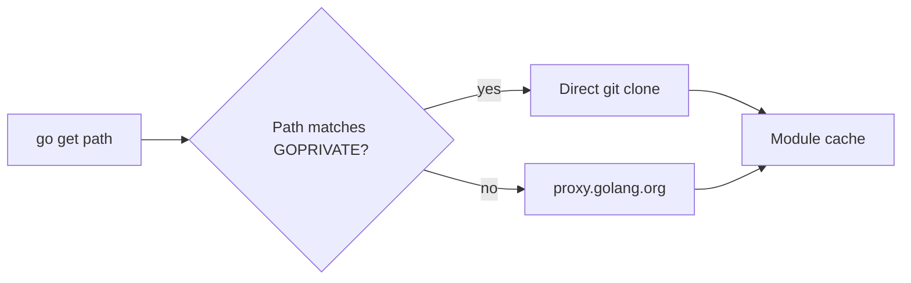

# Private Modules — Junior Level

## Table of Contents
1. [Introduction](#introduction)
2. [Prerequisites](#prerequisites)
3. [Glossary](#glossary)
4. [Core Concepts](#core-concepts)
5. [Real-World Analogies](#real-world-analogies)
6. [Mental Models](#mental-models)
7. [Pros & Cons](#pros--cons)
8. [Use Cases](#use-cases)
9. [Code Examples](#code-examples)
10. [Coding Patterns](#coding-patterns)
11. [Clean Code](#clean-code)
12. [Product Use / Feature](#product-use--feature)
13. [Error Handling](#error-handling)
14. [Security Considerations](#security-considerations)
15. [Performance Tips](#performance-tips)
16. [Best Practices](#best-practices)
17. [Edge Cases & Pitfalls](#edge-cases--pitfalls)
18. [Common Mistakes](#common-mistakes)
19. [Common Misconceptions](#common-misconceptions)
20. [Tricky Points](#tricky-points)
21. [Test](#test)
22. [Tricky Questions](#tricky-questions)
23. [Cheat Sheet](#cheat-sheet)
24. [Self-Assessment Checklist](#self-assessment-checklist)
25. [Summary](#summary)
26. [What You Can Build](#what-you-can-build)
27. [Further Reading](#further-reading)
28. [Related Topics](#related-topics)

---

## Introduction
> Focus: "What is a private module?" and "How do I import one from my own GitHub?"

A **private module** is a Go module hosted somewhere only you (or your team) can read. The repository requires a password, an SSH key, or a personal access token. The Go toolchain has no idea your repo is private — by default it asks the public proxy at `proxy.golang.org` for every module it sees, and the public proxy answers `404 not found` (or `410 Gone`) for anything it cannot fetch publicly. That looks like this:

```bash
$ go get github.com/your-org/secret-lib
go: github.com/your-org/secret-lib: module github.com/your-org/secret-lib:
        reading https://proxy.golang.org/github.com/your-org/secret-lib/@v/list:
        410 Gone
```

The fix is two-step:

1. **Tell Go this module is private** — set `GOPRIVATE=github.com/your-org/*`. This makes the toolchain skip the public proxy and the public checksum database for matching paths.
2. **Tell Git how to authenticate** — usually a personal access token in HTTPS, or an SSH key.

After that, `go get github.com/your-org/secret-lib` works exactly like adding a public dependency. The version is pinned in `go.mod`, the bytes are cached, and your build is reproducible.

After reading this file you will:

- Explain why a fresh `go get` against a private repo fails with `410 Gone`.
- Set `GOPRIVATE` correctly for your organisation.
- Configure Git so that `go` can clone over HTTPS using a PAT or over SSH using a key.
- Add a private dependency to a real project, see it appear in `go.mod`, and import it.
- Spot the difference between "Go cannot find the module" and "Git cannot authenticate."

You do **not** need to know about Athens, Artifactory, custom sumdb hosts, glob precedence, or air-gapped CI yet. Those are middle and senior topics.

---

## Prerequisites

- **Required:** A Go module — `go mod init` already run, `go.mod` exists.
- **Required:** Go 1.13 or newer (which is when `GOPRIVATE` was introduced). 1.21+ is ideal.
- **Required:** A GitHub or GitLab account with at least one **private** repository you can read.
- **Required:** Git installed and on your `PATH`. Run `git --version` to confirm.
- **Required:** Confidence with `go get`, `go mod tidy`, `go.mod`, `go.sum` — see the previous chapter on third-party packages.
- **Helpful:** A working `ssh -T git@github.com` (returns "Hi <user>! You've successfully authenticated"). You can use HTTPS instead but SSH is calmer once it works.

If `git clone <your private repo>` succeeds from your terminal, your auth is already correct and only Go-side configuration remains.

---

## Glossary

| Term | Definition |
|------|-----------|
| **Private module** | A Go module hosted in a repo or registry that requires authentication to read. |
| **`GOPRIVATE`** | Environment variable listing module-path globs that are private. The toolchain skips the public proxy *and* the public checksum DB for matches. |
| **`GONOPROXY`** | Globs for modules that must bypass the proxy entirely. Implied by `GOPRIVATE` but can be set independently. |
| **`GONOSUMDB`** | Globs for modules whose checksum should not be verified against the public sumdb. Implied by `GOPRIVATE`. |
| **`GOPROXY`** | Comma-separated list of module proxies the toolchain queries. Defaults to `https://proxy.golang.org,direct`. |
| **`GOSUMDB`** | The checksum database. Defaults to `sum.golang.org`. |
| **`direct` fetcher** | Pseudo-proxy meaning "skip a proxy and clone the repo with VCS tools (Git)." |
| **Personal Access Token (PAT)** | A long random string that replaces your password for Git HTTPS access. Created in GitHub or GitLab settings. |
| **`.netrc`** | A plain-text file in your home dir listing `machine`/`login`/`password` triples. `git` (and `curl`) read it for HTTPS auth. |
| **`go env -w KEY=val`** | Permanently writes a Go environment variable into `~/.config/go/env`. |
| **`410 Gone`** | The proxy's answer for "I cannot serve this module." Usually means private repo. |

---

## Core Concepts

### `GOPRIVATE` is a glob list, not a URL list

`GOPRIVATE` does not store hostnames or repos — it stores **module paths**. A module path is what you write after `module` in `go.mod`. For example:

```
module github.com/acme-corp/internal-auth
```

The path here is `github.com/acme-corp/internal-auth`. To mark every module under your org as private:

```bash
go env -w GOPRIVATE=github.com/acme-corp/*
```

The `*` is a glob (one path segment). For multiple orgs, separate by comma:

```bash
go env -w GOPRIVATE=github.com/acme-corp/*,gitlab.acme.com/*
```

Note that `gitlab.acme.com/*` covers an entire host's worth of repos in one entry.

### Two things `GOPRIVATE` actually toggles

For module paths matching the glob, the toolchain:

1. Sets the effective `GONOPROXY` to include them — meaning it will not ask `proxy.golang.org`. It uses the `direct` fetcher (Git over HTTPS or SSH).
2. Sets the effective `GONOSUMDB` to include them — meaning it will not call `sum.golang.org` to verify their checksum.

Everything else still happens normally: `go.mod` and `go.sum` are still updated, hashes are still stored, builds are still reproducible. The only thing skipped is the *public* infrastructure that has no business knowing about your private code.

### `go` does not authenticate; `git` does

There is no `GOUSER` or `GOPASSWORD`. The Go toolchain shells out to `git` for the `direct` fetcher. Whatever auth your `git clone` command would use, `go` will use the same. If `git clone https://github.com/acme-corp/internal-auth` works in your terminal, `go get github.com/acme-corp/internal-auth` will work too.

This is sometimes confusing because you might run `gh auth login` (the `gh` CLI helper) and assume Go inherits that. It does not — `gh auth login` configures the `gh` CLI, not `git`. To make `git` use the same credential, use `gh auth setup-git` or set up `.netrc` / a PAT manually.

### HTTPS vs SSH — pick one and be consistent

Two ways to authenticate `git` to GitHub or GitLab:

- **HTTPS + PAT.** You create a token in GitHub, then `git clone https://github.com/acme-corp/repo` is given the token as the password. Works in CI, easy to revoke per-token.
- **SSH key.** You generate `~/.ssh/id_ed25519`, paste the public half into GitHub, then `git clone git@github.com:acme-corp/repo` works. Painful to set up in CI; ergonomic locally.

Go uses whichever you set up. To force HTTPS even when a colleague's `go.mod` references SSH, you can rewrite the URL globally in your Git config:

```bash
git config --global url."https://github.com/".insteadOf "git@github.com:"
```

Or the reverse (HTTPS to SSH):

```bash
git config --global url."git@github.com:".insteadOf "https://github.com/"
```

### `go env` vs shell exports

Two equivalent ways to set `GOPRIVATE`:

```bash
# Method A: persistent, written to ~/.config/go/env
go env -w GOPRIVATE=github.com/acme-corp/*

# Method B: per-shell session
export GOPRIVATE=github.com/acme-corp/*
```

`go env -w` is convenient on a workstation. `export` is mandatory in CI scripts or Docker images, where `~/.config/go/env` is not present or not preserved.

To inspect:

```bash
$ go env GOPRIVATE
github.com/acme-corp/*
```

To clear:

```bash
go env -u GOPRIVATE
```

---

## Real-World Analogies

**1. A guest list at a club.** `proxy.golang.org` is the public bouncer who lets anyone in. Your private repo is a private party — the public bouncer has never heard of it and turns Go away. `GOPRIVATE` is the note that tells Go "this party is private; don't bother asking the bouncer, just go straight to the door and use the password."

**2. A library card.** Your `git` PAT or SSH key is the library card. `GOPRIVATE` says "this book is in the special collections — don't ask the public catalogue, walk into the back room with your card."

**3. Calling a phone extension.** A public module is `proxy.golang.org/github.com/foo/bar`, like dialling a public phone number. A private module skips the switchboard and dials the extension directly: `git clone https://github.com/your-org/bar`.

**4. Hotel safe.** The module cache stores private code on your laptop in the same place as public code (`~/go/pkg/mod`). The safe doesn't care whether the documents are public or private; only the path *to* the safe is gated.

---

## Mental Models

### Model 1 — Public-by-default, private-by-opt-in

Go's defaults assume every module path is public. Until you set `GOPRIVATE`, every fetch goes through `proxy.golang.org` and `sum.golang.org`. Adding `GOPRIVATE` *removes* glob-matching modules from those public flows.

### Model 2 — `GOPRIVATE` is a routing flag, not an auth flag

Setting `GOPRIVATE` does not give Go credentials. It only routes: "for these paths, talk to Git directly." Auth is `git`'s problem. A confused beginner sets `GOPRIVATE` correctly and still fails because `git` itself cannot read the repo. Treat the two as separate steps.

### Model 3 — `go get` is a thin wrapper around `git clone`, sometimes

For paths matching `GOPRIVATE`, `go get` essentially runs `git ls-remote` and `git clone --depth ?` under the hood (in the module cache). Anything that breaks `git clone` will break `go get`.

### Model 4 — `go.sum` still grows for private modules

`GONOSUMDB` does not mean "skip hashing." It means "skip *verifying* the hash against the public DB." The toolchain still computes a hash on first download and writes it to `go.sum`. Subsequent builds re-check against `go.sum` for tamper detection. Reproducibility is preserved; only the *public* reference is dropped.

### Model 5 — `GOPRIVATE` is per-machine, not per-repo

Two engineers can run different `GOPRIVATE` values on the same project and both succeed. The setting affects *how* the bytes are fetched, not *what* bytes end up in `go.mod`/`go.sum`. So you do not commit `GOPRIVATE` — you document it in a README.

---

## Pros & Cons

### Pros

- **Reuse internal code without publishing it.** A logging library, a feature-flag client, a billing helper — all consumable as `go get`-able modules.
- **Same workflow as public.** Once configured, `import` and `go get` are identical to public deps. New hires don't need a parallel system.
- **Fine-grained control.** `GOPRIVATE` lets you opt in path-by-path, mixing public and private deps in one module.
- **Reproducible builds.** Hashes still go in `go.sum`, replays of the build still verify byte-equality.

### Cons

- **Auth is fragile.** Token expiries, SSH agents on the wrong shell, CI runners with no `~/.netrc`. The error messages are notoriously unhelpful.
- **No public sumdb safety net.** The first time you fetch a private module, you trust its bytes blind. (For solutions, see senior level.)
- **Hosts cannot be globbed by URL.** `GOPRIVATE` matches module paths, not URLs. If your private GitLab is on `git.acme.io` but the module path begins with `gitlab.acme.io`, the glob must match the latter.
- **CI complexity.** Each pipeline needs the secret. See middle level.

### When to use:
- Internal libraries that are too domain-specific for open source.
- Code that legally cannot be shared (PII handling, encryption keys, compliance rules).
- Pre-release work that will become public later.

### When NOT to use:
- "Just for me, on my laptop" code — use a `replace` directive or a local module path.
- Open-source code with a "we might want it private later" excuse — publish it, you can iterate faster.

---

## Use Cases

- **Use Case 1:** A team's shared `internal-auth` library imported by 30 microservices.
- **Use Case 2:** A consultancy maintaining a private fork of a public dep with a security patch ahead of upstream.
- **Use Case 3:** A startup with one repo per service plus a shared `pkg/` repo, all under one private GitHub org.
- **Use Case 4:** A regulated industry team that legally must keep code on a self-hosted GitLab.

---

## Code Examples

### Example 1: First time enabling `GOPRIVATE`

Suppose you have a private repo at `github.com/acme-corp/internal-auth` and a fresh project that needs to import it.

```bash
# Step 1 — your terminal can already clone the repo
$ git clone https://github.com/acme-corp/internal-auth /tmp/check
Cloning into '/tmp/check'...
remote: Enumerating objects: 42, done.

# Step 2 — tell Go about the private path
$ go env -w GOPRIVATE=github.com/acme-corp/*

# Step 3 — try the import in a fresh module
$ mkdir -p /tmp/playground && cd /tmp/playground
$ go mod init demo
go: creating new go.mod: module demo

$ cat > main.go <<'EOF'
package main

import (
    "fmt"

    auth "github.com/acme-corp/internal-auth"
)

func main() {
    fmt.Println(auth.Hello())
}
EOF

$ go mod tidy
go: finding module for package github.com/acme-corp/internal-auth
go: downloading github.com/acme-corp/internal-auth v0.3.1
go: found github.com/acme-corp/internal-auth in github.com/acme-corp/internal-auth v0.3.1

$ go run .
hello from internal-auth v0.3.1
```

**What it does:** flips `GOPRIVATE`, lets `git` use whatever credentials are already in your shell, and adds a private dep with no special syntax in the import line.
**How to run:** every command above, in order, from a terminal.

---

### Example 2: Setting `GOPRIVATE` in a single shell session

If you do not want to persist the setting (a quick experiment, a CI job):

```bash
export GOPRIVATE="github.com/acme-corp/*,gitlab.acme.com/*"
go get github.com/acme-corp/internal-auth@latest
```

The variable lives only for that shell. Open a new terminal and it is gone.

---

### Example 3: Configuring HTTPS with a PAT via `.netrc`

Create a token in **GitHub → Settings → Developer settings → Personal access tokens → Tokens (classic)** with the `repo` scope. Then:

```bash
$ cat >> ~/.netrc <<'EOF'
machine github.com
  login your-username
  password ghp_AbCdEf1234567890
EOF

$ chmod 600 ~/.netrc

$ go get github.com/acme-corp/internal-auth@latest
go: downloading github.com/acme-corp/internal-auth v0.3.1
```

`git`'s HTTPS layer reads `~/.netrc` and uses the token as the password.

> Note: GitHub fine-grained tokens work too. Be sure to grant **Contents: read** on the repo or org.

---

### Example 4: Configuring SSH

If you already have an SSH key:

```bash
$ ssh -T git@github.com
Hi your-username! You've successfully authenticated, but GitHub does not provide shell access.
```

To force Go's `direct` fetcher to use SSH for GitHub:

```bash
git config --global url."git@github.com:".insteadOf "https://github.com/"
```

Now any tool — `go get` included — that tries to clone an `https://github.com/...` URL will silently rewrite to `git@github.com:...`.

---

### Example 5: Pinning a specific commit on a private branch

You need a feature that has not been tagged. Pin to a commit SHA the same way you would for a public repo:

```bash
$ go get github.com/acme-corp/internal-auth@feature/oauth
go: downloading github.com/acme-corp/internal-auth v0.0.0-20250508121314-1a2b3c4d5e6f
```

The toolchain rewrites the branch name to a pseudo-version. The branch must still exist for the SHA to remain resolvable later.

---

### Example 6: Using `go list -m` against a private module

Once configured, all the regular tools work on private modules:

```bash
$ go list -m -versions github.com/acme-corp/internal-auth
github.com/acme-corp/internal-auth v0.1.0 v0.2.0 v0.3.0 v0.3.1

$ go list -m -u github.com/acme-corp/internal-auth
github.com/acme-corp/internal-auth v0.3.1 [v0.4.0]
```

The `[v0.4.0]` brackets mean "newer is available." This is identical UX to public deps.

---

### Example 7: A complete `go env` snapshot for a private setup

```bash
$ go env GOPRIVATE GONOPROXY GONOSUMDB GOPROXY GOSUMDB
github.com/acme-corp/*
github.com/acme-corp/*
github.com/acme-corp/*
https://proxy.golang.org,direct
sum.golang.org
```

Notice that even though you only explicitly set `GOPRIVATE`, the toolchain reports `GONOPROXY` and `GONOSUMDB` derived from it.

---

## Coding Patterns

### Pattern 1: Per-org GOPRIVATE entry

**Intent:** mark every repo your organisation owns as private with one glob.
**When to use:** any team that hosts internal Go modules in a single GitHub org or GitLab group.

```bash
# All of acme-corp on GitHub
go env -w GOPRIVATE='github.com/acme-corp/*'

# All of acme-corp + a self-hosted GitLab
go env -w GOPRIVATE='github.com/acme-corp/*,gitlab.acme.io/*'
```

**Diagram:**



**Remember:** glob matches *module paths*, which usually start with the host. The host name is the easy way to scope.

---

### Pattern 2: Project-local `.envrc` so teammates don't fight `GOPRIVATE`

**Intent:** keep `GOPRIVATE` per-project so a contributor's other Go work is unaffected.

```bash
# .envrc (used by direnv)
export GOPRIVATE="github.com/acme-corp/*"
```

When you `cd` into the project, `direnv` exports the variable; when you leave, it unsets it.

**Remember:** `go env -w` is global to your user. `.envrc` (or a project script) keeps the setting scoped.

---

## Clean Code

### Naming

```go
// Bad — opaque
import "github.com/acme-corp/auth"

// Better — alias when shadowed by stdlib
import auth "github.com/acme-corp/internal-auth"
```

If your private module's last path segment collides with a standard library package or another import (`auth`, `log`, `errors`), alias it.

---

### `go.mod` hygiene

A private dep looks identical to a public one in `go.mod`. There is no special syntax. Do not add comments hinting at privacy — the `GOPRIVATE` env var carries that information.

```
require (
    github.com/acme-corp/internal-auth v0.3.1
    github.com/google/uuid             v1.6.0
)
```

---

### Configuration files

- `~/.netrc` — chmod 600. Owner-only readable.
- `~/.ssh/id_ed25519` — chmod 600. Never check into git.
- `~/.config/go/env` — written by `go env -w`. Safe to inspect, do not commit.

---

## Product Use / Feature

For a product team this is plumbing — but it unlocks an entire pattern:

- **Shared SDK as a private module.** Your billing service, your auth service, your dashboard service all `import "github.com/acme-corp/sdk-go"`. One repo, many consumers, version-pinned per consumer.
- **Plugin pattern.** Internal extensions to a CLI distributed as private modules. Each customer team owns their own private extension and depends on the core CLI.
- **Test fixture libraries.** Real PII or licensed test data lives in a private repo; consumed by integration tests in many services.

The product impact: you stop copy-pasting code between services. Your SLOs improve because everyone uses the same battle-tested helpers.

---

## Error Handling

The most common errors you will see, what they mean, and the first thing to try:

| Symptom | Probable cause | First fix |
|---------|---------------|-----------|
| `410 Gone` | `GOPRIVATE` not set; proxy returned "I don't have it." | `go env -w GOPRIVATE=<glob>` |
| `unrecognized import path` | Path typo *or* the proxy returned `404`. | Check spelling; check `GOPRIVATE`. |
| `terminal prompts disabled` | Running in CI; `git` has no creds. | Set `.netrc` or `GIT_ASKPASS` in CI. |
| `verifying ...: checksum mismatch` | `go.sum` was hand-edited or upstream re-tagged. | Restore `go.sum` from git; `go mod tidy`. |
| `unknown revision <branch>` | Branch was deleted or you typoed it. | `git ls-remote <repo>` to confirm. |
| `Permission denied (publickey)` | SSH key not loaded into agent. | `ssh-add ~/.ssh/id_ed25519`. |

A heuristic: if the error mentions `proxy.golang.org`, the toolchain is *not* treating the path as private — fix `GOPRIVATE`. If it mentions Git or SSH, the routing is right but auth is wrong — fix `git` config.

---

## Security Considerations

- **Tokens leak through env vars.** Avoid logging your shell environment in CI. Pipelines like GitHub Actions automatically mask known secrets, but `printenv` in a script can still defeat that.
- **Public sumdb is bypassed for private modules.** That is the whole point — but you lose the supply-chain safety net. For private code you control end-to-end this is fine. For private *forks* of public modules, set up an internal proxy that records hashes (see senior level).
- **`.netrc` is plaintext.** Set `chmod 600` and consider whether you should be using an OS keyring instead (macOS Keychain, libsecret on Linux). Tools like `git-credential-osxkeychain` do this transparently.
- **PAT scopes.** Use the *minimum* scope that lets `git` clone — typically `repo: read` on GitHub. Do not reuse a PAT that also has `delete_repo`.
- **Force-pushed branches.** If you depend on a pseudo-version pointing at a branch tip and someone force-pushes, the SHA is gone and your build is gone. Always pin to tags or stable branches.

---

## Performance Tips

- The first `go get` of a private module is slowest (full clone). Subsequent fetches use the module cache.
- Shallow clones reduce time but Go does not let you configure clone depth — set up an internal proxy if your team feels this pain (senior level).
- If `go.sum` is healthy and the module cache is warm, even a fresh CI checkout can resolve private deps in milliseconds — no Git round-trip needed. Cache `~/go/pkg/mod` between CI runs.

---

## Best Practices

- **Set `GOPRIVATE` per-host, not per-repo.** Maintenance is easier.
- **Document the variable in your `README.md`.** New hires will reach for it.
- **Use the same auth method as the rest of the team.** If the team uses SSH, do not be the lone HTTPS user — you will hit edge cases nobody else can reproduce.
- **Pin tags, not branches.** Tags are immutable; branches are not.
- **`go mod tidy` after every dependency change.** Same as public modules.
- **Cache `~/go/pkg/mod` in CI.** Even private modules are immutable once downloaded.

---

## Edge Cases & Pitfalls

- **`GOPRIVATE` glob too tight.** `github.com/acme-corp/foo` only matches that *exact* path. To cover sub-modules, use `github.com/acme-corp/*`.
- **`GOPRIVATE` glob too loose.** `github.com/*` would mark *all* GitHub modules as private. The toolchain stops verifying their checksums, which is bad for security.
- **Path case-sensitivity.** Module paths are case-insensitive in Go's lookup but the canonical form preserves case. If your repo is `github.com/Acme-Corp/Foo`, your import must match.
- **CI clones the repo with `actions/checkout` but not the dep.** That is fine — you still need `GOPRIVATE` and a token configured for the *dependency's* host.
- **`go install` of a private CLI.** Same rules apply. `GOPRIVATE` and Git auth must be set.
- **Replace directives override `GOPRIVATE`.** `replace github.com/acme/foo => /tmp/foo` short-circuits the fetch; nothing private about it then.

---

## Common Mistakes

1. Confusing `GOPROXY=off` with `GOPRIVATE`. `GOPROXY=off` disables fetching entirely; `GOPRIVATE` only redirects fetching for matching paths.
2. Setting `GOPRIVATE` to a URL like `https://github.com/acme-corp/*`. It must be a *module path*, no scheme.
3. Forgetting to `chmod 600 ~/.netrc`. Some `git` configs refuse to read world-readable netrc files.
4. Hard-coding a PAT in a shell script committed to git.
5. Setting `GOPRIVATE` but leaving a tag-less import; the build then fails because `git` cannot resolve a missing branch.
6. Running `git clone` once successfully, then running `go get` from a different shell where SSH agent is missing.

---

## Common Misconceptions

- *"I have to use Athens to use private modules."* No. Athens is one of several solutions; for a small team, plain `GOPRIVATE` + Git auth is enough.
- *"`GOPRIVATE` makes my code private."* No. Your code is private because the *repo* is private. `GOPRIVATE` only changes how Go reaches it.
- *"`go.sum` doesn't apply to private modules."* It does. The hashes are still computed and verified — just not against `sum.golang.org`.
- *"I need a different `import` path for private modules."* No. The import is just `github.com/your-org/repo`, identical to a public module.
- *"`GOPRIVATE` is dangerous."* Properly scoped, it is benign. Setting it to `*` would be reckless; setting it to your org is correct.

---

## Tricky Points

- **`GOPRIVATE` only kicks in on a fresh fetch.** If a module is already in the cache, the toolchain reuses it regardless. Setting `GOPRIVATE` after a failed fetch sometimes still fails until you `go clean -modcache` or `rm -rf ~/go/pkg/mod/cache/download/<bad-path>`.
- **`go get` uses `git` for HTTPS, but `git` may use the system keyring.** On macOS, `git-credential-osxkeychain` is enabled by default; the very first `go get` may pop a system password dialog that you would not see on Linux.
- **`GIT_TERMINAL_PROMPT=0`.** In CI, set this to make `git` fail fast instead of hanging on a missing credential.
- **Globs are not regexes.** `*` matches one path *segment*, not arbitrary characters. `github.com/acme-*` does not match `github.com/acme-corp/foo`. Use `github.com/acme-corp/*` instead.
- **`GOFLAGS=-insecure` is a footgun.** It allows HTTP and skips TLS verification. Almost always the wrong tool. Investigate the real auth or proxy issue.

---

## Test

```go
// Sanity-test that your private dep is wired up.
package main

import (
    "fmt"

    auth "github.com/acme-corp/internal-auth"
)

func main() {
    fmt.Println("auth pkg version:", auth.Version)
    if auth.Version == "" {
        fmt.Println("FAIL: empty version, did the import resolve?")
    } else {
        fmt.Println("OK")
    }
}
```

Build it. If you see "OK", `GOPRIVATE` and Git auth are correct. If you see a 410 or "permission denied," go back to the corresponding error in [Error Handling](#error-handling).

---

## Tricky Questions

**Q1. You set `GOPRIVATE=github.com/acme-corp/*` and still see `410 Gone` for `github.com/acme-corp/foo`. What's wrong?**

A. Almost certainly `GOPRIVATE` is set in a different shell or `.envrc` than the one running `go get`. Verify with `go env GOPRIVATE` from the *same* terminal you ran `go get` in.

**Q2. Your CI fails with `terminal prompts disabled`. You add a PAT to a shell variable `GH_TOKEN`. CI still fails. Why?**

A. `git` does not read `GH_TOKEN`. You must inject the token into either `.netrc` or a Git credential helper. Or rewrite the URL to embed the token: `git config --global url."https://${GH_TOKEN}@github.com/".insteadOf "https://github.com/"`.

**Q3. After cloning a sample project, `go mod tidy` succeeds without you setting `GOPRIVATE`. How?**

A. The project committed `go.sum` and the module cache already has the bytes — Go did not need to fetch. The first time *any* environment fetches the module, `GOPRIVATE` will matter.

**Q4. Why does `GOPRIVATE` use globs over module paths instead of hostnames?**

A. Multiple orgs may share a host. `github.com/openai/*` is public; `github.com/your-org/*` is private. Path globs let you mix.

**Q5. Is it safe to set `GOSUMDB=off`?**

A. It disables checksum verification for *every* module, including public ones. That is much more permissive than `GOPRIVATE`. Only do this in tightly controlled environments and combine with an internal sumdb (senior level).

---

## Cheat Sheet

```bash
# Mark all your org's repos as private
go env -w GOPRIVATE='github.com/your-org/*'

# Mark multiple hosts at once
go env -w GOPRIVATE='github.com/your-org/*,gitlab.acme.io/*'

# Inspect
go env GOPRIVATE GOPROXY GOSUMDB

# Clear
go env -u GOPRIVATE

# Force HTTPS instead of SSH (handy in CI)
git config --global url."https://github.com/".insteadOf "git@github.com:"

# Inline PAT for HTTPS
git config --global url."https://${TOKEN}@github.com/".insteadOf "https://github.com/"

# Cache for CI
# (cache directory)
~/go/pkg/mod
```

---

## Self-Assessment Checklist

- [ ] I can explain why a default `go get` fails for a private repo.
- [ ] I can set `GOPRIVATE` in two different ways (env var and `go env -w`).
- [ ] I can authenticate `git` to my private host using either a PAT or SSH key.
- [ ] I can add a private dependency end-to-end and see it appear in `go.mod`.
- [ ] I can read the error messages and tell auth failures apart from routing failures.
- [ ] I know that `go.sum` still tracks hashes for private modules.

---

## Summary

A **private module** is a Go module that lives behind authentication. Go's defaults assume public; you opt out with `GOPRIVATE=<glob>`, which routes around the public proxy and the public checksum DB. Authentication itself is delegated to `git` — typically via a PAT in `.netrc` or an SSH key. Once configured, every other Go command (`go get`, `go mod tidy`, `go list`, `go install`) just works. The most common pitfalls are typo'd globs, missing `git` credentials in CI, and confusion between the two layers — fix `GOPRIVATE` for routing, fix `git` for auth.

---

## What You Can Build

- A monorepo's worth of private microservices that all import a shared SDK.
- A private CLI distributed via `go install github.com/your-org/tool@latest`.
- A licensing-test harness with proprietary fixtures consumed by every service.
- A quick consultancy contribution where you fork a public lib, host the fork privately, and pin to your fork.

---

## Further Reading

- `go help private` — terse but authoritative.
- Go Modules Reference at `go.dev/ref/mod` — sections "Module proxies" and "Authenticating modules."
- Earlier chapter in this roadmap: `06-code-organization/02-packages/02-using-3rd-party-packages/`.

---

## Related Topics

- **Modules basics** — `go.mod`, `go.sum`, `go mod init/tidy`.
- **`go get` semantics** — versions, pseudo-versions, replace.
- **Module proxies** — Athens, Artifactory (senior level).
- **CI/CD patterns** — caching, secret injection (middle level).
- **Vendoring** — `go mod vendor` as an alternative for air-gapped builds (senior level).
