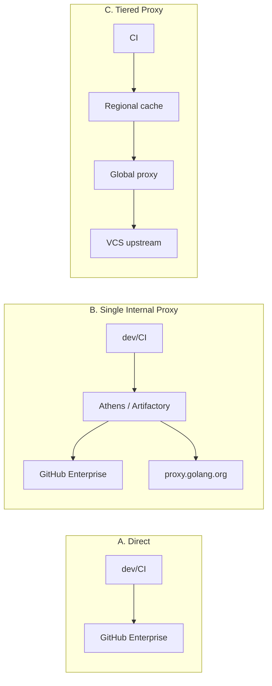

# Private Modules — Senior Level

## Table of Contents
1. [Introduction](#introduction)
2. [The Architectural Question](#the-architectural-question)
3. [Choosing a Proxy: Athens, Artifactory, or Plain Git](#choosing-a-proxy-athens-artifactory-or-plain-git)
4. [Running Athens](#running-athens)
5. [Artifactory and JFrog](#artifactory-and-jfrog)
6. [Checksum DB Strategy](#checksum-db-strategy)
7. [Mixing Public and Private at Scale](#mixing-public-and-private-at-scale)
8. [Air-Gapped Builds](#air-gapped-builds)
9. [Audit and Compliance](#audit-and-compliance)
10. [Vendoring Revisited](#vendoring-revisited)
11. [Failure Modes and Resilience](#failure-modes-and-resilience)
12. [Migration: From Bare Git to Internal Proxy](#migration-from-bare-git-to-internal-proxy)
13. [Decision Matrix](#decision-matrix)
14. [Summary](#summary)

---

## Introduction
> Focus: "How do I architect private-module access for a 50-person team that ships every day?"

When a single developer hits a private-module wall, the answer is `GOPRIVATE` and a PAT. When a 50-person engineering org hits it, the answer is a *system*: an internal proxy, an audited supply chain, a story for air-gapped customers, and a team-wide policy on how dependencies are introduced. This file is about the system.

We'll walk through the tradeoffs around running an Athens or Artifactory proxy, how to structure your checksum DB strategy, how to keep developer ergonomics from collapsing, and what the audit and compliance asks really mean.

---

## The Architectural Question

There are essentially three architectures:



| Architecture | When to pick | Cost |
|---|---|---|
| A. Direct (Git only) | < 10 engineers, mostly local builds | Lowest — no infra |
| B. Single proxy | 10-200 engineers, CI matters | One service, one team to babysit |
| C. Tiered | Hundreds of engineers, multi-region, compliance | Multiple services, dedicated platform team |

The most common mistake at the small end is over-engineering: spinning up Athens before it pays off. The most common mistake at the large end is under-engineering: every CI job cloning every dep on every run.

---

## Choosing a Proxy: Athens, Artifactory, or Plain Git

### Athens (`github.com/gomods/athens`)

Open-source Go module proxy and registry. Implements the `GOPROXY` protocol exactly. Stores modules on disk, S3, GCS, MinIO, Mongo, etc.

**Strengths:**
- Free, well-understood, single binary.
- Designed for Go. No impedance mismatch.
- Caches public modules and proxies private ones in one process.
- Supports `GONOSUMCHECK` style operation through its own path filters.

**Weaknesses:**
- Operations: HA story is "run a few replicas with a shared object store"; not as battle-tested as Artifactory.
- Sparse documentation around enterprise auth (LDAP, SSO).
- Single project, smaller community than commercial offerings.

### Artifactory / JFrog Platform

Commercial artifact repository. Has Go module support since several years.

**Strengths:**
- Deep enterprise features: SSO, RBAC, audit logs, replication, retention policies.
- One platform for Go, npm, Maven, Docker, Helm — single source of truth.
- Vendor support contracts.

**Weaknesses:**
- Licensing cost. Significant for small teams.
- Generic artifact engine; the Go module nuances sometimes lag the toolchain.
- Operationally heavier; usually run by a platform/devtools team.

### Plain Git (no proxy)

Just `GOPRIVATE` everywhere; everyone hits GitHub Enterprise / GitLab directly.

**Strengths:**
- Zero infra to run.
- Latest behaviour always supported (you are using `go` itself).

**Weaknesses:**
- Every CI run hits the VCS, which can rate-limit or fall over.
- No central cache; air-gapped customers can't be served.
- No central audit point — every developer's machine is the audit surface.

### My recommendation, by team size

- **1-10 engineers:** plain Git + `GOPRIVATE`. CI cache. Stop here.
- **10-50 engineers:** Athens behind your VPN or in a private VPC. One node, S3 backing.
- **50-200 engineers:** Athens HA *or* Artifactory if you already pay for it.
- **200+ engineers, regulated industry:** Artifactory tier or a custom in-house proxy with audit hooks.

---

## Running Athens

A minimum-viable Athens deployment, on a single VM:

```bash
# 1. Pull the image
docker pull gomods/athens:latest

# 2. Provide a config
cat > athens.toml <<'EOF'
GoBinary = "go"
LogLevel = "info"
StorageType = "disk"

[Storage]
  [Storage.Disk]
    RootPath = "/var/lib/athens"

NetrcPath = "/etc/athens/netrc"
EOF

# 3. Provide a netrc with GitHub Enterprise creds
cat > /etc/athens/netrc <<'EOF'
machine github.com login x-access-token password ghp_xxxxxxxxxxxxxxxx
machine github.acme.io login x-access-token password ghp_yyyyyyyyyyyyyy
EOF
chmod 600 /etc/athens/netrc

# 4. Run
docker run -d --name athens \
  -p 3000:3000 \
  -v $PWD/athens.toml:/etc/athens.toml \
  -v /etc/athens/netrc:/etc/athens/netrc:ro \
  -v athens-data:/var/lib/athens \
  gomods/athens:latest
```

Now point your team at it:

```bash
go env -w GOPROXY='https://athens.acme.io,direct'
go env -w GOPRIVATE='github.com/acme-corp/*'
```

Athens proxies *everything* through its cache: public deps end up cached too. Your VCS load drops dramatically.

### Athens with S3

For HA, point `Storage` at S3:

```toml
StorageType = "s3"

[Storage]
  [Storage.S3]
    Region = "us-east-1"
    Key    = "AKIA..."
    Secret = "..."
    Bucket = "acme-go-modules"
```

Run two or three Athens replicas behind a load balancer, all reading/writing the same bucket. This is the canonical HA pattern.

### Athens behind SSO

Athens does not natively integrate with SSO. The pattern is to put Athens behind an authenticating reverse proxy (oauth2-proxy, Pomerium, an internal AuthN gateway). Engineers hit the gateway, the gateway exchanges their session for a header, the gateway proxies to Athens.

This is necessary because `go` follows redirects but does not re-authenticate against new hosts the way a browser does. Your gateway must terminate auth in a way that `go` can carry through — typically a long-lived per-user token in `.netrc`.

---

## Artifactory and JFrog

JFrog Artifactory has a "Go Registry" type. The configuration story is similar:

1. Create a *Remote Repository* in Artifactory pointing at `proxy.golang.org` (caches public).
2. Create a *Local Repository* for private modules; configure VCS hooks to push tagged versions.
3. Create a *Virtual Repository* aggregating the two.

Then on the developer side:

```bash
go env -w GOPROXY='https://artifactory.acme.io/artifactory/go/,direct'
go env -w GOPRIVATE='github.com/acme-corp/*'
```

The virtual repo serves the GOPROXY protocol; auth is via a token Artifactory issues, placed in `.netrc`.

The major feature that Artifactory adds beyond Athens is *retention policies* (delete unused versions older than X), *replication* across geographies, and *xray scanning* for known CVEs.

### Why platform teams pick it

If you already pay for Artifactory for Maven/npm/Docker, adding Go is incremental. Single tool, single audit surface, single SLA story. Cost-justifying a *new* JFrog license just for Go modules is rarely worth it — Athens does the job.

---

## Checksum DB Strategy

`sum.golang.org` is the public checksum DB for *publicly* visible modules. By design, it does not see private modules.

You have three strategies for private modules:

### Strategy 1 — `go.sum` only

Skip `GOSUMDB` for private paths (which `GOPRIVATE` does automatically). Trust whatever is in `go.sum`. The first download is unverified; subsequent downloads must match `go.sum`.

**Risk:** if an attacker compromises your GitHub org *before* the first download, the malicious bytes get hashed into your `go.sum`. The hash will then keep matching forever.

**Mitigation:** require `go.sum` updates to go through PR review with an explicit "did anyone audit this hash change?" question. Tools like `go mod verify` confirm cache integrity but not authenticity.

### Strategy 2 — Internal sumdb

Run your own checksum database. `gosum.io`-compatible servers exist (Athens has limited support; some companies build their own). Set `GOSUMDB=internal-sumdb.acme.io`.

**Effort:** non-trivial. The sumdb protocol involves Merkle-tree-of-hashes and `gosum` certificates. Worth it for regulated environments; overkill for everyone else.

### Strategy 3 — Vendoring + sealed `go.sum`

Commit `vendor/` and treat `go.sum` as the single source of truth. Reviewers diff `vendor/` on every dep change. Slow but auditable.

### Hybrid: which to pick

- **Default for most teams:** Strategy 1. Be diligent on PRs.
- **Regulated finance/health:** Strategy 2 or 3.
- **Air-gapped customer ships:** Strategy 3 (vendored).

---

## Mixing Public and Private at Scale

A real microservice might depend on:

- 2-5 internal libraries (private GitHub Enterprise org).
- 30-60 public libraries (everything from `github.com/google/uuid` to `go.opentelemetry.io/otel`).
- Maybe a fork of one public dep.

Routing this through your stack:

```
GOPROXY=https://athens.acme.io,direct
GOPRIVATE=github.acme.io/*
```

Result:

- *Every* fetch — public or private — goes through Athens first.
- Private fetches: Athens authenticates with its own creds (its `.netrc`) and proxies the bytes back. Athens does not consult `sum.golang.org` for private paths.
- Public fetches: Athens consults `proxy.golang.org` first (it can be configured to), serves from its disk cache on subsequent fetches.

The developer's environment is uniform. There is exactly one network endpoint to allowlist (Athens). Updating GitHub PATs only happens on Athens, not every laptop.

### When you also have forks

A public lib `github.com/foo/bar` you forked to `github.acme.io/forks/bar`:

```
require github.com/foo/bar v1.4.0

replace github.com/foo/bar => github.acme.io/forks/bar v1.4.0-acme.1
```

Both paths remain — `bar`'s consumers see `github.com/foo/bar` in their import graph, but the bytes come from your fork. The `replace` directive *bypasses* `GOPROXY` entirely for the replaced path. So your fork must be reachable via Git for everyone in the team.

A neater pattern at scale: *don't* replace. Publish your fork under your own module path (`github.acme.io/forks/bar`) and re-import it directly. Replace directives travel with `go.mod`; renames don't.

---

## Air-Gapped Builds

An air-gapped environment has no internet, sometimes no internal network, sometimes only a USB stick.

### The vendoring approach

```bash
go mod vendor
git add vendor go.mod go.sum
git commit -m "vendor deps for air-gapped"
```

`vendor/` is now part of the repo. On the air-gapped machine:

```bash
go build -mod=vendor ./...
```

`-mod=vendor` is the default if `vendor/modules.txt` is present and Go ≥ 1.14. The toolchain reads exclusively from `vendor/`; no network is touched.

Trade-off: `vendor/` can be 100MB+. Repo size grows. Code reviews of `vendor/` changes are essentially "scan the diff for surprises."

### The pre-warmed-proxy approach

If the air-gapped environment has *some* internal network, mirror the proxy:

1. Run Athens in your connected DC.
2. Have it cache every dep your project uses.
3. `rsync` Athens' on-disk cache to a USB stick.
4. Boot Athens on the air-gapped side from that cache.
5. Set `GOPROXY=https://airgapped-athens.local,off` on developer machines. The `off` says "if this proxy fails, don't fall back."

### The pre-built tarball approach

Some teams bundle `go build` output and the source repo together, with `vendor/` checked in. The air-gapped machine only needs `go` itself. No network at all.

### Reproducibility check

Whichever approach you pick, prove reproducibility:

```bash
GOFLAGS=-trimpath go build -o app1 ./cmd/app
# transfer to air-gapped box
GOFLAGS=-trimpath go build -o app2 ./cmd/app
sha256sum app1 app2
# hashes should match
```

Set `SOURCE_DATE_EPOCH` and `-trimpath` for deterministic builds.

---

## Audit and Compliance

Common asks from a compliance team:

### "Show me every dep entering production."

Easy if you have an internal proxy: log every fetch. Athens can write structured logs of "module X@v fetched at time T by IP I." Pipe to your SIEM.

### "Show me when this dep was first introduced."

Git blame on `go.mod`. Useful, but `go.mod` lists only direct deps. For transitives, blame `go.sum`.

### "Show me the license of every dep."

```bash
go install github.com/google/go-licenses@latest
go-licenses report ./... > licenses.csv
```

Schedule this in CI; fail the build on a license you do not allow (GPL, AGPL).

### "Show me every dep with a known CVE."

```bash
go install golang.org/x/vuln/cmd/govulncheck@latest
govulncheck ./...
```

For private modules, this works *if* the modules are reachable from where `govulncheck` runs. The vuln DB only knows about reported CVEs in the public ecosystem; your private deps are evaluated by their *own* code paths, not via the DB.

### "We need an SBOM."

```bash
go install github.com/anchore/syft/cmd/syft@latest
syft packages dir:. -o cyclonedx-json > sbom.json
```

Or use `cyclonedx-gomod`:

```bash
go install github.com/CycloneDX/cyclonedx-gomod/cmd/cyclonedx-gomod@latest
cyclonedx-gomod app -licenses -json > sbom.json
```

Audit the SBOM in CI; archive it next to the binary.

### "How did this binary get built?"

A reproducible build with `-trimpath`, plus a checked-in `go.sum`, plus an SBOM, gives you a full provenance story. Sigstore / `cosign` can sign the binary against the `go.sum` digest.

---

## Vendoring Revisited

Vendoring sat in the doghouse for a few years (post-modules) and is creeping back. Three reasons it makes sense for a team:

1. **Predictable build time.** No network calls during `go build`. Fastest possible CI.
2. **Audit by reading code.** Reviewers see exactly which bytes ship.
3. **Air-gapped delivery.** As above.

Three reasons it does not:

1. **Repo bloat.** 100MB+ vendor dirs are common. Git operations slow down.
2. **Diff noise.** Every minor bump rewrites large swathes of vendor.
3. **Drift from upstream.** It is too easy to "just patch in vendor" and forget to upstream.

Modern teams often pick *neither always vendoring nor never*: vendor only when shipping to an air-gapped customer, otherwise rely on the proxy + `go.sum`.

---

## Failure Modes and Resilience

| Failure | Blast radius | Mitigation |
|---|---|---|
| GitHub Enterprise outage | All builds fetching anything from there | Athens cache; outages on GHE rarely affect cached versions |
| Athens replica crash | Brief — load balancer routes to siblings | Run ≥ 2 replicas |
| Athens storage corruption | Catastrophic — all cached versions lost | S3 versioning, backups |
| `proxy.golang.org` outage | Public dep fetches that aren't cached | Athens already cached them — no impact |
| `sum.golang.org` outage | Public dep verifications fail | Athens has its own sumdb; fall back to `GOSUMDB=off` (briefly) |
| Compromised PAT in Athens | Attacker can fetch any private repo Athens can | Per-org tokens, short rotation, audit Athens logs |
| `go.sum` poisoned by bad PR | Attacker can substitute bytes for one dep | Required reviewer on every `go.sum` change |

Treat your internal proxy as production infrastructure: monitoring, alerting, runbooks, on-call. A broken Athens means CI is down for everyone.

---

## Migration: From Bare Git to Internal Proxy

You have 30 services, each with its own `GOPRIVATE`. You want to roll out Athens.

### Phase 1: stand up Athens

Athens runs in a VPC, fronts GitHub Enterprise. Initially, it has no consumers. Smoke-test with one volunteer team.

### Phase 2: dual-set `GOPROXY`

Add `https://athens.acme.io` *before* `direct` in `GOPROXY`:

```bash
GOPROXY=https://athens.acme.io,proxy.golang.org,direct
```

Athens proxies everything. If Athens is unhealthy, the toolchain falls back to `proxy.golang.org` for public deps, then `direct` for private. CI keeps working.

### Phase 3: tighten `GOPROXY`

Once Athens is rock-solid:

```bash
GOPROXY=https://athens.acme.io,direct
```

Now Athens is mandatory; `direct` fallback only for paths Athens cannot serve (e.g. brand-new module paths it does not yet know about).

### Phase 4: tighten further

```bash
GOPROXY=https://athens.acme.io
```

No fallback at all. Maximum centralisation, maximum auditability. Reserve for regulated workloads where bypassing the proxy is a compliance violation.

### Communication

- Update README of every project.
- Add `GOPROXY` to `Makefile` so `make build` works regardless of `go env`.
- Document the on-call team for Athens.

---

## Decision Matrix

| Question | Direct Git | Athens | Artifactory |
|---|---|---|---|
| Team size | < 10 | 10-200 | 50+ (esp. multi-language) |
| Already pay for JFrog? | n/a | n/a | yes → use it |
| Need replication / HA? | no | yes (S3 + multi-replica) | yes (built-in) |
| Need SSO/RBAC? | rely on VCS | requires gateway | built-in |
| Air-gapped customers? | hard | feasible (rsync cache) | feasible (replication) |
| Want SBOM/license tooling? | external | external | integrated (Xray) |
| Operational burden | none | one process to babysit | platform team to babysit |
| Cost | $0 | $0 + ops | $$$$ |

---

## Summary

Architecting private-module access for a team is mostly about picking *one* central choke point and giving it the operational love it needs. The default best-fit for a growing engineering org is Athens behind a load balancer with S3 storage; large enterprises with existing JFrog footprints absorb Go modules into Artifactory. Plain Git survives at small scale and quickly becomes a tax. Whichever proxy you pick, the developer experience is identical: `GOPROXY=<your proxy>,direct` and `GOPRIVATE=<your globs>`. The harder questions are vendoring policy, sumdb strategy, audit hooks, and how you keep auth flowing through CI without leaking PATs into images. Solve those and your private-module story is boring — which is the point.
