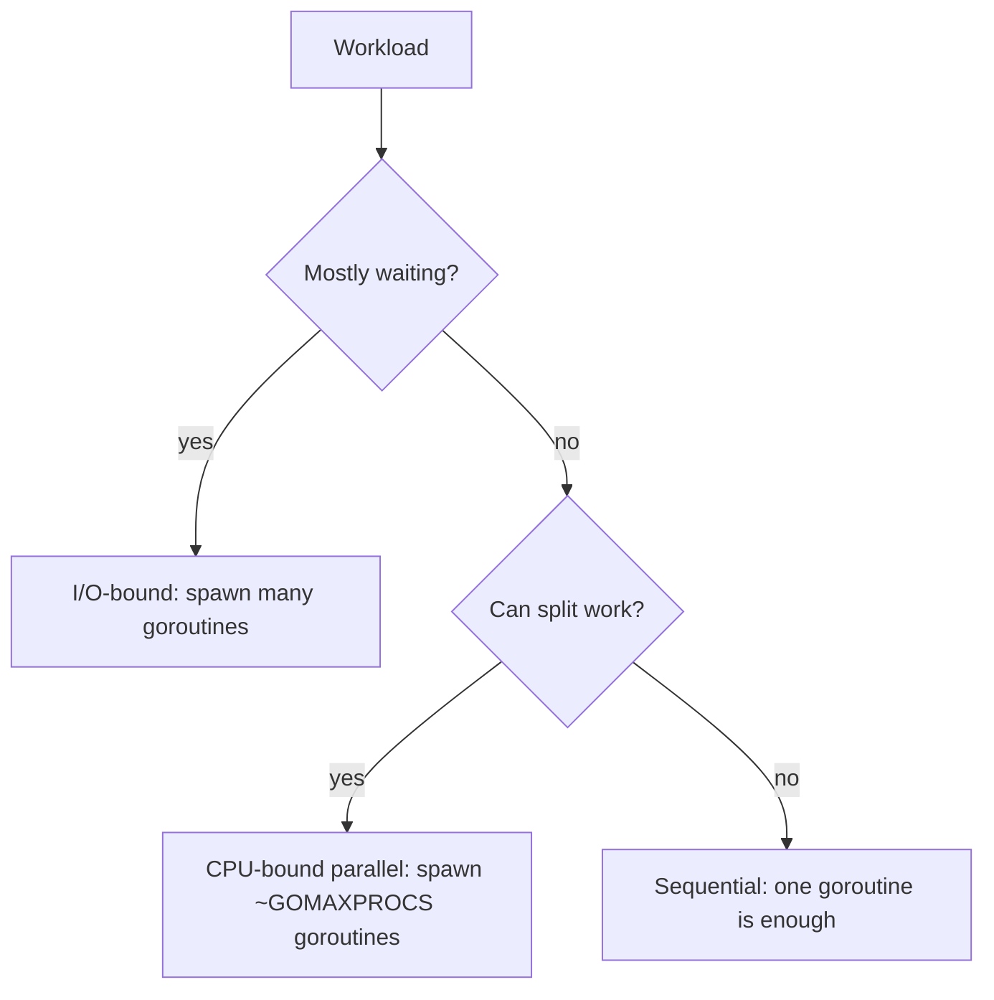

# What is Concurrency — Junior Level

## Table of Contents
1. [Introduction](#introduction)
2. [Prerequisites](#prerequisites)
3. [Glossary](#glossary)
4. [Core Concepts](#core-concepts)
5. [Real-World Analogies](#real-world-analogies)
6. [Mental Models](#mental-models)
7. [Pros & Cons](#pros--cons)
8. [Use Cases](#use-cases)
9. [Code Examples](#code-examples)
10. [Coding Patterns](#coding-patterns)
11. [Clean Code](#clean-code)
12. [Product Use / Feature](#product-use--feature)
13. [Error Handling](#error-handling)
14. [Security Considerations](#security-considerations)
15. [Performance Tips](#performance-tips)
16. [Best Practices](#best-practices)
17. [Edge Cases & Pitfalls](#edge-cases--pitfalls)
18. [Common Mistakes](#common-mistakes)
19. [Common Misconceptions](#common-misconceptions)
20. [Tricky Points](#tricky-points)
21. [Test](#test)
22. [Tricky Questions](#tricky-questions)
23. [Cheat Sheet](#cheat-sheet)
24. [Self-Assessment Checklist](#self-assessment-checklist)
25. [Summary](#summary)
26. [What You Can Build](#what-you-can-build)
27. [Further Reading](#further-reading)
28. [Related Topics](#related-topics)
29. [Diagrams & Visual Aids](#diagrams--visual-aids)

---

## Introduction
> Focus: "What does concurrency mean, why does it exist, and how does Go let me express it?"

Concurrency is the property of a program where multiple **logical tasks** can be in progress at the same time. The key word is *logical*: concurrency does not promise that those tasks run on different CPUs at the same instant, only that they *coexist* within the same time window and can be advanced independently. Whether they actually overlap on hardware is a question of **parallelism**, which depends on the machine and the runtime, not on the program's structure alone.

The clearest analogy is a single chef cooking three dishes for one table. The chef chops onions for the salad, puts a steak on the grill, and reduces a sauce — switching between them as each dish needs attention. Only one task is happening on the chef's hands at a time, but all three dishes are *concurrently* in progress. If you add a second chef, you now have parallelism: two tasks really do happen at the same instant.

Concurrency is older than multi-core hardware. Operating systems have run dozens of concurrent processes on a single CPU since the 1960s, interleaving them in tiny time slices. The reason concurrency matters even on a single core is that real workloads spend a huge fraction of their time *waiting* — for disk, network, user input, or another process. Concurrency lets the program do other useful work during those waits.

Go was designed from the start to make concurrency a first-class concern. The `go` keyword spawns a goroutine — a lightweight unit of independent execution. Channels move data between goroutines without explicit locking. The runtime maps goroutines onto a small pool of OS threads, decoupling the *programming model* (many lightweight tasks) from the *hardware model* (a few real cores). After reading this file you will:

- Be able to define concurrency without confusing it with parallelism.
- Understand why concurrency exists historically and what problems it solves.
- Know the four main motivations: I/O wait, multi-core utilisation, modelling, responsiveness.
- See the cost-benefit trade-off (Amdahl's law in plain words).
- Write a first concurrent Go program and explain why it is faster (or not).
- Recognise the categories of workload that benefit and the ones that do not.

You do not need to know about channels in depth, the GMP scheduler, the memory model, or the CSP model yet. Those follow in the next four subsections of this introduction.

---

## Prerequisites

- **Required:** A working Go install (1.18 or later, 1.21+ recommended). `go version` should print a version.
- **Required:** Comfort writing and compiling a `main` function and reading short snippets of Go code.
- **Required:** Understanding of basic function calls and `for` loops.
- **Helpful:** Awareness that modern computers have multiple CPU cores. The `sysctl hw.ncpu` (macOS), `nproc` (Linux), or "Performance" tab in Task Manager (Windows) will show your core count.
- **Helpful:** Some prior exposure to concurrency in another language — JavaScript callbacks, Python `threading`, Java `Thread`, async/await. Not strictly required.

If `go run main.go` works on your machine and you can read a snippet like `go fmt.Println("hello")` without panic, you are ready.

---

## Glossary

| Term | Definition |
|------|-----------|
| **Concurrency** | The property that multiple logical tasks can be in progress over the same time interval, possibly interleaved on a single CPU. |
| **Parallelism** | Multiple tasks executing at the *exact same instant* on different physical CPUs or cores. Parallelism implies concurrency; the reverse is not true. |
| **Task** | A unit of work in a concurrent program. In Go, usually a goroutine. In an OS, usually a process or thread. |
| **Goroutine** | Go's lightweight unit of independent execution. Started with the `go` keyword. Multiplexed onto OS threads by the runtime. |
| **Thread (OS)** | A heavyweight unit of execution scheduled by the operating system kernel. Costs 1–8 MB of stack each. |
| **Core** | A physical CPU pipeline that can run one instruction stream at a time. Modern CPUs have 4–128 cores. |
| **Hyper-threading / SMT** | A hardware feature that lets one core appear as two logical CPUs, sharing execution units. |
| **GOMAXPROCS** | The maximum number of OS threads the Go runtime can use to execute goroutines simultaneously. Defaults to the number of logical CPUs. |
| **I/O wait** | Time the program spends blocked on disk, network, or other slow devices, not using the CPU. Often >90% of total time for typical web servers. |
| **CPU-bound** | A workload whose runtime is dominated by computation, not waiting. Benefits from parallelism. |
| **I/O-bound** | A workload whose runtime is dominated by waiting. Benefits from concurrency without needing parallelism. |
| **Amdahl's law** | The formula that bounds the maximum speedup of a program from parallelism, given the serial fraction. |
| **Throughput** | Tasks completed per unit of time. Concurrency typically improves throughput. |
| **Latency** | Time from request to response for one task. Concurrency rarely improves latency for a single task; sometimes it worsens it slightly. |
| **Scheduler** | The component that decides which task runs when. In Go, both the OS kernel and the Go runtime schedule. |
| **Context switch** | The act of switching the CPU from running one task to another. Costs hundreds of nanoseconds for an OS thread, tens of nanoseconds for a goroutine. |

---

## Core Concepts

### Concurrency is a property of the program, parallelism is a property of the execution

This distinction is the single most important idea in this entire chapter. A program is **concurrent** if it is structured as a set of independent tasks. A program **runs in parallel** when those tasks happen to execute simultaneously on different hardware.

```
Concurrent design: there are 100 goroutines doing the work
Parallel execution: 8 of them run on 8 cores at this instant
```

The same Go binary, on the same input, can run with concurrency but no parallelism (`GOMAXPROCS=1`, one OS thread doing all the work) or with concurrency *and* parallelism (`GOMAXPROCS=16`, sixteen threads running in parallel). The program is identical. Only the execution environment differs.

### Why concurrency exists: four motivations

#### 1. I/O wait

A typical web request waits 100 ms for a database query, 50 ms for a third-party API, then computes for 1 ms. Without concurrency the CPU is idle 99% of the time. A second request must wait. With concurrency, the program serves request B while request A waits for the database — same CPU, hundreds of times more throughput.

#### 2. Multi-core utilisation

A laptop has 8 cores; a server has 32–128. A purely sequential program uses one core. The other cores sit idle, paid for and wasted. Concurrency lets the program spread CPU-bound work across cores and complete it faster.

#### 3. Modelling

Some problems are inherently concurrent. A chat server has thousands of independent conversations. A game has many independent actors. Forcing this into a sequential event loop is possible but awkward; concurrency lets the code mirror the domain.

#### 4. Responsiveness

A GUI application must keep responding to clicks while a long task runs. A terminal UI must redraw while a download proceeds. Concurrency keeps the foreground responsive by moving slow work to background tasks.

### Concurrency without parallelism is real, common, and useful

Before multi-core CPUs were common (pre-2005), every desktop CPU had one core, and yet operating systems ran dozens of concurrent processes. Time-slicing a single CPU among them gave the *illusion* of parallel execution while really being interleaved concurrency. Modern Go programs on a single-core container behave the same way: `GOMAXPROCS=1`, but `go func() { ... }()` still spawns goroutines that take turns.

Concurrency without parallelism is not a sad fallback; it is a foundational tool. It is how a single goroutine on a single thread can manage 50 000 idle WebSocket connections — by switching between them when each becomes ready.

### Parallelism without concurrency? Almost never.

Conceptually you could imagine SIMD instructions that perform the same operation on 16 values in parallel without any "concurrent task" framing. That is parallelism without concurrency. It is the realm of vector instructions and GPU kernels, not application code. For most software, parallelism is a property of running concurrent code on multiple cores.

### Throughput vs latency

Concurrency typically improves *throughput* (work per second across the whole system) without improving *latency* (time for one task). A single request still takes 150 ms; the program just handles more such requests at once.

Parallelism can improve *latency* for one task by splitting it into pieces that run on different cores. Image processing, big-data jobs, and matrix multiplications all fall here. But splitting has overhead: spawning goroutines, splitting input, coordinating, and reassembling. The overhead can exceed the speedup if pieces are too small.

### Concurrency has costs

The mental model of concurrency as "more is better" is wrong. Concurrency introduces:

- **Scheduling overhead.** The runtime must track tasks, decide who runs, switch contexts.
- **Synchronisation overhead.** Goroutines that share data must coordinate via locks, channels, or atomics, each costing nanoseconds to microseconds.
- **Memory overhead.** Each goroutine has a stack (small, but real). Each channel is an allocation.
- **Reasoning overhead.** Race conditions, deadlocks, and ordering bugs are far more common in concurrent code than in sequential code.

Use concurrency where it pays off, not as a default.

---

## Real-World Analogies

### The single chef and the brigade

A chef cooking three dishes alone is concurrent: dishes are in progress, the chef interleaves work. A brigade of chefs (one per dish) is parallel: each dish has its own worker, all advancing simultaneously. The customer experiences the same final result, but throughput is far higher with the brigade.

The interesting case: a single chef in a kitchen with three burners. The chef can put pots on each burner and let them simmer while moving on. The burners are doing parallel work (heat is applied simultaneously), but the chef's attention is concurrent (only one pot at a time). That is exactly the goroutines + I/O wait pattern: many concurrent tasks, hardware (network card, disk) doing the parallel waiting, the CPU advancing one task at a time.

### The post office line

Imagine a post office with one clerk and 50 customers. Sequential: customer 1 finishes, customer 2 starts. The 50th customer waits for an hour. Now imagine the clerk handles paperwork that takes 30 seconds per customer, but each customer also has a form that takes them 2 minutes to fill out. Concurrent: the clerk takes the form from customer 1, hands them another form to fill out, takes customer 2's form, and so on. The clerk is never idle and the line moves much faster. That is the I/O-wait pattern in human terms.

Now add 5 clerks: parallelism. Each handles their own line, and total throughput is roughly 5x.

### The browser tab

Open 30 browser tabs. Each tab feels independent — clicking one does not freeze another. The browser maintains the illusion of 30 concurrent tasks (you can scroll one tab while another loads a video). Internally it uses a small pool of processes and threads, and the operating system schedules them across the few CPU cores you have. That is exactly how a Go server with thousands of goroutines feels to its clients.

### Reading several books at once

You are reading three books: a novel for 20 minutes before bed, a textbook for an hour after lunch, a comic in spare moments. Concurrently: all three are "in progress" — you have bookmarks in each, you remember where you are, you make progress over the course of a week. Parallelism would require three brains. The bookmark is the analogue of a goroutine's saved state.

---

## Mental Models

### Model 1: "Tasks in flight"

Picture every running goroutine as a card on a kanban board with three columns: **Ready**, **Running**, **Blocked**. The CPU cores are workers who each pick the top Ready card and process it until it either finishes (move to Done), needs something (move to Blocked), or is preempted (back to Ready). The board may have thousands of cards; the workers number in the handful. That is concurrency.

### Model 2: "Time, not space"

Sequential code is a list of statements in space: line 1, line 2, line 3. Concurrent code is a list of statements in time: at time 0, some lines started; at time 1, some are still running, some completed, some new ones started. To read concurrent code you must think along the time axis as well as the line axis.

### Model 3: "The CPU is a precious resource you are scheduling"

Even a 16-core machine has finite CPU. Concurrency does not create more CPU; it lets you decide how the CPU is allocated. If you have 1000 goroutines but only 16 cores, the runtime is *choosing* which 16 run right now and which 984 wait. Your job is to make those choices easy: keep work bounded, avoid long monopolising loops, free the CPU during I/O waits.

### Model 4: "Concurrency is about composition"

Rob Pike's framing: concurrency is a tool for *composing* programs out of independent sub-programs. The point is not raw speed; it is that "fetch from this URL", "decompress this file", "write to this database" can each be expressed as a self-contained piece, then composed via channels or contexts. The benefit is structural clarity. Parallelism is a fortunate side-effect.

### Model 5: "Latency hiding"

The CPU is much faster than I/O. While one request waits 100 ms for the database, the CPU could have done 100 million instructions. Concurrency is the mechanism by which the CPU *does* those 100 million instructions on someone else's behalf instead of idling. Goroutines are the unit; the scheduler is the dispatcher.

---

## Pros & Cons

### Pros

- **Higher throughput on I/O-heavy workloads.** A web server can serve thousands of concurrent requests on a few cores by exploiting waits.
- **Better hardware utilisation.** Multiple cores are used when CPU-bound work is parallelised.
- **More natural modelling for inherently concurrent domains.** Chat servers, games, sensors, simulations.
- **Responsiveness.** Long background work does not block foreground interactions.
- **Composition.** Independent units can be developed and tested in isolation.

### Cons

- **Synchronisation hazards.** Data races, deadlocks, livelocks, ordering bugs.
- **Harder reasoning.** "What happens" depends on timing; bugs may be rare and hard to reproduce.
- **Overhead.** Scheduling, context switching, channel sends — each costs time. For small workloads concurrency *loses*.
- **Testing complexity.** Race conditions must be flushed out with stress tests, `-race`, and careful design.
- **Resource exhaustion.** Unbounded goroutine spawning leads to memory blow-up and scheduling collapse.

---

## Use Cases

| Workload | Concurrency helps? | Reason |
|---|---|---|
| HTTP API server | Yes | One goroutine per request hides I/O wait. |
| Crawler / scraper | Yes | Many independent fetches, each blocked on the network. |
| Image / video transcoding | Yes (parallelism) | CPU-bound, splits across cores. |
| Batch ETL pipeline | Yes | Stages can run concurrently with channels. |
| Real-time game server | Yes | Each player connection is an independent task. |
| Simple CLI calculator | No | Single sequential computation, no waits. |
| Tight CPU-bound loop on one core | No | Concurrency adds overhead with no headroom. |
| Reading one small file end-to-end | No | I/O is too quick to hide; one read is fine. |
| GUI event loop | Yes (responsiveness) | Background work without freezing UI. |

---

## Code Examples

### Example 1: Sequential baseline

```go
package main

import (
    "fmt"
    "time"
)

func slowOp(name string) {
    fmt.Println("start", name)
    time.Sleep(time.Second) // simulate I/O wait
    fmt.Println("done", name)
}

func main() {
    start := time.Now()
    slowOp("A")
    slowOp("B")
    slowOp("C")
    fmt.Println("total:", time.Since(start))
}
```

Output: total around 3 seconds. Each operation blocks the program for 1 s.

### Example 2: Concurrent version

```go
package main

import (
    "fmt"
    "sync"
    "time"
)

func slowOp(name string, wg *sync.WaitGroup) {
    defer wg.Done()
    fmt.Println("start", name)
    time.Sleep(time.Second)
    fmt.Println("done", name)
}

func main() {
    start := time.Now()
    var wg sync.WaitGroup
    for _, name := range []string{"A", "B", "C"} {
        wg.Add(1)
        go slowOp(name, &wg)
    }
    wg.Wait()
    fmt.Println("total:", time.Since(start))
}
```

Output: total around 1 second. The three "waits" overlap because they are blocked simultaneously. This is **concurrency hiding I/O latency**, not parallelism (there is essentially no CPU work happening).

### Example 3: CPU-bound parallelism

```go
package main

import (
    "fmt"
    "runtime"
    "sync"
    "time"
)

func sumRange(lo, hi int) int {
    s := 0
    for i := lo; i < hi; i++ {
        s += i
    }
    return s
}

func main() {
    const N = 100_000_000
    workers := runtime.NumCPU()
    chunk := N / workers
    results := make([]int, workers)

    start := time.Now()
    var wg sync.WaitGroup
    for w := 0; w < workers; w++ {
        wg.Add(1)
        go func(w int) {
            defer wg.Done()
            results[w] = sumRange(w*chunk, (w+1)*chunk)
        }(w)
    }
    wg.Wait()

    total := 0
    for _, r := range results {
        total += r
    }
    fmt.Println("sum:", total, "elapsed:", time.Since(start))
}
```

With `runtime.NumCPU() == 8`, this is roughly 4–6x faster than a single-goroutine sum (overhead and shared caches keep it below 8x). The work was CPU-bound, so concurrency translated into real parallelism.

### Example 4: A concurrent program that runs *slower*

```go
package main

import (
    "fmt"
    "sync"
    "time"
)

func main() {
    start := time.Now()
    var wg sync.WaitGroup
    sum := 0
    var mu sync.Mutex
    for i := 0; i < 1_000_000; i++ {
        wg.Add(1)
        go func(i int) {
            defer wg.Done()
            mu.Lock()
            sum += i
            mu.Unlock()
        }(i)
    }
    wg.Wait()
    fmt.Println("sum:", sum, "elapsed:", time.Since(start))
}
```

Sequential `for i := 0; i < 1_000_000; i++ { sum += i }` finishes in milliseconds. This concurrent version takes seconds because every iteration contends on the same mutex. **Concurrency without parallel opportunity is just overhead.**

### Example 5: Inspecting GOMAXPROCS

```go
package main

import (
    "fmt"
    "runtime"
)

func main() {
    fmt.Println("logical CPUs reported by OS:", runtime.NumCPU())
    fmt.Println("GOMAXPROCS:", runtime.GOMAXPROCS(0))
}
```

Run normally and the two usually match. Run with `GOMAXPROCS=1 go run main.go` to force single-thread execution and observe how the previous CPU-bound example collapses to the sequential time.

### Example 6: Hiding latency with channels

```go
package main

import (
    "fmt"
    "time"
)

func fetch(url string) string {
    time.Sleep(500 * time.Millisecond) // simulate network
    return "data from " + url
}

func main() {
    urls := []string{"a", "b", "c", "d"}
    out := make(chan string, len(urls))
    for _, u := range urls {
        go func(u string) { out <- fetch(u) }(u)
    }
    for range urls {
        fmt.Println(<-out)
    }
}
```

Four 500 ms fetches complete in ~500 ms total. Channels carry the results back.

### Example 7: Concurrency on a single CPU

```go
package main

import (
    "fmt"
    "runtime"
    "sync"
)

func main() {
    runtime.GOMAXPROCS(1)
    var wg sync.WaitGroup
    for i := 0; i < 3; i++ {
        wg.Add(1)
        go func(id int) {
            defer wg.Done()
            for j := 0; j < 3; j++ {
                fmt.Printf("goroutine %d step %d\n", id, j)
            }
        }(i)
    }
    wg.Wait()
}
```

The runtime alternates among the three goroutines on a single thread. Output is interleaved. Concurrency persists; only parallelism is disabled.

---

## Coding Patterns

### Pattern 1: Spawn-and-wait for independent I/O

```go
var wg sync.WaitGroup
for _, item := range items {
    wg.Add(1)
    go func(item Item) {
        defer wg.Done()
        process(item) // I/O-heavy
    }(item)
}
wg.Wait()
```

Reduces wall-clock time when `process` blocks on I/O.

### Pattern 2: Split-and-join CPU work

```go
n := runtime.NumCPU()
chunk := len(data) / n
var wg sync.WaitGroup
out := make([]Result, n)
for w := 0; w < n; w++ {
    wg.Add(1)
    go func(w int) {
        defer wg.Done()
        out[w] = compute(data[w*chunk : (w+1)*chunk])
    }(w)
}
wg.Wait()
combine(out)
```

Exploits multiple cores for CPU-bound algorithms.

### Pattern 3: Producer-consumer

```go
jobs := make(chan Job, 100)
go produce(jobs)
go consume(jobs)
```

A producer goroutine and a consumer goroutine, decoupled by a channel. Each can be on a different core.

### Pattern 4: Bounded concurrency

```go
sem := make(chan struct{}, 8)
for _, item := range items {
    sem <- struct{}{}
    go func(item Item) {
        defer func() { <-sem }()
        process(item)
    }(item)
}
```

Caps the number of in-flight goroutines at 8 — the rest queue behind the semaphore.

---

## Clean Code

- **Make concurrency explicit, not implicit.** A function called `Process(items)` that quietly spawns goroutines inside surprises its callers. Prefer `ProcessConcurrent(ctx, items)` so the API tells the truth.
- **Keep spawn and join in the same scope.** It is hard to reason about a goroutine if its lifetime is scattered across files.
- **Document concurrency semantics in the doc comment.** Say "this method is safe for concurrent use" or "callers must serialise access" — never assume.
- **Avoid sprinkling `go` everywhere.** Each `go` is a fork in your program's control flow. Treat it like an API surface.
- **Prefer simple patterns over clever ones.** Fan-out + WaitGroup is almost always more maintainable than a hand-rolled scheduler.

---

## Product Use / Feature

| Feature | Concurrency role |
|---|---|
| Bulk import (CSV upload) | One goroutine per row, bounded by a worker pool, overlapping disk reads with API calls. |
| Live notifications | A goroutine per WebSocket connection; runtime hides I/O wait. |
| Search across many shards | Fan out to shards in parallel, gather results, return first-acceptable. |
| Background email/SMS sender | A long-running consumer goroutine reading from a queue. |
| Periodic cache refresh | A goroutine on a ticker, independent of request flow. |
| Server-side image rendering | Parallel goroutines split the image into tiles. |
| Webhook delivery | One goroutine per webhook attempt, with retries and timeouts. |

---

## Error Handling

When tasks run concurrently, errors can occur in any of them. Three idioms:

### 1. Per-task error channels

```go
errs := make(chan error, len(items))
for _, item := range items {
    go func(item Item) {
        errs <- process(item)
    }(item)
}
for range items {
    if err := <-errs; err != nil {
        log.Println(err)
    }
}
```

### 2. `errgroup` (covered in detail later)

```go
g, ctx := errgroup.WithContext(ctx)
for _, item := range items {
    item := item
    g.Go(func() error { return process(ctx, item) })
}
if err := g.Wait(); err != nil {
    return err
}
```

### 3. Aggregate errors

Collect all errors into a slice with a mutex; report at the end. Useful when you want to retry all failures rather than abort on the first.

In all cases: **a goroutine cannot return a value to its caller's stack frame.** Errors must be sent through some channel, group, or shared variable.

---

## Security Considerations

- **Resource exhaustion via unbounded concurrency.** A naive endpoint that spawns one goroutine per request can be DDoSed by clients opening millions of slow connections. Bound concurrency.
- **Race conditions on auth state.** A race on a session token or permission check can briefly grant the wrong access. Use proper synchronisation around any security-relevant state.
- **Information leakage via timing.** Concurrency can change the timing of operations, exposing or hiding timing-based side channels. Be cautious with cryptographic code; the standard library's `crypto/subtle` exists for constant-time operations.
- **Panic in a worker goroutine = process exit.** A malicious input that triggers a panic kills every concurrent request. Always `recover` at goroutine boundaries that handle untrusted input.

---

## Performance Tips

- Measure before optimising. Run the sequential version, then the concurrent version, then compare. If concurrency is not 1.5x faster, it is probably not worth the complexity.
- For I/O-bound work, concurrency wins easily. The benchmark is "before: 3 s, after: 300 ms."
- For CPU-bound work, scaling beyond `GOMAXPROCS` is wasted. Match the goroutine count to the core count.
- Avoid concurrent code on micro-workloads. The break-even point is roughly a few microseconds of work per goroutine.
- Beware of shared state contention. Many cores hitting one mutex is *slower* than one core doing the same work sequentially.

---

## Best Practices

1. Define what "task" means in your program. A request? A row? A file? Be explicit.
2. Decide your concurrency model up front: fan-out, worker pool, pipeline, or none.
3. Use `context.Context` for cancellation across goroutine trees.
4. Cap concurrency with a semaphore or pool when input is unbounded.
5. Run `go test -race` in CI for every package that uses concurrency.
6. Document goroutine ownership: "function X starts and joins these goroutines."
7. Prefer channels for communication, mutexes for protecting state — and never both for the same data.
8. Treat goroutine leaks as bugs to fix, not as harmless waste.
9. Profile concurrent code with `go test -bench` and `pprof`; intuition is often wrong.
10. Start simple, add concurrency only where measurements justify it.

---

## Edge Cases & Pitfalls

### Concurrent code that is actually serialised

```go
var mu sync.Mutex
go func() { mu.Lock(); doA(); mu.Unlock() }()
go func() { mu.Lock(); doB(); mu.Unlock() }()
```

If `doA` and `doB` are CPU-bound and serialised by the mutex, you have concurrency on paper but no parallel work in practice. Real wall-clock time matches sequential.

### Concurrent code that wedges on shared bottleneck

A pool of 8 goroutines, each hitting the same shared database connection, will still throughput at the rate of that one connection. The "8x parallelism" lives only in your imagination.

### Concurrent code that runs sequentially due to GOMAXPROCS

`GOMAXPROCS=1` (often the case in default Docker containers in 2024 with old runtimes) collapses all goroutines onto one OS thread. CPU-bound parallelism vanishes; I/O-bound concurrency still works because goroutines yield on I/O.

### Goroutines exceeding input

Spawning a million goroutines to do trivial work makes the scheduler thrash. Throughput drops dramatically. Concurrency has a sweet spot.

### Memory ordering surprises

Without synchronisation, goroutine B may not see a write that goroutine A made. This is the *Go memory model*. Without `sync.Mutex`, atomics, or channels, you cannot assume reads return latest writes.

---

## Common Mistakes

| Mistake | Fix |
|---|---|
| Confusing concurrency with parallelism, expecting all concurrent code to "be faster" | Distinguish I/O-bound (concurrency helps) from CPU-bound (parallelism helps) workloads. |
| Spawning more goroutines hoping for more speed | Goroutines beyond `GOMAXPROCS` (for CPU work) add overhead without benefit. |
| Using concurrency on micro-workloads | A `go f()` per integer addition is far slower than the addition itself. |
| Concurrent writes to a shared variable without synchronisation | Use a mutex, atomic, or send via channel. Run with `-race`. |
| Forgetting to wait for goroutines to finish | The main goroutine returns, the program exits, work is lost. |
| Treating goroutines as "free" | Cheap, but accumulating leaks is a real bug. |
| Ignoring backpressure | An unbounded pipeline saturates memory. Use buffered channels or semaphores. |

---

## Common Misconceptions

> *"Concurrency makes my code faster."* — Only when there is parallel work to be done (CPU on multiple cores) or wait to hide (I/O). Otherwise it makes code slower.

> *"More goroutines = more speed."* — Up to a point. Beyond `GOMAXPROCS` for CPU work, returns are negative. For I/O, returns continue but flatten when bottlenecks shift to disk, network, or downstream services.

> *"Concurrency = parallelism."* — Different things. Concurrency is a design property; parallelism is an execution property.

> *"Go programs are automatically parallel."* — Go runs concurrent goroutines in parallel when CPU cores are available and `GOMAXPROCS > 1`. The compiler does not parallelise sequential code.

> *"A single-core machine cannot run concurrent programs efficiently."* — It can. The classic Unix `make -j8` even on a single CPU was overlapping disk waits.

> *"Concurrency is harder than threads."* — Goroutines are typically *easier* than threads. The hard part is shared mutable state, which is hard in any language.

---

## Tricky Points

### Concurrency on a single goroutine

```go
go func() {
    for {
        select {
        case <-ch1: ...
        case <-ch2: ...
        }
    }
}()
```

One goroutine, handling two streams. Concurrent from the caller's perspective even though it is a single linear program inside.

### Parallel CPU work that hits memory bandwidth

```go
for i := 0; i < 8; i++ {
    go scan(largeArray)
}
```

Eight goroutines scanning a giant array do not finish in `1/8` the time — they share memory bandwidth and L3 cache. Sometimes parallelism is bottlenecked by hardware below the CPU.

### Concurrency and the race detector

`go test -race` detects unsynchronised access only at the moments it happens. A bug that occurs once in a thousand runs may pass the race test in your CI. Use stress runs and design carefully.

### Concurrency vs preemption

Pre-Go 1.14, a tight `for { x++ }` loop with no function calls could prevent the scheduler from preempting the goroutine. Other goroutines starved. Modern Go (1.14+) introduced async preemption that solves this for most cases.

---

## Test

```go
package concurrency_test

import (
    "sync"
    "sync/atomic"
    "testing"
)

func TestConcurrentSumIsCorrect(t *testing.T) {
    var sum int64
    var wg sync.WaitGroup
    for i := 1; i <= 1000; i++ {
        wg.Add(1)
        go func(i int) {
            defer wg.Done()
            atomic.AddInt64(&sum, int64(i))
        }(i)
    }
    wg.Wait()
    if sum != 500_500 {
        t.Fatalf("expected 500500, got %d", sum)
    }
}
```

Run with `go test -race` to verify the goroutine bodies do not race.

---

## Tricky Questions

**Q.** Two programs solve the same problem. Program A uses 1 goroutine, program B uses 8. Which is faster?

**A.** It depends on the problem. If it is I/O-bound with 8 parallel I/Os, B wins big. If it is CPU-bound and your machine has 8 cores, B can win up to 8x. If the workload is small or single-threaded by nature (e.g., reading one file end-to-end), A wins because B pays scheduling overhead with no benefit.

---

**Q.** Why does this concurrent code take *longer* than the sequential version?

```go
var mu sync.Mutex
var sum int
var wg sync.WaitGroup
for i := 0; i < 1_000_000; i++ {
    wg.Add(1)
    go func(i int) {
        defer wg.Done()
        mu.Lock()
        sum += i
        mu.Unlock()
    }(i)
}
wg.Wait()
```

**A.** Two reasons. First, each goroutine has a real cost (scheduling, allocation), so a million goroutines is millions of overhead. Second, all of them serialise on `mu.Lock()`, so there is no concurrency advantage — it is sequential with extra overhead.

---

**Q.** If concurrency does not imply parallelism, what does Go actually guarantee?

**A.** Go guarantees that goroutines can be *scheduled* concurrently — they will make progress over the same time interval if both are runnable. Whether they actually run on separate cores at the same instant depends on `GOMAXPROCS`, the OS, and what else is running. The Go runtime makes a best effort to use the cores available.

---

**Q.** What is the smallest example of code where concurrency hurts performance?

```go
go func() { x++ }()
```

**A.** That single goroutine launched to do one trivial operation. The cost of `go` (allocating a g, queueing it, scheduling it) is hundreds of times larger than the increment itself. You should just write `x++`.

---

**Q.** Why does Amdahl's law matter for everyday Go code?

**A.** It bounds the speedup you can ever achieve from parallelism. If 30% of your program is inherently sequential (lock acquisition, single-DB-write, ordering), then even infinite cores cannot give you more than ~3.3x speedup. Most real Go programs have significant serial fractions, so 4–8x is more realistic than 32x even on a 32-core box.

---

## Cheat Sheet

```
Concurrency : tasks in progress over the same interval
Parallelism : tasks running on different CPUs at the same instant

Concurrency helps with:
  - I/O wait (network, disk, subprocess)
  - Multi-core CPU work (when GOMAXPROCS > 1)
  - Modelling many independent agents
  - Responsiveness (background work)

Concurrency hurts with:
  - Tiny workloads (scheduling overhead > work)
  - Heavy mutex contention (serialises everything)
  - Memory bandwidth-bound code (cores compete for cache)

Tools:
  go f()             // spawn a goroutine
  sync.WaitGroup     // join N goroutines
  channels           // communicate between goroutines
  context.Context    // cancel goroutine trees
  -race              // detect data races
  runtime.NumCPU()   // count cores
  runtime.GOMAXPROCS // configure parallelism cap
```

---

## Self-Assessment Checklist

- [ ] I can give a one-sentence definition of concurrency that does not mention parallelism.
- [ ] I can explain why a single-core machine can benefit from concurrent code.
- [ ] I can describe the four main motivations for concurrency.
- [ ] I can identify whether a given workload is I/O-bound or CPU-bound.
- [ ] I can write a concurrent Go program with `go` + `sync.WaitGroup`.
- [ ] I know that arguments to `go f(x)` are evaluated in the parent goroutine.
- [ ] I have seen a concurrent program that is *slower* than its sequential equivalent and can explain why.
- [ ] I know what `GOMAXPROCS` controls and what its default is.
- [ ] I have run `go test -race` and know what it does.
- [ ] I can state Amdahl's law informally.

---

## Summary

Concurrency is the property that multiple logical tasks can be in progress over the same time interval. Parallelism is the property that some of them happen to run on different hardware at the same instant. They are not the same: a single-core machine can run concurrent code; a SIMD instruction is parallel but not concurrent in the application sense.

Concurrency exists because real workloads spend most of their time waiting (I/O) and because modern hardware has many cores. Both motivations point to the same answer: structure your program as many lightweight, independent tasks, and let the runtime decide where and when each one runs.

Go's approach makes this cheap and pleasant: the `go` keyword launches a goroutine in nanoseconds; channels make coordination explicit; the runtime maps goroutines onto a small pool of OS threads. The rest of this chapter teaches you the primitives, the patterns, and the pitfalls.

---

## What You Can Build

After mastering this material:

- A small concurrent HTTP fetcher that downloads N URLs in parallel and reports the slowest.
- A "concurrent vs sequential" benchmark that measures both versions of the same work.
- A demo that toggles `GOMAXPROCS` and shows CPU-bound speedup curves.
- An I/O-bound versus CPU-bound classifier that decides whether to spawn goroutines.
- A pipeline of three stages (read, transform, write) connected by channels.

---

## Further Reading

- Rob Pike, *Concurrency is not Parallelism*: <https://go.dev/blog/waza-talk>
- The Go Blog, *Share Memory By Communicating*: <https://go.dev/blog/codelab-share>
- *Effective Go* — Concurrency: <https://go.dev/doc/effective_go#concurrency>
- Amdahl, *Validity of the single processor approach to achieving large scale computing capabilities* (1967).
- Gustafson, *Reevaluating Amdahl's Law* (1988).
- Dijkstra, *Cooperating Sequential Processes* (1965).
- Tony Hoare, *Communicating Sequential Processes* (1978). The CSP paper Go's channels descend from.

---

## Related Topics

- [02-csp-model](../02-csp-model/) — the theoretical foundation Go inherits.
- [03-go-runtime-gmp](../03-go-runtime-gmp/) — the scheduler that turns concurrency into parallelism.
- [04-memory-model](../04-memory-model/) — when one goroutine sees another's writes.
- [05-when-to-use-concurrency](../05-when-to-use-concurrency/) — decision framework.
- Goroutines, channels, `select`, `context.Context` (later sections).

---

## Diagrams & Visual Aids

### Concurrency vs parallelism

```
Concurrency (1 CPU, 3 tasks):
  CPU: AAA BBB AAA CCC BBB CCC AAA
       time -->

Parallelism (3 CPUs, 3 tasks):
  CPU0: AAAAAAAAAAA
  CPU1: BBBBBBBBBBB
  CPU2: CCCCCCCCCCC
        time -->
```

### Hiding I/O latency

```
Sequential:
  CPU: |A--wait--A| |B--wait--B| |C--wait--C|
       0   1s   1s  2s   2s  2s  3s   3s  3s   total 3s

Concurrent:
  CPU: |A| |B| |C|                   start in parallel
  Net:    wait   wait   wait         hardware waits in parallel
  CPU:               |A||B||C|       resume when ready
       0   1s                        total ~1s
```

### Amdahl's law visual

```
Serial fraction = 30%
Cores       Speedup
1           1.00x
2           1.54x
4           2.11x
8           2.58x
16          2.91x
infinity    3.33x  <- the hard cap from the 30% serial portion
```

### Workload classification



### Throughput vs latency

```
Sequential server (1 worker):
  request 1: 0 -> 100 ms
  request 2: 100 -> 200 ms
  request 3: 200 -> 300 ms
  latency per request: 100 ms
  throughput: 10 req/s

Concurrent server (10 workers, I/O-bound):
  request 1: 0 -> 100 ms
  request 2: 0 -> 100 ms
  ...
  request 10: 0 -> 100 ms
  latency per request: 100 ms (same!)
  throughput: 100 req/s
```
