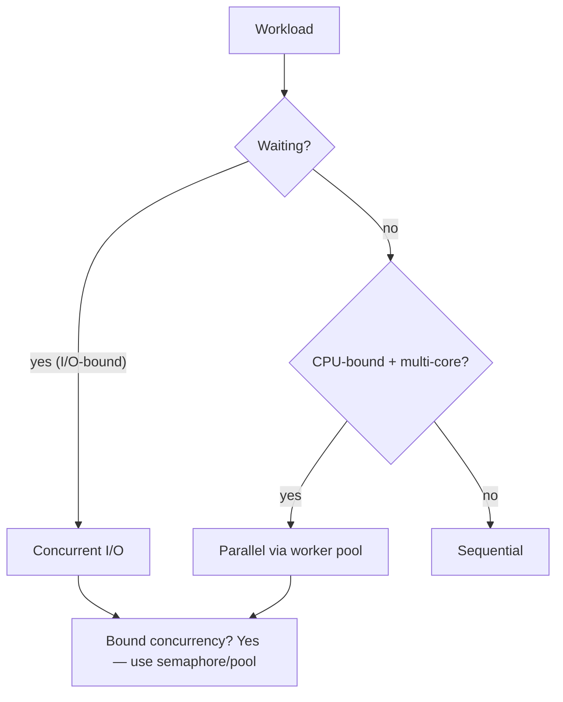

# When to Use Concurrency — Junior Level

## Table of Contents
1. [Introduction](#introduction)
2. [Prerequisites](#prerequisites)
3. [Glossary](#glossary)
4. [Core Concepts](#core-concepts)
5. [Real-World Analogies](#real-world-analogies)
6. [Mental Models](#mental-models)
7. [Pros & Cons](#pros--cons)
8. [Use Cases](#use-cases)
9. [Code Examples](#code-examples)
10. [Coding Patterns](#coding-patterns)
11. [Clean Code](#clean-code)
12. [Product Use / Feature](#product-use--feature)
13. [Error Handling](#error-handling)
14. [Security Considerations](#security-considerations)
15. [Performance Tips](#performance-tips)
16. [Best Practices](#best-practices)
17. [Edge Cases & Pitfalls](#edge-cases--pitfalls)
18. [Common Mistakes](#common-mistakes)
19. [Common Misconceptions](#common-misconceptions)
20. [Tricky Points](#tricky-points)
21. [Test](#test)
22. [Tricky Questions](#tricky-questions)
23. [Cheat Sheet](#cheat-sheet)
24. [Self-Assessment Checklist](#self-assessment-checklist)
25. [Summary](#summary)
26. [What You Can Build](#what-you-can-build)
27. [Further Reading](#further-reading)
28. [Related Topics](#related-topics)
29. [Diagrams & Visual Aids](#diagrams--visual-aids)

---

## Introduction
> Focus: "Given a problem, should I use goroutines? When does concurrency help, and when does it hurt?"

Adding concurrency to a program is like hiring more cooks for a kitchen. Sometimes it makes the meal come out faster. Sometimes it just produces noise and confusion. The skill is knowing which.

The previous subsections of this introduction taught you the *how* of Go concurrency — what a goroutine is, how channels work, how the scheduler runs them, what the memory model guarantees. This subsection is the *whether*. Should you reach for the `go` keyword here, or not?

The short answer: use concurrency when:

1. **Your work involves waiting** (network, disk, subprocess). Goroutines hide the wait by switching to other work.
2. **Your work involves CPU-intensive computation that can be split** and you have multiple cores available. Goroutines run in parallel.
3. **Your problem is naturally concurrent** (many independent agents, conversations, sensors). Goroutines model each one cleanly.

Do *not* use concurrency when:

1. **The work is short and sequential.** A `go f()` for a 100-ns operation is hundreds of times slower than just calling `f()`.
2. **The work is already concurrent at a higher level.** Adding sub-goroutines inside a per-request goroutine often hurts more than helps.
3. **The work is CPU-bound on a single core.** No parallelism to exploit; concurrency just adds scheduling overhead.
4. **You don't have a real measurement showing concurrency would help.** Premature concurrency is one of the easiest performance pitfalls.

This file walks through the decision framework with concrete examples. After this you will:

- Have a checklist for "should this be a goroutine?"
- Recognise I/O-bound vs CPU-bound at a glance.
- Know when concurrency adds overhead vs latency hiding.
- Have a default policy: start sequential, add concurrency only with measurement.

---

## Prerequisites

- **Required:** All previous subsections of this introduction. You should know what goroutines, channels, and the memory model are.
- **Required:** Comfort writing simple concurrent Go code.
- **Helpful:** Some experience profiling Go programs (`pprof` basics).

---

## Glossary

| Term | Definition |
|------|-----------|
| **I/O-bound** | A workload dominated by waiting on external resources (network, disk, subprocess). Benefits from concurrency without needing multiple cores. |
| **CPU-bound** | A workload dominated by computation. Benefits from parallelism on multiple cores. |
| **Latency hiding** | Using concurrency to make a goroutine do other useful work while another is waiting. The primary benefit of concurrency for I/O-bound workloads. |
| **Parallelism** | Multiple cores doing different work at the same time. Requires concurrent code structure and multi-core hardware. |
| **Premature concurrency** | Adding goroutines "for performance" without measurement. Often slower or buggier than the sequential version. |
| **Concurrent at framework level** | A program where the framework (HTTP server, message queue consumer) already spawns goroutines per request/event. Adding more inside is usually wasteful. |
| **Amdahl's law** | Speedup from parallelism is capped by the serial fraction. Even infinite cores cannot make a 70%-parallel program more than ~3.3x faster. |
| **Bottleneck** | The slowest component. Adding concurrency around a bottleneck rarely helps; the bottleneck stays. |
| **Decision framework** | A checklist used to decide whether and how to apply concurrency. |

---

## Core Concepts

### The first rule: don't add concurrency unless it helps

Sequential code is simpler. Easier to read, write, test, debug. Concurrency is a tool to overcome specific limitations:

- "My program waits a lot."
- "My program could use more cores."
- "My problem has many independent things happening."

If none of those apply, do not add concurrency. The default is sequential.

### Identify the workload type

Three categories:

#### I/O-bound

The program spends most of its time waiting:

- Network requests (HTTP, DB, RPC).
- Disk reads/writes (especially large files).
- Subprocess spawning.
- User input (in interactive programs).

For I/O-bound work, concurrency hides the wait. One goroutine waits for the database; another fetches from the API in parallel. Total wall-clock time approaches the maximum of the individual waits, not the sum.

Symptoms of I/O-bound code:
- CPU usage low (under 30%) even at high load.
- Tracing shows long "waiting" spans.
- The function calls `http.Get`, `database/sql`, `os.ReadFile`, etc.

Default strategy: one goroutine per I/O operation, or one goroutine per incoming request.

#### CPU-bound

The program spends most of its time computing:

- Image / video processing.
- Cryptographic operations.
- Search ranking, sorting, indexing.
- Simulation, ML inference, machine learning training.

For CPU-bound work, concurrency translates into parallelism only if you have multiple cores. Speedup approaches `min(N, cores)` for N goroutines.

Symptoms of CPU-bound code:
- CPU usage near 100% (single core) or scaling with cores.
- Profile shows time in your business logic.
- No syscalls / network in the hot path.

Default strategy: ~`runtime.NumCPU()` goroutines processing partitioned work. More wastes scheduling effort.

#### Mixed

Real workloads are usually mixed: a request does some I/O, some CPU, more I/O. The shape of concurrency follows the structure: one goroutine per request, possibly sub-goroutines for parallel I/O within the request.

### The "framework already spawns goroutines" trap

`net/http` already creates a goroutine per request. If you write:

```go
http.HandleFunc("/api", func(w http.ResponseWriter, r *http.Request) {
    go process(r) // BUG: probably unnecessary
    w.WriteHeader(200)
})
```

You spawn a goroutine inside a goroutine. The framework's goroutine returns immediately; the sub-goroutine continues. If `process` finishes before the framework cleans up, fine. If not, you may have leaked or unfinished work.

This pattern (sub-spawning) is common and almost always wrong. The handler should just call `process(r)` synchronously.

### When concurrency hurts

Some patterns are well-known to lose:

#### 1. Per-item goroutine for trivial work

```go
for _, item := range items {
    go quickThing(item) // BUG
}
```

Each `go` costs hundreds of nanoseconds. `quickThing` may cost 10 nanoseconds. The goroutine overhead dominates.

**Fix:** just iterate.

#### 2. Concurrent code bottlenecked by a shared resource

```go
for _, item := range items {
    go func(item Item) {
        mu.Lock()
        process(item)
        mu.Unlock()
    }(item)
}
```

All goroutines serialise on the mutex. The "concurrent" code is actually sequential plus overhead.

**Fix:** restructure to remove the shared bottleneck, or just iterate.

#### 3. CPU-bound code on a single core

If `GOMAXPROCS=1`, no amount of goroutines makes CPU work faster.

**Fix:** ensure multi-core is available, or accept the single-core ceiling.

#### 4. Small workloads

```go
go func() {
    return x + y // trivial
}()
```

The goroutine takes longer to schedule than the addition.

**Fix:** just compute.

#### 5. Premature optimisation

"Let me make this concurrent in case we need to scale." Almost always wrong:
- The complexity is real now; the performance benefit is theoretical.
- When you actually need to scale, the bottleneck may be different.
- Future maintainers inherit the complexity.

**Fix:** start sequential, profile, add concurrency where measurements show benefit.

---

## Real-World Analogies

### The kitchen with one pot

A chef cooking one dish, with one stove and one pot. Hiring more chefs does not speed it up — there is only one pot.

That is CPU-bound work on one core. More goroutines do not parallelise; they take turns.

### The waiter taking orders

A waiter at one table takes the order, walks to the kitchen, walks back. With one waiter, three tables wait sequentially. With three waiters, all three are attended at once.

That is I/O-bound work. Concurrency = more waiters = less waiting.

### The artist with assistants

A painter with helpers (mix paint, prepare canvases, hold brushes). If the painter is the bottleneck, helpers do not paint faster. If preparation is the bottleneck (which the painter can do in parallel), helpers speed things up.

That is the decision: is your work the bottleneck, or is something else?

### The recipe book

A cookbook with 100 recipes. A solo cook reads recipe 1, cooks it, reads recipe 2, cooks it. A team of 10 cooks: each grabs a recipe and cooks. Throughput goes up 10x.

That is parallel CPU work. Many independent tasks; many workers.

---

## Mental Models

### Model 1: "What is the work waiting for?"

If it is waiting for I/O — concurrency hides the wait.
If it is waiting for CPU — concurrency works only if more cores are available.
If it is waiting for a shared resource — concurrency does not help; it queues.

### Model 2: "Concurrency adds nothing if there's nothing to overlap"

A purely sequential algorithm with no waits and no parallel structure cannot be made faster by goroutines. The runtime cannot magically split it.

### Model 3: "Profile before, profile after"

Measure the sequential version. Add concurrency. Measure again. If the gain does not justify the complexity, revert.

### Model 4: "Concurrency at the right level"

Per-request goroutines are usually the right level. Sub-goroutines inside a request are sometimes useful (fan-out to multiple services), often not (sub-tasks of the request itself).

---

## Pros & Cons

### Pros of concurrency

- Hides I/O latency.
- Exploits multiple cores.
- Models concurrent domains naturally.
- Improves responsiveness.

### Cons

- Adds complexity.
- Introduces synchronisation bugs.
- Adds overhead.
- Makes testing harder.
- May not help (or may hurt) without measurement.

The trade is: gain throughput / latency-hiding / parallelism vs gain complexity / bugs / overhead. Make the trade only when the gain is real.

---

## Use Cases

| Workload | Concurrency? |
|---|---|
| Single CLI command processing one file | No. Just call the function. |
| Web API serving requests | Per-request (the framework handles it). |
| Bulk import of 100 000 rows from a CSV | Maybe — depends on what processing each row does. |
| Fetching 10 URLs and aggregating | Yes — I/O-bound, fan-out. |
| Sorting 100 items in memory | No. Sequential is fast enough. |
| Encoding 10 GB of video frames | Yes — CPU-bound, parallel. |
| Reading a small config file at startup | No. Single read; trivial. |
| Sending 1000 emails | Yes — I/O-bound, bound concurrency. |
| Computing the 10 000th Fibonacci number | No. Inherently sequential algorithm. |
| Computing 10 000 Fibonacci-like sequences | Yes (one per sequence). |

---

## Code Examples

### Example 1: Sequential file read — fine as-is

```go
data, err := os.ReadFile("config.json")
if err != nil { return err }
process(data)
```

No need for a goroutine. The read is one operation; nothing to overlap.

### Example 2: Multiple file reads — concurrent helps

```go
type Result struct {
    name string
    data []byte
    err  error
}

func ReadAll(names []string) []Result {
    results := make([]Result, len(names))
    var wg sync.WaitGroup
    for i, name := range names {
        wg.Add(1)
        go func(i int, name string) {
            defer wg.Done()
            data, err := os.ReadFile(name)
            results[i] = Result{name, data, err}
        }(i, name)
    }
    wg.Wait()
    return results
}
```

I/O-bound. Concurrent reads overlap; total time approaches the slowest read, not the sum.

### Example 3: CPU-bound — concurrent helps if cores available

```go
func ParallelSum(data []int) int {
    workers := runtime.NumCPU()
    chunk := len(data) / workers
    partial := make([]int, workers)
    var wg sync.WaitGroup
    for w := 0; w < workers; w++ {
        wg.Add(1)
        go func(w int) {
            defer wg.Done()
            for i := w * chunk; i < (w+1)*chunk; i++ {
                partial[w] += data[i]
            }
        }(w)
    }
    wg.Wait()
    total := 0
    for _, p := range partial {
        total += p
    }
    return total
}
```

Speedup approaches `NumCPU` on a CPU-bound sum.

### Example 4: Mistaken concurrency — slower than sequential

```go
func Sum(data []int) int {
    var total atomic.Int64
    var wg sync.WaitGroup
    for _, v := range data {
        wg.Add(1)
        go func(v int) {
            defer wg.Done()
            total.Add(int64(v))
        }(v)
    }
    wg.Wait()
    return int(total.Load())
}
```

One goroutine per element. Each goroutine costs ~500 ns; the addition costs 1 ns. Slower than the sequential `for` loop by 500x.

**Fix.** Just iterate.

### Example 5: HTTP handler — don't sub-spawn

```go
// Wrong:
http.HandleFunc("/api", func(w http.ResponseWriter, r *http.Request) {
    go heavyProcessing(r) // BUG: where does it end?
    w.WriteHeader(202)
})

// Right (synchronous response):
http.HandleFunc("/api", func(w http.ResponseWriter, r *http.Request) {
    result := heavyProcessing(r)
    w.Write(result)
})

// Or, if truly async work needed: enqueue to a background worker
http.HandleFunc("/api", func(w http.ResponseWriter, r *http.Request) {
    workQueue <- r
    w.WriteHeader(202)
})
```

The third pattern is correct for "fire-and-forget" with a real background worker reading from `workQueue`.

### Example 6: Parallel I/O within a request — appropriate

```go
func handleProfile(ctx context.Context, userID string) (Profile, error) {
    var (
        user        User
        prefs       Preferences
        permissions []Permission
    )
    g, ctx := errgroup.WithContext(ctx)
    g.Go(func() error {
        var err error
        user, err = fetchUser(ctx, userID)
        return err
    })
    g.Go(func() error {
        var err error
        prefs, err = fetchPrefs(ctx, userID)
        return err
    })
    g.Go(func() error {
        var err error
        permissions, err = fetchPermissions(ctx, userID)
        return err
    })
    if err := g.Wait(); err != nil {
        return Profile{}, err
    }
    return Profile{user, prefs, permissions}, nil
}
```

Three I/O operations in parallel. Latency = max, not sum. Good use of concurrency.

### Example 7: Sequential is right

```go
func formatReport(data []Row) string {
    var sb strings.Builder
    for _, r := range data {
        sb.WriteString(formatRow(r))
    }
    return sb.String()
}
```

Single-threaded string building. No I/O. No parallel work. Concurrency would not help.

### Example 8: Background task — only if truly independent

```go
// Reasonable:
func init() {
    go runMetricsCollector() // long-lived, truly independent
}

// Questionable:
func processOrder(o Order) error {
    go sendNotification(o) // fire-and-forget — could be leaked
    return save(o)
}
```

The notification example is OK *if* you have proper goroutine lifetime management (a worker pool, a buffered channel, etc.). Bare `go` for ad hoc tasks is fragile.

---

## Coding Patterns

### Pattern 1: Default to sequential

```go
func process(items []Item) {
    for _, item := range items {
        do(item)
    }
}
```

Start here. Only complicate if measurement says so.

### Pattern 2: Fan-out for independent I/O

```go
g, ctx := errgroup.WithContext(ctx)
for _, item := range items {
    item := item
    g.Go(func() error { return doIO(ctx, item) })
}
return g.Wait()
```

Adds value when each `doIO` blocks for non-trivial time.

### Pattern 3: Split-work for CPU

```go
workers := runtime.NumCPU()
// partition data
// spawn `workers` goroutines
// wait and combine
```

Adds value when the work is significant and parallelisable.

### Pattern 4: Bounded pool for unbounded input

```go
sem := make(chan struct{}, 16)
for _, item := range items {
    sem <- struct{}{}
    go func(item Item) {
        defer func() { <-sem }()
        process(item)
    }(item)
}
```

Caps memory; prevents goroutine explosion.

---

## Clean Code

- **Default sequential.** Concurrency is opt-in, justified by measurement.
- **Comment why.** "Why goroutines here?" is often a missing rationale in real code.
- **Bound everything.** Unbounded goroutine creation is almost always wrong.
- **Use `errgroup` for structured concurrency.** Cleaner than manual `WaitGroup` + error channels.
- **Profile before optimising.** Intuition is often wrong.

---

## Product Use / Feature

| Feature | Concurrency role |
|---|---|
| Bulk upload | Per-row goroutines bounded by a pool. Stages I/O reading + processing. |
| Live dashboard | Per-WebSocket goroutine; framework handles. |
| Report generation | Mostly sequential; perhaps parallel query at the start. |
| Batch geocoding | Fan-out to many API calls, bounded. |
| Recommendation engine | Per-user query may fan out to multiple feature backends. |
| CLI tool | Often fully sequential; perhaps concurrent file I/O for bulk operations. |

---

## Error Handling

When deciding on concurrency, also think about error semantics:

- Sequential: errors stop processing immediately.
- Concurrent (all-or-nothing): use `errgroup`; first error cancels.
- Concurrent (best-effort): collect errors, continue.
- Concurrent (quorum): succeed if K of N succeed.

The choice depends on product semantics. Make it explicit; do not let it default.

---

## Security Considerations

- **Concurrency can amplify resource consumption.** A bug that spawns a goroutine per request can be DDoSed.
- **Race conditions on auth or state can grant the wrong access.** If you add concurrency, audit all shared state.
- **Goroutine panics kill the process.** If you add concurrency to handle untrusted input, recover at the boundary.

---

## Performance Tips

- For I/O-bound work, concurrency typically gives 3x–10x speedup.
- For CPU-bound work, concurrency gives up to `NumCPU` speedup (often less).
- For mixed work, the speedup is somewhere in between.
- Test under realistic load; the development laptop may not reflect production behaviour.
- Watch for the inverse: concurrent code that is slower than sequential. This is a strong signal of overengineering.

---

## Best Practices

1. Start sequential. Add concurrency only with measurement.
2. Use `errgroup` for parallel I/O within a request.
3. Use `runtime.NumCPU()` goroutines for CPU-bound parallel work.
4. Bound unbounded goroutine creation with pools / semaphores.
5. Don't sub-spawn inside framework-provided goroutines.
6. Profile with `pprof` before optimising.
7. Compare wall-clock time, not micro-benchmarks.
8. Recheck performance after each refactor.
9. Document concurrency choices in code comments.
10. Default to "no concurrency unless justified."

---

## Edge Cases & Pitfalls

### Concurrency where everything is already serialised

Goroutines locked behind a single mutex are sequential plus scheduling overhead. Restructure or remove concurrency.

### Concurrency where the bottleneck is downstream

If your DB has 10 connections, 100 goroutines all hitting the DB just queue. Effective concurrency = 10.

### Concurrency where ordering matters

Parallel processing usually breaks input order. If the consumer requires order, you need a re-sequencer goroutine, which adds complexity.

### Concurrency in a tight CPU loop with a small dataset

Spawning goroutines for a 100-element sum is slower than the sum.

### Concurrency with shared state

Adding goroutines around shared state without proper synchronisation introduces races. The race detector catches; the bugs are real.

---

## Common Mistakes

| Mistake | Fix |
|---|---|
| Adding concurrency without measurement | Profile first, then optimise. |
| Per-item goroutines for trivial work | Just iterate. |
| Sub-spawning inside framework goroutines | Call the function directly. |
| Unbounded goroutine creation | Bound with pool or semaphore. |
| Concurrent code with single bottleneck | Remove the bottleneck or remove the concurrency. |
| Misidentifying I/O-bound vs CPU-bound | Profile; check whether time is in syscalls or user code. |

---

## Common Misconceptions

> *"Concurrency is always faster."* — Only when there is parallel opportunity or wait to hide.

> *"Goroutines are free."* — Cheap (~500 ns to spawn), but not free. At hundreds of millions per second, they add up.

> *"More goroutines = more parallelism."* — Only up to `NumCPU` for CPU-bound work; beyond that, scheduling overhead dominates.

> *"Concurrency makes my code more scalable."* — Only if it actually exploits parallel opportunity. Sequential code can be scalable too.

> *"Go's lightweight goroutines mean I should use them everywhere."* — Use them where they pay off; otherwise simpler code wins.

---

## Tricky Points

### Recognising hidden bottlenecks

Sometimes the "concurrent" code performs identically to the sequential version. Suspect:

- A shared mutex serialising the workers.
- A shared resource (single DB connection, log file) the workers compete for.
- A producer that is itself sequential, feeding the workers slower than they can consume.

Profile to identify which.

### "Async" is not the same as "faster"

Making a function asynchronous does not speed it up. Async returns control to the caller earlier, but the work still has to happen. For a single caller, sync vs async makes no difference in total time.

### Parallel reads of a file system

Concurrent file reads can saturate disk I/O. On SSD, you may see good scaling up to 32–64 concurrent reads. On HDD, more concurrent reads can cause seek thrashing and *worse* throughput than sequential.

### Parallel HTTP requests to the same backend

The backend may have rate limits or connection limits. Sending 1000 concurrent requests can backfire — the backend rate-limits you, and you see worse latency than sequential.

---

## Test

```go
func TestConcurrentVsSequential(t *testing.T) {
    items := generateItems(1000)

    start := time.Now()
    Sequential(items)
    seqTime := time.Since(start)

    start = time.Now()
    Concurrent(items)
    conTime := time.Since(start)

    t.Logf("sequential: %v, concurrent: %v, ratio: %.2f", seqTime, conTime, float64(seqTime)/float64(conTime))

    if conTime > seqTime {
        t.Errorf("concurrent (%v) is slower than sequential (%v)", conTime, seqTime)
    }
}
```

Always confirm with a benchmark.

---

## Tricky Questions

**Q.** Why might adding `go` to every function call slow your program down?

**A.** Goroutine creation costs hundreds of nanoseconds. Synchronisation (channels, waitgroups) adds more. For most function calls, the work is shorter than the overhead. Plus you have to wait for results anyway — async without parallel opportunity is just delay.

---

**Q.** Your colleague says: "We should make every read concurrent for scalability." How do you respond?

**A.** "Have we measured the current bottleneck? If we're CPU-bound, more goroutines don't help. If we're I/O-bound, where is the I/O? If it's a single shared connection, concurrency just queues. Let's profile before adding complexity."

---

**Q.** A serverless function (single-CPU container) gets a request. Should it spawn goroutines internally?

**A.** It depends on the function. If it does multiple parallel I/O calls (e.g., fan-out to several services), yes — concurrency hides latency. If it does CPU-bound work on one core, no — parallelism is impossible. Profile to find out.

---

**Q.** Your HTTP handler is slow. Should you make it return early and process in a goroutine?

**A.** Only if the work is truly fire-and-forget and the caller does not need the result. Otherwise the result must come back somehow (callback, polling, separate endpoint), and you have replaced one slow handler with a more complex two-step protocol. Often the right answer is to make the slow handler faster (caching, query optimisation, parallel I/O within the handler).

---

## Cheat Sheet

```
Use concurrency when:
  - Your work waits on I/O (network, disk, subprocess).
  - Your work is CPU-bound and you have multiple cores.
  - Your problem has many independent agents.

Do NOT use concurrency when:
  - The work is short and sequential.
  - The framework already provides concurrency.
  - There's a single bottleneck downstream.
  - You haven't measured a real gain.

Decision tree:
  Is the work waiting? -> concurrent I/O (fan-out)
  Is the work CPU-bound and large? -> parallel (NumCPU goroutines)
  Is the work CPU-bound and tiny? -> sequential
  Is the work behind a single mutex? -> remove the mutex or stay sequential
```

---

## Self-Assessment Checklist

- [ ] I have a default policy: sequential first.
- [ ] I can classify a workload as I/O-bound, CPU-bound, or mixed.
- [ ] I know when goroutines add overhead vs benefit.
- [ ] I have measured before adding concurrency.
- [ ] I recognise "sub-spawn inside a framework goroutine" as an anti-pattern.
- [ ] I know how to bound goroutine creation.
- [ ] I have a checklist of "when concurrency hurts."
- [ ] I have refactored concurrent code into sequential code based on profiling.
- [ ] I know that async ≠ faster.
- [ ] I document why concurrency is used (or not) in code comments.

---

## Summary

Concurrency is a tool. The decision to use it should be driven by the workload's nature, not by a feeling that "Go is fast" or "concurrency is cool." Use it for I/O latency hiding, CPU parallelism, or natural concurrency in the domain. Avoid it for trivial work, framework-handled concurrency, or pure sequential algorithms.

The default policy is sequential code. Add concurrency where measurement shows it pays off. Bound everything. Use structured concurrency (`errgroup`, `context.Context`) to keep lifetimes manageable.

The middle file applies Amdahl's law and explores patterns in depth. The senior file looks at concurrency decisions at the architectural level. The professional file digs into quantitative analysis and tail-latency dynamics.

---

## What You Can Build

- A decision-aid CLI: input "workload type, expected concurrency, target cores"; output recommendation.
- A benchmark suite comparing sequential vs concurrent implementations of common operations.
- A profiling-driven concurrency rewrite of a piece of legacy code, with before/after metrics.
- A linter rule that flags goroutines in patterns that are usually wrong (sub-spawning, per-item).

---

## Further Reading

- Sameer Ajmani, *Concurrency in Go*: <https://go.dev/blog/pipelines>
- Russ Cox, *Go's Approach to Concurrency*: <https://research.swtim.com/concurrency.html>
- Rob Pike, *Concurrency is not Parallelism*: <https://go.dev/blog/waza-talk>
- *Concurrency in Go* by Katherine Cox-Buday (O'Reilly).
- Brad Fitzpatrick on overengineered concurrency: various talks at GopherCon.

---

## Related Topics

- [01-what-is-concurrency](../01-what-is-concurrency/) — definitions and motivations.
- [02-csp-model](../02-csp-model/) — the model.
- [03-go-runtime-gmp](../03-go-runtime-gmp/) — how it runs.
- [04-memory-model](../04-memory-model/) — what synchronisation guarantees.

---

## Diagrams & Visual Aids

### Decision flowchart



### "When concurrency wins" diagram

```
Sequential time:
[work1][wait][work2][wait][work3][wait]

Concurrent time:
[work1][work2][work3]
       [wait][wait][wait]   <-- overlapped
```

Throughput improvement when waits dominate.

### "When concurrency loses"

```
Sequential CPU-bound:
[work1][work2][work3]

Concurrent CPU-bound, single core:
[work1][switch][work2][switch][work3][switch]

  ↑ scheduling overhead
```

Same total work, plus overhead.
