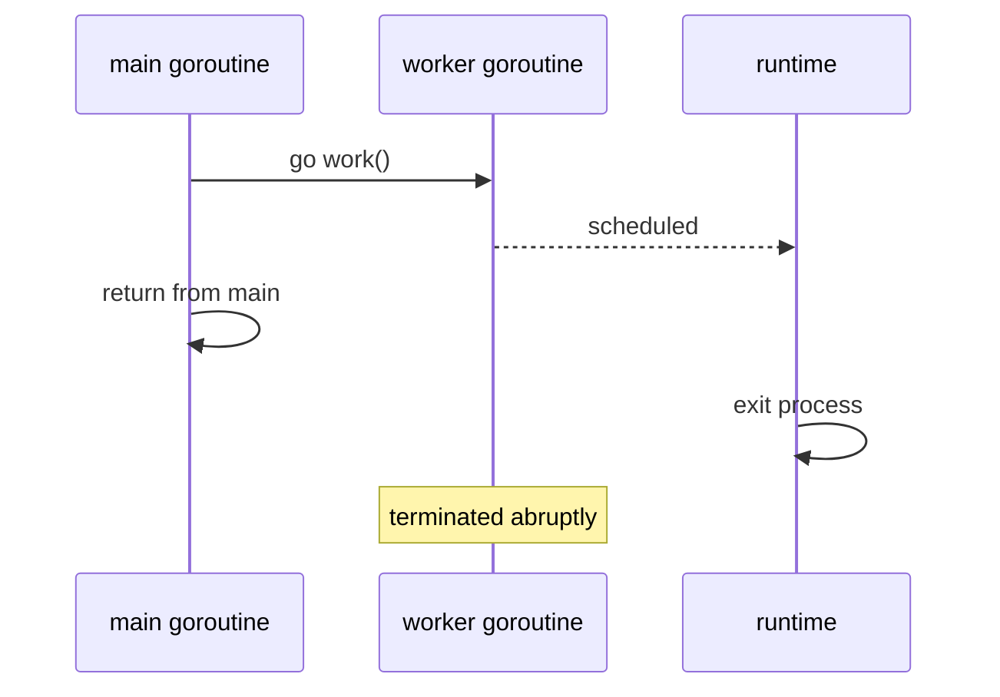

# Goroutines — Junior Level

## Table of Contents
1. [Introduction](#introduction)
2. [Prerequisites](#prerequisites)
3. [Glossary](#glossary)
4. [Core Concepts](#core-concepts)
5. [Real-World Analogies](#real-world-analogies)
6. [Mental Models](#mental-models)
7. [Pros & Cons](#pros--cons)
8. [Use Cases](#use-cases)
9. [Code Examples](#code-examples)
10. [Coding Patterns](#coding-patterns)
11. [Clean Code](#clean-code)
12. [Product Use / Feature](#product-use--feature)
13. [Error Handling](#error-handling)
14. [Security Considerations](#security-considerations)
15. [Performance Tips](#performance-tips)
16. [Best Practices](#best-practices)
17. [Edge Cases & Pitfalls](#edge-cases--pitfalls)
18. [Common Mistakes](#common-mistakes)
19. [Common Misconceptions](#common-misconceptions)
20. [Tricky Points](#tricky-points)
21. [Test](#test)
22. [Tricky Questions](#tricky-questions)
23. [Cheat Sheet](#cheat-sheet)
24. [Self-Assessment Checklist](#self-assessment-checklist)
25. [Summary](#summary)
26. [What You Can Build](#what-you-can-build)
27. [Further Reading](#further-reading)
28. [Related Topics](#related-topics)
29. [Diagrams & Visual Aids](#diagrams--visual-aids)

---

## Introduction
> Focus: "What is a goroutine? How do I start one? Why does my program exit before it finishes?"

A **goroutine** is the smallest unit of independent execution in a Go program. You start one by writing the keyword `go` in front of a function call:

```go
go doWork()
```

That single line is the gateway to all of Go's concurrency. The function `doWork` no longer runs in sequence with the rest of your code — it runs *alongside* it. The Go runtime takes care of scheduling, stack management, and multiplexing it onto the machine's CPU cores.

Two facts make goroutines special and worth learning carefully:

1. They are **cheap**. A goroutine starts life with a stack of about 2 KB. Spawning a million of them on a normal laptop is realistic. By contrast, an OS thread typically costs 1–8 MB of stack.
2. They are **managed by the Go runtime, not by the operating system**. Many goroutines share a small pool of OS threads. The Go scheduler decides which goroutine runs on which thread, when, and for how long.

After reading this file you will:

- Know what a goroutine is and how to start one
- Understand the relationship between the main goroutine and spawned goroutines
- Know why your program "skips" goroutines and how to wait for them
- Recognise the most common first-time bug — the captured loop variable
- Have a feel for `sync.WaitGroup`, the simplest coordination tool
- Know the keywords `runtime.NumGoroutine`, `runtime.GOMAXPROCS`, and `runtime.Gosched`
- Understand that a panic in a goroutine kills the whole program

You do not need to know about channels in depth, the GMP scheduler, work-stealing, or async preemption yet. Those come at the middle, senior, and professional levels. This file is about the moment you write `go f()` and a new path of execution comes alive.

---

## Prerequisites

- **Required:** A Go installation, version 1.18 or newer (1.21+ recommended). Check with `go version`.
- **Required:** Comfort writing and running a `main` function. You should be able to compile a `hello.go` and run it.
- **Required:** Familiarity with functions, function values, and closures. The line `go func() { ... }()` is an immediately-invoked function literal.
- **Helpful:** Awareness that modern computers have multiple CPU cores. You do not need to know how schedulers work.
- **Helpful:** Some experience with at least one form of concurrency in another language (threads, async/await, callbacks). Not required.

If `go run hello.go` works on your machine and you can write a closure that captures a variable, you are ready.

---

## Glossary

| Term | Definition |
|------|-----------|
| **Goroutine** | A function executing concurrently with other goroutines in the same address space, scheduled by the Go runtime. Started with the `go` keyword. |
| **Main goroutine** | The single goroutine that runs `main()`. When it returns, the whole program exits — even if other goroutines are still running. |
| **`go` keyword** | The Go statement that starts a new goroutine. Syntax: `go FunctionCall(args)`. The call must be a function call, not an arbitrary expression. |
| **Concurrency** | Multiple tasks making progress over the same time interval. Different from *parallelism*, which is multiple tasks running at the *exact same instant* on different cores. Goroutines give you concurrency; the runtime turns it into parallelism when cores are available. |
| **Stack** | The per-goroutine memory area for local variables and function-call frames. Starts at ~2 KB and grows as needed up to a configurable limit (1 GB by default on 64-bit). |
| **Scheduler** | The Go runtime component that picks which goroutine runs on which OS thread. Implemented in `runtime/proc.go`. |
| **OS thread** | A heavyweight unit of execution managed by the operating system. Go multiplexes many goroutines onto a small pool of OS threads. |
| **`GOMAXPROCS`** | The maximum number of OS threads that may execute goroutines simultaneously. Defaults to the number of CPU cores. |
| **Goroutine leak** | A goroutine that is started but never exits, holding memory and resources forever. The most common goroutine bug. |
| **`runtime.Gosched()`** | A hint to the scheduler: "I am willing to give up the CPU now." Rarely needed in modern Go. |
| **`runtime.NumGoroutine()`** | Returns the current number of running goroutines. Useful for detecting leaks. |
| **`sync.WaitGroup`** | The simplest tool for "wait until N goroutines have finished." A counter with `Add`, `Done`, `Wait` methods. |

---

## Core Concepts

### A goroutine is "the rest of this function, on its own"

The mental shortcut: when you write `go f()`, the Go runtime takes the call to `f`, packages it into its own scheduled unit, and starts running it. The line that follows `go f()` runs *immediately*, without waiting.

```go
package main

import "fmt"

func main() {
    fmt.Println("before")
    go fmt.Println("inside goroutine")
    fmt.Println("after")
}
```

A naive expectation: "before / inside goroutine / after". The actual output, most of the time, on most machines:

```
before
after
```

The "inside goroutine" line never prints because the main goroutine reached the end of `main` and the program exited before the spawned goroutine had a chance to run. **When the main goroutine returns, the program ends, regardless of other goroutines.**

### The main goroutine is special

Every Go program starts with exactly one goroutine — the **main goroutine**, which runs the `main()` function. From there, you can spawn as many additional goroutines as you like.

Important rule: when `main()` returns, the entire program shuts down. The runtime does not wait for spawned goroutines to finish. This is by design and is the source of the most frequent first-time confusion: "my goroutine never ran."

To make a goroutine run to completion, the main goroutine must wait for it. The simplest tools are `sync.WaitGroup` and channels (covered in detail in the channels section).

### Goroutines run "concurrently," not necessarily in parallel

If you spawn 100 goroutines on a 4-core laptop with `GOMAXPROCS=4`, only 4 of them are running on hardware at any given instant. The other 96 are paused, waiting for their turn. The Go scheduler rotates them on and off the available threads.

If `GOMAXPROCS=1`, only one goroutine runs at a time, but they still take turns. Concurrency is about *interleaving*, not necessarily *simultaneity*.

### The `go` keyword wants a function call, not a statement

This is a syntax detail beginners often miss. `go` must be followed by a function call:

```go
go f()              // OK — function call
go obj.Method(x)    // OK — method call
go func() {         // OK — call to a function literal
    work()
}()
go f                // ERROR — f is not a call, it is a value
go { work() }       // ERROR — block is not a call
```

The arguments to the function are evaluated *before* the goroutine starts, in the calling goroutine. This subtle rule matters when you pass loop variables (see Common Mistakes).

### Goroutines are cheap, but not free

Each goroutine costs around 2 KB of stack initially, plus a few hundred bytes of internal bookkeeping. A million goroutines fits in roughly 2–4 GB of memory, depending on stack growth. Compare that to a million OS threads, which would not fit on most machines.

That said, "cheap" is not "free." Spawning a goroutine for every byte of input or every database row is wasteful. Goroutines pay off when each one does meaningful work — a request, a connection, a chunk of CPU-bound computation.

### A goroutine that panics kills the whole program

If any goroutine panics and the panic is not recovered inside that goroutine, the runtime terminates the entire process. This is not a bug; it is the explicit design. Recovery in goroutine A does not help goroutine B.

```go
go func() {
    defer func() {
        if r := recover(); r != nil {
            log.Println("recovered:", r)
        }
    }()
    risky()
}()
```

Each goroutine that runs untrusted or fragile code should install its own `recover`.

---

## Real-World Analogies

### Goroutines are like restaurant servers

A restaurant has 4 cooks (CPU cores). It has 50 tables (goroutines). The maître d' (Go scheduler) assigns each table to a cook for a few minutes at a time. When a cook finishes one course for table 7 and the order ticket says "next course in 20 minutes," that cook moves to table 12 instead of standing idle. Each table feels attended to even though there are far more tables than cooks.

### Goroutines are like browser tabs

A browser opens 30 tabs. Each tab feels independent — clicking one does not freeze another. Behind the scenes the browser multiplexes them onto a few processes and threads. Goroutines work the same way: many of them, few underlying threads.

### Goroutines are like recipes shouted into a kitchen

You shout `go bakeBread()` and walk away. The kitchen will get to it. Whether it actually finishes depends on whether you ever go check, or whether you close the kitchen before it's done. If you close the kitchen — return from `main` — half-baked bread does not finish.

### OS threads are mainframes, goroutines are virtual machines

OS threads carry heavy baggage: kernel state, large stacks, expensive context switches. Goroutines are user-space, lightweight, and switched by the Go runtime in nanoseconds rather than microseconds. The OS thread is the mainframe; goroutines are the small VMs running on top.

---

## Mental Models

### Model 1: "Schedule" not "thread"

Stop thinking "goroutine = thread." Think "goroutine = unit of work that the runtime will eventually run on some thread, possibly more than one thread over its lifetime, possibly preempted at any time." This shift matters because:

- A goroutine can move between OS threads. It is not pinned.
- A goroutine that blocks on I/O does not block its OS thread; the runtime parks the goroutine and reuses the thread.
- The cost of "starting" a goroutine is the cost of pushing a small struct onto a runqueue, not the cost of asking the OS for a thread.

### Model 2: "The runtime is your bouncer"

When you write `go f()`, you are telling the runtime: "f wants to run, please get to it when you can." You are not creating a thread. You are queueing a job. The bouncer (scheduler) decides who gets in and when.

### Model 3: "Goroutines are cheap until they aren't"

The marketing pitch is "spawn millions." That is technically true but practically misleading. Each leaked goroutine pins:

- ~2 KB of memory (stack).
- The closure captured by `go func() { ... }()`, including any heap pointers.
- Any OS resources the goroutine holds (open files, sockets, locks).

A million leaked goroutines is a 2 GB memory leak, plus whatever they were holding. Goroutines are cheap *to start*, expensive *to leak*.

### Model 4: "main() is the parent, but doesn't know its children"

The main goroutine has no notion of "children." There is no PID hierarchy, no wait-for-children API. If you want to wait, you build the wait yourself with `sync.WaitGroup`, channels, or `context.Context`. The runtime offers no defaults.

---

## Pros & Cons

### Pros

- **Cheap to spawn.** Allocating a goroutine costs roughly the same as allocating a small struct. You can have hundreds of thousands without breaking a sweat.
- **Simple syntax.** One keyword (`go`) versus the elaborate machinery of `Thread`, `Executor`, `async/await`, or `Promise.all` in other languages.
- **Cooperative with I/O.** A goroutine that calls `net.Conn.Read` is parked by the runtime while waiting; the OS thread is freed to run other goroutines.
- **Stacks grow on demand.** You do not pre-allocate a 1 MB stack "just in case." You start with 2 KB and grow only if needed.
- **Compose well with channels.** Communication between goroutines via channels is a first-class language feature, not a library.
- **Native to the language.** No external concurrency library is needed. The runtime, the scheduler, the GC, and the network poller all integrate.

### Cons

- **Easy to leak.** A goroutine that waits on a channel that is never closed, or that loops forever, will hang around for the lifetime of the program.
- **Panics are dangerous.** A panic in any goroutine, if not recovered locally, terminates the whole program. There is no "child process" isolation.
- **No identity.** There is no goroutine ID API, no name, and no way to interrupt a specific goroutine from outside (you must coordinate via channels or `context.Context`).
- **Shared memory by default.** Two goroutines that touch the same variable without synchronisation cause data races. The compiler does not prevent this; you must use mutexes, atomics, or channels.
- **Stack growth has a cost.** When a goroutine's stack overflows its current size, the runtime allocates a bigger stack and copies the old one. Cheap but not free.
- **Hard to reason about.** "Did this code run? In what order? Is the result visible?" — these questions require explicit synchronisation answers.

---

## Use Cases

| Scenario | Why goroutines help |
|---|---|
| Web server handling many requests | One goroutine per request scales to tens of thousands of concurrent clients without OS thread exhaustion. |
| Parallel CPU-bound computation | Split work across `GOMAXPROCS` goroutines to use all cores. |
| Background jobs and timers | Spawn a goroutine that sleeps and periodically fires (logging rotation, metrics flush). |
| Fan-out to multiple downstreams | Send the same query to N services in parallel, take the first answer. |
| Pipeline stages | Each stage runs as a goroutine, connected to the next by a channel. |
| I/O multiplexing | Read from many sockets concurrently without manual `select`/`epoll`. |

| Scenario | Why goroutines do *not* help |
|---|---|
| One-shot, single-threaded scripts | The overhead of coordination is more than the work. Just call the function. |
| Reading or writing a single file end-to-end | I/O ordering matters; one goroutine is easier and faster. |
| Tight CPU-bound loop on a single core | A single goroutine on a single thread is the fastest. Spawning more just adds scheduler overhead. |
| Replacing function calls "to make them faster" | A goroutine is not magic. It is concurrency. If there is no concurrent work, there is no win. |

---

## Code Examples

### Example 1: The "Hello, goroutine" trap

```go
package main

import "fmt"

func main() {
    go fmt.Println("hello from goroutine")
    fmt.Println("hello from main")
}
```

Output: usually only `hello from main`. The main goroutine returns before the spawned goroutine runs.

### Example 2: Forcing the goroutine to run with `time.Sleep`

```go
package main

import (
    "fmt"
    "time"
)

func main() {
    go fmt.Println("hello from goroutine")
    fmt.Println("hello from main")
    time.Sleep(100 * time.Millisecond)
}
```

Output: both lines, in unpredictable order. **Never use `time.Sleep` to coordinate goroutines in real code.** It is shown here only to illustrate the lifecycle.

### Example 3: Coordinating with `sync.WaitGroup`

```go
package main

import (
    "fmt"
    "sync"
)

func main() {
    var wg sync.WaitGroup
    wg.Add(1)
    go func() {
        defer wg.Done()
        fmt.Println("hello from goroutine")
    }()
    fmt.Println("hello from main")
    wg.Wait()
}
```

Both lines always print. The `WaitGroup` counter starts at 1, the goroutine calls `Done()` on exit (decrementing to 0), and `Wait()` blocks until the counter reaches 0.

### Example 4: Multiple workers

```go
package main

import (
    "fmt"
    "sync"
)

func worker(id int, wg *sync.WaitGroup) {
    defer wg.Done()
    fmt.Printf("worker %d starting\n", id)
    fmt.Printf("worker %d done\n", id)
}

func main() {
    var wg sync.WaitGroup
    for i := 1; i <= 5; i++ {
        wg.Add(1)
        go worker(i, &wg)
    }
    wg.Wait()
    fmt.Println("all workers finished")
}
```

The order in which the 5 workers report "starting" and "done" is unpredictable. The order in which `wg.Wait()` returns is deterministic: only after all five `Done()` calls.

### Example 5: A function literal that captures the loop variable (BUG IN GO < 1.22)

```go
package main

import (
    "fmt"
    "sync"
)

func main() {
    var wg sync.WaitGroup
    for i := 0; i < 5; i++ {
        wg.Add(1)
        go func() {
            defer wg.Done()
            fmt.Println(i) // BUG before Go 1.22
        }()
    }
    wg.Wait()
}
```

In Go versions before 1.22, all five goroutines share the same `i`, and by the time they run, `i == 5`. Output: `5 5 5 5 5` (in some order).

In Go 1.22+, each iteration of `for ... range` and `for i := ...` gets a fresh `i`. Output: some permutation of `0 1 2 3 4`.

### Example 6: The fix that works in every Go version

```go
for i := 0; i < 5; i++ {
    wg.Add(1)
    go func(i int) {       // i is now a parameter
        defer wg.Done()
        fmt.Println(i)
    }(i)                   // pass i explicitly
}
```

Each goroutine gets its own copy of `i` as a parameter. Output: some permutation of `0 1 2 3 4`, on every Go version since 1.0.

### Example 7: Counting goroutines

```go
package main

import (
    "fmt"
    "runtime"
    "sync"
)

func main() {
    fmt.Println("before:", runtime.NumGoroutine()) // 1 (main)
    var wg sync.WaitGroup
    for i := 0; i < 100; i++ {
        wg.Add(1)
        go func() {
            defer wg.Done()
            // do nothing, just exist briefly
        }()
    }
    fmt.Println("during:", runtime.NumGoroutine()) // up to 101
    wg.Wait()
    fmt.Println("after:", runtime.NumGoroutine())  // back to ~1
}
```

`runtime.NumGoroutine()` returns the total live goroutines, including the main goroutine and any background goroutines (such as the GC worker).

### Example 8: Panic in a goroutine

```go
package main

import (
    "fmt"
    "time"
)

func main() {
    go func() {
        panic("boom")
    }()
    time.Sleep(time.Second)
    fmt.Println("never printed")
}
```

The unrecovered panic terminates the entire process. The `fmt.Println("never printed")` line is not reached.

### Example 9: Recovering inside the goroutine

```go
go func() {
    defer func() {
        if r := recover(); r != nil {
            fmt.Println("recovered:", r)
        }
    }()
    panic("boom")
}()
```

Now the goroutine prints `recovered: boom` and exits cleanly; the rest of the program continues.

### Example 10: GOMAXPROCS and parallelism

```go
package main

import (
    "fmt"
    "runtime"
    "sync"
)

func main() {
    fmt.Println("default GOMAXPROCS:", runtime.GOMAXPROCS(0))
    runtime.GOMAXPROCS(1) // force single-threaded execution
    var wg sync.WaitGroup
    for i := 0; i < 4; i++ {
        wg.Add(1)
        go func(id int) {
            defer wg.Done()
            for j := 0; j < 3; j++ {
                fmt.Printf("goroutine %d, iter %d\n", id, j)
            }
        }(i)
    }
    wg.Wait()
}
```

With `GOMAXPROCS=1`, the four goroutines time-share one OS thread. The runtime preempts them between iterations (Go 1.14+ async preemption), so output is interleaved but no goroutine starves.

---

## Coding Patterns

### Pattern 1: Fire-and-forget

Use when the result does not matter and the work must outlive the caller's frame.

```go
go logEvent(evt)
```

Risk: if `logEvent` blocks forever, you have leaked a goroutine. Pair with a timeout or `context.Context`.

### Pattern 2: Spawn-and-wait

Use when you need parallel work and a join.

```go
var wg sync.WaitGroup
for _, item := range items {
    wg.Add(1)
    go func(item Item) {
        defer wg.Done()
        process(item)
    }(item)
}
wg.Wait()
```

This is the workhorse. Most "do these N things in parallel" code looks like this.

### Pattern 3: Worker pool

Use when you have many items but want to bound concurrency.

```go
const workers = 8
jobs := make(chan Item, 100)
var wg sync.WaitGroup

for i := 0; i < workers; i++ {
    wg.Add(1)
    go func() {
        defer wg.Done()
        for item := range jobs {
            process(item)
        }
    }()
}

for _, item := range items {
    jobs <- item
}
close(jobs)
wg.Wait()
```

Bounds memory and CPU pressure. Channels are covered in the next section, but the pattern is fundamental.

### Pattern 4: Goroutine with cancellation

Use when the goroutine must stop on demand.

```go
done := make(chan struct{})
go func() {
    for {
        select {
        case <-done:
            return
        default:
            tick()
        }
    }
}()
// ... later ...
close(done)
```

Cleaner alternative: `context.Context` (covered later). The principle is the same.

---

## Clean Code

- **Always know how a goroutine will exit.** If you cannot answer "when does this goroutine return?" you have a leak waiting to happen.
- **Pass values as parameters, not via closure capture.** The captured-loop-variable bug is the most common Go concurrency bug. Make every value the goroutine reads explicit.
- **Pair `Add` and `Done`.** Call `wg.Add` *before* `go`, not inside the goroutine. The classic bug is `go func() { wg.Add(1); defer wg.Done(); ... }()` — `Wait` may run before `Add` and miss the goroutine entirely.
- **Use `defer wg.Done()`.** Putting the `Done` at the top of the goroutine with `defer` guarantees it runs even on panic.
- **Wrap risky work with `recover`.** If the goroutine runs untrusted code or third-party callbacks, defend the entire process with a `recover` block.
- **Prefer named functions over deeply nested closures.** A 50-line `go func() { ... }()` is hard to test. Extract to `go processItem(item)`.

---

## Product Use / Feature

| Product feature | How goroutines deliver it |
|---|---|
| HTTP API server (Gin, Echo, net/http) | Each request handler runs in its own goroutine — so one slow request never blocks another. |
| Background email sender | A goroutine reads from a queue and sends asynchronously; the API responds to the user immediately. |
| Crawler / scraper | Spawn N goroutines reading URLs concurrently from a channel; bounded by N to avoid thrashing the target site. |
| Live metric collector | A goroutine ticks every second and pushes counters to Prometheus. |
| Real-time game server | One goroutine per player connection, plus a tick goroutine for world simulation. |
| ETL pipeline | Each stage (read / transform / write) is a goroutine; channels carry rows between them. |

---

## Error Handling

Goroutines complicate error handling because **a function spawned with `go` cannot return a value to its caller.** The frame is gone. So the question becomes: how does the result, success or failure, propagate?

Three common approaches:

### 1. Send the error back via a channel

```go
errCh := make(chan error, 1)
go func() {
    errCh <- doWork()
}()
if err := <-errCh; err != nil {
    log.Fatal(err)
}
```

Buffered channel of capacity 1 avoids leaking the goroutine if no one ever reads.

### 2. Use `errgroup.Group` (from `golang.org/x/sync/errgroup`)

```go
import "golang.org/x/sync/errgroup"

var g errgroup.Group
for _, url := range urls {
    url := url
    g.Go(func() error { return fetch(url) })
}
if err := g.Wait(); err != nil {
    log.Fatal(err)
}
```

Cleaner than juggling channels; covered in detail at middle level.

### 3. Recover inside the goroutine and report

```go
go func() {
    defer func() {
        if r := recover(); r != nil {
            log.Printf("worker panic: %v", r)
        }
    }()
    risky()
}()
```

Necessary at the boundary of the goroutine — never let a panic escape into the runtime.

---

## Security Considerations

- **Panic = process exit.** A malicious or unhandled input that triggers a `nil` dereference inside a request-handling goroutine takes down every concurrent request. Always recover at the boundary.
- **Resource exhaustion.** Spawning one goroutine per untrusted input is a denial-of-service vector. A million crafted requests can exhaust memory if each spawns a goroutine that waits on something. Bound concurrency with a worker pool or a semaphore.
- **Data races as security bugs.** A race on an authentication token, a session cookie, or a permissions check can briefly grant the wrong privilege. Always synchronise access to shared state. Run with `-race` in CI.
- **Goroutine leaks as observability holes.** A leaked goroutine that holds onto a request body, a TLS session, or a database transaction silently bloats memory and may also extend the lifetime of sensitive data beyond its intended scope.

---

## Performance Tips

- **Do not spawn a goroutine for every byte of input.** If the work per goroutine is shorter than the cost of scheduling (~hundreds of nanoseconds), you lose.
- **Match `GOMAXPROCS` to CPU cores for CPU-bound work.** That is the default since Go 1.5; do not lower it without reason.
- **For I/O-bound work, far more goroutines than cores is fine.** A web server handling 50 000 idle WebSocket connections via 50 000 goroutines is normal.
- **Avoid busy-wait loops.** A `for { select { default: } }` loop pegs a core for nothing. Always block on channel receive or `time.Sleep`.
- **Re-use goroutines via pools** when the work is short and arrivals are frequent. Spawning 100 000 short-lived goroutines per second is much more expensive than running a pool of 10 worker goroutines that each handle 10 000 jobs.

Detailed numbers and benchmarks are in the senior and professional levels.

---

## Best Practices

1. Always have a clear exit condition for every goroutine you start.
2. Always coordinate completion with `sync.WaitGroup`, `errgroup`, or a channel — never with `time.Sleep`.
3. Always pass loop variables as parameters into the goroutine.
4. Always recover at the boundary if the work can panic on bad input.
5. Always run `go test -race` in CI to catch data races early.
6. Prefer `context.Context` for cancellation across many goroutines.
7. Bound concurrency with a worker pool when input is unbounded.
8. Treat `runtime.NumGoroutine` increasing forever as a fire alarm, not a curiosity.
9. Use buffered channels of size 1 for "send the result and exit" patterns to prevent leaks.
10. Keep the spawning code and the joining code in the same function when possible — it makes lifetime visible.

---

## Edge Cases & Pitfalls

### `wg.Add(1)` inside the goroutine

```go
go func() {
    wg.Add(1)            // BUG
    defer wg.Done()
    work()
}()
wg.Wait()                // may return before Add runs
```

Fix: call `wg.Add(1)` in the parent before `go`.

### Goroutine reads a closed channel forever

```go
go func() {
    for v := range ch {
        process(v)
    }
}()
```

If `ch` is never closed, the goroutine blocks forever — leak. Always have a close path or a cancellation channel.

### `time.Sleep` to wait for "everything"

```go
go work1()
go work2()
time.Sleep(time.Second) // hope they finish
```

On a slow CI machine they will not. Use `WaitGroup`.

### Goroutine that never reads a buffered result channel

```go
ch := make(chan int)         // unbuffered
go func() {
    ch <- compute()           // blocks if no one reads
}()
// caller exits without reading ch — leak
```

Fix: `make(chan int, 1)` or guarantee a read.

### Panic in a goroutine kills the program

A Go `recover` only catches a panic in *its own* goroutine. Wrap the goroutine body in a `defer recover()` if it can panic.

### Closing over the loop variable (Go < 1.22)

Already covered. Always pass loop variables as parameters in code that needs to compile across all Go versions.

### Returning a goroutine's result via a closure

```go
var result int
go func() { result = compute() }()
log.Println(result) // race + always reads 0
```

Fix: send via channel, or wait with `WaitGroup` and read after the wait.

---

## Common Mistakes

| Mistake | Fix |
|---|---|
| Forgetting `wg.Add(1)` before `go` | Always pair `wg.Add(1)` in the parent with `defer wg.Done()` in the goroutine. |
| Using `time.Sleep` to "synchronise" goroutines | Use `WaitGroup`, channels, or `context`. |
| Capturing the loop variable | Pass as a parameter to the function literal. |
| Unrecovered panic in a worker goroutine | Wrap with `defer func(){ if r:=recover(); r!=nil { log... } }()`. |
| Calling `wg.Wait()` from inside a goroutine that is itself counted by the same `wg` | Self-deadlock. The `Wait` waits for itself. |
| Sharing a `[]byte` between goroutines without copying | Race or corruption. Make a copy or synchronise. |
| Spawning a goroutine in a request handler that outlives the request | Holds request memory forever. Use `context.Context` to cancel. |

---

## Common Misconceptions

> *"A goroutine is a thread."* — No. A goroutine is a unit of work scheduled onto threads by the Go runtime. The OS does not know about it.

> *"`go f()` creates parallelism."* — It creates concurrency. Whether two goroutines run in parallel depends on `GOMAXPROCS` and on whether both are runnable simultaneously.

> *"Goroutines are free."* — Cheap, not free. Each goroutine costs ~2 KB plus closure heap allocations plus scheduler bookkeeping. A million goroutines is real memory.

> *"`go f()` returns when `f` returns."* — `go f()` returns *immediately*, before `f` does anything. The goroutine runs in the background.

> *"Spawning a goroutine is faster than calling a function."* — No. It is much slower. Use goroutines for concurrency, not micro-optimisation.

> *"I can get a goroutine ID to track it."* — No public API. The runtime maintains an internal ID, but it is intentionally not exposed.

> *"`runtime.Gosched()` is the way to yield."* — Rarely needed in modern Go. The scheduler preempts goroutines automatically (Go 1.14+).

> *"A panic in a goroutine only crashes that goroutine."* — Wrong. Unrecovered panics terminate the entire process.

---

## Tricky Points

### Goroutine startup is asynchronous

```go
go f()
```

There is no guarantee `f` has *started* by the time the next line of the parent runs. `f` might not start for milliseconds. Do not rely on ordering between the parent and the new goroutine.

### Argument evaluation happens in the parent

```go
go f(getValue())
```

`getValue()` runs in the *parent* goroutine, *before* the new goroutine starts. If `getValue()` blocks, `go f(...)` blocks. The "asynchronous" part is `f`'s body.

### `runtime.Gosched` does not deschedule, just yields

A call to `runtime.Gosched()` allows other goroutines to run if any are ready, but the calling goroutine resumes shortly after. It is not "park me until something happens." For that, block on a channel, mutex, or system call.

### `GOMAXPROCS(1)` does not stop concurrency, only parallelism

With one OS thread allowed for goroutine execution, multiple goroutines still take turns. They are still concurrent. Most concurrent bugs reproduce just as well at `GOMAXPROCS=1`.

### A receive on a `nil` channel blocks forever

```go
var ch chan int
<-ch  // blocks forever
```

A goroutine that does this is leaked. The `nil`-channel trick is sometimes used intentionally to "disable" a `select` case, but if you reach it accidentally, it is silent.

### `recover` only works in `defer`

```go
go func() {
    if r := recover(); r != nil { // useless — outside defer
        ...
    }
    panic("oops")
}()
```

`recover` returns `nil` unless called inside a `defer`-ed function during a panic.

---

## Test

```go
// goroutines_basic_test.go
package goroutines_test

import (
    "sync"
    "sync/atomic"
    "testing"
)

func TestSpawnAndWait(t *testing.T) {
    var counter int64
    var wg sync.WaitGroup
    for i := 0; i < 100; i++ {
        wg.Add(1)
        go func() {
            defer wg.Done()
            atomic.AddInt64(&counter, 1)
        }()
    }
    wg.Wait()
    if counter != 100 {
        t.Fatalf("expected 100, got %d", counter)
    }
}

func TestGoroutineExit(t *testing.T) {
    done := make(chan struct{})
    go func() { close(done) }()
    <-done // pass if reached, fail if blocked forever
}
```

Run with the race detector:

```bash
go test -race ./...
```

The race detector instruments memory accesses and reports any unsynchronised access. It catches the vast majority of beginner concurrency bugs.

---

## Tricky Questions

**Q.** What does this print?

```go
for i := 0; i < 3; i++ {
    go func() { fmt.Println(i) }()
}
time.Sleep(time.Second)
```

**A.** Pre-Go 1.22: usually `3 3 3`. Go 1.22+: some permutation of `0 1 2`. The captured loop variable changed semantics in 1.22.

---

**Q.** What is wrong with this code?

```go
ch := make(chan int)
go func() { ch <- 42 }()
fmt.Println(<-ch)
fmt.Println(<-ch)
```

**A.** The second `<-ch` blocks forever — the goroutine sent only one value. Deadlock. The runtime detects it and panics with "all goroutines are asleep".

---

**Q.** Why does this leak a goroutine?

```go
func leak() {
    ch := make(chan int)
    go func() { ch <- compute() }()
    if condition { return } // never reads ch
    fmt.Println(<-ch)
}
```

**A.** If `condition` is true, the function returns without reading `ch`. The goroutine is stuck sending to a channel no one will ever receive from. It lives until program exit.

Fix: use a buffered channel `make(chan int, 1)` so the send completes regardless.

---

**Q.** What is `runtime.Gosched()` good for?

**A.** Hinting to the scheduler that you are willing to give up the CPU. Rarely needed in modern Go because the scheduler preempts goroutines automatically (since 1.14). Sometimes used in tight loops that do not perform any function call to ensure preemption — but in 1.14+ even those loops are preemptable.

---

**Q.** How many goroutines does a "Hello, World!" Go program have?

**A.** At least 2: the main goroutine and the GC sweeper. With more inspection (and depending on Go version), you might also see goroutines for the network poller, the runtime monitor (`sysmon`), and the pprof handler.

---

## Cheat Sheet

```go
// Spawn
go f(args)
go func() { ... }()

// Wait for one or more
var wg sync.WaitGroup
wg.Add(N)
go func() { defer wg.Done(); ... }()
wg.Wait()

// Pass values, never capture loop variables (pre-1.22)
for _, x := range items {
    go func(x Item) { process(x) }(x)
}

// Recover at the boundary
go func() {
    defer func() { if r := recover(); r != nil { log.Println(r) } }()
    risky()
}()

// Count and inspect
n := runtime.NumGoroutine()
runtime.GOMAXPROCS(0) // returns current value

// Yield (rarely needed)
runtime.Gosched()
```

---

## Self-Assessment Checklist

- [ ] I can explain what a goroutine is in one sentence.
- [ ] I know what happens to spawned goroutines when `main` returns.
- [ ] I can write a `go func() { ... }()` that uses a `WaitGroup` correctly.
- [ ] I know why capturing a loop variable in a closure is dangerous (and why it changed in 1.22).
- [ ] I know that an unrecovered panic in any goroutine kills the whole program.
- [ ] I know `runtime.NumGoroutine()` and `runtime.GOMAXPROCS()` and what each returns.
- [ ] I can describe at least three ways a goroutine can leak.
- [ ] I know the difference between concurrency and parallelism.
- [ ] I know that arguments to `go f(x)` are evaluated in the parent goroutine, before `f` runs.
- [ ] I have run `go test -race` on at least one piece of my own concurrent code.

---

## Summary

A goroutine is a function call prefixed with `go`. The Go runtime takes the call, schedules it onto an OS thread, and lets it run alongside the caller. Goroutines are cheap (~2 KB stacks), fast to create, and built for the use case "do many things concurrently."

But cheap is not free. The main goroutine ending kills the program. Panics propagate to process termination. Captured loop variables snare beginners. Goroutines that wait on never-closed channels leak. Coordination is *your* job — the runtime offers `sync.WaitGroup`, `errgroup`, channels, and `context.Context`, and you must use them.

You are now equipped to write your first concurrent Go programs: spawn a goroutine, wait with `WaitGroup`, recover panics at the boundary, and avoid the captured-variable trap. The next step is **channels** — Go's primary mechanism for goroutines to communicate.

---

## What You Can Build

After mastering this material:

- A concurrent prime sieve that spawns one goroutine per filter stage.
- A web crawler with bounded concurrency that fetches N URLs in parallel.
- A small HTTP API where each handler runs in its own goroutine.
- A worker pool that consumes jobs from a channel and writes results to another.
- A periodic background task that ticks every second without blocking `main`.
- A simple parallel `map` over a slice, joining results with `WaitGroup`.

---

## Further Reading

- The Go Programming Language Specification — *Go statements*: <https://go.dev/ref/spec#Go_statements>
- Effective Go — *Goroutines*: <https://go.dev/doc/effective_go#goroutines>
- The Go Blog — *Concurrency is not parallelism*: <https://go.dev/blog/waza-talk>
- The Go Blog — *Share Memory By Communicating*: <https://go.dev/blog/codelab-share>
- *Go Concurrency Patterns* (Rob Pike, Google I/O): <https://www.youtube.com/watch?v=f6kdp27TYZs>
- The race detector: <https://go.dev/doc/articles/race_detector>

---

## Related Topics

- [Channels](../02-channels/) — the canonical way for goroutines to communicate
- [`select` statement](../03-select/) — multiplexing multiple channel operations
- [`sync` package](../../05-error-handling/) — `WaitGroup`, `Mutex`, `Once`
- [`context` package](../05-context/) — cancellation across goroutine trees
- [Race detector](../../11-tooling/) — finding data races in tests

---

## Diagrams & Visual Aids

### Goroutine vs OS thread (memory)

```
OS thread:    [============= 1-8 MB stack =============] + kernel state
Goroutine:    [== 2 KB stack ==]                          (grows on demand)
```

### Many goroutines on few threads

```
                +--- OS thread M0 ---+    [G42] [G3] [G99]   <- runqueue
                |                    |       running: G42
                +--- OS thread M1 ---+    [G7]  [G15]
                |                    |       running: G7
                +--- OS thread M2 ---+    [G201] [G404] [G88]
                                            running: G201

   Goroutines:   {G3, G7, G15, G42, G88, G99, G201, G404, ...}
   The scheduler shifts them between threads as work becomes available.
```

### Lifecycle of a goroutine

```
   created  --[runqueue]-->  running  --[blocked? park]-->  waiting
                                 |                              |
                                 v                              v
                              exited                          ready
                                                                |
                                                                v
                                                           runnable -> ...
```

### What happens when `main` returns



### `WaitGroup` mental model

```
Add(3)         -> counter = 3
Done()         -> counter = 2
Done()         -> counter = 1
Wait()         -> blocks while counter > 0
Done()         -> counter = 0, Wait() unblocks
```

### Concurrency vs parallelism

```
Concurrency  : tasks make progress over time, possibly interleaved
                A B A B A B  (1 core, time-sliced)

Parallelism  : tasks make progress at the SAME instant
                A A A A A A  (core 1)
                B B B B B B  (core 2)
```

Goroutines give you concurrency. The runtime turns it into parallelism when `GOMAXPROCS > 1` and multiple goroutines are runnable.
