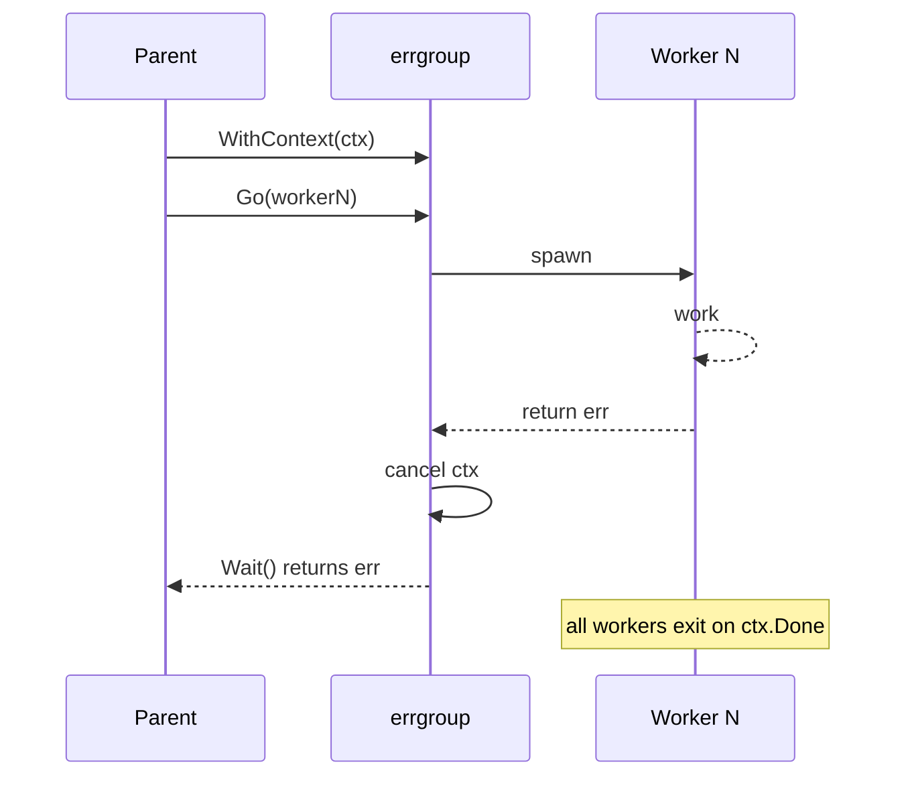

# Goroutine Best Practices — Junior Level

## Table of Contents
1. [Introduction](#introduction)
2. [Prerequisites](#prerequisites)
3. [Glossary](#glossary)
4. [The Canonical Rules](#the-canonical-rules)
5. [Rule 1 — Every Goroutine Has a Clear Exit Story](#rule-1--every-goroutine-has-a-clear-exit-story)
6. [Rule 2 — `wg.Add` in the Parent, `defer wg.Done` in the Goroutine](#rule-2--wgadd-in-the-parent-defer-wgdone-in-the-goroutine)
7. [Rule 3 — Pass Loop Variables as Parameters](#rule-3--pass-loop-variables-as-parameters)
8. [Rule 4 — Thread `context.Context` Through Long-Running Goroutines](#rule-4--thread-contextcontext-through-long-running-goroutines)
9. [Rule 5 — Recover Panics at the Goroutine Boundary](#rule-5--recover-panics-at-the-goroutine-boundary)
10. [Rule 6 — Prefer `errgroup` Over Hand-Rolled `WaitGroup`+`chan error`](#rule-6--prefer-errgroup-over-hand-rolled-waitgroupchan-error)
11. [Rule 7 — Channels for Flow, Mutexes for State](#rule-7--channels-for-flow-mutexes-for-state)
12. [Rule 8 — Never Use `time.Sleep` for Synchronisation](#rule-8--never-use-timesleep-for-synchronisation)
13. [Rule 9 — Run `go test -race` in CI](#rule-9--run-go-test--race-in-ci)
14. [Rule 10 — Bound Concurrency with Worker Pools](#rule-10--bound-concurrency-with-worker-pools)
15. [Rule 11 — Document Concurrency Safety on Exported Types](#rule-11--document-concurrency-safety-on-exported-types)
16. [Rule 12 — Use `pprof goroutine` and `goleak` for Leak Detection](#rule-12--use-pprof-goroutine-and-goleak-for-leak-detection)
17. [Real-World Analogies](#real-world-analogies)
18. [Mental Models](#mental-models)
19. [Pros & Cons](#pros--cons)
20. [Use Cases](#use-cases)
21. [Code Examples](#code-examples)
22. [Coding Patterns](#coding-patterns)
23. [Clean Code](#clean-code)
24. [Product Use / Feature](#product-use--feature)
25. [Error Handling](#error-handling)
26. [Security Considerations](#security-considerations)
27. [Performance Tips](#performance-tips)
28. [Best Practices Recap](#best-practices-recap)
29. [Edge Cases & Pitfalls](#edge-cases--pitfalls)
30. [Common Mistakes](#common-mistakes)
31. [Common Misconceptions](#common-misconceptions)
32. [Tricky Points](#tricky-points)
33. [Test](#test)
34. [Tricky Questions](#tricky-questions)
35. [Cheat Sheet](#cheat-sheet)
36. [Self-Assessment Checklist](#self-assessment-checklist)
37. [Summary](#summary)
38. [What You Can Build](#what-you-can-build)
39. [Further Reading](#further-reading)
40. [Related Topics](#related-topics)
41. [Diagrams & Visual Aids](#diagrams--visual-aids)

---

## Introduction
> Focus: "What are the rules that experienced Go developers follow when working with goroutines, and why?"

Spawning a goroutine is one keyword: `go`. Retiring one cleanly, propagating its result, killing it on shutdown, recovering its panic, bounding how many of them exist, and proving the absence of leaks — that is the rest of the work. The community has converged on a small set of rules that, if followed, prevent most production goroutine bugs. None of these rules are clever. They are the result of postmortems.

This file walks through each rule with three parts:

- **Rationale.** Why the rule exists, in one sentence.
- **Good example.** What the rule looks like applied.
- **Anti-example.** What the rule prevents, with the failure mode named.

The rules are sourced from Effective Go, the Uber Go style guide, the Google Go style guide, Dave Cheney's writing, the Go blog, and the lived experience of many teams. Where the sources disagree on emphasis, this file flags it.

After reading this you will:

- Recognise each rule on sight.
- Be able to defend any rule with a concrete failure scenario.
- Know which rules are non-negotiable (data races, leaks) and which are conventions (style of `Add`/`Done`).
- Have a self-review pass for every goroutine you write.

What this file does **not** cover at junior depth: the runtime mechanics that make the rules possible (scheduler, memory model), the cost model of breaking each rule at scale, and the deeper team conventions. Those live in middle, senior, and professional.

---

## Prerequisites

- **Required:** You have written at least one program with `go f()` and `sync.WaitGroup`.
- **Required:** You can read a `defer` statement and explain when the deferred call runs.
- **Required:** You know that goroutines share memory and that a data race is a bug.
- **Helpful:** Familiarity with `context.Context` at the user level (passing it through functions). Deep semantics are not needed here.
- **Helpful:** You have at least seen one production-shaped Go service (an HTTP server, a worker, a CLI tool that spawns goroutines).

If `go test` works on your machine and you have written `defer wg.Done()` at least once, you are ready.

---

## Glossary

| Term | Definition |
|------|-----------|
| **Goroutine leak** | A goroutine that the program no longer needs but that never exits, holding memory and possibly other resources. |
| **Exit story** | The plain-English answer to "how does this goroutine eventually return?" — a closed channel, a context cancel, a finite loop, etc. |
| **Captured loop variable** | A variable from the enclosing `for` loop referenced inside a goroutine closure. Pre-Go-1.22 it was a famous source of bugs. |
| **`errgroup`** | The type `errgroup.Group` from `golang.org/x/sync/errgroup`. A `WaitGroup` plus error propagation plus optional cancellation on first error. |
| **Worker pool** | A fixed number of long-lived goroutines that pull jobs off a shared channel. Bounds concurrency. |
| **Race detector** | A compile flag (`-race`) that instruments memory accesses and reports unsynchronised concurrent access at runtime. |
| **`goleak`** | A package (`go.uber.org/goleak`) that asserts no extra goroutines are alive at the end of a test. |
| **`pprof.SetGoroutineLabels`** | A runtime API that attaches `key=value` labels to a goroutine; the labels appear in goroutine profiles. |
| **Structured concurrency** | A discipline in which the lifetime of every spawned goroutine is bounded by a lexical scope (a function call), making leaks structurally impossible. |
| **Data race** | Two goroutines accessing the same memory location, at least one of which writes, without any happens-before relation. Undefined behaviour in Go. |

---

## The Canonical Rules

The twelve rules below are listed in roughly increasing order of subtlety. The first three are mechanical: forget them and you have an obvious bug. The middle four are about the right tool for the job. The last five are about scaling the discipline across a team and a codebase.

| # | Rule | Failure if broken |
|---|---|---|
| 1 | Every goroutine has a clear exit story | Goroutine leak |
| 2 | `wg.Add` in parent, `defer wg.Done` in goroutine | Race on `WaitGroup`, deadlock, or premature `Wait` return |
| 3 | Pass loop variables as parameters | All goroutines see the wrong value |
| 4 | Thread `context.Context` through long-running goroutines | Cannot cancel; leaks on shutdown |
| 5 | Recover panics at the goroutine boundary | One bad input crashes the whole process |
| 6 | Prefer `errgroup` over hand-rolled `WaitGroup`+`chan error` | Tedious, error-prone, misses cancellation |
| 7 | Channels for flow, mutexes for state | Wrong tool causes deadlocks or contention |
| 8 | Never use `time.Sleep` for synchronisation | Flaky tests, races, real bugs in slow environments |
| 9 | Run `go test -race` in CI | Data races slip into production |
| 10 | Bound concurrency with worker pools | Unbounded goroutines under load → OOM |
| 11 | Document concurrency safety on exported types | Callers misuse the API; hidden races |
| 12 | Use `pprof goroutine` and `goleak` for leak detection | Leaks accumulate silently |

Each rule has its own section. Read them in order; later rules assume earlier ones.

---

## Rule 1 — Every Goroutine Has a Clear Exit Story

**Rationale.** A goroutine that never returns is a leak. Memory, file descriptors, locks, and database connections it holds stay live for the lifetime of the program. Before writing `go`, you must be able to answer in one sentence: "this goroutine returns when X."

Acceptable exit stories:

- "It finishes its finite loop and returns."
- "It reads from a channel until the channel is closed."
- "It returns when `ctx.Done()` fires."
- "It returns when an error from a downstream call surfaces."

Unacceptable: "I assume it'll exit somehow." Or worse: "It runs for the lifetime of the program." That is not an exit story; it's a deferral.

### Good example

```go
func processBatch(ctx context.Context, items []Item) error {
    var wg sync.WaitGroup
    for _, item := range items {
        item := item
        wg.Add(1)
        go func() {
            defer wg.Done()
            // Exit story: finite work, then return.
            process(ctx, item)
        }()
    }
    wg.Wait()
    return nil
}
```

Every goroutine exits when `process` returns. `wg.Wait` proves it. The exit is bounded by the input size.

### Anti-example

```go
func handler(w http.ResponseWriter, r *http.Request) {
    go func() {
        // No exit story.
        for {
            doSomething()
        }
    }()
    w.WriteHeader(200)
}
```

Each request spawns a goroutine that runs forever. After 10 000 requests, you have 10 000 leaked goroutines. The fix is either to make the loop finite, to give it a `ctx.Done()` case, or to not start the goroutine at all.

**Failure mode.** Goroutine leak, slow memory growth, eventual OOM.

---

## Rule 2 — `wg.Add` in the Parent, `defer wg.Done` in the Goroutine

**Rationale.** `WaitGroup.Wait` may return as soon as the counter reaches zero. If `Add` runs *inside* the spawned goroutine, the parent may call `Wait` before `Add` has incremented the counter — and `Wait` returns immediately, even though the goroutine is still running. The `defer` for `Done` guarantees the counter decrements even if the goroutine panics.

The two-line rule:

- `wg.Add(N)` in the parent, **before** the `go` statement.
- `defer wg.Done()` as the **first** line of the goroutine body.

### Good example

```go
var wg sync.WaitGroup
for _, item := range items {
    item := item
    wg.Add(1)                       // before go
    go func() {
        defer wg.Done()             // first line
        process(item)
    }()
}
wg.Wait()
```

### Anti-example A: `Add` inside the goroutine

```go
var wg sync.WaitGroup
for _, item := range items {
    item := item
    go func() {
        wg.Add(1)                   // BUG: may race with Wait
        defer wg.Done()
        process(item)
    }()
}
wg.Wait()                           // may return early
```

If the scheduler runs `wg.Wait()` before any of the goroutines have executed `wg.Add(1)`, `Wait` sees a counter of 0 and returns. The `process` calls then run *after* the function returns. The race detector will report this. In production, you see a silent "items were not processed before function returned" bug.

### Anti-example B: `Done` without `defer`

```go
go func() {
    process(item)
    wg.Done()                       // BUG: skipped on panic
}()
```

If `process(item)` panics, `wg.Done` does not run, the counter stays positive, and `wg.Wait` blocks forever. The whole program hangs on shutdown.

**Failure mode.** Either premature unblocking of `Wait` (race) or a hang (missed `Done`).

---

## Rule 3 — Pass Loop Variables as Parameters

**Rationale.** Before Go 1.22, the `for i := range items` loop reused the same `i` and `items[idx]` variables across iterations. A closure captured the *variable*, not the *value at the time of capture*. By the time the goroutine ran, the loop had advanced and the variable held the last value.

Go 1.22 changed the semantics: each iteration gets a fresh variable. The bug is gone in modern Go *if* you compile with Go 1.22 or later *and* the module declares `go 1.22` or higher. But:

- Older codebases, older modules, older Go versions still have the trap.
- Explicit reads make intent obvious to readers regardless of version.
- The pattern of passing data as parameters generalises to all closures, not just loops.

So even in 1.22+, prefer passing the value as a parameter.

### Good example

```go
for _, item := range items {
    item := item                    // shadow if you prefer (explicit, version-agnostic)
    go func(item Item) {
        process(item)
    }(item)
}
```

Or, more idiomatic:

```go
for _, item := range items {
    go func(item Item) {
        process(item)
    }(item)
}
```

### Anti-example

```go
for _, item := range items {
    go func() {
        process(item)               // BUG in Go < 1.22
    }()
}
```

In Go < 1.22, all spawned goroutines process the last item in `items`. In Go 1.22+ this is fine — but a reader who isn't sure of the Go version has to check `go.mod`. Don't make readers do that work.

**Failure mode.** All goroutines see the same (usually the last) value. Wrong results, hard to spot because the code "looks" right.

---

## Rule 4 — Thread `context.Context` Through Long-Running Goroutines

**Rationale.** A goroutine that is not cancellable is a future leak. If the request that spawned it is cancelled, the user disconnects, the server shuts down, the parent times out — and the goroutine keeps going. `context.Context` is Go's standard mechanism to say "stop now."

The rule has two parts:

- The first parameter of any long-running function is `ctx context.Context`.
- The goroutine checks `ctx.Done()` in any blocking `select` or before any expensive iteration.

### Good example

```go
func worker(ctx context.Context, in <-chan Job) error {
    for {
        select {
        case <-ctx.Done():
            return ctx.Err()
        case job, ok := <-in:
            if !ok {
                return nil
            }
            if err := process(ctx, job); err != nil {
                return err
            }
        }
    }
}
```

The worker has two exit stories: input closed, or context cancelled. Both are explicit.

### Anti-example

```go
func worker(in <-chan Job) {
    for job := range in {
        process(job)                // no ctx, no cancel path
    }
}
```

When the program shuts down, this worker either drains `in` first (slow shutdown) or is force-killed with `os.Exit`. Either way, in-flight work is not informed it should stop.

**Failure mode.** Shutdown hangs, in-flight requests overrun their SLA, queued work piles up after the queue should be closed.

> Note: do not use `context.Context` for state ("here's the user's tenant ID"). Use it for cancellation, deadlines, and request-scoped *trace* values. The Google Go style guide and the standard library docs are clear on this.

---

## Rule 5 — Recover Panics at the Goroutine Boundary

**Rationale.** An unrecovered panic in a goroutine terminates the entire process. There is no parent-goroutine `recover` that helps — `recover` only catches panics in *its own* goroutine. Every goroutine that runs code with non-trivial inputs (user data, third-party callbacks, JSON, anything beyond a constant) should install a `recover` at its boundary.

### Good example

```go
func safeGo(name string, fn func()) {
    go func() {
        defer func() {
            if r := recover(); r != nil {
                log.Printf("goroutine %q panic: %v\n%s", name, r, debug.Stack())
                metrics.PanicTotal.WithLabelValues(name).Inc()
            }
        }()
        fn()
    }()
}
```

Use a helper so the policy is one line everywhere:

```go
safeGo("email-sender", func() { sendEmail(req) })
```

### Anti-example

```go
go func() {
    sendEmail(req)                  // panic on nil header takes down the server
}()
```

If `sendEmail` panics, the entire HTTP server (and every other in-flight request) crashes.

**Failure mode.** Process-wide outage from one bad input. Especially nasty because one user can crash the service for everyone.

> Caveat. Recovering panics is for surviving bad inputs and bugs, not for masking them. Always log and increment a metric, so the panic is visible. Some codebases (e.g., the standard library's `net/http`) do this for you for request handlers — but spawned goroutines are *outside* the handler and not protected.

---

## Rule 6 — Prefer `errgroup` Over Hand-Rolled `WaitGroup`+`chan error`

**Rationale.** The pattern "spawn N goroutines, collect the first error, cancel the rest" recurs constantly. Writing it by hand each time produces 30 lines of bookkeeping that is easy to get wrong. `golang.org/x/sync/errgroup` is a tiny, well-tested package that does this in a single type.

### Good example with `errgroup`

```go
import "golang.org/x/sync/errgroup"

func fetchAll(ctx context.Context, urls []string) ([]Response, error) {
    g, ctx := errgroup.WithContext(ctx)
    results := make([]Response, len(urls))
    for i, url := range urls {
        i, url := i, url
        g.Go(func() error {
            r, err := fetch(ctx, url)
            if err != nil {
                return err
            }
            results[i] = r
            return nil
        })
    }
    if err := g.Wait(); err != nil {
        return nil, err
    }
    return results, nil
}
```

- `g.Go(fn)` spawns and tracks.
- The first non-nil error cancels the context passed to peers.
- `g.Wait` joins and returns the first error.
- Since Go 1.20, `g.SetLimit(n)` bounds concurrency too.

### Anti-example

```go
func fetchAll(ctx context.Context, urls []string) ([]Response, error) {
    var wg sync.WaitGroup
    errCh := make(chan error, len(urls))
    results := make([]Response, len(urls))
    for i, url := range urls {
        i, url := i, url
        wg.Add(1)
        go func() {
            defer wg.Done()
            r, err := fetch(ctx, url)
            if err != nil {
                errCh <- err
                return
            }
            results[i] = r
        }()
    }
    wg.Wait()
    close(errCh)
    if err, ok := <-errCh; ok {
        return nil, err
    }
    return results, nil
}
```

This works, but: it doesn't cancel peers on first error, the error channel size has to be guessed right, and the close-then-receive dance is easy to mis-order. Use `errgroup`.

**Failure mode.** Hand-rolled code accumulates subtle bugs around error timing and cancellation; reviewers cannot easily prove correctness.

---

## Rule 7 — Channels for Flow, Mutexes for State

**Rationale.** This is the most quoted "Go proverb": *Don't communicate by sharing memory; share memory by communicating.* But it is also one of the most over-applied. The pragmatic version: use channels when goroutines need to **hand off** work or **signal** events; use mutexes when goroutines need to **read/write the same piece of state**.

### Good — channel for flow

```go
jobs := make(chan Job, 100)
go producer(jobs)
for i := 0; i < 8; i++ {
    go worker(jobs)
}
```

The "thing in motion" is a `Job`. A channel is the right model: each job is handed off to exactly one worker.

### Good — mutex for state

```go
type Counter struct {
    mu sync.Mutex
    n  int
}
func (c *Counter) Inc() {
    c.mu.Lock()
    defer c.mu.Unlock()
    c.n++
}
func (c *Counter) Value() int {
    c.mu.Lock()
    defer c.mu.Unlock()
    return c.n
}
```

The "thing in motion" is a counter that many goroutines read and write. A channel here would mean serialising every read/write through a single goroutine — a lot of code for what is fundamentally `n++`.

### Anti-example A: channel as a lock

```go
type Counter struct {
    ops chan func()                 // BUG: complex for no reason
}

func (c *Counter) Inc() {
    done := make(chan struct{})
    c.ops <- func() {
        c.n++                       // c.n still shared; semantics tangled
        close(done)
    }
    <-done
}
```

That is six lines for what `sync.Mutex` does in two.

### Anti-example B: shared map without mutex

```go
var m = map[string]int{}
go func() { m["a"] = 1 }()
go func() { m["b"] = 2 }()
```

Concurrent writes to a built-in `map` are a race and may crash the runtime with "concurrent map writes". Use `sync.Mutex` or `sync.Map` or a channel-of-updates owned by one goroutine.

**Failure mode.** Picking the wrong tool produces tangled, slow, or unsafe code.

---

## Rule 8 — Never Use `time.Sleep` for Synchronisation

**Rationale.** `time.Sleep` waits an amount of *wall time*. It does not wait for any *event* in your program. If you write `time.Sleep(10 * time.Millisecond)` hoping a goroutine finishes by then, you have written a test (or worse, a feature) that fails on a slow CI machine, fails under load, and silently corrupts data when the assumption is wrong.

### Good

```go
done := make(chan struct{})
go func() {
    work()
    close(done)
}()
<-done                              // waits for the actual event
```

### Anti-example

```go
go work()
time.Sleep(10 * time.Millisecond)   // BUG: hope
```

The "hope" pattern. On the CI box on a Friday afternoon, it fails. The fix is always "wait for the event, not a duration."

There are two legitimate uses of `time.Sleep`:

- A ticker for periodic work (better: `time.Ticker`).
- A backoff between retries (better: `time.NewTimer` with a clear stop condition).

Using `time.Sleep` to *coordinate* two goroutines is never one of them.

**Failure mode.** Flaky tests, intermittent production bugs, race conditions invisible until load.

---

## Rule 9 — Run `go test -race` in CI

**Rationale.** Go's race detector is one of the most valuable tools in the language. It instruments every memory access and reports any unsynchronised concurrent access at runtime. Enabling it in CI catches the majority of beginner-level concurrency bugs — and many senior-level ones too.

Cost: roughly 5–10x slowdown and 5–10x memory. Run it in CI on a dedicated job, not on every developer save.

### Good — CI configuration

```yaml
# .github/workflows/ci.yml
jobs:
  test:
    steps:
      - run: go test ./...
      - run: go test -race ./...
```

### What the race detector catches

```go
var counter int
go func() { counter++ }()
go func() { counter++ }()
time.Sleep(time.Second)
fmt.Println(counter)
```

Running `go test -race` on this:

```
WARNING: DATA RACE
Read at 0x... by goroutine X:
Previous write at 0x... by goroutine Y:
```

Without `-race` the test might pass on a developer laptop and fail in production once a year. With `-race` you find it on the first run.

### What the race detector does *not* catch

- Races on memory that no goroutine actually accesses concurrently during the test (test coverage gap).
- Logical errors that are not races (e.g., wrong-order operations).
- Races on data that uses `sync/atomic` correctly — those are not races, even if the *application* logic is wrong.

**Failure mode without it.** Data races slip into production. The race detector is the closest Go gets to a "compile-time check" for concurrent correctness.

---

## Rule 10 — Bound Concurrency with Worker Pools

**Rationale.** Spawning one goroutine per incoming item is fine when the input is bounded and trusted. When the input comes from outside (HTTP requests, queue messages, user data) and is untrusted or unbounded, this pattern is a denial-of-service vector. A worker pool fixes the maximum number of in-flight goroutines.

### Good — fixed pool

```go
func processAll(ctx context.Context, items <-chan Item) error {
    const workers = 16
    g, ctx := errgroup.WithContext(ctx)
    for i := 0; i < workers; i++ {
        g.Go(func() error {
            for {
                select {
                case <-ctx.Done():
                    return ctx.Err()
                case it, ok := <-items:
                    if !ok {
                        return nil
                    }
                    if err := process(ctx, it); err != nil {
                        return err
                    }
                }
            }
        })
    }
    return g.Wait()
}
```

At most 16 `process` calls are in flight, regardless of input volume.

### Good — semaphore

```go
sem := make(chan struct{}, 16)
for _, it := range items {
    it := it
    sem <- struct{}{}                // blocks if pool is full
    go func() {
        defer func() { <-sem }()
        process(it)
    }()
}
```

### Anti-example

```go
for {
    msg := readFromQueue()
    go handle(msg)                   // unbounded
}
```

If the queue suddenly delivers a million messages, you spawn a million goroutines, allocate gigabytes of stacks, and the process OOMs.

**Failure mode.** OOM under load; tail latency explodes as the runtime thrashes.

---

## Rule 11 — Document Concurrency Safety on Exported Types

**Rationale.** Whether a type is safe for concurrent use is part of its API. A caller cannot guess. The standard library follows this convention strictly: `bytes.Buffer` says "*A Buffer is not safe for concurrent use by multiple goroutines.*" `sync.Map` documents the exact opposite. `net/http.Client` says "*Clients and Transports are safe for concurrent use by multiple goroutines.*" Match the convention.

### Good

```go
// Cache is safe for concurrent use by multiple goroutines.
type Cache struct { /* ... */ }

// Builder is not safe for concurrent use.
type Builder struct { /* ... */ }
```

When a method has different rules from its type:

```go
// Reset must not be called concurrently with any other method.
func (b *Buffer) Reset() { ... }
```

### Anti-example

```go
type Cache struct { /* ... */ }     // no doc; caller has to read the source

func NewCache() *Cache { ... }
func (c *Cache) Get(k string) (V, bool) { ... }
func (c *Cache) Set(k string, v V)      { ... }
```

Some callers assume it's safe and use it from multiple goroutines. Some don't, and serialise access unnecessarily. Both lose. Always document.

**Failure mode.** Hidden races (callers assume safe) or unnecessary contention (callers serialise to be safe).

---

## Rule 12 — Use `pprof goroutine` and `goleak` for Leak Detection

**Rationale.** Goroutine leaks are silent. You won't notice them at small scale. At medium scale you'll see a slow memory rise. At large scale you'll OOM and not know why. The two tools that surface leaks are:

- **`pprof goroutine` profile**: dumps every live goroutine's stack. Use in production via `net/http/pprof` or in tests via `runtime/pprof`.
- **`goleak`** (`go.uber.org/goleak`): asserts at the end of a test that no extra goroutines are alive.

### Good — `goleak` in tests

```go
import "go.uber.org/goleak"

func TestMain(m *testing.M) {
    goleak.VerifyTestMain(m)
}
```

Any test that leaves a goroutine running fails the suite. Run it per-package and the suite enforces leak-freedom across the codebase.

### Good — `pprof` in a running service

Import `_ "net/http/pprof"` and serve it on a localhost-only port. Then:

```bash
go tool pprof http://localhost:6060/debug/pprof/goroutine
```

Type `top` and you see which functions are holding goroutines. A leak shows up as a stack-trace count growing forever.

### Anti-example

No leak detection. Service runs for weeks. Memory creeps from 200 MB to 4 GB. Pager fires. Now you debug under pressure.

**Failure mode.** Slow leaks accumulate until a node OOMs in production at the worst possible time.

---

## Real-World Analogies

### Best practices are rules of the road

A driver who has never had an accident isn't lucky — they signal, check mirrors, follow speed limits, and yield. The rules look obvious individually. Following all of them consistently is what produces a clean record. Goroutine best practices are the same: each rule is small; following all twelve is what makes a Go codebase stable.

### `wg.Add` before `go` is putting on your seatbelt before starting the car

You don't "remember" to put on a seatbelt after merging onto the highway. You do it at the moment that makes it impossible to forget. `wg.Add(1)` lives in the parent, on the line above `go`, for the same reason.

### Bounding concurrency is a kitchen pass

A restaurant kitchen has a "pass" — a counter where finished dishes wait for servers. The pass has a fixed size. If it's full, the chef pauses. Worker pools work the same way: a fixed-size buffer in front of the workers caps the in-flight count.

### `context.Context` is a fire alarm

When a fire alarm goes off, everyone in the building stops what they're doing and heads for the exit. `ctx.Done()` is that signal. Long-running goroutines must check it, just as you must hear the alarm.

---

## Mental Models

### Model 1: "Spawning is borrowing memory"

When you write `go f()`, you borrow ~2 KB plus closure heap. You owe the runtime a `return`. If you never return, you never pay it back. A goroutine leak is an unpaid debt.

### Model 2: "Every `go` is a contract"

A spawn-statement is a contract with the rest of the program: "I will finish, and when I finish, the parent will know." `WaitGroup`, `errgroup`, and channels are how you sign the contract. Without one of them, the parent has no way to enforce.

### Model 3: "The pile-up is the disaster"

One leaked goroutine isn't a problem. A million leaked goroutines is. Treat each leak as a precedent — it's not just this one, it's the *N* of them you'll have if the leak path runs in a tight loop.

### Model 4: "Discipline scales, cleverness doesn't"

A code review can't catch every clever concurrency trick. It can catch "did you forget `wg.Add`?" Disciplined idioms — the twelve rules — scale across a team. Clever hand-rolled coordination doesn't.

---

## Pros & Cons

### Pros (of following the rules)

- Codebase reads uniformly: every goroutine looks the same on the page.
- Reviews are fast: most concurrency bugs are spotted by checklist.
- Leaks are rare and detected by `goleak` / `pprof`.
- Shutdown works correctly because every goroutine respects context.
- Panics are isolated to the offending goroutine, not the process.
- The race detector + CI keeps you out of "I can't reproduce" hell.

### Cons / costs

- More code per goroutine (defer, wg.Add, ctx checks).
- New developers need onboarding on the conventions.
- Some rules (race detector in CI) add minutes of CI time.
- `goleak` requires per-package opt-in or a test setup helper.

The trade is small. The cost of one production goroutine leak that takes a node down is hours; the cost of following the rules is seconds per goroutine.

---

## Use Cases

| Scenario | Which rules apply most strongly |
|---|---|
| HTTP handler spawning a goroutine | 1 (exit), 4 (ctx), 5 (recover), 10 (bound) |
| Batch job over a slice | 2 (Add/Done), 3 (loop var), 6 (errgroup) |
| Long-lived background ticker | 1 (exit), 4 (ctx), 5 (recover) |
| Worker pool consuming a queue | 4 (ctx), 10 (bound), 12 (leak detection) |
| Library exporting a shared type | 7 (chan vs mutex), 11 (doc safety) |
| Test of concurrent code | 9 (race), 12 (goleak), 8 (no Sleep) |

---

## Code Examples

### Example 1: All twelve rules in one function

```go
import (
    "context"
    "log"
    "runtime/debug"
    "sync"

    "golang.org/x/sync/errgroup"
)

// FetchAll concurrently fetches each URL and returns the responses.
// Safe for concurrent use.                                         // Rule 11
func FetchAll(ctx context.Context, urls []string) ([]Response, error) {
    g, ctx := errgroup.WithContext(ctx)                              // Rule 6
    g.SetLimit(16)                                                   // Rule 10
    results := make([]Response, len(urls))

    for i, url := range urls {
        i, url := i, url                                              // Rule 3
        g.Go(func() (err error) {
            defer func() {                                            // Rule 5
                if r := recover(); r != nil {
                    err = fmt.Errorf("fetch panic %v: %s", r, debug.Stack())
                }
            }()
            // Rule 1: exit story = fetch returns or ctx cancels.
            // Rule 4: ctx threaded.
            resp, err := fetch(ctx, url)
            if err != nil {
                return err
            }
            results[i] = resp
            return nil
        })
    }
    return results, g.Wait()                                          // Rule 2 via errgroup
}
```

Plus the project enables `go test -race` in CI (Rule 9), uses `goleak` in tests (Rule 12), and uses channels for the queue feeding `FetchAll` callers and a mutex inside `fetch` if needed (Rule 7). No `time.Sleep` anywhere (Rule 8).

### Example 2: Wrong, then right

```go
// Wrong
for _, url := range urls {
    go func() { fetch(url) }()         // captures loop var, no ctx, no exit signal
}
```

```go
// Right
g, ctx := errgroup.WithContext(ctx)
for _, url := range urls {
    url := url
    g.Go(func() error { return fetch(ctx, url) })
}
if err := g.Wait(); err != nil { return err }
```

### Example 3: Worker pool with all the right pieces

```go
func runWorkers(ctx context.Context, in <-chan Job, n int) error {
    g, ctx := errgroup.WithContext(ctx)
    for i := 0; i < n; i++ {
        g.Go(func() error {
            for {
                select {
                case <-ctx.Done():
                    return ctx.Err()
                case job, ok := <-in:
                    if !ok {
                        return nil
                    }
                    if err := handle(ctx, job); err != nil {
                        return err
                    }
                }
            }
        })
    }
    return g.Wait()
}
```

Bounded concurrency, error propagation, cancellation, no captured loop variable, no `time.Sleep`. This is the template.

### Example 4: A `safeGo` helper

```go
package safego

import (
    "log"
    "runtime/debug"
)

// Go runs fn in a new goroutine, recovering panics.
func Go(name string, fn func()) {
    go func() {
        defer func() {
            if r := recover(); r != nil {
                log.Printf("goroutine %q panic: %v\n%s", name, r, debug.Stack())
            }
        }()
        fn()
    }()
}
```

Usage:

```go
safego.Go("metrics-flush", func() {
    for range time.Tick(time.Second) {
        flush()
    }
})
```

Note: this helper still leaks because the ticker loop has no exit. Combine with a context:

```go
func GoCtx(ctx context.Context, name string, fn func(context.Context)) {
    go func() {
        defer func() {
            if r := recover(); r != nil {
                log.Printf("goroutine %q panic: %v\n%s", name, r, debug.Stack())
            }
        }()
        fn(ctx)
    }()
}
```

### Example 5: `goleak` in a test

```go
package mypkg_test

import (
    "testing"
    "go.uber.org/goleak"
)

func TestMain(m *testing.M) {
    goleak.VerifyTestMain(m)
}
```

If any test in this package leaks a goroutine, the test binary exits non-zero after the suite. The package author is now forced to clean up.

### Example 6: Documenting concurrency on a type

```go
// Cache is a string→[]byte LRU cache.
//
// Cache is safe for concurrent use by multiple goroutines.
type Cache struct {
    mu      sync.RWMutex
    entries map[string][]byte
}

// SetTTL changes the cache TTL.
// SetTTL must not be called concurrently with Get or Set.
func (c *Cache) SetTTL(d time.Duration) { /* ... */ }
```

The whole type is safe — except for one method that isn't. Documenting both rules saves callers from guessing.

### Example 7: Replacing `time.Sleep` in a test

```go
// Wrong
func TestWorker(t *testing.T) {
    w := newWorker()
    w.Start()
    time.Sleep(100 * time.Millisecond)
    if !w.Ready() {
        t.Fail()
    }
}
```

```go
// Right
func TestWorker(t *testing.T) {
    w := newWorker()
    ready := make(chan struct{})
    w.OnReady = func() { close(ready) }
    w.Start()
    select {
    case <-ready:
    case <-time.After(time.Second):
        t.Fatal("worker not ready in 1s")
    }
}
```

The right version uses an event (`OnReady`) and a *deadline* (`time.After`) — not a *guess* (`time.Sleep`). Deadlines are fine; sleeps for synchronisation are not.

---

## Coding Patterns

### Pattern A: The `safeGo` helper

Project-wide helper for "spawn a goroutine, but recover panics and log them." See Example 4. Make it the only allowed way to spawn long-running goroutines in your codebase. Add a lint rule that forbids bare `go func` in handlers.

### Pattern B: Context-scoped fan-out

```go
g, ctx := errgroup.WithContext(parentCtx)
for _, x := range xs {
    x := x
    g.Go(func() error { return work(ctx, x) })
}
return g.Wait()
```

The lifetime of every spawned goroutine is bounded by `parentCtx`. If `parentCtx` is cancelled, every spawn aborts. This is *structured concurrency* in Go.

### Pattern C: Producer-consumer with bounded buffer

```go
ch := make(chan Work, 100)
go produce(ch)
g, ctx := errgroup.WithContext(ctx)
for i := 0; i < 16; i++ {
    g.Go(func() error {
        for w := range ch {
            if err := consume(ctx, w); err != nil {
                return err
            }
        }
        return nil
    })
}
return g.Wait()
```

The bounded channel and bounded worker count together cap memory.

### Pattern D: Shutdown via context

```go
ctx, cancel := context.WithCancel(context.Background())
go func() {
    sig := make(chan os.Signal, 1)
    signal.Notify(sig, os.Interrupt, syscall.SIGTERM)
    <-sig
    cancel()
}()
// Run service with ctx, every goroutine respects it.
service.Run(ctx)
```

Receiving SIGTERM cancels `ctx`. Every goroutine that respects `ctx` exits. Graceful shutdown is free if everyone follows Rule 4.

---

## Clean Code

- **Move the rules into helpers.** `safeGo`, `bounded`, `withTimeout` — make the right pattern the easy one.
- **No bare `go func` in business logic.** Use a helper that records the goroutine's name, recovers panics, and respects context.
- **Group related goroutines under one errgroup.** If three goroutines share a fate, share their group. If one fails, the others get cancelled.
- **One goroutine, one responsibility.** A goroutine that "does X and also Y" is hard to test and hard to retire cleanly. Split.
- **Name the exit condition in a comment.** Two minutes for a reviewer's sanity.

---

## Product Use / Feature

| Product situation | Best practice you must apply |
|---|---|
| New microservice with HTTP API | Rules 1, 4, 5, 10, 11 — every request path and every background goroutine has exit, ctx, recover. |
| Adding a background sync to an existing service | Rules 1, 4, 5, 12 — exit story, context-respecting loop, recover, goleak in tests. |
| Library you publish on GitHub | Rule 11 — document concurrency for every exported type. |
| Internal tooling that processes user input | Rule 10 — bound concurrency. |
| Test suite for a concurrent feature | Rules 8, 9, 12 — no Sleep, race detector on, goleak asserting. |

---

## Error Handling

The error handling story for best-practice goroutines is "use `errgroup`." Three nuances:

1. **First error wins, rest cancel.** `errgroup.WithContext` cancels the context when any goroutine returns a non-nil error. Peers should respect `ctx.Done()` and exit.
2. **Recovered panics → return as error.** Inside the goroutine, recover the panic and convert it to an error so the group sees it.
3. **Aggregate errors when needed.** `errgroup` returns only the first. If you need all errors (e.g., "report which 3 of these 100 URLs failed"), collect explicitly into a `[]error` protected by a mutex, or use `errors.Join` (Go 1.20+).

```go
var (
    mu     sync.Mutex
    failed []error
)
g.Go(func() error {
    if err := fetch(ctx, url); err != nil {
        mu.Lock()
        failed = append(failed, err)
        mu.Unlock()
    }
    return nil                       // don't abort peers
})
```

---

## Security Considerations

- **Unbounded spawning is a DoS vector.** Rule 10 is a security rule, not just a performance rule. An attacker who can trigger one `go f()` per request can OOM the process by sending many requests. Bound everything.
- **Panic → process death.** Rule 5 is also security. An attacker who finds a panic path in your code can crash the service for everyone. Every goroutine boundary needs `recover`.
- **Data races on auth/session state.** Rule 9 is also security. A race on a session token or permission check can briefly grant the wrong privilege. The race detector must run in CI.
- **Leaked goroutines holding secrets.** A goroutine that captured a JWT or password lives as long as it leaks. Rule 12 contains the blast radius.

---

## Performance Tips

- **Worker pool > one-goroutine-per-item.** For short tasks, the spawn cost dominates. For long tasks, leak risk dominates. A pool of N workers handles both.
- **Buffered channels reduce context switches.** A buffer of 64 means producer and consumer can run independently for 64 items before re-syncing.
- **Avoid contended mutexes in hot paths.** If `Get` is called more than `Set`, use `sync.RWMutex` or a copy-on-write pattern. Rule 7 (right tool for the job).
- **Recover is cheap; logging on recover is not.** A logging call inside a recovered panic dumps a stack and runs allocations. If panic is part of normal flow, you have a different design problem.
- **`goleak` is for tests, not production.** Don't run leak detection in serving paths.

---

## Best Practices Recap

This whole file is best practices. The recap is the list at the top; treat it as a checklist:

1. Every goroutine has a clear exit story.
2. `wg.Add` in parent, `defer wg.Done` in goroutine.
3. Pass loop variables as parameters.
4. Thread `context.Context` through long-running goroutines.
5. Recover panics at the goroutine boundary.
6. Prefer `errgroup` over hand-rolled `WaitGroup`+`chan error`.
7. Channels for flow, mutexes for state.
8. Never use `time.Sleep` for synchronisation.
9. Run `go test -race` in CI.
10. Bound concurrency with worker pools.
11. Document concurrency safety on exported types.
12. Use `pprof goroutine` and `goleak` for leak detection.

---

## Edge Cases & Pitfalls

### `errgroup.SetLimit(n)` with `Go` from inside another `Go`

`errgroup` deadlocks if a `Go` call blocks waiting for a slot while the only thing that frees the slot is another `Go` call. Don't nest `errgroup` calls from inside `Go` unless the parent has slack.

### `context.Background()` inside an `errgroup`

Passing `context.Background()` instead of the group's `ctx` defeats cancellation:

```go
g, ctx := errgroup.WithContext(parent)
g.Go(func() error {
    return fetch(context.Background(), url) // BUG: not cancelled on group failure
})
```

Always pass the group's `ctx`.

### `defer cancel()` on a context created inside a goroutine

```go
go func() {
    ctx, cancel := context.WithTimeout(parent, time.Second)
    defer cancel()
    work(ctx)
}()
```

This is fine. The pitfall is forgetting `defer cancel()`, which leaks the context's internal timer goroutine.

### Recovering inside `goleak`-tested code

`goleak` counts every live goroutine at test end. A `recover`ed goroutine that doesn't *exit* (just continues looping) still counts. The recover must end with a return path.

### `wg.Add` inside a loop with a `continue`

```go
for _, x := range xs {
    if !valid(x) { continue }
    wg.Add(1)
    go func(x X) { defer wg.Done(); work(x) }(x)
}
```

Fine — `Add` only runs when the goroutine will run. The pitfall is doing `wg.Add(len(xs))` *before* the loop, when you might skip some items.

### Race detector and CGo

`-race` does not see races inside C code reached via cgo. If your goroutines share data with C, the race detector is silent.

---

## Common Mistakes

| Mistake | Fix |
|---|---|
| `wg.Add` inside the goroutine | Move to parent, before `go`. |
| `wg.Done()` without `defer` | Use `defer wg.Done()`. |
| Capturing loop variable in closure | `i := i` shadow or pass as parameter. |
| Bare `go func()` in a request handler | Use `safeGo` helper. |
| `time.Sleep` to wait for a goroutine | Use channel, WaitGroup, or context. |
| No context in a long-running goroutine | Add `ctx context.Context` parameter. |
| Spawning unbounded goroutines from input | Use worker pool or `errgroup.SetLimit`. |
| Forgetting `defer cancel()` after `WithTimeout` | Always defer. |
| Hand-rolled `WaitGroup` + error channel | Use `errgroup`. |
| Undocumented concurrency safety | Add a sentence to the type comment. |

---

## Common Misconceptions

> *"Go 1.22 fixed the loop variable bug, so I don't need to shadow."* — True for compatibility-policy purposes, but explicit reads still help readers and protect older code paths. The rule survives.

> *"`go test -race` is too slow for CI."* — A separate CI job with `-race` is the industry norm. Slowness is a fixed cost, not a recurring developer cost.

> *"`recover` masks bugs."* — Only if you don't log. The discipline is to recover and surface (log + metric). The alternative — letting one bad input kill the process — is much worse.

> *"`errgroup` is overkill for two goroutines."* — Two goroutines is exactly where `errgroup` saves the most code per goroutine. Use it.

> *"Channels are always better than mutexes."* — No. Both are tools. Picking the wrong one (Rule 7) produces convoluted code.

> *"Worker pools are an optimisation."* — They are a *safety* feature first. Optimisation second.

---

## Tricky Points

### `errgroup` cancels on first error, not on first return

If a worker returns `nil`, the group does not cancel. Only a non-`nil` error cancels peers. Don't return `nil` to signal "I'm done" if "I'm done" should stop peers.

### `goleak` and background goroutines

The standard library starts background goroutines (HTTP/2 client, DNS resolver). `goleak.VerifyTestMain` knows about most of them, but `goleak.VerifyNone(t, goleak.IgnoreTopFunction("..."))` may be needed when you legitimately keep a goroutine alive.

### `context.WithValue` is not for cancellation

`WithValue` adds a key/value. The cancellation comes from `WithCancel`, `WithTimeout`, `WithDeadline`. Don't conflate the two.

### `sync.Once.Do` runs once forever, not "once per X"

If you put a `sync.Once` in a per-request struct accidentally shared globally, the `Do` runs exactly once for the whole program. Surprising at 3am.

### Closing a channel is a broadcast

Multiple receivers all observe the close. Use this as a poor-man's "fan-out done signal." But never close from the *receiver* side — close on the *sender* side and only once.

---

## Test

Tests are how the rules become enforceable. The skeleton:

```go
package work_test

import (
    "context"
    "testing"
    "time"

    "go.uber.org/goleak"
    "golang.org/x/sync/errgroup"
)

func TestMain(m *testing.M) {
    goleak.VerifyTestMain(m)                                       // Rule 12
}

func TestProcessAll(t *testing.T) {
    ctx, cancel := context.WithTimeout(context.Background(), 5*time.Second)
    defer cancel()

    items := []Item{{ID: 1}, {ID: 2}, {ID: 3}}
    if err := ProcessAll(ctx, items); err != nil {
        t.Fatal(err)
    }
}

func TestProcessAllCancellation(t *testing.T) {
    ctx, cancel := context.WithCancel(context.Background())
    cancel()                                                       // already cancelled
    err := ProcessAll(ctx, []Item{{ID: 1}})
    if err != context.Canceled {
        t.Fatalf("expected Canceled, got %v", err)
    }
}
```

Run with:

```bash
go test -race -count=1 ./...
```

`-count=1` defeats the test cache (important for concurrent code where you actually want a fresh run).

---

## Tricky Questions

**Q.** Why must `wg.Add(1)` come before `go`, not inside the goroutine?

**A.** Because `wg.Wait` may run as soon as the counter is zero. If `Wait` runs before the goroutine has incremented, it returns immediately and the goroutine runs detached. The race detector flags this. The rule is mechanical: `Add` outside, `Done` inside (via `defer`).

---

**Q.** Go 1.22 fixed the loop variable capture. Why still pass as parameter?

**A.** Readability, version-independence, and code that travels to older modules. The cost is zero; the benefit is "no reader has to check `go.mod` to know whether the code is correct."

---

**Q.** When should I *not* recover a panic?

**A.** When the panic indicates corruption that makes continued execution unsafe (e.g., `runtime.throw`, fatal map writes, stack overflow). Those cannot be recovered anyway. Recover the panics that come from your code's contract violations and bad inputs.

---

**Q.** What does `errgroup.WithContext` do that `WaitGroup` doesn't?

**A.** Three things: it returns the first non-nil error; it cancels a derived context when the first error occurs (so peers can exit); and with `SetLimit` it bounds concurrency. A bare `WaitGroup` only joins.

---

**Q.** Why is `time.Sleep` so bad?

**A.** It waits for *wall time*, not for the *event* you actually care about. The duration is a guess. On a slow machine the guess is wrong and your code is wrong with it. The fix is always "wait for the event."

---

**Q.** Should every type be safe for concurrent use?

**A.** No. Many useful types are stateful and inherently single-owner (parsers, builders, iterators). The rule is **document the policy**, not "make everything safe." Forcing safety on every type pays in unnecessary locking.

---

## Cheat Sheet

```go
// Rule 1: clear exit
// (write a one-line comment that names the exit condition)

// Rule 2: Add before go, Done via defer
wg.Add(1)
go func() { defer wg.Done(); work() }()

// Rule 3: pass loop variable
for _, x := range xs {
    go func(x X) { work(x) }(x)
}

// Rule 4: context everywhere
func worker(ctx context.Context) error { ... }

// Rule 5: recover at boundary
defer func() {
    if r := recover(); r != nil {
        log.Printf("panic: %v\n%s", r, debug.Stack())
    }
}()

// Rule 6: errgroup
g, ctx := errgroup.WithContext(ctx)
g.Go(func() error { return work(ctx) })
return g.Wait()

// Rule 7: chan vs mutex
chan: hand off; mutex: protect shared state

// Rule 8: no time.Sleep
<-done   // not time.Sleep(...)

// Rule 9: CI
go test -race ./...

// Rule 10: bound
g.SetLimit(16)  // or sem := make(chan struct{}, 16)

// Rule 11: document
// Cache is safe for concurrent use by multiple goroutines.

// Rule 12: goleak
goleak.VerifyTestMain(m)
```

---

## Self-Assessment Checklist

- [ ] I can name all twelve rules from memory.
- [ ] For each rule, I can describe one production failure mode.
- [ ] I have used `errgroup` in real code.
- [ ] I know why `wg.Add` must be in the parent.
- [ ] I have run `go test -race` and seen it catch a real race.
- [ ] I have used `goleak` (or another leak detector).
- [ ] I have documented at least one exported type's concurrency safety.
- [ ] I never write `time.Sleep` to coordinate goroutines.
- [ ] I have written a `safeGo` helper (or use one from the codebase).
- [ ] I have used `context.Context` to cancel a long-running goroutine.

---

## Summary

The twelve rules in this file are the difference between Go that mostly works and Go that handles production. None require cleverness. They require discipline: every goroutine has a name, an exit, a context, and a recover. Every shared resource has a documented policy. Every test runs with the race detector and asserts no leaks.

Internalise the rules until they are reflexes. When you type `go`, your fingers should be reaching for `defer wg.Done()` (or `g.Go(...)`) before your brain has caught up. That is the goal.

The next step is to apply the rules at production scale — choosing the right error-handling pattern for a service, integrating leak detection into CI, and tuning worker pool sizes. That is middle-level material.

---

## What You Can Build

- A `safego` helper package that encapsulates Rules 1, 4, 5.
- A "concurrency review" linter that catches common rule violations (or use existing tools: `errcheck`, `staticcheck`, `revive`).
- A CI workflow that runs the test suite with `-race` and `goleak`.
- A worker pool library bounded by `errgroup.SetLimit`.
- A graceful-shutdown harness that cancels a root context on SIGTERM.

---

## Further Reading

- Effective Go — <https://go.dev/doc/effective_go>
- Uber Go Style Guide — <https://github.com/uber-go/guide/blob/master/style.md>
- Google Go Style Guide — <https://google.github.io/styleguide/go/>
- Go Blog — *Go Concurrency Patterns: Context*: <https://go.dev/blog/context>
- Go Blog — *Share Memory By Communicating*: <https://go.dev/blog/codelab-share>
- Dave Cheney — *Never start a goroutine without knowing how it will stop*: <https://dave.cheney.net/2016/12/22/never-start-a-goroutine-without-knowing-how-it-will-stop>
- `golang.org/x/sync/errgroup` — <https://pkg.go.dev/golang.org/x/sync/errgroup>
- `go.uber.org/goleak` — <https://pkg.go.dev/go.uber.org/goleak>

---

## Related Topics

- `sync` package — `WaitGroup`, `Mutex`, `Once`, `RWMutex`
- `context` package — cancellation, deadlines, request scope
- `runtime/pprof` — profiling, especially goroutine profile
- Race detector — finding data races in tests
- `errors.Join` — aggregating multiple errors

---

## Diagrams & Visual Aids

### The exit-story diagram

```
   spawn       running        exit
     |           |              |
     |           |---ctx.Done---->  (Rule 4)
     |           |---chan close--->  (Rule 1)
     |           |---finite loop-->  (Rule 1)
     |           |---panic+recov-->  (Rule 5)
     |           |---never???----->  LEAK
```

### `wg.Add` placement

```
parent goroutine                child goroutine
  |                                |
  wg.Add(1)                        |
  go func() ------>                |
                              defer wg.Done()
                              ... work ...
                                 return
  wg.Wait()  <-------------- counter == 0
```

### `errgroup` cancellation cascade

```
                    +-- g.Go(A) --+
parent ctx ---> g.WithContext --+- g.Go(B) --+  -->  g.Wait()
                    +-- g.Go(C) --+

If A returns error e:
   group ctx -> cancelled
   B and C see ctx.Done()  -> exit
   g.Wait() returns e
```

### Worker pool topology

```
   input ch (buffered, size 100)
       |
       v
   +---+---+---+---+---+---+---+---+
   | W | W | W | W | W | W | W | W |   (16 workers)
   +---+---+---+---+---+---+---+---+
       |
       v
   output ch (or side effect)
```

### The structured-concurrency convention


