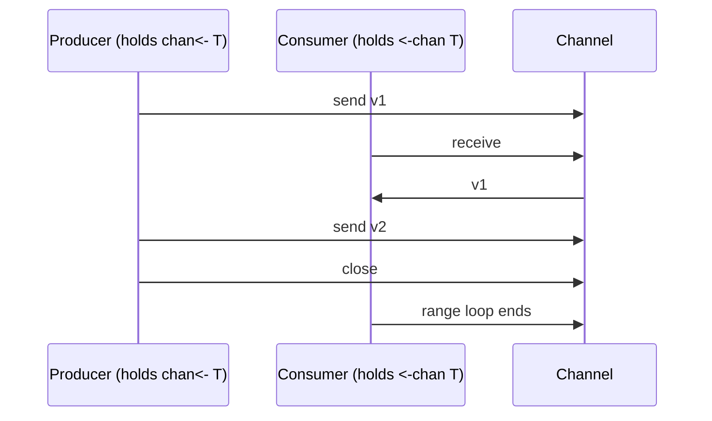

# Channel Direction — Junior Level

## Table of Contents
1. [Introduction](#introduction)
2. [Prerequisites](#prerequisites)
3. [Glossary](#glossary)
4. [Core Concepts](#core-concepts)
5. [Real-World Analogies](#real-world-analogies)
6. [Mental Models](#mental-models)
7. [Pros & Cons](#pros-cons)
8. [Use Cases](#use-cases)
9. [Code Examples](#code-examples)
10. [Coding Patterns](#coding-patterns)
11. [Clean Code](#clean-code)
12. [Product Use / Feature](#product-use-feature)
13. [Error Handling](#error-handling)
14. [Security Considerations](#security-considerations)
15. [Performance Tips](#performance-tips)
16. [Best Practices](#best-practices)
17. [Edge Cases & Pitfalls](#edge-cases-pitfalls)
18. [Common Mistakes](#common-mistakes)
19. [Common Misconceptions](#common-misconceptions)
20. [Tricky Points](#tricky-points)
21. [Test](#test)
22. [Tricky Questions](#tricky-questions)
23. [Cheat Sheet](#cheat-sheet)
24. [Self-Assessment Checklist](#self-assessment-checklist)
25. [Summary](#summary)
26. [What You Can Build](#what-you-can-build)
27. [Further Reading](#further-reading)
28. [Related Topics](#related-topics)
29. [Diagrams & Visual Aids](#diagrams-visual-aids)

---

## Introduction
> Focus: "What does `chan<-` mean? Why would I write `<-chan T` in a function signature? When does the compiler stop me from sending or receiving?"

In Go, a channel is not just a runtime queue — it has a **type**, and that type can encode **direction**. Three forms appear in Go source code:

```go
chan T       // bidirectional: send and receive
chan<- T     // send-only:    send  allowed, receive forbidden
<-chan T     // receive-only: receive allowed, send forbidden
```

You will see these in two places mostly:

1. **Function parameters**: a producer takes `chan<- T`, a consumer takes `<-chan T`. The signature itself documents the role.
2. **Return values**: a function that builds a pipeline stage returns `<-chan T`, telling the caller "read from this, do not write to it, do not close it."

Direction is a **compile-time** property. There is no runtime difference between a bidirectional channel and the same channel converted to a directional view — same memory, same goroutines waiting on it. The arrow next to `chan` is a label that the compiler reads to refuse illegal operations.

After reading this file you will:

- Know the three channel-type syntaxes and which operations each allows.
- Understand the implicit conversion: `chan T` widens to `chan<- T` or `<-chan T`, never the reverse.
- Write a producer/consumer pair with directional channels and read the resulting compiler errors confidently.
- Recognise the standard pipeline pattern: each stage returns `<-chan T`.
- Avoid the four common rookie errors: closing a receive-only channel, trying to convert back, sending on a receive-only, and forgetting the leading arrow.

You do not yet need to know about reflection on channel directions, generics involving directional channels, or how the compiler implements direction checks. Those live in middle, senior, and professional.

---

## Prerequisites

- **Required:** Comfort with basic channels — `make(chan T)`, send (`ch <- v`), receive (`v := <-ch`), and close (`close(ch)`). If those operations are unfamiliar, read `01-buffered-vs-unbuffered/junior.md` first.
- **Required:** Familiarity with Go function signatures and parameter types.
- **Required:** A working Go install (1.18+). You will paste several snippets and see compile errors.
- **Helpful:** Some exposure to typed languages where types restrict what an operation can do (Java's `final`, Rust's `&`/`&mut`, C++'s `const`).
- **Helpful:** A mental picture of "producer/consumer" — one goroutine creates data, another reads it.

If you can write a function that takes a `chan int`, sends three values, and closes it, you are ready.

---

## Glossary

| Term | Definition |
|------|-----------|
| **Bidirectional channel** | A channel with type `chan T`. Both send (`ch <- v`) and receive (`<-ch`) are legal. Returned by `make(chan T)`. |
| **Send-only channel** | A channel with type `chan<- T`. Only `ch <- v` is legal. Receiving (`<-ch`) is a compile error. |
| **Receive-only channel** | A channel with type `<-chan T`. Only `<-ch` is legal. Sending (`ch <- v`) is a compile error. |
| **Directional channel** | Either a send-only or receive-only channel — i.e., a channel whose type carries a direction. |
| **Channel direction** | The send/receive permission carried by a channel type. Bidirectional is the absence of a direction; the others are *directed*. |
| **Implicit conversion** | An assignment-compatible automatic conversion that Go performs without an explicit cast. `chan T` to `chan<- T` is implicit. |
| **Explicit conversion** | A conversion written as `T(x)`. Required when implicit assignability does not apply. `chan<- T` cannot be converted back to `chan T` even explicitly. |
| **API contract** | A promise about behaviour expressed in the function signature. `func send(ch chan<- T)` is a contract: "I only send." |
| **Pipeline stage** | A function that consumes from one channel and produces to another. The standard signature returns `<-chan T`. |
| **Producer** | Code that creates values and sends them on a channel. Takes `chan<- T`. |
| **Consumer** | Code that receives values from a channel. Takes `<-chan T`. |
| **Close** | The `close(ch)` call. Legal on `chan T` and `chan<- T`. **Illegal on `<-chan T`** (a receiver cannot close). |
| **`reflect.ChanDir`** | The runtime representation of channel direction in the `reflect` package. Three values: `RecvDir`, `SendDir`, `BothDir`. Not needed at junior level. |

---

## Core Concepts

### A channel type has three flavours

The cleanest way to see this is in one program:

```go
package main

import "fmt"

func main() {
    bi := make(chan int, 1)        // chan int        — bidirectional
    var send chan<- int = bi       // chan<- int      — send-only view
    var recv <-chan int = bi       // <-chan int      — receive-only view

    send <- 42                     // OK: send-only allows send
    v := <-recv                    // OK: receive-only allows receive
    fmt.Println(v)
}
```

`bi`, `send`, and `recv` all reference the **same underlying channel**. There is one buffer, one wait queue, one piece of memory. What differs is the **type** through which each name accesses that memory.

### The arrow tells you what is allowed

A simple mnemonic: read the arrow as "values flow in this direction *relative to the channel*."

- `chan<- T` — arrow goes *into* the channel — you may **send** values *into* it.
- `<-chan T` — arrow comes *out of* the channel — you may **receive** values *out of* it.

The arrow's position next to `chan` is the syntax; the meaning is "the channel is the destination" (send) or "the channel is the source" (receive).

### Direction is checked at compile time

Try the wrong operation and the program will not build:

```go
func wrong(ch <-chan int) {
    ch <- 1            // compile error: cannot send into receive-only channel
}

func wrongClose(ch <-chan int) {
    close(ch)          // compile error: cannot close receive-only channel
}

func wrongRecv(ch chan<- int) {
    v := <-ch          // compile error: cannot receive from send-only channel
    _ = v
}
```

The compiler error messages are precise. They name the operation, the direction, and the line. No reading of stack traces required.

### Implicit conversions: one direction only

Go performs **implicit widening** from bidirectional to directional. It will *not* perform the reverse.

```go
bi := make(chan int, 1)

var s chan<- int = bi    // OK: chan int → chan<- int
var r <-chan int = bi    // OK: chan int → <-chan int

var s2 chan<- int = bi   // OK
var b chan int = s2      // compile error: cannot use s2 (chan<- int) as chan int
var b2 chan int = r      // compile error: cannot use r (<-chan int) as chan int
```

Also forbidden: converting between the two directional forms.

```go
var s chan<- int = bi
var r <-chan int = s     // compile error: cannot use s (chan<- int) as <-chan int
```

There is no escape hatch via explicit cast. `chan int(s)` is a compile error too. The only way to get a bidirectional channel back is to keep a reference to it from the start.

This is a feature, not a limitation. Once you hand someone a `chan<- T`, they cannot widen it to a `chan T` and start reading. The promise is enforced.

### Closing rules

`close(ch)` is the contract for "no more values will be sent." Receivers detect a closed channel via the second return of `<-ch`:

```go
v, ok := <-ch
if !ok {
    // channel is closed and drained
}
```

Direction rules around `close`:

- `close(chan T)` — OK.
- `close(chan<- T)` — OK.
- `close(<-chan T)` — **compile error**. The receiver does not have authority to close.

This matches the usual ownership model: the producer owns the lifetime of the channel and decides when no more values will arrive. The consumer just reads until the channel is closed and drained.

### Direction is part of the type identity

Two functions with the same name but different channel directions have different signatures:

```go
func f(ch chan int)       {}
func f(ch chan<- int)     {}    // would be a redeclaration error — same package, two `f`s
```

But more importantly, this rule shows direction is part of the type:

```go
var f1 func(chan int)
var f2 func(chan<- int)

f1 = f2     // compile error: cannot use f2 as func(chan int)
```

The two types are distinct.

### The arrow is part of `chan`, but bind it carefully when reading

The token `chan` is the keyword. The token `<-` is the direction operator. Some compositions look confusing at first:

```go
chan<- T          // send-only channel of T
<-chan T          // receive-only channel of T
chan<- chan int   // send-only channel of bidirectional channel of int
chan<- <-chan int // send-only channel of receive-only channel of int
<-chan chan<- int // receive-only channel of send-only channel of int
```

Read right-to-left. The outermost `chan<-` or `<-chan` describes the outermost channel; the rest is the element type. The Go spec is explicit: in `chan<- chan int`, the right-hand `chan int` is the element type of the send-only outer channel.

When in doubt, add parentheses. Go's grammar accepts them in channel types:

```go
chan<- (chan int)       // same as above — clearer
<-chan (chan<- int)     // same as <-chan chan<- int
```

Most production code never nests channels of channels. But you will see this pattern in pipeline frameworks and tests, so reading it should not be a surprise.

---

## Real-World Analogies

### A water valve

Imagine a pipe with valves on each end. The pipe is the channel. A bidirectional valve lets water flow either way. A send-only valve is the inlet — water can only enter. A receive-only valve is the outlet — water can only leave. You cannot turn an outlet into an inlet by labelling it differently; you would have to replumb the pipe (use the bidirectional reference).

### The post office

The producer is a sender at the counter. They can drop letters into a slot — a "post box" — but never reach inside to pull letters out. That slot is a `chan<- Letter`. The receiver is a postal worker on the other side, with a "delivery tray" — `<-chan Letter`. They can only pick letters from the tray, never push letters back. The post office (the runtime) is the only place that owns the box itself.

### Read-only vs write-only files

In Unix, you open a file with `O_RDONLY`, `O_WRONLY`, or `O_RDWR`. The kernel refuses `read()` on `O_WRONLY` descriptors. Directional channels are exactly that: a kernel-style check, except enforced at compile time by the type system, not at runtime by the OS.

### A library checkout desk

The librarian (producer) places books into a return slot — they cannot take any out. The patron (consumer) picks books up from a "ready for pickup" shelf — they cannot put new ones there. Each role has a narrow interface. Mixing them up is impossible because the desk physically only opens one way for each party.

### A factory's conveyor belts

Inside the factory there is one big belt. Workers at one end load items (send), workers at the other end pack them into trucks (receive). If you replaced "the belt" with three different references — "the loading belt", "the packing belt", "the supervisor's belt" — they all refer to the same physical belt, but the loading workers can only access it through their reference, and that reference refuses unloading.

---

## Mental Models

### Model 1: "A directional channel is a view, not a new channel"

`make(chan T)` allocates one piece of memory. When you assign that channel to `chan<- T`, you are not copying anything; you are just looking at the same memory through a stricter window. The window blocks some operations. The data is identical.

This is why two `chan<- T` references derived from the same `chan T` are referentially equal:

```go
bi := make(chan int)
var a chan<- int = bi
var b chan<- int = bi
fmt.Println(a == b)   // true
```

Both are the same underlying channel.

### Model 2: "Direction is a promise, not a fence"

The compiler is honouring a promise the programmer made. `chan<- T` says "I promise I only send through this name." There is no runtime fence that stops a malicious goroutine from doing otherwise — the fence is just the type system. If you keep both `bi chan T` and `send chan<- T` referring to the same channel in scope, both can be used; the directional reference only limits *what you can do through that reference*.

### Model 3: "Direction goes downhill"

The flow of information from a bidirectional channel to its narrower views is one-directional: `chan T → chan<- T → (nowhere narrower)`, and separately `chan T → <-chan T → (nowhere narrower)`. There is no "join" — the two directionals never reconverge to `chan T`. This is why once you hand out a `<-chan T` from a constructor, the recipient cannot widen it back to a `chan T` to start sending.

### Model 4: "Function signatures are the contract; bodies are the implementation"

A function signature reads like a contract. `func producer(out chan<- T) error` says "you give me a channel, I will only write to it." The body must respect that. If the function ever wanted to read from `out`, the compile would fail. The signature alone is enough for a reader to understand the function's relationship with the channel.

### Model 5: "Use direction for design, not for safety against attackers"

Channel direction protects you against *yourself* — typos, refactors that swap producer/consumer, accidentally calling `close` from the wrong side. It is not a security feature against malicious code. Anyone with a bidirectional reference can do anything; the directional types just narrow the API surface.

---

## Pros & Cons

### Pros

- **Compile-time errors** for illegal operations. The build fails before the goroutine ever runs.
- **Self-documenting signatures.** `chan<- T` and `<-chan T` tell the reader the function's role at a glance — no comment needed.
- **Refactoring safety.** If you accidentally call `close` from the wrong side after a refactor, the compiler stops you.
- **Pipeline composability.** Every stage returns `<-chan T`, every consumer takes `<-chan T`, and they connect cleanly with no type adapters.
- **No runtime cost.** Direction is purely a compile-time check; the runtime sees a normal channel.
- **Sharper API design.** Forces you to think about ownership: who closes, who sends, who reads.
- **Better autocomplete.** IDEs offer only the legal operations on a directional channel.

### Cons

- **Cannot widen back.** Once you have a `chan<- T`, there is no way back to a `chan T`. If you need bidirectionality, you must keep the original.
- **Slightly verbose syntax.** `<-chan T` and `chan<- T` take a moment to parse, especially nested forms like `chan<- <-chan T`.
- **No `reflect.MakeChan` direction parameter for narrowing.** You make a bidirectional and convert; you cannot directly `MakeChan` a directional one in some reflection paths (more in professional).
- **No generic narrowing helper in pre-1.18 Go.** Writing a helper that takes "any directional channel of T" requires generics; older code worked around it with `interface{}` plus reflection. Modern code is fine.
- **Sometimes obscures simple code.** A 10-line function that uses one channel rarely benefits from directional restrictions. Reserve it for boundaries.
- **`select` over directional channels has the same syntax.** No special form; you must remember which direction each case uses.

---

## Use Cases

| Scenario | Why directional channels help |
|---|---|
| Producer/consumer split into two functions | Each gets the narrowest type; the contract is enforced. |
| Pipeline of N stages | Each stage's return is `<-chan T`; chaining is type-safe. |
| Worker pool dispatch | Workers take `<-chan Job`, results channel is `chan<- Result`. |
| Fan-out / fan-in | Fan-out gives each worker `<-chan T` from one input; fan-in gives one `chan<- T` to all. |
| Generators (lazy sequences) | Constructor returns `<-chan T`; caller cannot accidentally send back. |
| Public API with channels | `<-chan Event` for subscribers; they cannot publish. |
| Test fakes | A test can hand a `chan<- T` to mock-send into the real consumer. |
| Code review readability | Reviewer reads the signature and instantly knows the role. |

| Scenario | Why directional channels are unnecessary |
|---|---|
| Function uses channel both ways internally | Keep it bidirectional; no win from narrowing. |
| Two-line helper that does one send | Overkill; the role is obvious from the body. |
| Tests that exercise both ends in one function | Bidirectional is convenient. |
| Channel used as a semaphore | Direction is rarely meaningful — both sides do the same thing. |

---

## Code Examples

### Example 1: The three syntaxes side-by-side

```go
package main

import "fmt"

func main() {
    bi := make(chan int, 1)      // chan int
    var s chan<- int = bi        // chan<- int
    var r <-chan int = bi        // <-chan int

    s <- 7                       // OK
    fmt.Println(<-r)             // 7
}
```

Output:

```
7
```

### Example 2: Producer/consumer with explicit directions

```go
package main

import (
    "fmt"
    "sync"
)

func produce(out chan<- int) {
    defer close(out)
    for i := 1; i <= 3; i++ {
        out <- i
    }
}

func consume(in <-chan int, wg *sync.WaitGroup) {
    defer wg.Done()
    for v := range in {
        fmt.Println("got:", v)
    }
}

func main() {
    ch := make(chan int)
    var wg sync.WaitGroup
    wg.Add(1)
    go produce(ch)
    go consume(ch, &wg)
    wg.Wait()
}
```

Output (one possible interleaving):

```
got: 1
got: 2
got: 3
```

Notice the call sites pass `ch` (a `chan int`) into functions that take `chan<- int` and `<-chan int`. The implicit conversion is silent and zero-cost.

### Example 3: The compiler refusing illegal operations

```go
package main

func badSend(ch <-chan int)  { ch <- 1 }          // compile error
func badRecv(ch chan<- int)  { _ = <-ch }         // compile error
func badClose(ch <-chan int) { close(ch) }        // compile error

func main() {}
```

The compiler output is informative:

```
./prog.go:3:30: invalid operation: cannot send to receive-only channel ch (variable of type <-chan int)
./prog.go:4:34: invalid operation: cannot receive from send-only channel ch (variable of type chan<- int)
./prog.go:5:30: invalid operation: cannot close receive-only channel ch (variable of type <-chan int)
```

Each error is on the line where the violation occurs.

### Example 4: A simple pipeline

```go
package main

import "fmt"

// Stage 1: emit integers.
func gen(nums ...int) <-chan int {
    out := make(chan int)
    go func() {
        defer close(out)
        for _, n := range nums {
            out <- n
        }
    }()
    return out
}

// Stage 2: square each value.
func square(in <-chan int) <-chan int {
    out := make(chan int)
    go func() {
        defer close(out)
        for v := range in {
            out <- v * v
        }
    }()
    return out
}

func main() {
    for v := range square(gen(1, 2, 3, 4)) {
        fmt.Println(v)
    }
}
```

Output:

```
1
4
9
16
```

Each stage returns `<-chan int`. The caller cannot accidentally send back into the pipeline. The internal `out chan int` inside each stage is the bidirectional original — the function widens it to a `<-chan int` when returning.

### Example 5: A consumer that should not close

```go
package main

import "fmt"

func sum(in <-chan int) int {
    total := 0
    for v := range in {
        total += v
    }
    return total
}

func main() {
    ch := make(chan int)
    go func() {
        defer close(ch)
        for _, v := range []int{1, 2, 3} {
            ch <- v
        }
    }()
    fmt.Println(sum(ch))
}
```

Output:

```
6
```

If you tried to call `close(in)` inside `sum`, the compiler would block you. This is exactly the safety we want: the producer owns the close, the consumer just reads.

### Example 6: Send-only channel for fan-in

```go
package main

import "fmt"

func emit(id int, out chan<- string) {
    for i := 0; i < 2; i++ {
        out <- fmt.Sprintf("emitter %d: %d", id, i)
    }
}

func main() {
    ch := make(chan string, 4)
    go func() {
        emit(1, ch)
        emit(2, ch)
        close(ch)
    }()
    for msg := range ch {
        fmt.Println(msg)
    }
}
```

Each call to `emit` only sends; it would not compile if it tried to receive.

### Example 7: Trying to convert backwards

```go
package main

func main() {
    bi := make(chan int)
    var s chan<- int = bi
    var b chan int = s        // compile error
    _ = b
    var b2 = (chan int)(s)    // compile error: explicit conversion also fails
    _ = b2
}
```

The compiler refuses both implicit and explicit conversions from `chan<- int` back to `chan int`.

### Example 8: A function literal with directional parameter

```go
package main

import "fmt"

func main() {
    ch := make(chan int, 3)
    sendThree := func(out chan<- int) {
        out <- 1
        out <- 2
        out <- 3
        close(out)
    }
    sendThree(ch)
    for v := range ch {
        fmt.Println(v)
    }
}
```

Output:

```
1
2
3
```

The function literal takes `chan<- int`. The caller passes `ch` (a `chan int`). Same conversion rule as named functions.

### Example 9: Closing rules

```go
package main

func main() {
    bi := make(chan int)
    close(bi)                       // OK

    var s chan<- int = make(chan int)
    close(s)                        // OK

    var r <-chan int = make(chan int)
    close(r)                        // compile error
    _ = r
}
```

A send-only channel can be closed; a receive-only channel cannot. This matches the principle that the producer (who has the `chan<- T`) owns the lifetime.

### Example 10: Range over a `<-chan T`

```go
package main

import "fmt"

func consume(in <-chan int) {
    for v := range in {
        fmt.Println(v)
    }
}

func main() {
    ch := make(chan int)
    go func() {
        defer close(ch)
        for i := 0; i < 3; i++ {
            ch <- i
        }
    }()
    consume(ch)
}
```

Output:

```
0
1
2
```

`range` over a receive-only channel works exactly like range over a bidirectional one. The loop ends when the channel is closed and drained.

### Example 11: Storing a directional channel in a struct

```go
package main

import "fmt"

type Subscription struct {
    Events <-chan string
}

func newSubscription() Subscription {
    ch := make(chan string, 4)
    go func() {
        defer close(ch)
        ch <- "hello"
        ch <- "world"
    }()
    return Subscription{Events: ch}
}

func main() {
    sub := newSubscription()
    for e := range sub.Events {
        fmt.Println(e)
    }
}
```

The struct exposes a `<-chan string`. Subscribers can read, range, and `select` on it, but cannot send or close. The publisher keeps the bidirectional reference inside the constructor's goroutine.

### Example 12: A `select` over a receive-only channel

```go
package main

import (
    "fmt"
    "time"
)

func wait(in <-chan int) {
    select {
    case v := <-in:
        fmt.Println("got", v)
    case <-time.After(100 * time.Millisecond):
        fmt.Println("timeout")
    }
}

func main() {
    ch := make(chan int)
    wait(ch)
}
```

Output:

```
timeout
```

`select` cases respect channel direction. You can only put a `<-` receive on a `<-chan T` and only a `ch <- v` send on a `chan<- T`.

### Example 13: Directional methods on a type

```go
package main

import "fmt"

type Counter struct {
    inc chan int
}

func New() *Counter { return &Counter{inc: make(chan int, 8)} }

// Inc exposes only the send side.
func (c *Counter) Inc() chan<- int { return c.inc }

// Inc events expose the bi-channel? No — let's expose only receive-only.
func (c *Counter) Events() <-chan int { return c.inc }

func main() {
    c := New()
    go func() {
        for i := 0; i < 3; i++ {
            c.Inc() <- i      // sender side: send-only
        }
        close(c.Inc())        // OK on send-only? Yes — only <-chan is forbidden
    }()
    for v := range c.Events() {
        fmt.Println(v)
    }
}
```

Output (any order from one goroutine in sequence):

```
0
1
2
```

`Inc()` returns `chan<- int`; `Events()` returns `<-chan int`. Same underlying `c.inc`. Callers cannot mix up the roles.

---

## Coding Patterns

### Pattern 1: Pipeline stage signature

The canonical pipeline stage:

```go
func stage(in <-chan In) <-chan Out {
    out := make(chan Out)
    go func() {
        defer close(out)
        for v := range in {
            out <- transform(v)
        }
    }()
    return out
}
```

Three guarantees baked into types:

- The stage cannot send back into `in`.
- The caller cannot send into `out`.
- The caller cannot close `out` from outside.

### Pattern 2: Producer constructor

A function that spawns a goroutine and returns the read side:

```go
func tick(d time.Duration) <-chan time.Time {
    out := make(chan time.Time)
    go func() {
        for {
            time.Sleep(d)
            out <- time.Now()
        }
    }()
    return out
}
```

The caller knows: "I read from this; the goroutine owns sending."

(In production you would add a stop mechanism — covered later. The pattern shape stays the same.)

### Pattern 3: Consumer function

The mirror image:

```go
func drain(in <-chan int) int {
    var n int
    for range in {
        n++
    }
    return n
}
```

The function reads until the channel is closed. The signature documents it.

### Pattern 4: Worker pool dispatcher

```go
func worker(id int, jobs <-chan Job, results chan<- Result) {
    for j := range jobs {
        results <- process(j)
    }
}
```

`jobs` is read-only; `results` is write-only. The worker cannot accidentally close `jobs` (the dispatcher owns that) and cannot read from `results` (the aggregator does).

### Pattern 5: Done channel narrowing

A common idiom: a struct exposes a `<-chan struct{}` to signal shutdown.

```go
type Server struct {
    done chan struct{}
}

func (s *Server) Done() <-chan struct{} { return s.done }
```

External code can `select` on `s.Done()` but cannot close it. Only the server's own shutdown path closes the underlying `done`.

### Pattern 6: Fan-out with directional outputs

```go
func split(in <-chan int, n int) []<-chan int {
    outs := make([]chan int, n)
    for i := range outs {
        outs[i] = make(chan int)
    }
    go func() {
        defer func() {
            for _, o := range outs {
                close(o)
            }
        }()
        for v := range in {
            for _, o := range outs {
                o <- v
            }
        }
    }()
    result := make([]<-chan int, n)
    for i, o := range outs {
        result[i] = o
    }
    return result
}
```

Internally we hold `[]chan int` (bidirectional). Externally we return `[]<-chan int`. Callers can only read.

---

## Clean Code

- **Narrow at the boundary, not the body.** Inside a function, work with a bidirectional `chan T` if it is simpler. At the function's edge — parameters and returns — narrow to `chan<- T` or `<-chan T` to express intent.
- **One responsibility per channel reference.** A `chan T` field that gets sent to *and* received from in two different methods of the same struct is a smell. Split into `inbox chan<- T` and `outbox <-chan T` views via methods.
- **Always close at the producer end.** Make the producer's `chan<- T` reference responsible for `close`. A consumer with `<-chan T` cannot even attempt to close.
- **Document the close with a defer.** `defer close(out)` at the top of a producer goroutine is the cleanest way to guarantee close on all return paths.
- **Avoid `interface{}` if you mean "directional channel."** Use the directional type. Generics (Go 1.18+) make this even cleaner.
- **Prefer named pipeline functions to long inline `go func`s.** Each named function has a documented signature with directions; an inline closure hides them.

---

## Product Use / Feature

| Product feature | How directional channels deliver it |
|---|---|
| Real-time event stream | `func (s *Stream) Events() <-chan Event` — subscribers cannot publish or close. |
| Internal job queue | `func (q *Queue) Submit() chan<- Job` — callers cannot drain. |
| HTTP server shutdown | `func (srv *Server) Done() <-chan struct{}` — external code can wait on shutdown without forcing it. |
| Metrics flush pipeline | `gen() → batch() → write()` — each stage has the canonical `<-chan T` return. |
| Chat message bus | Subscriber API exposes `<-chan Message`; publisher API exposes `chan<- Message`. |
| Crawler queue | URL submitter gets `chan<- URL`; workers get `<-chan URL`. |

---

## Error Handling

Directional channels do not change the rules of error handling much, but they do reshape some idioms.

### Returning errors from a producer

A pipeline producer typically sends `Result` values that carry their own error:

```go
type Result struct {
    Value int
    Err   error
}

func gen(in <-chan int) <-chan Result {
    out := make(chan Result)
    go func() {
        defer close(out)
        for v := range in {
            r := Result{Value: v}
            if v < 0 {
                r.Err = fmt.Errorf("negative input: %d", v)
            }
            out <- r
        }
    }()
    return out
}
```

The consumer pattern-matches `r.Err != nil`. The directional `out` ensures the consumer cannot send fake results back.

### Cancellation via a receive-only `done`

```go
func worker(jobs <-chan Job, done <-chan struct{}) {
    for {
        select {
        case j, ok := <-jobs:
            if !ok {
                return
            }
            process(j)
        case <-done:
            return
        }
    }
}
```

`done` is a receive-only channel. The worker can only listen for the signal, not raise it. The coordinator owns the bidirectional reference and closes it on shutdown.

### Panic safety with directional channels

A panic inside the producer goroutine still kills the program if not recovered. `defer close(out)` runs even on panic, so the consumer's `range` ends cleanly:

```go
func produce(out chan<- int) {
    defer close(out)
    defer func() {
        if r := recover(); r != nil {
            log.Printf("producer panic: %v", r)
        }
    }()
    // ...
}
```

Order matters: `defer close(out)` registers first and runs *last*. The `recover` runs first to swallow the panic, then close fires. The consumer's range exits normally.

---

## Security Considerations

Channel direction is not a security feature in the classical sense — it does not prevent malicious code from doing illegal things if that code holds the bidirectional reference. But it does help in two specific ways:

- **Defence in depth against your own bugs.** A code path that should never close a subscription channel cannot do so by accident if it only holds `<-chan T`. After a year of maintenance, the type system still enforces the invariant.
- **Smaller API surface for plug-in code.** If you load a plug-in or pass a callback that takes a `<-chan T`, the callback cannot publish bogus events or close the stream. That narrows what hostile or buggy plug-ins can do.
- **Resource lifetime clarity.** A subscriber that cannot close its read side cannot inadvertently leak the producer goroutine by closing the channel out from under it.

Direction is *not* a substitute for proper auth, input validation, or panic handling. Use it for clarity and refactor safety; do not assume it protects against actively malicious code.

---

## Performance Tips

- **Direction has zero runtime cost.** A `chan<- T` and a `chan T` referring to the same channel hit the same runtime path — `runtime.chansend`. The compiler emits identical machine code.
- **Conversion is free.** Implicit widening from `chan T` to `chan<- T` is a no-op at runtime; no copy, no allocation, no boxing.
- **Do not over-narrow inside hot loops just for style.** Reassigning a local variable to `chan<- T` purely for readability inside a function body adds nothing if the function is the producer.
- **Use direction at function boundaries — that is where the design value lives.** The performance is identical either way.
- **Pipelines: each stage costs one goroutine, one channel, one close.** Direction does not change the cost; it only changes who can do what.

---

## Best Practices

1. Always narrow channel types at function boundaries. Producers take `chan<- T`, consumers take `<-chan T`.
2. Return `<-chan T` from any function whose job is to produce values.
3. Close at the producer end; never give a consumer the power to close.
4. Use `defer close(out)` inside producer goroutines to handle all return paths and panics.
5. Read pipeline stage signatures top-to-bottom to verify the contract before reading bodies.
6. Reserve `chan T` for code that genuinely uses the channel both ways (sometimes worker code, sometimes test code).
7. Name parameters by role: `in`, `out`, `jobs`, `results`, `done` — match the direction.
8. Prefer methods on structs that return the appropriate directional type for each access path.
9. In code review, flag a `func (...) chan T` return that is only used one way — narrow it.
10. Use `range in` for receive-only inputs; it is idiomatic and the directional type permits it.

---

## Edge Cases & Pitfalls

### Closing a receive-only channel

```go
func consume(in <-chan int) {
    close(in)              // compile error
}
```

Solution: do not close at the consumer; close at the producer.

### Sending into a receive-only channel

```go
func consume(in <-chan int) {
    in <- 1                // compile error
}
```

Solution: pass a `chan<- int` for sending or expose a method on the owner that does the send internally.

### Trying to widen back

```go
func widen(in <-chan int) chan int {
    return in              // compile error
}
```

There is no way. If you need bidirectional access, keep a reference from the start. Some legacy codebases use `reflect` to do this; it is a smell.

### Forgetting the direction in the type

`chan< - T` (note the space) is a syntax error. The token is `chan<-` with no space, but the spec writes it as `chan` `<-` `T`. The compiler accepts:

```go
chan<- int
chan <- int     // spaces allowed
```

But not:

```go
chan< - int     // syntax error — '<' alone is not legal here
```

Pay attention when typing in unfamiliar editors.

### Mistaking `<-chan T` for "pointer to chan T"

`<-` here is not a dereference. It is the receive-direction marker. `<-chan T` is a channel type, not a pointer. `chan<- T` is also a channel type — a send-only one. Neither is related to Go's `*T` or `&` operators.

### Mistaking direction in `select`

```go
select {
case ch <- v:                 // send case — `ch` must be a chan T or chan<- T
case w := <-other:            // receive case — `other` must be a chan T or <-chan T
}
```

If you write a send case on a `<-chan T` or a receive case on a `chan<- T`, the compiler complains.

### Implicit conversion in function call vs assignment

Both work the same way:

```go
func send(ch chan<- int) {}

bi := make(chan int)
send(bi)                       // implicit conversion in call
var s chan<- int = bi          // implicit conversion in assignment
send(s)                        // same type, no conversion
```

### Returning a bidirectional from an interface method

If an interface method returns `chan T`, a caller can do anything. To enforce direction, return `<-chan T` or `chan<- T` in the interface signature.

```go
type Source interface {
    Events() <-chan Event       // good — caller cannot send or close
}

type BadSource interface {
    Events() chan Event         // bad — caller has full power
}
```

### Channels of channels

`chan<- <-chan int` is a send-only channel whose elements are themselves receive-only channels. Read right-to-left:

```
chan<-                <-chan int
^                     ^
send-only channel     receive-only channel
of                    of int

// "send-only channel of receive-only channels of int"
```

These show up in fan-out/fan-in libraries.

---

## Common Mistakes

| Mistake | Fix |
|---|---|
| Trying to close from the consumer side | Only the producer holds `chan<- T` or `chan T` and may close. |
| Passing `chan T` everywhere "for flexibility" | Narrow at boundaries; the flexibility is rarely needed and the contract is lost. |
| Storing `chan T` in a struct field accessed by many goroutines, all doing different things | Expose narrower views via methods (`Inbox() chan<- T`, `Outbox() <-chan T`). |
| Capturing a directional channel in a closure and then calling `close` | Compile error you must fix by passing the bidirectional reference instead. |
| Writing `var ch <-chan int = make(<-chan int)` | `make` cannot directly create a directional channel; you make `chan int` and assign. |
| Receiving from a `chan<- T` | Compile error. Decide which role the caller has and adjust the type. |
| Forgetting to range or to detect close at the consumer | Direction does not change this; you still need the `for v := range in` loop. |
| Trying to convert with `(chan T)(send)` | Explicit conversions cannot widen direction either. |

---

## Common Misconceptions

> *"A directional channel is a different channel."* — No. It is the same channel, viewed through a stricter type.

> *"Direction is checked at runtime."* — No. It is a pure compile-time check. The runtime has no separate code path.

> *"I can `reflect`-convert back to a bidirectional channel."* — Even with `reflect`, you cannot widen direction. Reflection enforces the same rules.

> *"`<-chan T` is a pointer."* — No, it is a channel type.

> *"`make(<-chan T)` produces a receive-only channel."* — No. `make` only produces bidirectional channels. You assign to a directional variable to narrow.

> *"`close` works on any channel."* — Not on receive-only. The compiler refuses.

> *"Directional channels are slower because of the type check."* — No, direction adds zero runtime overhead.

> *"Two functions with `chan T` and `chan<- T` parameters are interchangeable."* — They have different types. A `chan<- T` parameter cannot accept a function value expecting `chan T`.

> *"Closing a closed send-only channel doesn't panic."* — It does. The direction does not change runtime behaviour; only the operations the compiler permits.

> *"You need generics to write pipeline stages."* — You do not. Generics are convenient but pipeline stages with concrete types work since Go 1.0.

---

## Tricky Points

### Implicit conversion happens in function calls, returns, and assignments — but not in equality comparisons across directions

```go
bi := make(chan int)
var s chan<- int = bi
fmt.Println(bi == s)    // compile error: mismatched types
```

You cannot compare a `chan int` to a `chan<- int` directly. The compiler considers them incomparable. To compare, narrow one side first:

```go
var s2 chan<- int = bi
fmt.Println(s == s2)    // OK — both chan<- int, same underlying — true
```

### `nil` directional channels block forever

A `var ch chan<- int = nil; ch <- 1` blocks forever. So does `var ch <-chan int = nil; <-ch`. Direction does not change nil-channel semantics. (More in the next subsection on nil channels.)

### Closing a nil directional channel panics

```go
var ch chan<- int
close(ch)               // runtime panic: close of nil channel
```

Same rule as bidirectional nil close.

### The order of `<-` and `chan` is fixed

`<-chan T` is receive-only. `chan<- T` is send-only. You cannot write `chan-> T` or `->chan T`; Go only has the `<-` token, used in two positions. Memorise this once.

### A function returning `<-chan T` can return a `chan T`

The implicit widening rule applies to return values:

```go
func source() <-chan int {
    ch := make(chan int)
    // ... fill ch in a goroutine
    return ch          // implicit conversion chan int → <-chan int
}
```

This is the workhorse of pipeline constructors.

### `for v := range ch` works on `<-chan T`

But not on `chan<- T`:

```go
func consume(in <-chan int) {
    for v := range in { _ = v }   // OK
}

func produce(out chan<- int) {
    for v := range out { _ = v }  // compile error
}
```

This catches role mix-ups quickly.

### A method with a directional receiver does not exist

`func (ch chan<- int) Send(v int)` is not legal because you can only define methods on named types, and Go does not let you define methods on channel types directly. You can wrap a channel in a struct and put methods on the struct, then expose the directional channel via accessors.

### Argument evaluation in `go f(ch)`

When you write `go produce(ch)`, the conversion of `ch` (bidirectional) to the parameter type (e.g., `chan<- int`) happens in the parent goroutine, before the spawned goroutine starts. No surprises here — same as any other type conversion.

---

## Test

```go
// channel_direction_test.go
package channeldir_test

import (
    "sync"
    "testing"
)

// Producer signature uses chan<- ; consumer uses <-chan.
// We test that they cooperate via a bidirectional channel under the hood.

func produceN(out chan<- int, n int) {
    defer close(out)
    for i := 1; i <= n; i++ {
        out <- i
    }
}

func sum(in <-chan int) int {
    total := 0
    for v := range in {
        total += v
    }
    return total
}

func TestProducerConsumer(t *testing.T) {
    ch := make(chan int)
    var got int
    var wg sync.WaitGroup
    wg.Add(1)
    go func() {
        defer wg.Done()
        got = sum(ch)
    }()
    produceN(ch, 10)
    wg.Wait()
    if got != 55 {
        t.Fatalf("expected 55, got %d", got)
    }
}

// Demonstrate that direction is preserved through a channel-of-channels.
func TestNestedDirections(t *testing.T) {
    bi := make(chan int, 1)
    var s chan<- int = bi
    var r <-chan int = bi

    s <- 99
    if v := <-r; v != 99 {
        t.Fatalf("expected 99, got %d", v)
    }
}
```

Run:

```bash
go test ./...
```

To prove direction is enforced at compile time, intentionally introduce an illegal operation in a separate scratch file and try to build. The error message is your proof.

---

## Tricky Questions

**Q.** Why does the following compile?

```go
func wrap(ch chan int) <-chan int { return ch }
```

**A.** The return type `<-chan int` permits the implicit conversion from `chan int`. The compiler inserts a zero-cost widening. The caller sees a receive-only channel; the function body sees the bidirectional original.

---

**Q.** Why does this *not* compile?

```go
func unwrap(ch <-chan int) chan int { return ch }
```

**A.** There is no implicit (or explicit) conversion from `<-chan int` back to `chan int`. The compiler refuses with "cannot use ch (type <-chan int) as type chan int."

---

**Q.** Is `chan int` and `chan<- int` the same type?

**A.** No. They have different type identities. Assignment from one to the other requires the implicit widening rule (one way only). Two function values `func(chan int)` and `func(chan<- int)` are not interchangeable.

---

**Q.** What happens if you `close` a `chan<- T`?

**A.** It compiles, and at runtime it closes the underlying channel. Direction does not change runtime `close` behaviour — only whether the compiler accepts the line.

---

**Q.** Can you `select` on a receive-only channel?

**A.** Yes, in a receive case (`case v := <-r:`). You cannot put it in a send case.

---

**Q.** What is the type of `make(chan int)`?

**A.** `chan int` — bidirectional. `make` only produces bidirectional channels.

---

**Q.** Can a function with signature `func(<-chan int)` receive a `chan<- int` argument?

**A.** No. They are unrelated types. Only `chan int` can implicitly convert to either.

---

**Q.** What is the type of `<-someChan` when `someChan` is `chan<- int`?

**A.** That is a compile error — you cannot receive from a send-only channel.

---

**Q.** Does `reflect` let you widen back?

**A.** No. The `reflect` package mirrors the type system. It exposes `reflect.ChanDir` (`SendDir`, `RecvDir`, `BothDir`) but does not let you convert a `SendDir` channel into a `BothDir` one.

---

**Q.** What is the difference between `chan<- chan int` and `<-chan chan int`?

**A.** Both have element type `chan int`. The first is a send-only outer channel; the second is a receive-only outer channel. The element type does not have direction restrictions — sending or receiving the *outer* channel just moves bidirectional inner channels back and forth.

---

## Cheat Sheet

```go
// Three channel types
chan T          // bidirectional
chan<- T        // send-only
<-chan T        // receive-only

// Make: only bidirectional
ch := make(chan int)        // chan int
ch  := make(chan int, 10)   // chan int (buffered)

// Implicit conversions (one way only)
var bi chan int    = make(chan int)
var s  chan<- int  = bi    // OK
var r  <-chan int  = bi    // OK
// var b chan int   = s    // ERROR — no widening back
// var x chan<- int = r    // ERROR — no cross-direction conversion

// Operations permitted
chan T:     send, receive, close, range
chan<- T:   send, close
<-chan T:   receive, range
            (close is FORBIDDEN)

// Function signatures
func produce(out chan<- T) { /* ... */ }
func consume(in  <-chan T) { /* ... */ }

// Pipeline stage
func stage(in <-chan In) <-chan Out {
    out := make(chan Out)
    go func() {
        defer close(out)
        for v := range in {
            out <- transform(v)
        }
    }()
    return out
}
```

---

## Self-Assessment Checklist

- [ ] I can write the three channel type syntaxes from memory.
- [ ] I know which operations are legal on `chan T`, `chan<- T`, and `<-chan T`.
- [ ] I understand that `make` produces only bidirectional channels.
- [ ] I can predict which assignments compile and which do not.
- [ ] I know that direction is a compile-time concept with zero runtime cost.
- [ ] I can write a pipeline stage with the canonical `func(<-chan In) <-chan Out` signature.
- [ ] I know that `close` is forbidden on `<-chan T`.
- [ ] I know that closing a nil directional channel panics, and that receiving from a nil directional channel blocks forever.
- [ ] I can read nested channel types like `chan<- <-chan T`.
- [ ] I have written one program that uses directional channels at every function boundary and seen the compile errors when I made a mistake.

---

## Summary

Channel direction is the Go type system's way of saying "this name has only one job." A `chan T` is bidirectional and can do everything; a `chan<- T` can only send and close; a `<-chan T` can only receive. The compiler enforces these rules and refuses illegal operations before the program runs.

Implicit conversion widens a bidirectional channel into either directional view. You cannot widen back, and you cannot cross-convert. This is by design — once you hand someone a `<-chan T`, they cannot start writing to it.

Use direction at function boundaries (parameters and returns) and in struct accessors. Producers take `chan<- T`, consumers take `<-chan T`, pipeline stages return `<-chan T`. The runtime sees no difference; the developer sees a clear, refactor-safe contract.

The next step is **buffered vs unbuffered semantics with direction**, **directional channels in `select`**, and **pipelines that fan out and fan in** — all standard middle-level material.

---

## What You Can Build

After mastering this material:

- A two-stage pipeline (`gen → square`) with type-safe stages.
- A worker pool where workers cannot accidentally close the job queue.
- A pub/sub object whose subscribers receive `<-chan Event` and cannot publish back.
- A shutdown signal struct that exposes `<-chan struct{}` to listeners.
- A fan-out function that returns `[]<-chan T`.
- A test fixture that swaps in a mock producer via a `chan<- T` channel.
- A clean refactor of an old codebase that uses `chan T` everywhere, narrowing it down piece by piece and watching the compiler help.

---

## Further Reading

- The Go Programming Language Specification — *Channel types*: <https://go.dev/ref/spec#Channel_types>
- The Go Programming Language Specification — *Send statements*: <https://go.dev/ref/spec#Send_statements>
- The Go Programming Language Specification — *Receive operator*: <https://go.dev/ref/spec#Receive_operator>
- Effective Go — *Channels*: <https://go.dev/doc/effective_go#channels>
- The Go Blog — *Pipelines and cancellation*: <https://go.dev/blog/pipelines>
- *Go Concurrency Patterns* (Rob Pike, Google I/O 2012): <https://www.youtube.com/watch?v=f6kdp27TYZs>
- *Advanced Go Concurrency Patterns* (Sameer Ajmani, Google I/O 2013): <https://www.youtube.com/watch?v=QDDwwePbDtw>

---

## Related Topics

- Channels — base operations: send, receive, close, range
- Buffered vs unbuffered channels — affects synchronisation, not direction
- `select` statement — directional channels in case clauses
- `nil` channels — direction does not change nil semantics
- Closing channels — direction restricts who may call `close`
- Pipeline pattern — the canonical use case for directional types
- Generics (Go 1.18+) — directional types work with type parameters

---

## Diagrams & Visual Aids

### Direction at a glance

```
   chan T          chan<- T         <-chan T
+----------+    +----------+    +----------+
| send  ok |    | send  ok |    | send  X  |
| recv  ok |    | recv  X  |    | recv  ok |
| close ok |    | close ok |    | close X  |
| range ok |    | range X  |    | range ok |
+----------+    +----------+    +----------+
```

### Implicit conversion lattice

```
                chan T
                 / \
                /   \
               /     \
              v       v
          chan<- T   <-chan T
              \       /
               \     /
                \   /
                 X X       <- no implicit (or explicit) conversion back or across
```

### Pipeline data flow

```
+----------+        +-----------+        +-----------+        +---------+
|   gen    |  -->   |  square   |  -->   |  filter   |  -->   |  print  |
| <-chan T |        | in: <-T   |        | in: <-T   |        | in: <-T |
| out:<-T  |        | out:<-T   |        | out:<-T   |        |         |
+----------+        +-----------+        +-----------+        +---------+
   producer            stage 1              stage 2              sink
```

Each arrow is a directional channel of the appropriate element type. Direction is encoded in the function signatures.

### Producer / consumer roles



### Permissions table

```
Operation          chan T    chan<- T    <-chan T
-----------------  --------  ----------  ----------
ch <- v            yes       yes         compile err
v := <-ch          yes       compile err yes
v, ok := <-ch      yes       compile err yes
for v := range ch  yes       compile err yes
close(ch)          yes       yes         compile err
len(ch), cap(ch)   yes       yes         yes
```

`len`, `cap`, and `nil`-comparison work on any direction — they do not depend on send/receive permissions.

### Conversion paths

```
make(chan T)       ====>   chan T
chan T             ====>   chan<- T        (implicit, free)
chan T             ====>   <-chan T        (implicit, free)
chan<- T           ====>   chan T          NOT ALLOWED
<-chan T           ====>   chan T          NOT ALLOWED
chan<- T           ====>   <-chan T        NOT ALLOWED
<-chan T           ====>   chan<- T        NOT ALLOWED
```

Once narrowed, always narrowed.
