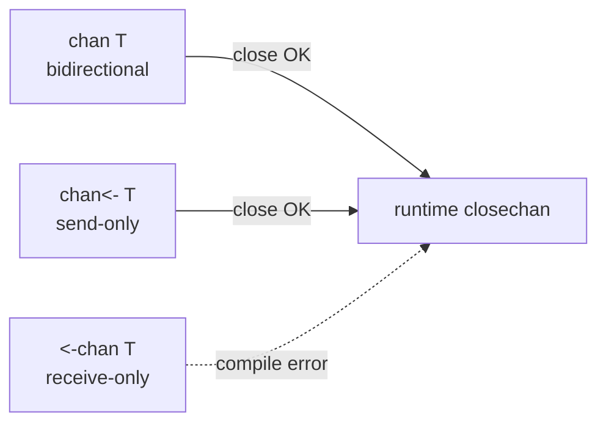
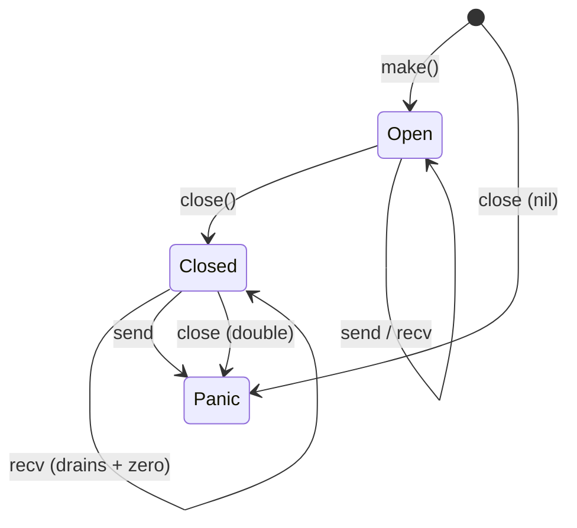

# Closing Channels — Junior Level

## Table of Contents
1. [Introduction](#introduction)
2. [Prerequisites](#prerequisites)
3. [Glossary](#glossary)
4. [Core Concepts](#core-concepts)
5. [Real-World Analogies](#real-world-analogies)
6. [Mental Models](#mental-models)
7. [Pros & Cons](#pros-cons)
8. [Use Cases](#use-cases)
9. [Code Examples](#code-examples)
10. [Coding Patterns](#coding-patterns)
11. [Clean Code](#clean-code)
12. [Product Use / Feature](#product-use-feature)
13. [Error Handling](#error-handling)
14. [Security Considerations](#security-considerations)
15. [Performance Tips](#performance-tips)
16. [Best Practices](#best-practices)
17. [Edge Cases & Pitfalls](#edge-cases-pitfalls)
18. [Common Mistakes](#common-mistakes)
19. [Common Misconceptions](#common-misconceptions)
20. [Tricky Points](#tricky-points)
21. [Test](#test)
22. [Tricky Questions](#tricky-questions)
23. [Cheat Sheet](#cheat-sheet)
24. [Self-Assessment Checklist](#self-assessment-checklist)
25. [Summary](#summary)
26. [What You Can Build](#what-you-can-build)
27. [Further Reading](#further-reading)
28. [Related Topics](#related-topics)
29. [Diagrams & Visual Aids](#diagrams-visual-aids)

---

## Introduction
> Focus: "What does `close(ch)` actually do, when do I need it, and what are the rules that make my program panic if I get it wrong?"

`close` is a built-in function in Go that marks a channel as **no more values will ever be sent on it**. Closing is not the same as deleting the channel. The channel still exists in memory; receivers can still pull buffered values out of it; the channel can still be read from. What changes is one bit of internal state: the channel transitions from "open" to "closed," and that bit is observable to receivers.

You close a channel by calling `close(ch)`. That is all there is to the syntax. Everything interesting about closing is in the rules:

1. After `close(ch)`, any further **send** on `ch` (`ch <- v`) **panics**. There is no exception, no recovery without `defer`, no second chance.
2. After `close(ch)`, **receives still work** — they drain any buffered values, and once the buffer is empty they return the channel's **zero value** with a second result of `false`.
3. A `for v := range ch` loop **exits cleanly** when the channel is closed and drained.
4. Calling `close(ch)` on an **already-closed** channel **panics**.
5. Calling `close(ch)` on a **nil channel** **panics**.
6. Calling `close(ch)` on a **receive-only channel** is a **compile error**.

These rules are the entire surface you need to learn. The patterns we build on top of them — sender-closes, done-channel, broadcast, generator — all exist to keep your code inside the safe rules.

After reading this file you will:

- Know what `close(ch)` does and what it does not do.
- Be able to read from a closed channel and tell when it has been closed (the "comma-ok" idiom).
- Be able to write a producer that closes its channel when finished.
- Use `for range` to consume a channel until close.
- Recognise and avoid the three panic-causing operations: send-on-closed, double-close, nil-close.
- Understand the convention "only the sender closes" and why beginners must respect it.
- See the simplest multi-sender close pattern (we go much deeper at middle level).
- Use a closed channel as a broadcast signal (the "done channel" pattern).

You do not need to know about the multi-sender synchronising-closer pattern, the runtime internals of `closechan`, or the Go memory model's happens-before guarantees yet. Those come at middle, senior, and professional levels.

---

## Prerequisites

- **Required:** Comfort with goroutines and the `go` keyword. See `01-goroutines/01-overview`.
- **Required:** Familiarity with sending (`ch <- v`) and receiving (`<-ch`) on channels. See `02-channels/01-buffered-vs-unbuffered`.
- **Required:** Basic knowledge of `for range` on slices and maps. The syntax extends to channels.
- **Helpful:** A passing acquaintance with `select`. We use it lightly; deep coverage is in `02-select-statement`.
- **Helpful:** Having written at least one producer/consumer program with channels.

If you can write `ch := make(chan int); go func() { ch <- 1 }(); fmt.Println(<-ch)` and explain why the program does not deadlock, you are ready.

---

## Glossary

| Term | Definition |
|------|-----------|
| **`close(ch)`** | A Go built-in that marks the channel `ch` as closed. After this, sends panic, receives drain buffered values then return the zero value with `ok = false`. |
| **Closed channel** | A channel whose internal `closed` flag is set. Distinct from a `nil` channel. |
| **Open channel** | A channel that has been created with `make` but not yet closed. |
| **Comma-ok receive** | The two-result form of receive: `v, ok := <-ch`. `ok == false` indicates the channel is closed and drained. |
| **Drained channel** | A closed channel whose buffer is empty. Receives now return immediately with zero value and `ok = false`. |
| **Sender-closes convention** | The community-standard rule: only the goroutine that sends values closes the channel. Never the receiver, never a third party (unless the multi-sender pattern is in play). |
| **Done channel** | A channel — typically `chan struct{}` — used purely as a signal. Closing it broadcasts "stop" to all listeners. |
| **Broadcast via close** | The property that closing a channel wakes *every* goroutine waiting on it, simultaneously. The basis of the done-channel pattern. |
| **Generator** | A goroutine that produces a sequence of values on a channel and closes the channel when finished. The standard pattern for "yield values until done." |
| **Multi-sender problem** | The challenge of safely closing a channel when more than one goroutine sends on it. Closing must happen exactly once, by exactly one closer, with no in-flight sends. |
| **Send-on-closed panic** | The runtime panic `send on closed channel`. Caused by `ch <- v` after `close(ch)`. |
| **Double-close panic** | The runtime panic `close of closed channel`. Caused by calling `close(ch)` twice. |
| **Nil-close panic** | The runtime panic `close of nil channel`. Caused by `close(ch)` where `ch == nil`. |

---

## Core Concepts

### `close(ch)` is a one-way state transition

Channels have an internal flag, `closed`. It starts `false` when the channel is created. `close(ch)` sets it to `true`. There is no `open(ch)` — you cannot reopen a closed channel. The transition is one-way and final. If you need a "reopenable" abstraction, you discard the old channel and create a new one.

```go
ch := make(chan int)
// closed flag: false
close(ch)
// closed flag: true (permanent for this channel)
```

### A closed channel can still be read from

This is the rule that surprises beginners the most. Closing does not destroy the channel. The channel still exists; the buffer still holds values; receivers can still read.

```go
ch := make(chan int, 3)
ch <- 10
ch <- 20
ch <- 30
close(ch)

fmt.Println(<-ch) // 10
fmt.Println(<-ch) // 20
fmt.Println(<-ch) // 30
fmt.Println(<-ch) // 0 (zero value)
fmt.Println(<-ch) // 0 (zero value, again — closed channels never block)
```

After the buffer is drained, any further receive returns the channel element type's zero value: `0` for `int`, `""` for `string`, `nil` for pointer / interface / slice / map types, the zero struct for structs. The receive **never blocks** on a closed channel.

### The comma-ok form tells you when the channel closed

A bare `<-ch` returns one value. The two-value form returns the value plus a `bool` indicating whether the channel is still open:

```go
v, ok := <-ch
```

- `ok == true`: the value `v` was sent by some goroutine. The channel may still be open or may have closed *after* sending this value.
- `ok == false`: the channel is closed *and* the buffer is empty. `v` is the zero value.

This is how a receiver distinguishes "got a real value" from "channel is exhausted."

```go
for {
    v, ok := <-ch
    if !ok {
        fmt.Println("channel closed")
        return
    }
    fmt.Println("got", v)
}
```

### `for v := range ch` is the clean way

The above loop is so common that Go offers a shorthand: `for range` on a channel reads until close, automatically.

```go
for v := range ch {
    fmt.Println("got", v)
}
fmt.Println("channel closed")
```

The loop reads one value per iteration; when the channel closes and drains, the loop exits. No `ok` variable, no break — just the natural end of iteration.

If you never close the channel, `for range` blocks forever waiting for the next value. This is the **most common goroutine leak in Go**.

### Sending on a closed channel panics

```go
ch := make(chan int, 1)
close(ch)
ch <- 1 // panic: send on closed channel
```

The runtime check is unconditional. No `defer`, no `recover` outside the same goroutine helps. The reason this is a panic and not a returned error: it represents a *program logic bug*, not a runtime condition. The sender thought the channel was open; the channel was not. Continuing in that state is unsafe.

### Closing a closed channel panics

```go
ch := make(chan int)
close(ch)
close(ch) // panic: close of closed channel
```

Same family. Same reason: it is a logic bug. Some piece of your code thought it was the unique closer and was wrong.

### Closing a nil channel panics

```go
var ch chan int // nil
close(ch) // panic: close of nil channel
```

A `nil` channel is a channel-typed variable that has never been assigned a `make` result. Closing it is meaningless and rejected at runtime.

### You cannot close a receive-only channel (compile error)

If a function receives a channel of type `<-chan T` (read-only direction), it cannot close it. The compiler refuses:

```go
func consume(ch <-chan int) {
    close(ch) // compile error: invalid operation: cannot close receive-only channel
}
```

This is the type system enforcing the sender-closes convention. A receiver, by type, cannot be the closer.

### "Only the sender closes"

This is *the* convention to internalise. The sender knows when there are no more values to send. The receiver does not — the receiver only learns "no more values" by observing the close. So the sender does the closing, and everyone else observes it.

Corollaries:

- The receiver never calls `close`. Even if the receiver "knows" the producer is done, the receiver does not close.
- A receive-only goroutine cannot close the channel (the type system prevents it).
- A function that takes a bidirectional `chan T` and only reads from it should ideally take `<-chan T` instead — to prevent accidentally closing.
- For one sender, this rule is enough. For many senders, more machinery is needed (covered at middle level).

---

## Real-World Analogies

### A diner's kitchen

The kitchen sends dishes through a service window. The cooks (sender goroutine) ring the bell when the night is over. After the bell, no more dishes will appear, but the servers (receivers) can keep taking the dishes that are already on the window until it is empty. Once empty, the window is "closed and drained." The cooks ringing the bell again, or trying to put another plate on the window, is a mistake — that is the panic.

### A live TV broadcast

A producer streams the show on a channel. When the show ends, the producer hangs up — the channel closes. All viewers (receivers, in any number) see the broadcast end at once. That last "all viewers see the end" is what makes a closed channel useful as a broadcast signal: every receiver sees `ok = false` immediately.

### A coffee shop closing for the day

The barista (sender) is the one who locks the door at the end of the day. The customers (receivers) do not lock the door. If two baristas both think they are the closer and both try to lock — that is a double-close. The convention "one barista, the manager, locks" maps to "one designated closer goroutine."

### A printing press

Once the press is shut down ("channel closed"), you can still pick up the papers that have already been printed ("drain buffered values"). But you cannot feed more paper in ("send on closed = panic"). Once you have picked up every paper, the next time you check the output tray, it is empty ("zero value, ok = false") and will always be empty from now on.

---

## Mental Models

### Model 1: close is a one-way flag, not a destructor

`close(ch)` flips one bit. It does not deallocate, does not stop the channel, does not interrupt blocked goroutines. It just signals "no more sends will arrive." Everything else — receives, range termination, ok-bool flipping — flows from observing that flag.

### Model 2: closed channels are "ready to receive forever"

A closed channel is in a state where every receive succeeds immediately. This makes it the perfect *broadcast signal*: 1 goroutine, 100 goroutines, or 10 000 goroutines all blocked on `<-doneCh` wake up the moment you close `doneCh`. You never have to send 10 000 values; you close once.

### Model 3: the sender owns the channel

Mentally tag each channel in your code with "who owns this." The owner — the sender — has the right and the duty to close it. Receivers are guests; they read and leave. This model alone prevents most close-related bugs.

### Model 4: the receiver's only contract is "drain until close"

A well-written receiver does `for v := range ch { ... }` and assumes the sender will close. If the sender never closes, the receiver leaks. The contract is symmetric: sender promises to close; receiver promises to drain. Both sides keep their end.

### Model 5: close is a hand-off, not a force-stop

Closing does not interrupt anyone. A goroutine blocked on a *send* to a not-yet-closed channel is not woken by anything; closing might wake it (and panic it, if the close happens between the send check and the actual send). A goroutine in `time.Sleep` is unaffected. Close only signals receivers.

---

## Pros & Cons

### Pros

- **Clean termination of `for range`.** No "is this the last value?" flag in your data; the channel itself signals end.
- **Single broadcast wake-up.** Closing wakes every blocked receiver. Cheap, atomic, no fan-out loop.
- **Type-system safety.** Receive-only channels cannot be closed — the compiler enforces it.
- **No memory cost.** Closing flips a bit; it does not allocate or free.
- **Composes with `select`.** A closed channel makes its case in `select` always selectable — useful for cancellation.

### Cons

- **Panics on misuse.** Send-on-closed, double-close, nil-close all panic. The cost of forgetting a rule is process death.
- **Multi-sender close is hard.** With more than one sender, deciding who closes and when becomes a synchronisation problem.
- **No reopen.** Once closed, the channel is done. Reset means new channel.
- **Receivers must be ready.** A goroutine waiting on `<-ch` does not get any "the channel may close soon" warning; it gets the zero value and `ok = false`, which must be checked.
- **Easy to forget.** A producer that returns without closing leaves consumers blocked forever.

---

## Use Cases

| Scenario | Why closing helps |
|---|---|
| Generator emitting values until exhausted | Closing tells consumers "no more"; `for range` exits cleanly. |
| Worker pool fan-out, where the dispatcher knows when input ends | Dispatcher closes the jobs channel; workers in `for j := range jobs` exit. |
| Broadcast cancellation to many goroutines | Close one `done chan struct{}`; every receiver sees the signal. |
| Shutdown signal in a server | Close a `done` channel in the signal handler; handlers in `select { case <-done: return }` exit. |
| Pipeline stages | Each stage closes its output channel when its input closes; the close propagates down the pipeline. |
| Stream of results from one producer | Single sender, single (or many) receivers, sender closes when finished. |

| Scenario | Closing is *not* the right tool |
|---|---|
| Many independent senders, no coordinator | Closing is unsafe; use a separate done channel or a coordinated shutdown. |
| Reusable channel ("close and reopen") | Not possible. Create a new channel. |
| Sending an "end" sentinel value | Closing is cleaner than sending a magic value like `-1` or `nil`. |

---

## Code Examples

### Example 1: the simplest producer that closes

```go
package main

import "fmt"

func main() {
    ch := make(chan int)
    go func() {
        for i := 1; i <= 5; i++ {
            ch <- i
        }
        close(ch)
    }()
    for v := range ch {
        fmt.Println(v)
    }
    fmt.Println("done")
}
```

Output:

```
1
2
3
4
5
done
```

The producer sends five values, then closes. The consumer `for range` reads five values, then the loop exits because the channel is closed.

### Example 2: the comma-ok receive

```go
package main

import "fmt"

func main() {
    ch := make(chan int, 2)
    ch <- 1
    ch <- 2
    close(ch)

    for {
        v, ok := <-ch
        if !ok {
            fmt.Println("channel closed")
            return
        }
        fmt.Println("got", v)
    }
}
```

Output:

```
got 1
got 2
channel closed
```

The two-value form is what `for range` does for you under the hood.

### Example 3: send to closed channel panics

```go
package main

func main() {
    ch := make(chan int, 1)
    close(ch)
    ch <- 1 // panic
}
```

Output:

```
panic: send on closed channel

goroutine 1 [running]:
main.main()
        /tmp/main.go:5 +0x...
```

### Example 4: double close panics

```go
package main

func main() {
    ch := make(chan int)
    close(ch)
    close(ch) // panic
}
```

Output:

```
panic: close of closed channel
```

### Example 5: close of nil channel panics

```go
package main

func main() {
    var ch chan int
    close(ch) // panic
}
```

Output:

```
panic: close of nil channel
```

### Example 6: closed channel as a done broadcast

```go
package main

import (
    "fmt"
    "sync"
    "time"
)

func main() {
    done := make(chan struct{})
    var wg sync.WaitGroup
    for i := 0; i < 3; i++ {
        wg.Add(1)
        go func(id int) {
            defer wg.Done()
            <-done // block until someone closes done
            fmt.Println("worker", id, "stopping")
        }(i)
    }
    time.Sleep(100 * time.Millisecond)
    fmt.Println("signalling stop")
    close(done) // one close wakes all three
    wg.Wait()
}
```

Output (order of worker stops may vary):

```
signalling stop
worker 0 stopping
worker 1 stopping
worker 2 stopping
```

This is *the* broadcast pattern. One `close` wakes every goroutine blocked on `<-done`.

### Example 7: closed channel in a `select`

```go
package main

import (
    "fmt"
    "time"
)

func main() {
    done := make(chan struct{})
    go func() {
        time.Sleep(200 * time.Millisecond)
        close(done)
    }()

    for {
        select {
        case <-done:
            fmt.Println("stopping")
            return
        default:
            fmt.Println("working")
            time.Sleep(50 * time.Millisecond)
        }
    }
}
```

Output:

```
working
working
working
working
stopping
```

`<-done` blocks while `done` is open. Once closed, the case fires immediately and forever.

### Example 8: receiving from a drained closed channel never blocks

```go
package main

import "fmt"

func main() {
    ch := make(chan int)
    close(ch)
    for i := 0; i < 5; i++ {
        v, ok := <-ch
        fmt.Println(v, ok)
    }
}
```

Output:

```
0 false
0 false
0 false
0 false
0 false
```

Every receive on a closed, drained channel returns immediately with the zero value and `ok = false`. There is no limit on how many times you can receive.

### Example 9: forgetting to close → `for range` deadlocks

```go
package main

import "fmt"

func main() {
    ch := make(chan int)
    go func() {
        for i := 1; i <= 3; i++ {
            ch <- i
        }
        // forgot to close(ch)
    }()
    for v := range ch {
        fmt.Println(v)
    }
}
```

Output:

```
1
2
3
fatal error: all goroutines are asleep - deadlock!
```

The producer sent 3 values, then exited without closing. The consumer received 3, then blocked waiting for the 4th — which never comes. The runtime detects the deadlock.

### Example 10: closing a channel still drains the buffer

```go
package main

import "fmt"

func main() {
    ch := make(chan int, 5)
    for i := 1; i <= 5; i++ {
        ch <- i
    }
    close(ch)
    // channel is closed, but buffer still has 5 values
    for v := range ch {
        fmt.Println(v)
    }
}
```

Output:

```
1
2
3
4
5
```

`close` does not flush, does not discard. Buffered values stay readable.

### Example 11: receive-only channel cannot be closed

```go
package main

func consume(ch <-chan int) {
    close(ch) // compile error
}

func main() {}
```

The compiler rejects this:

```
./main.go:4:11: invalid operation: cannot close receive-only channel ch (variable of type <-chan int)
```

### Example 12: a generator with close

```go
package main

import "fmt"

func gen(nums ...int) <-chan int {
    out := make(chan int)
    go func() {
        defer close(out)
        for _, n := range nums {
            out <- n
        }
    }()
    return out
}

func main() {
    for v := range gen(1, 2, 3, 4, 5) {
        fmt.Println(v)
    }
}
```

The `gen` function returns a read-only channel. Its goroutine sends and closes. The caller reads with `range`. This is the canonical "generator" pattern.

---

## Coding Patterns

### Pattern 1: defer close in the producer

```go
go func() {
    defer close(ch)
    for _, item := range items {
        ch <- item
    }
}()
```

`defer close` ensures the channel closes even if the loop body panics, returns early, or the goroutine exits unexpectedly. This is the safest place to put `close`.

### Pattern 2: done channel for cancellation

```go
done := make(chan struct{})
go worker(done)

// later
close(done)
```

`worker` checks `select { case <-done: return }` to exit. The `struct{}` element type costs zero bytes — the channel is purely a signal.

### Pattern 3: range over a generator

```go
for v := range gen() {
    process(v)
}
```

The generator function returns `<-chan T` and is responsible for sending and closing. The caller treats the channel as a "stream until done."

### Pattern 4: signal once, observe forever

```go
done := make(chan struct{})
// ...
close(done)
// from this point, <-done returns instantly forever
```

A closed channel never blocks on receive. You can read it as many times as you like; it always returns immediately. That is what makes it a permanent signal.

### Pattern 5: select with default for non-blocking close check

```go
select {
case <-done:
    return
default:
}
```

If `done` is closed, the first case fires and we return. Otherwise the `default` runs and we continue. Useful inside loops where you want to check "should I stop?" without blocking.

---

## Clean Code

- **Close in the same function that owns the goroutine.** If `Producer()` spawns a goroutine, `Producer()` should be the one to arrange the close — ideally with `defer close(ch)` at the top of the goroutine body.
- **Return `<-chan T` from generator functions.** Restricting the type to receive-only at the API boundary makes "the caller cannot close" a compile-time guarantee.
- **Use `chan struct{}` for done signals.** Zero element size, communicates intent: "I am a signal, not data."
- **Name done channels clearly.** `done`, `stop`, `quit`, `ctx.Done()` — anything that screams "this is a cancellation signal," not `ch1` or `c`.
- **Avoid closing channels you did not create.** If you did not call `make` on it, you probably should not close it. Owner closes.

---

## Product Use / Feature

| Product feature | How closing channels delivers it |
|---|---|
| File scanner that emits one path per line | Generator goroutine sends paths, closes when file ends; consumer ranges. |
| Stream of incoming events to multiple subscribers | Producer sends events; on shutdown, closes the channel, all subscribers' `range` loops exit. |
| HTTP server graceful shutdown | Shutdown handler closes a done channel; per-connection goroutines select on it and exit. |
| Batch job result aggregator | Workers send results; coordinator closes results channel when last worker is done; aggregator ranges. |
| Periodic ticker shutdown | Done channel closed cancels the goroutine that drives the ticker. |
| End-of-stream marker in a data pipeline | Each pipeline stage closes its output when its input closes — closure propagates. |

---

## Error Handling

Closing a channel is *not* an error-signalling mechanism. Closing means "no more values." If you want to signal an error, send the error as a value before closing — or use a separate `chan error`.

### Pattern: send value then error then close

```go
type Result struct {
    Value int
    Err   error
}

func work() <-chan Result {
    out := make(chan Result)
    go func() {
        defer close(out)
        for _, x := range data {
            v, err := compute(x)
            out <- Result{Value: v, Err: err}
            if err != nil {
                return
            }
        }
    }()
    return out
}
```

The consumer ranges over results; each result carries its own error or success.

### Pattern: close still on panic

```go
go func() {
    defer close(out)
    defer func() {
        if r := recover(); r != nil {
            log.Println("worker panic:", r)
        }
    }()
    do()
}()
```

Both defers fire in LIFO order: recover runs first, then close. The consumer sees the channel close cleanly even if the producer panicked. Without `defer close`, a panicking producer would leave the consumer waiting forever.

### Anti-pattern: close to signal "error occurred"

```go
go func() {
    if err := work(); err != nil {
        close(ch) // wrong — overloads close with error semantics
        return
    }
    ch <- result
    close(ch)
}()
```

The receiver cannot distinguish "no value due to error" from "normal end." Use an explicit error channel or a `Result` struct.

---

## Security Considerations

- **Panics terminate the process.** Send-on-closed, double-close, and nil-close all panic. In a request-handling server, one of these in the wrong place takes down every concurrent request. Defensive code that wraps `close` in `recover` is sometimes appropriate at trust boundaries.
- **Goroutine leaks via missing close.** A producer that forgets to close holds the receiver forever. The receiver may be holding a request context, a TLS session, or a transaction. Memory and resources accumulate.
- **Resource exhaustion via channel-per-request leaks.** If a service creates a channel per request and one path forgets to close, you leak one goroutine per request. Bound resources by always pairing creation with a close path.
- **Race-driven double close.** Two goroutines that both think they are the closer can race to close — and one panics. The next section ("multi-sender problem") covers the safe patterns; at junior level the simplest safety net is "only one goroutine ever calls close."

---

## Performance Tips

- **`close` is cheap.** A few atomic operations and a sudog drain. The cost is far below allocation. Do not micro-optimise away from closing.
- **A closed channel in `select` is always selectable.** If you have many goroutines polling a done channel, that case fires on every loop after close — make sure the goroutines actually return, otherwise you spin.
- **Use `chan struct{}` for done signals.** Element size is zero. The channel structure is a few dozen bytes plus the buffer; no per-send allocation.
- **Closing is broadcast, sending is point-to-point.** To wake 10 000 goroutines, close once — do not send 10 000 values.
- **Do not close channels in hot loops.** `close` is cheap but not free; do not create-and-close per operation if the channel is doing real work.

Detailed numbers are in the senior and professional levels.

---

## Best Practices

1. **Only the sender closes.** Whichever goroutine sends on the channel is the one that closes it.
2. **`defer close(ch)` at the top of the producer goroutine.** Guarantees close on normal return, on early return, on panic.
3. **Use `<-chan T` for receive-only APIs.** Prevents accidental closing by callers.
4. **Use `chan struct{}` for signal channels.** Saves bytes and communicates intent.
5. **Never send after close.** Structure your code so that the close happens *after* all sends are issued and waited on.
6. **Never close twice.** Use `sync.Once` if you cannot otherwise guarantee single-close.
7. **Never close a nil channel.** Initialise with `make` before close.
8. **Range, don't poll.** `for v := range ch` is cleaner than `for { v, ok := <-ch; if !ok { ... } }`.
9. **A done channel is closed, never sent to.** That is what makes it a broadcast.
10. **In doubt about multi-sender close, use the middle-level patterns** — synchronising closer, `sync.Once`, or a separate stop channel.

---

## Edge Cases & Pitfalls

### Empty struct sends look like sends

```go
ch := make(chan struct{})
go func() { ch <- struct{}{} }()
<-ch
```

This compiles. It sends a zero-byte value. Useful for "ping" semantics. But if you want a broadcast, close is better — sending to a `chan struct{}` wakes only one receiver.

### Range on a `chan struct{}` does not work as you might expect

```go
done := make(chan struct{})
go func() { close(done) }()
for range done {
    // loop body executes zero times for a never-sent channel
}
```

The loop runs zero times because the channel was closed without any values being sent. This is consistent — `for range` reads values, and there were none. For a "wait until closed" semantics, write `<-done` instead.

### Closing an unbuffered channel with a blocked sender

```go
ch := make(chan int)
go func() {
    ch <- 1 // blocks waiting for receiver
}()
close(ch) // panics in some interleavings, otherwise unblocks the sender — sender then panics
```

If a goroutine is blocked sending and another goroutine closes the channel, the sender wakes up and panics with "send on closed channel." Closing while sends are in flight is dangerous.

### Closing in the wrong goroutine

```go
ch := make(chan int)
go func() {
    for v := range source {
        ch <- v
    }
}()
close(ch) // wrong — main may close before goroutine finishes sending
```

Close runs immediately in `main`. The producer goroutine is still mid-loop, about to send to a now-closed channel. Panic on next send. The close belongs *inside* the producer goroutine.

### A `for range` over a channel never closed

```go
ch := make(chan int)
go func() { ch <- 1; ch <- 2 /* no close */ }()
for v := range ch {
    fmt.Println(v)
}
// blocks forever after printing 1 and 2
```

The main goroutine prints 1 and 2 and then waits forever for the next value. Deadlock if there are no other goroutines; leak otherwise.

### Closing a channel does *not* wake blocked senders without panicking them

A blocked send, when the channel closes, becomes a panic. There is no "send was queued, abandon it gracefully" outcome.

### Receiving zero values is ambiguous

```go
ch := make(chan int, 1)
ch <- 0
close(ch)

v, ok := <-ch
fmt.Println(v, ok) // 0 true  — real value, channel still has it
v, ok = <-ch
fmt.Println(v, ok) // 0 false — channel closed and drained
```

The value `0` appears twice. The `ok` flag tells them apart. Always check `ok` if zero values are legal in your stream.

---

## Common Mistakes

| Mistake | Fix |
|---|---|
| Forgetting to close → consumer's `for range` hangs forever | `defer close(ch)` at the top of the producer goroutine. |
| Closing twice in error paths | `sync.Once` or restructure so only one path closes. |
| Closing in the receiver | Move the close to the sender. |
| Sending after close (in another goroutine) | Coordinate with `sync.WaitGroup` or done channel; close *after* all senders finish. |
| Calling `close` on a `nil` channel | Initialise with `make` first. |
| Using `close` to send "error happened" | Use a separate `chan error` or send a `Result{Err: ...}` value. |
| Confusing zero value with closed | Always use comma-ok if zero is a legal value. |
| `close(ch)` for "reset" — expecting to reuse the channel | Create a new channel. |

---

## Common Misconceptions

> *"Closing a channel destroys it."* — No. The channel still exists; receivers still work; only sends are forbidden.

> *"Close is like cancel."* — Close signals "no more sends." It does not interrupt anyone. A goroutine in `time.Sleep` is unaffected.

> *"The receiver should close when it's done."* — Wrong by convention. The receiver does not know there are no more values; only the sender does.

> *"You can close a channel to free its memory."* — No. The channel's memory is freed when garbage collection sees no references to it, closed or not.

> *"Closing wakes the senders."* — Worse than that: it panics them. If your design relies on closing to "unblock" senders, redesign.

> *"`close` returns an error if the channel is already closed."* — No. It panics. There is no error-returning variant.

> *"A `nil` channel and a closed channel are the same thing."* — Opposite ends. A `nil` channel blocks forever on both send and receive. A closed channel never blocks on receive and panics on send.

> *"`for range` over a channel iterates a fixed number of times."* — It iterates until the channel closes. Could be zero, could be millions.

> *"You can recover from a send-on-closed panic and keep using the channel."* — You can recover, but the channel state is unchanged: still closed, still panics next send.

> *"Closing only wakes one receiver."* — No. Closing wakes *all* receivers. That is the broadcast property.

---

## Tricky Points

### `close` is not in the standard library — it is a built-in

`close` is a language built-in like `len`, `cap`, `make`, `new`. You cannot define a function named `close` that shadows it in package scope without confusion. It is documented in the spec under "Close" and "Channel types."

### Closing returns no value

`close(ch)` is a statement, not an expression. It does not return a "was it already closed" flag. If you want that semantic, build it yourself with `sync.Once` or a wrapper.

### Closing an unbuffered channel

```go
ch := make(chan int) // unbuffered
close(ch)
v, ok := <-ch
fmt.Println(v, ok) // 0 false
```

Closing an unbuffered channel has no buffer to drain. The first receive immediately sees the close and returns the zero value with `ok = false`.

### `close` works through aliases

```go
ch := make(chan int)
chCopy := ch
close(chCopy) // closes the same underlying channel
<-ch          // sees closed state
```

Channels are reference types under the hood. A copy of the channel variable references the same channel.

### A `select` with one closed case fires every loop

```go
done := make(chan struct{})
close(done)
for {
    select {
    case <-done:
        // fires immediately
    }
    break
}
```

If you have a `for select` and one of the cases is a closed channel, that case is *always* selectable. If the loop body does not return, you spin. Always exit the loop on the close case.

### A nil channel in a `select` case is never selectable

This is the inverse of the closed case. We cover the "nil-out a case" trick in `05-nil-channels`. The combination — close to signal end, nil-out to disable — is a powerful select-loop idiom.

### `runtime.GC()` does not collect a goroutine waiting on a closed channel

If a goroutine is blocked on `<-ch` for a never-closed channel, it leaks. If the channel is closed, the goroutine wakes up, runs to completion, and is collected. Closing is the way to *free* the goroutine.

---

## Test

```go
// closing_basic_test.go
package closing_test

import (
    "testing"
)

func TestRangeOverClosed(t *testing.T) {
    ch := make(chan int, 3)
    ch <- 10
    ch <- 20
    ch <- 30
    close(ch)
    sum := 0
    for v := range ch {
        sum += v
    }
    if sum != 60 {
        t.Fatalf("expected 60, got %d", sum)
    }
}

func TestCommaOkAfterClose(t *testing.T) {
    ch := make(chan int)
    close(ch)
    v, ok := <-ch
    if ok {
        t.Fatal("expected ok=false")
    }
    if v != 0 {
        t.Fatalf("expected zero value, got %d", v)
    }
}

func TestSendOnClosedPanics(t *testing.T) {
    defer func() {
        if r := recover(); r == nil {
            t.Fatal("expected panic")
        }
    }()
    ch := make(chan int, 1)
    close(ch)
    ch <- 1 // should panic
}

func TestDoubleClosePanics(t *testing.T) {
    defer func() {
        if r := recover(); r == nil {
            t.Fatal("expected panic")
        }
    }()
    ch := make(chan int)
    close(ch)
    close(ch) // should panic
}

func TestNilClosePanics(t *testing.T) {
    defer func() {
        if r := recover(); r == nil {
            t.Fatal("expected panic")
        }
    }()
    var ch chan int
    close(ch) // should panic
}

func TestBroadcastViaClose(t *testing.T) {
    done := make(chan struct{})
    results := make(chan int, 3)
    for i := 0; i < 3; i++ {
        go func(id int) {
            <-done
            results <- id
        }(i)
    }
    close(done)
    seen := map[int]bool{}
    for i := 0; i < 3; i++ {
        seen[<-results] = true
    }
    if len(seen) != 3 {
        t.Fatalf("expected 3 distinct workers, got %d", len(seen))
    }
}
```

Run with:

```bash
go test -race ./...
```

The race detector verifies no synchronisation bug accompanies the close semantics.

---

## Tricky Questions

**Q.** What does this print?

```go
ch := make(chan int, 2)
ch <- 1
ch <- 2
close(ch)
fmt.Println(<-ch, <-ch, <-ch)
```

**A.** `1 2 0`. The buffer is drained (1 then 2). The third receive sees a closed, drained channel and returns the zero value.

---

**Q.** What does this print?

```go
ch := make(chan int)
go func() { close(ch) }()
v, ok := <-ch
fmt.Println(v, ok)
```

**A.** `0 false`. The unbuffered channel has no values; closing makes the receive return immediately with zero value and `ok = false`.

---

**Q.** Will this program deadlock?

```go
ch := make(chan int)
go func() {
    ch <- 1
    close(ch)
}()
for v := range ch {
    fmt.Println(v)
}
```

**A.** No. The goroutine sends 1 and closes; the main goroutine reads 1 then the loop exits because the channel is closed.

---

**Q.** What is the output?

```go
ch := make(chan int, 1)
ch <- 42
close(ch)
v, ok := <-ch
fmt.Println(v, ok)
v, ok = <-ch
fmt.Println(v, ok)
```

**A.**

```
42 true
0 false
```

The first receive sees the buffered value; the channel is closed but still has data, so `ok = true`. The second receive sees the drained closed channel.

---

**Q.** Is this safe?

```go
ch := make(chan int)
go func() { ch <- 1 }()
close(ch)
```

**A.** Race condition. If the goroutine's send happens before the close, fine. If the close happens first, the sender panics. With no synchronisation between the close and the send, the behaviour is undefined.

---

**Q.** Does `recover` save you from a send-on-closed panic?

**A.** Only if the recover is in the *same* goroutine as the send, and inside a `defer`. Even then, the channel is still closed; any further send still panics. Recovery is a band-aid; restructure the code.

---

**Q.** How does closing a channel "wake up" all receivers?

**A.** The runtime's `closechan` function walks the channel's receiver queue (a linked list of `sudog`) and marks each receiver as ready. The scheduler picks them up. All blocked receivers are woken in one operation.

---

**Q.** What is the zero value of a `chan int`?

**A.** `nil`. A declared but un-`make`-d channel variable holds the nil channel. Operations on a nil channel: send blocks forever, receive blocks forever, close panics.

---

## Cheat Sheet

```go
// Create
ch := make(chan T, capacity) // capacity optional; 0 = unbuffered

// Send
ch <- v

// Receive
v := <-ch                    // value only
v, ok := <-ch                // value + open flag

// Close
close(ch)                    // panics on closed or nil channel

// Iterate until close
for v := range ch {
    // ...
}

// Producer template
go func() {
    defer close(ch)
    for _, item := range items {
        ch <- item
    }
}()

// Done channel broadcast
done := make(chan struct{})
// ... many goroutines do <-done ...
close(done) // wakes them all

// Comma-ok in select
select {
case v, ok := <-ch:
    if !ok {
        return
    }
    process(v)
}

// Non-blocking close check
select {
case <-done:
    return
default:
}

// Rules to remember
//   send on closed   → panic
//   close of closed  → panic
//   close of nil     → panic
//   recv from closed → zero, ok=false (non-blocking)
//   close of recv-only → compile error
```

---

## Self-Assessment Checklist

- [ ] I can describe what `close(ch)` does in one sentence.
- [ ] I can write a producer that closes its channel with `defer close`.
- [ ] I know the three panic-causing operations: send-on-closed, double-close, nil-close.
- [ ] I can use comma-ok to distinguish a real zero value from a closed-and-drained channel.
- [ ] I can write a `for v := range ch` loop that drains until close.
- [ ] I understand and apply the convention "only the sender closes."
- [ ] I can use `close(done)` to broadcast a stop signal to many goroutines.
- [ ] I know why receive-only channel types cannot be closed (compile error).
- [ ] I have run `go test -race` on at least one closing-channel test.
- [ ] I know what happens if I forget to close: consumer's `for range` blocks forever, goroutine leaks.

---

## Summary

`close(ch)` flips a single internal flag from "open" to "closed." Sends to a closed channel panic; receives drain buffered values and then return the zero value with `ok = false`; a `for range` loop terminates cleanly; a closed channel as a `select` case is always selectable. The three panic-causing operations — send-on-closed, double-close, nil-close — are program logic bugs and crash the process.

The convention is **only the sender closes**, and the simplest enforcement is `defer close(ch)` at the top of the producer goroutine. Receivers do not close; the type system enforces this for `<-chan T` parameters. With multiple senders, closing becomes a synchronisation problem solved by patterns covered at middle level: a coordinator goroutine, `sync.Once`, or a separate done channel.

The most useful side effect of closing is **broadcast**: one `close(done)` wakes every goroutine blocked on `<-done`, atomically. This is why `chan struct{}` plus close is Go's idiomatic cancellation primitive (and the foundation of `context.Context`).

The next subsection covers `for range` over channels in depth — every variation, every termination condition, every interaction with `select`.

---

## What You Can Build

After mastering this material:

- A line-oriented file reader that streams lines on a channel and closes when EOF.
- A worker pool dispatcher that closes the jobs channel when input is exhausted.
- A graceful shutdown handler that closes a done channel on SIGTERM.
- A multi-stage data pipeline where each stage closes its output when its input closes.
- A pub-sub broadcaster where one close wakes all subscribers.
- A tick-driven background task that exits on close-done.
- A request scatter-gather where every fan-out goroutine ends with a close on its result channel.
- A test harness that uses close to coordinate test goroutines deterministically.

---

## Further Reading

- The Go Programming Language Specification — *Close*: <https://go.dev/ref/spec#Close>
- The Go Programming Language Specification — *Receive operator*: <https://go.dev/ref/spec#Receive_operator>
- Effective Go — *Channels*: <https://go.dev/doc/effective_go#channels>
- The Go Blog — *Go Concurrency Patterns: Pipelines and cancellation*: <https://go.dev/blog/pipelines>
- Dave Cheney — *Channel axioms*: <https://dave.cheney.net/2014/03/19/channel-axioms>
- Go FAQ — *Why is closing a channel that has already been closed a panic?*: <https://go.dev/doc/faq#closed_channel>
- Source: `src/runtime/chan.go` — function `closechan`

---

## Related Topics

- Channels — fundamentals (`02-channels/01-buffered-vs-unbuffered`)
- `select` statement — multiplexing close with other cases (`02-channels/02-select-statement`)
- Channel direction — `<-chan T` vs `chan<- T` (`02-channels/04-channel-direction`)
- Nil channels — the other "always blocks" state (`02-channels/05-nil-channels`)
- Range over channels — the iteration syntax (`02-channels/07-range-over-channels`)
- `sync.Once` — for safe single-close (`03-sync-package`)
- `context.Context` — cancellation built on closed channels (`05-context-package`)

---

## Diagrams & Visual Aids

### Channel state machine

```
   make(chan T, N)
          |
          v
   +-------------+   close(ch)    +---------------+
   |    OPEN     |--------------->|    CLOSED     |
   | sends OK    |                | sends PANIC   |
   | recvs block | <-- (never) -- | recvs DRAIN   |
   | / yield val |                | then zero+!ok |
   +-------------+                +---------------+
                                          |
                                  close(ch) again
                                          |
                                          v
                                      P A N I C
```

### Receive behaviour matrix

```
Channel state        | Receive returns          | Blocks?
---------------------+--------------------------+---------
nil                  | (never returns)          | yes, forever
open + empty buffer  | next sent value          | yes, until send
open + buffered      | next buffered value      | no
closed + buffered    | next buffered value, true| no
closed + drained     | zero value, false        | no
```

### Send behaviour matrix

```
Channel state        | Send result              | Blocks?
---------------------+--------------------------+---------
nil                  | (never returns)          | yes, forever
open + space         | value enqueued           | no
open + full buffer   | enqueued when space free | yes
closed               | PANIC                    | no
```

### Lifecycle of values through a closed channel

```
Time -->
Producer:   send(1)  send(2)  send(3)  close
Buffer:     [1]      [1,2]    [1,2,3]  [1,2,3]  closed
Consumer:                                ^
                                         | range starts
                                         v
            recv -> 1, ok=true
            recv -> 2, ok=true
            recv -> 3, ok=true
            recv -> 0, ok=false  --> for range exits
```

### Broadcast via close

```
                              close(done)
                                  |
              +-------------------+-------------------+
              v                   v                   v
          worker-1            worker-2             worker-3
        blocked on <-done   blocked on <-done   blocked on <-done
              |                   |                   |
              v                   v                   v
        unblocked           unblocked            unblocked
        (zero, !ok)         (zero, !ok)          (zero, !ok)
              |                   |                   |
              v                   v                   v
            return              return              return
```

One close wakes every receiver simultaneously. No matter how many, no matter the order they started waiting.

### Why receive-only types cannot close



The compiler refuses to compile `close(ch)` where `ch` has receive-only type. The type carries the closer permission.

### Send/receive/close panic surface



The Panic state has no exit. The program either recovers (via `defer recover()` in the same goroutine) or crashes. Either way, the channel state does not change because of the panic.
