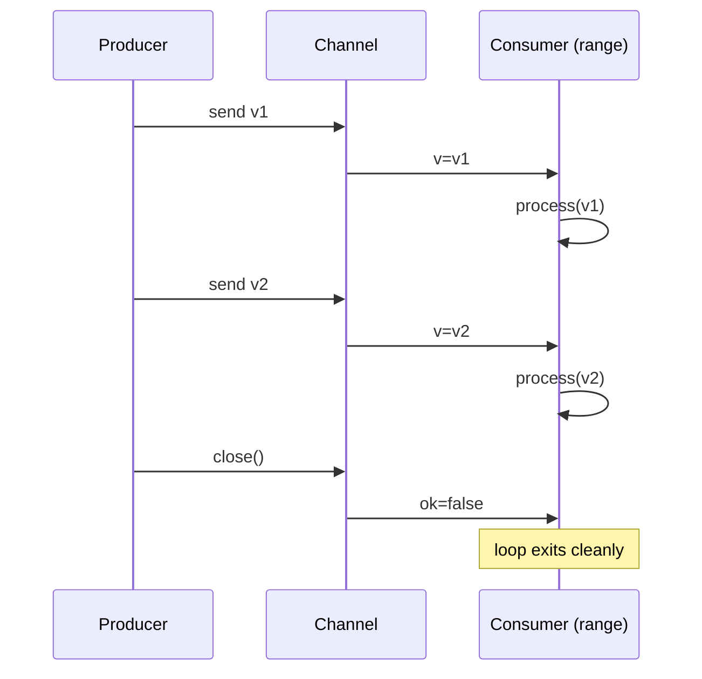

# Range Over Channels — Junior Level

## Table of Contents
1. [Introduction](#introduction)
2. [Prerequisites](#prerequisites)
3. [Glossary](#glossary)
4. [Core Concepts](#core-concepts)
5. [Real-World Analogies](#real-world-analogies)
6. [Mental Models](#mental-models)
7. [Pros & Cons](#pros-cons)
8. [Use Cases](#use-cases)
9. [Code Examples](#code-examples)
10. [Coding Patterns](#coding-patterns)
11. [Clean Code](#clean-code)
12. [Product Use / Feature](#product-use-feature)
13. [Error Handling](#error-handling)
14. [Security Considerations](#security-considerations)
15. [Performance Tips](#performance-tips)
16. [Best Practices](#best-practices)
17. [Edge Cases & Pitfalls](#edge-cases-pitfalls)
18. [Common Mistakes](#common-mistakes)
19. [Common Misconceptions](#common-misconceptions)
20. [Tricky Points](#tricky-points)
21. [Test](#test)
22. [Tricky Questions](#tricky-questions)
23. [Cheat Sheet](#cheat-sheet)
24. [Self-Assessment Checklist](#self-assessment-checklist)
25. [Summary](#summary)
26. [What You Can Build](#what-you-can-build)
27. [Further Reading](#further-reading)
28. [Related Topics](#related-topics)
29. [Diagrams & Visual Aids](#diagrams-visual-aids)

---

## Introduction
> Focus: "How do I read every value a channel sends me, in one loop, without forgetting to stop?"

A channel is a producer/consumer pipe. Somebody sends values in with `ch <- v`; somebody else takes them out with `v := <-ch`. Sooner or later you need to consume *every* value that arrives, in order, until the producer is done. That is what `for v := range ch` is for.

```go
for v := range ch {
    process(v)
}
```

That single line is the canonical consumer of any channel. It receives one value at a time, runs the body, then receives the next. When the channel is *closed and empty*, the loop exits cleanly. No counter to maintain, no `<-ch` to remember, no `if !ok { break }` to type. It is the most readable consumer pattern in Go, and the one you will write hundreds of times.

After reading this file you will:

- Know the exact syntax and meaning of `for v := range ch`
- Understand exactly when the loop exits (and when it never does)
- Be able to rewrite a `range` loop as a manual `for { v, ok := <-ch; if !ok { break }; ... }` and back
- Recognise the first big leak: nobody ever calls `close(ch)`, so the consumer blocks forever
- Use `range` to build a simple producer/consumer
- Know when to prefer `select` over `range`

You do not need to know about pipelines, fan-in, the runtime's `chanrecv2`, or Go 1.23's range-over-func yet. Those come later.

---

## Prerequisites

- **Required:** Comfort with channels — making them (`make(chan int)`), sending (`ch <- v`), receiving (`<-ch`), closing (`close(ch)`).
- **Required:** Familiarity with goroutines (`go f()`) and `sync.WaitGroup`.
- **Required:** Knowing what a deadlock is — the runtime can detect "all goroutines are asleep" and panic.
- **Helpful:** Having read the earlier subsections of *Channels*, especially *Closing Channels*. The two topics are joined at the hip: `range` exits when the channel is closed.
- **Helpful:** Knowing the two-value receive form `v, ok := <-ch`, since `range` is just a sugar over it.

If you can write a producer goroutine that sends 5 ints and a consumer that prints them, you are ready.

---

## Glossary

| Term | Definition |
|------|-----------|
| **`for v := range ch`** | A `for` loop that receives one value per iteration from channel `ch`. Exits when `ch` is closed and drained. |
| **Closed channel** | A channel on which `close(ch)` has been called. Sending to it panics; receiving returns the zero value with `ok == false` once drained. |
| **Drained** | A closed channel that has no more buffered values waiting. Receives from a drained closed channel return immediately with the zero value. |
| **Two-value receive** | `v, ok := <-ch`. `ok` is `false` if and only if the channel is closed *and* drained. |
| **Producer** | A goroutine that sends values into a channel. |
| **Consumer** | A goroutine that receives values from a channel. With `range`, often the *only* consumer. |
| **Goroutine leak** | A goroutine that never exits. A `range` loop over a never-closed channel is the textbook example. |
| **Deadlock** | A state where every goroutine is blocked, none can make progress. The runtime can detect and panic with "all goroutines are asleep — deadlock". |
| **Receive operator** | `<-ch`. Blocks until a value is available or the channel is closed. |
| **Nil channel** | A channel value that is `nil` (not initialised). Receiving from one blocks *forever*. `range` over `nil` blocks forever — no panic. |

---

## Core Concepts

### `range` on a channel = "give me every value until close"

`for v := range ch` is the consumer side of a closed-ended stream. Each iteration does one receive. The loop body runs once per value. When the channel is closed and no values remain, the loop exits and you fall through to whatever comes next.

```go
ch := make(chan int, 3)
ch <- 1
ch <- 2
ch <- 3
close(ch)

for v := range ch {
    fmt.Println(v)
}
// 1, 2, 3 — then loop exits
```

The order in which `1, 2, 3` come out is the order they went in. Channels are FIFO.

### The loop exits when the channel is closed AND drained

This is the single most important rule. Two conditions, both needed:

1. `close(ch)` has been called.
2. Every value already in the channel buffer has been received.

If the buffer still has values, the loop keeps receiving them. Only when there are no more values *and* the channel is closed does the loop exit.

If `close` is never called, the loop blocks indefinitely on the next receive. This is the most common bug.

### `range` only gives you the value, not the `ok`

Unlike a manual `v, ok := <-ch`, the `range` form gives you only the value. If you need to distinguish "channel closed" from "received zero value," you must use the manual form. `range` already handles the "channel closed" case by exiting, so most of the time you do not need `ok`.

### `range` is sugar for a hand-written loop

These two snippets are equivalent:

```go
// Sugar
for v := range ch {
    use(v)
}

// Desugared
for {
    v, ok := <-ch
    if !ok {
        break
    }
    use(v)
}
```

Compilers transform the first into something like the second (the actual codegen is covered at the professional level). Use the sugar; reach for the desugared form only if you need the `ok` for something the loop body does.

### One sender, many receivers — close is the sender's job

By convention, **the sender closes the channel.** Receivers must not close — if there are multiple receivers, only one can call `close` and the others would panic on a second `close`. If there are multiple senders, none of them can safely call `close` without coordination.

A `range` loop on the consumer side does *not* close the channel — it just exits when the channel is closed. Closing is the producer's responsibility.

### `range` on a `nil` channel blocks forever

```go
var ch chan int    // nil
for v := range ch { // blocks forever, no panic, no exit
    use(v)
}
```

A `nil` channel never delivers a value and never closes. The runtime cannot detect this as a deadlock unless every goroutine is stuck — but the leak is real. Never `range` a channel that might be `nil`.

### `range` over a buffered channel

Buffered channels work identically. The loop receives until the buffer is empty *and* the channel is closed. If the producer adds values faster than the consumer reads, the buffer fills; if the producer stops and closes, the consumer drains what is left and exits.

---

## Real-World Analogies

### Range is the customer at a conveyor belt

You stand at the end of a sushi conveyor. Plates come past; you pick them up and eat. When the kitchen flips the "closed" sign and the last plate has rolled past, you go home. You did not need a counter on how many plates there were — you simply ate until the belt was empty and closed. That is `range`.

### Range is reading a closed letter pile

Imagine a letter tray that other people drop letters into. You sit down to read every letter, one at a time, in order. The rule: when the postman puts up the "no more letters" flag *and* the tray is empty, you stop reading. If they never put up the flag, you sit there forever waiting for the next letter.

### Range is following a podcast feed until the show ends

A podcast pushes new episodes on an RSS feed. Your app downloads each one in order. When the producer says "the show is over" (close), and you have downloaded every remaining episode, you stop. If the show goes on hiatus without saying "ended," you wait forever.

### Manual `v, ok := <-ch` is the same conversation with a question

The two-value form is asking the producer: "is there another one? if not, is the show over?" The `range` form is the shortcut: "just give me everything until the show is over." Same conversation, fewer words.

---

## Mental Models

### Model 1: "Range = until close, then drain, then exit"

Carve this into memory:

```
for v := range ch:
    1. Receive a value.
    2. If channel was closed and no value came back, exit.
    3. Otherwise, run body, loop.
```

If you remember only one rule about `range`, remember: **a `range` loop on a channel exits exactly when a two-value receive on that channel returns `ok == false`.**

### Model 2: "Producer says when, consumer says how"

The producer decides *when* the stream ends — by closing. The consumer decides *how* to process each value — in the loop body. Two separate jobs. Mixing them (consumer closes) is a code smell.

### Model 3: "Range is the simplest pipeline stage"

A pipeline stage is a function that reads from an input channel, processes, writes to an output channel:

```go
func stage(in <-chan int, out chan<- int) {
    defer close(out)
    for v := range in {
        out <- transform(v)
    }
}
```

That single function is the building block of every Go data-processing pipeline. `range` makes it three lines.

### Model 4: "If close is missing, range is a leak"

Whenever you see `for v := range ch`, ask: "where does `ch` get closed?" If you cannot point to the line, you have a goroutine leak in the making. Train your eye to read `for range` and `close` as a *pair*.

---

## Pros & Cons

### Pros

- **One-liner consumer.** Replaces three lines of manual receive + break + check.
- **No off-by-one.** You cannot accidentally read one too many or one too few.
- **No `ok` to handle.** The loop reads the `ok` for you and exits cleanly.
- **Compiler-optimised.** Codegen is identical to the desugared loop; no runtime overhead.
- **Reads like English.** "For each value in the channel, do this."
- **Works for buffered and unbuffered channels** with no syntax change.

### Cons

- **No way to break early on a side condition.** If you need "stop after 100 values" or "stop on context cancel," you need `select` or a `break` with extra logic.
- **No `ok` exposed.** Cannot tell "got zero value vs. channel closed" inside the loop.
- **Leak prone.** If the channel is never closed, the loop blocks forever and the goroutine leaks.
- **Cannot range over multiple channels.** For multiplexing, you need `select`.
- **Hides the receive.** The receive operation is invisible in the loop header, which can confuse beginners reading goroutine code.

---

## Use Cases

| Scenario | Why `range` is the right choice |
|---|---|
| Consume all jobs from a worker pool channel | Workers `range` over the jobs channel; main closes the channel when input ends; workers exit naturally. |
| Pipeline stage | Each stage `range`s over its input and writes to its output. |
| Fan-in via a single output | A merger goroutine `range`s over a merged channel. |
| Background log writer | A single consumer `range`s the log channel and writes lines to disk; producer closes on shutdown. |
| Drain on shutdown | After the producer closes, the consumer drains via `range` and exits — clean finalisation. |

| Scenario | Why `range` is *not* the right choice |
|---|---|
| You need to also listen for cancellation | Use `select` with a `case <-ctx.Done()`. `range` cannot do this. |
| You read from multiple channels | Use `select`. `range` is single-channel only. |
| You need to stop after N values | Manual loop with a counter, or `select` + counter. |
| The channel may never close | Use `select` + timeout or context, or change the design so closing is guaranteed. |
| You want non-blocking poll | `range` always blocks. Use `select` with `default`. |

---

## Code Examples

### Example 1: The minimal `range` consumer

```go
package main

import "fmt"

func main() {
    ch := make(chan int, 3)
    ch <- 10
    ch <- 20
    ch <- 30
    close(ch)

    for v := range ch {
        fmt.Println(v)
    }
    fmt.Println("done")
}
```

Output: `10`, `20`, `30`, `done`. The loop exits as soon as the closed-and-drained channel signals end.

### Example 2: Producer in a goroutine, consumer in `main`

```go
package main

import "fmt"

func produce(ch chan<- int) {
    defer close(ch)
    for i := 1; i <= 5; i++ {
        ch <- i
    }
}

func main() {
    ch := make(chan int)
    go produce(ch)
    for v := range ch {
        fmt.Println(v)
    }
}
```

Output: `1, 2, 3, 4, 5`. The producer goroutine closes the channel after the last send; `range` exits.

### Example 3: Forgetting to close — the canonical leak

```go
package main

import "fmt"

func produce(ch chan<- int) {
    for i := 1; i <= 3; i++ {
        ch <- i
    }
    // FORGOT: close(ch)
}

func main() {
    ch := make(chan int)
    go produce(ch)
    for v := range ch {
        fmt.Println(v)
    }
    fmt.Println("done — never printed")
}
```

The consumer reads `1, 2, 3`, then waits for a fourth value. The producer has exited and no one else will send. The runtime sees that every goroutine is blocked and panics:

```
fatal error: all goroutines are asleep - deadlock!
```

Fix: add `defer close(ch)` to `produce`.

### Example 4: The desugared form

```go
for {
    v, ok := <-ch
    if !ok {
        break
    }
    fmt.Println(v)
}
```

This loop is exactly equivalent to `for v := range ch { fmt.Println(v) }`. Use this form when you need access to `ok` inside the body — for example, to distinguish "closed" from "zero value received."

### Example 5: Multiple producers, one consumer

```go
package main

import (
    "fmt"
    "sync"
)

func produce(id int, ch chan<- int, wg *sync.WaitGroup) {
    defer wg.Done()
    for i := 0; i < 3; i++ {
        ch <- id*10 + i
    }
}

func main() {
    ch := make(chan int, 9)
    var wg sync.WaitGroup
    for i := 1; i <= 3; i++ {
        wg.Add(1)
        go produce(i, ch, &wg)
    }
    go func() {
        wg.Wait()
        close(ch)
    }()
    for v := range ch {
        fmt.Println(v)
    }
}
```

Each producer sends 3 values. None of them can safely close the channel (the others might still be sending). A separate "closer" goroutine waits for all producers and then closes. This is the standard pattern when you have multiple senders.

### Example 6: Pipeline stage

```go
func double(in <-chan int) <-chan int {
    out := make(chan int)
    go func() {
        defer close(out)
        for v := range in {
            out <- v * 2
        }
    }()
    return out
}

func main() {
    nums := make(chan int, 5)
    for i := 1; i <= 5; i++ {
        nums <- i
    }
    close(nums)

    for v := range double(nums) {
        fmt.Println(v)
    }
}
```

`double` is a pipeline stage: receive, transform, send, close when done. Each stage in a pipeline looks like this.

### Example 7: Range and break

```go
for v := range ch {
    if v < 0 {
        break
    }
    fmt.Println(v)
}
```

`break` exits the loop early — but the channel may still have values, and may not be closed. Whoever is producing must learn that you have stopped consuming, or they will block on send. (For unbuffered channels: the next send blocks; for buffered, sends block once the buffer is full.) This is one reason `range` is best paired with a clean close discipline.

### Example 8: Range with buffered channel as a queue

```go
queue := make(chan Job, 100)

// Many producers add jobs:
go enqueue(queue)
// One consumer drains:
for job := range queue {
    process(job)
}
```

Buffered channels act like bounded queues. `range` drains them in FIFO order.

### Example 9: Range over `nil` — BLOCKS FOREVER

```go
var ch chan int   // nil
for v := range ch {
    fmt.Println(v) // never reached
}
fmt.Println("done") // never reached
```

This is a silent bug. The runtime can detect it as a deadlock *if every goroutine is stuck*; if some other goroutine is running, the leak goes undetected. Always initialise channels with `make`.

### Example 10: A range that *should* break, with a cancel pattern

```go
done := make(chan struct{})

go func() {
    for v := range ch {
        if shouldStop() {
            close(done) // signal to producer
            return
        }
        process(v)
    }
}()
```

A simple cancel pattern. More commonly, you would use `select` with a `case <-ctx.Done()` instead — covered at middle level.

---

## Coding Patterns

### Pattern 1: Producer with `defer close`

```go
func produce(out chan<- int) {
    defer close(out)
    for _, v := range data {
        out <- v
    }
}
```

The `defer` guarantees the channel closes when the function returns, including on panic. This is the canonical producer skeleton.

### Pattern 2: Consumer with `range`

```go
func consume(in <-chan int) {
    for v := range in {
        process(v)
    }
}
```

The matching consumer. No counter, no break, no `ok` — just process every value until the producer closes.

### Pattern 3: Single-stage pipeline

```go
func transform(in <-chan A, fn func(A) B) <-chan B {
    out := make(chan B)
    go func() {
        defer close(out)
        for a := range in {
            out <- fn(a)
        }
    }()
    return out
}
```

A generic transformation stage. Chain several together for a multi-stage pipeline.

### Pattern 4: Multi-producer fan-in with closer goroutine

```go
ch := make(chan int)
var wg sync.WaitGroup
for _, src := range sources {
    wg.Add(1)
    go func(src Source) {
        defer wg.Done()
        for v := range src.Read() {
            ch <- v
        }
    }(src)
}
go func() { wg.Wait(); close(ch) }()

for v := range ch {
    process(v)
}
```

The N producers each `range` their input, fan into the shared `ch`. A separate closer waits for them all and closes `ch`. The consumer `range`s and exits cleanly.

### Pattern 5: Buffered queue with bounded producer

```go
jobs := make(chan Job, 100)
for _, j := range allJobs {
    jobs <- j // blocks if buffer is full — back-pressure
}
close(jobs)

// Consumer:
for j := range jobs {
    process(j)
}
```

The buffer size bounds memory; the close at the end signals the consumer to exit.

---

## Clean Code

- **Always pair `range` with a known `close`.** If you cannot tell where a channel is closed, the consumer is leaking.
- **Sender owns close.** The sending side is responsible for closing. The `range` side never closes.
- **Use `defer close(ch)`** at the top of the producer function. It is the cleanest way to ensure the channel closes on every exit path.
- **One producer = one closer; many producers = one extra closer goroutine.** Never have multiple goroutines racing to close.
- **Make channels with `make`, not as `var ch chan T`.** A `nil` channel makes `range` block silently.
- **Prefer `range` over manual receive** unless you need `ok`. The sugar is clearer and identical at runtime.
- **Document the close discipline.** Comment on the channel: "// closed by the producer when ..." so future readers understand.

---

## Product Use / Feature

| Product feature | How `range` over channels delivers it |
|---|---|
| Streaming HTTP responses | A handler `range`s over an event channel and writes each event to the wire until the producer closes (end of stream). |
| Worker pool | Each worker `range`s the jobs channel; the dispatcher closes the channel when input is exhausted. |
| Log aggregator | Producers send log lines into a buffered channel; a single writer `range`s and flushes to a file. |
| Real-time chart | A goroutine `range`s a metrics channel and pushes data points to the UI until the connection closes. |
| Batch processor | A pipeline of `range`-based stages: read CSV → parse → transform → write DB. Each stage closes its output when done. |
| Graceful shutdown drain | On shutdown, the producer closes its output; consumers `range` to the end and exit, ensuring no work is lost. |

---

## Error Handling

`range` itself produces no errors. But the values flowing through the channel often need error tracking. Two common shapes:

### 1. Channel of result structs

```go
type Result struct {
    Val int
    Err error
}

for r := range results {
    if r.Err != nil {
        log.Println("error:", r.Err)
        continue
    }
    use(r.Val)
}
```

The error rides alongside the value. The loop handles each independently.

### 2. Separate error channel

```go
go produce(values, errs)
for {
    select {
    case v, ok := <-values:
        if !ok {
            return
        }
        use(v)
    case err := <-errs:
        log.Println("error:", err)
    }
}
```

Here `range` is not enough — you need `select`. Errors are out-of-band. Use this when errors are rare and important enough to interrupt the value stream.

### Recover at the boundary

```go
go func() {
    defer func() {
        if r := recover(); r != nil {
            log.Printf("producer panic: %v", r)
        }
        close(out) // close even on panic
    }()
    produce(out)
}()
```

Without the `close(out)` in `defer`, a panicking producer leaves the consumer hung.

---

## Security Considerations

- **Unbounded producer = memory exhaustion.** If a producer sends faster than the consumer reads and the channel is unbuffered or large-buffered, you can run out of memory under hostile input. Always size channels or use back-pressure.
- **`range` over an attacker-controlled channel is a DoS surface.** A malicious component that never closes the channel will leak the consumer goroutine. Always have a deadline or context.
- **Sensitive data in transit.** Values flowing through a channel live in process memory. If they are secrets, treat the goroutine and the channel as part of your security boundary.
- **Panic in producer with no `defer close`.** Producer panics, consumer hangs, request handler holds resources. Always `defer close` and recover at the boundary.

---

## Performance Tips

- **Receiving in a `range` loop is the same cost as a manual `v, ok := <-ch`.** No overhead, no allocation. The two compile down identically.
- **Larger buffer reduces context switches.** An unbuffered channel forces a synchronisation per send. A buffer of 64 or 256 lets producer and consumer batch.
- **Process in batches inside the loop body.** If `process(v)` is fast, the loop spends most of its time receiving. Accumulating a batch in a slice and processing it in chunks can be faster.
- **Avoid creating a new goroutine *inside* the `range` body** unless you bound concurrency. A `range` loop that spawns one goroutine per value can balloon into thousands of leaked goroutines.

Detailed numbers and benchmarks are at senior and professional levels.

---

## Best Practices

1. Always close the channel from the sender side, with `defer close(ch)` near the top of the producer function.
2. Always pair `for v := range ch` with a documented close path. If you cannot find the close, fix the design.
3. Never close a channel you do not own. Never close a channel twice.
4. For multiple senders, use one extra closer goroutine that waits on a `WaitGroup` and then closes.
5. Never `range` a `nil` channel. Use `make` to construct.
6. Prefer `range` over the manual `v, ok := <-ch; if !ok { break }` form unless you need `ok` in the body.
7. If you need to stop the loop on a side condition (context cancel, timeout, multiple channels), switch to `select`.
8. Wrap the producer in `defer recover()` if it can panic, and always `close` in the `defer` to release consumers.
9. Size buffers to match throughput needs; do not default to unbuffered without thinking.
10. Code review checklist: every `range ch` should be findable as a pair with a `close(ch)` somewhere reachable.

---

## Edge Cases & Pitfalls

### `range` over an unclosed channel never exits

```go
ch := make(chan int)
go func() { ch <- 1 }()
for v := range ch {  // blocks after receiving 1
    fmt.Println(v)
}
```

Hangs. The runtime may or may not detect deadlock depending on what other goroutines are doing.

### `range` over a `nil` channel

```go
var ch chan int
for v := range ch { /* never runs */ }
```

Blocks forever, silently.

### Sending on a closed channel panics

```go
close(ch)
ch <- 5 // panic: send on closed channel
```

`range` is on the consumer side and is safe from this — but if your design has the closer racing with senders, the senders will crash.

### Closing a closed channel panics

```go
close(ch)
close(ch) // panic: close of closed channel
```

Avoid by having exactly one owner do the close, exactly once.

### `range` does not break on the first error

The body runs for every value. If you `continue` on errors, you keep consuming. To stop early, `break` or `return`. But then the producer may block on the next send if the channel is unbuffered.

### Break leaves the producer hanging

```go
for v := range ch {
    if condition(v) {
        break // producer may now block forever
    }
}
```

After `break`, no one reads `ch`. Unless the producer also checks for cancellation, the next `ch <- ...` blocks indefinitely. Use a separate cancellation channel or `context.Context`.

### A second range on the same channel reads nothing if drained

```go
for v := range ch { ... } // drains
for v := range ch { ... } // exits immediately — channel still closed
```

A closed channel is permanently closed. The second `range` exits without iterating.

### Range and `defer wg.Done` interplay

```go
go func() {
    defer wg.Done()
    for v := range ch {
        process(v)
    }
}()
```

If `ch` is never closed, the goroutine never exits, `wg.Done` never runs, and `wg.Wait()` blocks forever. The whole shutdown depends on the channel actually closing.

---

## Common Mistakes

| Mistake | Fix |
|---|---|
| Producer forgets to close | Add `defer close(ch)` at the top of the producer. |
| Consumer (range side) calls `close(ch)` | Move the `close` to the producer. The consumer must not close. |
| Multiple senders, one of them calls `close` | Use a dedicated closer goroutine that waits for all senders, then closes. |
| `range` over a `nil` channel | Always `make(chan T)`. Never declare `var ch chan T` and use without initialising. |
| Closing twice | Use `sync.Once` or simple "owner closes exactly once" discipline. |
| Break leaves producer blocked | Add a cancellation channel or context; producer checks before each send. |
| Spawning a goroutine per value inside `range` body | Bound concurrency with a semaphore or worker pool. |
| Using `range` when `select` is needed | Switch to `select` when you also need timeouts, cancellation, or multiple inputs. |

---

## Common Misconceptions

> *"`range` over a channel reads all values atomically."* — No. It reads them one at a time, in order, in separate receive operations.

> *"`range` exits when the channel is empty."* — No. It exits when the channel is *closed and empty*. An empty but open channel makes the loop block, not exit.

> *"`close` ends the loop immediately."* — Not quite. It ends the loop *after* any remaining buffered values are drained. The loop sees `ok == false` only after the buffer is empty.

> *"`range` works on every channel — including `nil`."* — `range` on `nil` blocks forever. The compiler does not warn.

> *"I should `close` the channel after `range` to clean up."* — No. The receiver does not close. The sender already did (or should have).

> *"`range` is slower than a manual loop."* — No. They compile to identical code.

> *"`range` will catch a panic in the sender."* — No. Goroutines are isolated. The producer must recover its own panics; if it dies without closing, the consumer hangs.

> *"`for range ch` returns the index, like for-range on a slice."* — No. Channels have no index. You get only the value.

---

## Tricky Points

### `range` reads only the value, not `ok`

The two-value receive `v, ok := <-ch` distinguishes closed-and-drained from a real receive. `range` hides `ok` — when `ok` would be `false`, the loop simply exits. You never see the false. If you need it, drop to the manual form.

### A closed channel can still receive values until drained

```go
ch := make(chan int, 3)
ch <- 1; ch <- 2; ch <- 3
close(ch)

for v := range ch {
    fmt.Println(v) // 1, 2, 3
}
// exits after the third value
```

`close` does not flush. It marks the channel as closed. The buffered values are still there to be received.

### `range` and the zero value

If the channel's element type has a meaningful zero value (e.g., `int` and `0`, or `string` and `""`), you cannot distinguish a real zero value from "channel was closed" *inside the `range` body* — but `range` itself does the distinction for you: it exits on close. So this only matters if you mix `range` with extra logic that cares.

### Argument evaluation of the channel expression

```go
for v := range getChannel() {
    ...
}
```

`getChannel()` is called *once*, before the loop starts. The result is the channel ranged over. The function is *not* called again per iteration.

### `range` is not equivalent to `range slice` in semantics

`range slice` iterates over a known length, gives index + value, and ends when the slice is exhausted. `range chan` iterates indefinitely until close, gives value only, and can block. They share a keyword but very different semantics.

### Receiving on a closed channel never blocks

Once a channel is closed and drained, every receive returns immediately with the zero value and `ok == false`. `range` sees `ok == false` and exits. This is why a `range` over a closed empty channel exits in zero iterations, not blocking.

---

## Test

```go
// range_test.go
package rangechan_test

import (
    "sync"
    "testing"
)

func TestRangeReceivesAllValues(t *testing.T) {
    ch := make(chan int, 3)
    for i := 1; i <= 3; i++ {
        ch <- i
    }
    close(ch)

    var got []int
    for v := range ch {
        got = append(got, v)
    }
    if len(got) != 3 || got[0] != 1 || got[1] != 2 || got[2] != 3 {
        t.Fatalf("expected [1 2 3], got %v", got)
    }
}

func TestRangeExitsOnClose(t *testing.T) {
    ch := make(chan int)
    done := make(chan struct{})
    go func() {
        for range ch {
        }
        close(done)
    }()
    close(ch)
    <-done // pass if reached, hang if range did not exit
}

func TestRangeWithMultipleProducers(t *testing.T) {
    ch := make(chan int, 100)
    var wg sync.WaitGroup
    for i := 0; i < 5; i++ {
        wg.Add(1)
        go func(id int) {
            defer wg.Done()
            for j := 0; j < 10; j++ {
                ch <- id*10 + j
            }
        }(i)
    }
    go func() { wg.Wait(); close(ch) }()

    count := 0
    for range ch {
        count++
    }
    if count != 50 {
        t.Fatalf("expected 50 values, got %d", count)
    }
}
```

Run with:

```bash
go test -race ./...
```

The race detector catches the typical mistakes — closing twice, sending after close, simultaneous close-and-send.

---

## Tricky Questions

**Q.** What does this print?

```go
ch := make(chan int, 2)
ch <- 1
ch <- 2
close(ch)
for v := range ch {
    fmt.Println(v)
}
```

**A.** `1` then `2`, then the loop exits. Closing does not lose buffered values; the loop drains then exits.

---

**Q.** What happens here?

```go
ch := make(chan int)
go func() {
    ch <- 1
    ch <- 2
}()
for v := range ch {
    fmt.Println(v)
}
```

**A.** Deadlock. The producer sends two values then exits, never closing. The consumer reads `1, 2` and then waits for a third. Every goroutine is blocked. Runtime panics: `all goroutines are asleep`.

Fix: `defer close(ch)` in the producer.

---

**Q.** Will this `range` ever execute the body?

```go
var ch chan int
go func() { ch <- 1 }()
for v := range ch {
    fmt.Println(v)
}
```

**A.** No. `ch` is `nil`; sends on a `nil` channel block forever, and the receiver also blocks forever. The body never runs and the program deadlocks.

---

**Q.** What does this print?

```go
ch := make(chan int, 3)
close(ch)
for v := range ch {
    fmt.Println(v)
}
fmt.Println("done")
```

**A.** Just `done`. The channel is closed and empty (no values were sent before close). `range` exits immediately, body runs zero times.

---

**Q.** What is wrong here?

```go
ch := make(chan int)
go func() {
    for i := 0; i < 5; i++ {
        ch <- i
    }
    close(ch)
}()
for v := range ch {
    fmt.Println(v)
    break
}
```

**A.** After `break`, no one is reading `ch`. The producer's next `ch <- 1` blocks forever. The producer never reaches `close(ch)`. The producer goroutine leaks.

Fix: use a cancellation channel or `context.Context`, and have the producer check before each send. Or use a buffered channel sized to hold all values.

---

## Cheat Sheet

```go
// Standard consumer
for v := range ch {
    use(v)
}

// Producer pattern
func produce(out chan<- T) {
    defer close(out)
    for _, v := range source {
        out <- v
    }
}

// Pipeline stage
func stage(in <-chan A) <-chan B {
    out := make(chan B)
    go func() {
        defer close(out)
        for a := range in {
            out <- transform(a)
        }
    }()
    return out
}

// Multi-producer closer
var wg sync.WaitGroup
for _, p := range producers {
    wg.Add(1)
    go func(p Producer) { defer wg.Done(); p.Run(ch) }(p)
}
go func() { wg.Wait(); close(ch) }()

// Equivalent of range, manually
for {
    v, ok := <-ch
    if !ok { break }
    use(v)
}

// Always use make, never bare var:
ch := make(chan int)          // OK
ch := make(chan int, 100)     // OK (buffered)
var ch chan int               // DANGER: nil channel
```

---

## Self-Assessment Checklist

- [ ] I can write a producer goroutine that uses `defer close(out)` and a consumer that uses `for v := range out`.
- [ ] I can rewrite `for v := range ch { use(v) }` as a manual `for { v, ok := <-ch; if !ok { break }; use(v) }` and back.
- [ ] I know that `range` exits when the channel is closed *and* drained, in that order.
- [ ] I know that `range` over a `nil` channel blocks forever.
- [ ] I know that the sender, not the receiver, is responsible for closing.
- [ ] I can describe the pattern for "multiple senders, one consumer" with a closer goroutine.
- [ ] I know that `break` in a `range` loop can leave the producer blocked, and how to avoid that.
- [ ] I can spot a `range` over a channel that nobody closes — and call it a leak.
- [ ] I know when to use `range` and when I must reach for `select`.
- [ ] I have run a small program with `go test -race` and observed it pass.

---

## Summary

`for v := range ch` is the consumer of every channel-based stream in Go. It reads values one at a time, in order, until the channel is closed and drained, then exits. It is syntactic sugar for a manual `for { v, ok := <-ch; if !ok { break }; ... }`, identical at the machine level but easier to read.

The most important rule: **the sender closes, and the receiver `range`s until close.** If no one closes, the receiver leaks. If the receiver `break`s early, the sender may leak. The two must agree.

Pair `range` with `defer close` in the producer. For multiple producers, use an extra closer goroutine. For more complex patterns (cancellation, timeouts, multiple inputs), upgrade to `select`.

You now have the consumer half of every producer/consumer, pipeline, and fan-in in Go.

---

## What You Can Build

After mastering this material:

- A simple bounded producer/consumer where the consumer drains via `range`.
- A pipeline of two or three stages, each a goroutine running `for v := range in`.
- A worker pool of N goroutines, all reading jobs from a shared channel.
- A fan-in merger where M producer goroutines write to one channel and a consumer `range`s it.
- A streaming HTTP handler that pushes events from a channel to the wire until close.
- A unit-tested ETL pipeline where each stage is a goroutine and `range` makes the consumers tiny.

---

## Further Reading

- The Go Programming Language Specification — *For statements with range clause*: <https://go.dev/ref/spec#For_statements>
- Effective Go — *Channels*: <https://go.dev/doc/effective_go#channels>
- The Go Blog — *Go Concurrency Patterns: Pipelines and cancellation*: <https://go.dev/blog/pipelines>
- The Go Blog — *Share Memory By Communicating*: <https://go.dev/blog/codelab-share>
- Dave Cheney — *Channel Axioms*: <https://dave.cheney.net/2014/03/19/channel-axioms>

---

## Related Topics

- Closing Channels — exactly when, and by whom, the channel is closed (the other half of `range`)
- Select Statement — multiplexing multiple channel operations when `range` is not enough
- Nil Channels — what happens when the channel is `nil` and why `range` blocks
- Buffered vs Unbuffered Channels — how buffer size affects `range` semantics
- Worker Pools — the canonical use of `range` over a jobs channel
- Channel Direction — `<-chan` and `chan<-` types as documented contracts
- Goroutines — the producer/consumer split of a `range`-based design

---

## Diagrams & Visual Aids

### Range lifecycle

```
producer:        send v1, send v2, send v3, close(ch)
                  |        |        |          |
                  v        v        v          v
channel ch:      [v1]----[v2]----[v3]----[closed]
                  |        |        |          |
                  v        v        v          v
consumer:        v=v1    v=v2    v=v3     ok=false -> exit loop
                 body    body    body
```

### What `range` does each iteration

```
loop:
   v, ok = <-ch    (block until value, or until closed-and-drained)
   if !ok: exit
   body(v)
   goto loop
```

### Producer/consumer with `range`



### When `range` blocks vs exits

```
+----------------+-----------+---------+
| state of ch    | has data? | range:  |
+----------------+-----------+---------+
| open, empty    | no        | block   |
| open, has data | yes       | receive |
| closed, empty  | no        | exit    |
| closed, drained| no        | exit    |
| closed, has data | yes     | receive |
| nil            | n/a       | block forever |
+----------------+-----------+---------+
```

### Pipeline of `range` stages

```
[source]  --ch1-->  [stage1: range ch1]  --ch2-->  [stage2: range ch2]  --ch3-->  [sink: range ch3]
   close ch1 ---^         close ch2 ---^                close ch3 ---^
```

Each stage closes its output when its input is drained. The close cascades from source to sink, draining the entire pipeline.

### Mental rule

```
for v := range ch { ... }   <==>   for { v, ok := <-ch; if !ok { break }; ... }
```

Two forms, identical semantics, identical machine code.
