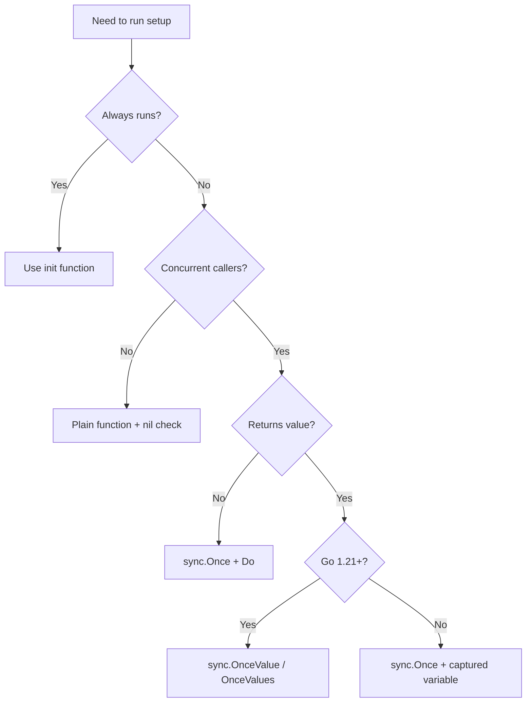

# sync.Once — Junior Level

← Back to sync.Once

## Table of Contents
1. [Introduction](#introduction)
2. [Prerequisites](#prerequisites)
3. [Glossary](#glossary)
4. [Core Concepts](#core-concepts)
5. [Real-World Analogies](#real-world-analogies)
6. [Mental Models](#mental-models)
7. [Pros & Cons](#pros-cons)
8. [Use Cases](#use-cases)
9. [Code Examples](#code-examples)
10. [Coding Patterns](#coding-patterns)
11. [Clean Code](#clean-code)
12. [Product Use / Feature](#product-use-feature)
13. [Error Handling](#error-handling)
14. [Security Considerations](#security-considerations)
15. [Performance Tips](#performance-tips)
16. [Best Practices](#best-practices)
17. [Edge Cases & Pitfalls](#edge-cases-pitfalls)
18. [Common Mistakes](#common-mistakes)
19. [Common Misconceptions](#common-misconceptions)
20. [Tricky Points](#tricky-points)
21. [Test](#test)
22. [Tricky Questions](#tricky-questions)
23. [Cheat Sheet](#cheat-sheet)
24. [Self-Assessment Checklist](#self-assessment-checklist)
25. [Summary](#summary)
26. [What You Can Build](#what-you-can-build)
27. [Further Reading](#further-reading)
28. [Related Topics](#related-topics)
29. [Diagrams & Visual Aids](#diagrams-visual-aids)

---

## Introduction

> Focus: "How do I make sure this expensive setup runs exactly once, no matter how many goroutines hit it at the same time?"

`sync.Once` is a tiny, zero-configuration primitive that solves one of the most common problems in concurrent Go programs: running a piece of code *exactly once*, even when many goroutines race to invoke it. The whole API is a single method:

```go
once.Do(func() {
    // this runs exactly once across the lifetime of `once`
})
```

You declare a `sync.Once` value, you call `once.Do(f)` from any number of goroutines, and the runtime guarantees that:

1. The function `f` runs **exactly once**.
2. All concurrent callers of `Do` **block until the first call returns**.
3. After `Do` returns, every caller is guaranteed to see all writes that `f` performed (the "happens-before" rule).

That third point is the quiet magic. Without it, a singleton built with `Once` could compile but expose a half-initialised object to a racing goroutine. With `Once`, the moment `Do` returns to *any* goroutine, the work is done and visible.

After reading this file you will:

- Know what `sync.Once` is, what `Do` does, and what it does not do.
- Be able to write a thread-safe lazy singleton in five lines.
- Know why `defer once.Do(...)` is almost always a bug.
- Recognise the "retry after error" anti-pattern.
- Know about Go 1.21's `OnceFunc`, `OnceValue`, `OnceValues` (a brief introduction; middle level digs deeper).
- Have a feel for when `Once` is overkill and when `init()` would be cleaner.

You do not need to understand the internal `done uint32` flag, the mutex slow path, or the memory model rules yet. Those come in the senior and professional levels. This file is about the moment you write `once.Do(f)` and trust the runtime to do its job.

---

## Prerequisites

- **Required:** A Go installation, 1.18 or newer (1.21+ recommended to use `OnceFunc`, `OnceValue`, `OnceValues`). Check with `go version`.
- **Required:** Comfort with `func()` literals — the argument to `Do` is a function value, often a closure.
- **Required:** Basic awareness of goroutines and the data-race problem. If you have never spawned a goroutine, read the goroutines section first.
- **Helpful:** Familiarity with `sync.Mutex` and `sync.WaitGroup`. `Once` lives next to them in the same package and shares the philosophy of "tiny primitive, big leverage."
- **Helpful:** Some exposure to lazy initialisation in another language — the Java `synchronized` block, Python's module import lock, C++'s `std::call_once`. They all solve the same problem; `Once` is Go's answer.

If you can write `var m sync.Mutex; m.Lock(); ...; m.Unlock()` and you know what a closure is, you are ready.

---

## Glossary

| Term | Definition |
|------|-----------|
| **`sync.Once`** | A struct in the standard library `sync` package that ensures a function passed to `Do` runs exactly once. The zero value is ready to use. |
| **`Do(f func())`** | The only method. Calling `once.Do(f)` runs `f` exactly once across all goroutines that share this `once` value. Subsequent calls are no-ops. |
| **`f`** | The function argument to `Do`. It takes no parameters and returns nothing. Wrap a more complex call in a closure to capture state. |
| **Lazy initialisation** | Deferring the construction of a value until the first time it is used, rather than at program startup. `Once` is the standard tool. |
| **Singleton** | A value that exists in exactly one instance for the lifetime of the program. Often built with `Once` + a package-level variable. |
| **Happens-before** | The Go memory model guarantee that operations in `f` are visible to all callers after `Do` returns. Without it, lazy singletons would expose half-built objects. |
| **`OnceFunc`** (Go 1.21+) | A helper that wraps a `func()` so it can only run once. Returns a new function with the same signature. |
| **`OnceValue[T]`** (Go 1.21+) | Wraps a `func() T`. The first call runs the function and caches the return value. All subsequent calls return the cached value. |
| **`OnceValues[T1, T2]`** (Go 1.21+) | Like `OnceValue` but for functions returning two values, typically a value plus an error. |
| **`init()`** | A special Go function that runs once at package load time, before `main`. An alternative to `Once` when the initialisation can happen unconditionally at startup. |

---

## Core Concepts

### `Do` runs the function exactly once

The contract is simple but precise:

```go
var once sync.Once
once.Do(setup)
once.Do(setup)   // no-op
once.Do(setup)   // no-op
```

After the first call to `once.Do(setup)` returns, `setup` has run, and every subsequent call returns immediately without running `setup`. The same is true across goroutines: if 100 goroutines simultaneously call `once.Do(setup)`, exactly one runs `setup`, and the other 99 block until that one returns.

```go
package main

import (
    "fmt"
    "sync"
)

var (
    once   sync.Once
    config string
)

func loadConfig() {
    fmt.Println("loading config (expensive)")
    config = "loaded"
}

func main() {
    once.Do(loadConfig)   // prints "loading config..."
    once.Do(loadConfig)   // no output
    once.Do(loadConfig)   // no output
    fmt.Println(config)   // "loaded"
}
```

### `Do` blocks concurrent callers until `f` returns

Imagine ten goroutines all calling `once.Do(f)` at exactly the same instant. The runtime picks one — the "winner" — and runs `f` on its goroutine. The other nine are parked on a mutex until `f` finishes. Once it does, they all wake up and return from `Do`, having done no work themselves.

This blocking behaviour is essential. Without it, a caller could see `Do` "return" before `f` had finished, and could start using a half-initialised value. With it, every caller sees a fully initialised result.

### `Once` is single-use

The contract is: "exactly once for the lifetime of this `sync.Once` value." There is no reset. Even if `f` panics, `Once` considers itself "done." You cannot retry by calling `Do` again — the next call is a no-op.

```go
var once sync.Once
once.Do(func() { panic("boom") }) // panics
once.Do(func() { ... })           // does NOT run; once is "done"
```

This is the most important behavioural detail of `Once` and the source of one of the most common bugs. We will return to it.

### `Once` is the zero value, no constructor needed

`sync.Once{}` is ready to use. There is no `NewOnce()`, no constructor, no setup. Declare it at package level, in a struct field, or as a local — the zero value works.

```go
var once sync.Once                    // package level
type Service struct{ once sync.Once } // struct field
```

A `sync.Once` declared in a function frame, though syntactically legal, is almost always wrong: each call creates a fresh `Once`, so "exactly once" means "exactly once per call," which is just "every time."

### The function passed to `Do` takes no arguments and returns nothing

The signature of `Do` is:

```go
func (*Once) Do(f func())
```

`f` is a `func()`. No parameters, no return. To pass arguments or get a return value, use a closure:

```go
once.Do(func() {
    cfg = parseConfig(path)
})
```

Or, in Go 1.21+, use `OnceValue` (covered at middle level):

```go
load := sync.OnceValue(func() *Config {
    return parseConfig(path)
})
cfg := load() // expensive on first call, cheap on every subsequent call
```

---

## Real-World Analogies

### The hotel key card desk

You arrive at a conference and walk to the desk. There is one box of key cards. The clerk asks for your name. If your group has not yet been issued cards, the clerk opens the box, prints the cards, and hands them out — *to you and to everyone else from your group who is waiting in line*. If your group already has cards, the clerk just hands you yours from the stack. The box opens once. After that, every request is a quick lookup.

`Once` is the box. `Do(loadKeys)` opens it. Every `Do` afterwards is a no-op.

### The shared kettle in a small office

Five colleagues all want tea. The first one to reach the kettle fills it and presses the button. The other four arrive and see the kettle is already boiling — they wait. When the water is ready, all five pour. The kettle was filled exactly once; everyone got their tea.

`Once` is the kettle. The first goroutine fills it. The others wait. After the water is poured, no one tries to fill it again — the kettle stays "done" for the rest of the day.

### The classroom whiteboard

A teacher walks into a classroom and writes the day's agenda on the board. Twenty students walk in over the next ten minutes; the teacher does not rewrite the agenda each time. Whoever arrives reads what is already there.

`Once.Do` is the teacher writing on the board. The act happens once. All readers see the same result.

### The "Have you seen the safety video?" sticker

An aircraft mechanic puts a sticker on the wing once each maintenance cycle. Every technician who works on the plane that cycle sees the sticker; none of them puts a new one on. At the start of the next cycle, a fresh `Once` is created — but during this cycle, the sticker is the sticker.

`Once` belongs to a *value lifetime*. Different `Once` values are different cycles.

---

## Mental Models

### Model 1: "A flag with a barrier"

Imagine a boolean `done` and a mutex `mu`:

```
if done is false:
    take mu
    if done is still false:
        run f
        set done to true
    release mu
return
```

That is the entire idea. The first goroutine to find `done` false takes the mutex, sees that it really is false, runs `f`, and sets `done` to true. Every later goroutine sees `done = true` and returns immediately. This pattern is called "double-checked locking" and `Once` is its idiomatic Go expression.

(The actual implementation uses an atomic load for the first check, so most callers never touch the mutex. We cover that in the professional level.)

### Model 2: "A latch that only opens once"

A latch starts closed. The first caller pushes the handle, the latch opens, the work behind it runs. The latch is now open *forever*. No one needs to push the handle again. The work is visible to everyone.

### Model 3: "A promise that resolves once"

If you have used promises in JavaScript or futures in Java, `Once` is the synchronous Go cousin: the first call to `Do` resolves the promise; everyone who awaits the promise sees the same result, no matter how many `await`s happen.

### Model 4: "A no-arg memoised function"

`once.Do(f)` is essentially "memoise `f` for a function that takes no arguments." There is one slot. The slot is filled on the first call. After that, every call is a lookup of "is the slot filled? yes? return."

In Go 1.21+, `sync.OnceValue` makes this view literal: it takes a `func() T` and returns a `func() T` that runs the original at most once and caches the return value.

---

## Pros & Cons

### Pros

- **Trivial API.** One method, no constructor, the zero value works. The cost of using `Once` correctly is two lines of code.
- **Cheap on the fast path.** After `f` has run, every subsequent call to `Do` is an atomic load and a branch — typically a few nanoseconds.
- **Correct memory ordering.** The Go memory model guarantees that everything `f` writes is visible to every later caller. You do not need to add fences yourself.
- **No goroutine leak.** Unlike a "background initialiser" goroutine, `Once` runs `f` on the calling goroutine. There is nothing to clean up.
- **Composable.** A `sync.Once` lives happily in a struct field, package variable, or local. You can have many `Once` values in the same program — one per resource to be lazily initialised.

### Cons

- **No reset.** `Once` is single-use for the life of the value. If `f` fails, you cannot try again with the same `Once`. (You can create a new `Once`, but that defeats sharing.)
- **No error reporting.** `Do(f func())` is `func()` — no return value. To propagate an error, you must store it in a captured variable or use `OnceValues` (1.21+).
- **Panic counts as "done."** If `f` panics, `Once` is permanently in the "done" state. Subsequent calls are no-ops. This is by design but surprising.
- **Recursive `Do` deadlocks.** Calling `once.Do` from inside the function passed to `once.Do` deadlocks the goroutine (the inner call waits on a mutex held by the outer).
- **Easy to misuse.** Beginners use `Once` for retry, for resettable initialisation, for "run at most every N seconds" — none of which it does.
- **No interface.** `sync.Once` is a concrete struct. You cannot mock it for tests; you wrap it instead.

---

## Use Cases

| Scenario | Why `sync.Once` helps |
|---|---|
| Lazy singleton (database connection, HTTP client, parser) | One global instance, built on first use, shared by all callers. |
| Expensive one-time setup that may never run | If the code path is never hit, the setup never happens. Unlike `init()`, which always runs. |
| Per-struct lazy field | A struct that builds an expensive cache on first method call. |
| Closing a channel exactly once | `once.Do(func() { close(ch) })` makes "close the channel" idempotent and race-free. |
| One-time logging | Print a deprecation warning on the first use of an API, not every use. |
| One-time runtime feature detection | Probe the OS for a capability on first request, cache the result. |

| Scenario | Why `sync.Once` does *not* help |
|---|---|
| Retry a failing initialisation | `Once` does not reset. After failure, `Do` is a no-op forever. |
| Reset state between tests | The whole point of `Once` is that it cannot be reset. Use a fresh `Once`, or a non-`Once` mechanism. |
| Run initialisation periodically | `Once` runs once. For periodic work, use `time.Ticker`. |
| Initialise per request or per user | A package-level `Once` runs once for the whole process. For per-user work, use a `sync.Map` keyed by user ID. |
| Initialise from imports (no concurrency involved) | `init()` is cleaner: no boilerplate, runs eagerly at program start. |

---

## Code Examples

### Example 1: The minimal singleton

```go
package main

import (
    "fmt"
    "sync"
)

var (
    once     sync.Once
    instance *Server
)

type Server struct {
    Addr string
}

func GetServer() *Server {
    once.Do(func() {
        instance = &Server{Addr: ":8080"}
        fmt.Println("server created")
    })
    return instance
}

func main() {
    s1 := GetServer() // prints "server created"
    s2 := GetServer() // prints nothing
    fmt.Println(s1 == s2) // true — same pointer
}
```

This is the classic Go singleton. The `Once` guards the assignment to `instance`. Every caller gets the same `*Server`.

### Example 2: Race-free concurrent access

```go
package main

import (
    "fmt"
    "sync"
)

var (
    once   sync.Once
    config map[string]string
)

func loadConfig() {
    fmt.Println("loading config")
    config = map[string]string{"env": "prod"}
}

func get(key string) string {
    once.Do(loadConfig)
    return config[key]
}

func main() {
    var wg sync.WaitGroup
    for i := 0; i < 10; i++ {
        wg.Add(1)
        go func() {
            defer wg.Done()
            fmt.Println(get("env"))
        }()
    }
    wg.Wait()
}
```

`loadConfig` prints once, no matter how many goroutines call `get`. There is no race on `config` because the happens-before guarantee of `Once` means every reader sees the map after it has been written.

### Example 3: Once inside a struct

```go
type LazyClient struct {
    once   sync.Once
    client *http.Client
}

func (l *LazyClient) Get(url string) (*http.Response, error) {
    l.once.Do(func() {
        l.client = &http.Client{Timeout: 5 * time.Second}
    })
    return l.client.Get(url)
}
```

Each `LazyClient` has its own `Once`. The `http.Client` is built the first time `Get` is called on a given `LazyClient`. Different `LazyClient` instances have independent `Once` values and will each build their own client.

### Example 4: Closing a channel exactly once

```go
type Service struct {
    closeOnce sync.Once
    done      chan struct{}
}

func NewService() *Service {
    return &Service{done: make(chan struct{})}
}

func (s *Service) Stop() {
    s.closeOnce.Do(func() {
        close(s.done)
    })
}
```

Closing an already-closed channel panics. Wrapping the `close` in a `Once.Do` makes `Stop` safe to call any number of times from any number of goroutines.

### Example 5: One-time deprecation warning

```go
var deprecationOnce sync.Once

func OldAPI() {
    deprecationOnce.Do(func() {
        log.Println("WARNING: OldAPI is deprecated, use NewAPI instead")
    })
    // ... real work ...
}
```

The warning prints the first time `OldAPI` is called and never again, no matter how often the function is invoked.

### Example 6: Lazy parser

```go
var (
    parserOnce sync.Once
    parser     *regexp.Regexp
)

func ExtractIDs(s string) []string {
    parserOnce.Do(func() {
        parser = regexp.MustCompile(`id=(\d+)`)
    })
    return parser.FindAllString(s, -1)
}
```

The regex is compiled on the first call to `ExtractIDs`, then reused. If the function is never called, the regex is never compiled.

### Example 7: The "wrong" pattern that beginners try

```go
// BAD — defer once.Do does not do what you think
func Setup() {
    var once sync.Once
    defer once.Do(cleanup) // local Once; nothing else ever calls it
    work()
}
```

A `sync.Once` declared inside a function is local. The `defer` runs `cleanup` exactly once... per call to `Setup`. That is the same as `defer cleanup()`. `Once` only buys you concurrency safety when it is shared across goroutines.

### Example 8: Once for module-level test setup

```go
var setupOnce sync.Once

func setupTestDB() {
    setupOnce.Do(func() {
        // expensive: spin up a test database
        os.Setenv("DB_URL", spawnTestDB())
    })
}

func TestUserCreate(t *testing.T)   { setupTestDB(); /* ... */ }
func TestUserDelete(t *testing.T)   { setupTestDB(); /* ... */ }
func TestUserList(t *testing.T)     { setupTestDB(); /* ... */ }
```

If tests run in parallel (`-parallel`), only the first to reach `setupTestDB` actually spawns the database. The others wait, then proceed. Cleaner than `TestMain` if you have a handful of test files.

### Example 9: Using `OnceValue` (Go 1.21+)

```go
import "sync"

var loadConfig = sync.OnceValue(func() *Config {
    return parseConfig("/etc/app.yaml")
})

func handler() {
    cfg := loadConfig()
    // ...
}
```

No package-level variable, no manual `Once`. `OnceValue` returns a function with the same return type. First call runs the body; every subsequent call returns the cached value. This is covered in depth at middle level.

### Example 10: Combining Once with errors

```go
var (
    initOnce sync.Once
    initErr  error
    handle   *DB
)

func GetDB() (*DB, error) {
    initOnce.Do(func() {
        handle, initErr = openDB("...")
    })
    return handle, initErr
}
```

`Once` itself does not return an error, so we capture both the value and the error in package variables. The first caller does the work; everyone else sees the same `handle` and `initErr`. Note: this still does not allow retry — if `initErr` is non-nil, it stays that way forever.

---

## Coding Patterns

### Pattern 1: Lazy package-level singleton

```go
var (
    once sync.Once
    inst *Thing
)

func Instance() *Thing {
    once.Do(func() {
        inst = newThing()
    })
    return inst
}
```

The most common shape. Three lines of declarations, one accessor.

### Pattern 2: Lazy struct field

```go
type Service struct {
    once  sync.Once
    cache map[string]string
}

func (s *Service) Lookup(k string) string {
    s.once.Do(func() {
        s.cache = buildCache()
    })
    return s.cache[k]
}
```

Each `Service` has its own `Once`. Different services initialise independently.

### Pattern 3: Idempotent close / cleanup

```go
type Resource struct {
    closeOnce sync.Once
    f         *os.File
}

func (r *Resource) Close() error {
    var err error
    r.closeOnce.Do(func() {
        err = r.f.Close()
    })
    return err
}
```

Note: subsequent `Close` calls return `nil`, not the original error. That is usually fine, but be aware.

### Pattern 4: Once with error capture

```go
var (
    once sync.Once
    val  Result
    err  error
)

func Get() (Result, error) {
    once.Do(func() {
        val, err = compute()
    })
    return val, err
}
```

Both result and error are captured. Every caller sees the same pair.

### Pattern 5: `OnceValue` for cleaner code (Go 1.21+)

```go
var get = sync.OnceValue(compute) // compute() Result
// later:
r := get()
```

One line replaces the three-variable pattern. See middle level for full coverage.

---

## Clean Code

- **Place `Once` next to the value it guards.** A `sync.Once` declared three pages away from the variable it protects is hard to follow. Group them.
- **Name the accessor for what it returns, not how it works.** `GetDB()` is fine; `LazyInitOnce()` is not. The caller does not care that you used `Once`.
- **Use `Once` for state, not actions with side effects you might want to repeat.** "Connect to the database once" is fine. "Send a welcome email once" is suspicious — what if it failed?
- **Document the panic-equals-done behaviour where it matters.** If your initialiser can panic, leave a comment explaining that the `Once` becomes permanently "done."
- **Prefer `OnceValue` (1.21+) over manual `var` + `sync.Once` boilerplate** when the initialiser returns a value.

---

## Product Use / Feature

| Product feature | How `sync.Once` delivers it |
|---|---|
| Database connection pool | `Once` builds the pool on first query; later queries reuse it. |
| Feature-flag client | The flag client connects to its backend lazily on first flag read. |
| Metric registry | A Prometheus registry is wired up once and shared across handlers. |
| Embedded asset loader | A static config or template is parsed once and cached. |
| TLS certificate loader | The PEM file is read and parsed on the first HTTPS request. |
| Background ticker | A monitoring goroutine is launched on first call to a "report" function. |
| Logger initialisation | A structured logger is configured the first time `log.Info` is called. |

---

## Error Handling

`sync.Once.Do(f)` does not return an error. The function `f` itself returns nothing. To report failure, you have three options:

### 1. Capture the error in a closure

```go
var (
    once sync.Once
    err  error
    val  *Thing
)

func Get() (*Thing, error) {
    once.Do(func() {
        val, err = build()
    })
    return val, err
}
```

Simple and idiomatic. Every caller sees the same `(val, err)`. The downside is that you cannot retry — once the error is captured, it sticks.

### 2. Use `OnceValues` (Go 1.21+)

```go
var get = sync.OnceValues(func() (*Thing, error) {
    return build()
})

func Get() (*Thing, error) { return get() }
```

Cleaner. Same semantics: the error is computed once and remembered.

### 3. Defer the decision: wrap with retry logic outside

```go
var (
    once sync.Once
    val  *Thing
    err  error
)

func Get() (*Thing, error) {
    once.Do(func() { val, err = build() })
    if err != nil {
        return nil, err // caller may retry the *operation*, not the init
    }
    return val, nil
}
```

This is the same as option 1; what changes is the calling pattern. If retry is required, do it with a different mechanism — see "Anti-patterns" below.

### Panic in `f`

If `f` panics, the panic propagates to the caller of `Do`. The `Once` is marked done. Subsequent calls are no-ops. To survive a panic and report it as an error:

```go
once.Do(func() {
    defer func() {
        if r := recover(); r != nil {
            err = fmt.Errorf("init panicked: %v", r)
        }
    }()
    val = build() // may panic
})
```

Now the error variable carries the panic information and the program does not crash. Still no retry.

---

## Security Considerations

- **One-time secret loading.** If you load a private key with `Once`, make sure the file path is not derived from user input. A `Once`-loaded value lives for the life of the process; loading the wrong key once means using it for every future request.
- **Don't lazy-initialise something the user could request to skip.** A request that triggers a `Once.Do(loadSecrets)` may be the first to touch sensitive memory. Build into your threat model that "first request" is when secrets are loaded.
- **Panic in init can become DoS.** If `f` panics on bad config and the panic is recovered, the `Once` is done but the value is nil. Every later request returns nil — a permanent outage triggered by the first malformed input. Validate config eagerly.
- **TOCTOU on file content.** `Once` reads at first use, not at startup. If the file changes between program start and first read, you read the new content. This may surprise you if you expected start-time semantics.

---

## Performance Tips

- **The fast path is cheap.** After `f` has run, `Do` is roughly an atomic load + branch — single-digit nanoseconds on modern hardware. Calling it on every request is fine.
- **Avoid putting `Once` on a hot loop's critical path if you can use `init()` instead.** `init()` runs once at startup, with no per-call check. If the value can be built eagerly, eager is faster.
- **Do not inline a `Once` per request.** A `sync.Once{}` allocated per HTTP request is a new `Once`; it will run `f` every request. The whole point is sharing.
- **Watch out for the slow path under contention.** If 1000 goroutines hit a cold `Once` at the same time, 999 of them block on the mutex inside `Do`. That is fine, but it is a brief stampede. Pre-warming with a synchronous `Get()` at startup avoids it.
- **For "build once, read many" with a single value, consider `atomic.Pointer`.** It can be even faster than `Once` if you already have the value at startup. We cover this in the optimisation page.

---

## Best Practices

1. **Use `Once` for "exactly once" semantics in concurrent code.** That is its job. Anything else is overreach.
2. **Declare the `Once` next to the variable it guards.** Reading code is easier when the relationship is local.
3. **Always pass `Once` by pointer.** Copying a `sync.Once` (e.g., passing by value into a function) breaks "exactly once." `go vet` warns; heed it.
4. **Do not call `once.Do` from inside the function passed to `once.Do`.** Deadlock.
5. **Capture errors via a closure variable, not a return.** `Do` cannot return one.
6. **Prefer `OnceValue` / `OnceValues` in Go 1.21+ for value-returning initialisers.** Less boilerplate, same semantics.
7. **Do not use `Once` for retry.** If init can fail and should be retried, you need a different design (Mutex-guarded "try again on error" logic, or an `atomic.Pointer` swap).
8. **Document panic behaviour.** If `f` can panic, future maintainers need to know that the `Once` is permanently dead afterwards.
9. **Reset by replacement, not by mutation.** If you really need to re-initialise, swap to a new `Once`. (And then think hard about whether the design is right.)
10. **In tests, use `t.Parallel()`-safe patterns or fresh `Once` per test fixture.** Package-level `Once` is shared across all tests.

---

## Edge Cases & Pitfalls

### `defer once.Do(f)` does not run `f` lazily

```go
func handler() {
    defer once.Do(setup) // setup runs at function exit
    work()
}
```

You probably wanted `once.Do(setup); work()`. The `defer` form runs `setup` at the *end* of `handler`, defeating the lazy-init intent.

### Copying a `Once`

```go
type T struct {
    once sync.Once
}

func bad(t T) { t.once.Do(setup) }    // BUG: t is a copy
func good(t *T) { t.once.Do(setup) }  // pointer, shared Once
```

Passing a struct that contains a `sync.Once` by value gives the callee a *fresh* `Once`. Different callers see different `Once` instances; `setup` may run repeatedly. `go vet` warns about this.

### `Once` in a slice element

```go
type Slot struct { once sync.Once; val int }
slots := make([]Slot, 100)
slots[0].once.Do(...) // fine, slice elements have stable addresses
// but: for _, s := range slots { s.once.Do(...) } // BUG — s is a copy
```

Range variables copy. Index by position when calling methods on `Once`.

### Recursive `Do`

```go
var once sync.Once
once.Do(func() {
    once.Do(setup) // DEADLOCK
})
```

The outer `Do` holds the mutex. The inner `Do` tries to take it. The goroutine is stuck. Detected at runtime by the deadlock detector if no other goroutines are runnable.

### `Once` with goroutines spawned inside `f`

```go
once.Do(func() {
    go background()
})
```

`f` returns after the `go background()` statement, *not* after `background()` finishes. The `Once` is marked done as soon as `f` returns; if `background()` has not yet run, callers of `Do` after this point will not wait for it. Use `WaitGroup` inside `f` if the goroutine must finish before `Do` is considered complete.

### `Once` after a panic

```go
once.Do(func() { panic("nope") })
// ... recovered higher up ...
once.Do(setup) // does NOT run; once is "done"
```

A panic counts as completion. The most common surprise.

### Forgetting that `Once` has no error return

```go
once.Do(func() error { return load() }) // does not compile
```

`f` must be `func()`, not `func() error`. Capture errors via closure variables.

---

## Common Mistakes

| Mistake | Fix |
|---|---|
| Using `Once` to retry a failing initialiser | Use a `Mutex` + nil-check pattern that can retry, or `atomic.Pointer` swap. |
| Allocating a new `Once` per call | Move it to package level or a long-lived struct field. |
| `defer once.Do(setup)` | Drop the `defer`; call `once.Do(setup)` at the start of the function. |
| Calling `once.Do` recursively | Pre-compute the inner work, or restructure to avoid the cycle. |
| Capturing the wrong variable in the `f` closure | Read the closure carefully; consider passing values explicitly via a wrapper function. |
| Copying a struct containing `sync.Once` | Always pass by pointer; let `go vet` warn you. |
| Expecting `Do` to return an error | Use a closure variable, or `OnceValues` (1.21+). |
| Mixing lazy `Once` with eager `init()` for the same value | Pick one. Eager is simpler; lazy is for code paths that may not run. |
| Resetting `Once` by hand | You cannot. The design says no. Find a different abstraction. |
| Calling `Do` on a `*Once` that is `nil` | Panics. Always have a non-nil `Once`. |

---

## Common Misconceptions

> *"`Once` runs the function in the background."* — No. It runs `f` on the calling goroutine, synchronously.

> *"`Once` can be reset."* — No. There is no `Reset` method. By design.

> *"`Once.Do` returns a `bool` saying whether it ran."* — No. It returns nothing. If you need to know, set a captured boolean inside `f`.

> *"A panic in `f` lets me retry."* — No. Panic counts as completion. The `Once` is done.

> *"`Once` is just a mutex."* — It is more. It also provides a happens-before guarantee, so reads after `Do` are race-free *without* additional synchronisation.

> *"I can pass a `Once` by value to a function."* — Only the first call uses the original; the copy is independent. `go vet` warns.

> *"`Once` works across processes."* — No. `Once` is in-process. Different processes have different `Once` instances.

> *"`OnceFunc` is the same as `Once`."* — Related but different. `OnceFunc(f)` returns a new function. The wrapper has its own internal `Once`. Calling the wrapper many times is like calling `once.Do(f)` many times. Middle level covers it.

---

## Tricky Points

### `Once` is "exactly once" *per value*

Two different `sync.Once` values are independent. If you accidentally have two of them where you meant one, you will see `f` run twice. This is why placement of the `Once` declaration matters: package level for global init, struct field for per-instance init.

### The fast path is an atomic load, not a mutex

After `f` has run, `Do` is essentially:

```go
if atomic.LoadUint32(&done) == 1 { return }
```

That is a few nanoseconds. The mutex is only entered on the slow path (the first time, and concurrent racers waiting for the first time to finish).

### `f` is called even if `Do` is later called from a different goroutine

The "winner" of the race may be goroutine A. Goroutine B calls `Do` later — `f` does not re-run, but B sees all of A's writes. This is the happens-before guarantee.

### The Once does not "remember" which `f` ran

```go
once.Do(loadA)
once.Do(loadB) // does NOT run; once is done from loadA
```

`Once` does not key by function. It is a single flag. If you need different functions to each run once, use different `Once` values.

### `Once` does not guard `f`'s side effects from being undone

If `f` allocates a `*Thing` and assigns it to a global, nothing prevents another goroutine from later setting that global to `nil`. `Once` only governs whether `f` runs again; what `f` does is your responsibility.

### `OnceFunc` panics propagate on every call (Go 1.21+)

The wrapper returned by `sync.OnceFunc` re-panics on every subsequent call if the first call panicked. This is different from raw `Once`, where subsequent calls are silent no-ops. Middle level details this.

---

## Test

```go
package once_test

import (
    "sync"
    "sync/atomic"
    "testing"
)

func TestDoRunsExactlyOnce(t *testing.T) {
    var once sync.Once
    var n int32
    var wg sync.WaitGroup
    for i := 0; i < 100; i++ {
        wg.Add(1)
        go func() {
            defer wg.Done()
            once.Do(func() {
                atomic.AddInt32(&n, 1)
            })
        }()
    }
    wg.Wait()
    if n != 1 {
        t.Fatalf("expected 1, got %d", n)
    }
}

func TestDoVisibility(t *testing.T) {
    var once sync.Once
    var value int
    once.Do(func() { value = 42 })
    if value != 42 {
        t.Fatalf("expected 42, got %d", value)
    }
}

func TestDoAfterPanic(t *testing.T) {
    var once sync.Once
    defer func() { _ = recover() }()

    func() {
        defer func() { _ = recover() }()
        once.Do(func() { panic("boom") })
    }()

    ran := false
    once.Do(func() { ran = true })
    if ran {
        t.Fatal("Do ran after panic; expected no-op")
    }
}
```

Run with the race detector:

```bash
go test -race ./...
```

The race detector confirms that the writes in `f` are visible to readers without additional synchronisation, validating the happens-before claim.

---

## Tricky Questions

**Q.** What does this print?

```go
var once sync.Once
once.Do(func() { fmt.Println("a") })
once.Do(func() { fmt.Println("b") })
```

**A.** `a`. The second `Do` is a no-op because `once` is already done. It does not call the new function.

---

**Q.** Why is this broken?

```go
func Setup() {
    var once sync.Once
    once.Do(load)
}
```

**A.** The `Once` is local to `Setup`. Each call to `Setup` creates a fresh `Once`, so `load` runs every time. Move `once` to package scope (or a struct field) to share it.

---

**Q.** What happens here?

```go
var once sync.Once
once.Do(func() {
    once.Do(setup)
})
```

**A.** Deadlock. The outer `Do` holds an internal mutex; the inner `Do` waits for it.

---

**Q.** What does this print?

```go
var once sync.Once
defer func() { fmt.Println(recover()) }()
once.Do(func() { panic("oops") })
fmt.Println("after")
```

**A.** `oops`. The panic in `f` propagates out of `Do`, so `after` is never reached. The deferred `recover` catches it.

---

**Q.** Why is this leaking memory?

```go
type Cache struct {
    once sync.Once
    data map[string]Big
}

func (c Cache) Get(k string) Big { // c is copied
    c.once.Do(func() { c.data = load() })
    return c.data[k]
}
```

**A.** `c` is passed by value. Each call gets a fresh copy with its own `Once`, so `load` runs every call and the map is built from scratch every time. Use `*Cache` instead.

---

**Q.** When would `init()` be better than `Once`?

**A.** When the initialisation must happen and is cheap enough not to harm startup time. `init()` runs before `main`, with no per-call overhead and no concurrency concerns. Use `Once` only when init may be skipped or is too expensive to do eagerly.

---

## Cheat Sheet

```go
// Declare
var once sync.Once

// Run f exactly once
once.Do(func() {
    // setup
})

// Lazy singleton
var (
    once sync.Once
    inst *Thing
)
func Instance() *Thing {
    once.Do(func() { inst = newThing() })
    return inst
}

// Idempotent close
type R struct { closeOnce sync.Once; f *os.File }
func (r *R) Close() error {
    var err error
    r.closeOnce.Do(func() { err = r.f.Close() })
    return err
}

// Go 1.21+ helpers
var loadConfig = sync.OnceValue(func() *Config { return parse() })
cfg := loadConfig() // build on first call, cached after

var loadDB = sync.OnceValues(func() (*DB, error) { return open() })
db, err := loadDB()

// Avoid:
defer once.Do(f)           // does not lazy-init; just defers
once.Do(func(){ once.Do(g) }) // DEADLOCK
func F(t T)               // copies sync.Once inside T; use *T
```

---

## Self-Assessment Checklist

- [ ] I can explain `sync.Once` in one sentence.
- [ ] I can write a lazy singleton in five lines without looking it up.
- [ ] I know why `defer once.Do(f)` is almost always wrong.
- [ ] I know that copying a `Once` defeats it, and that `go vet` warns.
- [ ] I know that a panic in `f` makes `Once` permanently "done."
- [ ] I know that `Do` does not return an error and how to capture one via closure.
- [ ] I know what `OnceFunc`, `OnceValue`, `OnceValues` are (introduced in Go 1.21).
- [ ] I know that recursive `Do` deadlocks.
- [ ] I know when to use `init()` instead.
- [ ] I have written a `Once`-protected channel close.

---

## Summary

`sync.Once` is the smallest synchronisation primitive in Go that solves a big problem: "run this exactly once, no matter how many goroutines race to call it." The API is a single method, `Do(func())`. The implementation is a fast-path atomic load plus a slow-path mutex. The guarantee is "exactly once, with happens-before visibility."

You use `Once` to build lazy singletons, idempotent close methods, one-time warnings, and on-first-use caches. You do not use it for retry, for periodic work, for per-request init, or for anything that needs to reset. A panic in `f` marks the `Once` done forever — surprising, but by design.

Go 1.21 added `OnceFunc`, `OnceValue`, and `OnceValues` as ergonomic wrappers. Most new code should use them when the initialiser returns a value. The classic `sync.Once` still works and remains the right choice for action-only initialisers.

Next, at middle level, we look at the 1.21 helpers in depth, how to combine `Once` with errors and context, and the classic patterns for swapping in a different abstraction when retry or refresh is needed.

---

## What You Can Build

After mastering this material:

- A package-level database handle with thread-safe lazy connection.
- A configuration loader that parses YAML on first request and caches the result.
- A safe `Close()` method that is idempotent across many callers.
- A one-time deprecation warning that fires once per process.
- A test helper that spins up a shared test database on the first parallel test.
- A regex-using utility function that compiles its pattern lazily.
- A feature-flag client that connects on first read, never on startup.

---

## Further Reading

- The `sync.Once` documentation: <https://pkg.go.dev/sync#Once>
- `sync.OnceFunc`, `OnceValue`, `OnceValues` (Go 1.21+): <https://pkg.go.dev/sync#OnceFunc>
- The Go memory model: <https://go.dev/ref/mem>
- The Go Blog — *Go 1.21: New sync helpers*: <https://go.dev/doc/go1.21>
- Effective Go — *Concurrency*: <https://go.dev/doc/effective_go#concurrency>
- Russ Cox, *The Go Memory Model*: <https://research.swtch.com/gomm>
- Dave Cheney, *Why is a Goroutine's stack infinite?* (background on runtime primitives): <https://dave.cheney.net/2013/06/02/why-is-a-goroutines-stack-infinite>

---

## Related Topics

- `sync.Mutex` — the lock that `Once` uses internally on the slow path
- `sync.WaitGroup` — sibling primitive for "wait for N goroutines"
- `atomic.Pointer` — alternative for "build once, swap atomically"
- `sync.Map` — for per-key initialisation across many keys
- `init()` — language-level "run once at package load"
- `context.Context` — cancellation across goroutine trees

---

## Diagrams & Visual Aids

### Lifecycle of a `Once`

```
   created (zero value)         done = 0
        |
        v
   first Do(f) call             done = 0 -> running
        |
        v
   f executes                   work happens
        |
        v
   Do returns                   done = 1
        |
        v
   subsequent Do calls          return immediately (no-op)
```

### Concurrent callers

```
goroutine 1 ---> once.Do(f) ---+
                                |--- one of them runs f
goroutine 2 ---> once.Do(f) ---+    others block on mutex
                                |
goroutine 3 ---> once.Do(f) ---+    after f returns, all wake
                                    and exit Do
```

### Fast path vs slow path

```
once.Do(f):
   |
   v
   load(done)
   |
   +-- done == 1? --> return                    [FAST PATH: ~2ns]
   |
   +-- done == 0? --> take mutex                [SLOW PATH]
                      load(done) again
                      |
                      +-- now 1? --> release, return
                      |
                      +-- still 0? --> run f
                                       store(done = 1)
                                       release mutex
                                       return
```

### Memory model visibility

```
goroutine A:                          goroutine B:
   once.Do(func() {
       x = 42                            once.Do(...)   // returns
   })                                    print(x)       // sees 42
   // x = 42 stored
```

The `Do` return on goroutine B happens-after the `Do` return on goroutine A, so all writes from A's `f` are visible to B.

### Two `Once` values are independent

```
once1.Do(f) ---> runs f
once2.Do(f) ---> runs f again (different Once)
```

If you want a single execution across two code paths, share the *same* `Once`.

### When to use which


