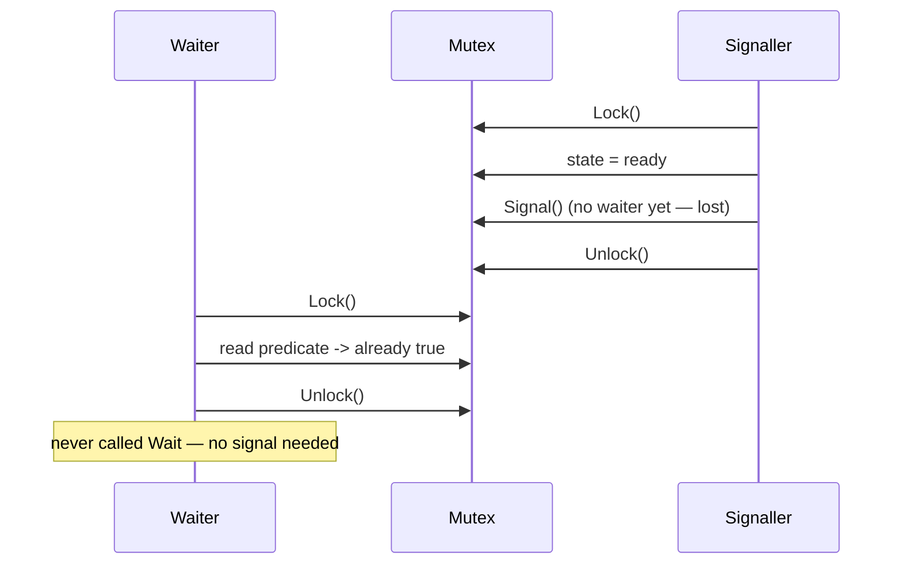

# sync.Cond — Junior Level

## Table of Contents
1. [Introduction](#introduction)
2. [Prerequisites](#prerequisites)
3. [Glossary](#glossary)
4. [Core Concepts](#core-concepts)
5. [Real-World Analogies](#real-world-analogies)
6. [Mental Models](#mental-models)
7. [Pros & Cons](#pros-cons)
8. [Use Cases](#use-cases)
9. [Code Examples](#code-examples)
10. [Coding Patterns](#coding-patterns)
11. [Clean Code](#clean-code)
12. [Product Use / Feature](#product-use-feature)
13. [Error Handling](#error-handling)
14. [Security Considerations](#security-considerations)
15. [Performance Tips](#performance-tips)
16. [Best Practices](#best-practices)
17. [Edge Cases & Pitfalls](#edge-cases-pitfalls)
18. [Common Mistakes](#common-mistakes)
19. [Common Misconceptions](#common-misconceptions)
20. [Tricky Points](#tricky-points)
21. [Test](#test)
22. [Tricky Questions](#tricky-questions)
23. [Cheat Sheet](#cheat-sheet)
24. [Self-Assessment Checklist](#self-assessment-checklist)
25. [Summary](#summary)
26. [What You Can Build](#what-you-can-build)
27. [Further Reading](#further-reading)
28. [Related Topics](#related-topics)
29. [Diagrams & Visual Aids](#diagrams-visual-aids)

---

## Introduction
> Focus: "What is a condition variable? When do I park a goroutine until something becomes true? How do I wake it up without losing the signal?"

`sync.Cond` is the Go standard library's **condition variable**: a small object that lets one or more goroutines wait until some shared state changes, and lets another goroutine notify them when that change has happened. It is the third tool in the classic synchronization triad — mutex, wait-group, condition variable — and the one most beginners reach for incorrectly, or never reach for at all.

The mental shape is simple. You have:

- A piece of shared state (a queue, a counter, a flag, a flag on a struct).
- A predicate over that state ("the queue is non-empty", "the counter has hit zero", "the flag is true").
- One or more goroutines that need to *block until the predicate holds*.
- One or more goroutines that *modify the state* and want to *wake the waiters*.

A condition variable is the glue between "modify state" and "wake waiter." Without it, the waiter would have to spin in a busy loop, checking the predicate repeatedly and burning CPU. With it, the waiter parks itself cheaply and the modifier signals it back to life.

```go
var (
    mu   sync.Mutex
    cond = sync.NewCond(&mu)
    ready bool
)

// Waiter
mu.Lock()
for !ready {
    cond.Wait()
}
// ready is now true; we hold the lock
mu.Unlock()

// Signaller
mu.Lock()
ready = true
cond.Signal()
mu.Unlock()
```

That is the whole shape. The rest of this file unpacks every word of it: why the lock, why the `for` loop, why `Signal` is paired with the state change, what goes wrong when you forget each step.

After reading this file you will:

- Know what `sync.Cond` is and the three operations it offers: `Wait`, `Signal`, `Broadcast`.
- Understand why a condition variable is always paired with a `sync.Locker` (almost always a `sync.Mutex`).
- Be able to write the canonical `for !predicate { c.Wait() }` shape and explain every line of it.
- Know the difference between `Signal` (wake one) and `Broadcast` (wake all) and when to pick each.
- Recognize the classic bugs: forgetting the `for` loop, calling `Wait` without the lock, racing on the predicate.
- Have a feel for when a channel is a better tool than `Cond` — which is *most of the time*.

You do not need to know the runtime internals (`notifyList`, futex layering) yet. Those come at the senior and professional levels. This file is about the surface — the four methods, the discipline, the smallest patterns.

---

## Prerequisites

- **Required:** A working Go 1.18+ install. The `sync.Cond` type has been stable since Go 1.0; nothing in this file is version-sensitive.
- **Required:** Comfort with `sync.Mutex` — you must already understand `Lock` / `Unlock` and what a critical section is. If "what does `mu.Lock()` block on?" feels uncertain, read the **Mutexes** chapter first.
- **Required:** Comfort writing goroutines with `go func() { ... }()` and joining them with `sync.WaitGroup`.
- **Helpful:** A passing knowledge of channels (`chan T`, `<-`, `close`, `for v := range ch`). Channels are the alternative to `Cond` for many patterns, so we will compare them constantly.
- **Helpful:** A passing knowledge of operating-system synchronization primitives — pthread condition variables in C, `Object.wait` / `Object.notify` in Java, `Condition` in Python's `threading`. Go's `sync.Cond` follows the same model, with the same rules and the same pitfalls.

If you have written a producer/consumer loop with a `sync.Mutex` and a `for` polling loop and felt the urge to "wake the consumer up properly," you are exactly the reader this file is written for.

---

## Glossary

| Term | Definition |
|------|-----------|
| **Condition variable** | A synchronization primitive that lets a goroutine park itself until some condition over shared state becomes true, and lets another goroutine wake it. In Go, the type is `sync.Cond`. |
| **`sync.Cond`** | The Go type. Constructed with `sync.NewCond(L sync.Locker)`. Exposes `Wait`, `Signal`, `Broadcast`. Has one exported field, `L sync.Locker`. |
| **`sync.Locker`** | An interface satisfied by anything with `Lock()` and `Unlock()` methods. In practice this is almost always `*sync.Mutex` or `*sync.RWMutex`. |
| **Predicate** | The boolean condition the waiter is interested in. Example: `len(queue) > 0`, `ready == true`, `count == 0`. Always evaluated while holding `Cond.L`. |
| **`Wait`** | Method on `*sync.Cond`. Atomically unlocks `c.L`, parks the calling goroutine, and on wake-up re-locks `c.L` before returning. Must be called with `c.L` held. |
| **`Signal`** | Method on `*sync.Cond`. Wakes one goroutine waiting on the condition (if any). The caller may or may not hold `c.L` — but always should, in practice. |
| **`Broadcast`** | Method on `*sync.Cond`. Wakes all goroutines currently waiting. The caller may or may not hold `c.L`. |
| **Spurious wake-up** | A wake-up that happens without anyone calling `Signal` or `Broadcast`. In Go, the runtime documents that spurious wake-ups are *possible* — so you must re-check the predicate. |
| **Lost wake-up** | A signal that is delivered while no one is waiting. The signal is lost. The next waiter must check the predicate or it will park forever. |
| **`for !predicate { c.Wait() }`** | The canonical waiting shape. Re-checks the predicate after every wake-up, so spurious wake-ups and unrelated wake-ups are harmless. |
| **Notifier** | The goroutine that modifies state and calls `Signal` or `Broadcast`. Should hold `c.L` around both the modification and the call. |
| **Waiter** | The goroutine that calls `c.Wait()`. Must hold `c.L` when calling. |
| **Locker** | The lock embedded into the `Cond` via the `L` field. Same lock for all parties; mismatched locks are silent data races. |

---

## Core Concepts

### A condition variable is "wake me when state changes"

Imagine you are writing a worker that pulls jobs from a shared queue:

```go
for {
    job := queue.Pop()
    process(job)
}
```

When the queue is empty, what should `Pop` do? Three options:

1. **Return `nil`.** Then the caller has to spin: `for { job := q.Pop(); if job == nil { continue }; process(job) }`. That burns CPU on an idle queue.
2. **Sleep with `time.Sleep`.** Slightly less wasteful but still bursts of polling, plus latency.
3. **Park the goroutine until a new job is pushed.** Cheapest and lowest-latency. This is what `sync.Cond` enables.

The condition variable is the bridge from "the queue is empty *right now*" to "someone just pushed; let me wake up and re-check."

### The lock is the gatekeeper

A condition variable does not protect any data on its own. The data is protected by `Cond.L` — a mutex you supply. The `Cond` only manages the *waiting list* of parked goroutines.

Every operation on the shared state happens under the lock. Every check of the predicate happens under the lock. Every `Wait` is called while holding the lock. When the modifier calls `Signal`, it should also be under the lock (technically it is not required, but breaking that rule introduces subtle bugs; we cover this in **Tricky Points**).

```go
mu.Lock()
// inspect or modify shared state here
mu.Unlock()
```

`Cond.Wait` is the single exception: while parked, the goroutine *does not* hold the lock. The lock is released when you enter `Wait` and re-acquired before `Wait` returns. This is the *atomic unlock + park* property that makes condition variables work.

### `Wait` does three things atomically

When the calling goroutine executes `cond.Wait()`:

1. The runtime adds the goroutine to the condition's internal wait list.
2. The runtime unlocks `cond.L`.
3. The goroutine parks (suspends).

Steps 1 and 2 are atomic with respect to other goroutines that might call `Signal` or `Broadcast`. This is critical. If they were not atomic, the following race would happen:

- Waiter: unlock the mutex.
- *(Pause here.)*
- Notifier: lock the mutex, mutate state, signal — but the waiter is not yet on the wait list, so the signal goes nowhere.
- Notifier: unlock the mutex.
- Waiter: add self to wait list, park.
- Waiter parks forever. The signal was *lost*.

The atomicity of "unlock + add to list" is what `sync.Cond` provides. You cannot reproduce it with a plain `sync.Mutex` and a counter; you would need an internal mechanism, which is exactly what `Cond` gives you.

When some other goroutine eventually calls `Signal` or `Broadcast` (and the runtime decides this goroutine is the one to wake, or one of those to wake), the waiter goes through a fourth step:

4. The runtime re-locks `cond.L` and returns from `Wait`.

The caller resumes execution holding the lock, exactly as before the call — but with shared state possibly changed.

### The `for` loop is non-negotiable

Every `Wait` belongs inside a `for` loop that tests the predicate:

```go
for !predicate {
    cond.Wait()
}
```

Three reasons:

1. **Spurious wake-ups are possible.** The Go documentation for `Wait` explicitly states: "Because c.L is not locked while Wait is waiting, the caller typically cannot assume that the condition is true when Wait returns. Instead, the caller should Wait in a loop." Even if every signal you write is correct, the runtime may choose to wake a goroutine without one — usually due to internal optimizations.
2. **Another goroutine may have changed state between the signal and our resumption.** If two waiters are waiting on a non-empty queue and a single push fires `Broadcast`, both wake up, both try to grab the lock; the first one consumes the new item; the second wakes up to find the queue empty again.
3. **`Signal` does not promise the predicate.** The notifier may have signalled for a different reason, or your predicate may have been set then unset. Always re-check.

The cost of the loop is zero in the common case — one comparison after wake-up. The cost of *omitting* it is a bug that you may never observe on your machine but that will surface in production under load.

### `Signal` vs `Broadcast`

`Signal` wakes *one* waiter. The runtime picks which one; you have no control. If no goroutine is currently waiting, the signal is *lost* — it does not queue.

`Broadcast` wakes *all* current waiters. They will all race to acquire the lock; one at a time enters the critical section. The others either find the predicate still holds for them too and proceed, or find it does not and call `Wait` again.

The rule of thumb:

- Use `Signal` when the state change affects exactly one waiter — for example, you just pushed one job and one worker can take it.
- Use `Broadcast` when the state change might affect many waiters — for example, you closed a queue and all workers should observe end-of-stream, or you changed a flag from "paused" to "running" and many workers should resume.

When in doubt, `Broadcast` is safer. It wakes more goroutines than strictly necessary, but each re-checks the predicate and re-parks if it's not satisfied. The extra wake-ups cost a little; a wrongly-omitted wake-up creates a hung goroutine.

### Lost wake-ups, and why the lock matters

A wake-up is "lost" when `Signal` is called while no goroutine is in `Wait`. The signal vanishes — `Cond` has no buffer. Why isn't this a bug?

Because of the lock. Look at the canonical shape again:

```go
// Waiter
mu.Lock()
for !ready {
    cond.Wait()
}
mu.Unlock()

// Signaller
mu.Lock()
ready = true
cond.Signal()
mu.Unlock()
```

Imagine the signaller runs *before* the waiter ever calls `Wait`. The signaller takes the lock, sets `ready = true`, signals (no one to wake), unlocks. Later the waiter takes the lock, checks `ready` — it is true — and skips the `Wait` entirely. No signal was needed.

This only works because **the waiter checks the predicate before each `Wait`**. The check happens under the lock, so it sees `ready = true` set by the signaller. The condition variable is not a buffered queue of signals; it is a *suspension primitive* paired with an *atomic check*.

Forget the lock or forget the check, and you reintroduce lost wake-ups as real bugs.

### Channels do most of this for you

If you have read the channels chapter, the parallel is hard to miss. A channel:

- Has built-in atomic "park + unlock + add to wait list" semantics.
- Supports both single delivery (one receiver wakes per send) and broadcast (`close(ch)` wakes all receivers).
- Integrates with `select`, `for-range`, and `context.Context`.

Most Go code that *could* use `sync.Cond` uses a channel instead, and the Go community sentiment (Effective Go, the standard library reviewers, many style guides) is to prefer channels. We say more in **Pros & Cons** and the middle-level file.

`sync.Cond` keeps its place when you have one piece of shared state that *multiple distinct predicates* observe — for example, a buffered queue where one set of goroutines waits for "non-empty" and another set waits for "non-full." Modelling that with channels is awkward; modelling it with a `Cond` (or two) is direct.

---

## Real-World Analogies

### A clinic waiting room

The clinic has a waiting room (the wait list). The receptionist holds the appointment book (`Cond.L`). When you arrive ("call `Wait`"), you hand the book back to the receptionist, take a seat, and fall asleep. When a doctor becomes free, the receptionist looks at the book, calls one patient's name (`Signal`), and that patient wakes up to take back the book and walk into the exam room.

If the doctor announces "I'm closing for lunch — everyone go home" (`Broadcast`), the receptionist wakes everyone at once.

Key points: the book (lock) is held by exactly one person at a time; sleeping patients don't hold it; waking up means re-claiming the book.

### A queue at the bus stop

Passengers (waiters) line up at a stop. The schedule board (lock) controls who looks at the timetable. A passenger reads the board ("is there a bus?"), and if not, asks the dispatcher to wake them when one arrives. The dispatcher (signaller) updates the board when a bus pulls in and calls the next passenger.

If two passengers are at the stop and only one seat is left on the bus, the dispatcher calls just one of them (`Signal`). If the bus is empty and many can board, the dispatcher shouts to the whole crowd (`Broadcast`).

### A nightclub with a bouncer

The club has a fixed capacity. Patrons wait in line, holding nothing (parked). The bouncer (signaller) holds the clipboard (lock). When someone inside leaves, the bouncer looks at the clipboard, calls the next person in line (`Signal`), updates the count, and lets them in. If the club closes early and an evening event opens spots all at once, the bouncer waves the whole line in (`Broadcast`).

### A hotel front desk

You ask for room number 217, but it's not ready yet ("predicate is false"). You hand back the key card request and sit in the lobby (call `Wait`). When housekeeping marks the room clean, the desk clerk (signaller) calls your name, gives you the card, and you walk to the room (acquire the lock again on resume).

You might re-check at the desk only to find that someone else got 217 first ("spurious wake-up" or "another waiter took it"). You sit back down and wait. That is the `for` loop.

---

## Mental Models

### Model 1: "Sleep until told, then re-check"

A condition variable is *not* a flag, *not* a queue of signals, *not* a counter. It is a parking lot for goroutines plus a way to wake them. The state itself lives elsewhere — in the variables protected by `Cond.L`. The condition variable is just the bridge.

The shape:
```
acquire lock -> check predicate -> if false, park (Wait) -> on wake, re-check
acquire lock -> change state -> wake (Signal / Broadcast)
```

### Model 2: "Lock guards data; Cond guards 'wait until'"

A mutex protects *access*. A condition variable protects *waiting*. They work together: the mutex serializes access to the data; the condition variable is how you let a goroutine *sleep through* the periods when access is not yet useful (the queue is empty, the resource is not yet ready, the count is not yet zero).

If you only need "serialize access," use a mutex. If you need "wait until," you need a condition variable — *or a channel*, which packages both serializations and waiting into one primitive.

### Model 3: "Cond is a thin wrapper around a wait queue"

Internally, `sync.Cond` is roughly a thread-safe linked list of goroutines that are currently parked. `Wait` appends the current goroutine, releases the lock, and suspends. `Signal` removes one goroutine and marks it runnable; the runtime later schedules it. `Broadcast` empties the list.

That's it. There is no "memory" of signals, no buffering, no priority. If `Signal` runs while the list is empty, the signal is dropped. The model is brutally simple — which is both its strength (predictability) and its weakness (no margin for sloppy use).

### Model 4: "Channels are higher-level Cond"

A channel internally has a wait queue too — one for senders, one for receivers. The semantics are richer (sends carry values, receives can detect close, `select` allows timeouts), but the underlying scheduling is similar. If you imagine `sync.Cond` as the bare metal of "park / wake," channels are the engine built on top: they package the lock, the predicate (is there a sender? a value? a closed signal?), and the wake-up into one neat abstraction.

So: any time `Cond` feels awkward, ask whether a channel would model the same thing more directly. The answer is "yes" surprisingly often.

---

## Pros & Cons

### Pros

- **Direct, minimal mechanism.** When you truly have shared state plus a predicate, `Cond` is the smallest tool for the job. No buffer, no value passing, no `select` overhead.
- **One state, many predicates.** If multiple predicates over the same state need waiters (queue non-empty, queue non-full, queue closed, work-item-of-priority-N available), one mutex with several `Cond` objects models this cleanly. Channels would force you to split the state.
- **Cheap broadcast.** `Broadcast` wakes all waiters with a single call. Doing the equivalent with channels means closing a channel, which is one-shot, or sending N times, which is racy.
- **Familiar to people from C / Java / Python.** `pthread_cond_*`, `Object.wait`/`notify`, `threading.Condition` follow the same model. If you have used them, `sync.Cond` is immediately legible.
- **Tiny memory footprint.** A `sync.Cond` is about six words. Compared to a buffered channel with N capacity, far smaller.

### Cons

- **Easy to misuse.** Forgetting the `for` loop, the lock, or pairing `Signal` with the state change creates silent bugs that may pass tests on your laptop and fail in production.
- **No cancellation.** `Wait` does not take a `context.Context`. You cannot interrupt a parked goroutine cleanly; you must call `Broadcast` and re-check the predicate, or layer a separate cancellation channel on top.
- **No timeout.** `Wait` does not take a deadline. Building a "wait at most 100ms" on top of `Cond` is a multi-line dance involving a timer goroutine and `Broadcast`.
- **No selection.** You cannot `select` on a `Cond.Wait`. If a goroutine must wait on either of two conditions, `Cond` forces you to write a busy loop or split into multiple goroutines.
- **No carrying values.** Channels deliver a value as part of the wake-up. `Cond` only wakes — you must re-read shared state to know what changed.
- **Community sentiment.** Go's standard library reviewers, the Effective Go guide, and most popular style guides discourage `Cond` in favor of channels for new code. Knowing this, you should weigh "is this the *one in twenty* case where Cond is actually better?" before reaching for it.

The middle and senior files dive deep into when `Cond` truly wins.

---

## Use Cases

| Scenario | Why `sync.Cond` helps |
|---|---|
| Bounded buffer with multiple producers and consumers | Two predicates over one state: "not full" for producers, "not empty" for consumers. Two `Cond`s sharing one mutex. |
| Resource pool with limited slots | Workers wait until a slot is free; release wakes one waiter. |
| Reference-counted shutdown | Workers `Wait` for `refCount == 0`; the last decrement signals. |
| State-machine transition | Goroutines wait for "state == Running"; controller sets state and broadcasts. |
| Reader/writer coordination beyond `sync.RWMutex` | When you need writer-priority or reader-priority semantics that `RWMutex` doesn't give. |

| Scenario | Why `sync.Cond` is *not* the best fit |
|---|---|
| Single-shot "task finished" signal | A `chan struct{}` closed when the task ends is simpler and supports `select`. |
| Single-producer single-consumer pipeline | A buffered channel is more direct. |
| Need cancellation by context | Channels integrate cleanly with `ctx.Done()`; `Cond` does not. |
| Need timeout on the wait | `select` with `time.After` is one line; `Cond` requires a helper. |
| One predicate, many one-shot waiters | `close(ch)` broadcasts in one call; cheaper and impossible to misuse. |

---

## Code Examples

### Example 1: Hello-world condition variable

```go
package main

import (
    "fmt"
    "sync"
    "time"
)

func main() {
    var mu sync.Mutex
    cond := sync.NewCond(&mu)
    ready := false

    go func() {
        time.Sleep(100 * time.Millisecond)
        mu.Lock()
        ready = true
        cond.Signal()
        mu.Unlock()
    }()

    mu.Lock()
    for !ready {
        cond.Wait()
    }
    mu.Unlock()
    fmt.Println("ready")
}
```

The main goroutine waits until the helper sets `ready = true`. The lock is held around every check and every `Wait`. The helper sets the flag and signals while holding the lock.

### Example 2: The `for` loop is required

```go
var mu sync.Mutex
cond := sync.NewCond(&mu)
ready := false

// BAD — uses if instead of for
mu.Lock()
if !ready {
    cond.Wait()
}
// May proceed with ready still false on a spurious or unrelated wake-up.
mu.Unlock()
```

Replace `if` with `for`. The cost is one extra comparison; the benefit is correctness under spurious wake-ups and competing waiters.

### Example 3: A bounded queue

```go
type Queue struct {
    mu       sync.Mutex
    notFull  *sync.Cond
    notEmpty *sync.Cond
    items    []int
    cap      int
}

func NewQueue(cap int) *Queue {
    q := &Queue{cap: cap}
    q.notFull = sync.NewCond(&q.mu)
    q.notEmpty = sync.NewCond(&q.mu)
    return q
}

func (q *Queue) Push(v int) {
    q.mu.Lock()
    defer q.mu.Unlock()
    for len(q.items) == q.cap {
        q.notFull.Wait()
    }
    q.items = append(q.items, v)
    q.notEmpty.Signal()
}

func (q *Queue) Pop() int {
    q.mu.Lock()
    defer q.mu.Unlock()
    for len(q.items) == 0 {
        q.notEmpty.Wait()
    }
    v := q.items[0]
    q.items = q.items[1:]
    q.notFull.Signal()
    return v
}
```

Two condition variables sharing one mutex. Producers wait on `notFull`; consumers wait on `notEmpty`. Each operation signals the *other* condition because that's the one whose predicate just changed in their favor.

### Example 4: Reference-counted shutdown

```go
type Counter struct {
    mu    sync.Mutex
    cond  *sync.Cond
    count int
}

func NewCounter() *Counter {
    c := &Counter{}
    c.cond = sync.NewCond(&c.mu)
    return c
}

func (c *Counter) Add(delta int) {
    c.mu.Lock()
    c.count += delta
    if c.count == 0 {
        c.cond.Broadcast()
    }
    c.mu.Unlock()
}

func (c *Counter) WaitZero() {
    c.mu.Lock()
    for c.count != 0 {
        c.cond.Wait()
    }
    c.mu.Unlock()
}
```

Multiple waiters can call `WaitZero` concurrently; when count hits zero, `Broadcast` wakes all of them. This is essentially `sync.WaitGroup.Wait` rebuilt by hand — and indeed `WaitGroup` is implemented with a similar idea but uses runtime primitives directly.

### Example 5: Broadcast wakes all

```go
package main

import (
    "fmt"
    "sync"
)

func main() {
    var mu sync.Mutex
    cond := sync.NewCond(&mu)
    go_ := false
    var wg sync.WaitGroup

    for i := 0; i < 5; i++ {
        wg.Add(1)
        go func(id int) {
            defer wg.Done()
            mu.Lock()
            for !go_ {
                cond.Wait()
            }
            mu.Unlock()
            fmt.Println("runner", id, "go!")
        }(i)
    }

    mu.Lock()
    go_ = true
    cond.Broadcast()
    mu.Unlock()
    wg.Wait()
}
```

All five runners wait for the starting gun. The single `Broadcast` releases them simultaneously. Note: they then race for the lock, so they enter the critical section one at a time, but the unparking is concurrent.

### Example 6: `Signal` vs `Broadcast` outcome

```go
// With Signal: only one goroutine wakes; the others remain parked.
// Useful when "one new item, one consumer takes it".

// With Broadcast: every goroutine wakes; each re-checks the predicate.
// Useful when "the state changed in a way that may help any waiter".
```

A common starter mistake is to use `Signal` when modifying state that might satisfy multiple waiters simultaneously. The result: some waiters stay parked even though they could have proceeded. We will see this in **Common Mistakes**.

### Example 7: Channel equivalent of "wait for ready"

```go
// With Cond:
mu.Lock()
for !ready { cond.Wait() }
mu.Unlock()

// With channel:
<-readyCh

// Signalling with Cond:
mu.Lock(); ready = true; cond.Signal(); mu.Unlock()

// Signalling with channel (one waiter):
readyCh <- struct{}{}
// Signalling with channel (many waiters):
close(readyCh)
```

The channel version is shorter and easier to read. For a one-shot "wait until ready" the channel almost always wins.

### Example 8: The wrong way (no lock)

```go
// DO NOT DO THIS — will panic at runtime
cond := sync.NewCond(&sync.Mutex{})
cond.Wait()
```

Output:
```
fatal error: sync: unlock of unlocked mutex
```

`Wait` calls `c.L.Unlock()` internally. If the caller never locked, the unlock panics.

### Example 9: Signal without the lock (subtly wrong)

```go
mu.Lock()
ready = true
mu.Unlock()
cond.Signal() // technically legal but racy in many real programs
```

The Go docs say it is "permitted but not required" for the caller to hold the lock when calling `Signal`. In practice, doing it outside the lock creates a window where a waiter could re-check the predicate, find it true, and proceed — meanwhile `Signal` fires later when no one is waiting, and the signal is lost. This is harmless if you have only one waiter, but with multiple waiters it leads to lost wake-ups. **The safe rule: always signal under the lock.**

### Example 10: Wake-up loses without the `for` loop

```go
// Two waiters, one item.
go func() {
    mu.Lock()
    if len(items) == 0 {       // BAD — should be for
        cond.Wait()
    }
    v := items[0]              // PANIC if len == 0
    items = items[1:]
    mu.Unlock()
    consume(v)
}()
// Imagine a Broadcast wakes both. Both proceed past `if`.
// Only one item; the second waiter indexes into an empty slice.
```

Use `for len(items) == 0 { cond.Wait() }`. The second waiter re-checks, finds the queue empty, and parks again.

---

## Coding Patterns

### Pattern 1: The canonical wait

```go
mu.Lock()
for !predicate(state) {
    cond.Wait()
}
// state is now in the desired shape; act on it
mu.Unlock()
```

This is the only shape you should write. Variations exist (`defer mu.Unlock()`, predicate inlined), but the structure is invariant.

### Pattern 2: The canonical signal

```go
mu.Lock()
// modify state
state.something = newValue
// signal/broadcast as appropriate
cond.Signal()    // or cond.Broadcast()
mu.Unlock()
```

The signal happens *under the lock*, *after* the state change. The lock prevents waiters from re-checking the predicate in between.

### Pattern 3: Two conditions, one lock

When two different predicates over the same state need waiters:

```go
type Resource struct {
    mu       sync.Mutex
    notFull  *sync.Cond
    notEmpty *sync.Cond
    // shared state...
}
```

Both `notFull` and `notEmpty` are constructed with `&r.mu`. Operations that fill the resource signal `notEmpty`; operations that drain it signal `notFull`.

### Pattern 4: Broadcast on state-class change

When state moves between *classes* (open vs closed, paused vs running, error vs ok), use `Broadcast` so all waiters re-evaluate:

```go
mu.Lock()
state.closed = true
cond.Broadcast()
mu.Unlock()
```

Even if you "know" only one waiter cares, broadcast is safer: future code that adds a second waiter will not silently break.

### Pattern 5: Signal-on-change

When the state change satisfies exactly one waiter (one item pushed into a queue, one slot freed), `Signal` is sufficient:

```go
mu.Lock()
queue = append(queue, item)
cond.Signal()
mu.Unlock()
```

### Pattern 6: Defer-friendly

```go
mu.Lock()
defer mu.Unlock()
for !predicate() {
    cond.Wait()
}
// ... act ...
```

`defer mu.Unlock()` is fine because `Wait` re-locks before returning. The deferred unlock runs at function return on the held lock.

---

## Clean Code

- **Always pair `Cond` with its lock in the same struct.** Mismatched locks are the worst silent bugs. Put both fields next to each other in the type definition.
- **Name the predicate.** A line like `for !q.canPop() { q.cond.Wait() }` reads better than `for len(q.items) == 0 { q.cond.Wait() }` and lets you change the predicate without touching every waiter.
- **Comment the wait loop.** Future readers must understand which signal wakes which waiter. A one-line `// waits until queue non-empty` saves debugging hours.
- **One `Cond` per predicate.** If you have "not full" and "not empty" predicates, use two `Cond` objects, not one shared. Otherwise every push wakes every consumer too, and vice versa — pointless wake-ups.
- **Never assume the predicate after wake-up.** Even with perfect signalling discipline, write code as if the predicate could still be false. The `for` loop enforces this for you.
- **Prefer channels for new code unless you have a *specific* reason.** "Force of habit from C++" is not a reason. If the use case fits a channel, use a channel.

---

## Product Use / Feature

| Product feature | How `sync.Cond` shows up |
|---|---|
| Connection pool (database, HTTP client) | Pool holds N connections; `Get` waits on `cond` when all in use; `Put` signals. |
| Background worker that pauses on demand | Workers wait on a `paused` flag; admin endpoint toggles the flag and broadcasts. |
| Rate-limited job queue | Producers wait on `canEnqueue` predicate; release of a token signals. |
| Graceful shutdown of a server | All workers wait for `refcount == 0`; the request handler decrement signals. |
| Live config reload | Workers wait on `configVersion`; reloader updates and broadcasts. |
| In-memory cache with capacity | Eviction wakes waiters that needed space. |

---

## Error Handling

`sync.Cond` itself does not return errors. It either does its job or panics on misuse. The errors you handle are about the *state*:

```go
mu.Lock()
for !ready && err == nil {
    cond.Wait()
}
if err != nil {
    mu.Unlock()
    return err
}
// proceed
mu.Unlock()
```

When using `Cond` you must thread error state through the shared variables manually. The waiter wakes, re-checks the predicate or the error flag, and acts accordingly. The notifier sets the error flag *and* broadcasts so any number of waiters can observe it.

```go
mu.Lock()
err = fmt.Errorf("upstream failed: %w", upstreamErr)
cond.Broadcast()
mu.Unlock()
```

If you forget the broadcast, waiters hang. If you forget to clear the error before the next round, future waiters see a stale error. Both are easy mistakes; channels with `close` handle this more cleanly.

---

## Security Considerations

- **Lost wake-ups can become deadlocks.** A deadlocked server is a denial-of-service. A bug in your `Cond` discipline is therefore not just a correctness issue — under adversarial load (many simultaneous requests, racy edge cases) it can be a DoS vector.
- **Mismatched locks across `Cond`s are silent data races.** A race on session state, token state, or rate-limit state may allow privileged operations to slip through during the race window. Always run `go test -race` and be aggressive about acceptance tests.
- **Resource leaks via parked goroutines.** A goroutine in `Wait` holds whatever it captured — a request body, a transaction, a TLS session. Many leaked waiters means many leaked resources. Add `context.Context` discipline so waiters can exit on cancellation; remember `Cond` does not natively support this, so you must `Broadcast` on cancellation.

---

## Performance Tips

- **`Signal` is cheaper than `Broadcast`.** Use `Signal` when only one waiter can possibly benefit. `Broadcast` wakes all and then they fight for the lock — a "thundering herd."
- **Signal under the lock; the kernel does not actually schedule the woken goroutine until you unlock.** So there's no benefit to signalling outside the lock for latency reasons; the runtime handles this efficiently.
- **Avoid `Cond` on hot paths if a single atomic would do.** If your "predicate" is "atomic.Bool flipped," a `for { if flag.Load() { break } }` busy loop *or* a single-shot channel may be faster than mutex + cond traffic.
- **Don't broadcast on every state change.** If you push one item to a queue, signal one waiter, not all of them. The broadcast woke 99 goroutines that all immediately re-parked.
- **Profile mutex contention with `runtime/pprof`.** If your `Cond.L` is the hot lock, you have a design problem; redesign rather than micro-optimize.

Detailed performance discussion is in the **optimize.md** file.

---

## Best Practices

1. Pair the `Cond` with its lock in the same struct.
2. Always wait inside `for !predicate() { cond.Wait() }`.
3. Always signal under the lock, after changing state.
4. Prefer `Signal` to `Broadcast` when only one waiter benefits.
5. Use `Broadcast` for state-class changes (closed, paused, errored).
6. Never call `Wait` without holding the lock.
7. Never call `Signal` or `Broadcast` from a goroutine that does not also coordinate with `cond.L`.
8. Document each `Cond` with one line: "waiters block until X."
9. Prefer channels for new code unless `Cond` clearly fits better.
10. Add a cancellation path: a `closed` flag plus `Broadcast` on close, so waiters can exit.

---

## Edge Cases & Pitfalls

### `Wait` without holding the lock

```go
cond.Wait() // panic: sync: unlock of unlocked mutex
```

Always `mu.Lock()` first.

### `Signal` while holding a *different* lock

```go
otherMu.Lock()
cond.Signal()      // signal goes nowhere useful
otherMu.Unlock()
```

The waiter is parked under `cond.L`, not `otherMu`. The signal is delivered to *some* waiter (technically it's a `Cond`-level operation, not a lock-level one), but state changes guarded by `otherMu` are not visible to a waiter who re-locks `cond.L`. Use the same lock everywhere.

### Pointer vs value `Cond`

```go
// BAD
type Q struct {
    cond sync.Cond
}
```

Embedding `sync.Cond` by value is risky — if `Q` is copied, the internal wait list is duplicated and bugs ensue. Always store `*sync.Cond` and construct via `sync.NewCond`.

```go
// GOOD
type Q struct {
    mu   sync.Mutex
    cond *sync.Cond
}

func NewQ() *Q {
    q := &Q{}
    q.cond = sync.NewCond(&q.mu)
    return q
}
```

The `vet` tool's `copylocks` check catches some cases of accidental copies.

### Recreating `Cond` after reset

You cannot "reset" a `Cond` and reuse it cleanly. If you need a fresh wait queue, create a new `Cond` via `sync.NewCond`. The runtime does not provide a "clear waiters" call; you would have to `Broadcast`, let everyone observe a sentinel state, and reconstruct.

### Forgetting that `Wait` re-locks

```go
mu.Lock()
for !ready {
    cond.Wait()
    mu.Unlock()       // BUG — already locked, then unlocked once below
}
mu.Unlock()
```

`Wait` releases and re-acquires the lock. You do not unlock manually in between. The doubled unlock panics.

### Signalling a `Cond` whose lock is held by someone else

If you signal under `cond.L` but the predicate check happens under a different lock, the signal does its job (wakes a waiter), but the waiter cannot make progress because it cannot acquire the correct lock. Make sure the same `cond.L` guards both the predicate and the signal.

---

## Common Mistakes

| Mistake | Fix |
|---|---|
| Using `if !predicate { cond.Wait() }` instead of `for` | Replace `if` with `for`. |
| Calling `cond.Wait()` without holding `cond.L` | Add `cond.L.Lock()` before the wait loop. |
| Signalling without holding the lock | Hold `cond.L` around the state change and the signal. |
| Using `Signal` when many waiters could benefit | Switch to `Broadcast`. |
| Using `Broadcast` for every change when one waiter suffices | Switch to `Signal` to avoid thundering herd. |
| Copying a `sync.Cond` | Always use `*sync.Cond` from `sync.NewCond`. |
| Pairing one `Cond` with two different locks | One `Cond` has exactly one `L`. |
| Forgetting to broadcast on cancellation | Add a `closed` flag and broadcast in shutdown. |
| Mixing channel and Cond for the same predicate | Pick one mechanism per piece of state. |
| Reaching for `Cond` first instead of asking "would a channel do?" | Default to channels; reach for `Cond` for the specific cases where it wins. |

---

## Common Misconceptions

> *"`Signal` queues up; the next waiter will pick it up."* — No. If no one is waiting, the signal is lost. The predicate-plus-lock dance ensures this is harmless.

> *"`Wait` is like `time.Sleep`."* — No. `time.Sleep` parks for a duration. `Wait` parks until signalled, with no time bound. It also releases the lock atomically — `time.Sleep` does not.

> *"`Broadcast` is just `Signal` in a loop."* — Conceptually similar but not equivalent. `Broadcast` performs a single internal operation that releases all waiters atomically; the runtime is then free to schedule them. Looping `Signal` N times has more overhead and provides no ordering guarantees either.

> *"You can call `Wait` without the lock if you're careful."* — No. `Wait` calls `Unlock` on the locker; if you didn't lock, the runtime panics.

> *"`Signal` is faster outside the lock."* — Negligible difference, and it introduces real bugs. Always inside.

> *"`Cond` is faster than a channel."* — Not by much, and you usually pay the difference back in code complexity. Benchmarks at the middle level cover this concretely.

> *"`Cond` integrates with `context.Context`."* — No. You must combine it with a separate cancellation channel or a `closed` flag, and broadcast on cancellation.

> *"Spurious wake-ups are a theoretical worry that never happens in Go."* — They happen. The documentation says so. The `for` loop is mandatory regardless.

> *"You can use a single `Cond` for any number of unrelated predicates."* — You can, but every signal wakes everyone, and most wakers re-park immediately. One `Cond` per predicate is the discipline.

> *"`sync.Cond` is deprecated."* — Not deprecated. But the community sentiment is to prefer channels in new code, and the standard library reviewers will push back on `Cond` usage that channels would serve.

---

## Tricky Points

### The lock is *released* during `Wait`, not just unlocked

The internal mechanism is "atomic release + park." From the outside it looks like `Unlock()` followed by suspension, but it is one inseparable runtime operation. This is what prevents the lost-wake-up race.

### `Signal` does not pick the longest waiter

The runtime makes no FIFO guarantee. The goroutine that gets unparked might be the most recent, the oldest, or somewhere in between. Do not encode ordering assumptions.

### `Signal` from a nil `Cond` panics

```go
var c *sync.Cond
c.Signal() // nil pointer dereference
```

Always construct with `sync.NewCond`. Do not declare `var c *sync.Cond` and forget to initialize.

### A `Cond` from a non-pointer `Mutex` is a footgun

```go
mu := sync.Mutex{}
c := sync.NewCond(mu)   // compile error — Mutex doesn't have value-receiver Lock
```

`sync.Mutex.Lock` has a pointer receiver, so `sync.Locker` is satisfied only by `&mu`. Always: `sync.NewCond(&mu)`.

### `Wait` does not return any value

There is no way to ask "why did I wake up?" The waiter must re-read shared state and figure it out.

### `Cond.L` is a public field; you can swap it

```go
c.L = &otherMu // legal Go; almost always a bug
```

Don't swap. Treat `L` as immutable after construction.

### Signal-then-unlock vs unlock-then-signal

```go
// Variant A
mu.Lock()
state = newValue
cond.Signal()
mu.Unlock()

// Variant B
mu.Lock()
state = newValue
mu.Unlock()
cond.Signal()
```

Both are legal. A is the recommended discipline. B opens a window where another goroutine could lock, change state, and signal before our signal arrives — the order of wake-ups changes, and some patterns become incorrect.

---

## Test

```go
package cond_test

import (
    "sync"
    "sync/atomic"
    "testing"
)

func TestWaitAndSignal(t *testing.T) {
    var mu sync.Mutex
    cond := sync.NewCond(&mu)
    var ready int32

    done := make(chan struct{})
    go func() {
        mu.Lock()
        for atomic.LoadInt32(&ready) == 0 {
            cond.Wait()
        }
        mu.Unlock()
        close(done)
    }()

    mu.Lock()
    atomic.StoreInt32(&ready, 1)
    cond.Signal()
    mu.Unlock()

    <-done
}

func TestBroadcastWakesAll(t *testing.T) {
    var mu sync.Mutex
    cond := sync.NewCond(&mu)
    var ready int32
    var wg sync.WaitGroup

    for i := 0; i < 10; i++ {
        wg.Add(1)
        go func() {
            defer wg.Done()
            mu.Lock()
            for atomic.LoadInt32(&ready) == 0 {
                cond.Wait()
            }
            mu.Unlock()
        }()
    }

    mu.Lock()
    atomic.StoreInt32(&ready, 1)
    cond.Broadcast()
    mu.Unlock()

    wg.Wait()
}
```

Run with `-race` to catch any unintended sharing. Both tests should pass deterministically; if they hang, the discipline is wrong somewhere.

---

## Tricky Questions

**Q.** Why is the `for` loop mandatory?

**A.** Three reasons compound: spurious wake-ups can happen, multiple waiters racing for one resource can leave most of them with a still-false predicate, and unrelated `Broadcast` calls can wake up waiters who care about a different predicate guarded by the same lock. The `for` loop makes every wake-up a no-op when the predicate is false, parking the waiter again.

---

**Q.** Does `Wait` always re-acquire the lock?

**A.** Yes. When `Wait` returns, the lock is held by the calling goroutine. The runtime guarantees this. So the caller does not need to lock again, but must remember to unlock eventually.

---

**Q.** What happens if I call `Signal` when no one is waiting?

**A.** Nothing. The signal is dropped. This is by design: the waiter checks the predicate before each `Wait`, so a state change observed *before* a `Wait` call needs no signal. If no one was parked, no one needed waking.

---

**Q.** Can two different `Cond` objects share one mutex?

**A.** Yes, and it is a common pattern. Two distinct predicates over the same state get two `Cond`s, both constructed with the same `&mu`. This avoids the "wake everyone, most re-park" problem of using one `Cond` for two predicates.

---

**Q.** Is `Signal` FIFO?

**A.** No. The Go runtime makes no FIFO guarantee about which waiter is awakened. Treat the choice as arbitrary.

---

**Q.** Why would I ever use `Cond` instead of a channel?

**A.** When you have one piece of shared state with two or more distinct predicates that different goroutines wait on (classic bounded-queue example), `Cond` models the wait sets directly. With channels you would have to split the state, lose atomicity of the predicate check, or build extra synchronization. We cover this in detail in the middle and senior files.

---

**Q.** Can `Cond.Wait` be cancelled?

**A.** Not natively. The standard workaround: have a shared `closed` flag in the state, set it on cancellation, and call `Broadcast`. Each waiter checks the flag in the `for` loop and exits if set. This is one of the most cited reasons to prefer channels.

---

**Q.** Does the lock need to be a `sync.Mutex`?

**A.** Anything implementing `sync.Locker` works: `*sync.Mutex`, `*sync.RWMutex`, custom types. With `*sync.RWMutex`, you typically use the writer lock for `Cond.L`; using the read lock is unusual and rarely correct.

---

**Q.** What is the difference between `Cond.L = &mu` and `sync.NewCond(&mu)`?

**A.** `NewCond` is the only public constructor. The `L` field is exported but should be set only at construction time. Mutating `L` after construction puts existing waiters in a corrupt state.

---

**Q.** Why does `Wait` panic if I forget to lock?

**A.** Internally `Wait` calls `c.L.Unlock()` before parking. Unlocking an already-unlocked `sync.Mutex` panics with "sync: unlock of unlocked mutex." This is intentional; it catches misuse early.

---

## Cheat Sheet

```go
// Construct
var mu sync.Mutex
cond := sync.NewCond(&mu)

// Waiter
mu.Lock()
for !predicate() {
    cond.Wait()
}
// act on state
mu.Unlock()

// Signaller (single waiter benefits)
mu.Lock()
mutate(&state)
cond.Signal()
mu.Unlock()

// Broadcaster (many waiters could benefit)
mu.Lock()
mutate(&state)
cond.Broadcast()
mu.Unlock()

// Shutdown discipline (since Cond has no cancel)
mu.Lock()
closed = true
cond.Broadcast()
mu.Unlock()

// In the waiter's for loop:
for !predicate() {
    if closed {
        mu.Unlock()
        return ErrClosed
    }
    cond.Wait()
}
```

---

## Self-Assessment Checklist

- [ ] I can explain what a condition variable is in one sentence.
- [ ] I know why `Wait` must be inside a `for !predicate { ... }` loop.
- [ ] I know the rule: lock held around every check, every `Wait`, every signal.
- [ ] I know what `Wait` does atomically (release lock, park, re-lock on wake).
- [ ] I can choose between `Signal` and `Broadcast` for a given situation.
- [ ] I know what a "lost wake-up" is and why the predicate-plus-lock discipline prevents it.
- [ ] I know what a "spurious wake-up" is and why the `for` loop handles it for free.
- [ ] I can write a bounded queue with two `Cond` objects sharing one mutex.
- [ ] I know that `sync.Cond` has no cancellation or timeout, and I know the workaround.
- [ ] I know that most new Go code prefers channels and I can argue why or why not for any specific case.

---

## Summary

`sync.Cond` is the small, sharp tool for "park a goroutine until some shared-state predicate becomes true." It is built on `sync.Locker` (almost always a `sync.Mutex`) and exposes three methods: `Wait`, `Signal`, `Broadcast`. The discipline is strict:

- The lock is held around every check of the predicate and every signal.
- `Wait` atomically releases the lock, parks the goroutine, and re-locks on wake.
- Every wait is wrapped in `for !predicate { cond.Wait() }` to survive spurious or unrelated wake-ups.
- `Signal` wakes one waiter; `Broadcast` wakes all.
- Lost wake-ups are not a bug as long as you check the predicate under the lock before each `Wait`.

In modern Go, `sync.Cond` is rarely the first reach. Channels handle most use cases more cleanly, integrate with `context.Context` and `select`, and resist the classic misuse bugs. `Cond` still wins when you have one piece of shared state with multiple distinct predicates over it (bounded queues, resource pools with priorities) — there it is the smallest tool for the job.

The middle file dives deeper into patterns, channel comparisons, and debugging. The senior file covers design decisions: when `Cond` is truly the right call, and how to combine it with cancellation. The professional file opens up the runtime internals: `notifyList`, the futex-style underpinnings, and the memory model implications.

---

## What You Can Build

After mastering this material:

- A bounded queue with `Push`/`Pop` that blocks correctly on full/empty.
- A small connection pool with `Acquire`/`Release` semantics.
- A reference-counted "wait until idle" primitive (a manual `WaitGroup`).
- A pausable/resumable worker pool with a single broadcast on resume.
- A producer/consumer loop where the consumer parks cleanly on an empty queue.
- A drain-and-shutdown coordinator that wakes all workers on close.

---

## Further Reading

- Go standard library: <https://pkg.go.dev/sync#Cond>
- Effective Go — Concurrency: <https://go.dev/doc/effective_go#concurrency>
- Bryan Mills, "Rethinking Classical Concurrency Patterns" (GopherCon): a sustained argument for channels over `Cond`.
- Go memory model: <https://go.dev/ref/mem>
- pthread condition variables (POSIX): comparison reading; the model is the same.

---

## Related Topics

- `sync.Mutex` — the lock that pairs with `Cond.L`.
- `sync.WaitGroup` — a higher-level "wait for N to finish."
- Channels — usually the preferred alternative.
- `context.Context` — the missing cancellation that `Cond` lacks.
- `sync.RWMutex` — sometimes used as `Cond.L`, with caveats.

---

## Diagrams & Visual Aids

### The wait/signal cycle

```
Waiter goroutine                          Notifier goroutine
----------------                          ------------------
Lock()
check predicate (false)
Wait() ----[atomically release lock]
        [park]                            Lock()
                                          mutate state
                                          Signal()
                                          Unlock()
        [unparked by Signal]
        [re-acquire lock]
check predicate (true)
act on state
Unlock()
```

### One Cond, two predicates (bounded queue)

```
       +-------- shared state (mu) --------+
       |   items []int      cap int        |
       +-----------------------------------+
        ^                ^
        | notFull        | notEmpty
        |                |
  producers         consumers
  (Wait when full)  (Wait when empty)
```

### Signal vs Broadcast

```
Signal:
                  state changes
                       |
                       v
                   wake ONE
                       |
                       v
              [one waiter resumes]

Broadcast:
                  state changes
                       |
                       v
                   wake ALL
                  /   |   \
                 v    v    v
            [waiter] [waiter] [waiter]
                 \   |   /
              (race for lock)
```

### Lost wake-up averted by the lock



The lock-and-check discipline turns "lost signal" into "no signal needed." That is the magic of the pattern.

### Three goroutines, one Broadcast

```mermaid
sequenceDiagram
    participant W1 as Waiter1
    participant W2 as Waiter2
    participant W3 as Waiter3
    participant B as Broadcaster
    W1->>W1: Lock; Wait (parks)
    W2->>W2: Lock; Wait (parks)
    W3->>W3: Lock; Wait (parks)
    B->>B: Lock
    B->>B: mutate state
    B->>B: Broadcast
    B->>B: Unlock
    W1->>W1: resumes, holds lock, acts, unlocks
    W2->>W2: resumes, holds lock, acts, unlocks
    W3->>W3: resumes, holds lock, acts, unlocks
```

Only one waiter holds the lock at a time, so they execute the critical section serially even though the wake-up was simultaneous.
