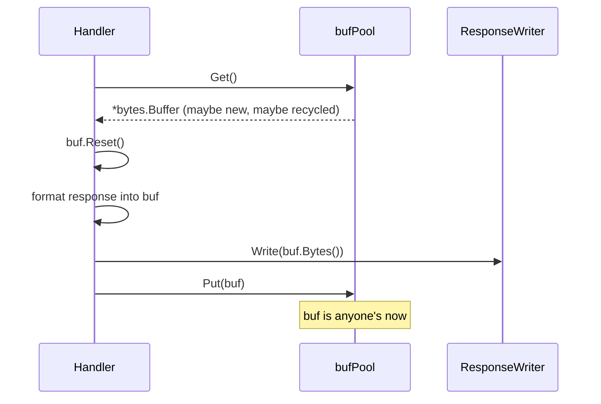

# sync.Pool — Junior Level

## Table of Contents
1. [Introduction](#introduction)
2. [Prerequisites](#prerequisites)
3. [Glossary](#glossary)
4. [Core Concepts](#core-concepts)
5. [Real-World Analogies](#real-world-analogies)
6. [Mental Models](#mental-models)
7. [Pros & Cons](#pros-cons)
8. [Use Cases](#use-cases)
9. [Code Examples](#code-examples)
10. [Coding Patterns](#coding-patterns)
11. [Clean Code](#clean-code)
12. [Product Use / Feature](#product-use-feature)
13. [Error Handling](#error-handling)
14. [Security Considerations](#security-considerations)
15. [Performance Tips](#performance-tips)
16. [Best Practices](#best-practices)
17. [Edge Cases & Pitfalls](#edge-cases-pitfalls)
18. [Common Mistakes](#common-mistakes)
19. [Common Misconceptions](#common-misconceptions)
20. [Tricky Points](#tricky-points)
21. [Test](#test)
22. [Tricky Questions](#tricky-questions)
23. [Cheat Sheet](#cheat-sheet)
24. [Self-Assessment Checklist](#self-assessment-checklist)
25. [Summary](#summary)
26. [What You Can Build](#what-you-can-build)
27. [Further Reading](#further-reading)
28. [Related Topics](#related-topics)
29. [Diagrams & Visual Aids](#diagrams-visual-aids)

---

## Introduction
> Focus: "What is `sync.Pool`? Why would I pool a `bytes.Buffer`? When does it actively hurt?"

`sync.Pool` is a tiny piece of the standard library that exists for one reason: **reduce garbage-collector pressure on hot temporary objects**. If your program creates and discards a million `bytes.Buffer` values per second, the GC has to scan and free them all. A `sync.Pool` lets each of those buffers be borrowed, used, and returned, so the same handful of buffers get reused over and over.

The API is three lines wide:

```go
var bufPool = sync.Pool{
    New: func() any { return new(bytes.Buffer) },
}

buf := bufPool.Get().(*bytes.Buffer)
buf.Reset()
defer bufPool.Put(buf)

buf.WriteString("hello")
```

That is the entire pattern. The complexity comes from understanding what the pool guarantees (almost nothing about object lifetime), what it does not guarantee (any particular object will come back), and when it is the wrong tool (connection pooling, long-lived resources, anything stateful you cannot reset).

After this file you will:

- Know the three-method API: `Get`, `Put`, and the `New` factory field.
- Understand that the runtime can evict pool items at any garbage-collection cycle.
- Know the canonical `bytes.Buffer` pooling pattern used by `fmt`, `encoding/json`, and `net/http`.
- Recognise the most common bugs: forgetting to `Reset`, holding onto a pointer after `Put`, panicking before `Put`.
- Understand why `sync.Pool` is wrong for database connections, file handles, and other "real" resources.
- Be able to write a benchmark with `-benchmem` and read `allocs/op` to prove a pool helps.

You do not need to know about the per-P local pools, the victim cache, the lock-free dequeue, or the `poolLocal` internals yet. Those come at the middle, senior, and professional levels. This file is about the moment you put `sync.Pool` next to a hot allocation path and watch the GC quiet down.

---

## Prerequisites

- **Required:** A Go installation, version 1.18 or newer (1.21+ recommended). Run `go version` to check. Generics matter for the generic pool wrapper; the victim cache has been in place since 1.13 so any modern Go works.
- **Required:** Comfort with `bytes.Buffer`, `strings.Builder`, or any other temporary-buffer type. If you cannot describe what `buf.Reset()` does, pause and skim the `bytes` package docs.
- **Required:** Familiarity with `sync.Mutex` and `sync.WaitGroup`. `sync.Pool` lives in the same package; the same shape of "do not copy after first use" applies.
- **Helpful:** Awareness of garbage collection — at least the idea that "freeing memory is not free." You do not need to know about the tricolour collector or write barriers.
- **Helpful:** Some benchmarking experience. You should be able to write a `BenchmarkXxx(b *testing.B)` function. Examples below use `b.ReportAllocs()`.

If you can write a `BenchmarkXxx` that runs and `go test -bench . -benchmem` prints `0 allocs/op`, you are ready.

---

## Glossary

| Term | Definition |
|------|-----------|
| **`sync.Pool`** | A type from the `sync` package that holds a set of temporarily unused objects and allows independent goroutines to share them. The pool may release any of its items without notice. |
| **`Get()`** | Method that returns an arbitrary item from the pool. If the pool is empty and `New` is set, `New` is called and the result is returned. Otherwise returns `nil`. |
| **`Put(x any)`** | Method that adds `x` to the pool. After calling `Put`, the caller must not touch `x` — the pool now owns it. |
| **`New func() any`** | Optional factory field on `sync.Pool`. Called when `Get` finds the pool empty. If `New` is `nil`, `Get` returns `nil` when empty. |
| **Hot path** | A code path that runs frequently — a per-request handler, a tight loop, a packet decoder. Pools matter when allocations on the hot path dominate GC time. |
| **GC pressure** | The cost the garbage collector pays to track and free allocated memory. More allocations means more pressure. Pools reduce allocations, therefore pressure. |
| **`Reset()`** | The convention used by buffer-like types (`bytes.Buffer`, `gzip.Writer`, `*hash.Hash`) to return the object to a freshly-constructed state without freeing memory. Must be called before reuse. |
| **Victim cache** | A second-tier cache (added in Go 1.13) that holds items evicted by the most recent GC. The runtime tries the victim cache before invoking `New`, smoothing performance across GC cycles. |
| **Per-P local pool** | An internal data structure: each P (processor in the Go runtime) has its own private pool, allowing `Get`/`Put` to operate lock-free on the fast path. |
| **Allocations per operation (`allocs/op`)** | A benchmark metric reported by `-benchmem`. The average number of heap allocations one iteration of the benchmark performs. Pools aim to drive this to 0 or 1. |
| **Escape analysis** | The compiler pass that decides whether a variable must live on the heap or can live on the stack. `Put`-ing an object usually forces it to escape. |

---

## Core Concepts

### A pool is a free-list, not a cache

Stop thinking "I will store frequently-used values here so I do not recompute them." That is a cache. A `sync.Pool` is the opposite shape: store *anonymous, interchangeable* temporaries that you do not care about. Any pool item is as good as any other. The runtime is free to throw away every item the next time GC runs.

If the right mental model for `sync.Pool` is "a free-list with a janitor that empties it on every GC," the right mental model for a cache is "a key-value store that respects my TTL." The two have almost nothing in common.

### `Get` returns *something*; `New` fills the gap when empty

`Get` has one job: return an object as cheaply as possible. The cheapest way is to pull one from the pool. If the pool is empty, `Get` calls the `New` factory function. If `New` is nil, `Get` returns `nil`.

```go
var p sync.Pool                       // no New
v := p.Get()                          // returns nil

var q = sync.Pool{New: func() any { return 42 }}
v = q.Get()                           // returns 42 (an int boxed in any)
```

`Get` makes no promise about which object you get back. It might be the one you just `Put`, an older one, a freshly-constructed one, or — astonishingly — a different object than any you ever put in (if another goroutine's `Put` ended up on the same per-P pool).

### `Put` hands ownership to the pool

Once you call `Put(x)`, the object is no longer yours. The pool may hand it to any goroutine, including you on the very next `Get`. You must not read or write `x` after `Put`. The bug is silent — there is no race detector hook on `Put` itself — but it will eventually cause corruption.

```go
buf := bufPool.Get().(*bytes.Buffer)
buf.WriteString("hello")
result := buf.String()
bufPool.Put(buf)            // ownership transferred
fmt.Println(buf.String())   // BUG: still using buf
```

The fix is to copy out anything you need *before* `Put`.

### The `New` field is the policy, not the value

`New` is invoked the first time the pool is consulted while empty, and again any time it goes empty later. It is not invoked at pool construction. There is no warm-up. The first goroutine to `Get` from an empty pool pays the `New` cost; everyone else borrows.

```go
var p = sync.Pool{
    New: func() any {
        fmt.Println("constructing")
        return new(bytes.Buffer)
    },
}

a := p.Get() // prints "constructing"
b := p.Get() // prints "constructing"
p.Put(a)
c := p.Get() // does NOT print — got a back
```

### Pool items may vanish on any GC

The runtime registers a cleanup hook with the garbage collector. On every GC cycle, the contents of the pool are moved to a victim cache; on the *next* GC, the victim cache itself is dropped. So an item you `Put` may live through the next GC (because the victim cache holds it) but is unlikely to survive two GCs.

This is the single most important property to internalise. **You can never count on a specific item being in the pool when you Get.** Always treat `Get` as "give me something usable; I do not care what."

### `New` should be cheap or moderately cheap

If `New` calls a remote service, opens a file, or runs a 100 ms initialisation, every cache miss (and there will be cache misses) pays that cost. The whole point of a pool is to avoid expensive construction; if construction is cheap, you might not need a pool at all.

For `bytes.Buffer`, `New` is essentially free — `return new(bytes.Buffer)` is one zero-fill. Pools shine here because the marginal benefit per hit is small (~80 bytes saved) but the volume is huge (millions of hits per second).

### `sync.Pool` is per-process, not global across processes

A pool lives inside one Go process. Two processes that share a pool? No — they don't. The pool is just memory inside the runtime.

### Pools are safe for concurrent use

You can `Get` and `Put` from any number of goroutines without external synchronisation. The pool internally uses per-P shards and atomics to make this fast.

---

## Real-World Analogies

### A pool is a basket of clean towels at the gym

Each member walks in, grabs a towel from the basket, uses it, and drops it in the laundry chute. The gym does not assign towel #3 to member X — any towel will do. Each towel is washed (`Reset`) before re-entering the basket. At night the basket is emptied (`GC eviction`). The next morning, fresh towels are brought in (`New`).

The towels are interchangeable, anonymous, and not cared for. That is the mindset for pool items.

### A pool is the queue at a self-serve coffee station

You take a clean cup from the rack, fill it with coffee, drink, and drop it on the tray for washing. The rack is the pool; the cup-washing crew is the GC. If the rack is empty, a new cup is taken from the box (`New`). The rack is sometimes empty (after a busy hour) — that is fine, the box has more.

### Pools are like brown paper bags at the post office

You grab a bag, fill it with your package, weigh it, and ship it. The bag is gone. The post office keeps a stack of bags by the counter (`Pool`). When the stack is empty, a clerk brings more (`New`). If the post office moves locations (GC), the stack is left behind.

### What pools are *not*: hotel rooms

A hotel assigns *specific* rooms to *specific* guests for the duration of their stay. The room has guest-specific state — their luggage, their key card. That is **not** what `sync.Pool` does. If you need "the same X for as long as I need it," use a normal variable or a real connection pool, not `sync.Pool`.

---

## Mental Models

### Model 1: "The runtime is a janitor who empties the bin"

Picture the pool as a small bin sitting next to your hot allocation path. You drop unused buffers in; you pull them out when you need one. A janitor (the GC) walks by every so often and either moves the contents to a side-bin (the victim cache) or empties the whole thing.

You cannot stop the janitor. You cannot ask the janitor to keep something. The only thing you can do is assume the bin might be empty and pay the `New` cost.

### Model 2: "An object you `Put` is dead to you"

After `Put`, the object is gone. Even if you wrote a hundred bytes into the buffer just before `Put`, by the time you call `Get` again, those bytes may or may not be there (in fact almost certainly *are* there — but that is not a contract, just a likelihood, and another goroutine may now own the buffer). Always `Reset` and write what you need anew.

### Model 3: "Pools are a tax-free heap, with a refund risk"

Each pooled buffer behaves like heap memory that the GC has agreed not to scan as aggressively. You save the per-allocation cost. But there is a refund risk: the GC might still take some of it back. That is the price of the tax break.

### Model 4: "Pools amortise over many requests, not within one"

A pool is not faster for a single allocation. The first `Get` calls `New` and is *slower* than a direct allocation (slightly). The benefit shows up at 100, 1 000, or 100 000 cycles, where the avoided GC pressure outweighs the indirection cost. A pool used by 5 requests per minute is rarely worth the complexity.

---

## Pros & Cons

### Pros

- **Cuts allocations dramatically.** A handler that allocates 5 `bytes.Buffer`s per request, with a pool, allocates ~0 after warm-up. Direct GC pause reduction in production services.
- **Lock-free fast path.** Per-P local pools make `Get` and `Put` non-blocking and contention-free under normal load.
- **Zero external dependencies.** Standard library. No third-party pool library required.
- **Safe under concurrency.** All operations are goroutine-safe; no mutex on the caller's side needed.
- **Composes with `bytes.Buffer`, `gzip.Writer`, `json.Encoder`, and any user type with a `Reset`.** The stdlib already uses this pattern internally (see `fmt`, `encoding/json`).
- **Negligible memory baseline.** An empty `sync.Pool` costs a few dozen bytes; you can have many of them without worry.

### Cons

- **Unpredictable contents.** You cannot count on any specific object surviving. The runtime can drop everything on a GC.
- **No size limit.** There is no API to bound the number of objects in the pool. If you `Put` a million buffers without `Get`s, they live until the next GC. You must self-discipline.
- **Easy to misuse.** Holding a reference after `Put`, forgetting `Reset`, pooling unbounded-size objects — each is a silent footgun.
- **Wrong for stateful resources.** Database connections, file descriptors, mutexes, anything with a destructor or finite quota — never use `sync.Pool`.
- **Pollutes the heap with escaped objects.** `Put`-ing a value forces it to the heap. If your normal code path would have kept the buffer on the stack, the pool may actually *increase* allocations.
- **Generic ergonomics are clunky pre-1.18.** `Get()` returns `any`; the type assertion adds noise. The generic wrapper at 1.18+ helps but is not in the standard library.

---

## Use Cases

| Scenario | Why `sync.Pool` helps |
|---|---|
| `bytes.Buffer` for log line formatting | Each log line allocates one buffer; pooling makes it zero after warm-up. |
| `gzip.Writer` / `gzip.Reader` reuse | Constructors are expensive; the underlying tables and state are heavy. Big win. |
| JSON encoders/decoders per request | `json.NewEncoder` allocates an internal scratch buffer. Pool it. |
| `crypto/sha256.Hash` for many small hashes | The hash state is ~200 bytes; pooling avoids `make` on every call. |
| Protocol buffer message structs in RPC | A message object is filled, marshalled, then discarded — pool fits. |
| `http.Request` body decoders | Decoder per request is wasteful when 90% have a 200-byte body. Pool the decoder. |

| Scenario | Why `sync.Pool` does *not* help (or harms) |
|---|---|
| Database connections | Connections have state (transactions, auth, prepared statements). Use `database/sql.DB`, which pools properly. |
| File handles, sockets, OS resources | Finite quotas; the runtime cannot "reconstruct" them. Use a hand-rolled bounded pool. |
| Long-lived caches | A pool may discard at any moment. Use `sync.Map` or `lru.Cache`. |
| Unique session state per user | Each session is not interchangeable. Use a map keyed by session ID. |
| Anything you would still want after the next GC | GC may drop everything. Use ordinary storage. |
| Tiny structs (< 32 bytes) | Pool bookkeeping eats more than you save. Just allocate. |
| Variable-sized objects with a big tail | Pool fills with `[1 GB]` buffers, then all callers get them. Memory bloats. Strip large buffers or use a per-size pool. |

---

## Code Examples

### Example 1: The bytes.Buffer pool (the canonical use)

```go
package main

import (
    "bytes"
    "fmt"
    "sync"
)

var bufPool = sync.Pool{
    New: func() any {
        return new(bytes.Buffer)
    },
}

func format(name string, age int) string {
    buf := bufPool.Get().(*bytes.Buffer)
    defer bufPool.Put(buf)
    buf.Reset()

    fmt.Fprintf(buf, "name=%s age=%d", name, age)
    return buf.String()
}

func main() {
    fmt.Println(format("ada", 28))
    fmt.Println(format("alan", 41))
}
```

This is the pattern you will see in `fmt`, in `net/http`, and in every middleware library that touches a buffer. Read it three times. Notice: `defer Put`, `Reset` after `Get`, and the type assertion on `Get`.

### Example 2: A pool with no `New` (returns nil when empty)

```go
var noFactoryPool sync.Pool

func main() {
    v := noFactoryPool.Get()
    if v == nil {
        fmt.Println("pool was empty; build one ourselves")
        v = new(bytes.Buffer)
    }
    // ...
    noFactoryPool.Put(v)
}
```

You almost never want this. Set `New`. It is one line.

### Example 3: Forgetting `Reset` (the silent bug)

```go
var bufPool = sync.Pool{New: func() any { return new(bytes.Buffer) }}

func leakState() string {
    buf := bufPool.Get().(*bytes.Buffer)
    // forgot Reset
    buf.WriteString("new content")
    s := buf.String()
    bufPool.Put(buf)
    return s
}
```

The first call works fine. The second call gets back the previous buffer with old content appended to the new write: `"new contentnew content"`. Always `Reset` before writing.

### Example 4: Capturing an object after `Put` (the silent bug, part 2)

```go
func bug() *bytes.Buffer {
    buf := bufPool.Get().(*bytes.Buffer)
    buf.WriteString("hello")
    bufPool.Put(buf)
    return buf   // BUG: caller will read a buffer the pool may hand out concurrently
}
```

Once `Put` runs, another goroutine may immediately `Get` the same `*bytes.Buffer`. The returned pointer now races with that goroutine. Fix: `return buf` *before* `Put`, or copy out the string and return that.

### Example 5: Storing values, not pointers (almost always wrong)

```go
var intPool = sync.Pool{New: func() any { return 0 }}

v := intPool.Get().(int)
intPool.Put(v + 1) // pointless — copying an int costs nothing
```

`sync.Pool` is for objects whose construction is non-trivial. An `int` is one word; pooling it costs more than allocating it. Use the pool for `*bytes.Buffer`, `*gzip.Writer`, `*MyBigStruct` — pointer-to-something.

### Example 6: A generic pool wrapper (Go 1.18+)

```go
package gpool

import "sync"

type Pool[T any] struct {
    inner sync.Pool
}

func New[T any](newFn func() T) *Pool[T] {
    return &Pool[T]{
        inner: sync.Pool{New: func() any { return newFn() }},
    }
}

func (p *Pool[T]) Get() T   { return p.inner.Get().(T) }
func (p *Pool[T]) Put(v T)  { p.inner.Put(v) }
```

Now you can write `bufPool := gpool.New(func() *bytes.Buffer { return new(bytes.Buffer) })`. No more type assertions. We come back to this in the middle and senior files.

### Example 7: Benchmark with `-benchmem` to verify the pool helps

```go
package buf_test

import (
    "bytes"
    "strconv"
    "sync"
    "testing"
)

var bufPool = sync.Pool{New: func() any { return new(bytes.Buffer) }}

func formatPooled(n int) string {
    buf := bufPool.Get().(*bytes.Buffer)
    defer bufPool.Put(buf)
    buf.Reset()
    buf.WriteString("n=")
    buf.WriteString(strconv.Itoa(n))
    return buf.String()
}

func formatNaive(n int) string {
    var buf bytes.Buffer
    buf.WriteString("n=")
    buf.WriteString(strconv.Itoa(n))
    return buf.String()
}

func BenchmarkPooled(b *testing.B) {
    b.ReportAllocs()
    for i := 0; i < b.N; i++ {
        _ = formatPooled(i)
    }
}

func BenchmarkNaive(b *testing.B) {
    b.ReportAllocs()
    for i := 0; i < b.N; i++ {
        _ = formatNaive(i)
    }
}
```

Run with `go test -bench . -benchmem`. Typical results:

```
BenchmarkPooled-8     30000000   45 ns/op    8 B/op   1 allocs/op
BenchmarkNaive-8      10000000  120 ns/op   80 B/op   2 allocs/op
```

The pooled version still has 1 allocation (the returned string), but the buffer itself no longer allocates. Numbers vary by Go version and CPU.

### Example 8: Pooling a JSON encoder

```go
var encPool = sync.Pool{
    New: func() any {
        return json.NewEncoder(nil) // we will set the writer per use
    },
}

// Actually, json.Encoder is tied to its io.Writer at construction; this is
// the wrong shape. We pool a wrapper that holds an internal buffer instead:

type bufEncoder struct {
    buf *bytes.Buffer
    enc *json.Encoder
}

var jsonPool = sync.Pool{
    New: func() any {
        b := new(bytes.Buffer)
        return &bufEncoder{buf: b, enc: json.NewEncoder(b)}
    },
}

func toJSON(v any) ([]byte, error) {
    e := jsonPool.Get().(*bufEncoder)
    defer jsonPool.Put(e)
    e.buf.Reset()
    if err := e.enc.Encode(v); err != nil {
        return nil, err
    }
    out := make([]byte, e.buf.Len())
    copy(out, e.buf.Bytes())
    return out, nil
}
```

Note the `copy` at the end — `e.buf.Bytes()` aliases the pool buffer; once `Put` returns, that memory may be reused. Always copy out.

### Example 9: Pooling a large reusable struct

```go
type Decoder struct {
    scratch [4096]byte
    state   parseState
}

func (d *Decoder) Reset() {
    d.state = parseState{}
    // scratch keeps its bytes; we just reuse the space
}

var decPool = sync.Pool{
    New: func() any { return new(Decoder) },
}

func parse(input []byte) (Result, error) {
    d := decPool.Get().(*Decoder)
    defer decPool.Put(d)
    d.Reset()
    return d.parse(input)
}
```

The `[4096]byte` scratch space is the whole reason to pool. A `new(Decoder)` is one allocation, but a big one — pooling lets each request reuse the 4 KB.

### Example 10: A pool that you should not have made

```go
var dbPool = sync.Pool{
    New: func() any {
        conn, _ := sql.Open("mysql", dsn) // DO NOT DO THIS
        return conn
    },
}
```

A connection pool with random eviction. The connection lives until the next GC, then disappears, leaving an open TCP socket on the DB side until the kernel times it out. Use `database/sql.DB` (which has a real pool) or a dedicated library. `sync.Pool` is not it.

---

## Coding Patterns

### Pattern 1: Get + Reset + defer Put

```go
buf := bufPool.Get().(*bytes.Buffer)
buf.Reset()
defer bufPool.Put(buf)
// ... use buf ...
```

The four-line pattern. `Get`, `Reset`, `defer Put`, then work. Memorise it.

### Pattern 2: Copy results before Put

```go
buf := bufPool.Get().(*bytes.Buffer)
buf.Reset()
defer bufPool.Put(buf)

buf.WriteString(payload)
result := buf.String()  // copies the bytes
return result
```

`buf.String()` makes a fresh copy. `buf.Bytes()` does not — it returns the internal slice, which the pool will reuse. Use `String()` when in doubt.

### Pattern 3: Per-package pool

```go
package mypkg

var bufPool = sync.Pool{New: func() any { return new(bytes.Buffer) }}

// All uses inside mypkg share the same pool.
```

A single package-level pool serves all callers in the package. Do not create per-handler pools — each new pool is a fresh empty cache.

### Pattern 4: Per-size sub-pools

When objects vary widely in size, one pool may hold mostly huge objects and starve small-object callers, or vice versa. Split:

```go
var smallBufPool = sync.Pool{New: func() any { return new(bytes.Buffer) }}
var largeBufPool = sync.Pool{New: func() any { return new(bytes.Buffer) }}

func getBuf(estimatedSize int) *bytes.Buffer {
    if estimatedSize > 4096 {
        return largeBufPool.Get().(*bytes.Buffer)
    }
    return smallBufPool.Get().(*bytes.Buffer)
}
```

We refine this at middle level with capacity-guarding `Put` (drop buffers that grew beyond a threshold).

### Pattern 5: Pool helper functions

Wrap the boilerplate so you cannot forget Reset:

```go
func withBuf(f func(buf *bytes.Buffer)) {
    buf := bufPool.Get().(*bytes.Buffer)
    buf.Reset()
    defer bufPool.Put(buf)
    f(buf)
}

// caller:
withBuf(func(buf *bytes.Buffer) {
    fmt.Fprintf(buf, "hello %s", name)
    send(buf.String())
})
```

The pool boilerplate moves into one place; callers cannot escape the `Reset`.

---

## Clean Code

- **Always call `Reset` (or equivalent) after `Get`.** Treat `Get` as "give me dirty laundry; please launder before use." Forgetting `Reset` is the #1 pool bug.
- **Always `defer Put` immediately after `Get`.** The two lines belong together. Any code path that returns must release.
- **Never read or write after `Put`.** Once you have called `Put`, the object is gone. Pretend you set the variable to `nil`.
- **Pool pointers, not values.** Pool a `*bytes.Buffer`, not a `bytes.Buffer`. The pool stores interface values; pooling a value type causes a heap copy on every `Get` and defeats the purpose.
- **Document why you pool.** Comment lines like `// pool: hot allocation, ~1M/s; pool brings allocs/op from 3 to 0`. Future readers will thank you. Pools without rationale look like premature optimisation.
- **Benchmark before pooling.** A pool is complexity. Justify it with `go test -bench . -benchmem` numbers, not vibes.

---

## Product Use / Feature

| Product feature | How `sync.Pool` shows up |
|---|---|
| Structured logger (zap, zerolog) | A pool of per-log-line buffers; without it, each `log.Info(...)` is one heap allocation. |
| HTTP middleware that gzips responses | A pool of `*gzip.Writer`; constructing one is ~10 KB and slow. |
| JSON-RPC handlers | A pool of encoder/decoder pairs to avoid scratch-buffer churn per request. |
| Database driver `Bytes` scanning | A pool of `[]byte` slices for column data. |
| Template renderer | A pool of `bytes.Buffer`s for template output before flushing to the response writer. |
| Internal trace exporters | A pool of span-batch buffers to reduce GC during high QPS. |

---

## Error Handling

`sync.Pool`'s API itself never returns an error. Errors arise from misuse:

### 1. `New` returns a value that does not match your type assertion

```go
var p = sync.Pool{New: func() any { return 42 }}
buf := p.Get().(*bytes.Buffer) // panic: interface conversion
```

The compiler cannot catch this. A wrong `New` panics at runtime on the first miss. Mitigate by extracting `New` to a named function and writing a unit test that calls `p.Get()` once.

### 2. `Get` returns `nil` because `New` is unset

```go
var p sync.Pool
buf := p.Get().(*bytes.Buffer) // panic: interface conversion: <nil> is not *bytes.Buffer
```

Always set `New`. There is no useful reason to leave it nil.

### 3. Panic between `Get` and `Put`

If the goroutine panics before `Put`, the object is leaked from the pool (it eventually gets garbage-collected). The pool itself is fine. But if the panic was *triggered by malformed state* in the object, you may have a bigger problem to debug.

```go
buf := bufPool.Get().(*bytes.Buffer)
defer bufPool.Put(buf)         // runs even on panic
buf.Reset()
mightPanic(buf)
```

`defer` ensures `Put` runs even on panic — the standard idiom.

### 4. Panicking inside `New`

If `New` panics, the panic propagates up through `Get` to the caller. The pool is left empty but functional. Callers see the panic. This is rarely useful; keep `New` simple and panic-free.

---

## Security Considerations

- **Information leakage.** A pooled buffer may contain leftover bytes from a previous request. If you only write 10 bytes into a buffer that previously held 1 000 bytes of another user's data, and you then read `buf.Bytes()` (which returns the whole slice, not just what you wrote), you leak the old data. Always read `buf.Bytes()[:n]` or use `buf.String()`.
- **Cross-tenant pooling.** In a multi-tenant service, a pool shared between tenants means tenant B may see tenant A's residual state if `Reset` is incomplete. If your pooled object embeds tenant-specific fields, make sure `Reset` clears every one. Better yet, do not pool tenant-aware objects.
- **Denial of service via memory bloat.** A pool grows when callers `Put` more than they `Get`. If your code path is `for { Put(big); Put(big); Get(); }`, the pool's net population grows. Without bounding, an attacker who triggers that pattern can OOM the process. Bound at the application level if hostile input can reach the pool.
- **Object reuse and TOCTOU.** After `Put`, another goroutine may pick up the object. Any cleanup that depends on "no one else has this object" must happen *before* `Put`. Crypto contexts and sensitive secrets must be wiped before returning.

---

## Performance Tips

- **Pool only when allocations dominate.** Profile first. `go test -bench . -benchmem` and `go tool pprof` tell you whether buffer allocations are actually the bottleneck.
- **`Reset` is cheaper than `New`.** That is the whole game. Make sure your `Reset` is O(1) and does not realloc — e.g. `bytes.Buffer.Reset` zeroes the length but keeps the capacity.
- **Avoid pooling tiny objects.** If your object is < 32 bytes, the pool's per-P bookkeeping plus the interface boxing eats more than you save.
- **Discard pathologically large items.** If a pooled buffer grew to 10 MB during one request, do not `Put` it back — let it die. The pool will get a new small one from `New`. Pattern:

  ```go
  if buf.Cap() < 1<<20 { // 1 MB
      bufPool.Put(buf)
  }
  ```

- **One pool per type.** Do not mix `*bytes.Buffer` and `*gzip.Writer` in the same pool. The type assertions on `Get` would have to discriminate, which is slow and error-prone.
- **Beware of `Put` in a tight loop where no `Get` follows.** If you do `for _, x := range xs { Put(x) }` in cleanup code, you are growing the pool without bound until the next GC.

---

## Best Practices

1. Always set `New`. Never leave it nil.
2. Always `Reset` (or equivalent) right after `Get`.
3. Always `defer Put` immediately after `Get`.
4. Never use after `Put`.
5. Pool only pointers to non-trivial objects (`*bytes.Buffer`, `*Decoder`, ...).
6. Drop pathologically grown objects instead of `Put`-ing them back.
7. Never use `sync.Pool` for connections, file handles, or anything with a finite OS quota.
8. Benchmark with `-benchmem` to prove the pool saves allocations.
9. Document the rationale in a comment by the pool declaration.
10. Treat `Get` as returning a "potentially-dirty, type-correct" object that you must reset.

---

## Edge Cases & Pitfalls

### `Put` after `Reset`, not before

```go
defer func() {
    buf.Reset()    // unnecessary; pool returns dirty buffers, not clean ones
    bufPool.Put(buf)
}()
```

Resetting *before* `Put` is wasted work; the next `Get`-er will `Reset` anyway. Save the cycle.

### Pool of slices: `Put` ing a re-sliced slice

```go
var slicePool = sync.Pool{New: func() any { return make([]byte, 0, 1024) }}

s := slicePool.Get().([]byte)[:0]
s = append(s, payload...)
slicePool.Put(s[:0])  // truncates length, but capacity stays
```

Pooling slices works, but `Put`-ing the right slice header matters. If you accidentally `Put(s[len(s):])`, you keep the capacity. If you slice off the start (`s[1:]`), you have shifted the underlying array view and the next `Get`-er may see a corrupted slice (length and cap altered). Always `Put(s[:0])` to reset length but preserve the underlying array.

### Pool inside a struct, accidentally copied

```go
type Codec struct {
    bufPool sync.Pool // BUG: cannot be copied
}

c1 := Codec{}
c2 := c1 // copies the Pool, both share weird state
```

`sync.Pool` must not be copied after first use. Use a pointer (`bufPool *sync.Pool`) or make sure the enclosing struct is not copied.

### Forgetting that `New` runs in the calling goroutine

If `New` is slow, it runs synchronously on the `Get` caller's goroutine, blocking them. There is no background pre-allocation. Keep `New` cheap.

### Concurrent `Reset` while another goroutine still holds the buffer

```go
buf := bufPool.Get().(*bytes.Buffer)
go func() { time.Sleep(time.Second); _ = buf.String() }()
bufPool.Put(buf) // BUG: goroutine still reads
```

Never start a goroutine that uses the buffer if you then `Put` synchronously. Either pass ownership to the goroutine and let it `Put`, or wait for the goroutine before `Put`.

### Channels of pooled objects

```go
ch := make(chan *bytes.Buffer)
go func() { ch <- bufPool.Get().(*bytes.Buffer) }()
buf := <-ch
defer bufPool.Put(buf)
```

This works, but you have changed who owns the buffer at which moment. Be explicit: "the sender gives up ownership; the receiver puts." Document it.

---

## Common Mistakes

| Mistake | Fix |
|---|---|
| No `New`, then type-asserting on `Get` | Always set `New`; otherwise handle `nil` from `Get`. |
| Forgetting `Reset` after `Get` | Pattern: `Get`, then `Reset` on the very next line. |
| Reading the buffer after `Put` | Copy out (`String()` or `make`+`copy`) before `Put`. |
| Pooling a value type instead of a pointer | Change to `*T`; `New` returns `new(T)`. |
| Pooling a connection or file handle | Use `database/sql.DB` or a real pool library. |
| Pool grows without bound during a request burst | Drop oversized items before `Put`. |
| Capturing the pooled object in a returned closure | The closure outlives the `Put`; race. Copy what you need. |
| Pool field on a struct that is then copied | Make the field a pointer, or do not copy the struct. |

---

## Common Misconceptions

> *"`sync.Pool` is a cache."* — No. A pool is a free-list with eviction on every GC. A cache promises that values stay until you evict them. The pool promises the opposite.

> *"`Get` returns the most recent `Put`."* — No. The pool may return any object, including one another goroutine `Put`. Order is not preserved.

> *"My pool will keep N objects."* — No. There is no size knob. The pool grows when you `Put` more than you `Get` and shrinks at GC.

> *"I can use `sync.Pool` for connection pooling."* — No. The runtime drops items at every GC, which is incompatible with stateful, finite-quota resources.

> *"Pooling always helps."* — No. For tiny objects, pooling is slower than allocating. For objects with rare reuse, the cost of bookkeeping dominates.

> *"`Put` is the same as freeing."* — No. The object stays alive (referenced by the pool). It does *not* free memory in the short term. It only avoids new allocations later.

> *"My pool is goroutine-private."* — No. Per-P internals mean objects bounce between goroutines as they migrate between Ps.

> *"The runtime keeps frequently-used items longer."* — No. The runtime does not track use frequency in `sync.Pool`. Every item is equally eligible for eviction.

---

## Tricky Points

### `New` is not called once; it is called on every cache miss

This is a misreading common to people coming from `sync.Once`. `New` runs as often as the pool is empty when `Get` is called. After enough GCs, the entire pool is empty and `New` runs once per concurrent caller. Then it warms up again.

### Items in the pool count toward live memory

A pooled object is still reachable (the pool's internal structure holds it). The GC will not free it just because no one is using it. Eviction is a separate mechanism that runs at GC time.

### `Put` may silently drop the object

If the per-P pool is full, or the object hits an internal threshold, `Put` may discard it instead of storing. There is no error, no return value. From your perspective `Put` always succeeds. The object becomes unreachable and is GC'd later.

### `Get` may briefly take a global lock to steal from other Ps

The "fast path" is per-P. The "slow path" walks other Ps' pools to steal. On contention this involves CAS operations and may have non-trivial cost.

### Pool internals reset twice per GC cycle

Once per GC, items move from the main pool into the victim cache. On the *next* GC, the victim cache is emptied. So an item lives across at most one GC cycle.

### `runtime.SetFinalizer` and pool items

If you set a finalizer on a pooled object, the finalizer fires only when the object is evicted by the pool *and* unreferenced elsewhere. Mixing finalizers with `sync.Pool` is confusing; avoid it.

---

## Test

```go
// pool_basic_test.go
package pool_test

import (
    "bytes"
    "runtime"
    "sync"
    "sync/atomic"
    "testing"
)

var testPool = sync.Pool{
    New: func() any { return new(bytes.Buffer) },
}

func TestGetReturnsUsableBuffer(t *testing.T) {
    buf := testPool.Get().(*bytes.Buffer)
    if buf == nil {
        t.Fatal("Get returned nil")
    }
    buf.Reset()
    buf.WriteString("hello")
    if got := buf.String(); got != "hello" {
        t.Fatalf("want hello, got %q", got)
    }
    testPool.Put(buf)
}

func TestNewIsCalledOnEmpty(t *testing.T) {
    var calls int64
    p := sync.Pool{
        New: func() any {
            atomic.AddInt64(&calls, 1)
            return new(bytes.Buffer)
        },
    }
    _ = p.Get()
    _ = p.Get()
    if calls != 2 {
        t.Fatalf("expected 2 New calls, got %d", calls)
    }
}

func TestRoundTrip(t *testing.T) {
    b := testPool.Get().(*bytes.Buffer)
    b.Reset()
    b.WriteString("hello")
    testPool.Put(b)

    // After Put we cannot predict Get returns the same buffer, but the
    // pool must not corrupt the runtime.
    b2 := testPool.Get().(*bytes.Buffer)
    if b2 == nil {
        t.Fatal("got nil after Put/Get round trip")
    }
}

func TestPoolSurvivesGC(t *testing.T) {
    b := testPool.Get().(*bytes.Buffer)
    b.Reset()
    b.WriteString("survive")
    testPool.Put(b)

    runtime.GC()  // first GC: main -> victim
    runtime.GC()  // second GC: victim dropped

    // The pool still works; New repopulates it.
    b2 := testPool.Get().(*bytes.Buffer)
    if b2 == nil {
        t.Fatal("Get returned nil after GC")
    }
}
```

Run with `go test -race -v ./...`. The race detector catches use-after-Put bugs reliably; pair it with these structural tests.

---

## Tricky Questions

**Q.** Does `Get` always return the most recently `Put` object?

**A.** No. The pool offers no ordering guarantee. The runtime may serve any item, including one another goroutine put, or a freshly-constructed one. Treat `Get` as "give me a usable object."

---

**Q.** What happens if I `Get` from an empty pool with no `New`?

**A.** `Get` returns `nil`. Your code is then responsible for either handling `nil` or never letting the pool be in that state. Set `New`.

---

**Q.** If I `Put` 1 000 buffers, will all 1 000 be in the pool?

**A.** Not necessarily. The runtime may discard `Put` operations if internal capacity is exceeded. There is no API to query "how many objects are in the pool right now."

---

**Q.** Can I use `sync.Pool` to share an object between goroutines as a kind of cheap hand-off?

**A.** No. The pool gives no delivery guarantee — your `Put` may be invisible to the goroutine doing `Get`. Use a channel for hand-off.

---

**Q.** Why does `Get` return `any` instead of a concrete type?

**A.** `sync.Pool` predates generics. The API was finalised in Go 1.3 (2014). Generic wrappers (Go 1.18+) make this nicer in user code; the underlying type cannot change without breaking compatibility.

---

**Q.** What is the most common pool bug?

**A.** Forgetting `Reset` after `Get`. The previous user's data leaks into the next caller. Often invisible in tests because the pool starts empty (every `Get` calls `New` and returns a fresh object), but reproduces under load when the pool is hot.

---

**Q.** Why does `sync.Pool` exist if Go has a fast garbage collector?

**A.** Because at high allocation rates (millions/sec), even a fast GC adds latency and CPU overhead. `sync.Pool` cuts allocations on the hot path, and in services with strict tail latency (e.g. p99 < 10 ms), that delta matters. Use a pool when the profiler points to GC; otherwise the complexity is not worth it.

---

## Cheat Sheet

```go
// Declare
var bufPool = sync.Pool{
    New: func() any { return new(bytes.Buffer) },
}

// Use
buf := bufPool.Get().(*bytes.Buffer)
buf.Reset()
defer bufPool.Put(buf)
buf.WriteString(...)
result := buf.String() // copy out before Put

// Drop pathological grown items
if buf.Cap() < 1<<20 {
    bufPool.Put(buf)
}

// Generic wrapper (1.18+)
type Pool[T any] struct{ inner sync.Pool }
func New[T any](f func() T) *Pool[T] { /* ... */ }
func (p *Pool[T]) Get() T            { return p.inner.Get().(T) }
func (p *Pool[T]) Put(v T)           { p.inner.Put(v) }

// Benchmark
go test -bench . -benchmem

// Profile GC pressure
GODEBUG=gctrace=1 go run main.go
```

---

## Self-Assessment Checklist

- [ ] I can explain in one sentence what `sync.Pool` is for.
- [ ] I know the three methods: `Get`, `Put`, `New`.
- [ ] I know the canonical four-line pattern: `Get`, `Reset`, `defer Put`, use.
- [ ] I know that the runtime may evict pool items on any GC cycle.
- [ ] I know why `sync.Pool` is wrong for database connections.
- [ ] I have written a benchmark with `-benchmem` and read the `allocs/op` output.
- [ ] I can describe at least three common pool bugs.
- [ ] I know what `bytes.Buffer.Reset` does and why it is cheap.
- [ ] I know that pooled values must be pointers, not value types, to be useful.
- [ ] I have written or read a generic pool wrapper using Go 1.18 generics.

---

## Summary

`sync.Pool` is a free-list for short-lived temporary objects, designed to relieve GC pressure on hot allocation paths. The API is small: `New` defines how to construct a new item, `Get` returns one (constructing on miss), and `Put` returns one to the pool. The runtime may evict pool contents on any garbage-collection cycle, which makes the pool perfect for anonymous, interchangeable buffers and absolutely wrong for stateful resources like database connections.

You will mostly use `sync.Pool` with `*bytes.Buffer`, `*gzip.Writer`, JSON encoders, and big struct types with `Reset` methods. The pattern is four lines: `Get`, `Reset`, `defer Put`, use. The pitfalls are silent: forgetting `Reset`, using the buffer after `Put`, pooling something you should not. A `go test -bench . -benchmem` run is the only honest way to verify that pooling actually saves allocations on your workload.

Next, the middle file teaches you to design generic wrappers, to bound pool growth, and to recognise when escape analysis turns a pool into a pessimisation.

---

## What You Can Build

After mastering this material:

- A logging library that allocates zero bytes per log line on the hot path.
- An HTTP middleware that pools gzip writers across requests and cuts CPU by 20%.
- A JSON serializer that reuses encoder + buffer pairs and survives 500 K RPS without GC pauses.
- A generic `Pool[T]` wrapper that you can use across your codebase.
- A benchmark suite that compares pooled vs. naive paths and prints `allocs/op` deltas.
- A small CLI that demonstrates the difference between `runtime.GC()` and the pool's eviction (`Put`, `GC`, `Get`, observe).

---

## Further Reading

- The Go standard library — `sync.Pool`: <https://pkg.go.dev/sync#Pool>
- The Go source — `src/sync/pool.go`: <https://github.com/golang/go/blob/master/src/sync/pool.go>
- The Go Blog — *Profile-guided optimization*: <https://go.dev/blog/pgo>
- Dmitry Vyukov — original CL introducing `sync.Pool`: <https://go-review.googlesource.com/c/go/+/9794>
- *Allocation efficiency in high-performance Go services* (Bravo Charlie): <https://segment.com/blog/allocation-efficiency-in-high-performance-go-services/>
- Bryan C. Mills — *Concurrency without coupling*: <https://www.youtube.com/watch?v=5zXAHh5tJqQ>

---

## Related Topics

- `bytes.Buffer` and `strings.Builder` — the two most common pooled types
- `sync.Mutex` and `sync.WaitGroup` — sibling primitives, same package
- Garbage collection — `GODEBUG=gctrace=1`, `runtime.GC`, `runtime/debug.SetGCPercent`
- Escape analysis — `go build -gcflags="-m"` to see where allocations happen
- Benchmarking — `testing.B`, `b.ReportAllocs`, `testing.AllocsPerRun`

---

## Diagrams & Visual Aids

### `sync.Pool` lifecycle

```
            +-----------+
   Get  --> |  empty?   |
            +-----+-----+
                  |
       yes        |        no
       +----------+----------+
       |                     |
       v                     v
   call New()           pop from pool
       |                     |
       v                     v
    return object   <----+   return object
                         |
   Put <-----------------+
   (push to pool)
```

### What `Put` ownership looks like

```
   caller A                 pool                  caller B
      |                       |                      |
      |  Get -> buf           |                      |
      |<----------------------|                      |
      |                       |                      |
      |  Put(buf)             |                      |
      |---------------------->|                      |
      |       (gone for A)    |                      |
      |                       |  Get -> buf          |
      |                       |--------------------->|
      |    (still gone)       |                      |
```

After A's `Put`, the buffer is the pool's. Caller B may receive it. A must not touch it.

### Victim cache across GC cycles (sketch)

```
   Before GC 1:   pool=[A B C D]           victim=[]
   After  GC 1:   pool=[]                  victim=[A B C D]
   Before GC 2:   pool=[E F]               victim=[A B C D]
   After  GC 2:   pool=[]                  victim=[E F]
                  (A B C D have been dropped — unreachable)
```

Each item lives across at most one GC.

### Allocation cost mental model

```
Without pool:   alloc | use | gc-track | free       (each request)
With pool:      reset | use | put                    (each request after warm-up)

The "alloc" and "free" boxes are the GC tax. Pooling pays them once at startup
and never again, until the GC evicts and we pay them again.
```

### `bytes.Buffer.Reset` cheat

```
   buf = &bytes.Buffer{ buf: [...1024 bytes...], off: 200, ... }
   buf.Reset()
   buf = &bytes.Buffer{ buf: [...1024 bytes...], off: 0, ... }
                                                ^
                                       length=0 but capacity preserved
```

`Reset` is O(1). The backing array is unchanged.

### Where pools fit in a request lifecycle


