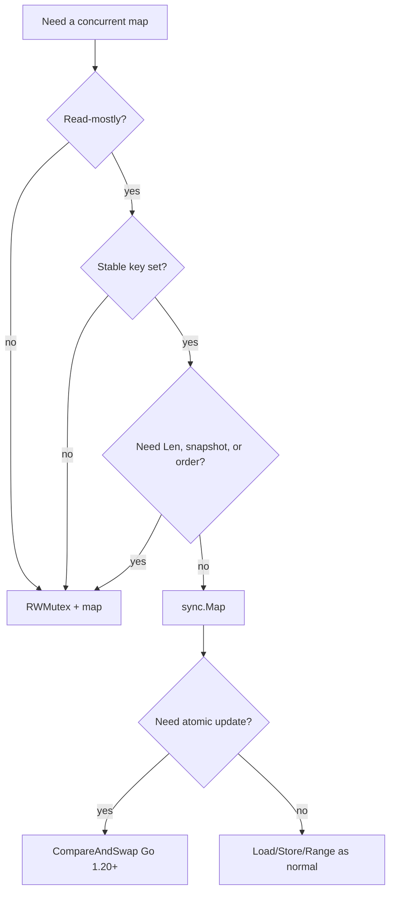

# sync.Map — Junior Level

## Table of Contents
1. [Introduction](#introduction)
2. [Prerequisites](#prerequisites)
3. [Glossary](#glossary)
4. [Core Concepts](#core-concepts)
5. [Real-World Analogies](#real-world-analogies)
6. [Mental Models](#mental-models)
7. [Pros & Cons](#pros-cons)
8. [Use Cases](#use-cases)
9. [Code Examples](#code-examples)
10. [Coding Patterns](#coding-patterns)
11. [Clean Code](#clean-code)
12. [Product Use / Feature](#product-use-feature)
13. [Error Handling](#error-handling)
14. [Security Considerations](#security-considerations)
15. [Performance Tips](#performance-tips)
16. [Best Practices](#best-practices)
17. [Edge Cases & Pitfalls](#edge-cases-pitfalls)
18. [Common Mistakes](#common-mistakes)
19. [Common Misconceptions](#common-misconceptions)
20. [Tricky Points](#tricky-points)
21. [Test](#test)
22. [Tricky Questions](#tricky-questions)
23. [Cheat Sheet](#cheat-sheet)
24. [Self-Assessment Checklist](#self-assessment-checklist)
25. [Summary](#summary)
26. [What You Can Build](#what-you-can-build)
27. [Further Reading](#further-reading)
28. [Related Topics](#related-topics)
29. [Diagrams & Visual Aids](#diagrams-visual-aids)

---

## Introduction
> Focus: "Why does Go crash when two goroutines write to my map? What does `sync.Map` do that fixes it? When is it actually the right answer?"

Go's built-in `map` is convenient, fast, and unsafe. Specifically, it is **not safe for concurrent use**: if two goroutines write to the same map at the same time, or one writes while another reads, the runtime aborts the program with a fatal error:

```
fatal error: concurrent map writes
```

This is not a recoverable panic. The detector lives inside the runtime and there is no `recover` for it. The program dies.

The standard library offers two fixes:

1. Wrap the map in a `sync.Mutex` (or `sync.RWMutex`) and lock around every access.
2. Use `sync.Map`, a purpose-built concurrent map type.

This file is about option 2 — `sync.Map`. At junior level your goals are:

- Understand *why* ordinary maps are unsafe and *how* to recognise the crash.
- Learn the core `sync.Map` API: `Load`, `Store`, `LoadOrStore`, `LoadAndDelete`, `Delete`, `Range`.
- Know enough about *when* to use `sync.Map` versus a mutex-guarded map to make a reasonable first choice. (The deep decision matrix lives at middle level.)

You do not need to understand the internal `read`/`dirty`/`expunged` machinery yet. That belongs to professional level. You also do not need to write your own generic wrappers around `sync.Map` — middle level. For now: know the API, know the cardinal rule that `sync.Map` is read-mostly, and write your first concurrent cache.

---

## Prerequisites

- **Required:** Comfort with the built-in `map[K]V` type. You can declare one, insert keys, iterate with `range`.
- **Required:** Familiarity with goroutines and `sync.WaitGroup`. You can spawn N workers and wait for them.
- **Required:** A Go installation 1.18 or newer. `sync.Map` exists since Go 1.9; Go 1.20 added `Swap`, `CompareAndSwap`, and `CompareAndDelete`.
- **Helpful:** Knowledge of `sync.Mutex` and `sync.RWMutex`. You will see them compared with `sync.Map` repeatedly.
- **Helpful:** Awareness of the `go test -race` flag. It catches concurrent-map bugs reliably.

If you can write a goroutine that increments a counter under a mutex, you are ready.

---

## Glossary

| Term | Definition |
|------|-----------|
| **Concurrent map access** | Two or more goroutines touching the same `map[K]V` value, where at least one is writing. With the built-in `map`, this is a runtime crash. |
| **`fatal error: concurrent map writes`** | The runtime detector message. Printed when two writes race; the process aborts. Also fires for one write + one read. |
| **`sync.Map`** | A type in the `sync` package whose methods are safe to call from multiple goroutines without external locking. Its zero value is ready to use. |
| **`Load`** | Looks up a key. Returns `(value, ok)` like a regular map. Concurrency-safe. |
| **`Store`** | Inserts or overwrites a key. Concurrency-safe. |
| **`LoadOrStore`** | Atomic "if absent, set; in either case return the current value." The race-free way to populate a cache entry once. |
| **`LoadAndDelete`** | Atomic "get the value and remove the entry." Useful for handoff-style flows. |
| **`Delete`** | Removes a key. Concurrency-safe. No return value. |
| **`Range`** | Visits each key-value pair. Snapshot-ish — neither strictly consistent nor strictly ordered. Stops if the callback returns `false`. |
| **`Swap`** (Go 1.20) | Atomically replaces a value and returns the previous one. Like `Store` plus a result. |
| **`CompareAndSwap`** (Go 1.20) | Atomic "if the current value equals `old`, replace it with `new`." Returns `true` on success. |
| **`CompareAndDelete`** (Go 1.20) | Atomic "if the current value equals `old`, delete the entry." Returns `true` on success. |
| **Type-unsafe API** | `sync.Map` uses `any` (formerly `interface{}`) for both keys and values. You must type-assert on `Load`. There is no generics-based version in the standard library yet. |
| **`RWMutex + map`** | The alternative: a regular `map[K]V` field plus an `sync.RWMutex` field, locked by hand around each operation. Often faster than `sync.Map` for balanced workloads. |

---

## Core Concepts

### Built-in maps are not safe for concurrent use

This is the rule. The Go specification does not promise anything about concurrent access to a map. The runtime additionally installs a *detector* that catches obvious violations and crashes the program intentionally — much better than silent corruption.

```go
package main

import "sync"

func main() {
    m := map[int]int{}
    var wg sync.WaitGroup
    for i := 0; i < 1000; i++ {
        wg.Add(1)
        go func(i int) {
            defer wg.Done()
            m[i] = i // BUG: concurrent writes
        }(i)
    }
    wg.Wait()
}
```

Run this and you will see, with high probability:

```
fatal error: concurrent map writes
```

The error is loud, the stack trace points at the offending line, and the program exits with a non-zero status. This is one of the kindest bugs in Go — it bites early and obviously.

### What "concurrent" means here

"Concurrent" means *unsynchronised access at the same time from different goroutines, where at least one is a write*. Two reads in parallel are fine. A write while a read is happening is not. You can have a million reads in a million goroutines, all racing each other, with no crash — until one goroutine writes. Then everything blows up.

### `sync.Map`: the standard-library answer

`sync.Map` is a struct in the `sync` package. Its methods are safe to call from any number of goroutines. The zero value is a usable empty map; you do not need a constructor.

```go
var m sync.Map
m.Store("alice", 42)
v, ok := m.Load("alice")
fmt.Println(v, ok) // 42 true
```

Note the differences from a built-in map:

- No type parameters. `Store(key, value any)`. You pass anything; you receive `any`.
- You must type-assert on `Load`: `v.(int)`, `v.(string)`, etc.
- No `len`, no `[key]` indexing, no `for k, v := range m`. Iteration goes through `Range`.

### The basic API in one block

```go
var m sync.Map

// Insert or overwrite
m.Store(key, value)

// Look up
v, ok := m.Load(key)

// Insert if absent (atomic)
actual, loaded := m.LoadOrStore(key, value)
// loaded == true if the key existed; actual is the existing value
// loaded == false if we just inserted; actual is the value we passed in

// Delete
m.Delete(key)

// Get and delete (atomic)
v, ok := m.LoadAndDelete(key)

// Iterate
m.Range(func(key, value any) bool {
    // return true to continue, false to stop
    return true
})
```

That is the core. The Go 1.20 additions (`Swap`, `CompareAndSwap`, `CompareAndDelete`) build on this and are covered briefly at the end of this file, in depth at middle level.

### `sync.Map` is *not* a general-purpose replacement

This is the most important thing to internalise at junior level: **`sync.Map` is optimised for two specific access patterns**, and outside of them it is slower than a plain mutex-guarded map.

The two patterns are:

1. **Read-mostly maps with stable keys.** The set of keys does not change much; values may. Reads vastly outnumber writes. Example: a config table read on every request, updated rarely.
2. **Per-goroutine entries that no other goroutine touches.** Each goroutine writes to its own key; cross-goroutine reads are rare. Example: a connection registry keyed by connection ID.

Any other workload — and especially balanced read/write or a constantly-growing key set — usually performs better with `RWMutex + map[K]V`. We will cover the why at middle level. For now: when in doubt, use `RWMutex + map[K]V`.

### `sync.Map` cannot be copied

Like all `sync` package types, `sync.Map` must not be copied after first use. The struct contains a mutex and atomic pointers internally; copying produces two halves of the same state.

```go
var m sync.Map
m.Store(1, "a")
m2 := m // BUG: do not copy
```

`go vet` flags this. Always pass `*sync.Map` between functions, not `sync.Map` by value.

---

## Real-World Analogies

### sync.Map is the post office; the built-in map is your mailbox

Your home mailbox has one key, and you do not expect two roommates to slam letters into it at the same exact moment. The post office, on the other hand, has hundreds of clerks processing parcels concurrently behind a counter that handles synchronisation by design. The built-in `map` is the home mailbox; `sync.Map` is the post office. If you only ever access from one goroutine, the mailbox is fine. The moment several goroutines need access, you go to the post office — or you hire one bouncer with a clipboard (a `sync.Mutex`) at the door of your mailbox.

### LoadOrStore is the "claim this seat" lottery

You walk into a movie theatre with 200 friends, all heading to the same seat number. Only one of you will sit. `LoadOrStore` is the ticket counter that says "this seat goes to the first one who asks; everyone else gets told who already has it." You never end up with two people claiming the same seat, and you never need to coordinate amongst yourselves before asking.

### Range is the photographer who walks the room

When you call `Range`, you are not freezing the room. People keep entering and leaving while the photographer walks from table to table snapping pictures. The photo album you end up with is not a perfect snapshot of any single moment — but it is a defensible record of "people who were here, more or less, while I was walking through." Compare with a regular `map`, which iterates over a snapshot of its current state. `sync.Map` does not promise that.

### RWMutex+map is the librarian; sync.Map is the index card catalogue

If your map is mostly read, with rare writes, both approaches work. But the librarian (mutex) is a single point of contention — when she is shelving a book, no one can read. The index card catalogue (`sync.Map`) lets readers grab cards without blocking each other, and only synchronises when a card is updated. The catch: maintaining the catalogue (writes) is more expensive than just shelving a book. The trade-off is real.

---

## Mental Models

### Model 1: "sync.Map is a cache, not a data store"

The clearest way to keep your `sync.Map` use safe is to think of it as a cache: it holds values that can be recomputed, that change rarely, and that many goroutines read. If your use case looks more like a write-heavy ledger, `sync.Map` is probably the wrong answer.

### Model 2: "Two maps in a trench coat"

Internally `sync.Map` is two maps — a read-only one served from atomic reads, and a writable one promoted into the read-only role when enough misses pile up. You do not need to know the details yet, but the model "fast read path, slow write path" helps you predict performance: reads are cheap as long as the key is in the read path, writes are always a bit more expensive than they would be in a plain map.

### Model 3: "No len, no order, no atomic snapshot"

`sync.Map` deliberately omits three things you might assume:

- No `Len()` method. The size is not easily observable in a concurrent world without locking everything; the designers refused to give a misleading answer.
- No iteration order. `Range` visits each key once, but the order is unspecified.
- No atomic snapshot. `Range` may visit a key that was added during iteration, or skip a key that was deleted during iteration. Designed for "give me whatever is around right now," not "give me the exact set at time T."

If you need any of those three, you are using the wrong data structure.

### Model 4: "Generics did not arrive in time"

`sync.Map` predates Go generics. It uses `any` for keys and values. That makes the API verbose (type-assert on every `Load`) and slightly slower (interface boxing for value types). At junior level, accept this and pay the type-assertion tax. At middle level we will look at generic wrappers.

---

## Pros & Cons

### Pros

- **Concurrency-safe without external locking.** You call methods; the type handles synchronisation. No risk of forgetting to unlock.
- **Fast read path for stable keys.** Reads of keys that have been "promoted" to the read-only structure are roughly the cost of an atomic pointer load and a map index. Very cheap.
- **Race-free LoadOrStore.** The atomic "set if absent" semantics removes the classic check-then-set bug that plagues mutex-guarded maps.
- **Race-free LoadAndDelete.** Useful for hand-off flows: one goroutine takes ownership of an entry; no other goroutine sees it after.
- **No need to remember to lock/unlock around every access.** Reduces a class of bugs.
- **Available in the standard library since Go 1.9.** No external dependency.

### Cons

- **Slower writes than mutex-guarded map.** Each write has to coordinate the read/dirty machinery; for write-heavy workloads, this is a real cost.
- **Type-unsafe API.** Type-assertion on every `Load`; bugs hide in `.(int)` vs `.(int64)` mismatches.
- **No `len`.** You cannot ask "how many entries are in this map." `Range` and counting is the only option, and it is O(n) plus inconsistent.
- **No ordered iteration.** Same as built-in map, but combined with no consistent snapshot, `Range` is less predictable than you might think.
- **Memory amplification.** Deleted entries are not immediately freed; they sit as tombstones until the read structure is rebuilt. For high-churn workloads, this hurts.
- **Not generic.** The `interface{}` API forces boxing of small types like `int` or `bool`, adding allocation pressure.

---

## Use Cases

| Scenario | sync.Map fit |
|---|---|
| Cache of compiled regexes keyed by pattern string | Excellent — read-mostly, stable keys |
| Connection registry keyed by ID | Good — per-goroutine writes, occasional reads |
| Per-host rate limiter state | Good — read-mostly, occasional new hosts |
| HTTP middleware route cache | Excellent — built once, read constantly |
| Lookup table with very rare invalidation | Excellent |
| Counter map updated by all goroutines | Bad — write-heavy, use `RWMutex+map` or atomic counters |
| Inverted index built at runtime | Bad — write-heavy population phase |
| Map you need to snapshot atomically | Bad — `Range` is not a snapshot |
| Map where you call `len` often | Bad — there is no `Len` method |
| Map with very short lifetime per entry (high churn) | Bad — memory amplification hurts |

The decision matrix is fleshed out at middle level; for now, follow the rule: **read-mostly with stable keys, yes; everything else, default to `RWMutex+map`.**

---

## Code Examples

### Example 1: The crash you must recognise

```go
package main

import "sync"

func main() {
    m := map[int]int{}
    var wg sync.WaitGroup
    for i := 0; i < 1000; i++ {
        wg.Add(1)
        go func(i int) {
            defer wg.Done()
            m[i] = i
        }(i)
    }
    wg.Wait()
}
```

Run with `go run`. Expected output:

```
fatal error: concurrent map writes

goroutine 7 [running]:
runtime.throw({0x..., 0x15})
        /usr/local/go/src/runtime/panic.go:1077 +0x5c fp=...
runtime.mapassign_fast64(...)
        /usr/local/go/src/runtime/map_fast64.go:101 +0x33c
main.main.func1(...)
```

The exact line numbers depend on your Go version. The message — `concurrent map writes` — is the giveaway. This is *not* a panic you can recover.

### Example 2: The same code with `sync.Map`

```go
package main

import "sync"

func main() {
    var m sync.Map
    var wg sync.WaitGroup
    for i := 0; i < 1000; i++ {
        wg.Add(1)
        go func(i int) {
            defer wg.Done()
            m.Store(i, i)
        }(i)
    }
    wg.Wait()
}
```

No crash. The map ends up with 1000 entries, each `key == value`. No external locking is needed.

### Example 3: Basic Load/Store

```go
package main

import (
    "fmt"
    "sync"
)

func main() {
    var users sync.Map

    users.Store("alice", 30)
    users.Store("bob", 25)

    if v, ok := users.Load("alice"); ok {
        age := v.(int) // type assertion required
        fmt.Println("alice is", age)
    }

    if _, ok := users.Load("carol"); !ok {
        fmt.Println("carol not in map")
    }
}
```

Notice the `v.(int)` assertion. `sync.Map` returns `any`; you must convert.

### Example 4: LoadOrStore — the race-free populate

```go
package main

import (
    "fmt"
    "sync"
)

var cache sync.Map

func getOrInit(key string) string {
    // First, try a cheap Load.
    if v, ok := cache.Load(key); ok {
        return v.(string)
    }
    // Slow path: compute the value and store it.
    computed := "value for " + key
    actual, loaded := cache.LoadOrStore(key, computed)
    if loaded {
        // Someone else stored it first; use theirs.
        return actual.(string)
    }
    return computed
}

func main() {
    var wg sync.WaitGroup
    for i := 0; i < 5; i++ {
        wg.Add(1)
        go func() {
            defer wg.Done()
            fmt.Println(getOrInit("user-42"))
        }()
    }
    wg.Wait()
}
```

`LoadOrStore` returns `(actual, loaded)`. If `loaded == true`, the key already existed; `actual` is the existing value. If `loaded == false`, you just inserted; `actual` is the value you passed in. **Both branches need handling**, because two goroutines might race to populate the same key, and only one wins.

### Example 5: LoadAndDelete — hand-off pattern

```go
package main

import (
    "fmt"
    "sync"
)

func main() {
    var inflight sync.Map

    // Producer puts work in.
    inflight.Store("job-1", "payload")

    // Consumer takes it out atomically.
    if v, ok := inflight.LoadAndDelete("job-1"); ok {
        fmt.Println("got:", v) // payload
    }

    // Second consumer sees nothing.
    if _, ok := inflight.LoadAndDelete("job-1"); !ok {
        fmt.Println("already taken")
    }
}
```

This is the typical "claim a unit of work" pattern. The `LoadAndDelete` is atomic: only one consumer can succeed.

### Example 6: Delete

```go
var m sync.Map
m.Store("a", 1)
m.Delete("a")
_, ok := m.Load("a")
fmt.Println(ok) // false
```

`Delete` does not return whether the key existed. Use `LoadAndDelete` if you need that information.

### Example 7: Range

```go
var m sync.Map
m.Store("a", 1)
m.Store("b", 2)
m.Store("c", 3)

m.Range(func(key, value any) bool {
    fmt.Println(key, value)
    return true // continue
})
```

Output: some permutation of `a 1`, `b 2`, `c 3`. The order is not specified, just like the built-in map.

### Example 8: Range with early exit

```go
m.Range(func(key, value any) bool {
    if key.(string) == "stop-here" {
        return false // stop iteration
    }
    fmt.Println(key, value)
    return true
})
```

Returning `false` aborts the iteration immediately. Useful for "find the first match" patterns.

### Example 9: Counter (anti-pattern — read this and learn the lesson)

```go
package main

import (
    "fmt"
    "sync"
)

func main() {
    var counters sync.Map
    var wg sync.WaitGroup
    for i := 0; i < 1000; i++ {
        wg.Add(1)
        go func() {
            defer wg.Done()
            // BUG: race between Load and Store
            v, _ := counters.LoadOrStore("hits", 0)
            counters.Store("hits", v.(int)+1)
        }()
    }
    wg.Wait()

    v, _ := counters.Load("hits")
    fmt.Println("hits:", v) // almost certainly less than 1000
}
```

The `Load`-then-`Store` pattern is not atomic. Two goroutines can both read the same value, both increment, both store, and an update is lost. The fix is `CompareAndSwap` (Go 1.20+) or use an `atomic.Int64` field instead of `sync.Map` for counters. See middle level.

### Example 10: Race-free counter with CompareAndSwap (Go 1.20+)

```go
package main

import (
    "fmt"
    "sync"
)

func main() {
    var counters sync.Map
    counters.Store("hits", 0)
    var wg sync.WaitGroup
    for i := 0; i < 1000; i++ {
        wg.Add(1)
        go func() {
            defer wg.Done()
            for {
                v, _ := counters.Load("hits")
                if counters.CompareAndSwap("hits", v, v.(int)+1) {
                    return
                }
                // loser retries
            }
        }()
    }
    wg.Wait()

    v, _ := counters.Load("hits")
    fmt.Println("hits:", v) // exactly 1000
}
```

Requires Go 1.20+. The retry loop is the classic "CAS" pattern. Honestly, for counters, an `atomic.Int64` is simpler and faster — `sync.Map` is overkill here. The example is included so you see what `CompareAndSwap` looks like.

---

## Coding Patterns

### Pattern 1: Read-mostly cache

```go
type Cache struct {
    m sync.Map // map[string]*Entry
}

func (c *Cache) Get(key string) (*Entry, bool) {
    v, ok := c.m.Load(key)
    if !ok {
        return nil, false
    }
    return v.(*Entry), true
}

func (c *Cache) Set(key string, e *Entry) {
    c.m.Store(key, e)
}
```

This is the textbook fit for `sync.Map`: read-heavy lookups with rare writes. The type assertion is encapsulated in the wrapper.

### Pattern 2: Compute-once population

```go
var cache sync.Map

func getOrCompute(key string) string {
    if v, ok := cache.Load(key); ok {
        return v.(string)
    }
    computed := compute(key) // expensive
    actual, _ := cache.LoadOrStore(key, computed)
    return actual.(string)
}
```

Two goroutines may both compute. Only one wins the `LoadOrStore`. The wasted computation is the cost. If `compute` is expensive enough that even one wasted run hurts, use `golang.org/x/sync/singleflight` — covered at senior level.

### Pattern 3: Hand-off / take-once

```go
var pending sync.Map

func produce(id string, work *Work) {
    pending.Store(id, work)
}

func consume(id string) (*Work, bool) {
    v, ok := pending.LoadAndDelete(id)
    if !ok {
        return nil, false
    }
    return v.(*Work), true
}
```

Only one consumer can take each entry. The producer does not coordinate with the consumer beyond storing.

### Pattern 4: Range to collect a snapshot (with caveats)

```go
keys := []string{}
m.Range(func(key, _ any) bool {
    keys = append(keys, key.(string))
    return true
})
```

This collects a list of keys. **It is not a transactional snapshot.** Keys added after iteration starts may or may not appear; keys deleted during iteration may still appear. For most reporting purposes that is fine; for anything requiring exactness, lock the map yourself (which means you should not be using `sync.Map`).

---

## Clean Code

- **Wrap `sync.Map` in a typed struct.** The raw `any`-based API leaks types throughout your code. A small wrapper that does the type assertions in one place keeps callers clean.
- **Document the workload assumption.** A comment that says "this map is read-mostly; do not switch to it for write-heavy use" prevents the next engineer from regressing performance.
- **Prefer named methods like `Get`, `Set`.** Avoid exposing `Load`, `Store` at your package boundary — they are unfamiliar to engineers without Go context.
- **Never copy `sync.Map`.** Pass `*sync.Map` (or your wrapper struct by pointer) between functions. `go vet` will flag value copies.
- **Use a `*sync.Map` field, not embedding.** Embedding `sync.Map` in a struct works but exposes all of its API to callers. A named field is cleaner.

```go
// Clean:
type Registry struct {
    conns *sync.Map // map[ConnID]*Conn
}

// Hairier:
type Registry struct {
    sync.Map // every caller can do reg.Load(...)
}
```

---

## Product Use / Feature

| Product feature | How `sync.Map` helps |
|---|---|
| Server-wide route cache | Routes are loaded once at startup, read on every request. Read-mostly is the perfect fit. |
| Per-tenant rate limiter | One bucket per tenant ID; lookups dominate writes once tenants are known. |
| WebSocket connection registry | Each connection inserts itself once and removes itself on close; cross-connection lookups happen occasionally. |
| Feature-flag lookup at runtime | Flags are pushed via a control plane on rare events; reads happen on every request. |
| TLS certificate cache | Look up by SNI; new certs added rarely; reads happen constantly. |
| Active session store | Session IDs as keys; data accessed by request handlers; small number of writes (login, logout). |

In each case, the access pattern is "many reads, few writes, stable-ish key set." That is the `sync.Map` sweet spot.

---

## Error Handling

`sync.Map` itself does not return errors. Its surface is small and uses `(value, ok)` patterns instead. Where errors enter is in the surrounding logic:

```go
v, ok := m.Load(key)
if !ok {
    return fmt.Errorf("key %q not found", key)
}
e, ok := v.(*Entry)
if !ok {
    return fmt.Errorf("internal: unexpected type %T for key %q", v, key)
}
```

That second check matters. If your code somehow stores the wrong type — perhaps a future change introduces a bug — the type assertion will panic unless you use the comma-ok form. In production code, always use comma-ok form for assertions on `sync.Map` values.

```go
// Risky:
e := v.(*Entry) // panics on type mismatch

// Safer:
e, ok := v.(*Entry)
if !ok {
    return errors.New("invalid cache entry")
}
```

---

## Security Considerations

- **Denial-of-service via unbounded growth.** If keys come from untrusted input and you never `Delete`, an attacker can OOM your service. Cap the size, or use an LRU cache (`groupcache`, `ristretto`) instead.
- **Memory amplification with high churn.** A workload that constantly stores and deletes keys will retain memory for tombstoned entries longer than you expect. See professional level for the `expunged` mechanics.
- **Type confusion bugs.** `sync.Map` stores `any`. A bug elsewhere that stores the wrong type is invisible until a `Load` produces a wrong-typed value and a type assertion panics. Wrap with a typed struct.
- **`Range` is not transactional.** Do not use it for security-critical checks like "is this user in the deny list" if entries may be modified concurrently — there is no atomic snapshot. Use a mutex around the deny list, or a read-only `atomic.Pointer[map[K]V]`.

---

## Performance Tips

- **Treat `sync.Map` as read-optimised.** If reads outnumber writes 10:1 or more and keys are mostly stable, `sync.Map` wins. Otherwise, benchmark before assuming.
- **Benchmark before choosing.** A `go test -bench` comparison between `sync.Map` and `RWMutex+map` for your real workload is cheap and decisive. Middle level shows full benchmark code.
- **Watch out for boxing.** Storing `int` in a `sync.Map` boxes it as an `interface{}` value, allocating on the heap. For high-throughput int maps, consider `[]atomic.Int64` indexed by a hash, or a sharded `RWMutex+map`.
- **Avoid using `Range` to compute size.** Counting via `Range` is O(n) and inconsistent. If you need size often, your data structure is wrong.
- **Pre-warm the read path.** A `sync.Map` with stable keys reaches steady-state performance after enough `Load` calls promote keys to the read structure. Cold first reads are slower.

---

## Best Practices

1. **Use `sync.Map` only for read-mostly maps with stable keys, or per-goroutine entries.** For anything else, start with `RWMutex+map[K]V`.
2. **Never copy a `sync.Map`.** Pass by pointer.
3. **Always type-assert with comma-ok.** Avoid the production panic from a bad type assertion.
4. **Wrap in a typed struct.** Hide the `any` API.
5. **Prefer `LoadOrStore` to "check then store."** Avoid time-of-check-to-time-of-use races.
6. **Do not rely on `Range` for snapshots.** Lock externally if you need consistency.
7. **Run `go test -race` in CI.** Catches both the obvious "wrong map type" bugs and subtler ones around mixed access.
8. **Use `CompareAndSwap` (Go 1.20+) instead of `Load`+`Store`** when you need atomic update of a single key.
9. **Do not store counters in `sync.Map`** — use `atomic.Int64` per shard or a single counter.
10. **Cap the size if keys come from untrusted input.** Untrusted growth equals OOM.

---

## Edge Cases & Pitfalls

### `Range` mid-update

```go
m.Store("a", 1)
m.Store("b", 2)
m.Range(func(k, v any) bool {
    if k.(string) == "a" {
        m.Store("c", 3) // may or may not be visited
        m.Delete("b")   // may or may not be visited
    }
    return true
})
```

The behaviour is implementation-defined. The docs say `Range` "may reflect any mapping for that key from any point during the Range call" — meaning you cannot guarantee what is or is not seen. Do not write code that depends on it.

### LoadOrStore with non-comparable types as values

The *value* can be anything. The *key*, however, must be comparable (equal-to-equal). Functions, slices, and maps are not comparable; using them as keys panics at runtime.

```go
var m sync.Map
m.Store([]int{1, 2}, "x") // panic: runtime error: hash of unhashable type []int
```

This is the same restriction as the built-in `map`.

### Mixing key types

A `sync.Map` uses `any` for keys. You can store both `"1"` and `1` as keys; they are different (a string and an int). This is a footgun: an integer key and its string form are distinct entries.

```go
m.Store(1, "int")
m.Store("1", "string")
v, _ := m.Load(1)   // "int"
v, _ = m.Load("1")  // "string"
```

Stick to one key type per map and document it.

### Zero value vs deleted

```go
v, ok := m.Load("missing")
fmt.Println(v, ok) // nil false
```

Missing key returns `(nil, false)`. The same as a deleted key. You cannot distinguish "never inserted" from "deleted recently" without external state.

### Storing `nil` values

```go
m.Store("key", nil) // legal
v, ok := m.Load("key") // v == nil, ok == true
```

Storing `nil` is legal. The `ok` flag still tells you the entry exists. Do not mistake `v == nil` for "missing."

### Copying through closure

```go
var m sync.Map
go func() {
    var localCopy = m // BUG: vet flags this
    localCopy.Store("x", 1)
}()
```

Once `sync.Map` has been used, it cannot be copied. The closure-captured `m` is fine (closures capture by reference for struct vars at function scope), but explicit assignment makes a copy.

---

## Common Mistakes

| Mistake | Fix |
|---|---|
| Using `sync.Map` for write-heavy maps | Use `RWMutex+map`. |
| Doing `v, _ := m.Load(k); m.Store(k, v+1)` to increment a counter | Use `CompareAndSwap` (Go 1.20+) or `atomic.Int64` outside the map. |
| Forgetting the type assertion is fallible | Always use comma-ok: `v, ok := raw.(*T)`. |
| Calling `len` on `sync.Map` (it does not exist) | Track size externally with `atomic.Int64`. |
| Iterating with `Range` and expecting a snapshot | It is not. Lock externally if you need a snapshot. |
| Storing a `sync.Map` by value in another struct | Use a pointer field. |
| Using a non-comparable key (slice, map) | Stick to strings, ints, pointers, or comparable structs. |
| Mixing key types (e.g., `int(1)` and `"1"`) | Use one key type per map. |
| Forgetting that `Delete` does not return the old value | Use `LoadAndDelete` when you need the value too. |
| Treating `sync.Map` as the default concurrent-map | It is a specialised tool; default to `RWMutex+map`. |

---

## Common Misconceptions

> *"`sync.Map` is faster than a regular map."* — No. A `sync.Map` is always slower than a single-goroutine `map`. It is *concurrency-safe*, which has a cost.

> *"`sync.Map` is a drop-in replacement for `map` in concurrent code."* — No. It is optimised for read-mostly access. For balanced workloads, `RWMutex+map` is usually faster.

> *"I should always use `sync.Map` for concurrent maps."* — No. The Go authors explicitly say use it only for the two access patterns listed. Otherwise use a mutex-guarded map.

> *"`Range` gives me a consistent snapshot."* — No. Concurrent stores may or may not be visible during iteration.

> *"`LoadOrStore` is the same as `Load` followed by `Store`."* — No. `LoadOrStore` is atomic; the manual version is not, and a race can lose updates.

> *"`Delete` decrements some size counter."* — There is no size counter. `Delete` removes the entry from the map; calling `Range` afterward will skip it.

> *"`sync.Map` calls panic on key collision."* — No. It overwrites silently, just like a built-in map.

> *"`sync.Map` is thread-safe but goroutine-unsafe."* — The terms are synonymous in Go. It is safe for concurrent goroutine access.

> *"`sync.Map` uses fine-grained locking."* — Not really. It uses a single mutex internally, but the fast read path avoids it via atomic pointer reads. Details at professional level.

> *"Generic `sync.Map[K, V]` exists in the standard library."* — Not yet (as of Go 1.22). There is a proposal but it has not landed. You can build your own wrapper or use community libraries.

---

## Tricky Points

### `Range` may see an entry inserted during the call

If you `Store` a key from inside the `Range` callback, the new key may or may not be visited. Do not depend on either outcome.

### `Range` does not block other writers

While `Range` is running, other goroutines can still `Store`, `Delete`, etc. This is what makes it concurrent — but also what makes it non-transactional.

### The value parameter of `LoadOrStore` is always evaluated

```go
m.LoadOrStore(key, expensiveCompute())
```

`expensiveCompute()` runs every time, even if the key already exists. Go is eager: arguments are evaluated before the call. To avoid this, check first:

```go
if v, ok := m.Load(key); ok {
    return v
}
actual, _ := m.LoadOrStore(key, expensiveCompute())
return actual
```

### `Store` on a `sync.Map` cannot be "transactionally" combined with another `Store`

There is no `Update(k1, v1, k2, v2)` API. If you need two stores to be atomic together, `sync.Map` is the wrong tool — use a mutex around your own `map[K]V`.

### A `sync.Map` you `Range` over may visit a key multiple times in theory

The docs say `Range` "visits each key at most once" *for the keys that exist when Range is called*. Keys inserted during `Range` are visited at most once but may or may not be visited. In practice, you should not see duplicates, but the spec wording is conservative.

### The Go 1.20 additions matter

Before Go 1.20, `sync.Map` had no atomic update. You had to fall back to a mutex for "increment if exists" semantics. Since 1.20, `CompareAndSwap` and friends close that gap. If you are on a pre-1.20 Go, you have fewer tools.

### Comparable-key constraint

The key type must be comparable in the usual Go sense (works with `==`). A struct with a slice field is *not* comparable. The error is a runtime panic, not a compile error, because the API uses `any`. This is a regression compared with the typed built-in map, where the compiler enforces it.

---

## Test

```go
// sync_map_basic_test.go
package syncmap_test

import (
    "sync"
    "sync/atomic"
    "testing"
)

func TestStoreLoad(t *testing.T) {
    var m sync.Map
    m.Store("a", 1)
    v, ok := m.Load("a")
    if !ok || v.(int) != 1 {
        t.Fatalf("expected 1,true got %v,%v", v, ok)
    }
}

func TestLoadOrStoreRace(t *testing.T) {
    var m sync.Map
    var wg sync.WaitGroup
    var winners int64
    for i := 0; i < 100; i++ {
        wg.Add(1)
        go func() {
            defer wg.Done()
            _, loaded := m.LoadOrStore("k", 42)
            if !loaded {
                atomic.AddInt64(&winners, 1)
            }
        }()
    }
    wg.Wait()
    if winners != 1 {
        t.Fatalf("expected exactly 1 winner, got %d", winners)
    }
}

func TestRangeStopEarly(t *testing.T) {
    var m sync.Map
    for i := 0; i < 10; i++ {
        m.Store(i, i)
    }
    seen := 0
    m.Range(func(_, _ any) bool {
        seen++
        return seen < 3
    })
    if seen != 3 {
        t.Fatalf("expected to stop at 3, got %d", seen)
    }
}
```

Run with the race detector:

```bash
go test -race ./...
```

The race detector picks up most concurrent-map bugs. It will not catch all `sync.Map` misuse (because the type itself is safe), but it will catch any *external* state you accidentally race on.

---

## Tricky Questions

**Q.** Will this program crash?

```go
m := map[int]int{}
for i := 0; i < 100; i++ {
    go func(i int) { m[i] = i }(i)
}
time.Sleep(time.Second)
```

**A.** Almost certainly yes — `fatal error: concurrent map writes`. The detector fires when two goroutines write to the same map. Even if it does not crash this time, the behaviour is undefined and corruption is possible.

---

**Q.** What does this print?

```go
var m sync.Map
m.Store("x", nil)
v, ok := m.Load("x")
fmt.Println(v, ok)
```

**A.** `<nil> true`. Storing `nil` is legal; the entry exists; the value is `nil`.

---

**Q.** What happens here?

```go
var m sync.Map
m.Store([]int{1, 2}, "boom")
```

**A.** Runtime panic: `runtime error: hash of unhashable type []int`. Slices are not comparable and cannot be map keys. The compiler does not catch this because the API uses `any`.

---

**Q.** Why is `Load`-then-`Store` not safe for counters?

**A.** Between the `Load` and the `Store`, another goroutine may have stored a different value, and your `Store` overwrites it with an outdated increment. Updates are lost. Use `CompareAndSwap` (Go 1.20+) in a retry loop, or use `atomic.Int64`.

---

**Q.** Can I call `Range` from inside a `Range` callback?

**A.** Technically yes — the methods are reentrant. But the behaviour is hard to reason about (the inner range starts a new walk of the current state), and the docs do not promise anything specific. Avoid.

---

**Q.** Is there a `Len()` method?

**A.** No. The Go authors omitted it because returning a consistent length in a lock-free concurrent map is either impossible or expensive. Track size with `atomic.Int64` if you need it.

---

**Q.** What if I copy a `sync.Map` by value?

**A.** `go vet` warns. The runtime behaviour is undefined — likely you get two halves of the same internal state pointing at the same atomic pointer fields, leading to silent corruption. Pass by pointer.

---

**Q.** Why is `sync.Map` not generic?

**A.** It predates Go generics (added in Go 1.18). A generic version has been proposed but has tricky design questions — for example, generic methods are not yet supported, so the API would change shape. As of Go 1.22 the standard library remains `any`-based.

---

## Cheat Sheet

```go
// Declare
var m sync.Map

// Insert/overwrite
m.Store(key, value)

// Look up
if v, ok := m.Load(key); ok {
    use(v.(*Entry))
}

// Insert if absent (atomic)
actual, loaded := m.LoadOrStore(key, value)

// Delete
m.Delete(key)

// Get and delete (atomic)
v, ok := m.LoadAndDelete(key)

// Iterate (not a snapshot)
m.Range(func(k, v any) bool {
    return true
})

// Atomic update (Go 1.20+)
m.Swap(key, newVal)                // returns previous, loaded
m.CompareAndSwap(key, oldVal, newVal)
m.CompareAndDelete(key, oldVal)
```

When to use:

```
read-mostly + stable keys     -> sync.Map
balanced read/write           -> RWMutex + map
write-heavy                   -> RWMutex + map
need len, ordered iter, snap  -> RWMutex + map
plain counter                 -> atomic.Int64
load-once expensive value     -> singleflight
shared single value           -> atomic.Pointer
```

---

## Self-Assessment Checklist

- [ ] I can explain why the built-in `map` is unsafe for concurrent use, and recognise the `fatal error: concurrent map writes` message.
- [ ] I can write a `Load`, `Store`, `Delete`, and `Range` call without consulting docs.
- [ ] I know `LoadOrStore` returns `(actual, loaded)` and what each value means.
- [ ] I know `sync.Map` cannot be copied.
- [ ] I know there is no `Len` method.
- [ ] I know `Range` is not a snapshot.
- [ ] I can describe the two access patterns `sync.Map` is optimised for.
- [ ] I know that for write-heavy workloads, `RWMutex+map` is usually faster.
- [ ] I know that the API uses `any` and that I must type-assert on `Load`.
- [ ] I know about the Go 1.20 additions `Swap`, `CompareAndSwap`, `CompareAndDelete`.

---

## Summary

`sync.Map` is the standard-library answer to "I have many goroutines reading and writing a map." Its zero value is ready to use; its API is small (`Load`, `Store`, `LoadOrStore`, `LoadAndDelete`, `Delete`, `Range`, plus the 1.20 additions); its sweet spot is **read-mostly maps with stable keys** and **per-goroutine entries with rare cross-goroutine access**.

For everything else — balanced read/write, write-heavy, need `len`, need ordered iteration, need an atomic snapshot — reach for `RWMutex + map[K]V` instead. The plain map under a mutex is faster for those workloads and gives you a typed API.

The pitfalls to internalise at junior level: never copy a `sync.Map`, always type-assert with comma-ok, never do `Load` then `Store` to increment (use `CompareAndSwap` or `atomic.Int64`), and never trust `Range` to be a snapshot.

The deep internals (read/dirty/expunged, promotion, amplification) wait for professional level. The decision matrix and benchmarks wait for middle level. For now: write a small read-mostly cache, watch the type assertions, and run `go test -race` over it.

---

## What You Can Build

After mastering this material:

- A per-request route cache that maps URL patterns to handler functions.
- A small in-memory user-profile cache keyed by user ID.
- A connection registry for a WebSocket server.
- A simple rate-limit counter keyed by IP (with `CompareAndSwap`).
- A feature-flag lookup table updated by a control-plane goroutine.
- A typed wrapper struct that hides the `any` API behind `Get` / `Set` / `Delete`.

---

## Further Reading

- The Go standard library docs — `sync.Map`: <https://pkg.go.dev/sync#Map>
- The Go Blog — *Go 1.9 release notes (`sync.Map` introduction)*: <https://go.dev/blog/go1.9>
- The Go 1.20 release notes — `Swap`, `CompareAndSwap`, `CompareAndDelete`: <https://go.dev/doc/go1.20#sync>
- Bryan Mills — *Rethinking Classical Concurrency Patterns*: <https://www.youtube.com/watch?v=5zXAHh5tJqQ>
- The Go FAQ — *Why are map operations not defined to be atomic?*: <https://go.dev/doc/faq#atomic_maps>

---

## Related Topics

- `sync.Mutex` and `sync.RWMutex` — the simpler alternative
- `sync/atomic` — atomic primitives, useful for counters that do not need a map
- `golang.org/x/sync/singleflight` — for load-once with concurrent callers
- Sharded maps — when one big map under a mutex is the bottleneck
- `context.Context` — for cancellation of long-running `Range` calls

---

## Diagrams & Visual Aids

### Built-in map under concurrent access

```
goroutine A:  m["x"] = 1   --+
                              |  CRASH
goroutine B:  m["y"] = 2   --+   "fatal error: concurrent map writes"
```

### sync.Map under concurrent access

```
goroutine A:  m.Store("x", 1)  --+
                                  |  no crash; internal coordination
goroutine B:  m.Store("y", 2)  --+
```

### LoadOrStore decision

```
                +----------------------+
                | LoadOrStore(k, v)    |
                +----------+-----------+
                           |
                  key already exists?
                           |
              +------------+------------+
              | yes                     | no
              v                         v
   return (existing, true)       insert v; return (v, false)
```

### Read path vs write path (high level)

```
sync.Map internals (simplified)

   +---------------+    fast atomic read    +-----------+
   | caller Load() | ---------------------> | read map  |
   +---------------+                        +-----+-----+
                                                  |
                                       (miss)     |
                                                  v
                                            slow lock path
                                                  |
                                                  v
                                            +-----------+
                                            | dirty map |
                                            +-----------+
```

Full diagram at professional level.

### When sync.Map wins vs RWMutex+map (mental model)

```
read ratio
   |
99%|                  +-------------+
   |   sync.Map       |  sync.Map   |
   |   shines         |  still good |
50%|------------------+-------------+----
   |                                |  RWMutex+map
   |   RWMutex+map                  |  shines for
 0%|   wins                         |  writes
   +--------------------------------+----
       stable keys      growing keys
```

A heuristic, not a hard rule. Benchmark for your workload.

### Decision flowchart


