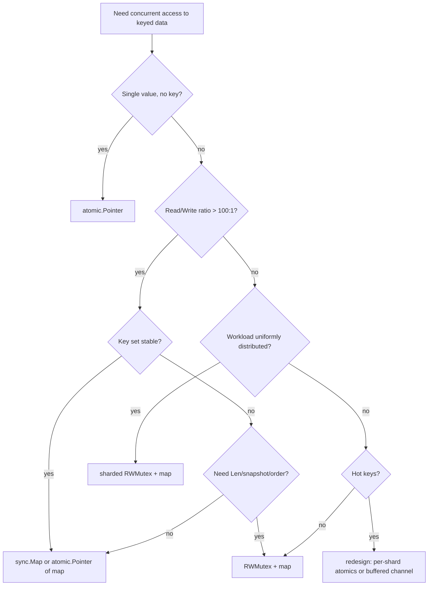

# sync.Map — Optimize

> A field guide to choosing between concurrent-map alternatives and tuning each one. Use this when you have a `sync.Map` in production and want to know whether it earns its keep, or when you are choosing a data structure for a new use case.

---

## Table of Contents
1. [The Decision Tree](#the-decision-tree)
2. [Step 1 — Identify the Workload](#step-1--identify-the-workload)
3. [Step 2 — Benchmark Honestly](#step-2--benchmark-honestly)
4. [Step 3 — Choose the Right Primitive](#step-3--choose-the-right-primitive)
5. [Tuning `sync.Map` Itself](#tuning-syncmap-itself)
6. [Tuning `RWMutex + map`](#tuning-rwmutex--map)
7. [Tuning a Sharded Map](#tuning-a-sharded-map)
8. [When `atomic.Pointer[map]` Beats Both](#when-atomicpointermap-beats-both)
9. [When to Add `singleflight`](#when-to-add-singleflight)
10. [Memory and GC Considerations](#memory-and-gc-considerations)
11. [Replacing a Concurrent Map Entirely](#replacing-a-concurrent-map-entirely)
12. [Checklist Before Shipping](#checklist-before-shipping)

---

## The Decision Tree



This is the answer 80% of the time. The remaining 20% is:

- You need `singleflight` semantics (one compute per key).
- You need TTL / LRU (use a library — `ristretto`, `golang-lru`).
- You need persistence (use Redis / BoltDB / Pebble).

---

## Step 1 — Identify the Workload

Before optimising, characterise:

| Question | Why it matters |
|---|---|
| What is the read/write ratio? | Read-heavy favours `sync.Map` and `atomic.Pointer[map]`; write-heavy favours sharded `RWMutex+map`. |
| How many entries at steady state? | Affects amplification cost, `Range` cost, snapshot cost. |
| Is the key set growing, stable, or shrinking? | Growing keys hurt `sync.Map` (more rebuilds). Shrinking keys hurt all immutable structures. |
| Are operations uniformly distributed across keys? | If hot keys dominate, no map structure helps; you need a different data flow. |
| Do you need `Len`? | `sync.Map` does not have it. |
| Do you need ordered iteration? | None of these provide it; layer a sorted slice on top. |
| Do you need an atomic snapshot? | Only `RWMutex+map` and `atomic.Pointer[map]` support it. |
| Are values comparable? | `CompareAndSwap` requires it. |
| Are values mutable structs or immutable? | Mutable values invite races inside the value; consider immutable + CAS. |
| What is the lifetime of the data structure? | Long-lived structures justify more setup; short-lived favour simplicity. |

Write the answers down. Then proceed.

---

## Step 2 — Benchmark Honestly

The biggest mistake is choosing by reputation. Run your real workload through each candidate.

### Skeleton

```go
package optimize

import (
    "sync"
    "testing"
)

type API interface {
    Get(k int) (int, bool)
    Set(k int, v int)
}

func benchWorkload(b *testing.B, m API, readRatio int) {
    b.ResetTimer()
    b.RunParallel(func(pb *testing.PB) {
        i := 0
        for pb.Next() {
            if i%100 < readRatio {
                m.Get(i % 10000)
            } else {
                m.Set(i%10000, i)
            }
            i++
        }
    })
}

func BenchmarkSyncMap_Read95(b *testing.B) {
    var m wrappedSyncMap
    benchWorkload(b, &m, 95)
}
func BenchmarkLocked_Read95(b *testing.B) {
    m := newLockedMap()
    benchWorkload(b, m, 95)
}
func BenchmarkSharded_Read95(b *testing.B) {
    m := newShardedMap(64)
    benchWorkload(b, m, 95)
}

// repeat for Read50, Read5...
```

Run:

```bash
go test -bench=. -benchmem -cpu=1,2,4,8 ./optimize
```

Compare ns/op, B/op, allocs/op. Decide.

### What to look for

- **Linear scaling with cores.** If a primitive does not scale, contention is the issue. Look at `sync.Mutex` profile (`go test -mutexprofile=mutex.out`).
- **Allocations per operation.** Boxing of value types is the silent killer for `sync.Map`. `B/op > 0` means you are allocating per op.
- **Tail latency.** `ns/op` is the average. For real systems, measure p99 with a histogram. The amplification cost of `sync.Map` rebuilds shows up at p99.

---

## Step 3 — Choose the Right Primitive

A flowchart:

```
                    +---------------------------+
                    | Read-mostly, stable keys? |
                    +---------+-----------------+
                              | yes
                              v
                  +---------------------------+
                  | Writes rare (config-like)?|
                  +---+-----------+-----------+
                      | yes       | no
                      v           v
              atomic.Pointer    sync.Map
              [map[K]V]
                              |
                              v
                       +-------------------------+
                       | Need Len/snapshot/order?|
                       +---+---------+-----------+
                           | yes     | no
                           v         v
                      RWMutex+map  done
```

For balanced or write-heavy:

```
                    +-----------------------+
                    | Hot keys concentrate? |
                    +---+-------+-----------+
                        | yes   | no
                        v       v
                    redesign  sharded
                              RWMutex+map
                              with maphash
```

Sample sharded counts:

| Concurrent goroutines | Shard count |
|---|---|
| 4–8 | 16 |
| 8–32 | 64 |
| 32+ | 128–256 |

More shards reduce contention but add `Len` cost (walking all shards) and per-shard memory.

---

## Tuning `sync.Map` Itself

If `sync.Map` is the right fit, you can still tune around it:

### 1. Store pointers, not values

```go
// Slow: boxing on every Store
m.Store("k", 42)

// Faster for value types: one-time alloc
v := 42
m.Store("k", &v)
// or use an atomic.Int64 pointer for mutation
```

Pointers avoid per-write heap allocation. Especially valuable for primitive value types.

### 2. Pre-warm with `Store` at startup

If you know the key set at startup, store them all eagerly. The first miss-then-promote happens during init, not under request load.

### 3. Avoid `Range` on the hot path

`Range` is O(n) and visits every entry, including tombstoned ones. Schedule it off the request path (background metrics scrape every N seconds).

### 4. Avoid mixed read/write patterns

If a single goroutine alternates `Load` and `Store` on the same key, you defeat the fast path. Consider whether the design is wrong: could you batch the updates?

### 5. Watch for amplification under churn

If `runtime.ReadMemStats` shows growing `HeapInuse` while live entries stay constant, you have a churn problem. Either:

- Periodically replace the entire `sync.Map` (atomic pointer swap).
- Switch to `RWMutex + map`, which handles delete cleanly.
- Use `ristretto` / `golang-lru` for proper LRU eviction.

---

## Tuning `RWMutex + map`

The plain mutex-guarded map is often the right answer. Tune it:

### 1. Use `RLock` for reads, `Lock` for writes

```go
mu.RLock()
v, ok := m[k]
mu.RUnlock()
```

Trivially obvious; surprisingly often forgotten in legacy code. `RLock` is wait-free for readers when no writer is waiting.

### 2. Keep the critical section tiny

```go
// Slow: holds lock while doing expensive work
mu.Lock()
m[k] = expensive() // BAD
mu.Unlock()

// Fast: compute, then lock briefly
v := expensive()
mu.Lock()
m[k] = v
mu.Unlock()
```

The lock is contention. Time inside it is bottleneck.

### 3. Pre-allocate the map

```go
m := make(map[int]int, expectedSize)
```

Avoids re-hashing as the map grows.

### 4. Avoid pointer values where possible

A `map[int]int` is cache-friendlier than `map[int]*int`. Indirection costs cache misses.

### 5. Don't `defer` for very short critical sections

```go
// Defer adds 10-20 ns
mu.Lock()
defer mu.Unlock()
v := m[k]

// Manual is faster for nano-critical reads
mu.RLock()
v := m[k]
mu.RUnlock()
```

For tiny critical sections, the `defer` overhead can be 20% of the lock cost. Use `defer` for safety in functions that may panic; skip it in hot-path reads.

---

## Tuning a Sharded Map

### 1. Shard count is a power of 2

Lets you replace `h % N` with `h & (N-1)`. Slightly faster, and the modular bias is gone.

```go
const shardMask = 63 // N = 64
sh := shards[h & shardMask]
```

### 2. Use `maphash` for the hash

`maphash.Hash` is randomised per process and provides good distribution.

```go
seed := maphash.MakeSeed()
var h maphash.Hash
h.SetSeed(seed)
h.WriteString(key)
sum := h.Sum64()
```

Do not use `fnv` or `crc32` if keys are attacker-controlled — they are predictable and let attackers engineer hot-shard scenarios.

### 3. Cache shard pointer if accessing many times in a row

```go
sh := s.shardFor(key)
sh.Lock()
// multiple ops on sh
sh.Unlock()
```

The shard lookup is a hash; avoid hashing twice.

### 4. `Len` is O(shardCount)

Cache the total in `atomic.Int64` if you call it often.

### 5. Don't shard if you have fewer goroutines than shards

64 shards with 4 goroutines wastes memory and adds latency. Match shard count to expected parallelism.

---

## When `atomic.Pointer[map]` Beats Both

The copy-on-write pattern has the fastest reads:

```go
type CowMap[K comparable, V any] struct {
    p atomic.Pointer[map[K]V]
}

func NewCowMap[K comparable, V any]() *CowMap[K, V] {
    c := &CowMap[K, V]{}
    empty := make(map[K]V)
    c.p.Store(&empty)
    return c
}

func (c *CowMap[K, V]) Get(k K) (V, bool) {
    v, ok := (*c.p.Load())[k]
    return v, ok
}

func (c *CowMap[K, V]) Set(k K, v V) {
    for {
        old := c.p.Load()
        next := make(map[K]V, len(*old)+1)
        for k2, v2 := range *old {
            next[k2] = v2
        }
        next[k] = v
        if c.p.CompareAndSwap(old, &next) {
            return
        }
    }
}
```

Use when:

- Reads dominate by 1000:1 or more.
- Writes are batchable (or rare).
- Map size is small enough that rebuilds are cheap.

Avoid when:

- Map size is large (1M entries means rebuilding 1M entries on every write).
- Writes are frequent (CAS retries multiply the cost).

**Bonus**: reads can be inlined by the compiler and have zero allocations. The single atomic load is the fastest possible "concurrent read."

---

## When to Add `singleflight`

If your cache uses expensive compute (DB query, RPC, parse), and concurrent misses are possible, `singleflight` saves you compute time:

| Compute cost | Concurrent miss probability | Use singleflight? |
|---|---|---|
| < 1 µs | Any | No — overhead exceeds savings |
| 1 µs – 100 µs | Low | Probably no |
| 1 µs – 100 µs | High | Yes |
| > 100 µs | Any | Yes |

`singleflight.Group.Do` adds ~200 ns of overhead per call (map lookup + mutex). For sub-microsecond computes, this is more than the duplicate work. For database queries or external API calls, it is negligible.

Combine with `sync.Map` for caching (senior level shows the pattern). For a complete cache, use `groupcache` or `ristretto` which combine both internally.

---

## Memory and GC Considerations

### Boxing in `sync.Map`

Storing `int` in `sync.Map`:

```go
m.Store("k", 42) // boxes 42 as interface{}
```

Each `Store` allocates a small object (about 16 bytes on 64-bit). For high-throughput writes, this drives GC pressure. Mitigations:

- Store `*int` (one-time alloc per key, mutated atomically).
- Use `atomic.Int64` outside the map.
- Use a typed `[]int` indexed by hash.

### Tombstones

`sync.Map` retains deleted entries in `read.m` as `nil` or `expunged`. High-churn workloads accumulate them until the next dirty rebuild. Memory grows beyond live-entry count. The professional level explains the mechanics.

### Map grow-shrink asymmetry

The Go runtime's built-in map grows on insert but does not shrink on delete. A map that once held 1M entries and now holds 100 retains the bucket allocation for the 1M. To reclaim, recreate:

```go
newMap := make(map[K]V, len(oldMap))
for k, v := range oldMap {
    newMap[k] = v
}
oldMap = newMap
```

This applies to `RWMutex+map` and the inner map of sharded structures.

### Pointer values cost cache misses

A `map[int]*Entry` requires dereferencing a pointer to read the entry. Each dereference is a potential cache miss. A `map[int]Entry` (value type) inlines the entry but copies on every read. Trade-off:

- Small entries (<16 bytes): value type, no pointer.
- Large entries: pointer (saves copies).
- Mutable entries: pointer (so all readers see the same instance).

---

## Replacing a Concurrent Map Entirely

Sometimes the optimisation is to stop using a concurrent map. Patterns:

### 1. Use an array indexed by ID

If keys are dense integer IDs, an `[]atomic.Int64` indexed by ID is faster than any map:

```go
counters := make([]atomic.Int64, maxID)
counters[id].Add(1)
```

No hashing, no lock, no GC pressure.

### 2. Use a channel for write-then-aggregate

If many goroutines update shared state but only one reads:

```go
updates := make(chan Update, 1024)
go func() {
    state := make(map[K]V)
    for u := range updates {
        state[u.K] = u.V
    }
}()
```

Single-owner state; no concurrent access at all. Throughput bounded by channel ops (~50 ns each) and the aggregator's processing rate.

### 3. Use a per-goroutine map, merge later

Each goroutine maintains its own `map[K]V`. A separate phase merges them. Useful for embarassingly-parallel workloads where the merge is rare.

### 4. Use a struct with named fields

If "keys" are a fixed enum, you do not need a map at all:

```go
type Stats struct {
    Hits, Misses, Errors atomic.Int64
}
```

Clearer, type-safer, faster.

### 5. Use a database

For state larger than memory or requiring durability, a small embedded KV store (Pebble, BoltDB) gives you concurrent access with a real query API. Latency is microseconds to milliseconds, not nanoseconds, but you get persistence and queries for free.

---

## Checklist Before Shipping

Before merging code that uses `sync.Map` (or any concurrent map):

- [ ] I have measured the read/write ratio for this use case.
- [ ] I have benchmarked at least two alternatives.
- [ ] My code does not assume `Range` is a snapshot.
- [ ] My code does not call `len` on `sync.Map`.
- [ ] My type assertions all use comma-ok.
- [ ] My values are either immutable or have their own synchronisation.
- [ ] My map is passed by pointer, not by value.
- [ ] I have run `go vet` and `go test -race`.
- [ ] I have documented the access-pattern assumption near the declaration.
- [ ] I have considered whether the data structure should be a `sync.Map` at all, vs an `atomic.Pointer[map]`, sharded map, or non-map structure.
- [ ] For load-once expensive compute, I have considered `singleflight`.
- [ ] For TTL or LRU, I have considered an external library.

If you can tick every box, you have made a defensible choice. If you cannot, find the gap and address it before shipping.

---

## Closing thought

`sync.Map` is the right answer for two specific workloads and the wrong answer for everything else. The optimization mindset is not "how do I make my `sync.Map` faster" — it is "is `sync.Map` the right primitive here, and if not, what is?"

Measure, choose, document. The next engineer (often you, six months later) will thank you.
