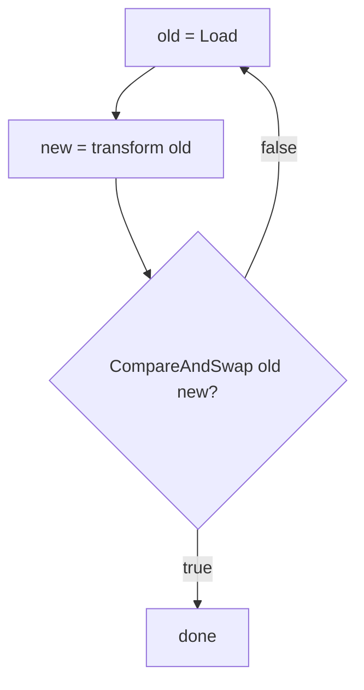

# sync/atomic — Junior Level

## Table of Contents
1. [Introduction](#introduction)
2. [Prerequisites](#prerequisites)
3. [Glossary](#glossary)
4. [Core Concepts](#core-concepts)
5. [Real-World Analogies](#real-world-analogies)
6. [Mental Models](#mental-models)
7. [Pros & Cons](#pros-cons)
8. [Use Cases](#use-cases)
9. [Code Examples](#code-examples)
10. [Coding Patterns](#coding-patterns)
11. [Clean Code](#clean-code)
12. [Product Use / Feature](#product-use-feature)
13. [Error Handling](#error-handling)
14. [Security Considerations](#security-considerations)
15. [Performance Tips](#performance-tips)
16. [Best Practices](#best-practices)
17. [Edge Cases & Pitfalls](#edge-cases-pitfalls)
18. [Common Mistakes](#common-mistakes)
19. [Common Misconceptions](#common-misconceptions)
20. [Tricky Points](#tricky-points)
21. [Test](#test)
22. [Tricky Questions](#tricky-questions)
23. [Cheat Sheet](#cheat-sheet)
24. [Self-Assessment Checklist](#self-assessment-checklist)
25. [Summary](#summary)
26. [What You Can Build](#what-you-can-build)
27. [Further Reading](#further-reading)
28. [Related Topics](#related-topics)
29. [Diagrams & Visual Aids](#diagrams-visual-aids)

---

## Introduction
> Focus: "Why do I need `atomic` when I already have `Mutex`? What is the simplest way to share an integer between goroutines safely?"

If two goroutines run `counter++` on the same variable, the program is broken. The expression `counter++` is not one machine instruction — it is at least three: load the current value into a register, add one, store the result back. Two goroutines can each load `5`, each compute `6`, and each store `6`. One increment is lost. With a million goroutines and a million increments, the final value might be anywhere between `1` and `1,000,000`. The Go race detector flags this on the first run.

The fix is *synchronisation*. The textbook answer is `sync.Mutex` — lock, increment, unlock. It works, but for a single integer it is overkill. A mutex involves a system call on contention, scheduler bookkeeping, and several function calls per access. For a hot counter incremented millions of times a second, the cost adds up.

`sync/atomic` is the answer. It exposes a handful of operations that the CPU itself performs as one indivisible step. No goroutine can observe a half-updated value, no other goroutine can sneak in between the load and the store, and no `Lock`/`Unlock` overhead is paid. The cost is roughly one CPU instruction — a few nanoseconds, even under contention.

```go
import "sync/atomic"

var counter atomic.Int64
counter.Add(1)               // safe from any number of goroutines
fmt.Println(counter.Load())  // returns the current value
```

After reading this file you will:

- Know what an *atomic operation* is and why `counter++` is not one
- Use the Go 1.19 typed API: `atomic.Int64`, `atomic.Int32`, `atomic.Uint64`, `atomic.Bool`, `atomic.Pointer[T]`
- Know the five core operations: `Add`, `Load`, `Store`, `Swap`, `CompareAndSwap`
- Know when to reach for `atomic` and when `sync.Mutex` or a channel is the better tool
- Know about the legacy free-function API (`atomic.AddInt64(&x, 1)`) and why the typed API is preferred for new code
- Know what `atomic.Value` is for and the copy-on-write configuration pattern
- Have a working mental model: "atomic = indivisible, mutex = critical section, channel = communication"

You do not need to know about memory ordering, CPU cache coherence, alignment rules on 32-bit platforms, or the ABA problem yet. Those come at middle and senior levels.

---

## Prerequisites

- **Required:** Comfort with goroutines and the `go` keyword. You should know that two goroutines touching the same variable without synchronisation is a *data race*.
- **Required:** Familiarity with `sync.Mutex` and `sync.WaitGroup`. You should be able to read code that uses `Lock`/`Unlock` without reaching for the docs.
- **Required:** Go 1.19 or newer (1.21+ recommended) so you have the typed atomic API. Check with `go version`.
- **Helpful:** Awareness that `counter++` is not one instruction. If this is news, run `go tool compile -S` on a tiny `func f(x *int) { *x++ }` and you will see three to five instructions.
- **Helpful:** Some experience running `go test -race`. The race detector is the friend that catches all the bugs this file is about preventing.

If you can write a `for` loop that spawns 100 goroutines and increments a shared counter, then notice that the result is wrong, you are ready to learn `sync/atomic`.

---

## Glossary

| Term | Definition |
|------|-----------|
| **Atomic operation** | A read, write, or read-modify-write that the CPU performs as one indivisible step. No other CPU or goroutine can observe an intermediate state. |
| **Data race** | Two goroutines accessing the same memory location simultaneously, at least one of them writing, with no synchronisation between them. Undefined behaviour in Go. |
| **Race detector** | The `-race` flag for `go run`, `go test`, and `go build`. Instruments memory accesses and reports unsynchronised conflicts. |
| **CAS (Compare-And-Swap)** | An atomic operation: "if the current value equals `old`, replace it with `new` and return true; otherwise leave it alone and return false." The foundation of lock-free programming. |
| **Load** | Atomic read. Returns the current value with the guarantee that no other CPU is mid-write. |
| **Store** | Atomic write. Replaces the value with the guarantee that no other CPU sees a half-written result. |
| **Add** | Atomic read-modify-write that adds a delta and returns the new total. |
| **Swap** | Atomic read-modify-write that replaces the value and returns the previous value. |
| **`atomic.Int64`** (Go 1.19+) | A struct type that wraps an `int64` and exposes methods (`Load`, `Store`, `Add`, `Swap`, `CompareAndSwap`). Replaces the older free-function API. |
| **`atomic.Pointer[T]`** (Go 1.19+) | A typed atomic pointer. Replaces `atomic.LoadPointer` / `atomic.StorePointer` with no `unsafe.Pointer` casts. |
| **`atomic.Value`** | A struct that stores an arbitrary type atomically. Useful for swapping immutable configuration objects. |
| **Lock-free** | A concurrent algorithm where no thread can be blocked by any other thread's failure or delay. Often built from CAS loops. |
| **Memory model** | The set of rules that say what reads can observe what writes, in what order. Go's atomic operations are sequentially consistent (Go 1.19+). |
| **Sequentially consistent** | The strongest memory ordering. All atomic operations appear to all goroutines in the same total order. |
| **Alignment** | The requirement that a 64-bit value lives at a memory address divisible by 8. On 32-bit platforms, Go's atomic functions require this; the typed API takes care of it for you. |

---

## Core Concepts

### Why `counter++` is broken

When two goroutines both run `counter++`, the actual machine-level steps are:

```
goroutine A: r1 = load(counter)      r1 = 5
goroutine B: r2 = load(counter)      r2 = 5
goroutine A: r1 = r1 + 1             r1 = 6
goroutine B: r2 = r2 + 1             r2 = 6
goroutine A: store(counter, r1)      counter = 6
goroutine B: store(counter, r2)      counter = 6  (should be 7)
```

This is a **read-modify-write race**. Both goroutines read `5`, both compute `6`, both store `6`. One increment is lost. Run with `go run -race main.go` and the race detector prints a stack trace pointing at both lines.

### Atomic operations fix it at the CPU level

The CPU has an instruction that means "load this memory location, add a value, and store it back, all without anyone else touching the location in between." On x86 this is `LOCK XADD`. On ARM it is a load-linked / store-conditional loop. Either way, the operation is *atomic* — indivisible from the perspective of any other CPU.

Go exposes this through `sync/atomic`:

```go
var counter atomic.Int64
counter.Add(1)   // one indivisible CPU instruction (or short loop on ARM)
```

A million goroutines each calling `counter.Add(1)` produce exactly `1,000,000`. No locks, no scheduler. The CPU does the work.

### The five core operations

Every type in `sync/atomic` exposes some subset of these five operations:

| Operation | Meaning |
|---|---|
| `Load()` | Return the current value, atomically. |
| `Store(v)` | Replace the value with `v`, atomically. |
| `Add(delta)` | Add `delta` and return the new value, atomically. (Only on integer types.) |
| `Swap(v)` | Set the value to `v` and return the previous value, atomically. |
| `CompareAndSwap(old, new)` | If the current value equals `old`, set it to `new` and return `true`. Otherwise leave it alone and return `false`. |

`Add` is convenient for counters. `CompareAndSwap` (CAS) is the building block for everything else — flags, locks, lock-free data structures. `Swap` is occasionally useful for "take the current value and replace it in one step" (e.g., draining a buffered counter).

### The Go 1.19 typed API

Before Go 1.19, atomics looked like this:

```go
import "sync/atomic"

var counter int64                  // raw int64
atomic.AddInt64(&counter, 1)       // pass pointer to free function
v := atomic.LoadInt64(&counter)    // pass pointer again
```

This API works but has problems:
- It is easy to mix atomic and non-atomic access on the same variable. The compiler does not warn.
- On 32-bit platforms, the `int64` must be 8-byte aligned; using one as a struct field could crash at runtime with a misalignment panic.
- The `atomic.LoadPointer` / `atomic.StorePointer` functions take `*unsafe.Pointer`, which forces caller casts.

Go 1.19 added a typed API:

```go
import "sync/atomic"

var counter atomic.Int64           // a struct, not a raw int64
counter.Add(1)                     // method call, no pointer juggling
v := counter.Load()
```

The typed API:
- **Cannot** be mixed with non-atomic access — there is no exposed field to touch directly.
- Handles alignment automatically. `atomic.Int64` as a struct field is always correctly aligned.
- Reads naturally: `flag.Load()` instead of `atomic.LoadInt32(&flag)`.

**Use the typed API for all new code.** The free functions are kept for backwards compatibility.

### `Mutex` vs `atomic` vs `chan`

A short decision table you will internalise:

| Tool | Use for |
|---|---|
| `atomic` | One variable. Counter, flag, current configuration pointer. Fastest. |
| `Mutex` | Several variables that must update together as a group. Map operations. Any logic with branches. |
| `chan` | Passing data between goroutines, signalling work, fan-out / fan-in. |

If you only have a single integer or pointer and the update is one of the five primitive operations, reach for `atomic`. The moment you have two related variables, switch to a mutex.

---

## Real-World Analogies

### Atomic operation is "stamping a passport"

When a border officer stamps your passport, the act is single — either the stamp is on or it is off. No traveller ever sees a half-stamped passport. An atomic store works the same way: from any observer's point of view, the value is either the old one or the new one, never something in between.

### Atomic counter is a "turnstile"

A turnstile clicks up by one each time someone passes through. Even if two people push at the same instant, the count goes up by exactly two. The mechanism is single-purpose and physically indivisible. `atomic.Int64.Add(1)` is the software turnstile.

### Compare-and-Swap is "place a bet"

You bet the current weather is "sunny." If the actual weather is sunny when the bookie checks, the bet pays out and the weather is updated to "rain." If anyone else changed the weather in between, your bet is voided and the weather stays whatever it is now. CAS is the same: "if the value is what I last saw, replace it; otherwise tell me my view is stale and let me retry."

### `atomic.Value` is "shift change board"

A shift change board in a factory shows the current shift's foreman. At shift change, someone writes a new card and slides it into the slot, replacing the old card. Workers reading the board always see *one* foreman — either the old one or the new one. The replacement is atomic. The card itself can be arbitrarily complex (a config struct, a routing table), and the slot doesn't care.

### Mutex is a "single-occupancy bathroom"

The mutex bathroom has one key. To use it, you wait for the key, do whatever you need to do (potentially many small actions), then return the key. Atomic operations skip the key entirely — each action is its own self-contained bathroom visit.

---

## Mental Models

### Model 1: "Atomic = one machine instruction"

When you read `counter.Add(1)`, picture the single CPU instruction that does it (`LOCK XADD` on x86). Nothing else can sneak between the read and the write because, at the hardware level, *there is no in-between*. The instruction either happens or hasn't yet — never half-done.

### Model 2: "CAS is the only primitive that matters"

Internally, `Add` and `Swap` are often implemented as CAS loops. The fundamental atomic primitive is CAS: "if you are still what I think you are, change to this." Every lock-free data structure ever written boils down to CAS in a loop.

You will write CAS loops yourself when you need to update a value based on its current contents:

```go
for {
    old := v.Load()
    new := transform(old)
    if v.CompareAndSwap(old, new) {
        break
    }
    // someone else changed v; retry
}
```

This is the canonical lock-free update pattern. The loop almost always exits in one iteration unless contention is extreme.

### Model 3: "Atomic does not mean transactional"

`atomic.Int64.Add(1)` is atomic. But running two atomic operations back to back is *not* atomic as a pair:

```go
a.Add(1)         // step 1
b.Add(1)         // step 2  (between the two, other goroutines see a updated but b not yet)
```

If you need both updates to appear at the same instant, you need a mutex, not two atomics.

### Model 4: "The typed API is the API"

For new code, never type `atomic.AddInt64(&x, 1)` again. Use `var x atomic.Int64` and `x.Add(1)`. The free functions are a relic. They exist because the Go 1 compatibility promise forbids removing them.

### Model 5: "Atomic only protects the single variable"

`atomic` protects the variable it operates on. It does not protect any other variable, struct field, slice element, or map entry that you happen to access in the same line. If you read an atomic pointer and then dereference it to mutate a struct field, the struct field is not protected. That is what `Mutex` is for.

---

## Pros & Cons

### Pros

- **Fast.** An uncontended atomic on modern x86 is roughly 2 ns. A mutex acquire/release pair is 10-30 ns. Across millions of operations the difference matters.
- **No deadlocks.** There is no lock to hold and forget to release. There is no possibility of two goroutines waiting on each other.
- **Easy to use for the standard cases.** Counter? `Add`. Flag? `Store`/`Load`. Config swap? `atomic.Value` or `Pointer[T]`.
- **Available on every platform.** Go provides the atomic API on all supported architectures. The compiler emits the right instructions.
- **Works with the race detector.** The race detector understands atomic operations and will not complain about a properly used atomic.
- **Composes with goroutine-local optimisations.** Per-CPU counters, sharded maps, and lock-free queues all build on top of atomics.

### Cons

- **Limited expressiveness.** You only get five operations on one variable at a time. Need to update two fields together? Use a mutex.
- **CAS loops can starve.** Under extreme contention, a CAS loop may retry many times before succeeding. A mutex provides fairer access.
- **No "wait until value is X" primitive.** Atomic does not block. If you need to wait, use a channel or `sync.Cond` or spin (rarely a good idea).
- **Alignment trap on 32-bit (legacy API).** Using `atomic.AddInt64(&x, 1)` on a misaligned `int64` field crashes at runtime. The typed API avoids this.
- **Subtle when mixing with non-atomic access.** Reading the variable normally (e.g., `fmt.Println(counter)` on a raw `int64`) defeats the atomicity. The typed API prevents this by not exposing the underlying field.
- **Harder to reason about than mutex.** Lock-free code requires you to think about every possible interleaving. A mutex makes the protected section sequential by definition.

---

## Use Cases

| Scenario | Why atomic helps |
|---|---|
| Request counter on an HTTP server | One `Add(1)` per request, one `Load()` per metric scrape. No contention. |
| Stop flag for a background goroutine | `flag.Store(true)`; the goroutine `Load`s each iteration and exits. |
| Pointer to current configuration | Replace via `Store` (or `Value.Store`); readers `Load` without a lock. |
| Reference count for a shared object | `Add(1)` on acquire, `Add(-1)` on release, free when it hits zero. |
| Once-only initialisation flag | CAS from `0` to `1` to elect a single initialiser. |
| Latency histograms (per-bucket counters) | Each bucket is an `atomic.Int64`; samplers `Load` periodically. |
| Snapshot a counter and reset it | `Swap(0)` returns the current value and resets in one step. |
| Lock-free single-producer queue | Head and tail indices as atomics; producer/consumer coordinate via CAS. |

| Scenario | Why atomic does *not* help |
|---|---|
| Updating two related struct fields | Use a mutex. Two atomics cannot be combined into one atomic update. |
| Map operations (`m[k] = v`) | The map's internal state spans many words. Use `sync.RWMutex` or `sync.Map`. |
| Complex business logic inside the critical section | Atomic gives you five operations; logic needs more. Use a mutex. |
| Coordinating "wait for N events" | Use `sync.WaitGroup` or a channel; atomic does not block. |
| Communicating arbitrary values between goroutines | Use a channel; that is what channels are for. |

---

## Code Examples

### Example 1: The broken counter, fixed

```go
package main

import (
    "fmt"
    "sync"
    "sync/atomic"
)

func main() {
    var counter atomic.Int64
    var wg sync.WaitGroup
    for i := 0; i < 1000; i++ {
        wg.Add(1)
        go func() {
            defer wg.Done()
            counter.Add(1)
        }()
    }
    wg.Wait()
    fmt.Println(counter.Load()) // always 1000
}
```

Replace `var counter atomic.Int64` with `var counter int64` and `counter.Add(1)` with `counter++` and the output becomes unpredictable — and `go run -race` complains. Atomic is the difference between "broken in production" and "correct by construction."

### Example 2: Reading the value

```go
var counter atomic.Int64
counter.Store(42)
fmt.Println(counter.Load()) // 42
```

`Load()` returns the current value. `Store(v)` replaces it. Both are atomic in their own right.

### Example 3: Stop flag

```go
package main

import (
    "fmt"
    "sync/atomic"
    "time"
)

func main() {
    var stop atomic.Bool
    go func() {
        for !stop.Load() {
            // do periodic work
            time.Sleep(100 * time.Millisecond)
            fmt.Println("tick")
        }
        fmt.Println("stopped")
    }()
    time.Sleep(500 * time.Millisecond)
    stop.Store(true)
    time.Sleep(200 * time.Millisecond)
}
```

The background goroutine polls a flag. Setting the flag from `main` is one atomic store; the worker observes it on its next iteration and exits.

### Example 4: Compare-And-Swap (once-only initialiser)

```go
var done atomic.Int32

func initOnce() {
    if done.CompareAndSwap(0, 1) {
        // only one goroutine reaches here
        loadConfig()
    } else {
        // another goroutine got here first
    }
}
```

Multiple goroutines call `initOnce`. CAS from `0` to `1` succeeds for exactly one of them. The others see the CAS fail. (For production code, prefer `sync.Once` — but the CAS pattern is the underlying mechanism.)

### Example 5: Swap to read-and-reset

```go
var pending atomic.Int64

// producer
pending.Add(1)

// periodic snapshotter
batch := pending.Swap(0)
fmt.Println("processed", batch, "events this period")
```

`Swap(0)` returns the current value and replaces it with `0` in one atomic step. Useful for "snapshot and reset" counters where you do not want to lose increments that happen between a separate `Load` and `Store`.

### Example 6: Atomic pointer to immutable config

```go
type Config struct {
    Endpoint string
    Timeout  time.Duration
}

var cfg atomic.Pointer[Config]

func reload() {
    newCfg := &Config{Endpoint: "https://api.example.com", Timeout: 5 * time.Second}
    cfg.Store(newCfg)
}

func handle() {
    c := cfg.Load()
    if c == nil {
        return
    }
    // use c.Endpoint, c.Timeout — read-only
}
```

Readers `Load` the pointer; writers `Store` a *new* `*Config`. Readers never see a half-updated struct because they only see one of two pointers — the old one or the new one. **The Config struct must be treated as immutable after `Store`.** If a reader mutates a field, the next reader sees the mutation without synchronisation. Always create a fresh struct for each update.

### Example 7: `atomic.Value` for the same pattern

```go
var cfg atomic.Value // holds a Config

func reload() {
    cfg.Store(Config{Endpoint: "https://api.example.com", Timeout: 5 * time.Second})
}

func handle() {
    c, ok := cfg.Load().(Config)
    if !ok {
        return // not yet initialised
    }
    _ = c.Endpoint
}
```

`atomic.Value` stores any single type. The first `Store` fixes the type for all future `Store`s — storing a `string` after storing a `Config` panics. Prefer `atomic.Pointer[T]` for new code; `atomic.Value` predates generics.

### Example 8: The legacy free-function API

```go
var counter int64
atomic.AddInt64(&counter, 1)
v := atomic.LoadInt64(&counter)
```

You will see this in older codebases. It works, but the typed API is shorter and avoids the alignment trap. Do not introduce this style in new code.

### Example 9: Atomic flag for double-checked initialisation

```go
type Service struct {
    inited atomic.Bool
    cfg    *Config
    mu     sync.Mutex
}

func (s *Service) Config() *Config {
    if s.inited.Load() {
        return s.cfg // fast path: no lock
    }
    s.mu.Lock()
    defer s.mu.Unlock()
    if s.inited.Load() {
        return s.cfg
    }
    s.cfg = loadConfig()
    s.inited.Store(true)
    return s.cfg
}
```

The fast path reads the flag with one atomic `Load`. Only the first caller acquires the mutex. After initialisation, every subsequent call is lock-free.

### Example 10: Counting in-flight requests

```go
var inflight atomic.Int64

func handler(w http.ResponseWriter, r *http.Request) {
    inflight.Add(1)
    defer inflight.Add(-1)
    serve(w, r)
}

func metrics() {
    fmt.Println("in-flight:", inflight.Load())
}
```

Two atomic ops per request, one atomic op per metric scrape, no locks anywhere. Scales to millions of requests per second.

---

## Coding Patterns

### Pattern 1: Increment-on-event counter

```go
var n atomic.Int64
n.Add(1)
```

The simplest and most common use. One line per event.

### Pattern 2: Boolean flag (stop / done / ready)

```go
var stop atomic.Bool
stop.Store(true)
if stop.Load() { return }
```

Set once, read many. For more complex coordination, prefer a channel.

### Pattern 3: CAS loop for "update based on current value"

```go
for {
    old := x.Load()
    new := compute(old)
    if x.CompareAndSwap(old, new) {
        break
    }
}
```

Use when you need to atomically apply a function to the value. Almost always exits in one iteration.

### Pattern 4: Snapshot-and-reset

```go
batch := counter.Swap(0)
process(batch)
```

Atomic snapshot of a counter, with reset, in one operation.

### Pattern 5: Copy-on-write configuration

```go
var cfg atomic.Pointer[Config]

// writer
new := *cfg.Load() // copy current
new.Field = "x"
cfg.Store(&new)

// reader
c := cfg.Load()
use(c)
```

Writers build a new struct and `Store` it; readers `Load` the pointer. Never mutate after `Store`.

### Pattern 6: Reference counting

```go
type Resource struct {
    refs atomic.Int64
}

func (r *Resource) Acquire() { r.refs.Add(1) }
func (r *Resource) Release() {
    if r.refs.Add(-1) == 0 {
        r.free()
    }
}
```

Last release frees the resource. Be careful with the "free at zero" pattern in concurrent settings — see senior level for the ABA problem and hazard pointers.

---

## Clean Code

- **Use the typed API.** `atomic.Int64`, `atomic.Bool`, `atomic.Pointer[T]`, never `atomic.AddInt64(&x, 1)` in new code.
- **Name atomic variables descriptively.** `requestCount`, `stopFlag`, `currentConfig`. Avoid `i`, `n`, `flag`.
- **Document the invariants.** A comment like `// atomically updated; do not read directly` is helpful next to any atomic field.
- **Group atomic and protected fields together in the struct.** Keep atomics at the top of the struct, then mutex-guarded fields below it. This conveys the synchronisation policy at a glance.
- **Prefer `atomic.Pointer[T]` over `atomic.Value`.** Generics give type safety; `Value` does not.
- **Wrap atomics in domain types** when the variable has semantic meaning. A `Counter` struct around `atomic.Int64` is clearer than an exposed atomic.
- **Always copy before mutating** when working with copy-on-write atomic pointers. Mutating after `Store` is a race.

---

## Product Use / Feature

| Product feature | How atomic delivers it |
|---|---|
| Request rate metric | `atomic.Int64.Add(1)` per request; metrics scraper `Load`s every 15 s. |
| Feature flag dynamically toggled | `atomic.Bool.Store(true/false)` from an admin endpoint; readers `Load` once per request. |
| Live configuration reload | `atomic.Pointer[Config].Store(newCfg)` on SIGHUP; handlers `Load` per request. |
| Connection pool size accounting | `atomic.Int64.Add(1)` on acquire, `Add(-1)` on release; metric exposes current. |
| Health probe ready/not-ready flag | `atomic.Bool.Store(true)` after startup completes; liveness handler `Load`s it. |
| Cache hit/miss counters | Two `atomic.Int64`s. No locks anywhere on the cache fast path. |
| Sharded counters | Slice of `atomic.Int64`; goroutine picks a shard by goroutine ID hash to reduce contention. |
| Last-seen timestamp for a peer | `atomic.Int64.Store(time.Now().UnixNano())` per heartbeat. |

---

## Error Handling

`atomic` operations cannot fail. There is no error return from `Load`, `Store`, or `Add`. The only operation that returns "did it work" is `CompareAndSwap`, and its `false` return is not an error — it is a *fact* about the value, useful for control flow.

Two error-related considerations:

### 1. Misalignment crashes (legacy API on 32-bit)

```go
type S struct {
    a int32
    b int64 // may be misaligned on 32-bit
}
var s S
atomic.AddInt64(&s.b, 1) // crashes on 32-bit ARM or 386
```

Fix: use `atomic.Int64` (alignment handled), or place 64-bit fields first in the struct, or upgrade to a 64-bit platform. The typed API in Go 1.19+ takes care of this.

### 2. `atomic.Value` type panic

```go
var v atomic.Value
v.Store(1)        // first store: type fixed as int
v.Store("hello")  // panics: "store of inconsistently typed value"
```

`atomic.Value` requires a consistent type across `Store` calls. Always store the same concrete type. The typed `atomic.Pointer[T]` avoids this by encoding the type in its name.

---

## Security Considerations

- **Atomic does not provide authorisation.** It synchronises memory, nothing more. An atomic flag named `isAdmin` does not prevent unauthorised callers from setting it; it only prevents two threads from racing.
- **Race on a security-critical variable is a vulnerability.** If two goroutines race on a session token slot, one may briefly see another's token. Use atomics or mutexes consistently.
- **`atomic.Pointer[T]` does not deep-copy.** If you store a pointer to a struct, both old and new readers share the struct memory. Treating that struct as mutable is a race. Always create a fresh struct.
- **Avoid `atomic.Value` for secrets.** Storing a credential and later replacing it does not erase the old pointer from memory. If a memory dump is taken, both old and new appear. Use careful zeroing if this matters.
- **Reference counting bugs become use-after-free.** A `refs` counter that drops to zero too early frees a buffer another goroutine is still reading. This is a memory-safety bug masquerading as a concurrency bug.

---

## Performance Tips

- **Uncontended atomic ≈ 2 ns.** A `counter.Add(1)` from a single goroutine on modern x86 takes about two nanoseconds. Comparable to a register operation.
- **Contended atomic is slower.** When many CPUs hammer the same cache line, each `Add` requires that line to bounce between cores. Throughput can drop by 10-100x. Solution: sharding (one counter per CPU).
- **Mutex acquire/release ≈ 10-30 ns uncontested.** With contention and goroutine parking, hundreds of nanoseconds to microseconds. Atomic wins for single-variable hot paths.
- **CAS loop with low contention ≈ same as `Add`.** With high contention, retries multiply the cost. Measure.
- **`Load` is essentially free** on x86 (already atomic at the hardware level for aligned reads). Still call `.Load()` for readability and to inform the race detector.
- **Avoid spurious atomics.** Each atomic is a memory barrier and a cache-line bounce. In a tight loop that does not need synchronisation (per-goroutine work), use a plain variable and merge at the end.

---

## Best Practices

1. Use the Go 1.19+ typed API (`atomic.Int64`, `atomic.Bool`, `atomic.Pointer[T]`) for all new code.
2. Use atomic only for a single variable. For multiple related variables, use a mutex.
3. Never mix atomic and non-atomic access on the same variable.
4. Wrap atomic types in domain types when they have semantic meaning (`type Counter struct{ n atomic.Int64 }`).
5. For copy-on-write atomic pointers, always create a fresh struct before `Store`; never mutate after.
6. Use `atomic.Pointer[T]` instead of `atomic.Value` for type safety.
7. Run `go test -race` in CI to catch races and atomic misuse.
8. Prefer `sync.Once` over a hand-rolled CAS-based once-initialiser for clarity.
9. For high-contention counters, shard across CPUs.
10. Document the synchronisation policy of each atomic field next to its declaration.

---

## Edge Cases & Pitfalls

### Reading an atomic with `fmt.Println`

```go
var c atomic.Int64
fmt.Println(c) // prints "{0}" or similar — the struct, not the value
```

Use `c.Load()`. The typed atomic is a struct; printing it directly shows its internal fields, which may be confusing or panic on some types.

### `atomic.Value` first-store sets the type

```go
var v atomic.Value
v.Store(int32(1))
v.Store(int64(1))   // panics: inconsistent types
```

Always store the same type. Use `atomic.Pointer[T]` if you want compile-time enforcement.

### CAS loop forever on contended hot variable

```go
for {
    old := x.Load()
    if x.CompareAndSwap(old, old+1) { break }
}
```

This works. But if a thousand goroutines hammer the same variable, each may retry many times. A simple `x.Add(1)` is faster and contention-aware. Use CAS only when the update depends on the old value in a non-trivial way.

### Forgetting to call `.Load()`

```go
var ready atomic.Bool
if ready {           // compile error — ready is a struct, not a bool
    ...
}
```

The typed API forces you to write `ready.Load()`, which is exactly what we want. The compiler catches a bug that the legacy API would silently allow.

### Atomic protects only the variable

```go
var p atomic.Pointer[Config]
c := p.Load()
c.Field = "new"   // RACE — readers of the old pointer also see this
```

Atomically loading a pointer is fine. Mutating what it points to is a race. Always copy.

### 64-bit atomic on a 32-bit struct field (legacy API)

```go
type S struct {
    flag int32
    count int64 // misaligned on 32-bit ARM/386
}
```

With the legacy API, `atomic.AddInt64(&s.count, 1)` may crash. The typed `atomic.Int64` is implemented to be aligned regardless. This pitfall is mostly historical now, but you may encounter it in older code.

---

## Common Mistakes

| Mistake | Fix |
|---|---|
| Using `counter++` from multiple goroutines | Use `counter.Add(1)` with `atomic.Int64`. |
| Mixing `atomic.AddInt64(&x, 1)` with `x = 0` | Either use atomic consistently or use a mutex. The typed API prevents this. |
| Forgetting `.Load()` and trying to compare the struct | The compiler will reject; you will type the right thing on the second try. |
| `atomic.Value` with mixed types | Always store the same concrete type, or use `atomic.Pointer[T]`. |
| Mutating a struct after `cfg.Store(&s)` | Build a new struct; never mutate after publication. |
| Two atomics expecting transactional update | Use a mutex. Two atomic ops are not one atomic op. |
| Reading `atomic.Int64` value as a plain `int64` | The typed API does not expose the underlying field; you must use `Load`. |
| Spawning a CAS loop and forgetting backoff | Under heavy contention, sprinkle `runtime.Gosched()` or use `Add`/`Swap` instead. |

---

## Common Misconceptions

> *"Atomic is just a faster mutex."* — No. Atomic operates on a single variable with five fixed operations. A mutex protects an arbitrary critical section.

> *"`atomic.Int64.Add(1)` is the same as `counter++`."* — Wrong. `counter++` is not atomic. `Add(1)` is. The whole point.

> *"Atomic operations are free."* — They are *cheap* (≈ 2 ns uncontended). Under contention they slow down dramatically because of cache-line bouncing.

> *"I should always prefer atomic over mutex."* — Only for single-variable hot paths. The moment you need to update two things together, mutex is correct and atomic is wrong.

> *"`atomic.Pointer[T]` deep-copies the pointed-to value."* — No. It atomically swaps the *pointer*. The pointed-to struct is shared.

> *"`atomic.Value` is type-safe."* — Only at runtime, via panic. The typed `atomic.Pointer[T]` is type-safe at compile time.

> *"Atomic gives me a memory barrier so all my other reads are fresh too."* — Atomic gives synchronisation for the atomic variable. Other variables read in the same line are not magically synchronised — they need their own atomics or a mutex.

> *"CAS always succeeds."* — CAS succeeds only if the value matches `old`. The whole point is to fail when someone else changed it.

---

## Tricky Points

### Reading the typed API as a struct vs as a value

```go
var c atomic.Int64
c.Add(1)
v := c.Load()  // v is int64
```

`atomic.Int64` is a struct. `c.Load()` returns `int64`. You can pass `&c` around because methods are on pointer receivers; you cannot copy the struct (it has a `noCopy` marker in modern Go to discourage it).

### Pointer atomics with `nil`

```go
var p atomic.Pointer[Config]
if c := p.Load(); c != nil {
    use(c)
}
```

The zero value of `atomic.Pointer[T]` is `nil`. Always check before dereferencing.

### Atomic on a field of a copied struct is wrong

```go
type S struct{ c atomic.Int64 }
s := S{}
s2 := s // copies the atomic — now they are independent
```

The Go vet tool (and `noCopy` static checks) warn about this. Always pass a `*S`, never copy a struct that contains an atomic.

### `Bool.Store(false)` vs `Store(true)`

```go
var stop atomic.Bool
stop.Store(true)  // signal stop
```

`atomic.Bool` is a Go 1.19 type. Internally a `uint32`. The Load/Store methods take `bool`. The typed API hides the integer representation.

### `Swap` returns the old value

```go
var x atomic.Int64
x.Store(5)
old := x.Swap(10)
// old == 5, x.Load() == 10
```

A common mix-up: thinking `Swap` returns the new value. It returns the *previous* one. This is what makes "snapshot and reset" work in one atomic step.

### Two atomic loads do not give a consistent snapshot of two variables

```go
var a, b atomic.Int64
// goroutine A: a.Add(1); b.Add(1)
// goroutine B:
va := a.Load()
vb := b.Load()
// (va, vb) may be (0, 1), (1, 0), (0, 0), or (1, 1)
```

The two reads are atomic individually, but the pair is not atomic. If you need a consistent snapshot, use a mutex or copy-on-write.

---

## Test

```go
// counter_test.go
package counter_test

import (
    "sync"
    "sync/atomic"
    "testing"
)

func TestAtomicCounter(t *testing.T) {
    var c atomic.Int64
    var wg sync.WaitGroup
    const n = 1000
    for i := 0; i < n; i++ {
        wg.Add(1)
        go func() {
            defer wg.Done()
            c.Add(1)
        }()
    }
    wg.Wait()
    if got := c.Load(); got != n {
        t.Fatalf("expected %d, got %d", n, got)
    }
}

func TestCAS(t *testing.T) {
    var x atomic.Int32
    x.Store(10)
    if !x.CompareAndSwap(10, 20) {
        t.Fatal("CAS should succeed when value matches")
    }
    if x.CompareAndSwap(10, 30) {
        t.Fatal("CAS should fail when value does not match")
    }
    if x.Load() != 20 {
        t.Fatalf("expected 20, got %d", x.Load())
    }
}

func TestAtomicBool(t *testing.T) {
    var b atomic.Bool
    if b.Load() {
        t.Fatal("zero value should be false")
    }
    b.Store(true)
    if !b.Load() {
        t.Fatal("Store(true) failed")
    }
    prev := b.Swap(false)
    if !prev {
        t.Fatal("Swap should return previous true")
    }
}
```

Run with `go test -race`. The race detector understands atomics and will only complain if you accidentally mix atomic and non-atomic access.

---

## Tricky Questions

**Q.** Why is `counter++` a data race but `counter.Add(1)` is not?

**A.** `counter++` compiles to load, increment, store — three separate memory operations. Another goroutine can run between them. `counter.Add(1)` compiles to a single atomic instruction (`LOCK XADD` on x86, an LL/SC loop on ARM) that the CPU executes indivisibly. No goroutine can observe a half-completed Add.

---

**Q.** What does `CompareAndSwap` return?

**A.** A `bool`. `true` means "the value matched `old` and has been replaced with `new`." `false` means "the value did not match `old`; the value is unchanged." It does not return the current value — read separately if you need it.

---

**Q.** Why is `atomic.Value` deprecated for new code?

**A.** Not strictly deprecated, but superseded by `atomic.Pointer[T]` (Go 1.19+). `atomic.Value` requires consistent runtime type (panics otherwise); `atomic.Pointer[T]` is generic and type-safe at compile time. Use `Pointer[T]` for almost everything.

---

**Q.** What happens if you do this?

```go
var c atomic.Int64
c.Store(0)
go func() { c.Add(1) }()
go func() { c.Add(1) }()
time.Sleep(time.Second)
fmt.Println(c.Load())
```

**A.** Prints `2`. Two atomic adds always sum correctly. The `time.Sleep` is there to ensure both goroutines finish before the print, but a proper test should use `sync.WaitGroup`.

---

**Q.** Why does Go's atomic API not have a `Mul` or `Div` operation?

**A.** Because there is no single CPU instruction for atomic multiply or divide. The CPU offers atomic add/sub, bitwise ops, swap, and CAS. For multiply, you implement it as a CAS loop:

```go
for {
    old := x.Load()
    new := old * 3
    if x.CompareAndSwap(old, new) { break }
}
```

This is the lock-free pattern for arbitrary updates.

---

**Q.** Two goroutines both do `if x.CompareAndSwap(0, 1) { /* do init */ }`. How many do init?

**A.** Exactly one. CAS succeeds for whichever goroutine wins the race; the other sees `x == 1` and the CAS fails. This is the basis of one-time initialisation.

---

## Cheat Sheet

```go
import "sync/atomic"

// Typed API (Go 1.19+) — preferred
var n atomic.Int64
n.Add(1)
n.Load()
n.Store(42)
n.Swap(100)
n.CompareAndSwap(100, 200)

var f atomic.Bool
f.Store(true)
if f.Load() { ... }

type Config struct { ... }
var cfg atomic.Pointer[Config]
cfg.Store(&Config{...})
c := cfg.Load()    // *Config or nil

// Legacy free-function API — read-only for old code
var x int64
atomic.AddInt64(&x, 1)
atomic.LoadInt64(&x)
atomic.StoreInt64(&x, 42)
atomic.SwapInt64(&x, 100)
atomic.CompareAndSwapInt64(&x, 100, 200)

// CAS loop
for {
    old := n.Load()
    new := transform(old)
    if n.CompareAndSwap(old, new) {
        break
    }
}

// Snapshot-and-reset
batch := n.Swap(0)
```

---

## Self-Assessment Checklist

- [ ] I can explain why `counter++` is a data race.
- [ ] I can name the five core atomic operations (Load, Store, Add, Swap, CompareAndSwap).
- [ ] I know the difference between `atomic.Int64` and `int64`.
- [ ] I can write a stop-flag pattern with `atomic.Bool`.
- [ ] I can use `atomic.Pointer[T]` for copy-on-write configuration.
- [ ] I know when to use atomic and when to reach for `sync.Mutex` or a channel.
- [ ] I know that mutating a pointed-to struct after `Store` is a race.
- [ ] I have written a CAS loop.
- [ ] I know that two atomic operations on different variables are not transactional.
- [ ] I have run `go test -race` on at least one piece of atomic code.

---

## Summary

`sync/atomic` provides hardware-level synchronisation for a single variable. Five operations — `Load`, `Store`, `Add`, `Swap`, `CompareAndSwap` — let you safely share an integer, a boolean, or a pointer between any number of goroutines without locks.

The Go 1.19 typed API (`atomic.Int64`, `atomic.Bool`, `atomic.Pointer[T]`, `atomic.Value`) is the way forward. It prevents mixing atomic and non-atomic access, fixes the 64-bit alignment trap, and reads naturally. The legacy free functions are still in the standard library for compatibility but should not appear in new code.

Atomic is faster than mutex (≈ 2 ns vs ≈ 20 ns uncontended) but limited. It protects a single variable, not a critical section, not a struct, not a map. When you need to update two things together, use `sync.Mutex`. When you need to communicate between goroutines, use a channel.

The patterns to remember: counter (`Add`), flag (`Bool`), copy-on-write config (`Pointer[T]`), once-initialiser (`CompareAndSwap`), snapshot-and-reset (`Swap`). Master these and most of the synchronisation needs in a typical Go service become one-liners.

The next steps (middle, senior, professional) cover memory ordering, alignment rules, lock-free patterns like the ABA problem, and the CPU instructions that make all of this work.

---

## What You Can Build

After mastering this material:

- A request counter for an HTTP server that scales to millions of QPS without locks.
- A graceful-shutdown flag that a hundred goroutines can poll cheaply.
- A live-reload configuration system where readers never block.
- A reference-counted shared buffer for a network protocol implementation.
- A latency histogram with per-bucket atomic counters.
- A health-probe endpoint backed by an atomic ready flag set at the end of startup.
- A sharded counter that spreads contention across CPUs.

---

## Further Reading

- The Go Programming Language Specification — *The Go memory model*: <https://go.dev/ref/mem>
- The `sync/atomic` package documentation: <https://pkg.go.dev/sync/atomic>
- Go 1.19 release notes — *Typed atomic operations*: <https://go.dev/doc/go1.19#atomic_types>
- Russ Cox — *Hardware Memory Models*: <https://research.swtch.com/hwmm>
- Russ Cox — *Programming Language Memory Models*: <https://research.swtch.com/plmm>
- Dave Cheney — *Performance without the event loop*: <https://dave.cheney.net/2015/08/08/performance-without-the-event-loop>
- The race detector: <https://go.dev/doc/articles/race_detector>

---

## Related Topics

- `sync.Mutex` — when you need a critical section, not a single-variable update
- `sync.Once` — built on top of atomic CAS for one-time initialisation
- `sync.Map` — uses atomic loads for the read-mostly fast path
- Channels — communication between goroutines (data flow, not just synchronisation)
- The Go memory model — formal rules for what reads see what writes
- Lock-free data structures — built from atomics and CAS

---

## Diagrams & Visual Aids

### Why `counter++` races

```
counter = 5

goroutine A         goroutine B
  load -> r1=5
                      load -> r2=5
  add  -> r1=6
                      add  -> r2=6
  store r1            store r2
counter = 6 (lost an increment)
```

### Atomic `Add` as one CPU instruction

```
counter = 5

goroutine A: LOCK XADD [counter], 1     (CPU locks the cache line)
goroutine B: LOCK XADD [counter], 1     (waits for A, then runs)

counter = 7  (correct)
```

### CAS loop flow



### Atomic vs mutex vs channel

```
Single variable, single op            -> atomic
Multiple variables, critical section -> Mutex
Pass values between goroutines        -> chan
```

### Copy-on-write configuration

```
cfg.Store(&Config{A: 1})         // pointer P1 published
reader 1: c := cfg.Load()        // sees P1
cfg.Store(&Config{A: 2})         // pointer P2 published
reader 2: c := cfg.Load()        // sees P2
reader 1 still uses P1 safely; it is never mutated.
```

### Memory cost of atomic vs mutex (approximate, x86)

```
atomic.Int64.Add(1)  (uncontended)    ~2 ns
atomic.Int64.Add(1)  (contended)      ~10-100 ns (cache line bounce)
sync.Mutex Lock+Unlock (uncontended)  ~15-30 ns
sync.Mutex Lock+Unlock (contended)    ~100 ns - 10 µs (parks goroutine)
channel send + recv (buffered)        ~50-100 ns
```

### Typed API vs legacy API at a glance

```
Go 1.19+ (preferred)                  Legacy (Go 1.0+)
var n atomic.Int64                    var n int64
n.Add(1)                              atomic.AddInt64(&n, 1)
n.Load()                              atomic.LoadInt64(&n)
n.Store(42)                           atomic.StoreInt64(&n, 42)

var f atomic.Bool                     (no Bool in legacy API)
f.Store(true)                         var f uint32; atomic.StoreUint32(&f, 1)

var p atomic.Pointer[T]               var p unsafe.Pointer
p.Store(&v)                           atomic.StorePointer(&p, unsafe.Pointer(&v))
```
