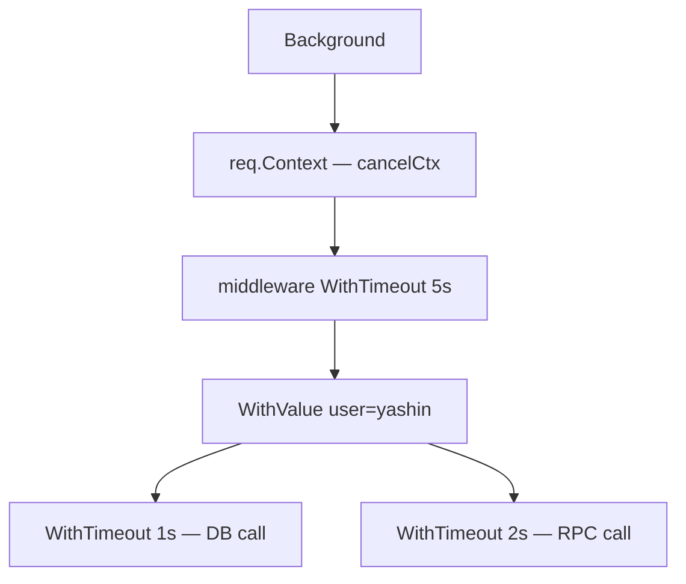
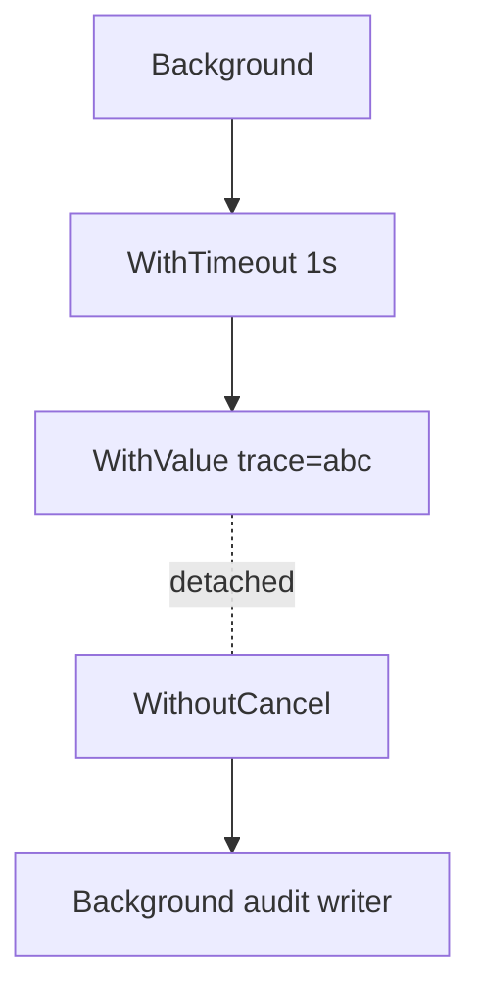
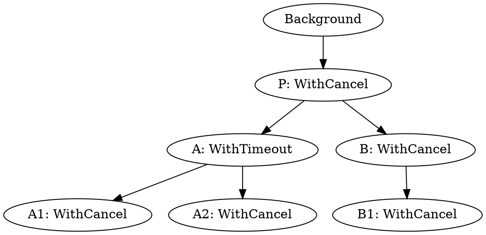

# Context Tree — Junior Level

## Table of Contents
1. [Introduction](#introduction)
2. [Prerequisites](#prerequisites)
3. [Glossary](#glossary)
4. [Core Concepts](#core-concepts)
5. [Real-World Analogies](#real-world-analogies)
6. [Mental Models](#mental-models)
7. [Pros & Cons](#pros-cons)
8. [Use Cases](#use-cases)
9. [Code Examples](#code-examples)
10. [Coding Patterns](#coding-patterns)
11. [Clean Code](#clean-code)
12. [Product Use / Feature](#product-use-feature)
13. [Error Handling](#error-handling)
14. [Security Considerations](#security-considerations)
15. [Performance Tips](#performance-tips)
16. [Best Practices](#best-practices)
17. [Edge Cases & Pitfalls](#edge-cases-pitfalls)
18. [Common Mistakes](#common-mistakes)
19. [Common Misconceptions](#common-misconceptions)
20. [Tricky Points](#tricky-points)
21. [Test](#test)
22. [Tricky Questions](#tricky-questions)
23. [Cheat Sheet](#cheat-sheet)
24. [Self-Assessment Checklist](#self-assessment-checklist)
25. [Summary](#summary)
26. [What You Can Build](#what-you-can-build)
27. [Further Reading](#further-reading)
28. [Related Topics](#related-topics)
29. [Diagrams & Visual Aids](#diagrams-visual-aids)

---

## Introduction

> Focus: "Where does a context come from? What does deriving one *do*? Why does cancelling the parent magically cancel everything below it?"

A `Context` is never a flat value. It is a **node in a tree**. The tree is what makes context useful: a single cancel call at the top of an HTTP request reaches every database query, RPC, goroutine, and timer started underneath it. Without the tree, cancellation would only travel as far as you remembered to wire it.

This file teaches the tree by hand. We will:

- Look at `Background()` and `TODO()` — the only two roots Go gives you.
- Derive children with `WithCancel`, `WithTimeout`, `WithDeadline`, and `WithValue` and see how each adds a node.
- Watch a parent cancellation race down to its grandchildren.
- See why a child's cancellation never travels back up.
- Meet `WithCancelCause` (Go 1.20+), `AfterFunc`, and `WithoutCancel` (Go 1.21+).
- Draw the tree with graphviz and mermaid so the picture sticks.

By the end you should be able to read a piece of unfamiliar Go code, point at every `context.With...` call, sketch the tree it builds, and predict what happens when any node is cancelled.

You do not need to know the source of `cancelCtx`, the `propagateCancel` machinery, or how the runtime allocates timers. Those are the senior and professional files. Here we focus on building correct mental pictures.

---

## Prerequisites

- **Required:** Comfort with `context.Context`, `context.Background()`, `<-ctx.Done()`, and `ctx.Err()`. Read [01-deadlines-and-cancellations](../01-deadlines-and-cancellations/) first if any of those feel unfamiliar.
- **Required:** Go 1.21 or newer recommended (1.20 is acceptable). `WithoutCancel` and `AfterFunc` need 1.21; `WithCancelCause` needs 1.20.
- **Helpful:** Knowing that `<-someClosedChan` returns immediately. Cancellation propagation depends on this.
- **Helpful:** Basic familiarity with goroutines and `select`.

If you can write `ctx, cancel := context.WithTimeout(context.Background(), time.Second); defer cancel()` from memory, you are ready.

---

## Glossary

| Term | Definition |
|------|-----------|
| **Context tree** | The directed tree formed by all live contexts in a process. Edges run from parent to child. The roots are `Background()` and `TODO()`. |
| **Derived context** | Any context returned by a `With...` function. Always has exactly one parent. |
| **Parent** | The first argument to a `With...` call. A node always has one parent (or is a root). |
| **Child** | A context derived from another context. A node may have zero, one, or many children. |
| **Cascade** | The act of cancellation flowing from a parent down to every descendant in one logical step. |
| **`Background()`** | The root context. Never cancelled. Used at the top of `main`, tests, and long-running goroutines. |
| **`TODO()`** | A second root, behaviourally identical to `Background`. Used as a placeholder while wiring code. |
| **`WithCancel`** | Derives a child whose lifetime is controlled by an explicit `cancel()` function. |
| **`WithTimeout`** | Derives a child that auto-cancels after a duration. |
| **`WithDeadline`** | Derives a child that auto-cancels at a wall-clock time. |
| **`WithValue`** | Derives a child that carries a key/value pair. Does not introduce cancellation. |
| **`WithCancelCause`** | Go 1.20+. Like `WithCancel` but the cancel function takes an error reason (the "cause"). |
| **`AfterFunc`** | Go 1.21+. Registers a callback to run when a context is cancelled. |
| **`WithoutCancel`** | Go 1.21+. Derives a child that inherits values but **not** cancellation. |
| **`context.Cause`** | Go 1.20+. Returns the original error passed to `WithCancelCause` (or `Err()` if none). |
| **First-deadline-wins** | A child's effective deadline is the earliest of its own deadline and any ancestor's deadline. |
| **Leaf node** | A context with no children. Often the one passed to the innermost function. |
| **Lost cancel** | A `cancel` function that escapes its scope without being called, leaking a tree node. Detected by `go vet`. |

---

## Core Concepts

### The tree is built one `With...` call at a time

Every call of the form `ctxChild, cancel := context.WithX(ctxParent, ...)` adds exactly one node to the tree. The new node points to `ctxParent`. Once the call returns, the parent has a new child registered internally.

```go
root := context.Background()
a, cancelA := context.WithCancel(root)
b, cancelB := context.WithTimeout(a, 2*time.Second)
c := context.WithValue(b, "user", "yashin")
d, cancelD := context.WithCancel(c)
defer cancelA()
defer cancelB()
defer cancelD()
```

After these five lines the tree looks like:

```
Background
   |
  [a: cancelCtx]
   |
  [b: timerCtx, 2s]
   |
  [c: valueCtx, user=yashin]
   |
  [d: cancelCtx]
```

Notice two facts:

- `c` (a `valueCtx`) is just a node like any other. It does not cancel; it stores a key/value.
- `d` derives from `c`, not from `b` directly. The tree records the *immediate* parent.

### Cancellation flows from parent to every descendant

If you call `cancelA()` in the snippet above, every node beneath `a` — `b`, `c`, and `d` — has its `Done()` channel closed and its `Err()` set to `context.Canceled`. The cancellation is a single transitive sweep.

A receiver that does `<-d.Done()` wakes up *because of* `cancelA()`, even though it is two layers below.

### Cancellation never flows from child to parent

If instead you call `cancelD()`, only `d` is cancelled. `a`, `b`, and `c` remain alive and active. This is the rule that makes context safe to share: a goroutine you spawn cannot tear down the caller by misusing its own context.

### `Background()` is never cancelled

`context.Background()` returns an `emptyCtx` whose `Done()` is `nil` and whose `Err()` is `nil`. The root sits at the top of every tree and never moves. It never raises a signal — but signals flow down *through* it via its descendants.

### `WithValue` does not branch cancellation

`WithValue` adds a node with a key/value pair but uses the parent's `Done()` and `Err()` directly. From a cancellation point of view, the `valueCtx` node is invisible. It only matters for `Value(key)` lookups, which walk up the tree until they find a match.

### The first deadline in the chain wins

If a parent has deadline `t1` and you call `WithDeadline(parent, t2)`:

- If `t1 < t2`, the parent's deadline is earlier. The new node is given the parent's deadline; its own timer is not even started. Go's source short-circuits this by returning a plain `WithCancel`.
- If `t2 < t1`, the child's deadline is earlier. A timer is started; when it fires, only this child and its descendants cancel.

You cannot extend a deadline by deriving. A child can only shorten.

### Cancel functions are local to the node, not the tree

Each `cancel` function returned by `With...` cancels exactly its owning node. Calling it triggers the cascade downward but does not touch ancestors. It is safe to call multiple times — second and later calls are no-ops.

### `WithoutCancel` cuts the cancellation wire

In Go 1.21+, `context.WithoutCancel(parent)` returns a child that keeps the parent's *values* but ignores its cancellation. It is a node whose `Done()` is `nil` and `Err()` is `nil`. Use it when a background task must outlive the request that triggered it.

### `AfterFunc` attaches a callback to a node

`context.AfterFunc(ctx, f)` schedules `f` to run if and when `ctx` is cancelled. The returned `stop` function detaches `f`. Multiple `AfterFunc` calls stack — each callback runs independently. The callback runs in its own goroutine.

---

## Real-World Analogies

### A family tree of permissions

Imagine a household where the parent has a set of keys. Each child gets a copy. If the parent revokes their keys, every child loses access too. But a child losing their keys does not affect the parent. The `Context` tree is the key-revocation system.

### A fuse box

`Background()` is the main breaker. Each `With...` adds a sub-breaker. Tripping a sub-breaker kills only the circuits below it. Tripping the main kills the whole house. There is no "child breaker that turns off the main" — that would be a safety hazard, and Go's API would not allow it either.

### Russian dolls

Each `WithTimeout` is a nested doll. The smallest (innermost) doll is the leaf context. Opening any outer doll exposes everything inside. But closing the smallest doll does not affect any of the bigger ones.

### A river delta

`Background()` is the spring. The river splits and rejoins (it doesn't rejoin in our case, but the analogy of branches holds). Damming the spring stops every tributary downstream. Damming a tributary leaves the rest of the river flowing.

---

## Mental Models

### Model 1: The tree is a graph that the runtime *knows*

Every cancelable context registers itself with its parent. The parent keeps a `children` map. When the parent cancels, it iterates this map and cancels each child synchronously. The runtime does not "search" — it walks the explicit edges. The cost of a cascade is proportional to the size of the subtree.

### Model 2: `cancel()` is "trim this branch"

When you call `cancel()` on a node, two things happen: (1) the node closes its `Done()` channel, signalling downstream listeners; (2) every child in its `children` map gets `cancel(false, ...)` called recursively. The branch is pruned.

### Model 3: Parents do not know which descendants exist

A parent knows only its **direct** children, not grandchildren. The cascade is depth-first: parent cancels direct children, each of which cancels *its* direct children, and so on. You don't need a flat "all descendants" list to make the cascade fire.

### Model 4: `WithValue` is a linked list node, not a fork

For value lookup, `ctx.Value(key)` walks **up** the chain of parents. `WithValue` nodes form a kind of linked list along the spine. For cancellation, value nodes are invisible — they pass through unchanged.

### Model 5: Cause is metadata layered on top of cancellation

`Cause` does not change the tree. It adds a side-channel for each cancellation: instead of just "this was cancelled," you can ask "why?" The tree shape is unchanged.

---

## Pros & Cons

### Pros

- **Single signal, many listeners.** One `cancel()` reaches every descendant.
- **Composable.** Library code never needs to know who its caller is; passing `ctx` through is enough.
- **Type-safe.** `Context` is an interface; everyone speaks the same language.
- **Cleanup-friendly.** With `AfterFunc` and `defer cancel()`, leaked resources are obvious.
- **Cheap.** A node is a small struct plus a map entry. Cancel cascade is O(size of subtree).

### Cons

- **Easy to leak.** Forget `defer cancel()` and the node lingers in the parent's children map.
- **Tree shape can hide bugs.** A child you forgot to derive from `ctx` is a child that never cancels.
- **No flat enumeration.** The runtime does not expose "list all descendants." You cannot easily inspect.
- **`Cause` requires opting in.** Plain `WithCancel` loses cause information.
- **Custom contexts spawn watcher goroutines.** Don't implement your own unless you must.

---

## Use Cases

### HTTP request handler

`req.Context()` is the root of the per-request subtree. The handler derives a `WithTimeout` for the database call, a `WithCancel` for a background fan-out, and a `WithValue` for the request ID. When the client closes the TCP connection, `req.Context()` is cancelled and the entire subtree collapses.

### Worker pool with shutdown

A pool keeps a single `WithCancel(Background())` context. Each worker derives its own `WithTimeout` per task. Shutdown calls the top-level `cancel()`; every in-flight task aborts on its next `<-ctx.Done()` check.

### Fan-out with shared cancellation

A scatter-gather query spawns N goroutines, each deriving a context for its work. The parent's `cancel()` aborts all N. If any one returns first, the parent cancels — and the others stop.

### Background task that should outlive the request

A request triggers a write-back to a slow store. The request returns 200 to the user, but the write must finish. Use `context.WithoutCancel(req.Context())` so the parent's cancellation does not abort the write.

### Cleanup on cancellation

Use `context.AfterFunc(ctx, func() { conn.Close() })` instead of a goroutine that does `<-ctx.Done(); conn.Close()`. Fewer goroutines, automatic teardown.

---

## Code Examples

### Example 1: Basic two-level tree

```go
package main

import (
    "context"
    "fmt"
    "time"
)

func main() {
    root := context.Background()
    parent, cancelParent := context.WithCancel(root)
    defer cancelParent()

    child, cancelChild := context.WithTimeout(parent, 5*time.Second)
    defer cancelChild()

    go func() {
        <-child.Done()
        fmt.Println("child done:", child.Err())
    }()

    time.Sleep(100 * time.Millisecond)
    cancelParent() // also cancels child
    time.Sleep(100 * time.Millisecond)
}
```

`cancelParent()` cancels both. The child prints `child done: context canceled` because the parent's cancellation cascaded.

### Example 2: Sibling isolation

```go
parent, cancel := context.WithCancel(context.Background())
defer cancel()

childA, cancelA := context.WithCancel(parent)
defer cancelA()

childB, cancelB := context.WithCancel(parent)
defer cancelB()

cancelA() // only A is cancelled
fmt.Println(childA.Err()) // context canceled
fmt.Println(childB.Err()) // <nil>
```

### Example 3: First-deadline-wins

```go
outer, c1 := context.WithTimeout(context.Background(), 2*time.Second)
defer c1()

inner, c2 := context.WithTimeout(outer, 10*time.Second) // bigger
defer c2()

start := time.Now()
<-inner.Done()
fmt.Printf("fired after %v, err=%v\n", time.Since(start), inner.Err())
// fired after ~2s, err=context deadline exceeded
```

The 2-second outer deadline beats the 10-second inner one.

### Example 4: WithValue is invisible to cancellation

```go
parent, cancel := context.WithCancel(context.Background())
defer cancel()

ctx := context.WithValue(parent, "user", "yashin")
cancel()
<-ctx.Done() // returns immediately
fmt.Println(ctx.Value("user")) // still "yashin"
fmt.Println(ctx.Err())          // context canceled
```

### Example 5: WithCancelCause (Go 1.20+)

```go
ctx, cancel := context.WithCancelCause(context.Background())
cancel(fmt.Errorf("upstream returned 503"))

<-ctx.Done()
fmt.Println(ctx.Err())            // context canceled
fmt.Println(context.Cause(ctx))   // upstream returned 503
```

### Example 6: AfterFunc (Go 1.21+)

```go
ctx, cancel := context.WithCancel(context.Background())
stop := context.AfterFunc(ctx, func() {
    fmt.Println("running cleanup")
})
_ = stop // stop() detaches the callback if no longer needed

cancel()
time.Sleep(50 * time.Millisecond) // give the runtime time to run the callback
```

### Example 7: WithoutCancel (Go 1.21+)

```go
req, cancel := context.WithTimeout(context.Background(), 100*time.Millisecond)
defer cancel()

ctx := context.WithValue(req, "trace", "abc")
detached := context.WithoutCancel(ctx)

go func() {
    time.Sleep(500 * time.Millisecond)
    fmt.Println(detached.Value("trace")) // abc
    fmt.Println(detached.Err())          // <nil> — never cancelled
}()

<-req.Done()
fmt.Println("request done:", req.Err())
time.Sleep(700 * time.Millisecond)
```

### Example 8: Drawing the tree at runtime (manual)

The standard library does not expose the tree. You can record `With...` calls yourself for debugging:

```go
type node struct {
    ctx      context.Context
    label    string
    children []*node
}

root := &node{ctx: context.Background(), label: "root"}
// every time you derive, append to root.children
```

For production observability use OpenTelemetry spans, which mirror the context tree.

---

## Coding Patterns

### Pattern: derive at function entry

```go
func handleRequest(ctx context.Context, req Request) error {
    ctx, cancel := context.WithTimeout(ctx, 5*time.Second)
    defer cancel()
    return do(ctx, req)
}
```

Every function that needs its own deadline derives at entry and defers cancel.

### Pattern: per-step deadline

```go
func process(ctx context.Context, steps []Step) error {
    for _, s := range steps {
        stepCtx, cancel := context.WithTimeout(ctx, s.Budget)
        err := s.Run(stepCtx)
        cancel()
        if err != nil {
            return err
        }
    }
    return nil
}
```

`cancel()` runs *inside the loop*, immediately after the step, to avoid stacking lost cancels.

### Pattern: shared parent for fan-out

```go
ctx, cancel := context.WithCancel(parent)
defer cancel()

var eg errgroup.Group
for _, item := range items {
    item := item
    eg.Go(func() error {
        return work(ctx, item)
    })
}
return eg.Wait()
```

The first error from `work` returns, the deferred `cancel()` fires, every other worker sees `<-ctx.Done()` and stops.

### Pattern: background task with WithoutCancel

```go
detached := context.WithoutCancel(req.Context())
go func() {
    if err := writeAuditLog(detached, event); err != nil {
        log.Printf("audit: %v", err)
    }
}()
```

### Pattern: AfterFunc for resource cleanup

```go
conn := pool.Take()
context.AfterFunc(ctx, func() { conn.Close() })
return conn.Do(ctx, req)
```

No extra goroutine sits on `<-ctx.Done()`.

---

## Clean Code

- **One `cancel` per `With...`**, always with `defer`.
- **No package-level cancels.** Cancels are scoped, not global.
- **Pass `ctx` as the first parameter**, named `ctx`. Never store it in a struct.
- **Do not name variables `context`** — shadows the import.
- **Derive new contexts, do not mutate** — `Context` is immutable.
- **Log `context.Cause(ctx)` over `ctx.Err()`** when you need to know why.
- **Use `AfterFunc` instead of `<-ctx.Done()` goroutines** when the work is cleanup.

---

## Product Use / Feature

In a production HTTP service:

1. `http.Server` builds `req.Context()` and cancels it when the connection drops.
2. Middleware derives `WithTimeout` for total request budget.
3. Auth middleware derives `WithValue` with the user ID.
4. The handler derives `WithTimeout` per downstream call.
5. A goroutine for streaming pushes derives a `WithCancel`.

Closing the browser tab triggers a cascade that shuts down every database query, RPC, and goroutine spawned for that request. Without the tree this would require manual bookkeeping for each operation.

---

## Error Handling

Two related but distinct errors live on every node:

- `ctx.Err()` — the **kind** of cancellation. Either `context.Canceled` or `context.DeadlineExceeded`. Stable: once set, never changes.
- `context.Cause(ctx)` (Go 1.20+) — the **reason**. Defaults to `ctx.Err()` if not set via `WithCancelCause`.

```go
select {
case <-ctx.Done():
    if errors.Is(ctx.Err(), context.DeadlineExceeded) {
        return fmt.Errorf("timed out: %w", context.Cause(ctx))
    }
    return fmt.Errorf("cancelled: %w", context.Cause(ctx))
case res := <-resultCh:
    return res
}
```

Always check `errors.Is(err, context.Canceled)` rather than `err == context.Canceled`; the error may be wrapped.

---

## Security Considerations

- **`WithValue` is not a secret vault.** Anything passed in is reachable by every descendant. Do not store passwords or session tokens that should not leak.
- **`WithoutCancel` defeats deadlines.** A bug or malicious code path could use it to keep work running past a security-imposed timeout. Audit usage.
- **Cause may carry sensitive errors.** A `cause` containing internal error strings could leak via logs or responses. Sanitise.
- **Custom Context implementations are an attack surface.** A custom context that lies about `Done()` could deadlock or never cancel.

---

## Performance Tips

- **Defer `cancel()` once per `With...`** — anything else risks a leak or an early cascade.
- **Hoist common parents.** If 100 goroutines all derive from the same `WithTimeout`, derive once and share.
- **Prefer `AfterFunc` over `<-ctx.Done()` goroutines** for cleanup-only logic. Saves a goroutine per cleanup.
- **Avoid deep value chains.** `ctx.Value` walks the spine. A chain of 50 `WithValue` calls makes every lookup O(50).
- **Avoid wide cancel children**. A node with 100k cancelable children means 100k map entries; the cascade is O(N) under a lock.

---

## Best Practices

1. Always pass `ctx` as the first parameter to functions that may block or call out.
2. Always `defer cancel()` after every `With...`.
3. Use `WithValue` only for request-scoped data (request ID, user ID, trace ID), never for optional function arguments.
4. Use `WithCancelCause` whenever the cancellation reason might be needed downstream.
5. Use `WithoutCancel` for fire-and-forget tasks that should survive their trigger.
6. Use `AfterFunc` for synchronous cleanup hooks instead of one-off goroutines.
7. Lint with `go vet -lostcancel` and `staticcheck`.

---

## Edge Cases & Pitfalls

### Cancelling `Background()` is impossible

There is no cancel function for `Background()`. You can only cancel derived nodes.

### Cancelling a node twice is fine

```go
cancel()
cancel() // no-op, no panic
```

### Closure capture of cancel inside a loop

```go
for _, item := range items {
    ctx, cancel := context.WithTimeout(parent, time.Second)
    defer cancel() // BAD — all cancels run only when the outer function returns
    process(ctx, item)
}
```

Move `cancel()` inside the loop body (`cancel()` directly, not `defer`) when iterating.

### Calling cancel after the context is already cancelled

Safe and idempotent. No effect.

### Passing nil as parent

`context.WithCancel(nil)` panics. Use `context.TODO()` if you have no parent yet.

### Mixing roots

Deriving from `TODO()` in production code is a smell. `TODO()` is a placeholder; replace it before merging.

---

## Common Mistakes

### Mistake 1: Forgetting `defer cancel()`

```go
ctx, _ := context.WithTimeout(parent, time.Second)
work(ctx)
// timer fires later; node stays in parent's children map until then
```

Solution: never discard `cancel`. Use `defer cancel()`.

### Mistake 2: Wrong parent

```go
ctx, cancel := context.WithCancel(context.Background()) // ignores request context
defer cancel()
do(ctx)
```

The handler had `req.Context()`, but you derived from `Background()`. The request's cancellation now cannot reach `do`. Always derive from the upstream context.

### Mistake 3: Reusing cancel across goroutines

```go
ctx, cancel := context.WithCancel(parent)
go work(ctx, cancel) // worker calls cancel — surprising side effect on caller
```

Avoid passing `cancel` into goroutines unless that goroutine *owns* the cancellation.

### Mistake 4: Treating `WithValue` like a Cancel

```go
ctx := context.WithValue(parent, "stop", make(chan struct{}))
```

`WithValue` cannot cancel. The value just rides along.

### Mistake 5: Expecting child cancel to wake parent

```go
parent, _ := context.WithCancel(context.Background())
child, cancelChild := context.WithCancel(parent)
cancelChild()
<-parent.Done() // never fires
```

Cancellation only flows downward.

---

## Common Misconceptions

- **"Background is the same as TODO."** Behaviourally yes; semantically no. `TODO` means "I will fix this later."
- **"WithValue introduces a new cancel."** It does not. The new node shares the parent's cancellation.
- **"Cancel propagates to siblings."** It does not. Only descendants.
- **"AfterFunc replaces defer cancel."** It does not. AfterFunc runs on cancellation; `defer cancel()` *triggers* cancellation when the function returns.
- **"WithoutCancel breaks the value chain."** It does not. Values still propagate up.
- **"Deeper trees are always worse."** Not necessarily. Width (many children of one parent) costs more under the cascade lock than depth.

---

## Tricky Points

### Cancellation order is depth-first synchronous

A parent's `cancel` cascades into each child synchronously while holding the parent's mutex. Children's `Done` channels close in iteration order over the children map — which is non-deterministic. Do not depend on order.

### `closedchan` sentinel

If a node's `Done()` was never called before `cancel()`, the runtime hands out a pre-closed singleton channel. This is a tiny optimisation but explains why "lazy" `Done()` is cheap.

### Custom contexts spawn a watcher goroutine

If you implement your own `Context` and someone calls `WithCancel(yours)`, the runtime spawns a goroutine to forward your `Done()` to the child. Avoid custom contexts.

### Value lookup is not cached

`ctx.Value(k)` walks the parent chain every call. Cache the result if you need it many times.

---

## Test

A short test you can run locally to verify the cascade.

```go
func TestCascade(t *testing.T) {
    parent, cancel := context.WithCancel(context.Background())
    child, _ := context.WithCancel(parent)
    grandchild, _ := context.WithCancel(child)

    cancel()

    for _, c := range []context.Context{parent, child, grandchild} {
        if c.Err() == nil {
            t.Fatalf("expected error after parent cancel")
        }
    }
}
```

---

## Tricky Questions

1. What happens if you `WithDeadline(ctx, time.Now().Add(-time.Hour))`? Answer: the deadline is already passed; the context is cancelled immediately. No timer is started.
2. Does `WithoutCancel` propagate values? Yes.
3. Does `WithoutCancel` propagate deadlines? No.
4. Can you call `cancel` from any goroutine? Yes. It is goroutine-safe.
5. Does `ctx.Done()` allocate? Lazily, on first call. Subsequent calls return the same channel.

---

## Cheat Sheet

```
Root:        Background(), TODO()
Derive cancel: WithCancel, WithCancelCause
Derive timeout: WithTimeout, WithDeadline, WithDeadlineCause, WithTimeoutCause
Derive value: WithValue
Detach: WithoutCancel
Cleanup hook: AfterFunc
Inspect: Done(), Err(), Cause(), Value(k), Deadline()
```

Rules:
- Cancel cascades downward only.
- First deadline in the chain wins.
- Always `defer cancel()`.
- `WithValue` is transparent to cancellation.

---

## Self-Assessment Checklist

- [ ] I can sketch the tree built by a snippet with five `With...` calls.
- [ ] I can predict the order in which `Done()` channels close.
- [ ] I know why `WithValue` cannot cancel.
- [ ] I know what `Cause` adds beyond `Err`.
- [ ] I know when to reach for `WithoutCancel`.
- [ ] I know what `AfterFunc` saves me over a goroutine.
- [ ] I can explain "first deadline wins" with an example.

---

## Summary

A `Context` is a node in a tree rooted at `Background()`. Each `With...` adds a child. Cancellation cascades from parent down to every descendant; it never travels upward. `WithValue` adds a node that is invisible to cancellation. `WithCancelCause` (Go 1.20+) adds a "why," `AfterFunc` (Go 1.21+) attaches cleanup, and `WithoutCancel` (Go 1.21+) cuts the cancellation wire while keeping values. Defer every `cancel()`, derive from the upstream context, and you have a clean tree.

---

## What You Can Build

- A request-scoped logger that uses `WithValue` for request ID and trace ID.
- A worker pool whose shutdown collapses the entire subtree of in-flight tasks.
- A fan-out search that cancels stragglers as soon as the first result returns.
- A background uploader detached from the triggering request with `WithoutCancel`.
- A connection-cleanup hook with `AfterFunc` that closes sockets when the context dies.

---

## Further Reading

- The Go blog, "Go Concurrency Patterns: Context"
- `context` package docs, `pkg.go.dev/context`
- Go 1.20 release notes — `WithCancelCause`, `Cause`
- Go 1.21 release notes — `AfterFunc`, `WithoutCancel`, `WithDeadlineCause`, `WithTimeoutCause`
- `/Users/mrb/Desktop/SeniorProject/Roadmap/Programming-Languages/golang/07-concurrency/04-context-package/01-deadlines-and-cancellations/`

---

## Related Topics

- [Deadlines and Cancellations](../01-deadlines-and-cancellations/)
- [Common Use Cases](../02-common-usecases/)
- [Context Values](../03-context-values/)
- [Context Internals](../05-context-internals/)

---

## Diagrams & Visual Aids

### Mermaid: typical HTTP request tree



### Mermaid: WithoutCancel detaching



The dotted line shows the cancellation wire is cut. Values still flow.

### Graphviz DOT: cascade order



Save as `tree.dot` and run `dot -Tpng tree.dot -o tree.png` to render. Cancelling `P` closes `Done()` on five descendants.

### ASCII: first-deadline-wins

```
WithTimeout 2s (outer)
        |
WithTimeout 10s (inner) -- effective deadline still 2s
```

The inner's 10s timer never fires; the outer's 2s deadline triggers cascade.

### ASCII: WithoutCancel cuts the wire

```
parent (cancelled at T=1s)
    |
   ctx (WithValue) ---- cancelled at T=1s
    |
detached (WithoutCancel) ---- still alive at T=2s
    |
backgroundTask --- still alive
```
