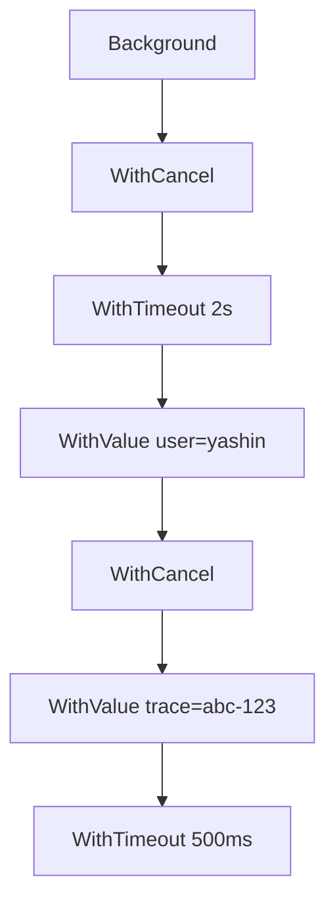

# Context Tree — Tasks

[← Back to index](junior.md)

A graded list of hands-on exercises. Work them in order; each builds on the last. Solutions are sketched at the end of each task — try yours first.

---

## Task 1: Sketch a Tree

**Difficulty:** beginner. **Time:** 10 minutes.

Given this code, draw the context tree by hand:

```go
a := context.Background()
b, _ := context.WithCancel(a)
c, _ := context.WithTimeout(b, 2*time.Second)
d := context.WithValue(c, "user", "yashin")
e, _ := context.WithCancel(d)
f := context.WithValue(e, "trace", "abc-123")
g, _ := context.WithTimeout(f, 500*time.Millisecond)
```

Then answer:

1. Which nodes share `c`'s effective deadline?
2. If `b` is cancelled, which nodes' `Done()` channels close?
3. Which nodes contribute to `g.Value("user")`?
4. What is the effective deadline of `g`?

**Solution sketch.** Effective deadline of `g` is `min(2s, 500ms) = 500ms` from when `c` was created. If `b` is cancelled, all of `b, c, d, e, f, g` cancel. `g.Value("user")` finds "yashin" by walking up through `f, e, d` to the `valueCtx` at `d`.

---

## Task 2: Verify Cascade Order

**Difficulty:** beginner. **Time:** 15 minutes.

Write a program that builds the tree from Task 1, attaches a goroutine to each cancelable node that logs when it sees `<-Done()`, and cancels `b`. Confirm that all descendants fire within a few microseconds.

```go
func watch(ctx context.Context, name string, ch chan<- string) {
    <-ctx.Done()
    ch <- name
}
```

Use a buffered channel to receive labels and print them in order.

**Solution sketch.** Cancellation is depth-first synchronous, but each watcher is on its own goroutine. The order in the printed slice depends on scheduler choices. The point is: every descendant fires; none is missed.

---

## Task 3: First-Deadline-Wins in Code

**Difficulty:** beginner. **Time:** 10 minutes.

Build:

```go
outer, _ := context.WithTimeout(context.Background(), 200*time.Millisecond)
inner, _ := context.WithTimeout(outer, 5*time.Second)
```

Measure how long until `inner.Done()` fires. Verify it is ~200ms, not 5 seconds. Print `inner.Err()` and confirm it is `context.DeadlineExceeded`.

**Solution sketch.** The runtime sees `outer.Deadline()` already exists at 200ms < 5s, so it does not start a 5s timer for `inner`. The outer timer fires, cascades, and inner cancels at ~200ms.

---

## Task 4: Reverse Order — Inner Shorter Wins Too

**Difficulty:** beginner. **Time:** 10 minutes.

Build:

```go
outer, _ := context.WithTimeout(context.Background(), 5*time.Second)
inner, _ := context.WithTimeout(outer, 200*time.Millisecond)
```

Wait for `inner.Done()`. Then check `outer.Err()`. Is it set?

**Solution sketch.** Inner fires at 200ms. Outer is unaffected — cancellation does not flow up. `outer.Err()` is `nil` for 4.8 more seconds.

---

## Task 5: WithValue Is Transparent

**Difficulty:** beginner. **Time:** 10 minutes.

Show that `WithValue` does not introduce its own cancellation:

```go
p, cancel := context.WithCancel(context.Background())
v := context.WithValue(p, "k", "v")
```

Verify `p.Done() == v.Done()`. Show that cancelling `p` cancels `v`.

**Solution sketch.** `valueCtx` embeds the parent's `Context`, so `Done()` returns the parent's channel. Equal by value (pointer equality on the channel).

---

## Task 6: Sibling Isolation Test

**Difficulty:** beginner. **Time:** 15 minutes.

Two siblings share a parent. Cancel only one. Show:

- The cancelled sibling has `Err() == Canceled`.
- The other sibling has `Err() == nil`.
- The parent has `Err() == nil`.

```go
parent, cancelP := context.WithCancel(context.Background())
defer cancelP()

a, cancelA := context.WithCancel(parent)
defer cancelA()

b, cancelB := context.WithCancel(parent)
defer cancelB()

cancelA()
// assertions
```

---

## Task 7: Cause Walk

**Difficulty:** medium. **Time:** 20 minutes.

Build a four-level tree where the second level uses `WithCancelCause` and the third level uses plain `WithCancel`. Set the cause at level 2. Show that `Cause` at levels 3 and 4 returns the level-2 cause after cascade.

```go
l1, _ := context.WithCancel(context.Background())
l2, cancelCause := context.WithCancelCause(l1)
l3, _ := context.WithCancel(l2)
l4, _ := context.WithCancel(l3)

cancelCause(errors.New("the reason"))
// Show that context.Cause(l4) returns "the reason"
```

**Solution sketch.** `Cause` walks up looking for the nearest cancelled ancestor with a cause. From `l4` it finds the nearest cancelled ancestor (`l2`), which has the cause set. Returns it.

---

## Task 8: AfterFunc Cleanup

**Difficulty:** medium. **Time:** 20 minutes.

Open a fake `Resource` and register cleanup with `AfterFunc`. Verify:

1. Cleanup runs after cancel.
2. If `stop` is called before cancel, cleanup does not run.
3. The cleanup runs in its own goroutine (you can detect by reading `runtime.NumGoroutine()` before and during cleanup).

```go
type Resource struct{ closed atomic.Bool }
func (r *Resource) Close() { r.closed.Store(true) }

r := &Resource{}
ctx, cancel := context.WithCancel(context.Background())
stop := context.AfterFunc(ctx, r.Close)
// ...
```

Demonstrate both paths.

---

## Task 9: WithoutCancel Detachment

**Difficulty:** medium. **Time:** 25 minutes.

Build a request scenario:

```go
req, cancel := context.WithTimeout(context.Background(), 100*time.Millisecond)
defer cancel()
req = context.WithValue(req, "trace", "abc")

detached := context.WithoutCancel(req)
detachedBudget, dCancel := context.WithTimeout(detached, 1*time.Second)
defer dCancel()
```

Verify:

1. `req.Done()` fires at 100ms.
2. `detachedBudget.Done()` fires at 1s (its own timeout), not at 100ms.
3. `detachedBudget.Value("trace")` still returns "abc".

---

## Task 10: Build a Pool With Shared Cancel

**Difficulty:** medium. **Time:** 40 minutes.

Implement a worker pool with N goroutines that all share one parent context. A `Shutdown()` call on the pool cancels the parent, cascading to all workers.

```go
type Pool struct {
    ctx    context.Context
    cancel context.CancelFunc
    wg     sync.WaitGroup
}

func NewPool(n int, work func(context.Context)) *Pool {
    ctx, cancel := context.WithCancel(context.Background())
    p := &Pool{ctx: ctx, cancel: cancel}
    p.wg.Add(n)
    for i := 0; i < n; i++ {
        go func() {
            defer p.wg.Done()
            for {
                select {
                case <-ctx.Done():
                    return
                default:
                    work(ctx)
                }
            }
        }()
    }
    return p
}

func (p *Pool) Shutdown() {
    p.cancel()
    p.wg.Wait()
}
```

Test: start a pool of 100, call Shutdown, verify all 100 exit. Measure cascade time with `time.Now()` around the cancel.

---

## Task 11: Fan-Out With Cascade

**Difficulty:** medium. **Time:** 30 minutes.

Spawn 5 goroutines that each call a fake service with a per-call `WithTimeout(parent, 1*time.Second)`. If any service fails, cancel the parent and watch the others cascade-cancel.

```go
parent, cancel := context.WithCancel(context.Background())
defer cancel()

var eg errgroup.Group
for i, name := range []string{"a", "b", "c", "d", "e"} {
    i, name := i, name
    eg.Go(func() error {
        sub, subCancel := context.WithTimeout(parent, time.Second)
        defer subCancel()
        return call(sub, name, i)
    })
}
if err := eg.Wait(); err != nil { /* parent cancelled */ }
```

Make `call("c", ...)` fail intentionally. Verify that the others observe `<-sub.Done()` triggered by parent cancellation (via `errgroup.WithContext` if you use that variant).

---

## Task 12: Cause Attribution

**Difficulty:** medium. **Time:** 30 minutes.

Combine `errgroup` with `WithCancelCause`. The first failing worker sets the cause; other workers, when they cancel, can attribute the failure.

```go
ctx, cancel := context.WithCancelCause(context.Background())
defer cancel(nil)

var wg sync.WaitGroup
for _, name := range []string{"a", "b", "c"} {
    name := name
    wg.Add(1)
    go func() {
        defer wg.Done()
        if err := doWork(ctx, name); err != nil {
            cancel(fmt.Errorf("worker %s: %w", name, err))
        }
    }()
}
wg.Wait()

if c := context.Cause(ctx); c != nil && !errors.Is(c, context.Canceled) {
    fmt.Println("attributed cause:", c)
}
```

---

## Task 13: AfterFunc vs Goroutine Benchmark

**Difficulty:** hard. **Time:** 45 minutes.

Benchmark two implementations of "close 1000 connections on cancellation":

A. The pre-1.21 pattern: 1000 goroutines each on `<-ctx.Done()`.
B. The 1.21 pattern: 1000 `AfterFunc` registrations.

Measure:

- `runtime.NumGoroutine()` before cancel.
- Time from `cancel()` to all closes complete.
- Allocations per registration.

**Expected results.** B has 1000 fewer steady-state goroutines. A may complete cascade faster because all goroutines are already running on Done; B spawns goroutines on cancel. Trade memory for cancel latency.

---

## Task 14: Visualise Your Own Tree

**Difficulty:** hard. **Time:** 1 hour.

Write a custom wrapper that records each `With...` call into a registry, plus the parent pointer. Render the live tree as Graphviz DOT and Mermaid.

```go
type Node struct {
    ID       string
    Kind     string
    Parent   *Node
    Label    string
    Created  time.Time
    Cancelled atomic.Bool
}

var registry sync.Map // map[uintptr]*Node

func WithCancel(parent context.Context, label string) (context.Context, context.CancelFunc) {
    ctx, cancel := context.WithCancel(parent)
    n := &Node{ /* ... */ }
    registry.Store(uintptr(unsafe.Pointer(&ctx)), n)
    return ctx, func() {
        n.Cancelled.Store(true)
        cancel()
    }
}

func DumpDOT() string { /* iterate registry, build DOT */ }
```

Render a snapshot mid-flight to a file. Open with `dot -Tpng tree.dot -o tree.png`.

---

## Task 15: Deep Tree Allocation

**Difficulty:** hard. **Time:** 40 minutes.

Build a tree of depth 100 with alternating `WithValue` and `WithCancel`. Measure:

- Total allocations (use `testing.B` + `-benchmem`).
- `Value(k)` lookup time at depth 100 (use `time.Now()` deltas).
- Cascade time on cancel of the root.

Then build a tree of width 100 (one parent, 100 children) and compare.

**Expected results.** Depth costs `Value` lookups. Width costs cascade time. Mixed real trees have moderate amounts of both.

---

## Task 16: Custom Context Watcher

**Difficulty:** hard. **Time:** 1 hour.

Implement a "custom" context that wraps a standard context but overrides `Done()`. Derive 10,000 `WithCancel` children from it. Measure `runtime.NumGoroutine()` before and after.

```go
type customCtx struct {
    context.Context
}
func (c customCtx) Done() <-chan struct{} { return c.Context.Done() }
// implement Value carelessly to break the cancelCtxKey shortcut

base, _ := context.WithCancel(context.Background())
custom := customCtx{Context: base}

for i := 0; i < 10000; i++ {
    context.WithCancel(custom)
}
fmt.Println(runtime.NumGoroutine())
```

You should see ~10000 watcher goroutines if the parent shortcut is broken. Fix the custom context to forward `Value(&cancelCtxKey)` correctly (this is internal, so the fix is to drop the custom context entirely — that is the lesson).

---

## Task 17: AfterFunc Chained Cleanup

**Difficulty:** hard. **Time:** 40 minutes.

Use `AfterFunc` to build an ordered cleanup chain:

1. Close DB connection.
2. Then flush logs.
3. Then notify metrics.

```go
ctx, cancel := context.WithCancel(context.Background())
context.AfterFunc(ctx, func() {
    db.Close()
    logs.Flush()
    metrics.Flush()
})
```

vs. three separate `AfterFunc` calls. Which preserves order? (Answer: a single AfterFunc with three statements. Multiple AfterFuncs run in parallel goroutines; order is not guaranteed.)

---

## Task 18: Implement WithoutCancel Yourself

**Difficulty:** hard. **Time:** 1 hour.

Pre-1.21 there was no `WithoutCancel`. Implement it as a wrapper:

```go
type withoutCancelCtx struct{ context.Context }
func (withoutCancelCtx) Deadline() (time.Time, bool) { return time.Time{}, false }
func (withoutCancelCtx) Done() <-chan struct{}        { return nil }
func (withoutCancelCtx) Err() error                   { return nil }

func WithoutCancel(parent context.Context) context.Context {
    return withoutCancelCtx{Context: parent}
}
```

Test: derive a `WithTimeout` from your wrapper. Verify the deadline applies, but the parent's cancellation does not propagate. Compare your version to the standard `context.WithoutCancel` in Go 1.21+.

**Discussion.** Your implementation is a "custom context" — every cancellable child will spawn a watcher. The standard library's version registers without watcher because the runtime knows about it.

---

## Task 19: Cascading Resource Cleanup

**Difficulty:** hard. **Time:** 1 hour.

Build a small HTTP server. For each request:

1. Open a DB transaction.
2. Acquire a Redis lock.
3. Spawn a goroutine for streaming.

Wire cleanup with `AfterFunc` so that:

- DB tx is rolled back on cancellation.
- Redis lock is released.
- Streaming goroutine is signalled to exit.

The request handler returns; if the client disconnects mid-flight, every resource cleans up automatically via the cascade.

---

## Task 20: Tree Snapshot via Reflection

**Difficulty:** very hard. **Time:** 2 hours.

Use reflection to walk a context tree at runtime. Hint: every `cancelCtx` embeds `Context`; you can recover the parent via `reflect.ValueOf(ctx).Elem().FieldByName("Context")`. The `children` field is unexported but accessible via `unsafe`.

This is for diagnostics only. Productionising it is a bad idea. The exercise teaches the structure.

---

## Task 21: Detect Leaked Cancels

**Difficulty:** very hard. **Time:** 2 hours.

Write a test helper that, after a test finishes, verifies no `cancelCtx` allocated during the test is still uncancelled. Use a finalizer:

```go
func WatchCancel(ctx context.Context, cancel context.CancelFunc) (context.Context, context.CancelFunc) {
    var called atomic.Bool
    wrapped := func() {
        called.Store(true)
        cancel()
    }
    runtime.SetFinalizer(&ctx, func(*context.Context) {
        if !called.Load() {
            log.Println("LEAK: cancel never called")
        }
    })
    return ctx, wrapped
}
```

Build a test that uses `WithCancel` and forgets to defer the cancel; force GC; verify the finalizer reports the leak.

---

## Task 22: Reproduce a Real Production Bug

**Difficulty:** very hard. **Time:** 3 hours.

Reproduce the "cascade storm" from `senior.md`:

1. Create a pool of 50,000 idle goroutines, each holding a `WithCancel(rootCtx)`.
2. Cancel rootCtx repeatedly (every 100ms).
3. Measure latency added to each cancel call.
4. Observe `pprof` block profile.

Then refactor: workers share `rootCtx` directly without per-worker derivations. Re-measure.

---

## Quick Reference Solutions

For Task 1's tree:



For Task 7, `context.Cause(l4)` returns the cause set on `l2` because the walk finds `l2` as the nearest cancelled ancestor with a non-nil cause.

For Task 18, your hand-rolled `WithoutCancel` works but pays the goroutine watcher tax on every cancellable child. The standard library implementation avoids the tax.
