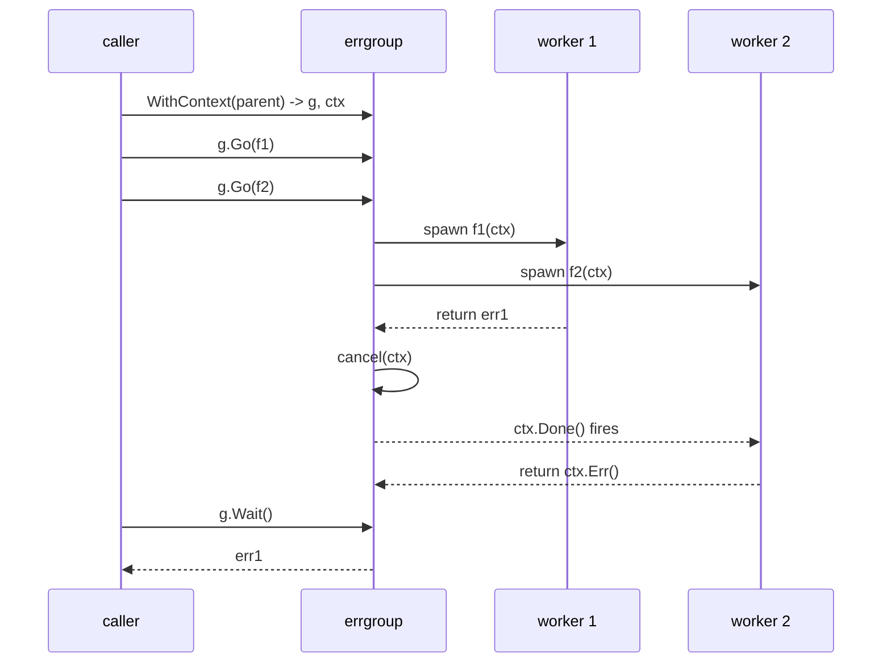

# errgroup — Junior Level

## Table of Contents
1. [Introduction](#introduction)
2. [Prerequisites](#prerequisites)
3. [Glossary](#glossary)
4. [Core Concepts](#core-concepts)
5. [Real-World Analogies](#real-world-analogies)
6. [Mental Models](#mental-models)
7. [Pros & Cons](#pros--cons)
8. [Use Cases](#use-cases)
9. [Code Examples](#code-examples)
10. [Coding Patterns](#coding-patterns)
11. [Clean Code](#clean-code)
12. [Product Use / Feature](#product-use--feature)
13. [Error Handling](#error-handling)
14. [Security Considerations](#security-considerations)
15. [Performance Tips](#performance-tips)
16. [Best Practices](#best-practices)
17. [Edge Cases & Pitfalls](#edge-cases--pitfalls)
18. [Common Mistakes](#common-mistakes)
19. [Common Misconceptions](#common-misconceptions)
20. [Tricky Points](#tricky-points)
21. [Test](#test)
22. [Tricky Questions](#tricky-questions)
23. [Cheat Sheet](#cheat-sheet)
24. [Self-Assessment Checklist](#self-assessment-checklist)
25. [Summary](#summary)
26. [What You Can Build](#what-you-can-build)
27. [Further Reading](#further-reading)
28. [Related Topics](#related-topics)
29. [Diagrams & Visual Aids](#diagrams--visual-aids)

---

## Introduction
> Focus: "I want to run N things in parallel, wait for all of them, stop on the first error, and avoid writing the same `WaitGroup + chan error` plumbing for the tenth time."

`golang.org/x/sync/errgroup` is a small, focused helper that solves one extremely common Go problem: **launching a group of goroutines, waiting for them to finish, and collecting an error if any of them failed.** It lives in the `golang.org/x/sync` repository (officially maintained by the Go team, but outside the standard library so it can evolve faster than the six-month Go release cycle).

If you have ever written code that looks like this:

```go
var wg sync.WaitGroup
errCh := make(chan error, len(items))
for _, item := range items {
    wg.Add(1)
    go func(it Item) {
        defer wg.Done()
        if err := process(it); err != nil {
            errCh <- err
        }
    }(item)
}
wg.Wait()
close(errCh)
var firstErr error
for err := range errCh {
    if firstErr == nil {
        firstErr = err
    }
}
if firstErr != nil { ... }
```

…then `errgroup` is for you. The same problem with `errgroup`:

```go
var g errgroup.Group
for _, item := range items {
    item := item
    g.Go(func() error { return process(item) })
}
if err := g.Wait(); err != nil { ... }
```

Three lines do the work of fifteen. And the `errgroup` version is harder to get wrong: there is no buffered-channel sizing question, no missed `wg.Add`, no missed `close(errCh)`, no question about whether the error channel must be buffered.

After this file you will:

- Understand what an `errgroup.Group` is and how it differs from a `sync.WaitGroup`.
- Know the four core methods: `Go`, `TryGo`, `Wait`, `SetLimit`.
- Know `errgroup.WithContext` and why it makes cancellation almost automatic.
- Be able to convert hand-rolled "launch N, wait, collect first error" code to errgroup in your sleep.
- Recognise the loop-variable capture trap (still relevant if your code must compile on Go &lt; 1.22).
- Recognise the "ignored context" anti-pattern that defeats the whole point of `WithContext`.

You do *not* need to know the internal struct fields, the `sync.Once` mechanics, or how `errgroup` interacts with `semaphore` for bounded fan-out at scale. Those come at middle/senior/professional level.

---

## Prerequisites

- **Required:** Comfort with goroutines and the `go` keyword. Read `07-concurrency/01-goroutines/01-overview/junior.md` first if you have not.
- **Required:** Knowledge of `sync.WaitGroup`. Read `07-concurrency/03-sync-package/02-waitgroups/junior.md` first if you have not. `errgroup` is essentially a `WaitGroup` plus error handling, so the mental model carries over.
- **Required:** Awareness of `context.Context`. You need to know what `ctx.Done()` and `ctx.Err()` mean, even if you have never built a `context.WithCancel` yourself.
- **Required:** A Go installation, version 1.18 or newer. `SetLimit` requires `golang.org/x/sync` from August 2022 or later. `TryGo` requires `golang.org/x/sync` from May 2023 or later. Run `go get golang.org/x/sync@latest` to be safe.
- **Helpful:** Familiarity with the `for ... := range` loop and closures. You will be writing many `g.Go(func() error { ... })` blocks.

To install:

```bash
go get golang.org/x/sync/errgroup
```

Import it as:

```go
import "golang.org/x/sync/errgroup"
```

---

## Glossary

| Term | Definition |
|------|-----------|
| **`errgroup.Group`** | The type you instantiate. Bundles a `sync.WaitGroup`, a `sync.Once`, and (optionally) a cancel function from a derived context. Zero value is ready to use. |
| **`g.Go(f)`** | Spawns a goroutine running `f`. The function `f` has signature `func() error`. If `f` returns a non-nil error, the group remembers the *first* such error and (if created via `WithContext`) cancels the derived context. |
| **`g.Wait()`** | Blocks until all goroutines spawned by `Go` and `TryGo` have returned. Returns the first non-nil error, or `nil` if all succeeded. |
| **`g.TryGo(f)`** | Like `Go`, but if a concurrency limit is set and currently full, returns `false` immediately instead of blocking. Returns `true` if the goroutine started. |
| **`g.SetLimit(n)`** | Caps the number of *currently running* goroutines at `n`. Subsequent `Go` calls block until a slot is free. `SetLimit(-1)` removes the limit (the default). |
| **`errgroup.WithContext(parent)`** | Returns `(g, ctx)`. `ctx` is a child of `parent` that gets cancelled the moment any goroutine in `g` returns a non-nil error, or when `Wait` returns. |
| **First error** | The first non-nil error returned by any goroutine in the group. Subsequent errors are silently dropped. |
| **Derived context** | The `ctx` returned by `WithContext`. Goroutines in the group should read it via `ctx.Done()` and exit early when it fires. |
| **Bounded fan-out** | A pattern where you spawn many tasks but cap how many run at once. `SetLimit` + `Go` is the canonical Go implementation. |
| **Structured concurrency** | The discipline that all goroutines spawned by a function complete before the function returns. `errgroup` is Go's best primitive for this discipline. |

---

## Core Concepts

### `errgroup.Group` is a WaitGroup that also tracks an error

At its heart, `errgroup.Group` is what you would build if you took `sync.WaitGroup` and bolted on:

1. A place to remember the first error any goroutine returned.
2. A function-shaped API (`Go(func() error)`) so you do not have to write `Add(1)` and `defer Done()` yourself.
3. Optionally, a `context.CancelFunc` that fires on the first error.

That is essentially the whole package. The implementation is under 100 lines of Go.

### The zero value is ready to use

```go
var g errgroup.Group
g.Go(func() error { return doA() })
g.Go(func() error { return doB() })
if err := g.Wait(); err != nil { ... }
```

You do **not** need to call any constructor unless you want a derived context. The zero value works.

### `WithContext` ties cancellation to the first error

If any goroutine in the group fails, you usually want the others to stop too — there is no point in continuing to fetch URLs after you know the request will fail anyway. `errgroup.WithContext` builds this behaviour in:

```go
g, ctx := errgroup.WithContext(parentCtx)
for _, url := range urls {
    url := url
    g.Go(func() error {
        return fetch(ctx, url) // pass ctx down so cancellation actually stops fetch
    })
}
err := g.Wait()
```

The flow:

1. You call `WithContext(parent)`. It returns a child `ctx` and a `Group`.
2. Each goroutine runs and either returns `nil` or an error.
3. The *first* goroutine that returns a non-nil error triggers `cancel(ctx)`. Now `ctx.Done()` fires.
4. Other goroutines, *if they check `ctx.Done()`*, can exit early.
5. `Wait` returns that first error.
6. `Wait` also calls `cancel(ctx)` on the way out, so the derived context is always released.

The critical phrase is *if they check `ctx.Done()`*. The errgroup library cannot *force* your goroutines to stop. It can only fire a cancellation signal. Your code must read it. We will come back to this in Anti-patterns.

### "First error wins" — the others are silently dropped

If three goroutines fail with three different errors, only the first one (whichever the runtime happens to deliver first) is returned by `Wait`. The other two errors are discarded. The library does not collect them into a list, nor does it call `errors.Join`. If you need every error, you must collect them yourself or use a different library.

This is a deliberate design choice. In most real workloads, when several things fail simultaneously they fail for the *same* underlying reason — the database is down, the network is partitioned. Returning one representative error is usually enough.

### `Go` does the `wg.Add(1)` and `defer wg.Done()` for you

```go
// Manual:
wg.Add(1)
go func() {
    defer wg.Done()
    work()
}()

// errgroup:
g.Go(func() error {
    work()
    return nil
})
```

You can no longer forget the `Add(1)`. You can no longer forget the `Done()` (well, you can if you do something pathological, but you cannot accidentally).

### `SetLimit` is the simplest way to bound concurrency

```go
var g errgroup.Group
g.SetLimit(8) // at most 8 goroutines running at once

for _, url := range thousandsOfURLs {
    url := url
    g.Go(func() error { return fetch(url) })
}
g.Wait()
```

Without `SetLimit`, the loop spawns thousands of goroutines instantly. With `SetLimit(8)`, the loop *blocks* on the ninth call to `Go` until one of the first eight finishes. You get a built-in semaphore for free.

`SetLimit(-1)` is the default (unbounded). `SetLimit(0)` is a special case that effectively disables `Go` (any call blocks forever); avoid it.

You must call `SetLimit` *before* the first `Go` or `TryGo`. Calling it later panics. We will revisit this in Edge Cases.

### `TryGo` returns `false` instead of blocking

When you have a limit and you want to push tasks but not pile up:

```go
var g errgroup.Group
g.SetLimit(8)

for _, url := range urls {
    url := url
    if !g.TryGo(func() error { return fetch(url) }) {
        // limit is full right now — handle the overflow some other way
        log.Println("dropping or queueing:", url)
    }
}
g.Wait()
```

`TryGo` is useful when you would rather *skip* a task (or push it onto a backlog) than make the producer wait. It is a Go 1.21+ addition to `x/sync`.

---

## Real-World Analogies

### A team of contractors with a foreman

`errgroup.Group` is a small construction foreman. You walk up and say "here is a job" (`g.Go(f)`). The foreman dispatches a contractor (goroutine) to do it. You say "let me know when everyone is done" (`g.Wait()`). The foreman returns when the last contractor reports back. If any contractor came back with bad news (`return err`), the foreman remembers the first piece of bad news and hands it to you. If you bought the "with context" upgrade (`WithContext`), the foreman also blows a whistle the moment the first piece of bad news comes in, and any contractor who is paying attention puts down their tools and goes home.

### A team that does not listen to the whistle

If you do *not* propagate `ctx` into your contractors, the whistle still blows but no one hears it. The first error is recorded, but the other contractors keep working until they finish their original task. The "stop early on error" promise is only kept by code that actually reads `ctx.Done()`. This is the single most common misuse of `errgroup`.

### Restaurant kitchen with a "stop service" bell

`SetLimit(8)` is the rule "at most 8 dishes in the oven at any moment." When a ninth order arrives the chef waits for an oven to free up. `TryGo` is "if all 8 ovens are busy, throw this order in the bin and tell the waiter we're slammed."

---

## Mental Models

### Model 1: WaitGroup + Once + cancel

When you see `errgroup.Group`, mentally expand it to:

```go
type Group struct {
    cancel  func(error)   // from WithContext, else nil
    wg      sync.WaitGroup
    once    sync.Once
    errOnce sync.Once
    err     error
    sem     chan struct{} // from SetLimit, else nil
}
```

`Go` is `Add(1)` + spawn + `defer Done()` + `errOnce.Do(record-first-error + cancel)`. `Wait` is `wg.Wait()` + `cancel` + return `err`. That is the whole library. (The actual struct uses slightly different names; see professional.md.)

### Model 2: Errgroup does not catch panics

If any goroutine you spawn with `g.Go` panics, the panic propagates exactly as if you wrote `go func() { ... }()`. It is **not** caught by `errgroup`. It will crash your process unless you `defer recover()` inside the function yourself. The library is about errors, not panics. (Some third-party libraries like `sourcegraph/conc` do catch panics; see senior.md.)

### Model 3: Errgroup is structured concurrency, not background work

`errgroup` is for the pattern "spawn N, wait here." It is **not** for "fire and forget." If you need work that outlives the caller's function, use a different abstraction (a worker pool, a long-running goroutine that owns a channel). The whole point of `errgroup.Wait()` is that it pins the goroutines to the caller's frame.

### Model 4: The derived context dies after Wait

The `ctx` returned by `WithContext` is cancelled as soon as `Wait` returns. **Do not use it after that.** Operations that read `ctx.Done()` will immediately fire. Operations that read `ctx.Err()` will return `context.Canceled`. This is correct cleanup, but it surprises people who pass that `ctx` into a follow-up function call that runs *after* `Wait`.

---

## Pros & Cons

### Pros

- **Eliminates boilerplate.** No `wg.Add`, no `chan error`, no `close(errCh)`, no first-error loop. Fewer lines means fewer bugs.
- **Built-in cancellation.** `WithContext` automates the "stop the rest on first error" pattern that everyone hand-rolls.
- **Built-in concurrency limit.** `SetLimit` removes the need for a separate `semaphore.Weighted` for the common "cap at N" case.
- **First-party maintained.** Lives in `golang.org/x/sync`, written by the Go team, used inside Kubernetes, Prometheus, gRPC, and most Go infrastructure.
- **Tiny surface area.** Four methods, one constructor. You can learn the whole API in five minutes.
- **Composable.** Nest groups, combine with `context.WithTimeout`, layer on top of `semaphore.Weighted` when you need weighted concurrency.

### Cons

- **No panic recovery.** A panic in any goroutine still kills the process. You must recover yourself.
- **Only the first error is returned.** If you need every error, you must collect them in your own slice (and a mutex).
- **`ctx.Done()` must be respected by your code.** The library cancels the context, but it cannot interrupt a tight CPU loop or a blocking I/O call that does not accept a context.
- **Loop-variable capture is still your problem.** `errgroup` does nothing special with closures; you must still write `item := item` (or use Go 1.22+).
- **Not in the standard library.** You take a `golang.org/x/sync` dependency. In practice almost every Go project already does, but pedantic shops may forbid it.
- **No introspection.** No "how many goroutines are running right now?" API. If you need that, use a custom semaphore.

---

## Use Cases

| Scenario | Why errgroup is the right tool |
|---|---|
| Fetch N URLs in parallel and abort on the first 5xx | `WithContext` + `Go` + `fetch(ctx, url)` is six lines. |
| Parallel `map` over a slice with bounded concurrency | `SetLimit(N)` + `Go` per element. |
| Service startup: launch DB, cache, and HTTP server, fail fast on first init error | Each component runs in its own `Go`, `WithContext` cancels the others. |
| Database query fan-out: query 10 shards in parallel | `Go` per shard, `Wait` returns the first error, derived ctx cancels the slow ones. |
| ETL pipeline stages run in parallel until any stage fails | Each stage is a `Go`, error propagates upstream and downstream via shared `ctx`. |
| Crawler with per-host limit | `SetLimit` for site-friendliness, `TryGo` to drop excess URLs. |

| Scenario | Where errgroup is *not* the right tool |
|---|---|
| Background work that should outlive the caller | Use a worker pool or a long-running goroutine, not errgroup. |
| You need *every* error, not just the first | Collect into a `[]error` with a `Mutex`, or use `errors.Join`, or use `conc.WaitGroup`. |
| You must recover panics and turn them into errors | Use `conc.WaitGroup` or hand-roll with `defer recover()`. |
| Streaming pipelines with channels between stages | Use channels and a `select`; errgroup helps for the "wait for all stages" part only. |
| Per-task weights (e.g., "this task uses 3 slots") | Use `semaphore.Weighted` directly; `SetLimit` only supports weight 1. |

---

## Code Examples

### Example 1: The most basic usage

```go
package main

import (
    "fmt"

    "golang.org/x/sync/errgroup"
)

func main() {
    var g errgroup.Group
    g.Go(func() error {
        fmt.Println("task A")
        return nil
    })
    g.Go(func() error {
        fmt.Println("task B")
        return nil
    })
    if err := g.Wait(); err != nil {
        fmt.Println("error:", err)
        return
    }
    fmt.Println("all done")
}
```

Output (order of A/B may vary):

```
task A
task B
all done
```

The zero value of `errgroup.Group` is ready. `Wait` returns `nil` because both goroutines returned `nil`.

### Example 2: One goroutine fails, Wait returns its error

```go
package main

import (
    "errors"
    "fmt"

    "golang.org/x/sync/errgroup"
)

func main() {
    var g errgroup.Group
    g.Go(func() error {
        return nil
    })
    g.Go(func() error {
        return errors.New("disk full")
    })
    g.Go(func() error {
        return nil
    })
    if err := g.Wait(); err != nil {
        fmt.Println("error:", err)
        return
    }
    fmt.Println("all done")
}
```

Output:

```
error: disk full
```

Note that the failing goroutine could have been any of the three; only the *first* failure matters. The successful ones returned `nil` and were not collected.

### Example 3: Fetching URLs in parallel

```go
package main

import (
    "fmt"
    "io"
    "net/http"

    "golang.org/x/sync/errgroup"
)

func main() {
    urls := []string{
        "https://example.com",
        "https://golang.org",
        "https://pkg.go.dev",
    }

    var g errgroup.Group
    sizes := make([]int, len(urls))

    for i, u := range urls {
        i, u := i, u // capture per-iteration
        g.Go(func() error {
            resp, err := http.Get(u)
            if err != nil {
                return err
            }
            defer resp.Body.Close()
            b, err := io.ReadAll(resp.Body)
            if err != nil {
                return err
            }
            sizes[i] = len(b)
            return nil
        })
    }

    if err := g.Wait(); err != nil {
        fmt.Println("fetch failed:", err)
        return
    }
    for i, s := range sizes {
        fmt.Printf("%s: %d bytes\n", urls[i], s)
    }
}
```

Key points:

- Each goroutine writes to its own index in `sizes`. Different indices, no race.
- `i, u := i, u` is the Go &lt; 1.22 idiom for per-iteration loop variables. In Go 1.22+ you can omit this.
- If any fetch fails, `Wait` returns that error and we skip the print loop.

### Example 4: Using `WithContext` for early cancellation

```go
package main

import (
    "context"
    "errors"
    "fmt"
    "net/http"

    "golang.org/x/sync/errgroup"
)

func fetch(ctx context.Context, url string) error {
    req, err := http.NewRequestWithContext(ctx, "GET", url, nil)
    if err != nil {
        return err
    }
    resp, err := http.DefaultClient.Do(req)
    if err != nil {
        return err
    }
    defer resp.Body.Close()
    if resp.StatusCode >= 500 {
        return fmt.Errorf("%s: %s", url, resp.Status)
    }
    return nil
}

func main() {
    urls := []string{
        "https://example.com",
        "https://httpstat.us/500",
        "https://example.org",
    }

    g, ctx := errgroup.WithContext(context.Background())
    for _, u := range urls {
        u := u
        g.Go(func() error { return fetch(ctx, u) })
    }
    if err := g.Wait(); err != nil {
        if errors.Is(err, context.Canceled) {
            fmt.Println("cancelled:", err)
        } else {
            fmt.Println("failed:", err)
        }
    }
}
```

When the 500 response triggers an error from one goroutine, `errgroup` cancels `ctx`. The other two HTTP requests, which were built with `http.NewRequestWithContext(ctx, ...)`, are aborted by the `net/http` client. `Wait` returns the 500 error.

### Example 5: `SetLimit` to bound parallelism

```go
package main

import (
    "fmt"
    "time"

    "golang.org/x/sync/errgroup"
)

func main() {
    var g errgroup.Group
    g.SetLimit(3) // at most 3 goroutines at once

    for i := 0; i < 10; i++ {
        i := i
        g.Go(func() error {
            fmt.Printf("start %d\n", i)
            time.Sleep(500 * time.Millisecond)
            fmt.Printf("done %d\n", i)
            return nil
        })
    }
    g.Wait()
}
```

Even though we ask for 10 tasks, only 3 run concurrently. The loop blocks on the 4th call to `g.Go` until one of the first 3 finishes. The total wall time is roughly `ceil(10/3) * 500ms` ≈ 2 seconds, not 500 ms.

### Example 6: `TryGo` to skip when full

```go
package main

import (
    "fmt"
    "time"

    "golang.org/x/sync/errgroup"
)

func main() {
    var g errgroup.Group
    g.SetLimit(2)

    for i := 0; i < 5; i++ {
        i := i
        if !g.TryGo(func() error {
            time.Sleep(200 * time.Millisecond)
            fmt.Printf("ran %d\n", i)
            return nil
        }) {
            fmt.Printf("skipped %d\n", i)
        }
    }
    g.Wait()
}
```

The first two calls to `TryGo` succeed (slots 1 and 2). The next three find both slots busy and return `false` immediately. You see two `ran` lines and three `skipped` lines. `TryGo` never blocks the caller.

### Example 7: Convert manual `WaitGroup + chan error` to errgroup

Manual version:

```go
func processAll(items []Item) error {
    var wg sync.WaitGroup
    errCh := make(chan error, len(items))
    for _, item := range items {
        wg.Add(1)
        go func(it Item) {
            defer wg.Done()
            if err := process(it); err != nil {
                errCh <- err
            }
        }(item)
    }
    wg.Wait()
    close(errCh)
    for err := range errCh {
        return err // first error
    }
    return nil
}
```

Errgroup version:

```go
func processAll(items []Item) error {
    var g errgroup.Group
    for _, item := range items {
        item := item
        g.Go(func() error { return process(item) })
    }
    return g.Wait()
}
```

Sixteen lines becomes six. The errgroup version is also correct: the manual version has a subtle leak — if `len(errCh) > 1` and the first iteration returns, the deferred closes are fine, but the buffered channel is collected by GC; nothing is leaked but the early-return-from-range is unusual style. The errgroup version is clearer.

### Example 8: Combine with `context.WithTimeout`

```go
ctx, cancel := context.WithTimeout(context.Background(), 5*time.Second)
defer cancel()

g, ctx := errgroup.WithContext(ctx)
for _, item := range items {
    item := item
    g.Go(func() error { return process(ctx, item) })
}
if err := g.Wait(); err != nil {
    // err can be the work error, or context.DeadlineExceeded, or context.Canceled
}
```

The outer `WithTimeout` enforces a budget. The inner `WithContext` enforces "stop on first error." Both are respected.

### Example 9: Parallel map-reduce skeleton

```go
func parallelSum(ctx context.Context, nums []int) (int, error) {
    var g errgroup.Group
    g.SetLimit(runtime.NumCPU())

    partial := make([]int, len(nums))
    for i, n := range nums {
        i, n := i, n
        g.Go(func() error {
            partial[i] = heavyTransform(n)
            return nil
        })
    }
    if err := g.Wait(); err != nil {
        return 0, err
    }
    total := 0
    for _, p := range partial {
        total += p
    }
    return total, nil
}
```

Each goroutine writes to a unique slot; no race. The reduction happens after `Wait` returns, in the caller's goroutine.

### Example 10: Cancelling on first non-error condition

Sometimes you want to stop the group on success, not error. Trick: have the "winning" goroutine return a sentinel error.

```go
var errFound = errors.New("found")

g, ctx := errgroup.WithContext(ctx)
for _, candidate := range candidates {
    candidate := candidate
    g.Go(func() error {
        if matches(ctx, candidate) {
            result = candidate
            return errFound
        }
        return nil
    })
}
err := g.Wait()
if err != nil && !errors.Is(err, errFound) {
    return err
}
return nil
```

The first goroutine to find a match returns `errFound`. The context cancels. The others see `ctx.Done()` and abort. `Wait` returns `errFound`, which we treat as success.

---

## Coding Patterns

### Pattern 1: Fetch-all

```go
g, ctx := errgroup.WithContext(ctx)
results := make([]Result, len(targets))
for i, t := range targets {
    i, t := i, t
    g.Go(func() error {
        r, err := fetch(ctx, t)
        if err != nil {
            return err
        }
        results[i] = r
        return nil
    })
}
if err := g.Wait(); err != nil {
    return nil, err
}
return results, nil
```

Each task writes to its own slot. The result slice is safe because indices don't overlap.

### Pattern 2: Parallel-map with bound

```go
func parallelMap[I, O any](
    ctx context.Context,
    in []I,
    limit int,
    fn func(context.Context, I) (O, error),
) ([]O, error) {
    g, ctx := errgroup.WithContext(ctx)
    g.SetLimit(limit)

    out := make([]O, len(in))
    for i, v := range in {
        i, v := i, v
        g.Go(func() error {
            r, err := fn(ctx, v)
            if err != nil {
                return err
            }
            out[i] = r
            return nil
        })
    }
    if err := g.Wait(); err != nil {
        return nil, err
    }
    return out, nil
}
```

Generic, reusable, bounded. Use this in production.

### Pattern 3: Service-orchestration

```go
g, ctx := errgroup.WithContext(ctx)
g.Go(func() error { return startDB(ctx) })
g.Go(func() error { return startCache(ctx) })
g.Go(func() error { return startHTTP(ctx) })
return g.Wait()
```

Three long-running services. Each is supposed to run "forever" (until `ctx` cancels). If any of them returns an error, the others get cancelled and we shut down.

### Pattern 4: Producer-consumer with `TryGo`

```go
var g errgroup.Group
g.SetLimit(8)

for ev := range events {
    ev := ev
    if !g.TryGo(func() error { return handle(ev) }) {
        // can't keep up — drop or buffer
        metrics.Drops.Inc()
    }
}
g.Wait()
```

Backpressure without blocking the producer.

---

## Clean Code

- **Always capture loop variables explicitly until your minimum Go version is 1.22.** `for _, v := range items { v := v; g.Go(...) }`.
- **Pass `ctx` from `WithContext` into every function inside `g.Go`.** The whole point of `WithContext` is wasted if your worker ignores `ctx`.
- **Return the error directly from the closure.** Do not write `if err != nil { log.Println(err); return nil }` — you have just hidden the error from the group. Either return it or you do not need errgroup.
- **Keep `g.Go` bodies short.** Five lines max. Extract the real work into a named function. Closures that span 30 lines are unreadable.
- **`g.Wait()` exactly once.** Calling it twice is undefined.
- **Set the limit before the first `Go`.** Calling `SetLimit` after `Go` panics.

---

## Product Use / Feature

| Product feature | How errgroup delivers it |
|---|---|
| Web dashboard that fetches 5 backends in parallel | `WithContext` + 5 `Go` calls; first failure cancels the rest, total latency is max(individual) not sum(individual). |
| Bulk-import endpoint with bounded concurrency | `SetLimit(N)` + `Go` per row; protects downstream DB from accidental thundering-herd. |
| Health-check loop that polls N dependencies | Each dependency in its own `Go`; first unhealthy answer fails fast. |
| Multi-region replication with quorum | Fire writes to all regions via `Go`; treat partial failure with `errors.Join` after collecting. |
| Periodic crawler with per-domain politeness | `SetLimit` per domain via separate `errgroup.Group`s. |

---

## Error Handling

`errgroup` reduces error handling to "return the error from your closure." The library does the rest. Three rules:

### 1. Always return the error; don't log-and-swallow

```go
g.Go(func() error {
    if err := process(); err != nil {
        log.Println(err)
        return nil       // BUG: errgroup thinks this succeeded
    }
    return nil
})
```

If you log-and-swallow, the group sees success, the derived context is never cancelled, the other goroutines keep running for no reason, and `Wait` returns `nil`. Either return the error, or wrap-and-return.

### 2. Wrap with context for debuggability

```go
g.Go(func() error {
    if err := process(item); err != nil {
        return fmt.Errorf("processing %v: %w", item, err)
    }
    return nil
})
```

When `g.Wait` returns one error out of many possible failure points, the message should tell you which one.

### 3. Inspect the error type with `errors.Is` and `errors.As`

```go
if err := g.Wait(); err != nil {
    switch {
    case errors.Is(err, context.Canceled):
        // shutdown — usually fine
    case errors.Is(err, context.DeadlineExceeded):
        return fmt.Errorf("timeout fetching: %w", err)
    default:
        return err
    }
}
```

After `g.Wait` returns, you have a regular Go error. Treat it as one.

---

## Security Considerations

- **`SetLimit` bounds memory exhaustion.** Without a limit, a slow producer feeding `g.Go` in a tight loop can spawn millions of goroutines and OOM your process. Always set a limit when iterating untrusted-size input.
- **`WithContext` is your friend during DoS scenarios.** A timeout-bound context cancels the group on slow upstreams, preventing pile-up.
- **Do not pass secrets through error messages.** `g.Wait` returns the error. If you `return fmt.Errorf("password=%s: %w", pw, err)`, the secret is now in your logs. (This is general advice; mentioned here because errgroup makes error returns more visible.)
- **Panics still kill the process.** A panic in any errgroup goroutine terminates the program, taking down concurrent requests. If your goroutines handle untrusted input that can trigger panics (e.g., template execution, codec decoding), wrap with `defer recover()` inside the closure.

---

## Performance Tips

- **Errgroup itself is cheap.** Per-goroutine overhead is one `Add`, one channel send (if limited), and one error CAS. Negligible compared to actual work.
- **`SetLimit` uses a buffered channel internally.** It is `O(1)` per `Go`/`TryGo`. Do not roll your own.
- **Context cancellation is propagated via channel close, which is O(N) wakeups.** With 100 000 goroutines all blocked on `ctx.Done()`, cancellation wakes them all but the scheduler handles that fine.
- **Don't use errgroup for "spawn 1 goroutine."** If you have just one goroutine, the overhead of the group is not worth it. Use a plain `go` and a channel.
- **Don't use errgroup for streaming.** Errgroup is for "wait for all of these." Streaming pipelines should use channels and a `select`.

---

## Best Practices

1. Use `errgroup.WithContext` whenever the work involves I/O or cancellation should propagate.
2. Always pass `ctx` (the one returned by `WithContext`) into every blocking operation inside `g.Go`.
3. Always capture loop variables explicitly until Go 1.22 is your minimum.
4. Always call `g.SetLimit(N)` for unbounded input.
5. Always return errors from closures; never log-and-swallow.
6. Always wrap errors with `fmt.Errorf("doing X: %w", err)` so the caller can identify the failure point.
7. Always `defer recover()` inside the closure if the work can panic on bad input.
8. Never use the derived `ctx` after `g.Wait()` returns.
9. Never call `g.Wait()` more than once.
10. Prefer `errgroup` to `WaitGroup+chan error` even for two tasks — it's more readable.

---

## Edge Cases & Pitfalls

### The closure ignores `ctx.Done()`

```go
g, ctx := errgroup.WithContext(ctx)
for _, item := range items {
    item := item
    g.Go(func() error {
        return process(item) // does NOT take ctx
    })
}
g.Wait()
```

When one goroutine fails, the others keep running. `errgroup` cancelled the context but `process` doesn't know about it. The fix is to thread `ctx` through:

```go
g.Go(func() error { return process(ctx, item) })
```

### Calling `SetLimit` after `Go`

```go
var g errgroup.Group
g.Go(func() error { return nil })
g.SetLimit(4) // panic: errgroup: modify limit while there are still active goroutines
```

`SetLimit` panics if any goroutines have been started. Call it first, always.

### `SetLimit(0)`

```go
var g errgroup.Group
g.SetLimit(0)
g.Go(func() error { return nil }) // blocks forever — limit is 0, no slot will ever open
```

Don't pass 0. Pass `-1` for unbounded or a positive number for bounded.

### Using `ctx` after `Wait`

```go
g, ctx := errgroup.WithContext(parent)
g.Go(func() error { return doWork(ctx) })
g.Wait()
moreWork(ctx) // BUG: ctx is now cancelled
```

`g.Wait` cancels the derived context as part of cleanup. Use `parent` (the original) for follow-up calls.

### Re-using a `Group` after `Wait`

```go
var g errgroup.Group
g.Go(func() error { return nil })
g.Wait()
g.Go(func() error { return nil }) // undefined behaviour
```

A `Group` is single-shot. Create a new one for new work.

### Multiple goroutines mutating the same map

```go
results := make(map[string]int)
for _, k := range keys {
    k := k
    g.Go(func() error {
        results[k] = compute(k) // RACE
        return nil
    })
}
```

`errgroup` does not synchronise map writes. Use a `sync.Map`, a `sync.Mutex`, or write to a slice indexed by position.

### Loop-variable capture (Go &lt; 1.22)

```go
for _, item := range items {
    g.Go(func() error { return process(item) }) // BUG before 1.22
}
```

All goroutines see the final value of `item`. Fix: `item := item` before the call.

---

## Common Mistakes

| Mistake | Fix |
|---|---|
| Forgetting `item := item` before `g.Go` (Go &lt; 1.22) | Always capture per-iteration. Use Go 1.22+ to get this for free. |
| Ignoring `ctx` inside the closure | Thread `ctx` from `WithContext` into every blocking call. |
| Calling `g.Wait` more than once | Wait exactly once. Create new groups for new work. |
| Calling `g.SetLimit` after `g.Go` | Call `SetLimit` first. |
| Using the derived `ctx` after `Wait` | Use the parent context for post-Wait operations. |
| Log-and-swallow inside the closure | Return the error. |
| Panic in the closure without `recover` | `defer func() { recover() }()` inside if input is untrusted. |
| Mutating shared maps/slices unsafely | Use unique indices, or `sync.Mutex`, or `sync.Map`. |

---

## Common Misconceptions

> *"`errgroup` cancels my goroutines for me."* — No. It cancels the *context*. Your goroutines must observe `ctx.Done()` to stop early.

> *"`errgroup` recovers panics."* — No. Panics propagate as in any `go func()`. Use `defer recover()` yourself.

> *"`Wait` returns all errors."* — No. Only the first non-nil error. The rest are discarded.

> *"I can reuse a `Group` after `Wait`."* — No. It is single-shot. Make a new one.

> *"`SetLimit(0)` means unlimited."* — No. `-1` means unlimited. `0` means "no slot will ever be free" and `Go` blocks forever.

> *"`errgroup` is in the standard library."* — No. It is in `golang.org/x/sync`, maintained by the Go team but separate.

> *"`g.Go` returns when the goroutine finishes."* — No. It returns immediately after spawning. `Wait` is what blocks until completion.

> *"`TryGo` is like `Go` but faster."* — No. `TryGo` and `Go` have the same throughput when the limit is not reached. `TryGo` only differs when the limit is full: it returns `false` instead of blocking.

---

## Tricky Points

### `Go` may block

If a limit is set and full, `g.Go(...)` blocks until a slot is free. This is by design but surprises people who expect `Go` to be non-blocking like the `go` keyword.

### `TryGo` does *not* return an error

It returns a `bool`. `true` means the task was queued. `false` means the limit was full and nothing happened. Many people misuse it expecting it to fail with an error.

### Cancellation only stops *new* `ctx`-aware work

If your goroutine is in the middle of `time.Sleep(10 * time.Second)`, errgroup cannot interrupt it. It will continue until the sleep returns. Wrap with `select` and `ctx.Done()` or use `time.After` + `ctx.Done()` in a `select`.

### Returning `context.Canceled` from a worker is fine

```go
g.Go(func() error {
    select {
    case <-ctx.Done():
        return ctx.Err()
    case r := <-ch:
        return process(r)
    }
})
```

`Wait` will return `context.Canceled` for the first worker that hit cancellation. That is the original failure cascading; nothing to worry about.

### The first error is not necessarily the "root cause"

If goroutine A times out (returning `context.DeadlineExceeded`) and goroutine B simultaneously hits a DB error, `Wait` may return either, depending on scheduling. The "root cause" semantics is yours to define.

---

## Test

```go
package mywork_test

import (
    "context"
    "errors"
    "testing"

    "golang.org/x/sync/errgroup"
)

func TestErrgroupHappyPath(t *testing.T) {
    var g errgroup.Group
    var counter int
    for i := 0; i < 100; i++ {
        g.Go(func() error {
            // unsafe! illustrative only — see Real test below
            counter++
            return nil
        })
    }
    _ = g.Wait()
    // Don't assert on counter; it has a race. See safer version below.
}

func TestErrgroupFirstError(t *testing.T) {
    sentinel := errors.New("expected")
    var g errgroup.Group
    g.Go(func() error { return nil })
    g.Go(func() error { return sentinel })
    g.Go(func() error { return nil })
    if err := g.Wait(); !errors.Is(err, sentinel) {
        t.Fatalf("got %v, want %v", err, sentinel)
    }
}

func TestWithContextCancels(t *testing.T) {
    g, ctx := errgroup.WithContext(context.Background())
    g.Go(func() error { return errors.New("boom") })
    g.Go(func() error {
        <-ctx.Done()
        return ctx.Err()
    })
    if err := g.Wait(); err == nil {
        t.Fatal("expected error")
    }
}
```

Run with the race detector:

```bash
go test -race ./...
```

---

## Tricky Questions

**Q.** What does `g.Go(f)` return?

**A.** Nothing. `Go` returns no value. (Compare with `TryGo` which returns `bool`.)

---

**Q.** Can I call `g.Wait()` twice?

**A.** No. Behaviour is undefined; the implementation guards `wg.Wait()` with no protection. Make a new `Group`.

---

**Q.** What happens if I call `g.Go` after `g.Wait`?

**A.** Undefined. The new goroutine may run but you cannot observe its error. Make a new `Group`.

---

**Q.** Does `errgroup` use a `sync.Mutex`?

**A.** Internally it uses a `sync.WaitGroup`, a `sync.Once`, and an atomic. No mutex.

---

**Q.** What is the return type of `errgroup.WithContext`?

**A.** `(*errgroup.Group, context.Context)`. The first return is a pointer; you must use `g.Go(...)` on it.

---

**Q.** What happens if zero goroutines are spawned and I call `Wait`?

**A.** It returns `nil` immediately. The internal `WaitGroup` counter is 0; `Wait` does not block.

---

**Q.** Can I use `errgroup.Group` after copying it?

**A.** No. `errgroup.Group` contains `sync.WaitGroup` which must not be copied after first use. Pass it by pointer.

---

**Q.** What is the difference between `errgroup` and `sync.WaitGroup`?

**A.** `errgroup` adds: error collection, optional context cancellation, optional concurrency limit, and a friendlier API (`Go(func() error)` instead of `Add(1)`/`Done()`).

---

## Cheat Sheet

```go
// import
import "golang.org/x/sync/errgroup"

// basic
var g errgroup.Group
g.Go(func() error { return doX() })
g.Go(func() error { return doY() })
err := g.Wait()

// with context (recommended for I/O)
g, ctx := errgroup.WithContext(parent)
g.Go(func() error { return fetch(ctx, url) })
err := g.Wait()

// bounded
var g errgroup.Group
g.SetLimit(8)          // call before any Go
g.Go(func() error { ... })

// non-blocking spawn
if !g.TryGo(f) { /* dropped */ }

// always capture loop vars (Go < 1.22)
for _, item := range items {
    item := item
    g.Go(func() error { return process(item) })
}

// Wait returns first error or nil; ctx is cancelled on Wait return
```

---

## Self-Assessment Checklist

- [ ] I can explain `errgroup.Group` in one sentence.
- [ ] I know which of `Go`, `TryGo`, `Wait`, `SetLimit` returns a value, and what value.
- [ ] I can convert a `WaitGroup + chan error` block to `errgroup` from memory.
- [ ] I know the difference between `g.Go` and `g.TryGo`.
- [ ] I know what happens when one goroutine in a `WithContext` group returns an error.
- [ ] I know what happens if my closure ignores `ctx.Done()`.
- [ ] I know `SetLimit` must be called before `Go`, not after.
- [ ] I know `errgroup` does not recover panics.
- [ ] I know `g.Wait` returns only the first error.
- [ ] I know `errgroup` is in `golang.org/x/sync`, not the standard library.

---

## Summary

`errgroup.Group` is the canonical Go primitive for **structured concurrency**: spawn N goroutines, wait for them, collect the first error, optionally cancel the rest. It is what every Go programmer learns to reach for as the second concurrency tool after `sync.WaitGroup`.

The API is four methods (`Go`, `TryGo`, `Wait`, `SetLimit`) and one constructor (`WithContext`). The zero value works without ceremony. The `WithContext` pattern is the workhorse for I/O fan-out. `SetLimit` adds bounded concurrency without pulling in `semaphore.Weighted`. `TryGo` adds non-blocking spawn when you would rather drop than wait.

The library does *not* recover panics, does *not* collect multiple errors, and does *not* force your goroutines to read `ctx.Done()`. Those remain your responsibility. But for the 90 % of Go code that wants "do these N things in parallel and stop on the first error," errgroup is exactly the right tool.

The next step is **middle level**, where we cover `SetLimit` semantics in depth, context propagation pitfalls, and integration with `semaphore.Weighted` for weighted bounding.

---

## What You Can Build

- A multi-source dashboard backend that fetches 5 services in parallel and renders fast or fails fast.
- A bulk upload endpoint that processes 10 rows concurrently with a bound and aborts on any failure.
- A crawler that respects a per-host concurrency cap via `SetLimit`.
- A startup orchestrator that brings up DB, cache, and HTTP listener in parallel and aborts the whole boot if any fails.
- A test fixture loader that seeds multiple tables in parallel.
- A parallel-map function with bounded fan-out, ready to drop into any project.

---

## Further Reading

- Package documentation: <https://pkg.go.dev/golang.org/x/sync/errgroup>
- Source: <https://cs.opensource.google/go/x/sync/+/master:errgroup/errgroup.go>
- Bryan Mills, *Rethinking Classical Concurrency Patterns*, GopherCon 2018: <https://www.youtube.com/watch?v=5zXAHh5tJqQ>
- The Go Blog — *Pipelines and cancellation* (predecessor patterns): <https://go.dev/blog/pipelines>
- Sourcegraph blog — *Introducing conc*: <https://sourcegraph.com/blog/announcing-go-conc-better-structured-concurrency>

---

## Related Topics

- `sync.WaitGroup` — the primitive that errgroup wraps
- `context.Context` — the cancellation mechanism errgroup uses
- `golang.org/x/sync/semaphore` — weighted bounding (when `SetLimit` is not enough)
- `golang.org/x/sync/singleflight` — deduplication of concurrent calls
- Structured concurrency in other languages: Kotlin's `coroutineScope`, Trio's `nursery`

---

## Diagrams & Visual Aids

### Errgroup mental schematic

```
                         +----------------------+
              g.Go(f) -> |  Group               |
              g.Go(f) -> |   wg (counter)       |
              g.Go(f) -> |   errOnce + err      |
                         |   cancel (optional)  |
                         |   sem chan (limit)   |
                         +----------------------+
                                   |
                                   v
                              g.Wait()
                              returns first err
```

### Lifecycle of a WithContext group



### Errgroup vs hand-rolled WaitGroup+chan

```
Hand-rolled:                           errgroup:
  var wg sync.WaitGroup                  var g errgroup.Group
  errCh := make(chan error, N)
  for _, x := range xs {                 for _, x := range xs {
      wg.Add(1)                              x := x
      go func(x X) {                         g.Go(func() error {
          defer wg.Done()                        return process(x)
          if err := process(x); err != nil {  })
              errCh <- err                  }
          }                                err := g.Wait()
      }(x)
  }
  wg.Wait()
  close(errCh)
  var firstErr error
  for err := range errCh {
      if firstErr == nil { firstErr = err }
  }
```

### SetLimit semantics

```
limit = 3, tasks = 6 each takes 500ms

time(ms)  0 ---- 500 ---- 1000
slot 1:   [T1 ]  [T4 ]    done
slot 2:   [T2 ]  [T5 ]    done
slot 3:   [T3 ]  [T6 ]    done

wall time = 1000 ms (not 3000)
producer: 4th g.Go() blocks at t=0 until t=500
```

### "Ignored ctx" anti-pattern

```
                    [g, ctx := WithContext(p)]
                              |
                              v
              g.Go(func() error {
                  return slowWork(item)   <-- ignores ctx!
              })
                              |
                ctx cancelled at t=100ms
                              |
                slowWork still runs until t=10s
                              |
                Wait() returns at t=10s, not t=100ms
```
